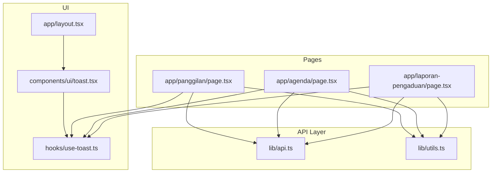
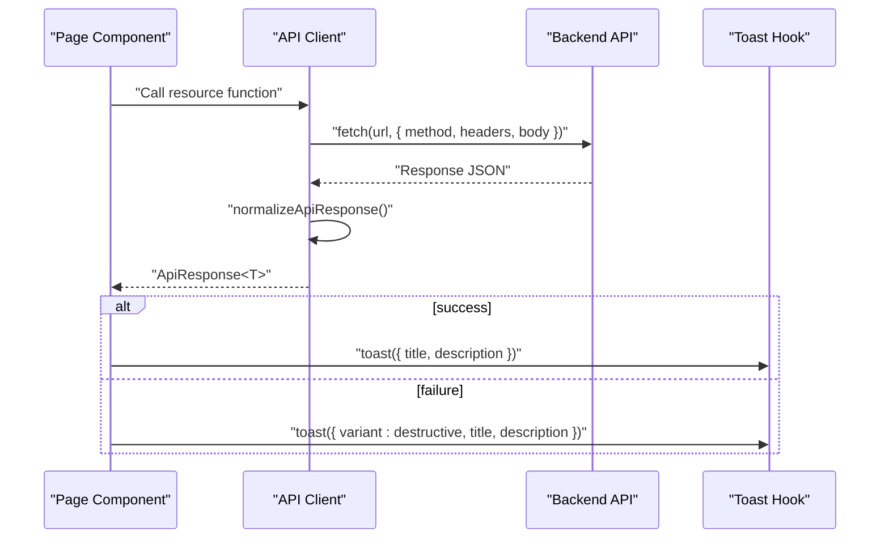
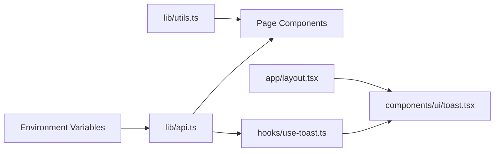

# API Integration

<cite>
**Referenced Files in This Document**
- [api.ts](file://lib/api.ts)
- [use-toast.ts](file://hooks/use-toast.ts)
- [toast.tsx](file://components/ui/toast.tsx)
- [layout.tsx](file://app/layout.tsx)
- [panggilan/page.tsx](file://app/panggilan/page.tsx)
- [agenda/page.tsx](file://app/agenda/page.tsx)
- [laporan-pengaduan/page.tsx](file://app/laporan-pengaduan/page.tsx)
- [utils.ts](file://lib/utils.ts)
- [package.json](file://package.json)
</cite>

## Table of Contents
1. [Introduction](#introduction)
2. [Project Structure](#project-structure)
3. [Core Components](#core-components)
4. [Architecture Overview](#architecture-overview)
5. [Detailed Component Analysis](#detailed-component-analysis)
6. [Dependency Analysis](#dependency-analysis)
7. [Performance Considerations](#performance-considerations)
8. [Troubleshooting Guide](#troubleshooting-guide)
9. [Conclusion](#conclusion)
10. [Appendices](#appendices)

## Introduction
This document describes the centralized RESTful API client and integration patterns used across the admin panel. It covers:
- Centralized API client architecture and HTTP methods
- URL patterns and request/response handling
- Authentication and response normalization
- CRUD endpoints for multiple resources
- Data models and parameter validation
- Toast notification system for user feedback and error display
- Loading states and pagination patterns
- Practical usage examples and best practices
- Caching strategies, performance optimization, and offline handling
- Troubleshooting and debugging techniques

## Project Structure
The API integration is implemented in a single centralized module that exposes typed functions for each resource. Pages consume these functions and integrate with a toast notification system for user feedback.

**Diagram sources**
- [api.ts:1-1144](file://lib/api.ts#L1-L1144)
- [use-toast.ts:1-195](file://hooks/use-toast.ts#L1-L195)
- [toast.tsx:1-130](file://components/ui/toast.tsx#L1-L130)
- [layout.tsx:1-37](file://app/layout.tsx#L1-L37)
- [panggilan/page.tsx:1-310](file://app/panggilan/page.tsx#L1-L310)
- [agenda/page.tsx:1-284](file://app/agenda/page.tsx#L1-L284)
- [laporan-pengaduan/page.tsx:1-355](file://app/laporan-pengaduan/page.tsx#L1-L355)
- [utils.ts:1-26](file://lib/utils.ts#L1-L26)

**Section sources**
- [api.ts:1-1144](file://lib/api.ts#L1-L1144)
- [use-toast.ts:1-195](file://hooks/use-toast.ts#L1-L195)
- [toast.tsx:1-130](file://components/ui/toast.tsx#L1-L130)
- [layout.tsx:1-37](file://app/layout.tsx#L1-L37)
- [panggilan/page.tsx:1-310](file://app/panggilan/page.tsx#L1-L310)
- [agenda/page.tsx:1-284](file://app/agenda/page.tsx#L1-L284)
- [laporan-pengaduan/page.tsx:1-355](file://app/laporan-pengaduan/page.tsx#L1-L355)
- [utils.ts:1-26](file://lib/utils.ts#L1-L26)

## Core Components
- Centralized API client: Provides typed functions for CRUD operations against multiple resources. It normalizes diverse server response formats into a unified shape and adds an API key header.
- Toast notification system: Provides a lightweight, Radix-based toast system with a hook for imperative notifications and a provider in the root layout.
- Page components: Consume the API client, manage loading states, pagination, and user actions, and surface feedback via the toast system.

Key responsibilities:
- API client: HTTP transport, headers, normalization, error shaping, and resource-specific endpoints.
- Toast system: Notification lifecycle, deduplication, and dismissal behavior.
- Pages: Orchestrate data fetching, pagination, editing, and deletion flows.

**Section sources**
- [api.ts:43-80](file://lib/api.ts#L43-L80)
- [api.ts:82-91](file://lib/api.ts#L82-L91)
- [use-toast.ts:1-195](file://hooks/use-toast.ts#L1-L195)
- [toast.tsx:1-130](file://components/ui/toast.tsx#L1-L130)
- [layout.tsx:1-37](file://app/layout.tsx#L1-L37)

## Architecture Overview
The system follows a layered architecture:
- UI layer (pages) orchestrates user interactions and renders data.
- API layer encapsulates HTTP calls and response normalization.
- Toast layer provides global user feedback.

**Diagram sources**
- [api.ts:53-80](file://lib/api.ts#L53-L80)
- [api.ts:82-91](file://lib/api.ts#L82-L91)
- [use-toast.ts:145-172](file://hooks/use-toast.ts#L145-L172)
- [panggilan/page.tsx:57-63](file://app/panggilan/page.tsx#L57-L63)

**Section sources**
- [api.ts:53-80](file://lib/api.ts#L53-L80)
- [api.ts:82-91](file://lib/api.ts#L82-L91)
- [use-toast.ts:145-172](file://hooks/use-toast.ts#L145-L172)
- [panggilan/page.tsx:57-63](file://app/panggilan/page.tsx#L57-L63)

## Detailed Component Analysis

### API Client: Centralized HTTP Layer
- Configuration:
  - Base URL and API key are loaded from environment variables.
  - Headers include an API key and Content-Type for JSON.
- Response normalization:
  - Supports multiple server response shapes:
    - Standard: { success: boolean, data?, message?, total?, current_page?, last_page?, per_page? }
    - Agenda API: { status: 'success'|'error', ... } mapped to standard shape
    - Fallback: { success: response.ok, data?, message? }
- HTTP methods and patterns:
  - GET: fetch lists and single records; includes query params and pagination.
  - POST: create records; supports FormData for file uploads.
  - PUT: update records; for FormData, uses POST with _method=PUT appended.
  - DELETE: remove records.
- File upload handling:
  - Several endpoints accept FormData; the client sets appropriate headers and uses POST with _method=PUT for updates.

Endpoints and patterns by resource:
- Panggilan Ghaib: getAllPanggilan, getPanggilan, createPanggilan, updatePanggilan, deletePanggilan
- Itsbat Nikah: getAllItsbat, getItsbat, createItsbat, updateItsbat, deleteItsbat
- Panggilan E-Court: getAllPanggilanEcourt, getPanggilanEcourt, createPanggilanEcourt, updatePanggilanEcourt, deletePanggilanEcourt
- Agenda Pimpinan: getAllAgenda, getAgenda, createAgenda, updateAgenda, deleteAgenda
- LHKPN Reports: getAllLhkpn, getLhkpn, createLhkpn, updateLhkpn, deleteLhkpn
- Realisasi Anggaran: getAllAnggaran, getAnggaran, createAnggaran, updateAnggaran, deleteAnggaran
- Pagu Anggaran: getAllPagu, updatePagu, deletePagu
- DIPA Pok: getAllDipaPok, getDipaPok, createDipaPok, updateDipaPok, deleteDipaPok
- Aset BMN: getAllAsetBmn, getAsetBmn, createAsetBmn, updateAsetBmn, deleteAsetBmn
- SAKIP: getAllSakip, getSakip, createSakip, updateSakip, deleteSakip
- Laporan Pengaduan: getAllLaporanPengaduan, getLaporanPengaduan, createLaporanPengaduan, updateLaporanPengaduan, deleteLaporanPengaduan
- Keuangan Perkara: getAllKeuanganPerkara, getKeuanganPerkara, createKeuanganPerkara, updateKeuanganPerkara, deleteKeuanganPerkara
- Sisa Panjar: getAllSisaPanjar, getSisaPanjar, createSisaPanjar, updateSisaPanjar, deleteSisaPanjar
- MOU: getAllMou, getMou, createMou, updateMou, deleteMou
- LRA: getAllLra, getLra, createLra, updateLra, deleteLra

Response normalization and error handling:
- normalizeApiResponse adapts server responses to a consistent shape.
- Some endpoints (e.g., Laporan Pengaduan, Keuangan Perkara) implement custom error handling that extracts field-level validation messages from JSON errors.

Caching and request options:
- Many GET endpoints set cache: 'no-store' to bypass browser caching.

Authentication:
- All requests include X-API-Key header populated from NEXT_PUBLIC_API_KEY.

**Section sources**
- [api.ts:1-1144](file://lib/api.ts#L1-L1144)

### Data Models and Parameter Validation
The API client defines TypeScript interfaces for each resource. Validation is primarily enforced by the backend; the client surfaces errors via normalized responses and toast notifications. Example models include:
- Panggilan, ItsbatNikah, AgendaPimpinan
- LhkpnReport, RealisasiAnggaran, PaguAnggaran, DipaPok
- AsetBmn, Sakip
- LaporanPengaduan (with enumerated fields)
- KeuanganPerkara, SisaPanjar, Mou, LraReport

Validation patterns:
- Enumerated fields (e.g., LaporanPengaduan.materi_pengaduan) restrict values.
- Numeric fields enforce non-negative amounts where applicable.
- Date fields are handled as ISO strings and formatted for display.

**Section sources**
- [api.ts:5-1144](file://lib/api.ts#L5-L1144)

### Toast Notification System
- Provider and components: Radix-based toast provider and UI components.
- Hook: useToast provides imperative toast creation and dismissal.
- Behavior:
  - Limit toasts to one at a time.
  - Auto-dismiss after a long timeout.
  - Dismiss on open change or explicit dismiss.
  - Expose update and dismiss helpers.

Integration:
- Root layout mounts the Toaster provider.
- Pages call toast() with title/description and optional variant for error states.

**Section sources**
- [toast.tsx:1-130](file://components/ui/toast.tsx#L1-L130)
- [use-toast.ts:1-195](file://hooks/use-toast.ts#L1-L195)
- [layout.tsx:1-37](file://app/layout.tsx#L1-L37)

### Pagination and Loading States
- Pagination:
  - Pages pass current_page and last_page from API responses to render pagination controls.
  - Some endpoints support per_page or page parameters.
- Loading:
  - Pages set loading state during fetch and render skeletons while data is loading.
  - Pagination links trigger reloads with the selected page.

**Section sources**
- [panggilan/page.tsx:35-137](file://app/panggilan/page.tsx#L35-L137)
- [agenda/page.tsx:56-131](file://app/agenda/page.tsx#L56-L131)
- [laporan-pengaduan/page.tsx:32-120](file://app/laporan-pengaduan/page.tsx#L32-L120)

### Practical Usage Examples and Best Practices
- Fetching lists with filters and pagination:
  - Use getAll* functions with optional query parameters (e.g., tahun, page, per_page).
  - Handle success/failure and update pagination state accordingly.
- Creating and updating records:
  - For file uploads, pass FormData; otherwise pass plain objects.
  - On update, FormData triggers POST with _method=PUT.
- Deleting records:
  - Confirm with an alert dialog; show success/error via toast.
- Error handling:
  - Normalize errors via API client or custom handlers.
  - Display user-friendly messages via toast.

**Section sources**
- [panggilan/page.tsx:42-90](file://app/panggilan/page.tsx#L42-L90)
- [agenda/page.tsx:62-105](file://app/agenda/page.tsx#L62-L105)
- [laporan-pengaduan/page.tsx:43-117](file://app/laporan-pengaduan/page.tsx#L43-L117)

## Dependency Analysis
- API client depends on:
  - Environment variables for base URL and API key.
  - fetch for HTTP transport.
  - Response normalization logic.
- Pages depend on:
  - API client functions.
  - Toast hook for feedback.
  - Utility functions for year options and formatting.
- Toast system depends on:
  - Radix UI primitives and Tailwind classes.
  - Root layout to mount the provider.

**Diagram sources**
- [api.ts:1-4](file://lib/api.ts#L1-L4)
- [use-toast.ts:1-195](file://hooks/use-toast.ts#L1-L195)
- [toast.tsx:1-130](file://components/ui/toast.tsx#L1-L130)
- [layout.tsx:1-37](file://app/layout.tsx#L1-L37)
- [utils.ts:1-26](file://lib/utils.ts#L1-L26)

**Section sources**
- [api.ts:1-4](file://lib/api.ts#L1-L4)
- [use-toast.ts:1-195](file://hooks/use-toast.ts#L1-L195)
- [toast.tsx:1-130](file://components/ui/toast.tsx#L1-L130)
- [layout.tsx:1-37](file://app/layout.tsx#L1-L37)
- [utils.ts:1-26](file://lib/utils.ts#L1-L26)

## Performance Considerations
- Caching:
  - Current GET endpoints use cache: 'no-store'. Consider adding caching strategies for read-heavy lists if appropriate.
- Request batching:
  - For bulk operations (e.g., seeding Laporan Pengaduan), batch requests and report partial failures.
- Network resilience:
  - Implement retry logic and exponential backoff for transient failures.
- UI responsiveness:
  - Keep loading skeletons short-lived; prefetch next pages when nearing the end.
- Offline handling:
  - Integrate service workers or local storage for read-only offline access where feasible.

[No sources needed since this section provides general guidance]

## Troubleshooting Guide
Common issues and debugging techniques:
- API connectivity:
  - Verify NEXT_PUBLIC_API_URL and NEXT_PUBLIC_API_KEY are set.
  - Check network tab for failed requests and CORS errors.
- Response parsing:
  - normalizeApiResponse handles multiple shapes; confirm server responses match expectations.
- Form submission:
  - For file uploads, ensure FormData is passed and _method=PUT is appended for updates.
- Toast not appearing:
  - Confirm Toaster is mounted in the root layout and useToast is invoked in the page.
- Pagination inconsistencies:
  - Ensure current_page and last_page from API responses are used to render pagination.

**Section sources**
- [api.ts:1-4](file://lib/api.ts#L1-L4)
- [api.ts:53-80](file://lib/api.ts#L53-L80)
- [api.ts:82-91](file://lib/api.ts#L82-L91)
- [layout.tsx:31-31](file://app/layout.tsx#L31-L31)
- [use-toast.ts:174-192](file://hooks/use-toast.ts#L174-L192)

## Conclusion
The centralized API client provides a consistent, typed interface for interacting with multiple backend resources. Combined with a robust toast notification system and well-structured pages, it enables reliable CRUD operations, responsive UIs, and clear user feedback. Extending the client with caching, retries, and offline capabilities will further improve reliability and performance.

[No sources needed since this section summarizes without analyzing specific files]

## Appendices

### Endpoint Specifications (Selected Resources)
- Panggilan Ghaib
  - GET /panggilan?page=&year=
  - GET /panggilan/:id
  - POST /panggilan (supports FormData)
  - POST /panggilan/:id (with _method=PUT for FormData)
  - DELETE /panggilan/:id
- Agenda Pimpinan
  - GET /agenda?tahun=&bulan=&page=&per_page=
  - GET /agenda/:id
  - POST /agenda
  - PUT /agenda/:id
  - DELETE /agenda/:id
- Laporan Pengaduan
  - GET /laporan-pengaduan?tahun=
  - GET /laporan-pengaduan/:id
  - POST /laporan-pengaduan
  - PUT /laporan-pengaduan/:id
  - DELETE /laporan-pengaduan/:id

Notes:
- All endpoints include X-API-Key header.
- Some endpoints return { status: 'success'|'error', ... } which is normalized to a standard shape.

**Section sources**
- [api.ts:97-149](file://lib/api.ts#L97-L149)
- [api.ts:292-334](file://lib/api.ts#L292-L334)
- [api.ts:788-850](file://lib/api.ts#L788-L850)

### UI Integration Patterns
- Loading states:
  - Set loading flag during fetch; render skeletons while loading.
- Pagination:
  - Use current_page and last_page from API responses to render navigation.
- Deletion:
  - Confirm with AlertDialog; call delete function and refresh list.
- Editing:
  - Open dialogs or forms; call update function and refresh list.

**Section sources**
- [panggilan/page.tsx:30-137](file://app/panggilan/page.tsx#L30-L137)
- [agenda/page.tsx:47-131](file://app/agenda/page.tsx#L47-L131)
- [laporan-pengaduan/page.tsx:32-120](file://app/laporan-pengaduan/page.tsx#L32-L120)