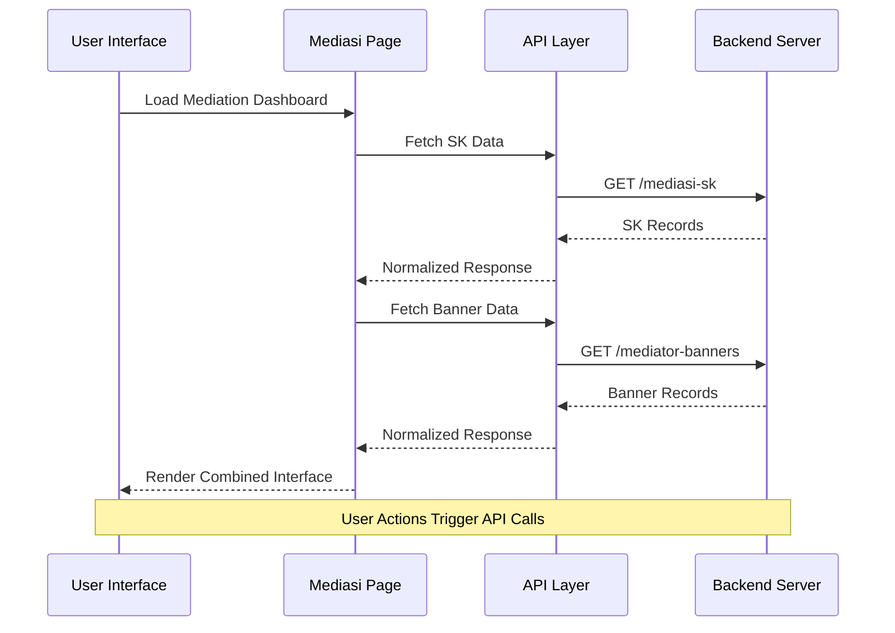
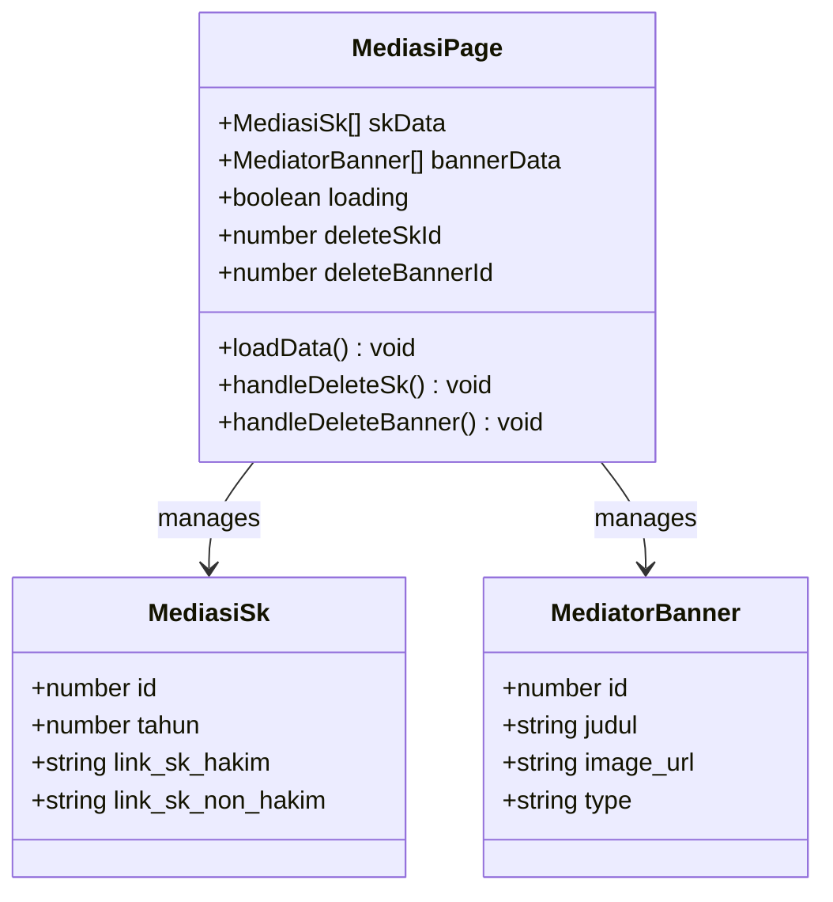
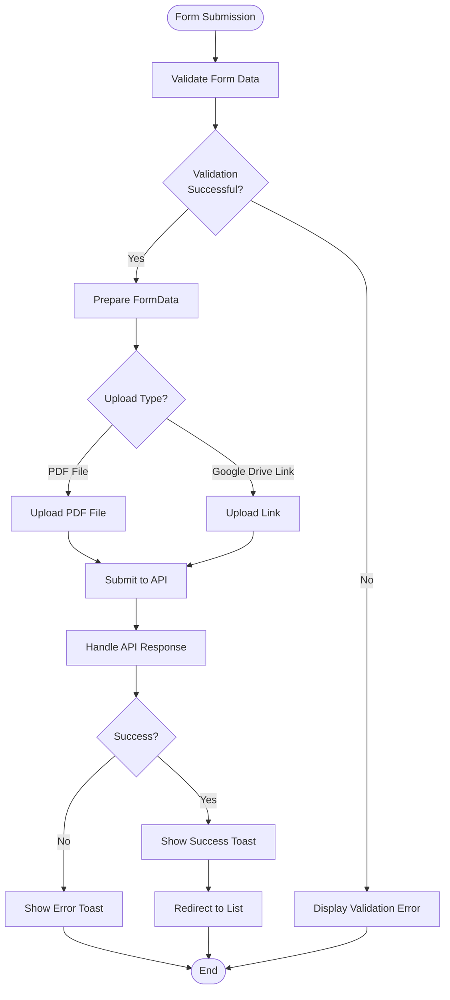
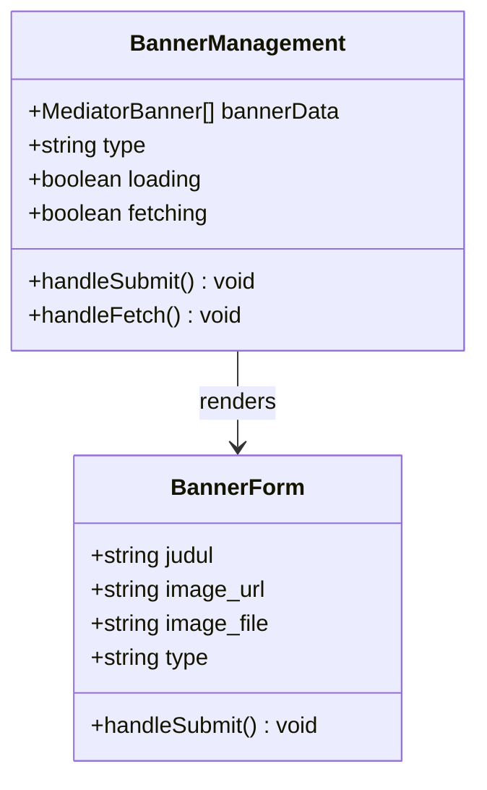

# Annual Mediation Decisions (SK)

<cite>
**Referenced Files in This Document**
- [app/mediasi/page.tsx](file://app/mediasi/page.tsx)
- [app/mediasi/sk/tambah/page.tsx](file://app/mediasi/sk/tambah/page.tsx)
- [app/mediasi/sk/[id]/edit/page.tsx](file://app/mediasi/sk/[id]/edit/page.tsx)
- [app/mediasi/banners/tambah/page.tsx](file://app/mediasi/banners/tambah/page.tsx)
- [app/mediasi/banners/[id]/edit/page.tsx](file://app/mediasi/banners/[id]/edit/page.tsx)
- [lib/api.ts](file://lib/api.ts)
- [package.json](file://package.json)
</cite>

## Table of Contents
1. [Introduction](#introduction)
2. [Project Structure](#project-structure)
3. [Core Components](#core-components)
4. [Architecture Overview](#architecture-overview)
5. [Detailed Component Analysis](#detailed-component-analysis)
6. [API Integration](#api-integration)
7. [User Interface Components](#user-interface-components)
8. [Data Management](#data-management)
9. [Performance Considerations](#performance-considerations)
10. [Troubleshooting Guide](#troubleshooting-guide)
11. [Conclusion](#conclusion)

## Introduction

The Annual Mediation Decisions (SK) module is a comprehensive administrative system designed to manage mediation decisions and related documentation within the judicial administration framework. This system provides functionality for managing annual mediation decisions (SK), mediator banners, and associated administrative tasks through an intuitive web interface built with Next.js and modern React patterns.

The module serves as a centralized platform for legal administrators to maintain records of mediation decisions, upload official documents, manage mediator presentations, and streamline administrative workflows for court-related mediation processes. The system emphasizes user-friendly interfaces, robust data management, and seamless integration with backend APIs.

## Project Structure

The Annual Mediation Decisions module follows a well-organized Next.js file-based routing structure with clear separation of concerns:

```mermaid
graph TB
subgraph "Mediation Module Structure"
Mediasi[app/mediasi/] --> Page[page.tsx]
Mediasi --> SK[sk/]
Mediasi --> Banners[banners/]
SK --> SKAdd[sk/tambah/page.tsx]
SK --> SKEdit[sk/[id]/edit/page.tsx]
Banners --> BannerAdd[banners/tambah/page.tsx]
Banners --> BannerEdit[banners/[id]/edit/page.tsx]
Mediasi --> EditSK[edit-sk/[id]/]
Mediasi --> EditBanner[edit-banner/[id]/]
end
subgraph "Shared Components"
Lib[lib/api.ts] --> API[API Functions]
Components[components/ui/] --> UI[Reusable UI Components]
end
Page --> API
SKAdd --> API
SKEdit --> API
BannerAdd --> API
BannerEdit --> API
```

**Diagram sources**
- [app/mediasi/page.tsx:1-294](file://app/mediasi/page.tsx#L1-L294)
- [app/mediasi/sk/tambah/page.tsx:1-112](file://app/mediasi/sk/tambah/page.tsx#L1-L112)
- [app/mediasi/banners/tambah/page.tsx:1-112](file://app/mediasi/banners/tambah/page.tsx#L1-L112)

The project structure demonstrates a clean separation between presentation layers (Next.js pages), business logic (API functions), and shared components, enabling maintainable and scalable development practices.

**Section sources**
- [app/mediasi/page.tsx:1-294](file://app/mediasi/page.tsx#L1-L294)
- [package.json:1-44](file://package.json#L1-L44)

## Core Components

The Annual Mediation Decisions module consists of several interconnected components that work together to provide comprehensive mediation management functionality:

### Main Mediation Dashboard
The primary interface serves as a central hub for managing all mediation-related activities, featuring tabbed navigation between SK management and banner management systems.

### SK Management System
A sophisticated form-based system for managing annual mediation decisions, supporting both PDF uploads and Google Drive link integration for official documents.

### Banner Management System
A responsive grid-based interface for managing mediator banners, supporting image uploads and external URL linking with category-specific organization.

### API Integration Layer
A unified API abstraction layer that handles all server communication, error handling, and data normalization across different mediation-related endpoints.

**Section sources**
- [app/mediasi/page.tsx:38-294](file://app/mediasi/page.tsx#L38-L294)
- [lib/api.ts:1147-1233](file://lib/api.ts#L1147-L1233)

## Architecture Overview

The system employs a modern client-side architecture with clear separation between presentation, business logic, and data layers:



**Diagram sources**
- [app/mediasi/page.tsx:46-69](file://app/mediasi/page.tsx#L46-L69)
- [lib/api.ts:1169-1204](file://lib/api.ts#L1169-L1204)

The architecture ensures efficient data loading through concurrent API calls, robust error handling, and responsive user feedback mechanisms.

**Section sources**
- [app/mediasi/page.tsx:46-69](file://app/mediasi/page.tsx#L46-L69)
- [lib/api.ts:53-80](file://lib/api.ts#L53-L80)

## Detailed Component Analysis

### Mediation Dashboard Component

The main dashboard serves as the central interface for all mediation management activities, featuring:

#### Tabbed Interface Design
- **SK Tahunan Tab**: Manages annual mediation decision documents
- **Banner Mediator Tab**: Handles mediator presentation banners

#### Data Loading and Management
- Concurrent API calls for optimal performance
- Loading skeletons for improved user experience
- Toast notifications for user feedback
- Confirmation dialogs for destructive actions



**Diagram sources**
- [app/mediasi/page.tsx:38-294](file://app/mediasi/page.tsx#L38-L294)
- [lib/api.ts:1150-1166](file://lib/api.ts#L1150-L1166)

**Section sources**
- [app/mediasi/page.tsx:38-294](file://app/mediasi/page.tsx#L38-L294)

### SK Management Forms

The system provides two complementary forms for managing annual mediation decisions:

#### Add SK Form
Features a dual-column layout for managing both Hakim and Non-Hakim SK documents with support for:
- Year selection with default current year
- PDF file upload functionality
- Google Drive link integration
- Form validation and submission handling

#### Edit SK Form
Enhanced form with:
- Pre-populated data from existing records
- Current file/link preview functionality
- Separate management for Hakim and Non-Hakim categories
- Loading states during data fetching



**Diagram sources**
- [app/mediasi/sk/tambah/page.tsx:20-38](file://app/mediasi/sk/tambah/page.tsx#L20-L38)
- [app/mediasi/sk/[id]/edit/page.tsx:43-61](file://app/mediasi/sk/[id]/edit/page.tsx#L43-L61)

**Section sources**
- [app/mediasi/sk/tambah/page.tsx:15-112](file://app/mediasi/sk/tambah/page.tsx#L15-L112)
- [app/mediasi/sk/[id]/edit/page.tsx:15-151](file://app/mediasi/sk/[id]/edit/page.tsx#L15-L151)

### Banner Management System

The banner management system provides comprehensive functionality for managing mediator presentation materials:

#### Add Banner Form
- Category selection (Hakim/Non-Hakim)
- Image upload or URL linking
- Alternative text labeling
- Responsive form layout

#### Edit Banner Form
- Enhanced editing capabilities
- Current image preview
- Category modification
- Dual-source management (upload vs URL)



**Diagram sources**
- [app/mediasi/banners/tambah/page.tsx:16-112](file://app/mediasi/banners/tambah/page.tsx#L16-L112)
- [app/mediasi/banners/[id]/edit/page.tsx:16-147](file://app/mediasi/banners/[id]/edit/page.tsx#L16-L147)

**Section sources**
- [app/mediasi/banners/tambah/page.tsx:16-112](file://app/mediasi/banners/tambah/page.tsx#L16-L112)
- [app/mediasi/banners/[id]/edit/page.tsx:16-147](file://app/mediasi/banners/[id]/edit/page.tsx#L16-L147)

## API Integration

The system utilizes a comprehensive API abstraction layer that provides consistent data access across all mediation-related functionalities:

### API Function Categories

#### Mediasi SK Operations
- `getAllMediasiSk()`: Retrieve all annual mediation decision records
- `createMediasiSk()`: Add new SK records with file upload support
- `updateMediasiSk()`: Modify existing SK records
- `deleteMediasiSk()`: Remove SK records permanently

#### Mediator Banner Operations
- `getAllMediatorBanners()`: Fetch all banner records
- `createMediatorBanner()`: Create new banner entries
- `updateMediatorBanner()`: Update existing banner information
- `deleteMediatorBanner()`: Delete banner records

### Request/Response Handling

The API layer implements standardized request handling with:
- Automatic API key injection
- FormData support for file uploads
- Response normalization across different API formats
- Comprehensive error handling and user feedback

**Section sources**
- [lib/api.ts:1147-1233](file://lib/api.ts#L1147-L1233)
- [lib/api.ts:53-80](file://lib/api.ts#L53-L80)

## User Interface Components

The system leverages a comprehensive set of reusable UI components to ensure consistency and maintainability:

### Core UI Components Used
- **Card System**: Consistent card-based layouts for data presentation
- **Form Components**: Input fields, labels, and validation displays
- **Navigation Elements**: Buttons, links, and breadcrumb navigation
- **Feedback Systems**: Toast notifications and loading indicators
- **Data Display**: Tables for structured data and grid layouts for visual content

### Responsive Design Features
- Mobile-first responsive layouts
- Adaptive grid systems for different screen sizes
- Touch-friendly interactive elements
- Accessible form controls and navigation

**Section sources**
- [app/mediasi/page.tsx:14-36](file://app/mediasi/page.tsx#L14-L36)
- [app/mediasi/sk/tambah/page.tsx:7-13](file://app/mediasi/sk/tambah/page.tsx#L7-L13)

## Data Management

The system implements robust data management strategies for handling various types of mediation-related information:

### Data Models

#### MediasiSk Model
- **Primary Fields**: Year identification, document links for both categories
- **Metadata**: Creation and update timestamps
- **Constraints**: Optional file links with validation support

#### MediatorBanner Model
- **Identification**: Unique identifiers and descriptive labels
- **Media Content**: Support for both uploaded files and external URLs
- **Classification**: Category-based organization (Hakim/Non-Hakim)

### Data Flow Patterns
- Concurrent loading for optimal performance
- Local state management with controlled updates
- Real-time data synchronization
- Graceful degradation for network failures

**Section sources**
- [lib/api.ts:1150-1166](file://lib/api.ts#L1150-L1166)

## Performance Considerations

The system incorporates several performance optimization strategies:

### Loading Optimization
- Concurrent API calls for simultaneous data fetching
- Skeleton loading states for improved perceived performance
- Efficient data caching with no-store directives
- Debounced user interactions for form submissions

### Resource Management
- Lazy loading for image assets
- Optimized form rendering with controlled re-renders
- Efficient state updates with minimal DOM manipulation
- Memory management for large datasets

### Network Efficiency
- Batched requests where appropriate
- Proper error handling to prevent cascading failures
- Connection pooling and resource reuse
- Optimized payload sizes for file uploads

## Troubleshooting Guide

### Common Issues and Solutions

#### API Connectivity Problems
- **Symptoms**: Loading spinners indefinitely, error notifications
- **Causes**: Network connectivity, API server issues, authentication failures
- **Solutions**: Verify API endpoint configuration, check network connectivity, review authentication headers

#### File Upload Failures
- **Symptoms**: Upload progress stuck, error messages during file transfer
- **Causes**: File size limits, unsupported formats, server configuration issues
- **Solutions**: Verify file format requirements, check file size limitations, review server configuration

#### Form Validation Errors
- **Symptoms**: Immediate form rejection, validation error messages
- **Causes**: Missing required fields, invalid data formats, constraint violations
- **Solutions**: Review form field requirements, validate input formats, check database constraints

#### Data Synchronization Issues
- **Symptoms**: Stale data display, inconsistent state
- **Causes**: Caching issues, concurrent modifications, network latency
- **Solutions**: Implement proper cache invalidation, handle concurrent updates, optimize network requests

**Section sources**
- [lib/api.ts:83-91](file://lib/api.ts#L83-L91)
- [app/mediasi/page.tsx:56-64](file://app/mediasi/page.tsx#L56-L64)

## Conclusion

The Annual Mediation Decisions (SK) module represents a comprehensive solution for managing mediation-related administrative tasks within judicial systems. The system successfully combines modern web technologies with robust backend integration to provide an intuitive, efficient, and scalable platform for mediation document management.

Key strengths of the implementation include:

- **Modular Architecture**: Clean separation of concerns enabling maintainable development
- **User Experience**: Responsive design with thoughtful interaction patterns
- **Data Integrity**: Robust validation and error handling mechanisms
- **Performance**: Optimized loading strategies and efficient resource management
- **Extensibility**: Well-defined API boundaries supporting future enhancements

The system provides a solid foundation for judicial administration workflows while maintaining flexibility for future requirements and scalability needs. The comprehensive error handling, user feedback mechanisms, and responsive design ensure reliable operation across diverse operational environments.