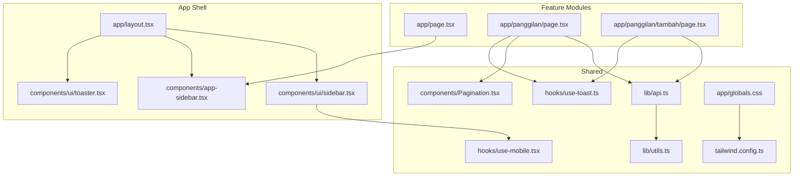
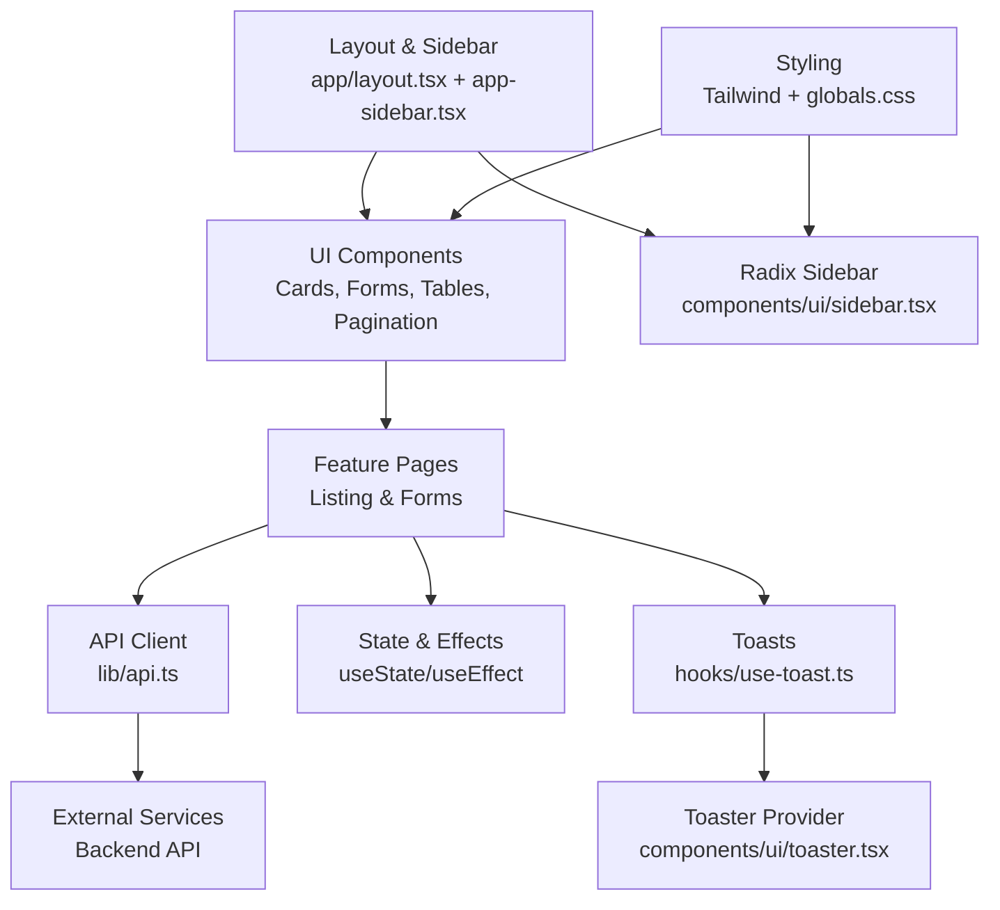
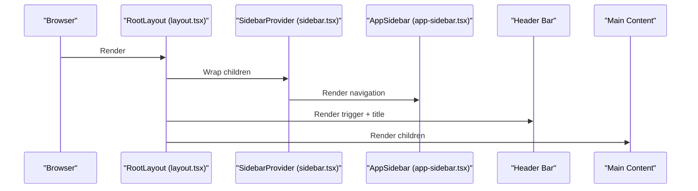
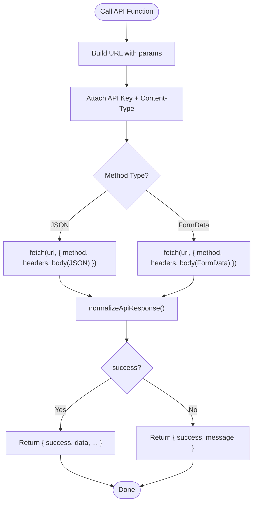
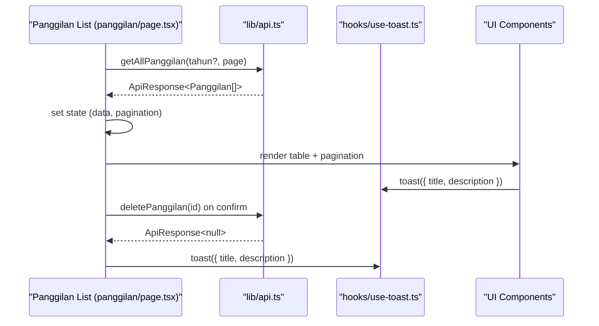
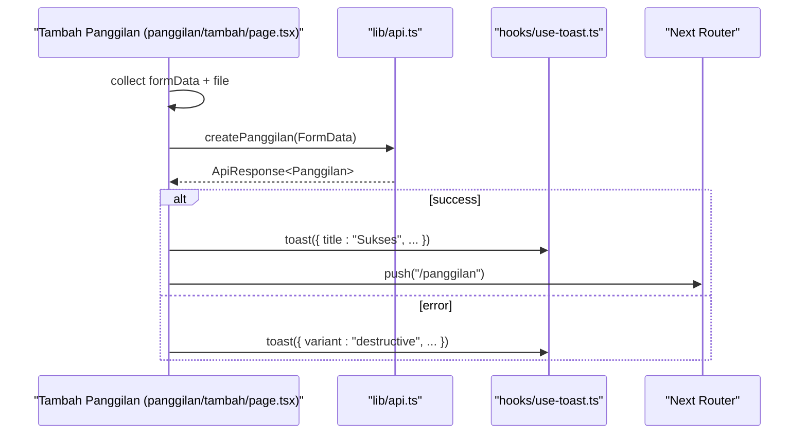
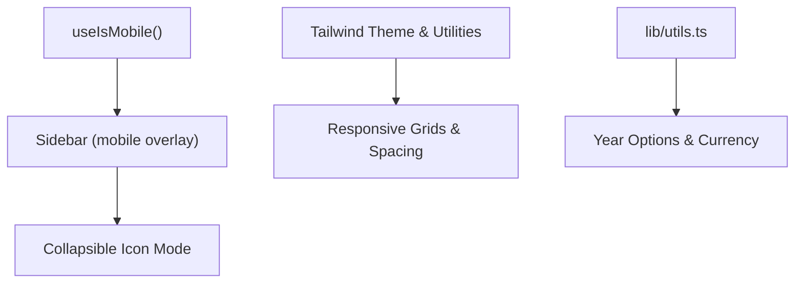
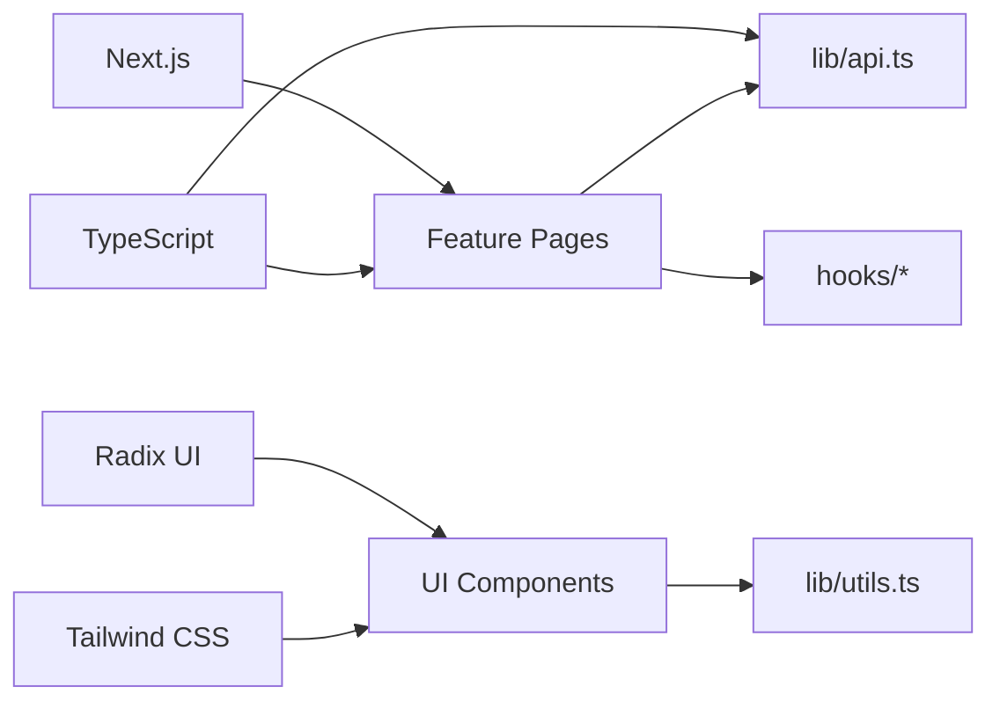

# Architecture Overview

<cite>
**Referenced Files in This Document**
- [layout.tsx](file://app/layout.tsx)
- [app-sidebar.tsx](file://components/app-sidebar.tsx)
- [sidebar.tsx](file://components/ui/sidebar.tsx)
- [api.ts](file://lib/api.ts)
- [use-toast.ts](file://hooks/use-toast.ts)
- [toaster.tsx](file://components/ui/toaster.tsx)
- [Pagination.tsx](file://components/Pagination.tsx)
- [page.tsx](file://app/page.tsx)
- [panggilan/page.tsx](file://app/panggilan/page.tsx)
- [panggilan/tambah/page.tsx](file://app/panggilan/tambah/page.tsx)
- [globals.css](file://app/globals.css)
- [tailwind.config.ts](file://tailwind.config.ts)
- [use-mobile.tsx](file://hooks/use-mobile.tsx)
- [utils.ts](file://lib/utils.ts)
- [package.json](file://package.json)
- [tsconfig.json](file://tsconfig.json)
- [next.config.js](file://next.config.js)
</cite>

## Table of Contents
1. [Introduction](#introduction)
2. [Project Structure](#project-structure)
3. [Core Components](#core-components)
4. [Architecture Overview](#architecture-overview)
5. [Detailed Component Analysis](#detailed-component-analysis)
6. [Dependency Analysis](#dependency-analysis)
7. [Performance Considerations](#performance-considerations)
8. [Troubleshooting Guide](#troubleshooting-guide)
9. [Conclusion](#conclusion)

## Introduction
This document describes the admin panel’s system architecture and design patterns. The application follows an API-first approach with a Next.js App Router-based frontend, component-driven UI built with Tailwind CSS and Radix UI primitives, and a mobile-first responsive design. It integrates with a backend API via a typed client, manages cross-cutting concerns such as state, notifications, and pagination, and emphasizes accessibility and performance.

## Project Structure
The project is organized by feature modules under the Next.js app directory, with shared UI components, utilities, and configuration at the root. The layout composes a persistent sidebar and a main content area, while individual feature pages encapsulate CRUD flows and data presentation.

**Diagram sources**
- [layout.tsx:12-36](file://app/layout.tsx#L12-L36)
- [sidebar.tsx:1-774](file://components/ui/sidebar.tsx#L1-L774)
- [app-sidebar.tsx:137-231](file://components/app-sidebar.tsx#L137-L231)
- [api.ts:1-1144](file://lib/api.ts#L1-L1144)
- [use-toast.ts:1-195](file://hooks/use-toast.ts#L1-L195)
- [toaster.tsx:1-36](file://components/ui/toaster.tsx#L1-L36)
- [Pagination.tsx:1-153](file://components/Pagination.tsx#L1-L153)
- [page.tsx:1-237](file://app/page.tsx#L1-L237)
- [panggilan/page.tsx:1-310](file://app/panggilan/page.tsx#L1-L310)
- [panggilan/tambah/page.tsx:1-282](file://app/panggilan/tambah/page.tsx#L1-L282)
- [globals.css:1-102](file://app/globals.css#L1-L102)
- [tailwind.config.ts:1-106](file://tailwind.config.ts#L1-L106)

**Section sources**
- [layout.tsx:12-36](file://app/layout.tsx#L12-L36)
- [app-sidebar.tsx:137-231](file://components/app-sidebar.tsx#L137-L231)
- [sidebar.tsx:1-774](file://components/ui/sidebar.tsx#L1-L774)
- [api.ts:1-1144](file://lib/api.ts#L1-L1144)
- [use-toast.ts:1-195](file://hooks/use-toast.ts#L1-L195)
- [toaster.tsx:1-36](file://components/ui/toaster.tsx#L1-L36)
- [Pagination.tsx:1-153](file://components/Pagination.tsx#L1-L153)
- [page.tsx:1-237](file://app/page.tsx#L1-L237)
- [panggilan/page.tsx:1-310](file://app/panggilan/page.tsx#L1-L310)
- [panggilan/tambah/page.tsx:1-282](file://app/panggilan/tambah/page.tsx#L1-L282)
- [globals.css:1-102](file://app/globals.css#L1-L102)
- [tailwind.config.ts:1-106](file://tailwind.config.ts#L1-L106)

## Core Components
- Layout shell with a collapsible sidebar provider and trigger, a fixed header bar, and a scrollable main content area.
- Feature pages for listing and creating records, each encapsulating data fetching, form handling, and UI feedback.
- A centralized API client that normalizes responses, injects API keys, and supports both JSON and multipart/form-data.
- Shared UI primitives from Radix UI and Tailwind-based components for forms, tables, dialogs, pagination, and toasts.
- Utility hooks for mobile detection and toast notifications, plus helper utilities for year options and currency formatting.

**Section sources**
- [layout.tsx:12-36](file://app/layout.tsx#L12-L36)
- [sidebar.tsx:1-774](file://components/ui/sidebar.tsx#L1-L774)
- [app-sidebar.tsx:137-231](file://components/app-sidebar.tsx#L137-L231)
- [api.ts:1-1144](file://lib/api.ts#L1-L1144)
- [use-toast.ts:1-195](file://hooks/use-toast.ts#L1-L195)
- [toaster.tsx:1-36](file://components/ui/toaster.tsx#L1-L36)
- [Pagination.tsx:1-153](file://components/Pagination.tsx#L1-L153)
- [utils.ts:1-26](file://lib/utils.ts#L1-L26)

## Architecture Overview
The system follows an API-first pattern: UI components render lists and forms, call the API client, and update state accordingly. The API client abstracts HTTP transport, normalization, and authentication headers. Notifications are surfaced globally via a toast provider. The layout coordinates navigation and responsive behavior.

**Diagram sources**
- [layout.tsx:12-36](file://app/layout.tsx#L12-L36)
- [app-sidebar.tsx:137-231](file://components/app-sidebar.tsx#L137-L231)
- [sidebar.tsx:1-774](file://components/ui/sidebar.tsx#L1-L774)
- [api.ts:1-1144](file://lib/api.ts#L1-L1144)
- [use-toast.ts:1-195](file://hooks/use-toast.ts#L1-L195)
- [toaster.tsx:1-36](file://components/ui/toaster.tsx#L1-L36)
- [globals.css:1-102](file://app/globals.css#L1-L102)

## Detailed Component Analysis

### Layout and Navigation
The root layout composes a sidebar provider, a persistent sidebar menu, a sticky header with a trigger, and a scrollable main content area. The sidebar uses Radix UI primitives and Tailwind for responsive behavior, collapsing on small screens and supporting keyboard shortcuts.

**Diagram sources**
- [layout.tsx:12-36](file://app/layout.tsx#L12-L36)
- [sidebar.tsx:56-163](file://components/ui/sidebar.tsx#L56-L163)
- [app-sidebar.tsx:137-231](file://components/app-sidebar.tsx#L137-L231)

**Section sources**
- [layout.tsx:12-36](file://app/layout.tsx#L12-L36)
- [sidebar.tsx:1-774](file://components/ui/sidebar.tsx#L1-L774)
- [app-sidebar.tsx:137-231](file://components/app-sidebar.tsx#L137-L231)

### API Client and Data Normalization
The API client centralizes HTTP calls, injects an API key, supports JSON and multipart/form-data, and normalizes responses from heterogeneous endpoints. It exposes typed functions per domain (e.g., Panggilan, Itsbat, Agenda, LHKPN, Anggaran, Aset BMN, SAKIP, Laporan Pengaduan).

**Diagram sources**
- [api.ts:53-80](file://lib/api.ts#L53-L80)
- [api.ts:97-149](file://lib/api.ts#L97-L149)
- [api.ts:155-210](file://lib/api.ts#L155-L210)
- [api.ts:235-286](file://lib/api.ts#L235-L286)
- [api.ts:292-334](file://lib/api.ts#L292-L334)

**Section sources**
- [api.ts:1-1144](file://lib/api.ts#L1-L1144)

### Feature Page: Listing and Filtering
The listing page fetches paginated data, applies filters (e.g., year), renders a table with skeleton loaders, and provides pagination controls. It uses the API client, toast notifications, and a reusable pagination component.

**Diagram sources**
- [panggilan/page.tsx:28-310](file://app/panggilan/page.tsx#L28-L310)
- [api.ts:97-149](file://lib/api.ts#L97-L149)
- [use-toast.ts:1-195](file://hooks/use-toast.ts#L1-L195)
- [Pagination.tsx:1-153](file://components/Pagination.tsx#L1-L153)

**Section sources**
- [panggilan/page.tsx:1-310](file://app/panggilan/page.tsx#L1-L310)
- [api.ts:97-149](file://lib/api.ts#L97-L149)
- [use-toast.ts:1-195](file://hooks/use-toast.ts#L1-L195)
- [Pagination.tsx:1-153](file://components/Pagination.tsx#L1-L153)

### Feature Page: Creation Form
The creation page builds a FormData payload, optionally attaches a file, and posts to the API. It displays loading states, success/error toasts, and navigates on success.

**Diagram sources**
- [panggilan/tambah/page.tsx:1-282](file://app/panggilan/tambah/page.tsx#L1-L282)
- [api.ts:115-123](file://lib/api.ts#L115-L123)
- [use-toast.ts:1-195](file://hooks/use-toast.ts#L1-L195)

**Section sources**
- [panggilan/tambah/page.tsx:1-282](file://app/panggilan/tambah/page.tsx#L1-L282)
- [api.ts:115-123](file://lib/api.ts#L115-L123)
- [use-toast.ts:1-195](file://hooks/use-toast.ts#L1-L195)

### Responsive Design and Mobile-First Patterns
The sidebar adapts to mobile via a sheet overlay and a mobile breakpoint hook. Tailwind utilities and a custom theme define responsive spacing, colors, and animations. Year options and currency formatting utilities support localized experiences.

**Diagram sources**
- [use-mobile.tsx:1-20](file://hooks/use-mobile.tsx#L1-L20)
- [sidebar.tsx:1-774](file://components/ui/sidebar.tsx#L1-L774)
- [tailwind.config.ts:1-106](file://tailwind.config.ts#L1-L106)
- [globals.css:1-102](file://app/globals.css#L1-L102)
- [utils.ts:1-26](file://lib/utils.ts#L1-L26)

**Section sources**
- [use-mobile.tsx:1-20](file://hooks/use-mobile.tsx#L1-L20)
- [sidebar.tsx:1-774](file://components/ui/sidebar.tsx#L1-L774)
- [tailwind.config.ts:1-106](file://tailwind.config.ts#L1-L106)
- [globals.css:1-102](file://app/globals.css#L1-L102)
- [utils.ts:1-26](file://lib/utils.ts#L1-L26)

## Dependency Analysis
The frontend depends on Next.js for routing and SSR/SSG, Radix UI for accessible primitives, Tailwind CSS for styling, and TypeScript for type safety. The API client encapsulates HTTP concerns and is consumed by feature pages.

**Diagram sources**
- [package.json:11-42](file://package.json#L11-L42)
- [tsconfig.json:1-43](file://tsconfig.json#L1-L43)
- [panggilan/page.tsx:1-310](file://app/panggilan/page.tsx#L1-L310)
- [panggilan/tambah/page.tsx:1-282](file://app/panggilan/tambah/page.tsx#L1-L282)
- [api.ts:1-1144](file://lib/api.ts#L1-L1144)
- [utils.ts:1-26](file://lib/utils.ts#L1-L26)

**Section sources**
- [package.json:11-42](file://package.json#L11-L42)
- [tsconfig.json:1-43](file://tsconfig.json#L1-L43)

## Performance Considerations
- Client-side caching: The API client uses cache bypass for dynamic lists to avoid stale data during edits.
- Minimal re-renders: Feature pages use local state and effect-driven updates; consider moving to server actions or SWR for heavier workloads.
- Bundle size: Keep UI components tree-shaken; avoid importing unused Radix features.
- Images and files: Lazy-load images and defer heavy file uploads until form submission.
- Pagination: Prefer server-side pagination to limit payload sizes.

[No sources needed since this section provides general guidance]

## Troubleshooting Guide
- API connectivity: Verify NEXT_PUBLIC_API_URL and NEXT_PUBLIC_API_KEY environment variables. Inspect normalized responses and error messages returned by the API client.
- Toast errors: Use the toast hook to surface user-friendly messages for failures and successes.
- Sidebar responsiveness: Confirm useIsMobile detects viewport changes and that cookies persist sidebar state.
- Styling issues: Ensure Tailwind content globs match component locations and rebuild styles after changes.

**Section sources**
- [api.ts:1-1144](file://lib/api.ts#L1-L1144)
- [use-toast.ts:1-195](file://hooks/use-toast.ts#L1-L195)
- [use-mobile.tsx:1-20](file://hooks/use-mobile.tsx#L1-L20)
- [tailwind.config.ts:1-106](file://tailwind.config.ts#L1-L106)

## Conclusion
The admin panel employs a clean, API-first architecture with a strong emphasis on component modularity, accessibility, and responsive design. The Next.js App Router enables scalable feature modules, while the API client and shared utilities streamline data flows and UX. With TypeScript and Tailwind, the system balances developer productivity with maintainability and performance.