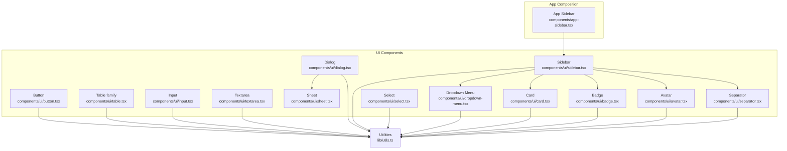
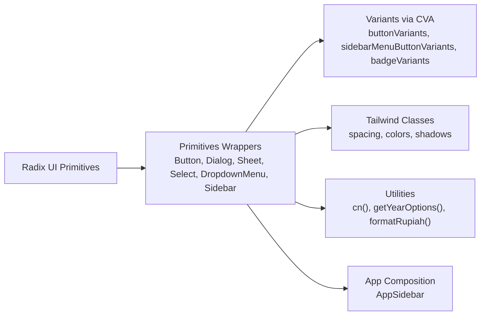
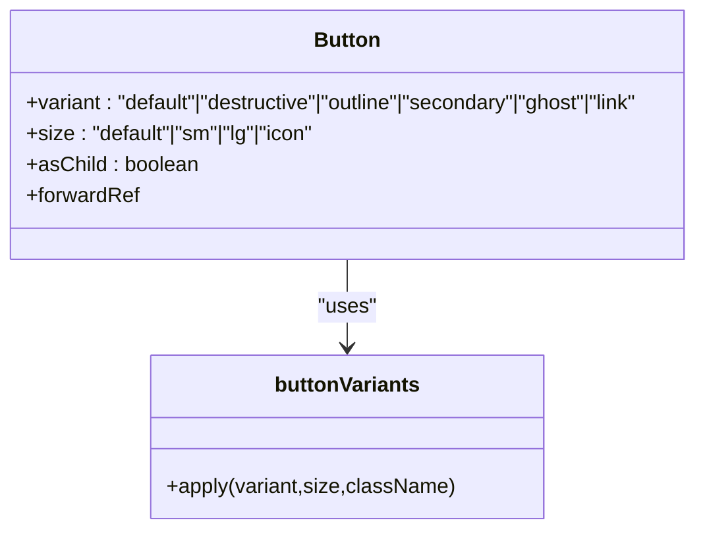
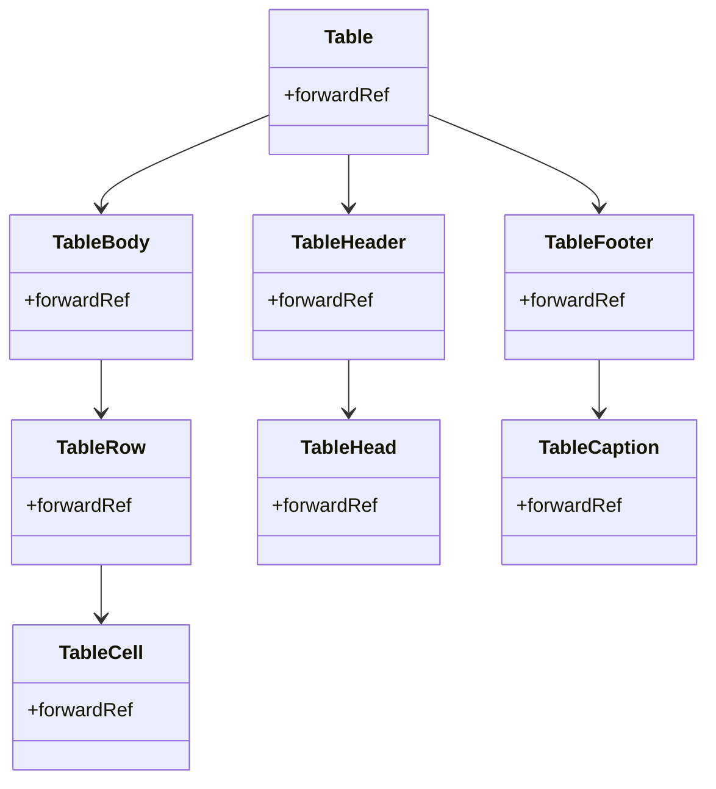
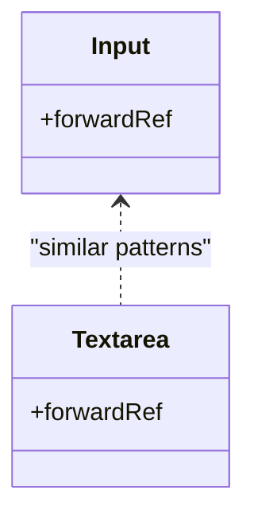
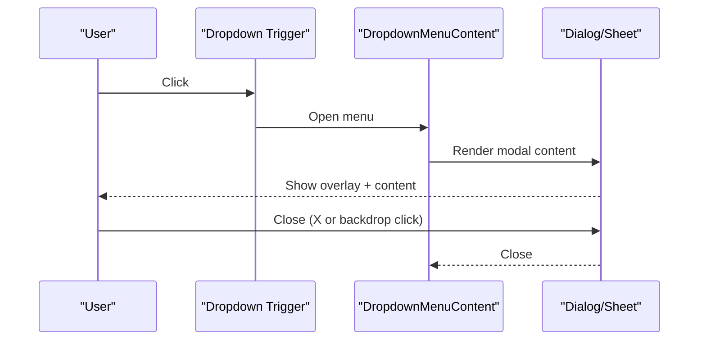
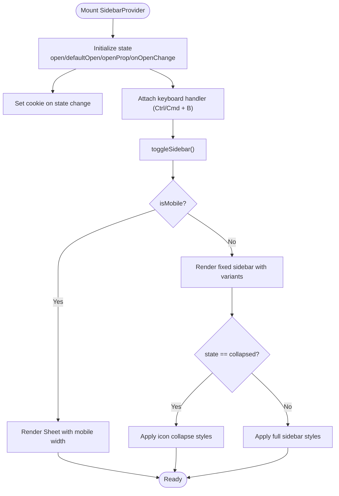
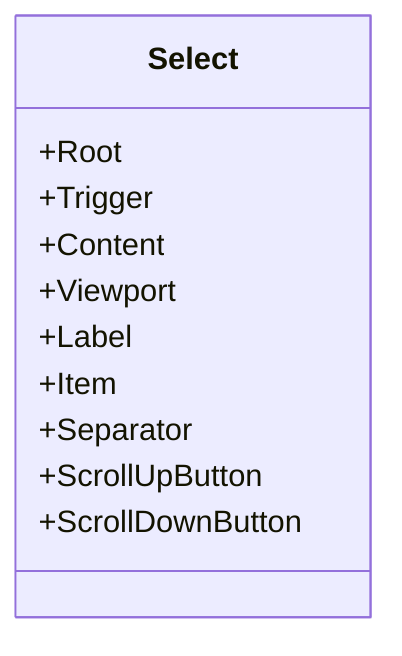
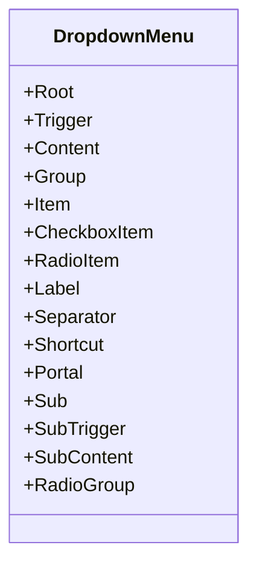
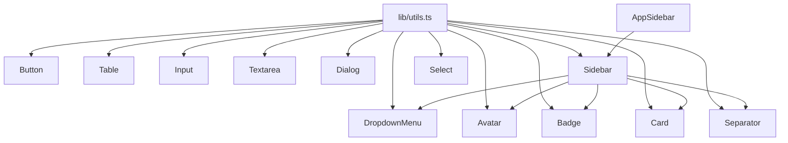

# Core Components

<cite>
**Referenced Files in This Document**
- [button.tsx](file://components/ui/button.tsx)
- [table.tsx](file://components/ui/table.tsx)
- [input.tsx](file://components/ui/input.tsx)
- [dialog.tsx](file://components/ui/dialog.tsx)
- [sidebar.tsx](file://components/ui/sidebar.tsx)
- [sheet.tsx](file://components/ui/sheet.tsx)
- [select.tsx](file://components/ui/select.tsx)
- [dropdown-menu.tsx](file://components/ui/dropdown-menu.tsx)
- [card.tsx](file://components/ui/card.tsx)
- [textarea.tsx](file://components/ui/textarea.tsx)
- [badge.tsx](file://components/ui/badge.tsx)
- [avatar.tsx](file://components/ui/avatar.tsx)
- [separator.tsx](file://components/ui/separator.tsx)
- [app-sidebar.tsx](file://components/app-sidebar.tsx)
- [utils.ts](file://lib/utils.ts)
</cite>

## Table of Contents
1. [Introduction](#introduction)
2. [Project Structure](#project-structure)
3. [Core Components](#core-components)
4. [Architecture Overview](#architecture-overview)
5. [Detailed Component Analysis](#detailed-component-analysis)
6. [Dependency Analysis](#dependency-analysis)
7. [Performance Considerations](#performance-considerations)
8. [Troubleshooting Guide](#troubleshooting-guide)
9. [Conclusion](#conclusion)
10. [Appendices](#appendices)

## Introduction
This document describes the core UI component library and shared components used across the admin panel. The library is built on:
- Radix UI primitives for accessible base behaviors
- Tailwind CSS for styling and responsive design
- Class Variance Authority (CVA) for variant-driven component styling
- A consistent design system with tokens for colors, spacing, typography, and shadows

It covers the button component system, table components for data display, input components for forms, dialog components for modals, and a sidebar navigation system. It also documents usage patterns, props, customization options, accessibility features, responsive behavior, and extension guidelines.

## Project Structure
The UI components live under components/ui and are composed by higher-level application components such as the main sidebar.

**Diagram sources**
- [button.tsx:1-58](file://components/ui/button.tsx#L1-L58)
- [table.tsx:1-121](file://components/ui/table.tsx#L1-L121)
- [input.tsx:1-23](file://components/ui/input.tsx#L1-L23)
- [textarea.tsx:1-23](file://components/ui/textarea.tsx#L1-L23)
- [dialog.tsx:1-123](file://components/ui/dialog.tsx#L1-L123)
- [sheet.tsx:1-141](file://components/ui/sheet.tsx#L1-L141)
- [select.tsx:1-160](file://components/ui/select.tsx#L1-L160)
- [dropdown-menu.tsx:1-202](file://components/ui/dropdown-menu.tsx#L1-L202)
- [sidebar.tsx:1-774](file://components/ui/sidebar.tsx#L1-L774)
- [card.tsx:1-77](file://components/ui/card.tsx#L1-L77)
- [badge.tsx:1-37](file://components/ui/badge.tsx#L1-L37)
- [avatar.tsx:1-51](file://components/ui/avatar.tsx#L1-L51)
- [separator.tsx:1-32](file://components/ui/separator.tsx#L1-L32)
- [app-sidebar.tsx:1-231](file://components/app-sidebar.tsx#L1-L231)
- [utils.ts:1-26](file://lib/utils.ts#L1-L26)

**Section sources**
- [button.tsx:1-58](file://components/ui/button.tsx#L1-L58)
- [table.tsx:1-121](file://components/ui/table.tsx#L1-L121)
- [input.tsx:1-23](file://components/ui/input.tsx#L1-L23)
- [textarea.tsx:1-23](file://components/ui/textarea.tsx#L1-L23)
- [dialog.tsx:1-123](file://components/ui/dialog.tsx#L1-L123)
- [sheet.tsx:1-141](file://components/ui/sheet.tsx#L1-L141)
- [select.tsx:1-160](file://components/ui/select.tsx#L1-L160)
- [dropdown-menu.tsx:1-202](file://components/ui/dropdown-menu.tsx#L1-L202)
- [sidebar.tsx:1-774](file://components/ui/sidebar.tsx#L1-L774)
- [card.tsx:1-77](file://components/ui/card.tsx#L1-L77)
- [badge.tsx:1-37](file://components/ui/badge.tsx#L1-L37)
- [avatar.tsx:1-51](file://components/ui/avatar.tsx#L1-L51)
- [separator.tsx:1-32](file://components/ui/separator.tsx#L1-L32)
- [app-sidebar.tsx:1-231](file://components/app-sidebar.tsx#L1-L231)
- [utils.ts:1-26](file://lib/utils.ts#L1-L26)

## Core Components
This section summarizes the primary building blocks and their roles in the design system.

- Button
  - Purpose: Unified action primitive with variants and sizes.
  - Props: variant, size, asChild, plus native button attributes.
  - Accessibility: Inherits focus-visible styles and supports SVG children.
  - Customization: Extend via CVA variants and sizes; compose with asChild for semantic wrappers.

- Table family
  - Purpose: Responsive data table with header/body/footer, rows, cells, and captions.
  - Features: Scrollable container, hover and selection states, checkbox alignment helpers.
  - Accessibility: Uses semantic table elements and role-aware cell markers.

- Input and Textarea
  - Purpose: Form controls with consistent focus states and responsive sizing.
  - Accessibility: Proper focus rings and disabled states.

- Dialog and Sheet
  - Purpose: Modal overlays with animated entrances/exits and close triggers.
  - Dialog: Root, Trigger, Portal, Overlay, Content, Header/Footer, Title, Description.
  - Sheet: Same pattern with directional side variants.

- Select
  - Purpose: Accessible single/multi-select with scroll buttons and viewport.
  - Features: Popper positioning, icons, labels, separators.

- Dropdown Menu
  - Purpose: Nested menus with submenus, checkboxes, radios, and shortcuts.
  - Features: Portal rendering, sub-triggers, and proper focus management.

- Sidebar
  - Purpose: Navigation scaffold with provider, collapsible modes, mobile off-canvas, and menu system.
  - Features: Cookie-backed persistence, keyboard shortcut, tooltips, and nested submenus.

- Cards, Badges, Avatars, Separators
  - Purpose: Complementary UI elements for content grouping, labels, identity, and dividers.

**Section sources**
- [button.tsx:37-55](file://components/ui/button.tsx#L37-L55)
- [table.tsx:5-110](file://components/ui/table.tsx#L5-L110)
- [input.tsx:5-20](file://components/ui/input.tsx#L5-L20)
- [textarea.tsx:5-22](file://components/ui/textarea.tsx#L5-L22)
- [dialog.tsx:9-122](file://components/ui/dialog.tsx#L9-L122)
- [sheet.tsx:10-140](file://components/ui/sheet.tsx#L10-L140)
- [select.tsx:9-159](file://components/ui/select.tsx#L9-L159)
- [dropdown-menu.tsx:9-201](file://components/ui/dropdown-menu.tsx#L9-L201)
- [sidebar.tsx:56-270](file://components/ui/sidebar.tsx#L56-L270)
- [card.tsx:5-76](file://components/ui/card.tsx#L5-L76)
- [badge.tsx:6-36](file://components/ui/badge.tsx#L6-L36)
- [avatar.tsx:8-50](file://components/ui/avatar.tsx#L8-L50)
- [separator.tsx:8-31](file://components/ui/separator.tsx#L8-L31)

## Architecture Overview
The component library follows a layered architecture:
- Base primitives: Radix UI roots and slots
- Style layer: Tailwind classes and CVA variants
- Composition layer: Higher-order components (e.g., SidebarProvider, AppSidebar)
- Utilities: cn() merging and helper functions

**Diagram sources**
- [button.tsx:7-35](file://components/ui/button.tsx#L7-L35)
- [sidebar.tsx:524-544](file://components/ui/sidebar.tsx#L524-L544)
- [badge.tsx:6-24](file://components/ui/badge.tsx#L6-L24)
- [utils.ts:4-6](file://lib/utils.ts#L4-L6)
- [app-sidebar.tsx:137-230](file://components/app-sidebar.tsx#L137-L230)

**Section sources**
- [button.tsx:1-58](file://components/ui/button.tsx#L1-L58)
- [sidebar.tsx:1-774](file://components/ui/sidebar.tsx#L1-L774)
- [badge.tsx:1-37](file://components/ui/badge.tsx#L1-L37)
- [utils.ts:1-26](file://lib/utils.ts#L1-L26)
- [app-sidebar.tsx:1-231](file://components/app-sidebar.tsx#L1-L231)

## Detailed Component Analysis

### Button Component System
- Design
  - Uses CVA to define variant and size scales.
  - Supports asChild to render as another element (e.g., Link) while preserving styles.
  - Inherits focus-visible ring and hover states.
- Props
  - variant: default, destructive, outline, secondary, ghost, link
  - size: default, sm, lg, icon
  - asChild: boolean
  - Additional button HTML attributes
- Accessibility
  - Focus ring, disabled state, pointer-events disabled on disabled elements.
- Usage example paths
  - [Button usage in AppSidebar:164-183](file://components/app-sidebar.tsx#L164-L183)
  - [Button with asChild:170-182](file://components/app-sidebar.tsx#L170-L182)

**Diagram sources**
- [button.tsx:7-55](file://components/ui/button.tsx#L7-L55)

**Section sources**
- [button.tsx:1-58](file://components/ui/button.tsx#L1-L58)
- [app-sidebar.tsx:164-183](file://components/app-sidebar.tsx#L164-L183)

### Table Components for Data Display
- Design
  - Container with horizontal scroll for small screens.
  - Semantic sections: header, body, footer.
  - Row-level hover and selection states; caption styling.
- Props
  - All components accept standard HTML attributes.
- Accessibility
  - Uses native table semantics; checkbox alignment handled via role markers.

**Diagram sources**
- [table.tsx:5-120](file://components/ui/table.tsx#L5-L120)

**Section sources**
- [table.tsx:1-121](file://components/ui/table.tsx#L1-L121)

### Input Components for Form Handling
- Input
  - Consistent border, focus ring, placeholder, and disabled state.
  - Responsive font sizing.
- Textarea
  - Minimum height, consistent padding, focus ring, disabled state.
- Usage example paths
  - [SidebarInput wrapper:345-361](file://components/ui/sidebar.tsx#L345-L361)

**Diagram sources**
- [input.tsx:5-20](file://components/ui/input.tsx#L5-L20)
- [textarea.tsx:5-22](file://components/ui/textarea.tsx#L5-L22)

**Section sources**
- [input.tsx:1-23](file://components/ui/input.tsx#L1-L23)
- [textarea.tsx:1-23](file://components/ui/textarea.tsx#L1-L23)
- [sidebar.tsx:345-361](file://components/ui/sidebar.tsx#L345-L361)

### Dialog Components for Modals
- Dialog
  - Root, Trigger, Portal, Overlay, Content, Header/Footer, Title, Description.
  - Animated transitions and centered content.
- Sheet
  - Same API as Dialog but with side variants (top, bottom, left, right).
- Usage example paths
  - [Dialog usage in AppSidebar profile dropdown:211-224](file://components/app-sidebar.tsx#L211-L224)

**Diagram sources**
- [dropdown-menu.tsx:59-76](file://components/ui/dropdown-menu.tsx#L59-L76)
- [dialog.tsx:32-54](file://components/ui/dialog.tsx#L32-L54)
- [sheet.tsx:56-75](file://components/ui/sheet.tsx#L56-L75)
- [app-sidebar.tsx:211-224](file://components/app-sidebar.tsx#L211-L224)

**Section sources**
- [dialog.tsx:1-123](file://components/ui/dialog.tsx#L1-L123)
- [sheet.tsx:1-141](file://components/ui/sheet.tsx#L1-L141)
- [dropdown-menu.tsx:1-202](file://components/ui/dropdown-menu.tsx#L1-L202)
- [app-sidebar.tsx:211-224](file://components/app-sidebar.tsx#L211-L224)

### Sidebar Navigation System
- Provider and Context
  - Manages expanded/collapsed state, mobile state, keyboard shortcut (Ctrl/Cmd + B), and cookie persistence.
- Components
  - SidebarProvider, Sidebar, SidebarTrigger, SidebarRail, SidebarInset, SidebarHeader/Footer/Content, SidebarGroup/Label/Action/Content, SidebarMenu/Button/Action/Badge/Skeleton/Sub/SubButton/SubItem.
- Responsive behavior
  - Mobile: Sheet-based off-canvas with configurable width.
  - Desktop: Fixed sidebar with collapsible modes (offcanvas, icon, none).
- Accessibility
  - Proper ARIA roles and keyboard navigation; screen-reader-friendly labels.
- Usage example paths
  - [AppSidebar composition:137-230](file://components/app-sidebar.tsx#L137-L230)

**Diagram sources**
- [sidebar.tsx:56-162](file://components/ui/sidebar.tsx#L56-L162)
- [sidebar.tsx:165-270](file://components/ui/sidebar.tsx#L165-L270)
- [sidebar.tsx:272-325](file://components/ui/sidebar.tsx#L272-L325)
- [sidebar.tsx:327-424](file://components/ui/sidebar.tsx#L327-L424)

**Section sources**
- [sidebar.tsx:1-774](file://components/ui/sidebar.tsx#L1-L774)
- [app-sidebar.tsx:137-230](file://components/app-sidebar.tsx#L137-L230)

### Select Component
- Design
  - Trigger with chevron icon, content with scroll buttons, viewport, labels, items, separators.
  - Supports popper positioning adjustments.
- Accessibility
  - Proper focus management and keyboard navigation within portal.

**Diagram sources**
- [select.tsx:9-159](file://components/ui/select.tsx#L9-L159)

**Section sources**
- [select.tsx:1-160](file://components/ui/select.tsx#L1-L160)

### Dropdown Menu Component
- Design
  - Root, Trigger, Content, groups, items, submenus, checkboxes, radios, labels, separators, shortcuts.
- Accessibility
  - Portal rendering, focus trapping, and nested submenus.

**Diagram sources**
- [dropdown-menu.tsx:9-201](file://components/ui/dropdown-menu.tsx#L9-L201)

**Section sources**
- [dropdown-menu.tsx:1-202](file://components/ui/dropdown-menu.tsx#L1-L202)

### Supporting Components
- Card
  - Card, CardHeader, CardTitle, CardDescription, CardContent, CardFooter.
- Badge
  - Variants: default, secondary, destructive, outline.
- Avatar
  - Root, Image, Fallback.
- Separator
  - Horizontal/vertical orientation.

**Section sources**
- [card.tsx:1-77](file://components/ui/card.tsx#L1-L77)
- [badge.tsx:1-37](file://components/ui/badge.tsx#L1-L37)
- [avatar.tsx:1-51](file://components/ui/avatar.tsx#L1-L51)
- [separator.tsx:1-32](file://components/ui/separator.tsx#L1-L32)

## Dependency Analysis
- Internal dependencies
  - All UI components depend on cn() from lib/utils.ts for class merging.
  - Sidebar composes Button, Input, Separator, Sheet, Tooltip, and uses use-mobile hook.
  - AppSidebar composes Sidebar and DropdownMenu, Avatar, Badge, Card, Separator.
- External dependencies
  - Radix UI primitives for base behaviors.
  - Lucide icons for visual indicators.
  - Class Variance Authority for variant composition.

**Diagram sources**
- [utils.ts:4-6](file://lib/utils.ts#L4-L6)
- [button.tsx:1-58](file://components/ui/button.tsx#L1-L58)
- [table.tsx:1-121](file://components/ui/table.tsx#L1-L121)
- [input.tsx:1-23](file://components/ui/input.tsx#L1-L23)
- [textarea.tsx:1-23](file://components/ui/textarea.tsx#L1-L23)
- [dialog.tsx:1-123](file://components/ui/dialog.tsx#L1-L123)
- [sidebar.tsx:1-774](file://components/ui/sidebar.tsx#L1-L774)
- [select.tsx:1-160](file://components/ui/select.tsx#L1-L160)
- [dropdown-menu.tsx:1-202](file://components/ui/dropdown-menu.tsx#L1-L202)
- [card.tsx:1-77](file://components/ui/card.tsx#L1-L77)
- [badge.tsx:1-37](file://components/ui/badge.tsx#L1-L37)
- [avatar.tsx:1-51](file://components/ui/avatar.tsx#L1-L51)
- [separator.tsx:1-32](file://components/ui/separator.tsx#L1-L32)
- [app-sidebar.tsx:1-231](file://components/app-sidebar.tsx#L1-L231)

**Section sources**
- [utils.ts:1-26](file://lib/utils.ts#L1-L26)
- [sidebar.tsx:1-774](file://components/ui/sidebar.tsx#L1-L774)
- [app-sidebar.tsx:1-231](file://components/app-sidebar.tsx#L1-L231)

## Performance Considerations
- Prefer asChild patterns to avoid unnecessary DOM nodes and preserve semantics.
- Use variant props judiciously; CVA generates many combinations—limit active variants per component instance.
- For large tables, rely on the built-in scroll container and avoid rendering excessive rows at once.
- Memoize derived values (e.g., menu skeletons) to reduce re-renders.
- Keep cookie persistence minimal; only persist essential state like sidebar open/collapsed.

## Troubleshooting Guide
- Dialog/Sheet not closing
  - Ensure Close trigger is present and reachable; verify Portal rendering.
  - Check that overlay click closes the modal.
- Sidebar not toggling
  - Confirm keyboard shortcut handler is attached and not blocked by other listeners.
  - Verify cookie persistence and initial state logic.
- Select/Dropdown misaligned
  - Confirm popper positioning and portal rendering; check sideOffset and viewport sizing.
- Focus ring not visible
  - Ensure focus-visible styles are applied and not overridden by global resets.
- Disabled state not working
  - Verify disabled attribute is passed and styles reflect disabled opacity and pointer-events.

**Section sources**
- [dialog.tsx:32-54](file://components/ui/dialog.tsx#L32-L54)
- [sheet.tsx:56-75](file://components/ui/sheet.tsx#L56-L75)
- [sidebar.tsx:106-119](file://components/ui/sidebar.tsx#L106-L119)
- [select.tsx:70-99](file://components/ui/select.tsx#L70-L99)
- [dropdown-menu.tsx:59-76](file://components/ui/dropdown-menu.tsx#L59-L76)

## Conclusion
The component library provides a robust, accessible, and customizable foundation for the admin panel. By leveraging Radix UI primitives, Tailwind CSS, and CVA, it ensures consistent behavior and appearance across components. The sidebar system demonstrates advanced composition patterns for responsive navigation, while form-related components maintain usability and accessibility. Extending the library follows established patterns: wrap Radix primitives, apply CVA variants, and integrate with cn() for class composition.

## Appendices

### Prop Reference Quick Guide
- Button
  - variant: default, destructive, outline, secondary, ghost, link
  - size: default, sm, lg, icon
  - asChild: boolean
- Table family
  - Accept standard HTML attributes; use semantic wrappers for structure.
- Input/Textarea
  - Standard input attributes; focus-visible ring included.
- Dialog/Sheet
  - Side: top, bottom, left, right (Sheet only)
  - Overlay and close button included.
- Select
  - position: popper (default) or inline
- DropdownMenu
  - inset booleans for indentation; submenus supported.
- Sidebar
  - side: left, right
  - variant: sidebar, floating, inset
  - collapsible: offcanvas, icon, none
  - defaultOpen, open, onOpenChange for controlled/uncontrolled usage.

**Section sources**
- [button.tsx:37-41](file://components/ui/button.tsx#L37-L41)
- [table.tsx:5-120](file://components/ui/table.tsx#L5-L120)
- [input.tsx:5-18](file://components/ui/input.tsx#L5-L18)
- [textarea.tsx:5-19](file://components/ui/textarea.tsx#L5-L19)
- [dialog.tsx:17-54](file://components/ui/dialog.tsx#L17-L54)
- [sheet.tsx:52-75](file://components/ui/sheet.tsx#L52-L75)
- [select.tsx:70-100](file://components/ui/select.tsx#L70-L100)
- [dropdown-menu.tsx:21-57](file://components/ui/dropdown-menu.tsx#L21-L57)
- [sidebar.tsx:165-171](file://components/ui/sidebar.tsx#L165-L171)

### Accessibility Checklist
- All interactive elements have visible focus indicators.
- Dialogs and Sheets announce titles and descriptions; close buttons have accessible labels.
- Tables use semantic markup; interactive elements inside cells are properly marked.
- Dropdowns and Selects support keyboard navigation and screen reader announcements.
- Sidebar toggles and menu actions are keyboard accessible and announced.

**Section sources**
- [dialog.tsx:84-109](file://components/ui/dialog.tsx#L84-L109)
- [sheet.tsx:105-127](file://components/ui/sheet.tsx#L105-L127)
- [table.tsx:69-97](file://components/ui/table.tsx#L69-L97)
- [select.tsx:114-134](file://components/ui/select.tsx#L114-L134)
- [dropdown-menu.tsx:78-94](file://components/ui/dropdown-menu.tsx#L78-L94)
- [sidebar.tsx:272-296](file://components/ui/sidebar.tsx#L272-L296)

### Extension Guidelines
- Naming and structure
  - Place new components under components/ui with a descriptive filename.
  - Export a forwardRef component and a default export for variants if applicable.
- Styling
  - Use cn() to merge Tailwind classes with incoming className.
  - Define CVA variants for consistent scaling.
- Accessibility
  - Wrap with Radix primitives; expose root/trigger/content APIs.
  - Provide aria-* attributes and keyboard handlers where appropriate.
- Composition
  - Compose existing components (e.g., Button, Tooltip) rather than reinventing patterns.
  - Respect asChild for semantic wrappers.
- Testing
  - Add unit tests for variant rendering and state changes.
  - Verify keyboard navigation and screen reader behavior.

**Section sources**
- [button.tsx:1-58](file://components/ui/button.tsx#L1-L58)
- [sidebar.tsx:1-774](file://components/ui/sidebar.tsx#L1-L774)
- [utils.ts:4-6](file://lib/utils.ts#L4-L6)