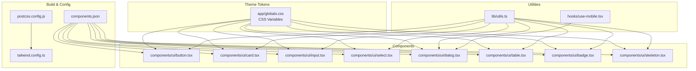
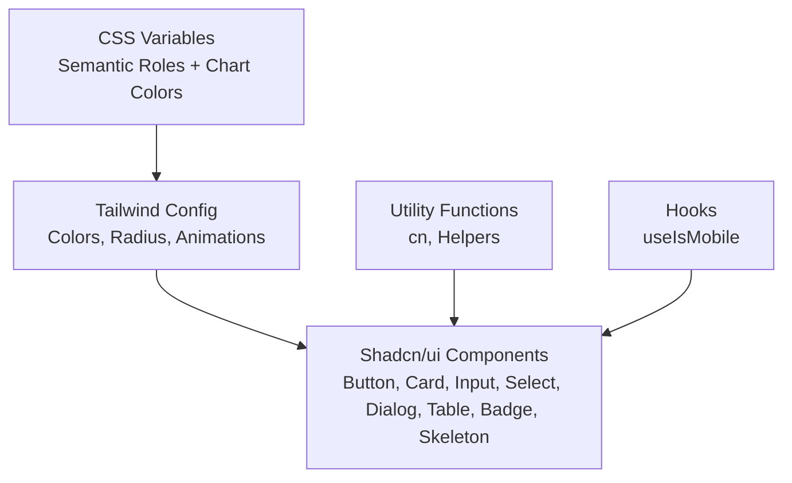
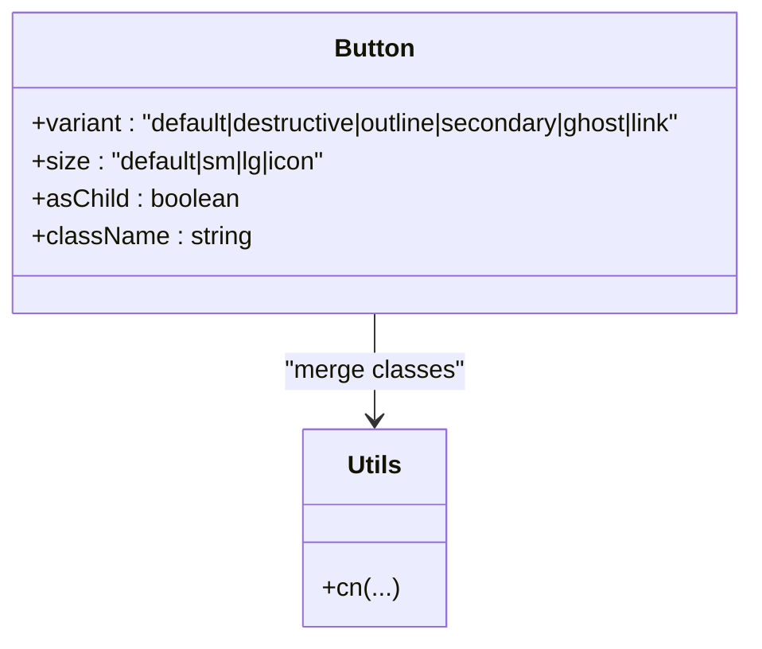
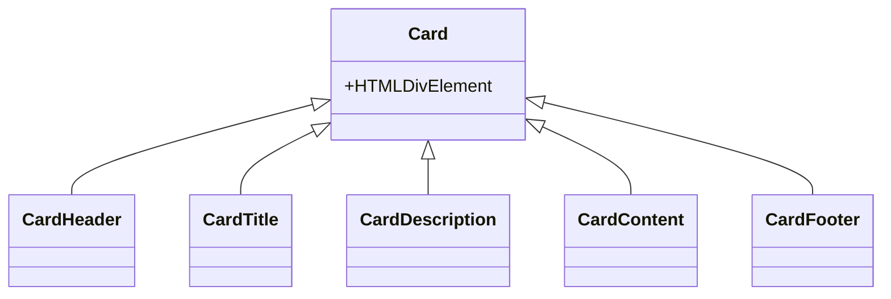
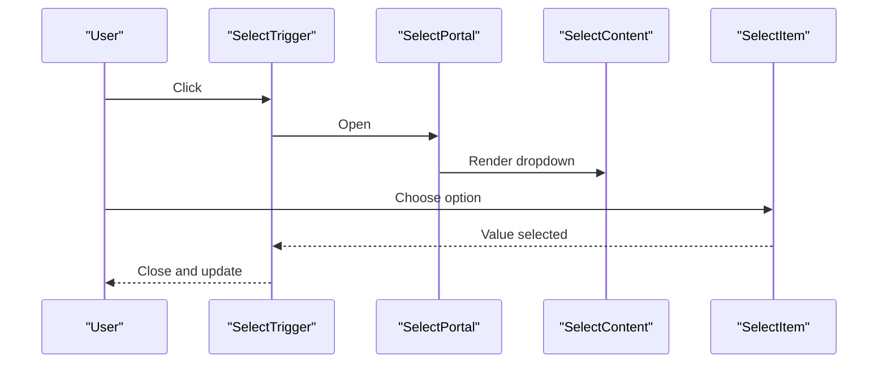
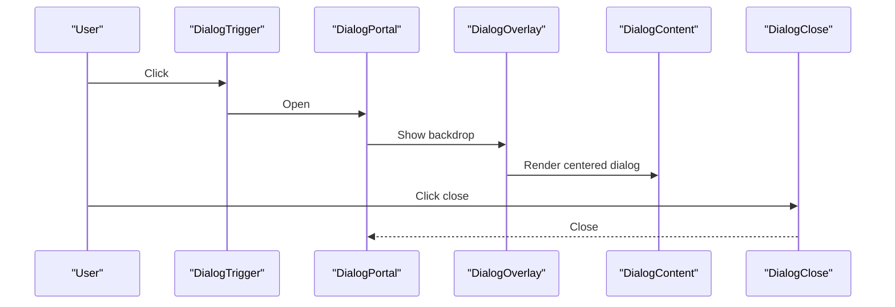
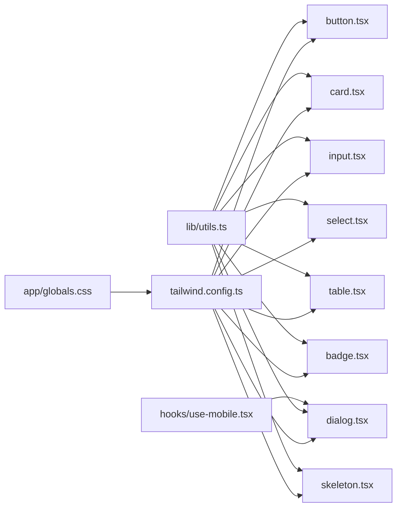

# Design System

<cite>
**Referenced Files in This Document**
- [tailwind.config.ts](file://tailwind.config.ts)
- [postcss.config.js](file://postcss.config.js)
- [components.json](file://components.json)
- [globals.css](file://app/globals.css)
- [utils.ts](file://lib/utils.ts)
- [button.tsx](file://components/ui/button.tsx)
- [card.tsx](file://components/ui/card.tsx)
- [input.tsx](file://components/ui/input.tsx)
- [select.tsx](file://components/ui/select.tsx)
- [dialog.tsx](file://components/ui/dialog.tsx)
- [table.tsx](file://components/ui/table.tsx)
- [badge.tsx](file://components/ui/badge.tsx)
- [skeleton.tsx](file://components/ui/skeleton.tsx)
- [use-mobile.tsx](file://hooks/use-mobile.tsx)
</cite>

## Table of Contents
1. [Introduction](#introduction)
2. [Project Structure](#project-structure)
3. [Core Components](#core-components)
4. [Architecture Overview](#architecture-overview)
5. [Detailed Component Analysis](#detailed-component-analysis)
6. [Dependency Analysis](#dependency-analysis)
7. [Performance Considerations](#performance-considerations)
8. [Troubleshooting Guide](#troubleshooting-guide)
9. [Conclusion](#conclusion)
10. [Appendices](#appendices)

## Introduction
This document describes the design system implementation for the admin panel. It covers Tailwind CSS configuration, design tokens, color palette, typography system, spacing scale, component variants, shadcn/ui integration, custom theme variables, utility class usage patterns, and responsive breakpoints. It also explains the design system architecture, component styling patterns, customization guidelines, the relationship between design tokens and component implementation, dark mode support, and accessibility considerations. Finally, it provides guidelines for extending the design system and maintaining design consistency across the application.

## Project Structure
The design system is built around a centralized Tailwind configuration, a set of design tokens defined in CSS custom properties, and a library of reusable UI components. The PostCSS pipeline compiles Tailwind utilities and CSS custom properties into production styles. Components are implemented using shadcn/ui conventions with Radix UI primitives and class-variance-authority for variants.

**Diagram sources**
- [tailwind.config.ts:1-106](file://tailwind.config.ts#L1-L106)
- [postcss.config.js:1-7](file://postcss.config.js#L1-L7)
- [components.json:1-25](file://components.json#L1-L25)
- [globals.css:1-102](file://app/globals.css#L1-L102)
- [utils.ts:1-26](file://lib/utils.ts#L1-L26)
- [button.tsx:1-58](file://components/ui/button.tsx#L1-L58)
- [card.tsx:1-77](file://components/ui/card.tsx#L1-L77)
- [input.tsx:1-23](file://components/ui/input.tsx#L1-L23)
- [select.tsx:1-160](file://components/ui/select.tsx#L1-L160)
- [dialog.tsx:1-123](file://components/ui/dialog.tsx#L1-L123)
- [table.tsx:1-121](file://components/ui/table.tsx#L1-L121)
- [badge.tsx:1-37](file://components/ui/badge.tsx#L1-L37)
- [skeleton.tsx:1-16](file://components/ui/skeleton.tsx#L1-L16)
- [use-mobile.tsx:1-20](file://hooks/use-mobile.tsx#L1-L20)

**Section sources**
- [tailwind.config.ts:1-106](file://tailwind.config.ts#L1-L106)
- [postcss.config.js:1-7](file://postcss.config.js#L1-L7)
- [components.json:1-25](file://components.json#L1-L25)
- [globals.css:1-102](file://app/globals.css#L1-L102)
- [utils.ts:1-26](file://lib/utils.ts#L1-L26)
- [button.tsx:1-58](file://components/ui/button.tsx#L1-L58)
- [card.tsx:1-77](file://components/ui/card.tsx#L1-L77)
- [input.tsx:1-23](file://components/ui/input.tsx#L1-L23)
- [select.tsx:1-160](file://components/ui/select.tsx#L1-L160)
- [dialog.tsx:1-123](file://components/ui/dialog.tsx#L1-L123)
- [table.tsx:1-121](file://components/ui/table.tsx#L1-L121)
- [badge.tsx:1-37](file://components/ui/badge.tsx#L1-L37)
- [skeleton.tsx:1-16](file://components/ui/skeleton.tsx#L1-L16)
- [use-mobile.tsx:1-20](file://hooks/use-mobile.tsx#L1-L20)

## Core Components
This section documents the design system’s foundational elements and how they relate to the configuration and tokens.

- Tailwind CSS configuration
  - Dark mode strategy: class-based dark mode is enabled.
  - Content scanning: Tailwind scans pages, components, app, and src directories for class usage.
  - Theme extensions:
    - Colors mapped to CSS variables for light/dark themes and semantic roles.
    - Border radius scale derived from a CSS variable.
    - Accordion animations via keyframes and animation utilities.
  - Plugins: tailwindcss-animate is registered.

- CSS custom properties and design tokens
  - Root-level tokens define semantic color roles and chart colors.
  - Dark mode tokens override semantic roles for contrast and readability.
  - Radius token controls global border radius across components.
  - Additional theme tokens (e.g., animate-shine) are declared in a theme block.

- Utility functions
  - cn merges Tailwind classes safely using clsx and tailwind-merge.
  - Helper utilities include year options generation and Indonesian Rupiah formatting.

- Responsive breakpoints and mobile detection
  - Mobile breakpoint is defined at 768px.
  - A hook detects mobile viewport width and updates on media query changes.

**Section sources**
- [tailwind.config.ts:1-106](file://tailwind.config.ts#L1-L106)
- [globals.css:1-102](file://app/globals.css#L1-L102)
- [utils.ts:1-26](file://lib/utils.ts#L1-L26)
- [use-mobile.tsx:1-20](file://hooks/use-mobile.tsx#L1-L20)

## Architecture Overview
The design system architecture centers on CSS variables for theme tokens, Tailwind utilities for layout and styling, and component libraries for interactive UI. Shadcn/ui provides a consistent component model with Radix UI under the hood, enabling accessible and extensible components.

**Diagram sources**
- [globals.css:1-102](file://app/globals.css#L1-L102)
- [tailwind.config.ts:1-106](file://tailwind.config.ts#L1-L106)
- [utils.ts:1-26](file://lib/utils.ts#L1-L26)
- [button.tsx:1-58](file://components/ui/button.tsx#L1-L58)
- [card.tsx:1-77](file://components/ui/card.tsx#L1-L77)
- [input.tsx:1-23](file://components/ui/input.tsx#L1-L23)
- [select.tsx:1-160](file://components/ui/select.tsx#L1-L160)
- [dialog.tsx:1-123](file://components/ui/dialog.tsx#L1-L123)
- [table.tsx:1-121](file://components/ui/table.tsx#L1-L121)
- [badge.tsx:1-37](file://components/ui/badge.tsx#L1-L37)
- [skeleton.tsx:1-16](file://components/ui/skeleton.tsx#L1-L16)
- [use-mobile.tsx:1-20](file://hooks/use-mobile.tsx#L1-L20)

## Detailed Component Analysis

### Button
- Variants and sizes are defined via class-variance-authority, enabling consistent styling across states.
- Uses semantic tokens for background, foreground, borders, and shadows.
- Supports an as-child pattern via Radix Slot for composition.

**Diagram sources**
- [button.tsx:1-58](file://components/ui/button.tsx#L1-L58)
- [utils.ts:1-6](file://lib/utils.ts#L1-L6)

**Section sources**
- [button.tsx:1-58](file://components/ui/button.tsx#L1-L58)
- [utils.ts:1-6](file://lib/utils.ts#L1-L6)

### Card
- Implements a card container with header, title, description, content, and footer slots.
- Uses semantic tokens for background, foreground, border, and shadow.

**Diagram sources**
- [card.tsx:1-77](file://components/ui/card.tsx#L1-L77)

**Section sources**
- [card.tsx:1-77](file://components/ui/card.tsx#L1-L77)

### Input
- A thin wrapper around the native input element with consistent padding, border, and focus states.
- Inherits semantic tokens for border, background, placeholder, and focus ring.

**Section sources**
- [input.tsx:1-23](file://components/ui/input.tsx#L1-L23)

### Select
- Built on Radix UI Select with icons and scroll areas.
- Uses semantic tokens for trigger, content, item, and indicator states.
- Supports popper positioning and viewport sizing.

**Diagram sources**
- [select.tsx:1-160](file://components/ui/select.tsx#L1-L160)

**Section sources**
- [select.tsx:1-160](file://components/ui/select.tsx#L1-L160)

### Dialog
- Composed of overlay, portal, content, header, footer, title, and description.
- Uses semantic tokens for background, ring, and focus states.
- Includes animation utilities for smooth open/close transitions.

**Diagram sources**
- [dialog.tsx:1-123](file://components/ui/dialog.tsx#L1-L123)

**Section sources**
- [dialog.tsx:1-123](file://components/ui/dialog.tsx#L1-L123)

### Table
- Wraps a responsive table container with horizontal scrolling on small screens.
- Uses semantic tokens for borders, hover, and selected states.

**Section sources**
- [table.tsx:1-121](file://components/ui/table.tsx#L1-L121)

### Badge
- Provides variant-based styling for labels and indicators.
- Uses semantic tokens for background and border.

**Section sources**
- [badge.tsx:1-37](file://components/ui/badge.tsx#L1-L37)

### Skeleton
- A simple animated loading placeholder using a pulse animation and primary tint.

**Section sources**
- [skeleton.tsx:1-16](file://components/ui/skeleton.tsx#L1-L16)

## Dependency Analysis
The design system relies on a tight coupling between CSS variables, Tailwind configuration, and component implementations. Utilities consolidate class merging and formatting helpers. Hooks provide runtime responsive behavior.

**Diagram sources**
- [globals.css:1-102](file://app/globals.css#L1-L102)
- [tailwind.config.ts:1-106](file://tailwind.config.ts#L1-L106)
- [utils.ts:1-26](file://lib/utils.ts#L1-L26)
- [button.tsx:1-58](file://components/ui/button.tsx#L1-L58)
- [card.tsx:1-77](file://components/ui/card.tsx#L1-L77)
- [input.tsx:1-23](file://components/ui/input.tsx#L1-L23)
- [select.tsx:1-160](file://components/ui/select.tsx#L1-L160)
- [dialog.tsx:1-123](file://components/ui/dialog.tsx#L1-L123)
- [table.tsx:1-121](file://components/ui/table.tsx#L1-L121)
- [badge.tsx:1-37](file://components/ui/badge.tsx#L1-L37)
- [skeleton.tsx:1-16](file://components/ui/skeleton.tsx#L1-L16)
- [use-mobile.tsx:1-20](file://hooks/use-mobile.tsx#L1-L20)

**Section sources**
- [tailwind.config.ts:1-106](file://tailwind.config.ts#L1-L106)
- [globals.css:1-102](file://app/globals.css#L1-L102)
- [utils.ts:1-26](file://lib/utils.ts#L1-L26)
- [button.tsx:1-58](file://components/ui/button.tsx#L1-L58)
- [card.tsx:1-77](file://components/ui/card.tsx#L1-L77)
- [input.tsx:1-23](file://components/ui/input.tsx#L1-L23)
- [select.tsx:1-160](file://components/ui/select.tsx#L1-L160)
- [dialog.tsx:1-123](file://components/ui/dialog.tsx#L1-L123)
- [table.tsx:1-121](file://components/ui/table.tsx#L1-L121)
- [badge.tsx:1-37](file://components/ui/badge.tsx#L1-L37)
- [skeleton.tsx:1-16](file://components/ui/skeleton.tsx#L1-L16)
- [use-mobile.tsx:1-20](file://hooks/use-mobile.tsx#L1-L20)

## Performance Considerations
- Keep the design system scoped: Tailwind content globs limit scanning to relevant directories, reducing build time.
- Prefer CSS variables for theme tokens to minimize repeated Tailwind class declarations.
- Use the cn utility to avoid redundant classes and reduce CSS output bloat.
- Limit heavy animations to essential components; leverage built-in animation utilities sparingly.

## Troubleshooting Guide
- Dark mode not applying:
  - Verify the dark class is toggled on the root element and CSS variables are present in the .dark selector.
- Variants not rendering:
  - Ensure component variants are defined and passed correctly; confirm class merging via cn.
- Responsive behavior:
  - Confirm the mobile breakpoint and media query listener are functioning; use the provided hook to gate mobile-specific UI.
- Build errors:
  - Check Tailwind plugin registration and PostCSS configuration.

**Section sources**
- [globals.css:42-75](file://app/globals.css#L42-L75)
- [button.tsx:37-58](file://components/ui/button.tsx#L37-L58)
- [utils.ts:4-6](file://lib/utils.ts#L4-L6)
- [use-mobile.tsx:1-20](file://hooks/use-mobile.tsx#L1-L20)
- [postcss.config.js:1-7](file://postcss.config.js#L1-L7)

## Conclusion
The design system leverages CSS variables for tokens, Tailwind utilities for layout and states, and shadcn/ui components for accessible, composable UI. The configuration supports dark mode, consistent spacing and radii, and scalable component variants. Following the provided guidelines ensures maintainable, consistent design across the application.

## Appendices

### Design Tokens and Semantic Roles
- Tokens are defined in the root and .dark selectors, including background, foreground, primary, secondary, muted, accent, destructive, border, input, ring, and chart colors.
- Sidebar tokens are included for sidebar-specific components.
- Radius token controls global border radius.

**Section sources**
- [globals.css:5-79](file://app/globals.css#L5-L79)

### Color Palette and Chart Colors
- Base palette: background, foreground, primary, secondary, muted, accent, destructive.
- Chart palette: chart-1 through chart-5 for data visualization.
- Sidebar palette: background, foreground, primary, primary-foreground, accent, accent-foreground, border, ring.

**Section sources**
- [globals.css:7-40](file://app/globals.css#L7-L40)
- [globals.css:62-74](file://app/globals.css#L62-L74)

### Typography System
- Body and heading tokens derive from semantic roles; ensure typography utilities align with these roles.
- Headings and text components should reference muted and foreground tokens for contrast.

**Section sources**
- [globals.css:8, 13-22, 43-58](file://app/globals.css#L8, 13-L22, 43-L58)

### Spacing Scale and Border Radius
- Spacing is implicit through component paddings and margins; consistent use of semantic tokens ensures uniform spacing.
- Border radius is controlled by a single radius token applied across components.

**Section sources**
- [tailwind.config.ts:73-77](file://tailwind.config.ts#L73-L77)
- [globals.css:26](file://app/globals.css#L26)

### Component Variants Reference
- Button: default, destructive, outline, secondary, ghost, link; sizes: default, sm, lg, icon.
- Badge: default, secondary, destructive, outline.
- Input: standard input with focus and disabled states.
- Select: trigger, content, item, label, separator, scroll buttons.
- Dialog: overlay, content, header, footer, title, description.
- Card: container with header, title, description, content, footer.
- Table: table, thead, tbody, tfoot, tr, th, td, caption.
- Skeleton: generic loading placeholder.

**Section sources**
- [button.tsx:10-35](file://components/ui/button.tsx#L10-L35)
- [badge.tsx:6-24](file://components/ui/badge.tsx#L6-L24)
- [input.tsx:5-18](file://components/ui/input.tsx#L5-L18)
- [select.tsx:15-159](file://components/ui/select.tsx#L15-L159)
- [dialog.tsx:17-122](file://components/ui/dialog.tsx#L17-L122)
- [card.tsx:5-76](file://components/ui/card.tsx#L5-L76)
- [table.tsx:5-120](file://components/ui/table.tsx#L5-L120)
- [skeleton.tsx:3-12](file://components/ui/skeleton.tsx#L3-L12)

### shadcn/ui Integration and Custom Theme Variables
- Style preset: New York style.
- RSC and TSX enabled.
- Tailwind config and CSS variables enabled.
- Base color: slate.
- Aliases configured for components, utils, ui, lib, hooks.
- Registry includes magicui.

**Section sources**
- [components.json:1-25](file://components.json#L1-L25)

### Utility Class Usage Patterns
- Use cn to merge conditional classes and avoid duplicates.
- Prefer semantic tokens for colors, borders, and backgrounds.
- Apply focus-visible and ring utilities for keyboard accessibility.

**Section sources**
- [utils.ts:4-6](file://lib/utils.ts#L4-L6)
- [button.tsx:7-35](file://components/ui/button.tsx#L7-L35)
- [input.tsx:10-16](file://components/ui/input.tsx#L10-L16)

### Responsive Breakpoints
- Mobile breakpoint: 768px.
- Use the provided hook to detect mobile and conditionally render components.

**Section sources**
- [use-mobile.tsx:3-19](file://hooks/use-mobile.tsx#L3-L19)

### Dark Mode Support
- Class-based dark mode with .dark selector overriding semantic tokens.
- Ensure the dark class propagates to the root element for proper theme switching.

**Section sources**
- [tailwind.config.ts:4](file://tailwind.config.ts#L4)
- [globals.css:42-75](file://app/globals.css#L42-L75)

### Accessibility Considerations
- Focus management: Components apply focus-visible outlines and ring utilities.
- Keyboard navigation: Radix UI primitives provide ARIA-compliant interactions.
- Semantic roles: Components use appropriate HTML semantics and aria attributes where needed.

**Section sources**
- [button.tsx:8](file://components/ui/button.tsx#L8)
- [input.tsx:11](file://components/ui/input.tsx#L11)
- [select.tsx:15-159](file://components/ui/select.tsx#L15-L159)
- [dialog.tsx:32-54](file://components/ui/dialog.tsx#L32-L54)

### Extending the Design System
- Add new tokens to the root and .dark selectors in the global CSS.
- Extend Tailwind colors and radius in the Tailwind config.
- Define new component variants using class-variance-authority and export consistent props.
- Use the cn utility to merge classes and maintain consistency.
- Keep responsive behavior aligned with the mobile breakpoint.

**Section sources**
- [globals.css:5-79](file://app/globals.css#L5-L79)
- [tailwind.config.ts:20-100](file://tailwind.config.ts#L20-L100)
- [button.tsx:7-35](file://components/ui/button.tsx#L7-L35)
- [utils.ts:4-6](file://lib/utils.ts#L4-L6)
- [use-mobile.tsx:3-19](file://hooks/use-mobile.tsx#L3-L19)