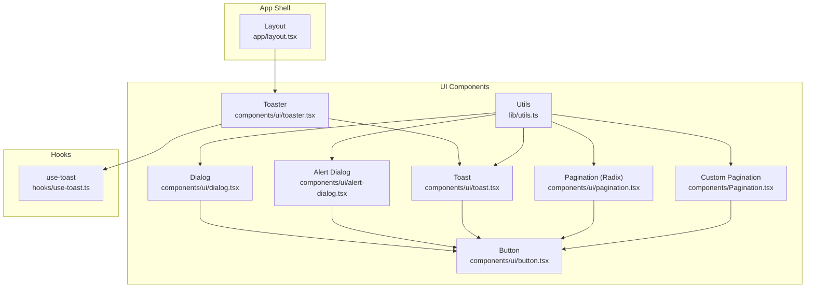
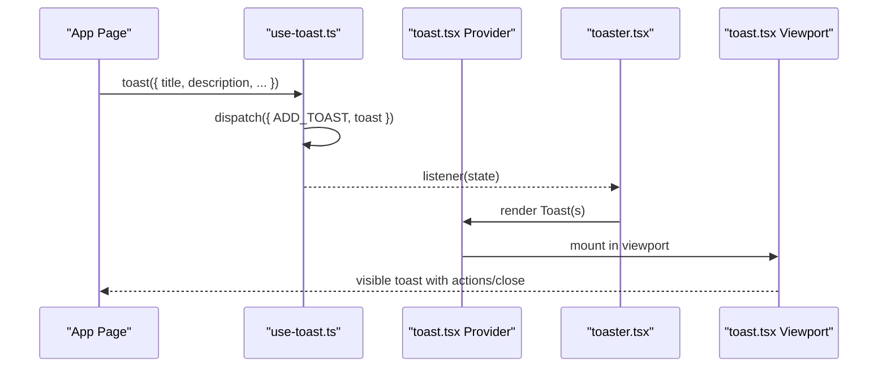
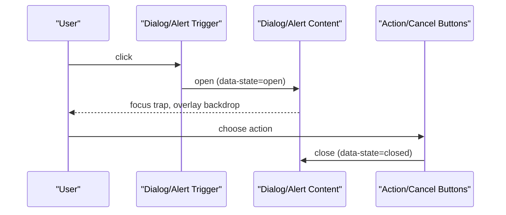
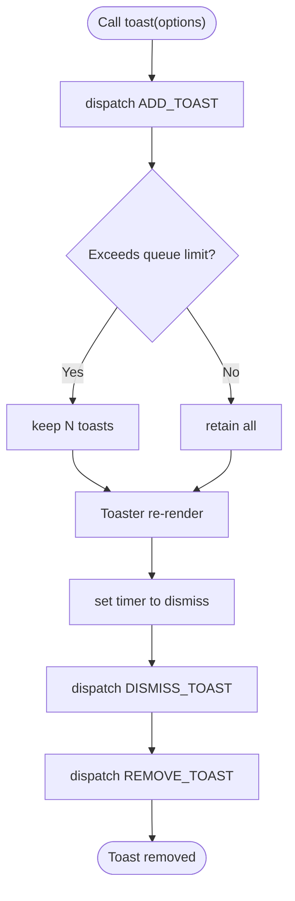
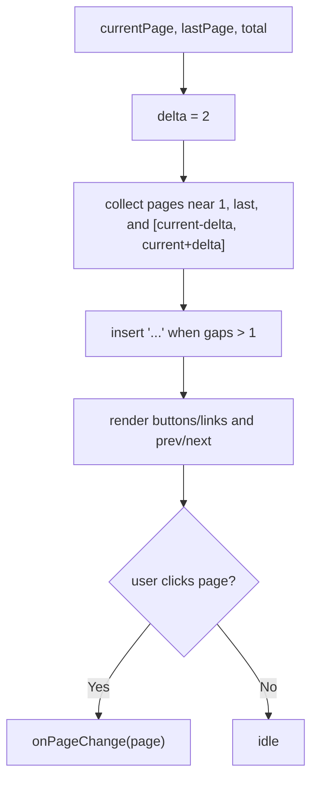
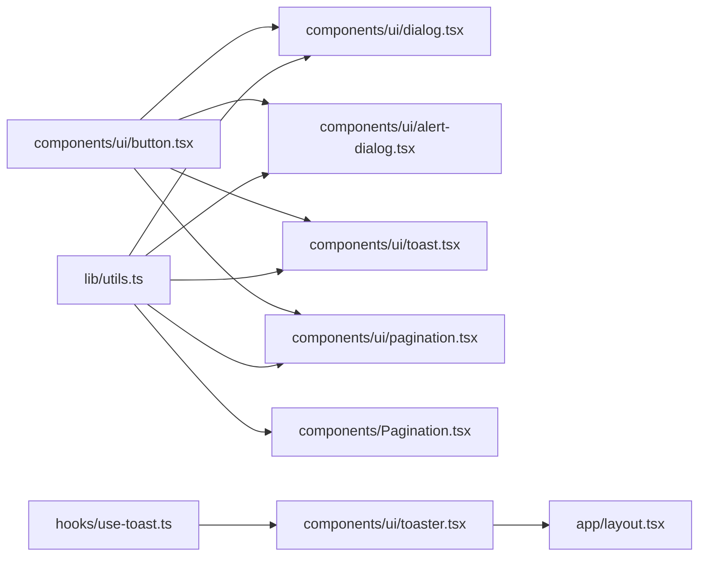

# Feedback and Interaction

<cite>
**Referenced Files in This Document**
- [dialog.tsx](file://components/ui/dialog.tsx)
- [alert-dialog.tsx](file://components/ui/alert-dialog.tsx)
- [toast.tsx](file://components/ui/toast.tsx)
- [toaster.tsx](file://components/ui/toaster.tsx)
- [pagination.tsx](file://components/ui/pagination.tsx)
- [Pagination.tsx](file://components/Pagination.tsx)
- [use-toast.ts](file://hooks/use-toast.ts)
- [button.tsx](file://components/ui/button.tsx)
- [utils.ts](file://lib/utils.ts)
- [layout.tsx](file://app/layout.tsx)
</cite>

## Table of Contents
1. [Introduction](#introduction)
2. [Project Structure](#project-structure)
3. [Core Components](#core-components)
4. [Architecture Overview](#architecture-overview)
5. [Detailed Component Analysis](#detailed-component-analysis)
6. [Dependency Analysis](#dependency-analysis)
7. [Performance Considerations](#performance-considerations)
8. [Troubleshooting Guide](#troubleshooting-guide)
9. [Conclusion](#conclusion)
10. [Appendices](#appendices)

## Introduction
This document explains the feedback and interaction components used across the admin panel: modal dialogs (dialog and alert-dialog), notification system (toaster and toast), and pagination controls. It covers user interaction patterns, state management, animation behaviors, accessibility features, dialog positioning, confirmation workflows, toast notification types, and pagination implementation. It also documents component composition, event handling, integration patterns, and provides usage examples for confirmations, alerts, loading states, and data navigation, while addressing accessibility compliance, keyboard navigation, and screen reader support.

## Project Structure
The feedback and interaction system is composed of:
- Dialog primitives and UI wrappers for generic modals and confirmation dialogs
- A toast provider and consumer for non-blocking notifications
- Two pagination implementations: a Radix-based UI component and a custom component
- A shared button component used across dialogs and pagination
- A shared utility function for composing Tailwind classes

**Diagram sources**
- [dialog.tsx:1-123](file://components/ui/dialog.tsx#L1-L123)
- [alert-dialog.tsx:1-142](file://components/ui/alert-dialog.tsx#L1-L142)
- [toast.tsx:1-130](file://components/ui/toast.tsx#L1-L130)
- [toaster.tsx:1-36](file://components/ui/toaster.tsx#L1-L36)
- [pagination.tsx:1-118](file://components/ui/pagination.tsx#L1-L118)
- [Pagination.tsx:1-153](file://components/Pagination.tsx#L1-L153)
- [button.tsx:1-58](file://components/ui/button.tsx#L1-L58)
- [utils.ts:1-26](file://lib/utils.ts#L1-L26)
- [use-toast.ts:1-195](file://hooks/use-toast.ts#L1-L195)
- [layout.tsx](file://app/layout.tsx)

**Section sources**
- [dialog.tsx:1-123](file://components/ui/dialog.tsx#L1-L123)
- [alert-dialog.tsx:1-142](file://components/ui/alert-dialog.tsx#L1-L142)
- [toast.tsx:1-130](file://components/ui/toast.tsx#L1-L130)
- [toaster.tsx:1-36](file://components/ui/toaster.tsx#L1-L36)
- [pagination.tsx:1-118](file://components/ui/pagination.tsx#L1-L118)
- [Pagination.tsx:1-153](file://components/Pagination.tsx#L1-L153)
- [button.tsx:1-58](file://components/ui/button.tsx#L1-L58)
- [utils.ts:1-26](file://lib/utils.ts#L1-L26)
- [use-toast.ts:1-195](file://hooks/use-toast.ts#L1-L195)
- [layout.tsx](file://app/layout.tsx)

## Core Components
- Dialog: Generic modal container with overlay, content, header/footer, title, and description. Supports animations and keyboard focus management via Radix primitives.
- Alert Dialog: Specialized confirmation dialog with action/cancel buttons styled via the shared button component.
- Toast: Notification item with viewport, actions, close controls, and variants (default/destructive).
- Toaster: Provider-driven consumer that renders queued toasts and integrates with the global toast store.
- Pagination (Radix): Accessible pagination with navigation links, previous/next controls, ellipsis, and ARIA labeling.
- Custom Pagination: A presentational pagination with page number generation, dots insertion, and button controls.

Key integration points:
- Dialog and Alert Dialog rely on Radix UI primitives for state and accessibility.
- Toast and Toaster integrate with a Redux-like internal store via a custom hook.
- Pagination components are built on the shared Button component and utility classes.

**Section sources**
- [dialog.tsx:9-122](file://components/ui/dialog.tsx#L9-L122)
- [alert-dialog.tsx:9-141](file://components/ui/alert-dialog.tsx#L9-L141)
- [toast.tsx:10-129](file://components/ui/toast.tsx#L10-L129)
- [toaster.tsx:13-35](file://components/ui/toaster.tsx#L13-L35)
- [pagination.tsx:7-117](file://components/ui/pagination.tsx#L7-L117)
- [Pagination.tsx:11-80](file://components/Pagination.tsx#L11-L80)
- [button.tsx:7-57](file://components/ui/button.tsx#L7-L57)
- [utils.ts:4-6](file://lib/utils.ts#L4-L6)

## Architecture Overview
The feedback system follows a layered pattern:
- Primitives: Radix UI roots and portals manage state and DOM placement.
- UI Wrappers: Styled components encapsulate animations, layout, and accessibility attributes.
- Store and Consumers: A lightweight toast store manages queueing and dismissal; Toaster subscribes to updates.
- Utilities: Shared class composition and formatting helpers unify styling and behavior.

**Diagram sources**
- [use-toast.ts:145-172](file://hooks/use-toast.ts#L145-L172)
- [toast.tsx:10-25](file://components/ui/toast.tsx#L10-L25)
- [toaster.tsx:13-35](file://components/ui/toaster.tsx#L13-L35)

**Section sources**
- [use-toast.ts:1-195](file://hooks/use-toast.ts#L1-L195)
- [toast.tsx:1-130](file://components/ui/toast.tsx#L1-L130)
- [toaster.tsx:1-36](file://components/ui/toaster.tsx#L1-L36)

## Detailed Component Analysis

### Dialog and Alert Dialog
- Composition:
  - Root, Trigger, Portal, Overlay, Content, Header/Footer, Title, Description.
  - Alert Dialog adds Action and Cancel variants styled via the shared Button component.
- Positioning and Animation:
  - Centered absolute positioning with translate(-50%, -50%) and responsive breakpoints.
  - Animations for open/close via data-state attributes (fade, zoom, slide).
- Accessibility:
  - Proper roles and labels; focus trapping via Radix; close button with screen-reader-only text.
- Confirmation Workflow:
  - Typical pattern: trigger opens Alert Dialog; user selects Action or Cancel; callback handles outcome.

**Diagram sources**
- [dialog.tsx:32-54](file://components/ui/dialog.tsx#L32-L54)
- [alert-dialog.tsx:30-46](file://components/ui/alert-dialog.tsx#L30-L46)
- [alert-dialog.tsx:101-127](file://components/ui/alert-dialog.tsx#L101-L127)

**Section sources**
- [dialog.tsx:17-54](file://components/ui/dialog.tsx#L17-L54)
- [alert-dialog.tsx:15-46](file://components/ui/alert-dialog.tsx#L15-L46)
- [alert-dialog.tsx:101-127](file://components/ui/alert-dialog.tsx#L101-L127)
- [button.tsx:7-57](file://components/ui/button.tsx#L7-L57)

### Toast and Toaster
- Types and Variants:
  - Default and destructive variants for feedback tone.
  - Action and Close controls with hover/focus states.
- State Management:
  - Centralized store with add/update/dismiss/remove actions.
  - Queue limit enforced; auto-remove timers per toast.
- Rendering:
  - Toaster maps over the current toasts and renders each with title, description, optional action, and close control.
  - Viewport positioned at the top-right with responsive stacking.

**Diagram sources**
- [use-toast.ts:77-130](file://hooks/use-toast.ts#L77-L130)
- [toaster.tsx:13-35](file://components/ui/toaster.tsx#L13-L35)
- [toast.tsx:12-25](file://components/ui/toast.tsx#L12-L25)

**Section sources**
- [toast.tsx:27-56](file://components/ui/toast.tsx#L27-L56)
- [toaster.tsx:13-35](file://components/ui/toaster.tsx#L13-L35)
- [use-toast.ts:11-195](file://hooks/use-toast.ts#L11-L195)

### Pagination
- Radix-based Pagination:
  - Provides semantic navigation structure with aria-label and aria-current for active page.
  - Uses shared Button variants for link styling and sizing.
- Custom Pagination:
  - Generates visible page indices around the current page with ellipsis insertion.
  - Exposes callbacks for navigation and disables controls when at boundaries.
  - Includes informational summary of current page and total records.

**Diagram sources**
- [pagination.tsx:42-59](file://components/ui/pagination.tsx#L42-L59)
- [pagination.tsx:62-92](file://components/ui/pagination.tsx#L62-L92)
- [Pagination.tsx:13-38](file://components/Pagination.tsx#L13-L38)

**Section sources**
- [pagination.tsx:7-117](file://components/ui/pagination.tsx#L7-L117)
- [Pagination.tsx:11-80](file://components/Pagination.tsx#L11-L80)
- [button.tsx:7-57](file://components/ui/button.tsx#L7-L57)

## Dependency Analysis
- Dialog and Alert Dialog depend on Radix UI primitives and the shared Button component for styling.
- Toast and Toaster depend on the internal toast store and Radix UI primitives for viewport and root.
- Pagination components depend on the shared Button component and utility class composition.
- The layout mounts the Toaster globally so all pages can emit notifications.

**Diagram sources**
- [utils.ts:4-6](file://lib/utils.ts#L4-L6)
- [dialog.tsx:1-123](file://components/ui/dialog.tsx#L1-L123)
- [alert-dialog.tsx:1-142](file://components/ui/alert-dialog.tsx#L1-L142)
- [toast.tsx:1-130](file://components/ui/toast.tsx#L1-L130)
- [pagination.tsx:1-118](file://components/ui/pagination.tsx#L1-L118)
- [Pagination.tsx:1-153](file://components/Pagination.tsx#L1-L153)
- [button.tsx:1-58](file://components/ui/button.tsx#L1-L58)
- [use-toast.ts:1-195](file://hooks/use-toast.ts#L1-L195)
- [toaster.tsx:1-36](file://components/ui/toaster.tsx#L1-L36)
- [layout.tsx](file://app/layout.tsx)

**Section sources**
- [utils.ts:1-26](file://lib/utils.ts#L1-L26)
- [button.tsx:1-58](file://components/ui/button.tsx#L1-L58)
- [use-toast.ts:1-195](file://hooks/use-toast.ts#L1-L195)
- [toaster.tsx:1-36](file://components/ui/toaster.tsx#L1-L36)
- [layout.tsx](file://app/layout.tsx)

## Performance Considerations
- Toast queue limit prevents unbounded DOM nodes; ensure consumers dismiss or let timers remove toasts.
- Dialog and Alert Dialog animations rely on CSS transitions; avoid excessive reflows by minimizing heavy content inside Content.
- Pagination rendering uses simple array operations; keep delta reasonable to avoid large lists of page buttons.
- Prefer lazy-loading heavy content inside dialogs to improve perceived performance.

## Troubleshooting Guide
- Dialog not closing or focus not trapped:
  - Verify Overlay and Content are wrapped in Portal and that Close triggers are reachable.
  - Ensure Close button has proper focus styles and keyboard handlers.
- Alert Dialog action not firing:
  - Confirm Action element is rendered and not disabled; check event handlers passed to the component.
- Toast not appearing:
  - Ensure Toaster is mounted in the app shell and useToast is called from a client component.
  - Check queue limit and that toasts are not being dismissed immediately by onOpenChange.
- Pagination not updating:
  - Confirm onPageChange receives numeric page values and that disabled states are respected.
  - Validate current page boundaries and last page value.

**Section sources**
- [dialog.tsx:32-54](file://components/ui/dialog.tsx#L32-L54)
- [alert-dialog.tsx:101-127](file://components/ui/alert-dialog.tsx#L101-L127)
- [toaster.tsx:13-35](file://components/ui/toaster.tsx#L13-L35)
- [use-toast.ts:145-172](file://hooks/use-toast.ts#L145-L172)
- [pagination.tsx:62-92](file://components/ui/pagination.tsx#L62-L92)
- [Pagination.tsx:49-79](file://components/Pagination.tsx#L49-L79)

## Conclusion
The feedback and interaction system combines accessible primitives with thoughtful styling and state management. Dialogs provide flexible overlays with robust animations and accessibility. Alert Dialog streamlines confirmation workflows. The toast system offers non-intrusive, queue-managed notifications. Pagination components enable efficient navigation with clear semantics and responsive behavior. Together, they form a cohesive toolkit for user feedback and interaction across the admin panel.

## Appendices

### Accessibility Checklist
- Dialogs:
  - Overlay and Close button are keyboard accessible; focus moves into Content on open.
  - Screen-reader labels for Close and descriptive text for Title/Description.
- Alert Dialog:
  - Clear labeling of purpose; Action and Cancel have distinct roles and visible focus states.
- Toast:
  - Title and Description are announced; Close affordance is labeled; swipe-to-dismiss does not remove focus unexpectedly.
- Pagination:
  - Navigation role and aria-label; aria-current indicates active page; Previous/Next have descriptive labels.

### Keyboard and Screen Reader Notes
- Dialogs and Alert Dialog:
  - Escape closes; Tab cycles focus within the modal; focus returns to trigger on close.
- Toast:
  - Close buttons are focusable; actions are focusable; swipe gestures supported without removing focus.
- Pagination:
  - Links and buttons are keyboard operable; active page indicated via aria-current.

### Integration Patterns
- Mount Toaster once in the application shell to globally emit notifications.
- Wrap destructive actions in Alert Dialog to require explicit confirmation.
- Use Toast for short-lived status updates; reserve dialogs for extended interactions.
- Compose Pagination with data fetching to keep state synchronized.