# Layout and Navigation

<cite>
**Referenced Files in This Document**
- [app/layout.tsx](file://app/layout.tsx)
- [components/app-sidebar.tsx](file://components/app-sidebar.tsx)
- [components/ui/sidebar.tsx](file://components/ui/sidebar.tsx)
- [hooks/use-mobile.tsx](file://hooks/use-mobile.tsx)
- [components/ui/card.tsx](file://components/ui/card.tsx)
- [components/ui/table.tsx](file://components/ui/table.tsx)
- [app/page.tsx](file://app/page.tsx)
- [app/panggilan/page.tsx](file://app/panggilan/page.tsx)
- [components/Pagination.tsx](file://components/Pagination.tsx)
- [lib/utils.ts](file://lib/utils.ts)
- [lib/api.ts](file://lib/api.ts)
- [app/globals.css](file://app/globals.css)
- [tailwind.config.ts](file://tailwind.config.ts)
- [package.json](file://package.json)
- [app/mediasi/page.tsx](file://app/mediasi/page.tsx)
- [app/mediasi/sk/tambah/page.tsx](file://app/mediasi/sk/tambah/page.tsx)
- [app/mediasi/banners/tambah/page.tsx](file://app/mediasi/banners/tambah/page.tsx)
</cite>

## Update Summary
**Changes Made**
- Added new Mediasi menu item to the sidebar navigation with proper routing
- Updated sidebar routes configuration to include Mediasi module
- Enhanced navigation patterns to support the new Mediasi functionality
- Updated component analysis to reflect the new Mediasi module structure

## Table of Contents
1. [Introduction](#introduction)
2. [Project Structure](#project-structure)
3. [Core Components](#core-components)
4. [Architecture Overview](#architecture-overview)
5. [Detailed Component Analysis](#detailed-component-analysis)
6. [Dependency Analysis](#dependency-analysis)
7. [Performance Considerations](#performance-considerations)
8. [Troubleshooting Guide](#troubleshooting-guide)
9. [Conclusion](#conclusion)
10. [Appendices](#appendices)

## Introduction
This document explains the layout system and navigation components used in the admin panel. It covers the root layout structure, sidebar navigation with dynamic route generation, responsive behavior, and mobile adaptation. It also documents card components for content organization and table components for data presentation, along with pagination and utility helpers. The guide focuses on how the sidebar integrates with the root layout and page components, how navigation patterns are implemented, and how to customize and optimize the layout for performance and accessibility.

**Updated** Added comprehensive coverage of the new Mediasi module with its dual-tab interface for managing SK Mediasi and Banner Mediator functionality.

## Project Structure
The layout system centers around a root layout that wraps the entire application and a sidebar that provides navigation across modules. Pages consume UI primitives (cards, tables, pagination) to present structured content. The new Mediasi module adds sophisticated content management capabilities with dual-tab interface for SK and banner management.

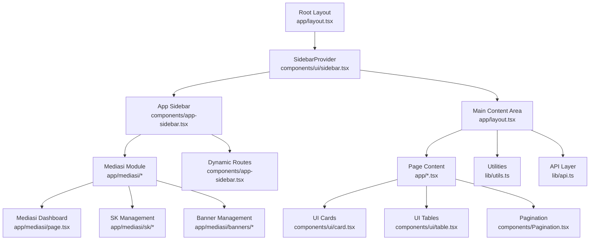

**Diagram sources**
- [app/layout.tsx:12-36](file://app/layout.tsx#L12-L36)
- [components/ui/sidebar.tsx:56-162](file://components/ui/sidebar.tsx#L56-L162)
- [components/app-sidebar.tsx:137-231](file://components/app-sidebar.tsx#L137-L231)
- [components/ui/card.tsx:5-77](file://components/ui/card.tsx#L5-L77)
- [components/ui/table.tsx:5-121](file://components/ui/table.tsx#L5-L121)
- [components/Pagination.tsx:11-153](file://components/Pagination.tsx#L11-L153)
- [lib/utils.ts:8-16](file://lib/utils.ts#L8-L16)
- [lib/api.ts:97-149](file://lib/api.ts#L97-L149)
- [app/mediasi/page.tsx:38-294](file://app/mediasi/page.tsx#L38-L294)

**Section sources**
- [app/layout.tsx:12-36](file://app/layout.tsx#L12-L36)
- [components/ui/sidebar.tsx:56-162](file://components/ui/sidebar.tsx#L56-L162)
- [components/app-sidebar.tsx:137-231](file://components/app-sidebar.tsx#L137-L231)

## Core Components
- Root layout: Provides the HTML shell, metadata, and hosts the sidebar provider and main content area.
- Sidebar provider and sidebar: Implements responsive sidebar behavior, keyboard shortcuts, cookie persistence, and mobile off-canvas.
- App sidebar: Renders a dynamic menu from a routes array, highlights active items, and includes a user dropdown.
- UI primitives: Card and Table components for content organization and data presentation.
- Utilities and API: Helpers for year options and API calls used by pages.
- **Mediasi Module**: New comprehensive content management system with dual-tab interface for SK and banner management.

**Updated** Added the new Mediasi module as a core component with its sophisticated tabbed interface and dual-content management capabilities.

**Section sources**
- [app/layout.tsx:12-36](file://app/layout.tsx#L12-L36)
- [components/ui/sidebar.tsx:56-162](file://components/ui/sidebar.tsx#L56-L162)
- [components/app-sidebar.tsx:44-135](file://components/app-sidebar.tsx#L44-L135)
- [components/ui/card.tsx:5-77](file://components/ui/card.tsx#L5-L77)
- [components/ui/table.tsx:5-121](file://components/ui/table.tsx#L5-L121)
- [lib/utils.ts:8-16](file://lib/utils.ts#L8-L16)
- [lib/api.ts:97-149](file://lib/api.ts#L97-L149)
- [app/mediasi/page.tsx:38-294](file://app/mediasi/page.tsx#L38-L294)

## Architecture Overview
The layout architecture combines a root wrapper with a provider-driven sidebar. The sidebar adapts to mobile using a sheet overlay and desktop using fixed positioning. Active navigation is determined by the current path. The new Mediasi module extends this architecture with sophisticated content management capabilities.

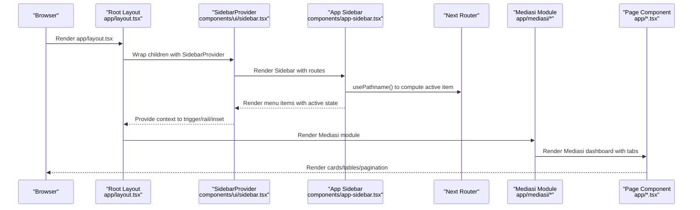

**Diagram sources**
- [app/layout.tsx:12-36](file://app/layout.tsx#L12-L36)
- [components/ui/sidebar.tsx:56-162](file://components/ui/sidebar.tsx#L56-L162)
- [components/app-sidebar.tsx:137-231](file://components/app-sidebar.tsx#L137-L231)
- [app/mediasi/page.tsx:38-294](file://app/mediasi/page.tsx#L38-L294)

## Detailed Component Analysis

### Root Layout and Composition
- Wraps the entire app with HTML metadata and a provider.
- Hosts the AppSidebar and a main container with a sticky header containing the SidebarTrigger.
- Uses a flex layout to allocate space for sidebar and content, with a scrollable content area.

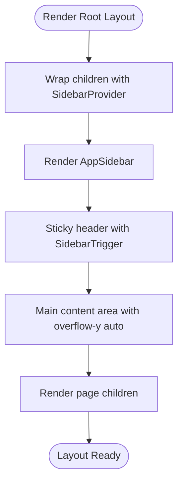

**Diagram sources**
- [app/layout.tsx:12-36](file://app/layout.tsx#L12-L36)

**Section sources**
- [app/layout.tsx:12-36](file://app/layout.tsx#L12-L36)

### Sidebar Provider and Responsive Behavior
- Provides state for open/collapsed, mobile mode, and keyboard shortcut toggling.
- Persists sidebar state in a cookie and applies CSS variables for widths.
- Switches between desktop fixed sidebar and mobile sheet based on device detection.

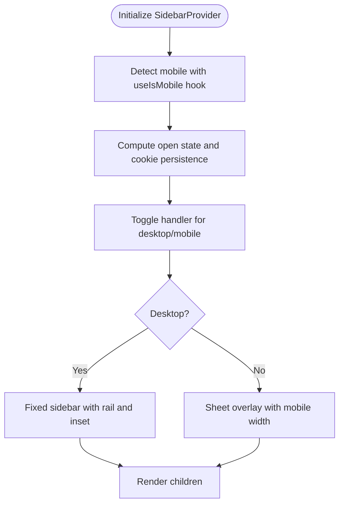

**Diagram sources**
- [components/ui/sidebar.tsx:56-162](file://components/ui/sidebar.tsx#L56-L162)
- [hooks/use-mobile.tsx:5-19](file://hooks/use-mobile.tsx#L5-L19)

**Section sources**
- [components/ui/sidebar.tsx:56-162](file://components/ui/sidebar.tsx#L56-L162)
- [hooks/use-mobile.tsx:5-19](file://hooks/use-mobile.tsx#L5-L19)

### Dynamic Route Generation and Active Navigation
- The AppSidebar defines a routes array with label, icon, href, and color.
- Active state is computed against the current path using Next's usePathname.
- Uses a menu button with optional tooltip and a shine border effect for active items.
- **Updated** Now includes the new Mediasi route with Handshake icon and amber color scheme.

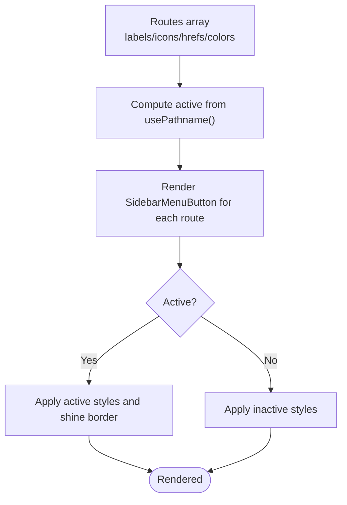

**Diagram sources**
- [components/app-sidebar.tsx:44-135](file://components/app-sidebar.tsx#L44-L135)
- [components/app-sidebar.tsx:137-231](file://components/app-sidebar.tsx#L137-L231)

**Section sources**
- [components/app-sidebar.tsx:44-135](file://components/app-sidebar.tsx#L44-L135)
- [components/app-sidebar.tsx:137-231](file://components/app-sidebar.tsx#L137-L231)

### Mediasi Module Implementation
- **New** Comprehensive content management system for mediator-related content.
- Features dual-tab interface for SK Mediasi and Banner Mediator management.
- Supports CRUD operations for SK documents and banner images.
- Includes sophisticated data fetching, loading states, and error handling.
- Implements responsive grid layouts for banner management.

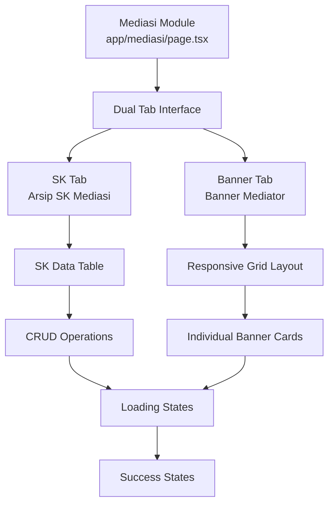

**Diagram sources**
- [app/mediasi/page.tsx:38-294](file://app/mediasi/page.tsx#L38-L294)

**Section sources**
- [app/mediasi/page.tsx:38-294](file://app/mediasi/page.tsx#L38-L294)
- [lib/api.ts:1150-1233](file://lib/api.ts#L1150-L1233)

### Card Components for Content Organization
- Card, CardHeader, CardTitle, CardDescription, CardContent, CardFooter provide a consistent content container with shadows and borders.
- Used extensively in dashboard pages to group actions and summaries.
- **Updated** Enhanced with blur-fade animations and improved responsive design.

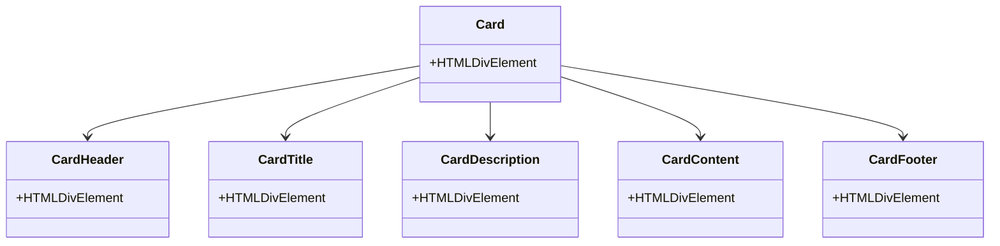

**Diagram sources**
- [components/ui/card.tsx:5-77](file://components/ui/card.tsx#L5-L77)

**Section sources**
- [components/ui/card.tsx:5-77](file://components/ui/card.tsx#L5-L77)
- [app/page.tsx:47-232](file://app/page.tsx#L47-L232)

### Table Components for Data Presentation
- Table, TableHeader, TableBody, TableFooter, TableRow, TableHead, TableCell, TableCaption provide a scrollable, responsive table container.
- Used in list pages to display paginated datasets with actions.
- **Updated** Enhanced with skeleton loading states and improved responsive behavior.

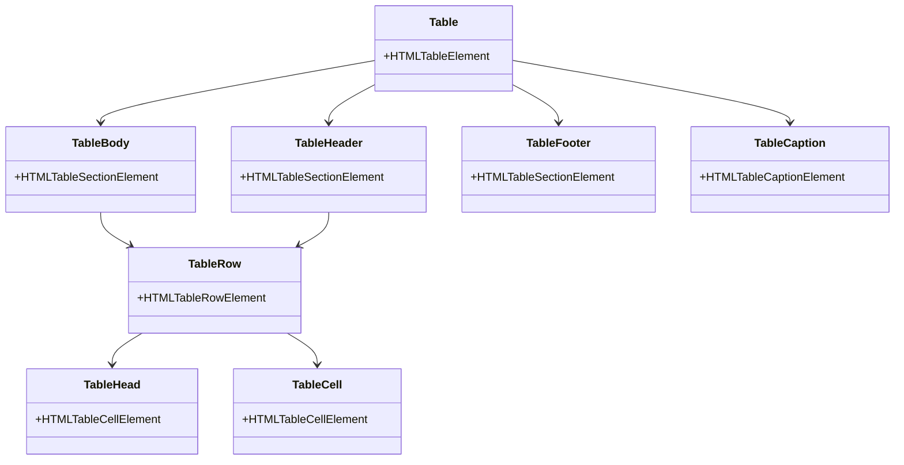

**Diagram sources**
- [components/ui/table.tsx:5-121](file://components/ui/table.tsx#L5-L121)

**Section sources**
- [components/ui/table.tsx:5-121](file://components/ui/table.tsx#L5-L121)
- [app/panggilan/page.tsx:157-284](file://app/panggilan/page.tsx#L157-L284)

### Pagination Implementation
- Two pagination approaches are present:
  - Built-in UI pagination component used in list pages.
  - A reusable Pagination component with ellipsis rendering and responsive controls.

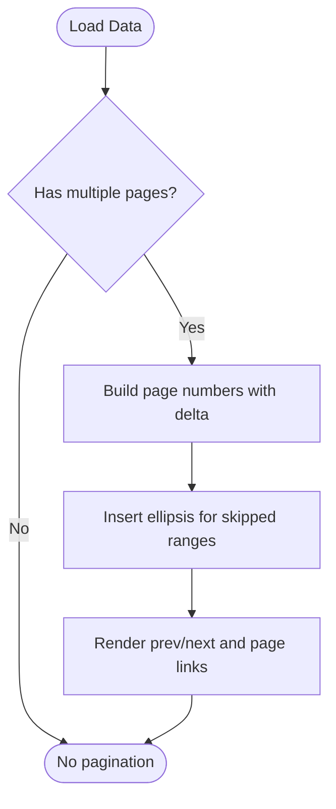

**Diagram sources**
- [app/panggilan/page.tsx:102-137](file://app/panggilan/page.tsx#L102-L137)
- [components/Pagination.tsx:11-80](file://components/Pagination.tsx#L11-L80)

**Section sources**
- [app/panggilan/page.tsx:102-137](file://app/panggilan/page.tsx#L102-L137)
- [components/Pagination.tsx:11-80](file://components/Pagination.tsx#L11-L80)

### Utility and API Integration
- Year options helper generates selectable years for filters.
- API module centralizes fetch calls for multiple domains (panggilan, itsbat, agenda, etc.), normalizing responses and handling form submissions.
- **Updated** Enhanced with comprehensive Mediasi API functions for SK and banner management.

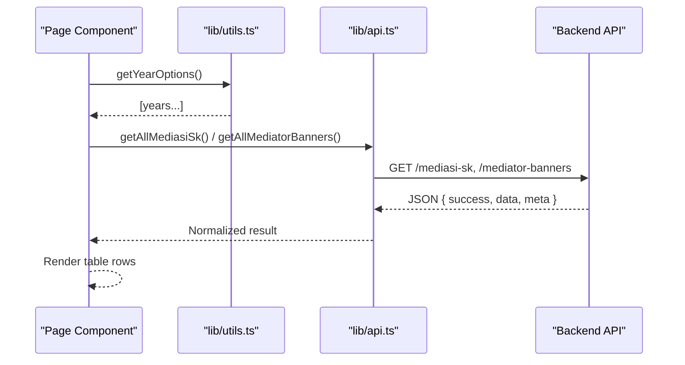

**Diagram sources**
- [lib/utils.ts:8-16](file://lib/utils.ts#L8-L16)
- [lib/api.ts:97-149](file://lib/api.ts#L97-L149)
- [app/panggilan/page.tsx:28-69](file://app/panggilan/page.tsx#L28-L69)

**Section sources**
- [lib/utils.ts:8-16](file://lib/utils.ts#L8-L16)
- [lib/api.ts:97-149](file://lib/api.ts#L97-L149)
- [app/panggilan/page.tsx:28-69](file://app/panggilan/page.tsx#L28-L69)

## Dependency Analysis
- Root layout depends on the sidebar provider and AppSidebar.
- AppSidebar depends on Next router hooks, Lucide icons, and UI primitives.
- UI primitives depend on shared utilities and Tailwind classes.
- Pages depend on UI primitives, utilities, and the API layer.
- **Updated** Mediasi module depends on specialized API functions and complex UI components.

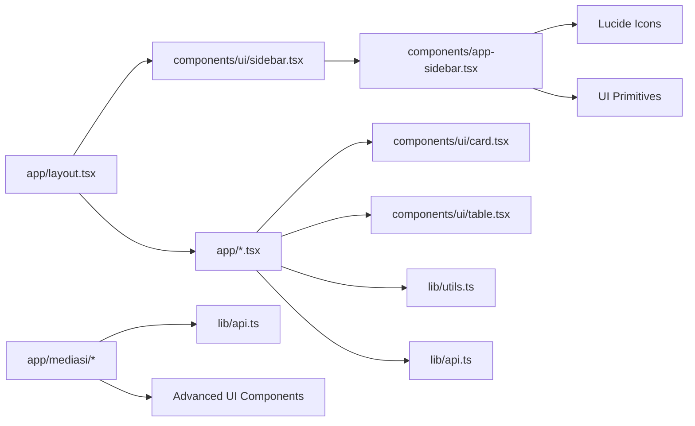

**Diagram sources**
- [app/layout.tsx:12-36](file://app/layout.tsx#L12-L36)
- [components/ui/sidebar.tsx:56-162](file://components/ui/sidebar.tsx#L56-L162)
- [components/app-sidebar.tsx:137-231](file://components/app-sidebar.tsx#L137-L231)
- [components/ui/card.tsx:5-77](file://components/ui/card.tsx#L5-L77)
- [components/ui/table.tsx:5-121](file://components/ui/table.tsx#L5-L121)
- [lib/utils.ts:8-16](file://lib/utils.ts#L8-L16)
- [lib/api.ts:97-149](file://lib/api.ts#L97-L149)
- [app/mediasi/page.tsx:38-294](file://app/mediasi/page.tsx#L38-L294)

**Section sources**
- [app/layout.tsx:12-36](file://app/layout.tsx#L12-L36)
- [components/ui/sidebar.tsx:56-162](file://components/ui/sidebar.tsx#L56-L162)
- [components/app-sidebar.tsx:137-231](file://components/app-sidebar.tsx#L137-L231)
- [components/ui/card.tsx:5-77](file://components/ui/card.tsx#L5-L77)
- [components/ui/table.tsx:5-121](file://components/ui/table.tsx#L5-L121)
- [lib/utils.ts:8-16](file://lib/utils.ts#L8-L16)
- [lib/api.ts:97-149](file://lib/api.ts#L97-L149)

## Performance Considerations
- Cookie-based state persistence avoids re-computation on mount and reduces layout shifts.
- Mobile detection via media query listener ensures minimal re-renders.
- Table containers use overflow auto to prevent layout thrashing on small screens.
- Skeleton loading in list pages improves perceived performance during data fetch.
- Pagination limits rendered items to reduce DOM size.
- **Updated** Mediasi module uses concurrent data fetching and optimized grid layouts for better performance.

[No sources needed since this section provides general guidance]

## Troubleshooting Guide
- Sidebar not toggling on desktop: Verify the SidebarProvider is wrapping the AppSidebar and that the toggle handler is invoked by the SidebarTrigger.
- Active item not highlighted: Ensure usePathname is used and the route href matches the current path exactly.
- Mobile sidebar not opening: Confirm useIsMobile returns true on small screens and that the sheet overlay is enabled.
- Table overflow issues: Ensure the Table wrapper has overflow auto and responsive breakpoints are configured.
- Year filter not populating: Confirm getYearOptions is called and the Select component is bound to the returned values.
- **Updated** Mediasi module not loading: Verify API endpoints are accessible and data fetching functions are properly implemented.

**Section sources**
- [components/ui/sidebar.tsx:56-162](file://components/ui/sidebar.tsx#L56-L162)
- [components/app-sidebar.tsx:137-231](file://components/app-sidebar.tsx#L137-L231)
- [hooks/use-mobile.tsx:5-19](file://hooks/use-mobile.tsx#L5-L19)
- [components/ui/table.tsx:5-16](file://components/ui/table.tsx#L5-L16)
- [lib/utils.ts:8-16](file://lib/utils.ts#L8-L16)

## Conclusion
The layout system integrates a responsive sidebar provider with a dynamic navigation menu, a root layout wrapper, and reusable UI primitives. Pages leverage cards and tables for content organization and pagination for efficient data browsing. The system balances performance with accessibility through cookie-persisted state, mobile-first design, and semantic UI components. **Updated** The addition of the Mediasi module demonstrates the system's extensibility and capability to handle complex content management scenarios with sophisticated UI patterns and data management.

[No sources needed since this section summarizes without analyzing specific files]

## Appendices

### Accessibility Considerations
- Use the SidebarTrigger for keyboard accessibility and screen reader support.
- Ensure active states are visually distinct and announced by assistive technologies.
- Provide meaningful labels for buttons and menus.
- Maintain sufficient color contrast for text and interactive elements.
- **Updated** Ensure Mediasi module provides proper ARIA labels and keyboard navigation for tabbed interfaces.

[No sources needed since this section provides general guidance]

### Performance Optimization Tips
- Minimize heavy computations in the sidebar routes array.
- Defer non-critical UI updates until after initial render.
- Use skeleton loaders for tables and lists.
- Keep cookie state updates minimal and scoped.
- **Updated** Implement lazy loading for Mediasi module content and optimize API calls.

[No sources needed since this section provides general guidance]

### Example Navigation Setup
- Define routes in the AppSidebar routes array with label, icon, href, and color.
- Use Next Link components inside SidebarMenuButton for navigation.
- Compute active state with usePathname and apply active styles.
- **Updated** Add new routes following the established pattern with appropriate icons and colors.

**Section sources**
- [components/app-sidebar.tsx:44-135](file://components/app-sidebar.tsx#L44-L135)
- [components/app-sidebar.tsx:137-231](file://components/app-sidebar.tsx#L137-L231)

### Sidebar Customization Examples
- Change sidebar width via CSS variables exposed by the provider.
- Modify collapsible behavior by adjusting the collapsible prop on Sidebar.
- Customize appearance by updating Tailwind theme variables for sidebar colors.
- **Updated** Add new menu items following the established pattern with proper routing and styling.

**Section sources**
- [components/ui/sidebar.tsx:28-33](file://components/ui/sidebar.tsx#L28-L33)
- [components/ui/sidebar.tsx:176-178](file://components/ui/sidebar.tsx#L176-L178)
- [app/globals.css:32-75](file://app/globals.css#L32-L75)

### Layout Modifications
- Add or remove modules by extending the routes array in AppSidebar.
- Integrate new pages by rendering them under the Root Layout.
- Adjust spacing and typography using Tailwind utilities and the global CSS theme.
- **Updated** Implement new modules following the Mediasi pattern with proper API integration and UI components.

**Section sources**
- [components/app-sidebar.tsx:44-135](file://components/app-sidebar.tsx#L44-L135)
- [app/layout.tsx:12-36](file://app/layout.tsx#L12-L36)
- [tailwind.config.ts:20-100](file://tailwind.config.ts#L20-L100)

### Mediasi Module Integration
- **New** The Mediasi module demonstrates advanced content management patterns.
- Features dual-tab interface with sophisticated data management.
- Implements responsive design patterns for different content types.
- Provides comprehensive CRUD operations with proper error handling.
- Integrates seamlessly with the existing layout and navigation system.

**Section sources**
- [app/mediasi/page.tsx:38-294](file://app/mediasi/page.tsx#L38-L294)
- [lib/api.ts:1150-1233](file://lib/api.ts#L1150-L1233)