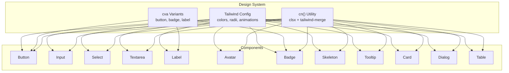
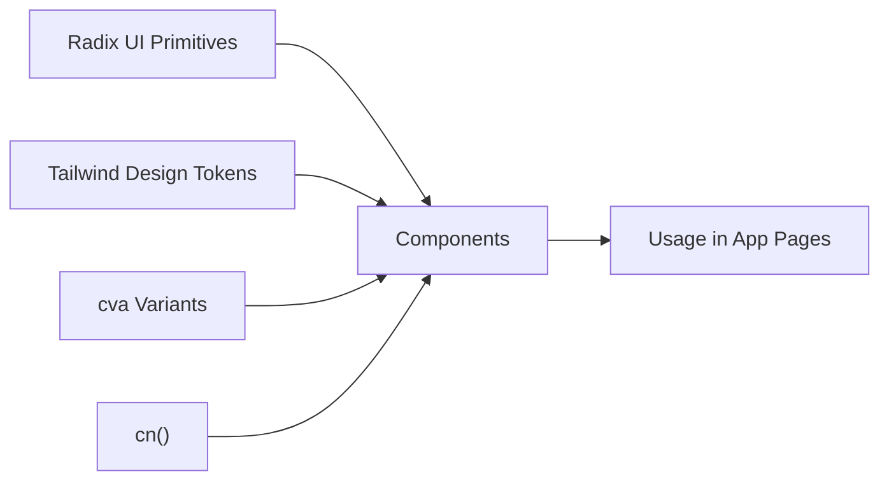
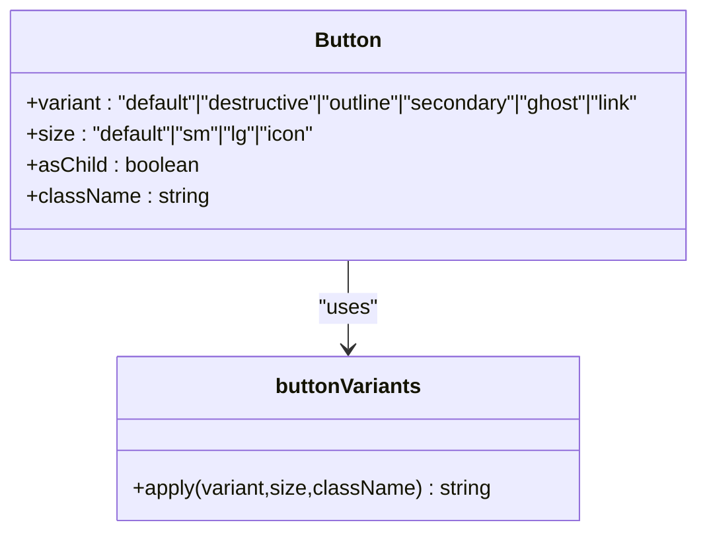
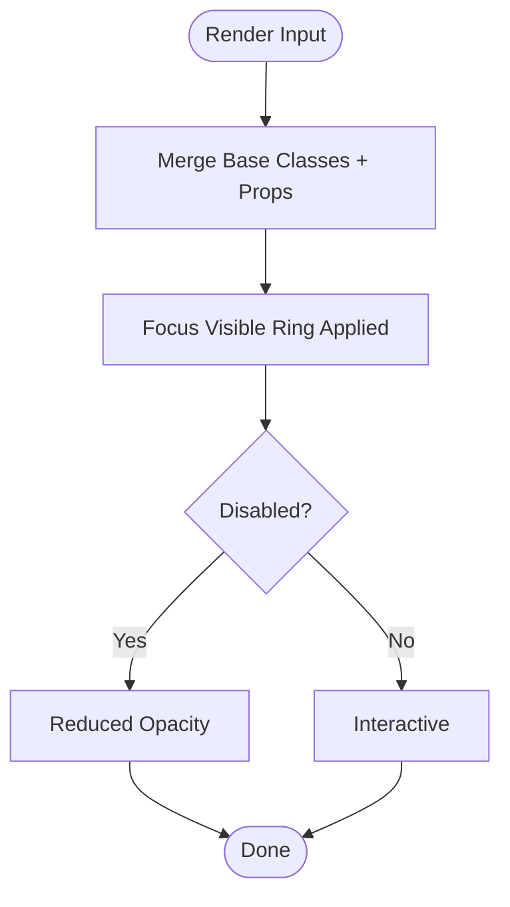
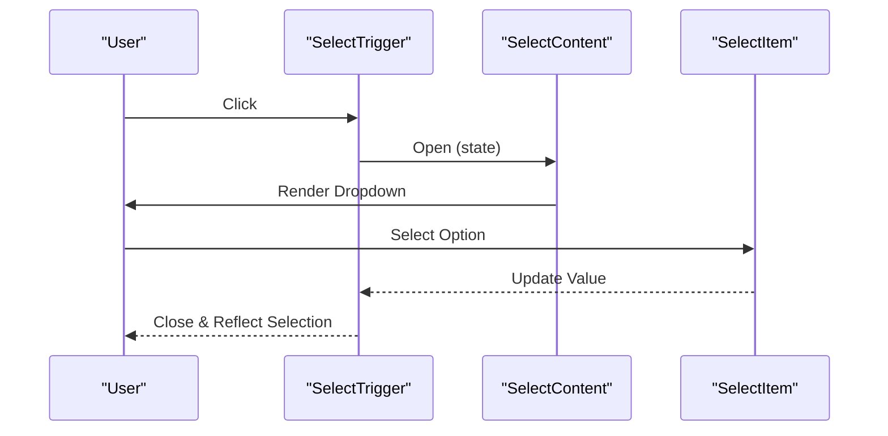
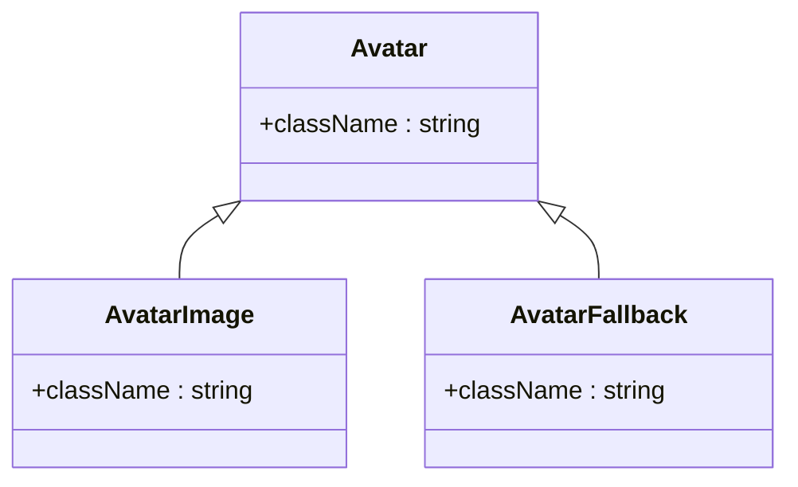
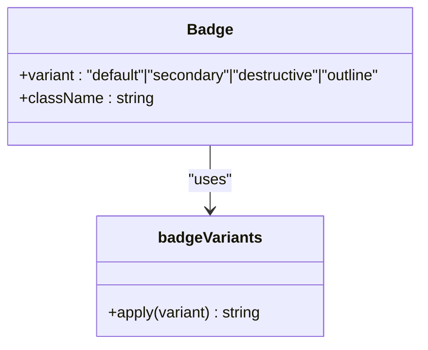
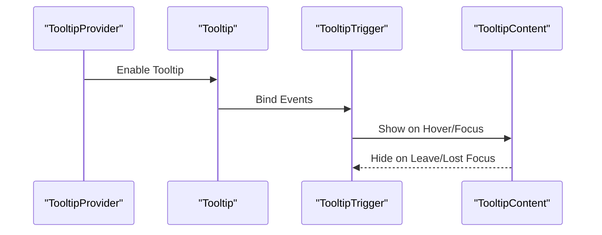
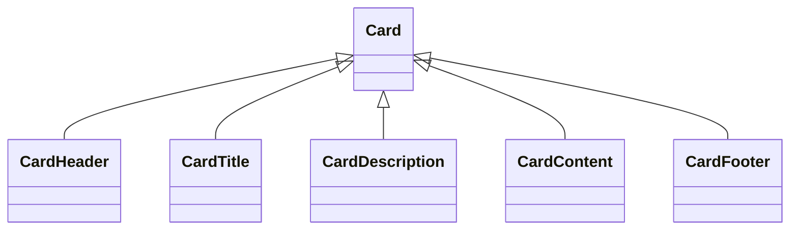
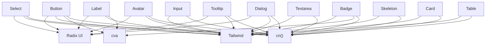

# UI Component Library

<cite>
**Referenced Files in This Document**
- [button.tsx](file://components/ui/button.tsx)
- [input.tsx](file://components/ui/input.tsx)
- [select.tsx](file://components/ui/select.tsx)
- [textarea.tsx](file://components/ui/textarea.tsx)
- [label.tsx](file://components/ui/label.tsx)
- [avatar.tsx](file://components/ui/avatar.tsx)
- [badge.tsx](file://components/ui/badge.tsx)
- [skeleton.tsx](file://components/ui/skeleton.tsx)
- [tooltip.tsx](file://components/ui/tooltip.tsx)
- [card.tsx](file://components/ui/card.tsx)
- [dialog.tsx](file://components/ui/dialog.tsx)
- [table.tsx](file://components/ui/table.tsx)
- [tailwind.config.ts](file://tailwind.config.ts)
- [utils.ts](file://lib/utils.ts)
- [components.json](file://components.json)
</cite>

## Table of Contents
1. [Introduction](#introduction)
2. [Project Structure](#project-structure)
3. [Core Components](#core-components)
4. [Architecture Overview](#architecture-overview)
5. [Detailed Component Analysis](#detailed-component-analysis)
6. [Dependency Analysis](#dependency-analysis)
7. [Performance Considerations](#performance-considerations)
8. [Troubleshooting Guide](#troubleshooting-guide)
9. [Conclusion](#conclusion)
10. [Appendices](#appendices)

## Introduction
This document describes the UI component library built on Radix UI primitives and Tailwind CSS. It explains the base component architecture, design system principles, and consistent styling patterns. It covers the button component system (variants and sizes), form input components (input, select, textarea, label), decorative components (avatar, badge, skeleton), and interactive elements (tooltip). It also documents prop interfaces, usage guidance, customization options, accessibility features, component composition patterns, state management, and extension guidelines.

## Project Structure
The UI components live under components/ui and are composed with:
- Radix UI primitives for accessible, unstyled foundations
- Tailwind CSS for styling and design tokens
- class-variance-authority (cva) for variant-driven styling
- A shared cn() utility for merging Tailwind classes safely

**Diagram sources**
- [tailwind.config.ts:1-106](file://tailwind.config.ts#L1-L106)
- [button.tsx:7-35](file://components/ui/button.tsx#L7-L35)
- [badge.tsx:6-24](file://components/ui/badge.tsx#L6-L24)
- [label.tsx:9-11](file://components/ui/label.tsx#L9-L11)
- [utils.ts:4-6](file://lib/utils.ts#L4-L6)

**Section sources**
- [tailwind.config.ts:1-106](file://tailwind.config.ts#L1-L106)
- [components.json:1-25](file://components.json#L1-L25)

## Core Components
This section summarizes the foundational building blocks and their roles in the design system.

- Button: Variant-driven primary action with size options and support for rendering as child elements via a slot.
- Input: Text input with consistent focus states, disabled states, and responsive typography.
- Select: Composite widget built on Radix UI with trigger, content, item, label, separators, and scroll buttons.
- Textarea: Multi-line text area with consistent focus states and responsive typography.
- Label: Accessible label for form controls with peer-based disabled states.
- Avatar: Image with fallback and rounded-full shape.
- Badge: Lightweight indicator with variant-based color schemes.
- Skeleton: Pulse animation container for loading states.
- Tooltip: Provider-root-trigger-content triad with portal rendering and directional animations.
- Card: Container with header, title, description, content, and footer slots.
- Dialog: Overlay, content, header/footer, title, and description with close button.
- Table: Scrollable wrapper plus table, thead, tbody, tfoot, tr, th, td, caption.

**Section sources**
- [button.tsx:37-57](file://components/ui/button.tsx#L37-L57)
- [input.tsx:5-22](file://components/ui/input.tsx#L5-L22)
- [select.tsx:9-159](file://components/ui/select.tsx#L9-L159)
- [textarea.tsx:5-22](file://components/ui/textarea.tsx#L5-L22)
- [label.tsx:13-24](file://components/ui/label.tsx#L13-L24)
- [avatar.tsx:8-50](file://components/ui/avatar.tsx#L8-L50)
- [badge.tsx:26-36](file://components/ui/badge.tsx#L26-L36)
- [skeleton.tsx:3-15](file://components/ui/skeleton.tsx#L3-L15)
- [tooltip.tsx:8-32](file://components/ui/tooltip.tsx#L8-L32)
- [card.tsx:5-76](file://components/ui/card.tsx#L5-L76)
- [dialog.tsx:9-122](file://components/ui/dialog.tsx#L9-L122)
- [table.tsx:5-120](file://components/ui/table.tsx#L5-L120)

## Architecture Overview
The library follows a consistent pattern:
- Use Radix UI for semantics and accessibility
- Apply Tailwind classes for styling and design tokens
- Use cva for variant-driven styles
- Use cn() to merge classes safely
- Compose small, focused components into larger ones (e.g., Card parts, Select parts)

**Diagram sources**
- [button.tsx:1-6](file://components/ui/button.tsx#L1-L6)
- [select.tsx:1-8](file://components/ui/select.tsx#L1-L8)
- [tailwind.config.ts:20-77](file://tailwind.config.ts#L20-L77)
- [utils.ts:4-6](file://lib/utils.ts#L4-L6)

## Detailed Component Analysis

### Button
- Purpose: Primary action with consistent focus, hover, active, disabled states.
- Variants: default, destructive, outline, secondary, ghost, link.
- Sizes: default, sm, lg, icon.
- Composition: Uses a slot to render as a child element when asChild is true.
- Accessibility: Inherits native button semantics; focus-visible ring applied via design system.

**Diagram sources**
- [button.tsx:7-35](file://components/ui/button.tsx#L7-L35)
- [button.tsx:37-57](file://components/ui/button.tsx#L37-L57)

**Section sources**
- [button.tsx:7-35](file://components/ui/button.tsx#L7-L35)
- [button.tsx:37-57](file://components/ui/button.tsx#L37-L57)

### Form Inputs

#### Input
- Purpose: Single-line text input with consistent focus and disabled states.
- Styling: Inherits design tokens for border, background, placeholder, and focus ring.

**Diagram sources**
- [input.tsx:5-22](file://components/ui/input.tsx#L5-L22)

**Section sources**
- [input.tsx:5-22](file://components/ui/input.tsx#L5-L22)

#### Select
- Purpose: Accessible single/multi-select with composite parts.
- Parts: Root, Group, Value, Trigger, Content, Label, Item, Separator, ScrollUp/Down buttons.
- Behavior: Portal-rendered content with animations; viewport sizing adapts to trigger.

**Diagram sources**
- [select.tsx:9-159](file://components/ui/select.tsx#L9-L159)

**Section sources**
- [select.tsx:9-159](file://components/ui/select.tsx#L9-L159)

#### Textarea
- Purpose: Multi-line text input with consistent focus and disabled states.

**Section sources**
- [textarea.tsx:5-22](file://components/ui/textarea.tsx#L5-L22)

#### Label
- Purpose: Accessible label paired with form controls.
- Variants: Uses cva for label-specific styling; integrates with peer-disabled states.

**Section sources**
- [label.tsx:9-24](file://components/ui/label.tsx#L9-L24)

### Decorative Components

#### Avatar
- Purpose: User or entity image with fallback and rounded-full shape.

**Diagram sources**
- [avatar.tsx:8-50](file://components/ui/avatar.tsx#L8-L50)

**Section sources**
- [avatar.tsx:8-50](file://components/ui/avatar.tsx#L8-L50)

#### Badge
- Purpose: Lightweight indicator with variant-based color schemes.

**Diagram sources**
- [badge.tsx:6-24](file://components/ui/badge.tsx#L6-L24)
- [badge.tsx:26-36](file://components/ui/badge.tsx#L26-L36)

**Section sources**
- [badge.tsx:6-24](file://components/ui/badge.tsx#L6-L24)
- [badge.tsx:26-36](file://components/ui/badge.tsx#L26-L36)

#### Skeleton
- Purpose: Loading state with pulse animation.

**Section sources**
- [skeleton.tsx:3-15](file://components/ui/skeleton.tsx#L3-L15)

### Interactive Elements

#### Tooltip
- Purpose: Tooltip with provider-root-trigger-content structure and portal rendering.

**Diagram sources**
- [tooltip.tsx:8-32](file://components/ui/tooltip.tsx#L8-L32)

**Section sources**
- [tooltip.tsx:8-32](file://components/ui/tooltip.tsx#L8-L32)

### Layout and Containers

#### Card
- Purpose: Container with header, title, description, content, and footer slots.

**Diagram sources**
- [card.tsx:5-76](file://components/ui/card.tsx#L5-L76)

**Section sources**
- [card.tsx:5-76](file://components/ui/card.tsx#L5-L76)

#### Dialog
- Purpose: Modal overlay with close button, header/footer, title, and description.

**Section sources**
- [dialog.tsx:9-122](file://components/ui/dialog.tsx#L9-L122)

#### Table
- Purpose: Scrollable table with semantic head/body/footer and row/cell helpers.

**Section sources**
- [table.tsx:5-120](file://components/ui/table.tsx#L5-L120)

## Dependency Analysis
The components share common dependencies and patterns:
- Radix UI: Used across Select, Tooltip, Dialog, Label, Avatar, and others for accessible semantics.
- Tailwind: Provides design tokens (colors, spacing, radii, shadows, animations).
- cva: Centralized variant definitions for Button, Badge, Label.
- cn(): Merges Tailwind classes consistently.

**Diagram sources**
- [button.tsx:1-6](file://components/ui/button.tsx#L1-L6)
- [select.tsx:1-8](file://components/ui/select.tsx#L1-L8)
- [tooltip.tsx:1-7](file://components/ui/tooltip.tsx#L1-L7)
- [dialog.tsx:1-8](file://components/ui/dialog.tsx#L1-L8)
- [label.tsx:1-8](file://components/ui/label.tsx#L1-L8)
- [avatar.tsx:1-7](file://components/ui/avatar.tsx#L1-L7)
- [badge.tsx:1-5](file://components/ui/badge.tsx#L1-L5)
- [tailwind.config.ts:20-77](file://tailwind.config.ts#L20-L77)
- [utils.ts:4-6](file://lib/utils.ts#L4-L6)

**Section sources**
- [button.tsx:1-6](file://components/ui/button.tsx#L1-L6)
- [select.tsx:1-8](file://components/ui/select.tsx#L1-L8)
- [tooltip.tsx:1-7](file://components/ui/tooltip.tsx#L1-L7)
- [dialog.tsx:1-8](file://components/ui/dialog.tsx#L1-L8)
- [label.tsx:1-8](file://components/ui/label.tsx#L1-L8)
- [avatar.tsx:1-7](file://components/ui/avatar.tsx#L1-L7)
- [badge.tsx:1-5](file://components/ui/badge.tsx#L1-L5)
- [tailwind.config.ts:20-77](file://tailwind.config.ts#L20-L77)
- [utils.ts:4-6](file://lib/utils.ts#L4-L6)

## Performance Considerations
- Prefer variant props over ad hoc class overrides to keep the variant set small and predictable.
- Use cn() to avoid redundant or conflicting Tailwind classes.
- Keep animations minimal; tooltips and selects already apply subtle transitions.
- Defer heavy DOM work inside portals to reduce layout thrash.
- Reuse shared design tokens to minimize CSS bloat.

## Troubleshooting Guide
- Button not responding to clicks:
  - Ensure the component renders as a button element; when asChild is true, it renders whatever parent is passed.
- Select content not visible:
  - Confirm the Select is wrapped in a Portal and positioned correctly; check viewport sizing and trigger height.
- Tooltip not appearing:
  - Verify TooltipProvider is enabled and TooltipTrigger is attached to a focusable element.
- Input/Textarea focus ring missing:
  - Ensure focus-visible ring classes are not overridden; confirm Tailwind theme includes ring colors.
- Badge or Label variant not applying:
  - Check variant names match the cva definition and className is not overriding the variant classes.

**Section sources**
- [button.tsx:43-53](file://components/ui/button.tsx#L43-L53)
- [select.tsx:70-99](file://components/ui/select.tsx#L70-L99)
- [tooltip.tsx:8-32](file://components/ui/tooltip.tsx#L8-L32)
- [tailwind.config.ts:20-77](file://tailwind.config.ts#L20-L77)
- [badge.tsx:6-24](file://components/ui/badge.tsx#L6-L24)
- [label.tsx:9-11](file://components/ui/label.tsx#L9-L11)

## Conclusion
The UI component library leverages Radix UI for accessibility and Tailwind for a cohesive design system. Components are structured around variant-driven styling with cva, consistent class merging via cn(), and clear composition patterns. This enables predictable customization, strong accessibility, and maintainable extensions across the application.

## Appendices

### Design System Principles
- Tokens-first: Colors, spacing, radii, and animations are defined centrally.
- Variants over overrides: Prefer variant props to maintain consistency.
- Accessibility-first: Built on Radix UI primitives with proper ARIA and keyboard navigation.
- Composition: Small, focused components compose into larger layouts.

**Section sources**
- [tailwind.config.ts:20-77](file://tailwind.config.ts#L20-L77)
- [components.json:6-12](file://components.json#L6-L12)

### Extending Components
- Add a new variant:
  - Extend cva in the component’s file and export the updated variant function.
  - Update the component’s prop interface to include the new variant option.
- Introduce a new component:
  - Place it under components/ui with a clear name.
  - Use cn() for class merging and Tailwind tokens for styling.
  - Wrap content in Radix primitives when appropriate for accessibility.
- Customize appearance:
  - Pass className to augment defaults; avoid overriding variant classes.
  - Adjust Tailwind tokens in the central configuration for global changes.

**Section sources**
- [button.tsx:7-35](file://components/ui/button.tsx#L7-L35)
- [badge.tsx:6-24](file://components/ui/badge.tsx#L6-L24)
- [utils.ts:4-6](file://lib/utils.ts#L4-L6)
- [tailwind.config.ts:20-77](file://tailwind.config.ts#L20-L77)