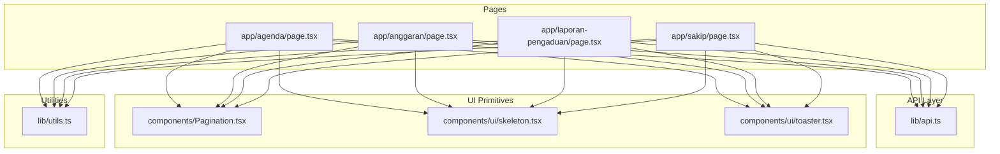
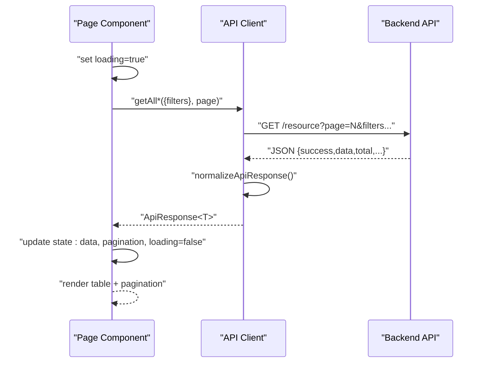
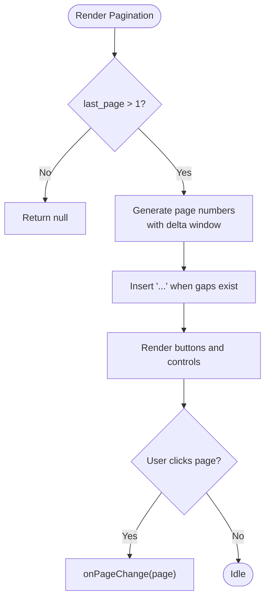
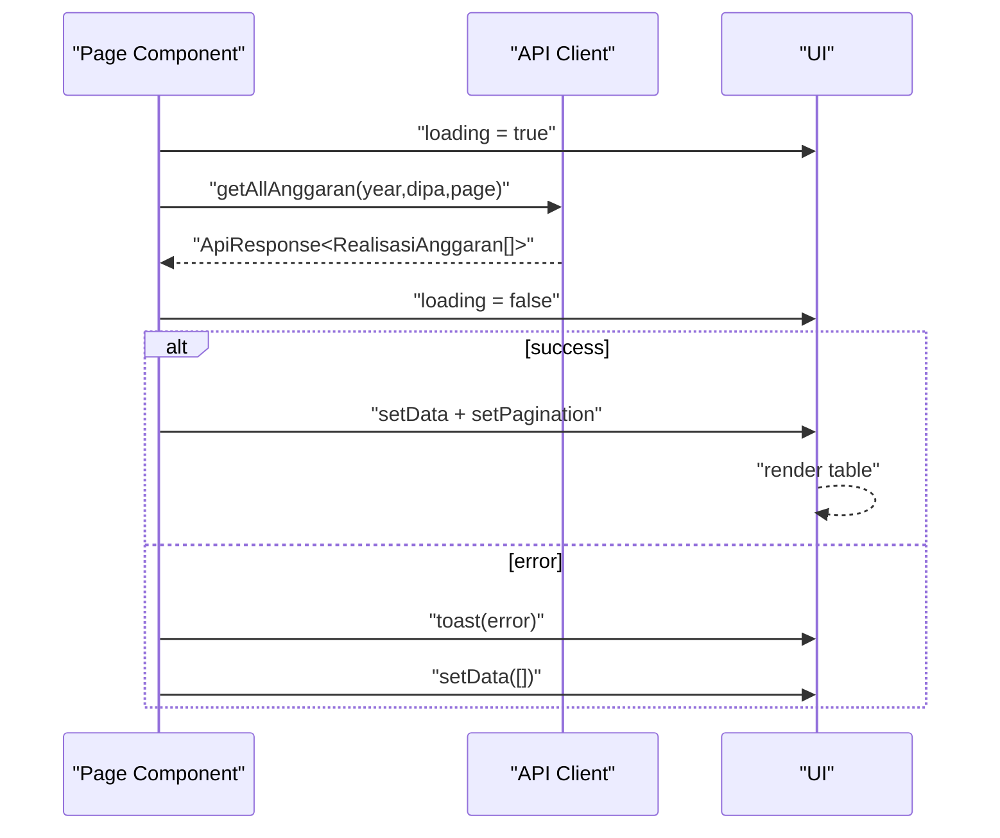
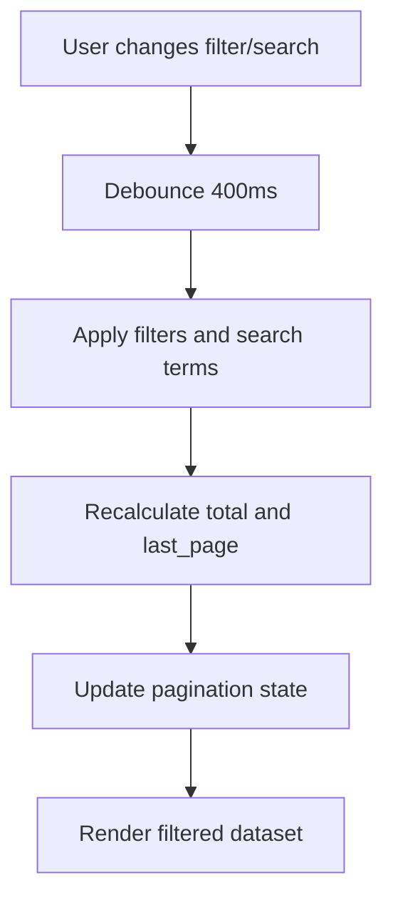
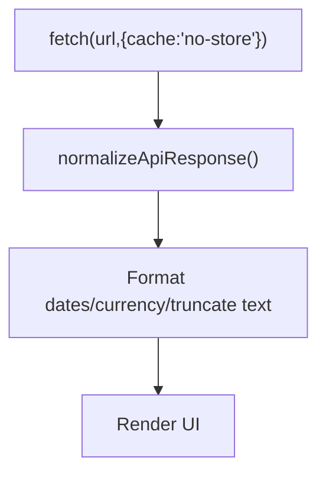
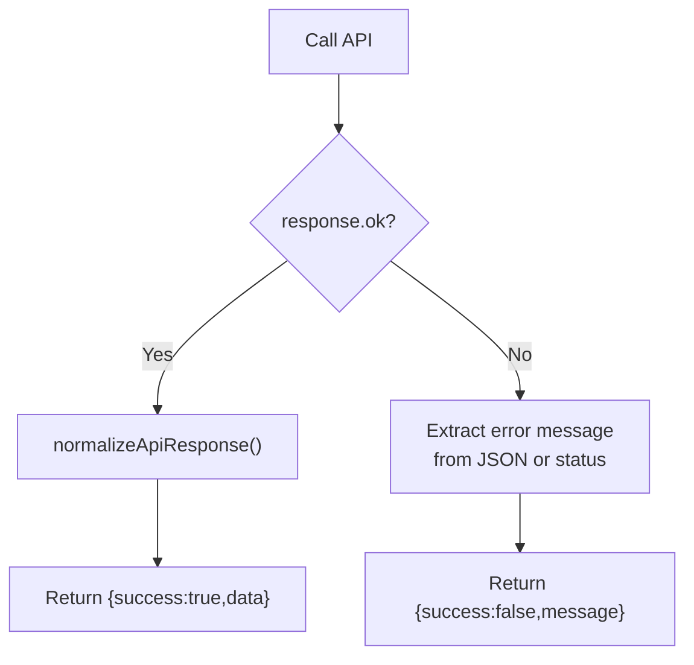
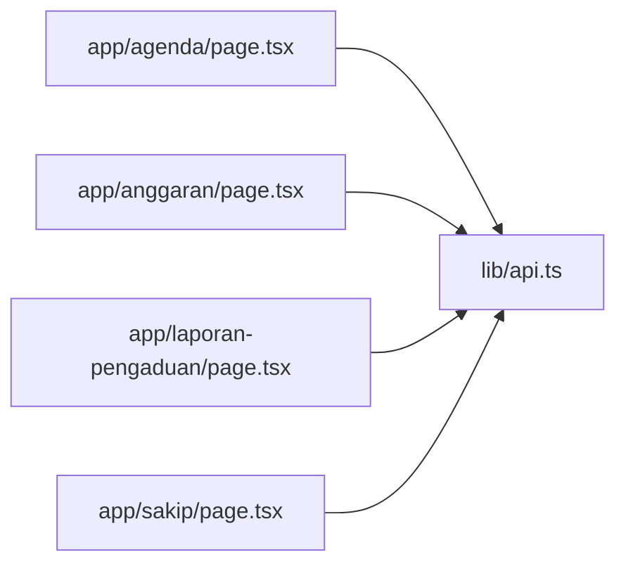

# Data Management

<cite>
**Referenced Files in This Document**
- [api.ts](file://lib/api.ts)
- [Pagination.tsx](file://components/Pagination.tsx)
- [agenda/page.tsx](file://app/agenda/page.tsx)
- [anggaran/page.tsx](file://app/anggaran/page.tsx)
- [laporan-pengaduan/page.tsx](file://app/laporan-pengaduan/page.tsx)
- [sakip/page.tsx](file://app/sakip/page.tsx)
- [skeleton.tsx](file://components/ui/skeleton.tsx)
- [toaster.tsx](file://components/ui/toaster.tsx)
- [utils.ts](file://lib/utils.ts)
</cite>

## Table of Contents
1. [Introduction](#introduction)
2. [Project Structure](#project-structure)
3. [Core Components](#core-components)
4. [Architecture Overview](#architecture-overview)
5. [Detailed Component Analysis](#detailed-component-analysis)
6. [Dependency Analysis](#dependency-analysis)
7. [Performance Considerations](#performance-considerations)
8. [Troubleshooting Guide](#troubleshooting-guide)
9. [Conclusion](#conclusion)

## Introduction
This document explains the data management patterns and implementation across the admin panel. It covers pagination, filtering and search, loading and error states, API integration, data fetching patterns, infinite scroll considerations, data transformation, caching strategies, performance optimization, validation, sorting, and export-related capabilities. The goal is to help developers understand how data flows through the system and how to maintain consistency and performance at scale.

## Project Structure
The data management stack is organized around:
- API client module that encapsulates HTTP requests and response normalization
- Page components that orchestrate data loading, filtering, pagination, and rendering
- UI primitives for loading states and notifications
- Utility helpers for formatting and year options

**Diagram sources**
- [agenda/page.tsx:1-284](file://app/agenda/page.tsx#L1-L284)
- [anggaran/page.tsx:1-335](file://app/anggaran/page.tsx#L1-L335)
- [laporan-pengaduan/page.tsx:1-355](file://app/laporan-pengaduan/page.tsx#L1-L355)
- [sakip/page.tsx:1-355](file://app/sakip/page.tsx#L1-L355)
- [api.ts:1-1144](file://lib/api.ts#L1-L1144)
- [Pagination.tsx:1-153](file://components/Pagination.tsx#L1-L153)
- [skeleton.tsx:1-16](file://components/ui/skeleton.tsx#L1-L16)
- [toaster.tsx:1-36](file://components/ui/toaster.tsx#L1-L36)
- [utils.ts:1-26](file://lib/utils.ts#L1-L26)

**Section sources**
- [api.ts:1-1144](file://lib/api.ts#L1-L1144)
- [Pagination.tsx:1-153](file://components/Pagination.tsx#L1-L153)
- [agenda/page.tsx:1-284](file://app/agenda/page.tsx#L1-L284)
- [anggaran/page.tsx:1-335](file://app/anggaran/page.tsx#L1-L335)
- [laporan-pengaduan/page.tsx:1-355](file://app/laporan-pengaduan/page.tsx#L1-L355)
- [sakip/page.tsx:1-355](file://app/sakip/page.tsx#L1-L355)
- [skeleton.tsx:1-16](file://components/ui/skeleton.tsx#L1-L16)
- [toaster.tsx:1-36](file://components/ui/toaster.tsx#L1-L36)
- [utils.ts:1-26](file://lib/utils.ts#L1-L26)

## Core Components
- API client: Centralized HTTP layer with normalized responses, typed models, and per-resource CRUD helpers. It supports query parameters, pagination, and file uploads via FormData.
- Pagination component: Reusable UI for navigating pages with ellipsis grouping and active-state indication.
- Page components: Orchestrate data loading, filtering, pagination, and rendering. They manage local state for filters, pagination metadata, and loading/error states.
- UI primitives: Skeleton loaders and toast notifications provide consistent UX during data operations.
- Utilities: Helpers for year options, currency formatting, and class merging.

**Section sources**
- [api.ts:43-80](file://lib/api.ts#L43-L80)
- [Pagination.tsx:4-80](file://components/Pagination.tsx#L4-L80)
- [agenda/page.tsx:47-91](file://app/agenda/page.tsx#L47-L91)
- [anggaran/page.tsx:31-75](file://app/anggaran/page.tsx#L31-L75)
- [laporan-pengaduan/page.tsx:32-60](file://app/laporan-pengaduan/page.tsx#L32-L60)
- [sakip/page.tsx:71-97](file://app/sakip/page.tsx#L71-L97)
- [skeleton.tsx:1-16](file://components/ui/skeleton.tsx#L1-L16)
- [toaster.tsx:13-35](file://components/ui/toaster.tsx#L13-L35)
- [utils.ts:8-25](file://lib/utils.ts#L8-L25)

## Architecture Overview
The data lifecycle follows a predictable pattern:
- UI triggers a load operation (e.g., on mount, filter change, pagination click)
- Page component calls the API client with appropriate parameters
- API client normalizes responses and returns typed results
- Page component updates local state (data, pagination metadata, loading flag)
- UI renders skeletons while loading and displays data or empty/error states
- Notifications surface errors and success messages

**Diagram sources**
- [api.ts:53-80](file://lib/api.ts#L53-L80)
- [api.ts:292-302](file://lib/api.ts#L292-L302)
- [agenda/page.tsx:62-87](file://app/agenda/page.tsx#L62-L87)
- [anggaran/page.tsx:45-71](file://app/anggaran/page.tsx#L45-L71)
- [laporan-pengaduan/page.tsx:43-58](file://app/laporan-pengaduan/page.tsx#L43-L58)

## Detailed Component Analysis

### Pagination Component Architecture
The reusable Pagination component exposes:
- Props: current page, last page, total, and an onPageChange callback
- Behavior: generates visible page indices with ellipsis grouping around the current page
- Rendering: previous/next buttons, numbered buttons, and an active state indicator

**Diagram sources**
- [Pagination.tsx:11-80](file://components/Pagination.tsx#L11-L80)

**Section sources**
- [Pagination.tsx:4-153](file://components/Pagination.tsx#L4-L153)

### Data Fetching Patterns and Loading States
- Pages call API helpers with filters and pagination parameters
- Loading state is toggled around fetch calls; skeletons are shown while loading
- Error handling displays toast notifications and clears data on failure
- Pagination metadata is extracted from API responses and stored locally

**Diagram sources**
- [anggaran/page.tsx:45-71](file://app/anggaran/page.tsx#L45-L71)
- [api.ts:43-80](file://lib/api.ts#L43-L80)

**Section sources**
- [agenda/page.tsx:62-91](file://app/agenda/page.tsx#L62-L91)
- [anggaran/page.tsx:45-71](file://app/anggaran/page.tsx#L45-L71)
- [laporan-pengaduan/page.tsx:43-58](file://app/laporan-pengaduan/page.tsx#L43-L58)
- [skeleton.tsx:1-16](file://components/ui/skeleton.tsx#L1-L16)
- [toaster.tsx:13-35](file://components/ui/toaster.tsx#L13-L35)

### Filtering and Search Functionality
- Filtering: Pages expose filter controls (e.g., year selectors) that trigger reloads with updated parameters.
- Client-side search: One page performs client-side filtering and pagination recalculation with debounced updates.

**Diagram sources**
- [sakip/page.tsx:71-97](file://app/sakip/page.tsx#L71-L97)

**Section sources**
- [agenda/page.tsx:156-172](file://app/agenda/page.tsx#L156-L172)
- [anggaran/page.tsx:168-188](file://app/anggaran/page.tsx#L168-L188)
- [laporan-pengaduan/page.tsx:146-156](file://app/laporan-pengaduan/page.tsx#L146-L156)
- [sakip/page.tsx:71-97](file://app/sakip/page.tsx#L71-L97)

### Infinite Scroll Considerations
- Current pages rely on explicit pagination controls and page navigation.
- Infinite scroll is not implemented in the analyzed pages; however, the architecture supports it by:
  - Accepting a page parameter in API calls
  - Returning pagination metadata (current_page, last_page, total)
  - Using a single data array that can be appended to as new pages load

[No sources needed since this section provides general guidance]

### Data Transformation and Caching Strategies
- Data transformation: Pages transform raw API data for display (e.g., currency formatting, date formatting, truncating long text).
- Caching: API calls use cache control to bypass browser caches for dynamic endpoints, ensuring fresh data on each request.

**Diagram sources**
- [api.ts:53-80](file://lib/api.ts#L53-L80)
- [anggaran/page.tsx:97-103](file://app/anggaran/page.tsx#L97-L103)
- [agenda/page.tsx:28-39](file://app/agenda/page.tsx#L28-L39)

**Section sources**
- [api.ts:99-105](file://lib/api.ts#L99-L105)
- [api.ts:156-163](file://lib/api.ts#L156-L163)
- [api.ts:292-302](file://lib/api.ts#L292-L302)
- [anggaran/page.tsx:97-103](file://app/anggaran/page.ts#L97-L103)
- [agenda/page.tsx:28-39](file://app/agenda/page.tsx#L28-L39)

### Error Handling Strategies
- API client normalizes responses and surfaces messages consistently.
- Pages catch errors during fetch and display user-friendly toasts.
- Some endpoints return structured validation errors; the client extracts the first field’s message for display.

**Diagram sources**
- [api.ts:53-80](file://lib/api.ts#L53-L80)
- [api.ts:800-820](file://lib/api.ts#L800-L820)
- [api.ts:885-906](file://lib/api.ts#L885-L906)

**Section sources**
- [api.ts:800-820](file://lib/api.ts#L800-L820)
- [api.ts:885-906](file://lib/api.ts#L885-L906)
- [agenda/page.tsx:78-86](file://app/agenda/page.tsx#L78-L86)
- [anggaran/page.tsx:63-71](file://app/anggaran/page.tsx#L63-L71)
- [laporan-pengaduan/page.tsx:53-58](file://app/laporan-pengaduan/page.tsx#L53-L58)

### Sorting Mechanisms
- Sorting is not implemented in the analyzed pages; however, the API client supports passing query parameters for filters and pagination.
- If server-side sorting is desired, add sort and direction parameters to API calls and apply them consistently across pages.

[No sources needed since this section provides general guidance]

### Export Functionality
- Export is not implemented in the analyzed pages.
- To support exports, add endpoints that return CSV/Excel and integrate download links in the UI.

[No sources needed since this section provides general guidance]

## Dependency Analysis
The following diagram highlights key dependencies among data-managed pages and the API client.

**Diagram sources**
- [api.ts:1-1144](file://lib/api.ts#L1-L1144)
- [agenda/page.tsx:1-284](file://app/agenda/page.tsx#L1-L284)
- [anggaran/page.tsx:1-335](file://app/anggaran/page.tsx#L1-L335)
- [laporan-pengaduan/page.tsx:1-355](file://app/laporan-pengaduan/page.tsx#L1-L355)
- [sakip/page.tsx:1-355](file://app/sakip/page.tsx#L1-L355)

**Section sources**
- [api.ts:1-1144](file://lib/api.ts#L1-L1144)
- [agenda/page.tsx:1-284](file://app/agenda/page.tsx#L1-L284)
- [anggaran/page.tsx:1-335](file://app/anggaran/page.tsx#L1-L335)
- [laporan-pengaduan/page.tsx:1-355](file://app/laporan-pengaduan/page.tsx#L1-L355)
- [sakip/page.tsx:1-355](file://app/sakip/page.tsx#L1-L355)

## Performance Considerations
- Prefer server-side pagination to limit payload sizes and improve responsiveness.
- Debounce search/filter inputs to avoid excessive re-renders and API calls.
- Use skeleton loaders to maintain perceived performance during network latency.
- Avoid unnecessary re-renders by memoizing derived data and using stable keys in lists.
- Keep UI updates minimal by updating only the changed state slices.

[No sources needed since this section provides general guidance]

## Troubleshooting Guide
Common issues and remedies:
- API connectivity failures: Verify environment variables for base URL and API key; ensure network access and CORS configuration.
- Unexpected empty data: Confirm that filters and pagination parameters are correctly passed and that the backend honors them.
- Validation errors: Inspect returned error messages from the API client; address missing or invalid fields reported by the backend.
- Stale data: Ensure cache-control headers are respected for dynamic endpoints; avoid relying on cached responses for frequently changing data.

**Section sources**
- [api.ts:800-820](file://lib/api.ts#L800-L820)
- [api.ts:885-906](file://lib/api.ts#L885-L906)
- [agenda/page.tsx:78-86](file://app/agenda/page.tsx#L78-L86)
- [anggaran/page.tsx:63-71](file://app/anggaran/page.tsx#L63-L71)
- [laporan-pengaduan/page.tsx:53-58](file://app/laporan-pengaduan/page.tsx#L53-L58)

## Conclusion
The admin panel implements a clean separation of concerns: a robust API client, reusable pagination, and page components that manage loading and error states. Filtering and search are supported both server-side (via API parameters) and client-side (debounced). Performance is addressed through pagination, skeleton loaders, and cautious caching. Extending the system with infinite scroll, sorting, and export can be done incrementally while preserving existing patterns.