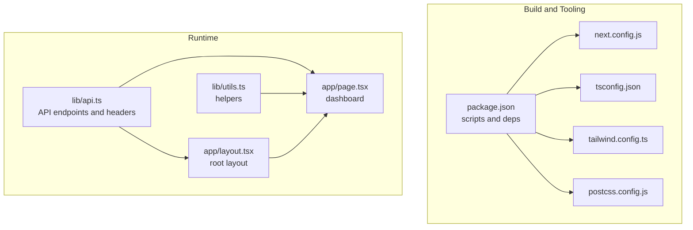
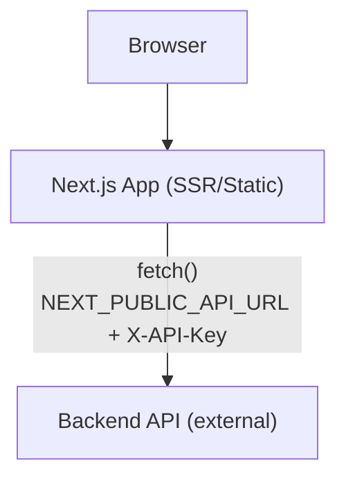
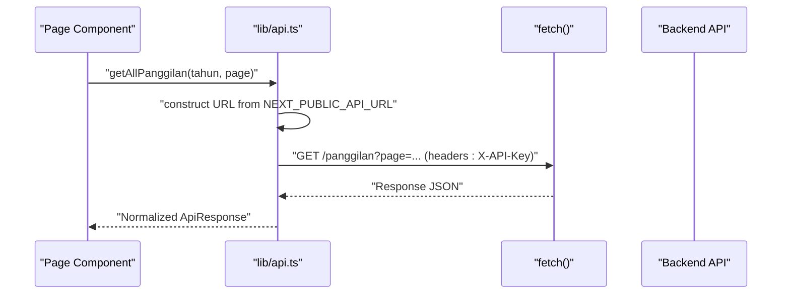
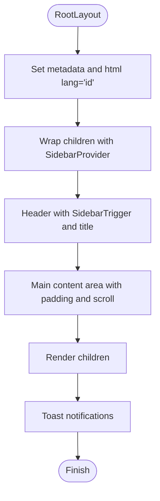
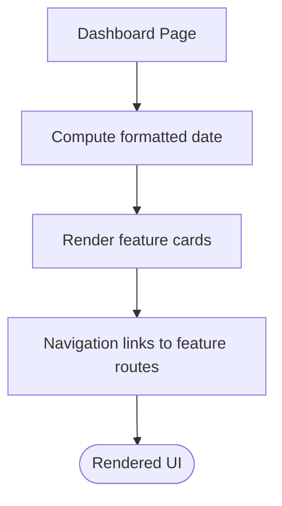
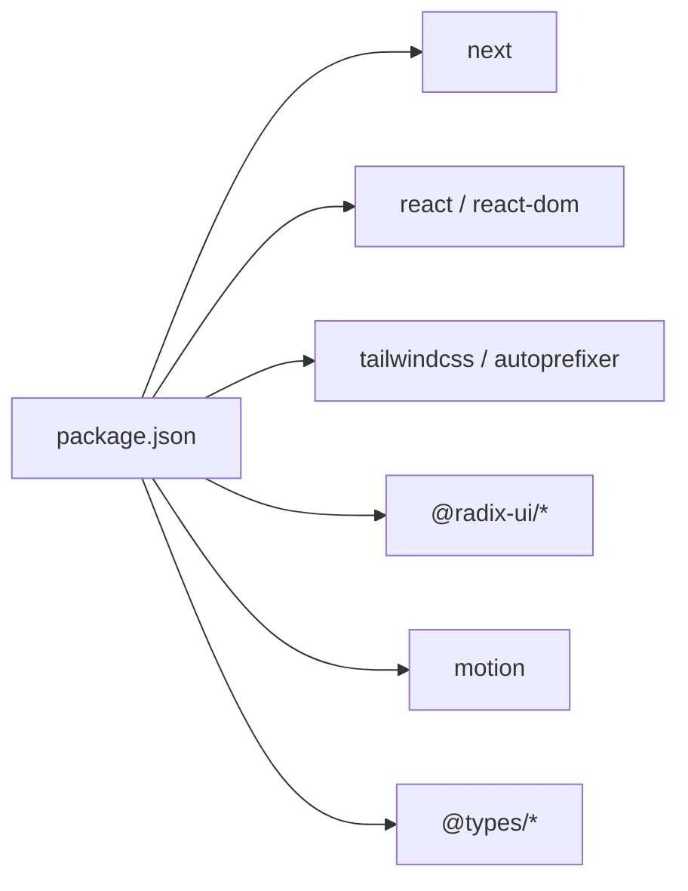

# Deployment and Production

<cite>
**Referenced Files in This Document**
- [package.json](file://package.json)
- [next.config.js](file://next.config.js)
- [tsconfig.json](file://tsconfig.json)
- [tailwind.config.ts](file://tailwind.config.ts)
- [postcss.config.js](file://postcss.config.js)
- [lib/api.ts](file://lib/api.ts)
- [lib/utils.ts](file://lib/utils.ts)
- [app/layout.tsx](file://app/layout.tsx)
- [app/page.tsx](file://app/page.tsx)
</cite>

## Table of Contents
1. [Introduction](#introduction)
2. [Project Structure](#project-structure)
3. [Core Components](#core-components)
4. [Architecture Overview](#architecture-overview)
5. [Detailed Component Analysis](#detailed-component-analysis)
6. [Dependency Analysis](#dependency-analysis)
7. [Performance Considerations](#performance-considerations)
8. [Troubleshooting Guide](#troubleshooting-guide)
9. [Conclusion](#conclusion)
10. [Appendices](#appendices)

## Introduction
This document provides comprehensive guidance for deploying and operating the admin panel in production. It covers build configuration, environment variable management, production optimization, platform-specific deployment strategies, performance tuning, monitoring, security (including SSL/TLS), CI/CD and automated deployment, scaling and load balancing, maintenance and disaster recovery, and operational checklists for deployment, rollback, and post-deployment validation.

## Project Structure
The project is a Next.js application using TypeScript, Tailwind CSS, and Radix UI primitives. The frontend communicates with a backend API via environment-controlled endpoints and API keys. Build-time scripts and configuration define runtime behavior and optimization defaults.

**Diagram sources**
- [package.json:1-44](file://package.json#L1-L44)
- [next.config.js:1-7](file://next.config.js#L1-L7)
- [tsconfig.json:1-43](file://tsconfig.json#L1-L43)
- [tailwind.config.ts:1-106](file://tailwind.config.ts#L1-L106)
- [postcss.config.js:1-7](file://postcss.config.js#L1-L7)
- [lib/api.ts:1-800](file://lib/api.ts#L1-L800)
- [lib/utils.ts:1-26](file://lib/utils.ts#L1-L26)
- [app/layout.tsx:1-37](file://app/layout.tsx#L1-L37)
- [app/page.tsx:1-237](file://app/page.tsx#L1-L237)

**Section sources**
- [package.json:1-44](file://package.json#L1-L44)
- [next.config.js:1-7](file://next.config.js#L1-L7)
- [tsconfig.json:1-43](file://tsconfig.json#L1-L43)
- [tailwind.config.ts:1-106](file://tailwind.config.ts#L1-L106)
- [postcss.config.js:1-7](file://postcss.config.js#L1-L7)

## Core Components
- Build and runtime scripts: development, build, start, and lint commands are defined for local and CI environments.
- Next.js configuration: strict mode enabled for React to surface potential issues early.
- TypeScript configuration: strict type checking, ESNext module resolution, bundler module resolution, and incremental builds.
- Styling pipeline: Tailwind CSS configured with content globs and animations plugin; PostCSS with Tailwind and Autoprefixer.
- API client: centralized endpoint and header configuration using environment variables for backend base URL and API key.
- Utilities: shared helpers for class merging, year options, and currency formatting.
- Application shell: root layout with sidebar provider, global styles, and toast notifications.

Key production-relevant aspects:
- Environment-driven API base URL and API key.
- Strict React mode for robustness.
- Tailwind content scanning for purging unused CSS in production builds.
- Incremental TypeScript compilation for faster rebuilds.

**Section sources**
- [package.json:5-10](file://package.json#L5-L10)
- [next.config.js:2-4](file://next.config.js#L2-L4)
- [tsconfig.json:12-25](file://tsconfig.json#L12-L25)
- [tailwind.config.ts:5-10](file://tailwind.config.ts#L5-L10)
- [postcss.config.js:1-7](file://postcss.config.js#L1-L7)
- [lib/api.ts:1-4](file://lib/api.ts#L1-L4)
- [lib/utils.ts:1-26](file://lib/utils.ts#L1-L26)
- [app/layout.tsx:12-36](file://app/layout.tsx#L12-L36)

## Architecture Overview
The admin panel is a client-side Next.js application that:
- Builds static assets and server-rendered pages.
- Communicates with a remote backend API using environment-controlled URLs and an API key header.
- Uses Tailwind CSS for styling and Radix UI components for accessible UI primitives.

**Diagram sources**
- [lib/api.ts:1-4](file://lib/api.ts#L1-L4)
- [lib/api.ts:82-91](file://lib/api.ts#L82-L91)

## Detailed Component Analysis

### API Client and Environment Variables
The API client centralizes endpoint construction and request headers. It reads the backend base URL and API key from environment variables, defaulting to localhost during development. Requests bypass caching for dynamic data.

**Diagram sources**
- [lib/api.ts:97-105](file://lib/api.ts#L97-L105)
- [lib/api.ts:82-91](file://lib/api.ts#L82-L91)

Operational notes for production:
- Set NEXT_PUBLIC_API_URL to the production backend domain.
- Provide NEXT_PUBLIC_API_KEY for backend authentication.
- Ensure HTTPS endpoints for production to avoid mixed content warnings and security issues.

**Section sources**
- [lib/api.ts:1-4](file://lib/api.ts#L1-L4)
- [lib/api.ts:97-105](file://lib/api.ts#L97-L105)
- [lib/api.ts:82-91](file://lib/api.ts#L82-L91)

### Layout and Global Styles
The root layout sets metadata, language, and global UI providers. It includes a sidebar, main content area, and toast notifications.

**Diagram sources**
- [app/layout.tsx:7-36](file://app/layout.tsx#L7-L36)

**Section sources**
- [app/layout.tsx:12-36](file://app/layout.tsx#L12-L36)

### Dashboard and Navigation
The dashboard page composes cards for navigation to various administrative areas and displays contextual information. It uses shared UI components and icons.

**Diagram sources**
- [app/page.tsx:10-237](file://app/page.tsx#L10-L237)

**Section sources**
- [app/page.tsx:10-237](file://app/page.tsx#L10-L237)

## Dependency Analysis
- Build and toolchain dependencies are declared in package.json, including Next.js, React, Tailwind CSS, and TypeScript.
- Runtime dependencies include Radix UI components and motion libraries.
- Development dependencies include PostCSS, Tailwind CSS, and TypeScript tooling.

**Diagram sources**
- [package.json:11-42](file://package.json#L11-L42)

**Section sources**
- [package.json:11-42](file://package.json#L11-L42)

## Performance Considerations
- Build-time optimizations:
  - Enable production builds with caching and minification via Next.js build scripts.
  - Leverage incremental TypeScript compilation for faster rebuilds.
- Runtime optimizations:
  - Strict mode helps detect problematic patterns early.
  - Tailwind’s content globs ensure unused CSS is removed in production.
  - Avoid unnecessary re-renders by memoizing props and using shallow comparisons where appropriate.
- Network:
  - Disable caching for dynamic endpoints to prevent stale data.
  - Ensure backend endpoints are optimized and served over HTTPS to reduce mixed content issues.

[No sources needed since this section provides general guidance]

## Troubleshooting Guide
Common production issues and resolutions:
- API connectivity:
  - Verify NEXT_PUBLIC_API_URL points to a reachable backend endpoint.
  - Confirm NEXT_PUBLIC_API_KEY is set and accepted by the backend.
- Mixed content warnings:
  - Serve the frontend over HTTPS and ensure backend endpoints are HTTPS.
- Styling regressions:
  - Confirm Tailwind content globs include all component paths.
  - Rebuild after adding new Tailwind classes.
- Build failures:
  - Run lint checks and fix TypeScript errors.
  - Clear incremental build artifacts if necessary.

**Section sources**
- [lib/api.ts:1-4](file://lib/api.ts#L1-L4)
- [tailwind.config.ts:5-10](file://tailwind.config.ts#L5-L10)
- [package.json:5-10](file://package.json#L5-L10)

## Conclusion
This guide outlines a practical path to deploy and operate the admin panel in production. By controlling environment variables, leveraging Next.js and Tailwind optimizations, securing network communications, and establishing CI/CD and monitoring practices, teams can achieve reliable, scalable, and maintainable deployments.

[No sources needed since this section summarizes without analyzing specific files]

## Appendices

### A. Build Configuration and Scripts
- Development: starts the Next.js dev server.
- Build: compiles the application for production.
- Start: runs the production server.
- Lint: validates TypeScript and ESLint rules.

**Section sources**
- [package.json:5-10](file://package.json#L5-L10)

### B. Environment Variables Management
- NEXT_PUBLIC_API_URL: Base URL for the backend API.
- NEXT_PUBLIC_API_KEY: API key header value for backend authentication.

Ensure these are configured per environment (development, staging, production) and never committed to source control.

**Section sources**
- [lib/api.ts:1-4](file://lib/api.ts#L1-L4)

### C. Production Optimization Settings
- React strict mode enabled for robustness.
- Tailwind content globs for purging unused CSS.
- Incremental TypeScript compilation for faster rebuilds.

**Section sources**
- [next.config.js:2-4](file://next.config.js#L2-L4)
- [tailwind.config.ts:5-10](file://tailwind.config.ts#L5-L10)
- [tsconfig.json:12-25](file://tsconfig.json#L12-L25)

### D. Platform Deployment Strategies
- Static hosting (Vercel, Netlify): Suitable for purely client-rendered apps; ensure environment variables are configured in host dashboards.
- SSR hosting (Railway, Render, AWS ECS/Fargate): Use Next.js start command with environment variables for backend connectivity.
- Reverse proxy: Place a CDN/load balancer in front of the application for TLS termination, caching, and rate limiting.

[No sources needed since this section provides general guidance]

### E. Security Considerations and SSL/TLS
- TLS: Terminate TLS at the CDN/load balancer or reverse proxy; ensure HTTPS is enforced.
- Secrets: Store NEXT_PUBLIC_API_KEY and backend secrets outside the client bundle; restrict exposure to public environment variables.
- CORS: Configure backend CORS policies to allow only trusted origins.
- HSTS: Enable HTTP Strict Transport Security headers at the CDN or reverse proxy level.

[No sources needed since this section provides general guidance]

### F. CI/CD Pipeline Setup and Automated Deployment
- Build stage: run build script and lint checks.
- Test stage: optional unit/integration tests.
- Deploy stage: push artifacts to hosting provider or container registry; apply environment variables.
- Rollback: keep previous release tagged and prepared for quick rollback.

[No sources needed since this section provides general guidance]

### G. Scaling and Load Balancing
- Horizontal scaling: run multiple instances behind a load balancer.
- Health checks: configure health endpoints for load balancers and autoscaling groups.
- Caching: leverage CDN caching for static assets; avoid caching dynamic API responses.

[No sources needed since this section provides general guidance]

### H. Monitoring Approaches
- Frontend monitoring: track Core Web Vitals, error rates, and user journeys.
- Backend monitoring: monitor API latency, throughput, and error rates.
- Observability: integrate logs, metrics, and distributed tracing.

[No sources needed since this section provides general guidance]

### I. Production Maintenance, Backups, and Disaster Recovery
- Maintenance windows: schedule updates during low-traffic periods.
- Backups: snapshot application code and configuration; back up environment variables separately.
- DR: replicate infrastructure across regions; automate failover testing.

[No sources needed since this section provides general guidance]

### J. Deployment Checklist
- Build and test locally.
- Set environment variables for target environment.
- Review API connectivity and authentication.
- Validate HTTPS and TLS configuration.
- Perform smoke tests across devices and browsers.
- Deploy and confirm health checks pass.
- Monitor metrics and logs.

[No sources needed since this section provides general guidance]

### K. Rollback Procedures
- Keep previous release artifacts and environment configurations.
- Re-deploy previous version if issues arise.
- Revert configuration changes incrementally.
- Notify stakeholders and document rollback actions.

[No sources needed since this section provides general guidance]

### L. Post-Deployment Validation Steps
- Smoke tests: navigate key pages and submit representative forms.
- API tests: verify data retrieval and mutations.
- Performance tests: measure load times and interactivity.
- Security scan: ensure TLS and CSP are properly configured.

[No sources needed since this section provides general guidance]