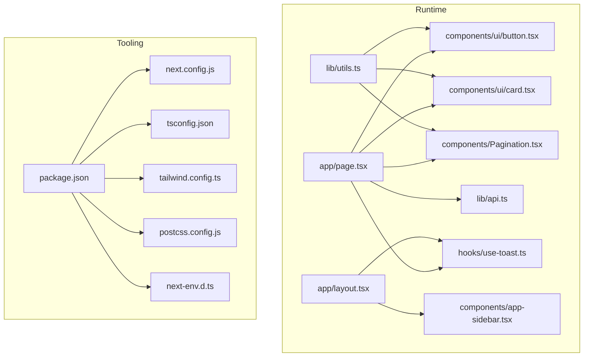
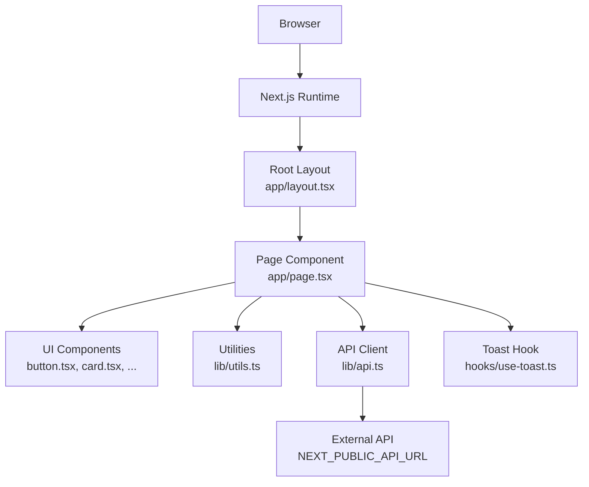
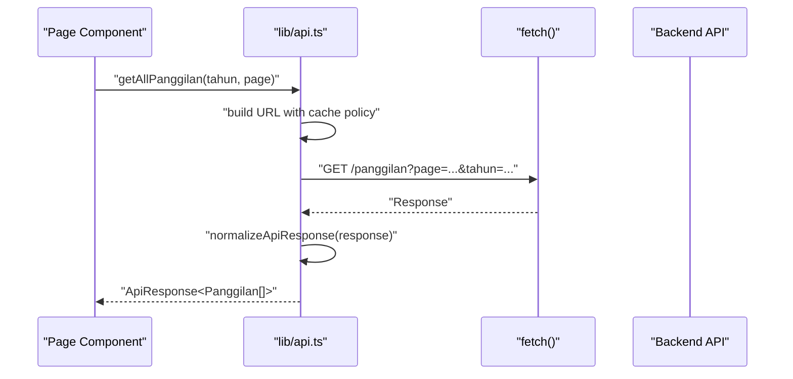
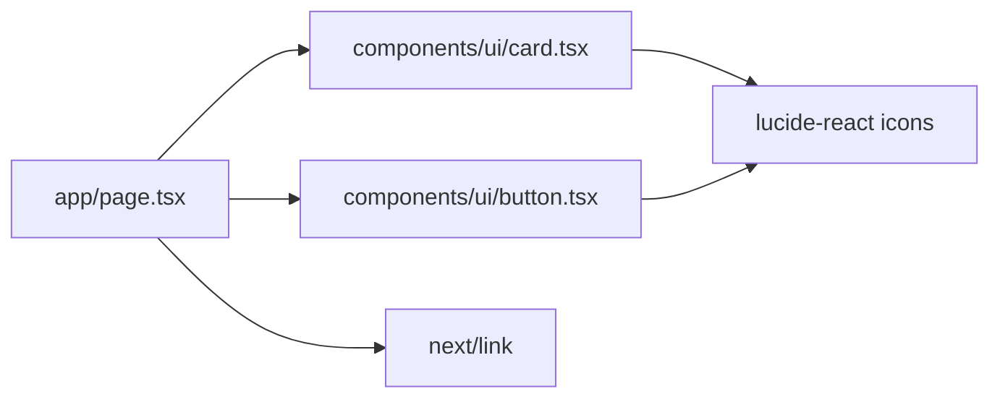
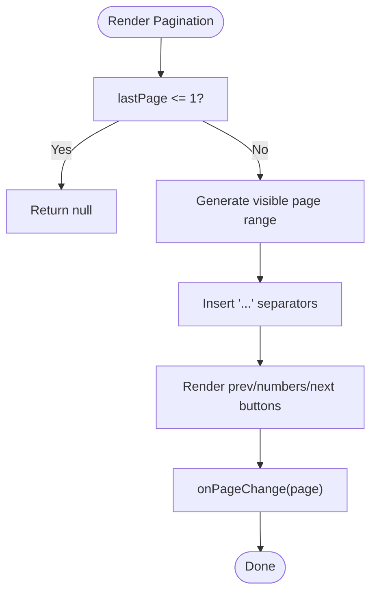
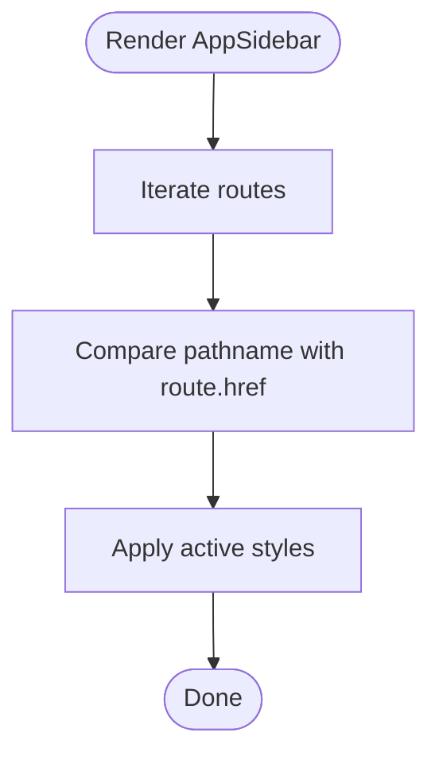
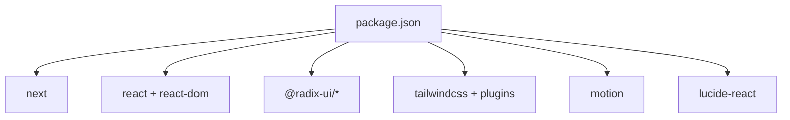
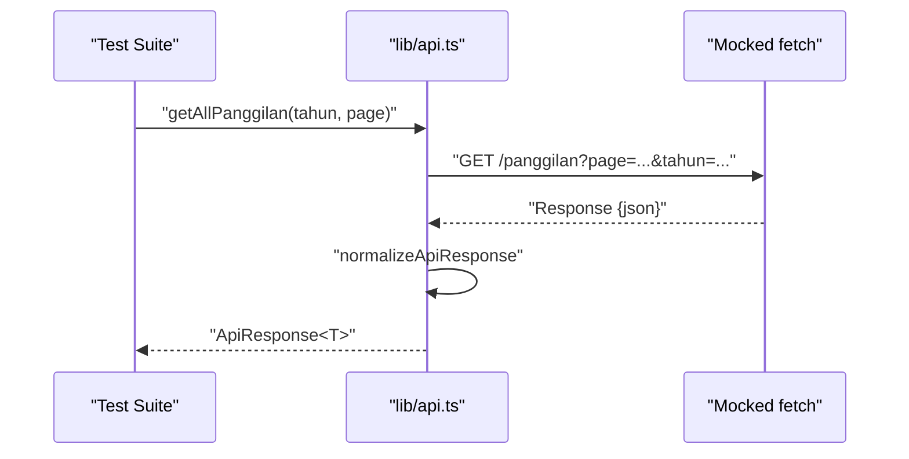

# Development and Testing

<cite>
**Referenced Files in This Document**
- [package.json](file://package.json)
- [next.config.js](file://next.config.js)
- [tsconfig.json](file://tsconfig.json)
- [tailwind.config.ts](file://tailwind.config.ts)
- [postcss.config.js](file://postcss.config.js)
- [next-env.d.ts](file://next-env.d.ts)
- [app/layout.tsx](file://app/layout.tsx)
- [app/page.tsx](file://app/page.tsx)
- [lib/api.ts](file://lib/api.ts)
- [lib/utils.ts](file://lib/utils.ts)
- [hooks/use-toast.ts](file://hooks/use-toast.ts)
- [components/ui/button.tsx](file://components/ui/button.tsx)
- [components/ui/card.tsx](file://components/ui/card.tsx)
- [components/Pagination.tsx](file://components/Pagination.tsx)
- [components/app-sidebar.tsx](file://components/app-sidebar.tsx)
</cite>

## Table of Contents
1. [Introduction](#introduction)
2. [Project Structure](#project-structure)
3. [Core Components](#core-components)
4. [Architecture Overview](#architecture-overview)
5. [Detailed Component Analysis](#detailed-component-analysis)
6. [Dependency Analysis](#dependency-analysis)
7. [Performance Considerations](#performance-considerations)
8. [Testing Strategies](#testing-strategies)
9. [Debugging and Troubleshooting](#debugging-and-troubleshooting)
10. [Code Review and Quality Practices](#code-review-and-quality-practices)
11. [Deployment Preparation](#deployment-preparation)
12. [Conclusion](#conclusion)

## Introduction
This document describes the development workflow, build configuration, quality assurance processes, and testing strategies for the admin panel. It covers the TypeScript configuration, ESLint integration via Next.js, Tailwind CSS setup, PostCSS pipeline, and the runtime architecture. It also outlines testing strategies for React components, API integration, and UI validation, along with performance monitoring, debugging approaches, and production readiness.

## Project Structure
The project follows a Next.js App Router structure with a clear separation of pages, components, hooks, and shared libraries. The build and toolchain are configured through Next.js, TypeScript, Tailwind CSS, and PostCSS.

**Diagram sources**
- [app/layout.tsx](file://app/layout.tsx)
- [app/page.tsx](file://app/page.tsx)
- [components/app-sidebar.tsx](file://components/app-sidebar.tsx)
- [components/ui/button.tsx](file://components/ui/button.tsx)
- [components/ui/card.tsx](file://components/ui/card.tsx)
- [components/Pagination.tsx](file://components/Pagination.tsx)
- [lib/utils.ts](file://lib/utils.ts)
- [lib/api.ts](file://lib/api.ts)
- [hooks/use-toast.ts](file://hooks/use-toast.ts)
- [package.json](file://package.json)
- [next.config.js](file://next.config.js)
- [tsconfig.json](file://tsconfig.json)
- [tailwind.config.ts](file://tailwind.config.ts)
- [postcss.config.js](file://postcss.config.js)
- [next-env.d.ts](file://next-env.d.ts)

**Section sources**
- [package.json](file://package.json)
- [next.config.js](file://next.config.js)
- [tsconfig.json](file://tsconfig.json)
- [tailwind.config.ts](file://tailwind.config.ts)
- [postcss.config.js](file://postcss.config.js)
- [next-env.d.ts](file://next-env.d.ts)

## Core Components
- Application shell and global layout: [app/layout.tsx](file://app/layout.tsx)
- Landing/dashboard page: [app/page.tsx](file://app/page.tsx)
- Shared utilities: [lib/utils.ts](file://lib/utils.ts)
- API client and typed models: [lib/api.ts](file://lib/api.ts)
- Toast notifications: [hooks/use-toast.ts](file://hooks/use-toast.ts)
- UI primitives: [components/ui/button.tsx](file://components/ui/button.tsx), [components/ui/card.tsx](file://components/ui/card.tsx)
- Pagination component: [components/Pagination.tsx](file://components/Pagination.tsx)
- Navigation sidebar: [components/app-sidebar.tsx](file://components/app-sidebar.tsx)

Key responsibilities:
- Layout composes the sidebar, main content area, and toast provider.
- Dashboard renders cards and links to feature areas.
- Utilities provide class merging and formatting helpers.
- API module centralizes HTTP calls and response normalization.
- UI components expose consistent variants and sizes.
- Pagination supports navigation across paginated API results.
- Sidebar provides navigation and user menu.

**Section sources**
- [app/layout.tsx](file://app/layout.tsx)
- [app/page.tsx](file://app/page.tsx)
- [lib/utils.ts](file://lib/utils.ts)
- [lib/api.ts](file://lib/api.ts)
- [hooks/use-toast.ts](file://hooks/use-toast.ts)
- [components/ui/button.tsx](file://components/ui/button.tsx)
- [components/ui/card.tsx](file://components/ui/card.tsx)
- [components/Pagination.tsx](file://components/Pagination.tsx)
- [components/app-sidebar.tsx](file://components/app-sidebar.tsx)

## Architecture Overview
The runtime architecture centers on Next.js App Router with server/client boundaries, shared UI components, and a centralized API client. Environment variables configure backend endpoints and keys. Tailwind CSS and PostCSS handle styling.

**Diagram sources**
- [app/layout.tsx](file://app/layout.tsx)
- [app/page.tsx](file://app/page.tsx)
- [lib/api.ts](file://lib/api.ts)
- [lib/utils.ts](file://lib/utils.ts)
- [hooks/use-toast.ts](file://hooks/use-toast.ts)
- [components/ui/button.tsx](file://components/ui/button.tsx)
- [components/ui/card.tsx](file://components/ui/card.tsx)
- [components/Pagination.tsx](file://components/Pagination.tsx)
- [components/app-sidebar.tsx](file://components/app-sidebar.tsx)

## Detailed Component Analysis

### API Layer
The API client encapsulates HTTP requests, environment-driven base URLs, and response normalization. It supports JSON and form-encoded payloads, and handles special status shapes from the backend.

**Diagram sources**
- [lib/api.ts](file://lib/api.ts)

**Section sources**
- [lib/api.ts](file://lib/api.ts)

### UI Component Composition
The dashboard composes reusable UI primitives and navigation links to feature pages.

**Diagram sources**
- [app/page.tsx](file://app/page.tsx)
- [components/ui/card.tsx](file://components/ui/card.tsx)
- [components/ui/button.tsx](file://components/ui/button.tsx)

**Section sources**
- [app/page.tsx](file://app/page.tsx)
- [components/ui/card.tsx](file://components/ui/card.tsx)
- [components/ui/button.tsx](file://components/ui/button.tsx)

### Pagination Component
The pagination component generates visible page indices and controls, emitting page change events.

**Diagram sources**
- [components/Pagination.tsx](file://components/Pagination.tsx)

**Section sources**
- [components/Pagination.tsx](file://components/Pagination.tsx)

### Sidebar Navigation
The sidebar defines routes and highlights the active item based on pathname.

**Diagram sources**
- [components/app-sidebar.tsx](file://components/app-sidebar.tsx)

**Section sources**
- [components/app-sidebar.tsx](file://components/app-sidebar.tsx)

## Dependency Analysis
The project relies on Next.js, Radix UI, Tailwind CSS, and motion for animations. TypeScript and ESLint are configured via Next.js defaults.

**Diagram sources**
- [package.json](file://package.json)

**Section sources**
- [package.json](file://package.json)

## Performance Considerations
- Strict mode: Enabled in Next.js configuration to surface potential issues early.
- Incremental builds: TypeScript configuration enables incremental compilation.
- No emit for type checking: Ensures type-only checks during dev/build.
- Tailwind content scanning: Scoped to app, components, and src directories to minimize CSS bundle size.
- Cache policy: API client uses no-store for dynamic data fetching.
- Motion and animations: Keep animations minimal and avoid heavy transforms on large lists.

[No sources needed since this section provides general guidance]

## Testing Strategies

### React Component Testing
- Unit tests for pure functions and small UI helpers:
  - Utilities: [lib/utils.ts](file://lib/utils.ts)
  - Pagination: [components/Pagination.tsx](file://components/Pagination.tsx)
- Snapshot or DOM tests for UI primitives:
  - Button: [components/ui/button.tsx](file://components/ui/button.tsx)
  - Card: [components/ui/card.tsx](file://components/ui/card.tsx)
- Test rendering and interaction patterns (e.g., click handlers, active states) using a testing library compatible with React 18+ and Next.js.

Recommended coverage:
- Utility functions: formatting, class merging, year options.
- Pagination: page range generation, ellipsis insertion, disabled states.
- UI components: variant and size combinations, slot composition.

**Section sources**
- [lib/utils.ts](file://lib/utils.ts)
- [components/Pagination.tsx](file://components/Pagination.tsx)
- [components/ui/button.tsx](file://components/ui/button.tsx)
- [components/ui/card.tsx](file://components/ui/card.tsx)

### API Integration Testing
- Mock external API responses and environment variables.
- Verify:
  - Base URL resolution via environment variables.
  - Header injection (API key, content-type).
  - Method override behavior for FormData (POST with _method=PUT).
  - Response normalization across different backend shapes.
- Test error handling paths (non-JSON bodies, validation errors).

**Diagram sources**
- [lib/api.ts](file://lib/api.ts)

**Section sources**
- [lib/api.ts](file://lib/api.ts)

### UI Validation and Accessibility
- Visual regression testing for key pages (dashboard, forms, lists).
- Accessibility checks using automated tools against rendered components.
- Interaction tests for navigation, modals, and forms.

[No sources needed since this section provides general guidance]

## Debugging and Troubleshooting
Common issues and remedies:
- Environment variables not applied:
  - Ensure NEXT_PUBLIC_* variables are prefixed correctly and present at build/runtime.
- API calls failing:
  - Verify backend URL and API key; confirm response shapes match normalization expectations.
- Tailwind utilities not applied:
  - Confirm content paths in Tailwind config include the relevant directories.
- Type errors in generated routes:
  - Regenerate Next types if route changes occur.

**Section sources**
- [lib/api.ts](file://lib/api.ts)
- [tailwind.config.ts](file://tailwind.config.ts)
- [next-env.d.ts](file://next-env.d.ts)

## Code Review and Quality Practices
- TypeScript strictness: Maintain strict mode and avoid unsafe any usage.
- ESLint via Next.js: Run linting regularly and fix issues before merging.
- Commit hygiene: Keep commits focused; write clear messages.
- Pull requests: Require at least one review; ensure tests pass and no console logs remain.
- Formatting: Rely on editor integrations aligned with project tooling; avoid manual formatting exceptions.

**Section sources**
- [package.json](file://package.json)
- [tsconfig.json](file://tsconfig.json)

## Deployment Preparation
- Build verification:
  - Run the build script to ensure no type errors and successful bundling.
- Environment configuration:
  - Set NEXT_PUBLIC_API_URL and NEXT_PUBLIC_API_KEY for the target environment.
- Static export (if applicable):
  - Confirm static generation compatibility with client-side navigation and dynamic data.
- Health checks:
  - Validate API connectivity and basic UI rendering on staging.

**Section sources**
- [package.json](file://package.json)
- [lib/api.ts](file://lib/api.ts)

## Conclusion
This guide consolidates the development workflow, build configuration, and testing strategies for the admin panel. By leveraging Next.js, TypeScript, Tailwind CSS, and a centralized API client, the project maintains a consistent developer experience. Adhering to the outlined testing and quality practices ensures reliable delivery and maintainability.