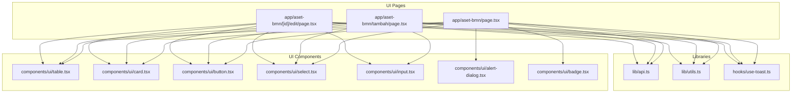
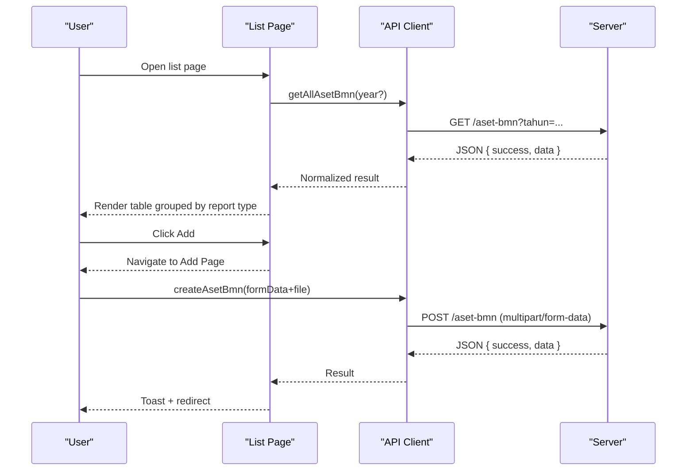
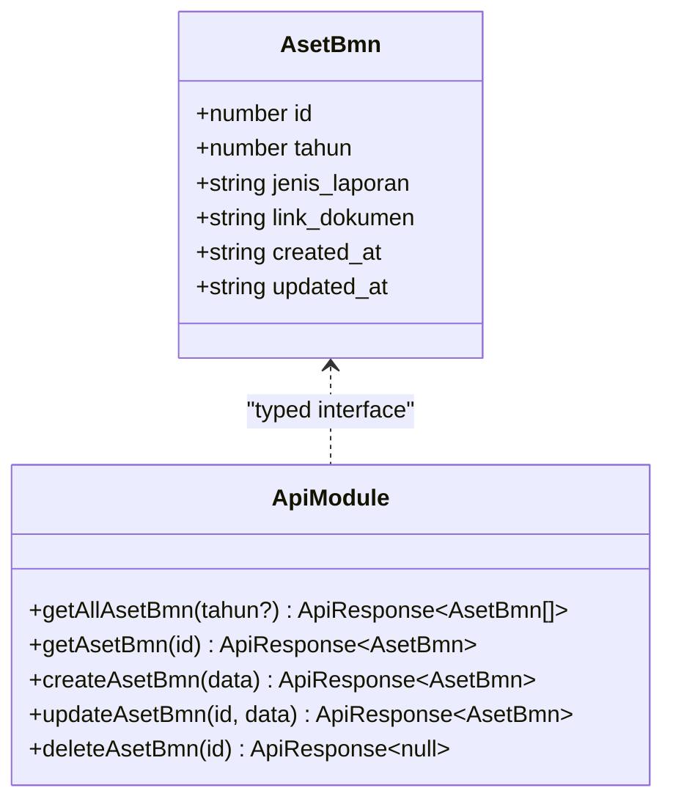
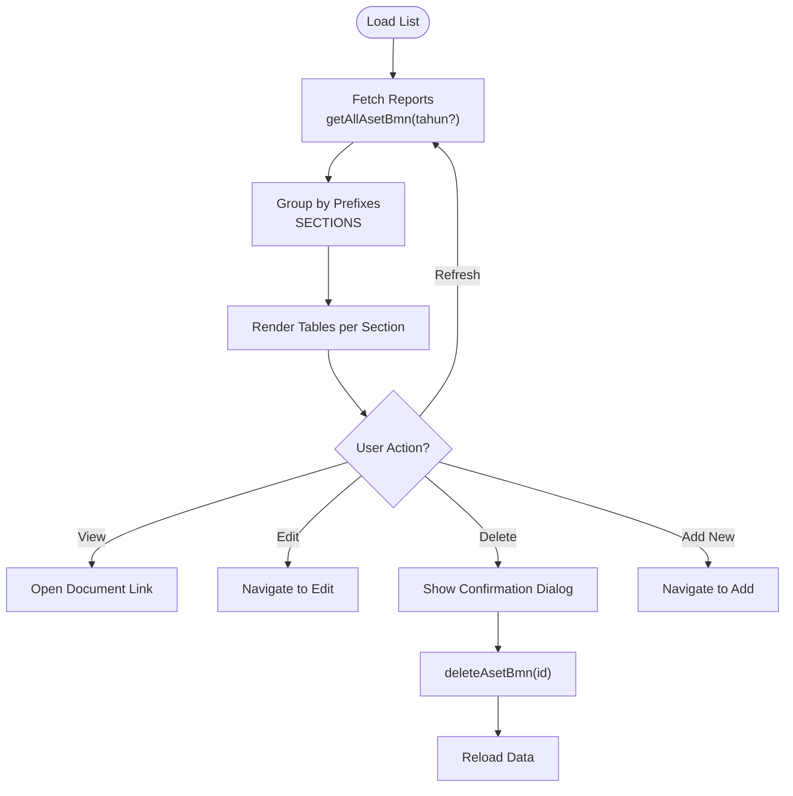
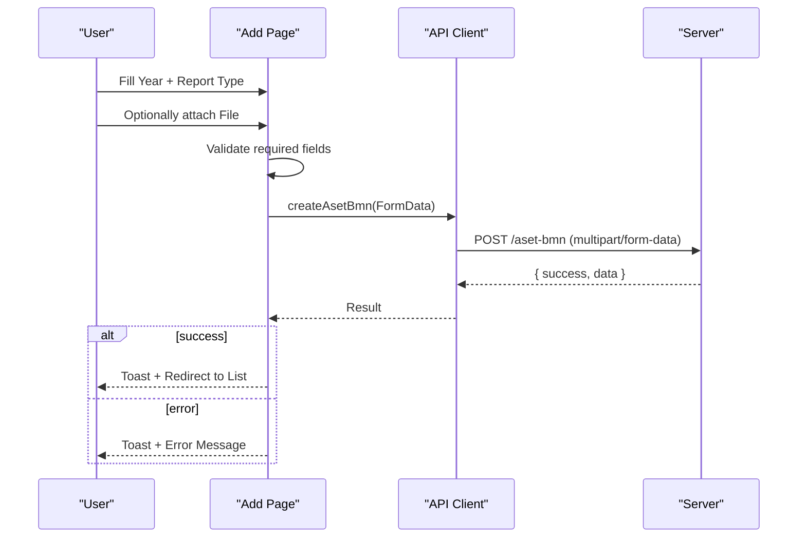
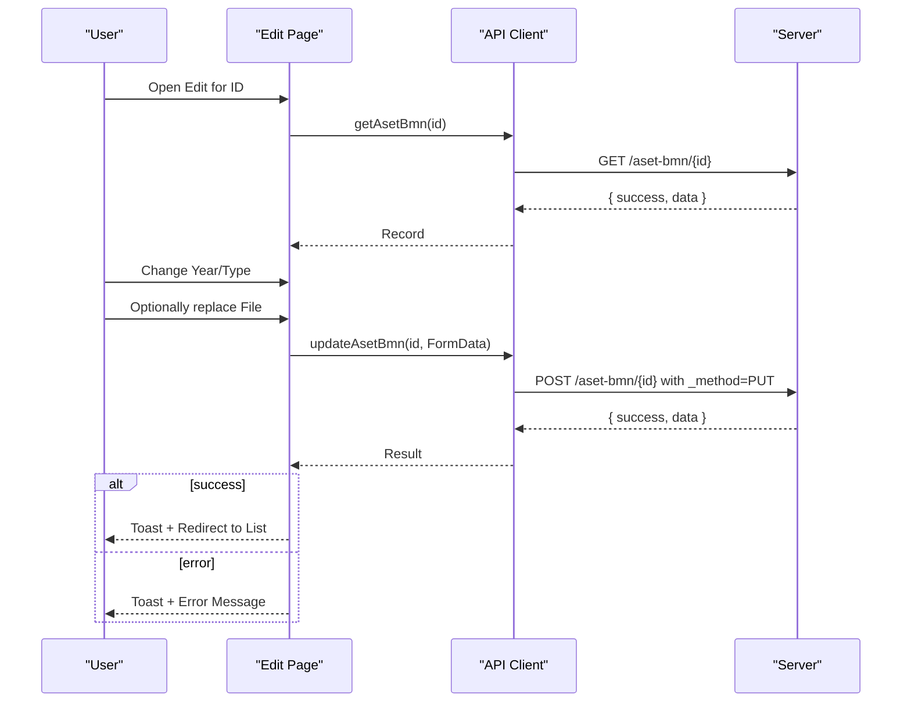
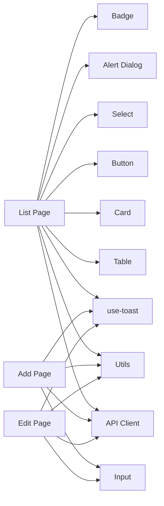

# Aset & BMN (Government Assets)

<cite>
**Referenced Files in This Document**
- [app/aset-bmn/page.tsx](file://app/aset-bmn/page.tsx)
- [app/aset-bmn/tambah/page.tsx](file://app/aset-bmn/tambah/page.tsx)
- [app/aset-bmn/[id]/edit/page.tsx](file://app/aset-bmn/[id]/edit/page.tsx)
- [lib/api.ts](file://lib/api.ts)
- [lib/utils.ts](file://lib/utils.ts)
- [components/ui/table.tsx](file://components/ui/table.tsx)
- [components/ui/card.tsx](file://components/ui/card.tsx)
- [components/ui/button.tsx](file://components/ui/button.tsx)
- [components/ui/select.tsx](file://components/ui/select.tsx)
- [components/ui/input.tsx](file://components/ui/input.tsx)
- [components/ui/alert-dialog.tsx](file://components/ui/alert-dialog.tsx)
- [components/ui/badge.tsx](file://components/ui/badge.tsx)
- [hooks/use-toast.ts](file://hooks/use-toast.ts)
</cite>

## Table of Contents
1. [Introduction](#introduction)
2. [Project Structure](#project-structure)
3. [Core Components](#core-components)
4. [Architecture Overview](#architecture-overview)
5. [Detailed Component Analysis](#detailed-component-analysis)
6. [Dependency Analysis](#dependency-analysis)
7. [Performance Considerations](#performance-considerations)
8. [Troubleshooting Guide](#troubleshooting-guide)
9. [Conclusion](#conclusion)
10. [Appendices](#appendices)

## Introduction
This document describes the Aset & BMN module for government asset tracking and management within the administration panel. It covers the end-to-end lifecycle of asset-related documentation: acquisition (through report submissions), inventory tracking (by year and report type), maintenance (document updates), and disposal (document deletion). The module supports multiple standardized report categories aligned with government accounting standards and enables audit-ready workflows via explicit CRUD operations and user feedback.

The system focuses on managing official documents related to state assets (BMN) rather than physical asset tracking. Users can register reports, categorize them by predefined types, filter by year, upload supporting documents, and maintain an audit trail through API logs and UI notifications.

## Project Structure
The Aset & BMN module is organized under the Next.js app router with three primary pages:
- List view with filtering and batch actions
- Add new report entry with file upload
- Edit existing report entry with optional file replacement

Supporting infrastructure includes:
- API client for CRUD operations and response normalization
- UI primitives for forms, tables, alerts, and badges
- Utility helpers for year options and formatting

**Diagram sources**
- [app/aset-bmn/page.tsx:32-221](file://app/aset-bmn/page.tsx#L32-L221)
- [app/aset-bmn/tambah/page.tsx:19-150](file://app/aset-bmn/tambah/page.tsx#L19-L150)
- [app/aset-bmn/[id]/edit/page.tsx](file://app/aset-bmn/[id]/edit/page.tsx#L19-L181)
- [lib/api.ts:581-652](file://lib/api.ts#L581-L652)
- [lib/utils.ts:8-16](file://lib/utils.ts#L8-L16)
- [hooks/use-toast.ts:174-195](file://hooks/use-toast.ts#L174-L195)
- [components/ui/table.tsx:1-121](file://components/ui/table.tsx#L1-L121)
- [components/ui/card.tsx:1-77](file://components/ui/card.tsx#L1-L77)
- [components/ui/button.tsx:1-58](file://components/ui/button.tsx#L1-L58)
- [components/ui/select.tsx:1-160](file://components/ui/select.tsx#L1-L160)
- [components/ui/input.tsx:1-23](file://components/ui/input.tsx#L1-L23)
- [components/ui/alert-dialog.tsx:1-142](file://components/ui/alert-dialog.tsx#L1-L142)
- [components/ui/badge.tsx:1-37](file://components/ui/badge.tsx#L1-L37)

**Section sources**
- [app/aset-bmn/page.tsx:32-221](file://app/aset-bmn/page.tsx#L32-L221)
- [app/aset-bmn/tambah/page.tsx:19-150](file://app/aset-bmn/tambah/page.tsx#L19-L150)
- [app/aset-bmn/[id]/edit/page.tsx](file://app/aset-bmn/[id]/edit/page.tsx#L19-L181)
- [lib/api.ts:581-652](file://lib/api.ts#L581-L652)
- [lib/utils.ts:8-16](file://lib/utils.ts#L8-L16)
- [hooks/use-toast.ts:174-195](file://hooks/use-toast.ts#L174-L195)
- [components/ui/table.tsx:1-121](file://components/ui/table.tsx#L1-L121)
- [components/ui/card.tsx:1-77](file://components/ui/card.tsx#L1-L77)
- [components/ui/button.tsx:1-58](file://components/ui/button.tsx#L1-L58)
- [components/ui/select.tsx:1-160](file://components/ui/select.tsx#L1-L160)
- [components/ui/input.tsx:1-23](file://components/ui/input.tsx#L1-L23)
- [components/ui/alert-dialog.tsx:1-142](file://components/ui/alert-dialog.tsx#L1-L142)
- [components/ui/badge.tsx:1-37](file://components/ui/badge.tsx#L1-L37)

## Core Components
- AsetBmn model and constants define the report record structure and supported report types.
- API functions encapsulate CRUD operations with standardized response handling and file upload support.
- UI pages orchestrate data loading, filtering, form submission, and user feedback.
- Reusable UI components provide consistent form controls, tables, alerts, and badges.

Key capabilities:
- Retrieve all reports with optional year filter
- Create new report entries with optional document upload
- Update existing entries with optional document replacement
- Delete reports with confirmation
- Filter by year and group by report category prefixes
- Provide user feedback via toast notifications

**Section sources**
- [lib/api.ts:584-602](file://lib/api.ts#L584-L602)
- [lib/api.ts:604-652](file://lib/api.ts#L604-L652)
- [app/aset-bmn/page.tsx:32-115](file://app/aset-bmn/page.tsx#L32-L115)
- [app/aset-bmn/tambah/page.tsx:19-57](file://app/aset-bmn/tambah/page.tsx#L19-L57)
- [app/aset-bmn/[id]/edit/page.tsx](file://app/aset-bmn/[id]/edit/page.tsx#L19-L76)
- [hooks/use-toast.ts:174-195](file://hooks/use-toast.ts#L174-L195)

## Architecture Overview
The module follows a clean separation of concerns:
- Presentation layer: Next.js app router pages render UI and manage local state
- Domain layer: API client exposes typed functions for CRUD operations
- Infrastructure layer: Utilities provide shared helpers; UI components encapsulate presentation logic

**Diagram sources**
- [app/aset-bmn/page.tsx:39-55](file://app/aset-bmn/page.tsx#L39-L55)
- [lib/api.ts:604-630](file://lib/api.ts#L604-L630)
- [app/aset-bmn/tambah/page.tsx:30-57](file://app/aset-bmn/tambah/page.tsx#L30-L57)

**Section sources**
- [app/aset-bmn/page.tsx:32-221](file://app/aset-bmn/page.tsx#L32-L221)
- [lib/api.ts:581-652](file://lib/api.ts#L581-L652)

## Detailed Component Analysis

### Data Model and Types
The AsetBmn entity captures official report metadata and document linkage. Report types are constrained to predefined categories aligned with government financial reporting standards.

**Diagram sources**
- [lib/api.ts:595-602](file://lib/api.ts#L595-L602)
- [lib/api.ts:604-652](file://lib/api.ts#L604-L652)

**Section sources**
- [lib/api.ts:584-602](file://lib/api.ts#L584-L602)

### List View Workflow
The list page loads data, applies year filters, groups entries by report type prefixes, and provides actions for viewing, editing, and deleting entries. It also supports manual refresh and navigation to the add page.

**Diagram sources**
- [app/aset-bmn/page.tsx:32-221](file://app/aset-bmn/page.tsx#L32-L221)
- [lib/api.ts:604-609](file://lib/api.ts#L604-L609)
- [lib/api.ts:646-652](file://lib/api.ts#L646-L652)

**Section sources**
- [app/aset-bmn/page.tsx:32-221](file://app/aset-bmn/page.tsx#L32-L221)

### Add Report Entry Workflow
The add page validates required fields, constructs a FormData payload, optionally attaches a document, and submits to the server. On success, it navigates back to the list with a success notification.

**Diagram sources**
- [app/aset-bmn/tambah/page.tsx:19-57](file://app/aset-bmn/tambah/page.tsx#L19-L57)
- [lib/api.ts:618-630](file://lib/api.ts#L618-L630)

**Section sources**
- [app/aset-bmn/tambah/page.tsx:19-150](file://app/aset-bmn/tambah/page.tsx#L19-L150)

### Edit Report Entry Workflow
The edit page preloads the selected record, allows updating the year and report type, and optionally replacing the document. It preserves existing document links and provides clear guidance for file replacement.

**Diagram sources**
- [app/aset-bmn/[id]/edit/page.tsx](file://app/aset-bmn/[id]/edit/page.tsx#L19-L76)
- [lib/api.ts:612-616](file://lib/api.ts#L612-L616)
- [lib/api.ts:632-644](file://lib/api.ts#L632-L644)

**Section sources**
- [app/aset-bmn/[id]/edit/page.tsx](file://app/aset-bmn/[id]/edit/page.tsx#L19-L181)

### Form Fields, Validation Rules, and Data Entry Patterns
- Required fields:
  - Year: integer, selected from generated year options
  - Report type: one of the predefined categories
- Optional fields:
  - Document file: PDF, DOC, XLS up to 10MB; can be uploaded later
- Validation behavior:
  - Prevent submission if required fields are missing
  - Provide immediate user feedback via toast messages
- Data entry patterns:
  - Use controlled selects for year and report type
  - Use file input with accept constraints
  - Preserve existing document link during edits

**Section sources**
- [app/aset-bmn/tambah/page.tsx:30-57](file://app/aset-bmn/tambah/page.tsx#L30-L57)
- [app/aset-bmn/[id]/edit/page.tsx](file://app/aset-bmn/[id]/edit/page.tsx#L49-L76)
- [lib/utils.ts:8-16](file://lib/utils.ts#L8-L16)

### Asset Registration, Categorization, and Valuation Mechanisms
- Registration: New report entries are created with year and report type; document upload is optional.
- Categorization: Report types are strictly defined by a constant array of standardized categories.
- Valuation: The current implementation does not include asset valuation fields; valuation would require extending the model and UI.

Note: The module manages official documents and report submissions rather than physical asset attributes.

**Section sources**
- [lib/api.ts:584-591](file://lib/api.ts#L584-L591)
- [lib/api.ts:595-602](file://lib/api.ts#L595-L602)

### Ownership Records and Location Tracking
- Ownership: The model does not include ownership holder fields; ownership tracking would require extending the entity.
- Location: The model does not include location fields; location tracking would require extending the entity.
- Current scope: Focus on report categorization and document management.

**Section sources**
- [lib/api.ts:595-602](file://lib/api.ts#L595-L602)

### Inventory Management Workflows
- Filtering: Year-based filtering is supported via query parameters.
- Grouping: Reports are grouped by report type prefixes for logical sections.
- Pagination: The underlying API supports pagination; the current UI renders a single page without pagination controls.

**Section sources**
- [app/aset-bmn/page.tsx:39-55](file://app/aset-bmn/page.tsx#L39-L55)
- [lib/api.ts:604-609](file://lib/api.ts#L604-L609)

### Maintenance Scheduling and Disposal Procedures
- Maintenance: Document updates are supported; users can replace files while preserving metadata.
- Disposal: Documents can be deleted after confirmation; deletion is irreversible.

**Section sources**
- [app/aset-bmn/[id]/edit/page.tsx](file://app/aset-bmn/[id]/edit/page.tsx#L49-L76)
- [app/aset-bmn/page.tsx:57-67](file://app/aset-bmn/page.tsx#L57-L67)
- [lib/api.ts:646-652](file://lib/api.ts#L646-L652)

### CRUD Operations
- Create: POST /aset-bmn with JSON or multipart/form-data
- Read: GET /aset-bmn and GET /aset-bmn/{id}
- Update: POST /aset-bmn/{id} with _method=PUT for file uploads
- Delete: DELETE /aset-bmn/{id}

**Section sources**
- [lib/api.ts:618-644](file://lib/api.ts#L618-L644)

### Integration with Procurement Systems and Compliance
- Procurement integration: Not implemented in the current module; future extensions may link procurement records to asset reports.
- Compliance: Standardized report types align with government financial reporting standards; audit trail maintained via API logs and UI notifications.

**Section sources**
- [lib/api.ts:584-591](file://lib/api.ts#L584-L591)

### Audit Trail Maintenance
- API responses include success flags and messages; UI displays user-friendly notifications.
- Deletion requires explicit confirmation to prevent accidental loss of records.

**Section sources**
- [hooks/use-toast.ts:174-195](file://hooks/use-toast.ts#L174-L195)
- [app/aset-bmn/page.tsx:202-217](file://app/aset-bmn/page.tsx#L202-L217)

## Dependency Analysis
The module exhibits low coupling and high cohesion:
- Pages depend on the API client and UI components
- API client depends on environment variables and response normalization
- UI components are reusable and self-contained

**Diagram sources**
- [app/aset-bmn/page.tsx:3-25](file://app/aset-bmn/page.tsx#L3-L25)
- [app/aset-bmn/tambah/page.tsx:3-28](file://app/aset-bmn/tambah/page.tsx#L3-L28)
- [app/aset-bmn/[id]/edit/page.tsx](file://app/aset-bmn/[id]/edit/page.tsx#L3-L31)
- [lib/api.ts:83-91](file://lib/api.ts#L83-L91)
- [lib/utils.ts:8-16](file://lib/utils.ts#L8-L16)
- [hooks/use-toast.ts:174-195](file://hooks/use-toast.ts#L174-L195)
- [components/ui/table.tsx:1-121](file://components/ui/table.tsx#L1-L121)
- [components/ui/card.tsx:1-77](file://components/ui/card.tsx#L1-L77)
- [components/ui/button.tsx:1-58](file://components/ui/button.tsx#L1-L58)
- [components/ui/select.tsx:1-160](file://components/ui/select.tsx#L1-L160)
- [components/ui/input.tsx:1-23](file://components/ui/input.tsx#L1-L23)
- [components/ui/alert-dialog.tsx:1-142](file://components/ui/alert-dialog.tsx#L1-L142)
- [components/ui/badge.tsx:1-37](file://components/ui/badge.tsx#L1-L37)

**Section sources**
- [lib/api.ts:83-91](file://lib/api.ts#L83-L91)
- [lib/utils.ts:8-16](file://lib/utils.ts#L8-L16)
- [hooks/use-toast.ts:174-195](file://hooks/use-toast.ts#L174-L195)

## Performance Considerations
- Network requests: All API calls disable caching to ensure fresh data; consider implementing client-side caching or debounced filters for improved responsiveness.
- File uploads: Limit file sizes and types to reduce bandwidth and server load; consider asynchronous upload progress indicators.
- Rendering: The list page renders a single page of results; pagination support can improve performance for large datasets.

[No sources needed since this section provides general guidance]

## Troubleshooting Guide
Common issues and resolutions:
- API connectivity errors: Verify NEXT_PUBLIC_API_URL and NEXT_PUBLIC_API_KEY environment variables; check network connectivity.
- Form validation failures: Ensure required fields (year and report type) are selected before submission.
- File upload errors: Confirm file type and size constraints; retry after reducing file size.
- Toast notifications: Use the provided toasts for user feedback; inspect browser console for underlying errors.

**Section sources**
- [lib/api.ts:1-4](file://lib/api.ts#L1-L4)
- [app/aset-bmn/tambah/page.tsx:30-57](file://app/aset-bmn/tambah/page.tsx#L30-L57)
- [hooks/use-toast.ts:174-195](file://hooks/use-toast.ts#L174-L195)

## Conclusion
The Aset & BMN module provides a focused solution for managing government asset-related reports and documents. It offers robust CRUD operations, standardized categorization, and user-friendly workflows for adding, editing, and deleting entries. While the current implementation emphasizes document management over physical asset tracking, it establishes a solid foundation for future enhancements such as valuation, ownership, and location tracking.

[No sources needed since this section summarizes without analyzing specific files]

## Appendices

### Asset Classification Algorithms (Conceptual)
- Static categorization: Use predefined report type arrays for strict classification.
- Dynamic categorization: Extend the model with category hierarchy and scoring rules for automated assignment.

[No sources needed since this section provides conceptual guidance]

### Asset Reporting Implementations (Conceptual)
- Periodic reporting: Generate reports by year and report type; exportable formats can be integrated via backend endpoints.
- Compliance dashboards: Aggregate counts and statuses for regulatory reporting.

[No sources needed since this section provides conceptual guidance]