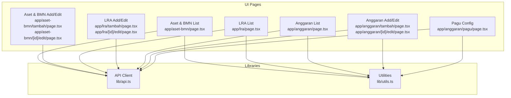
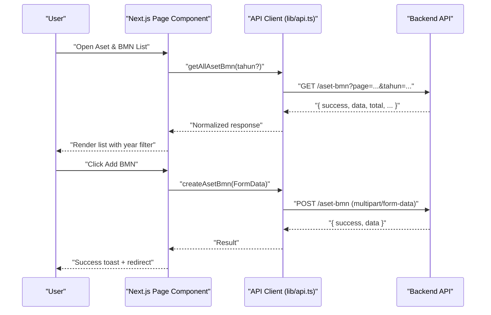
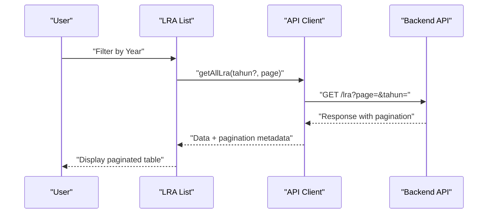
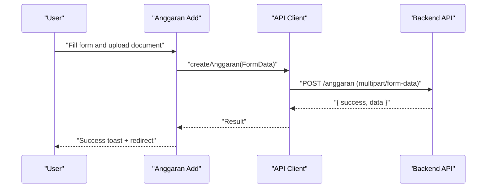
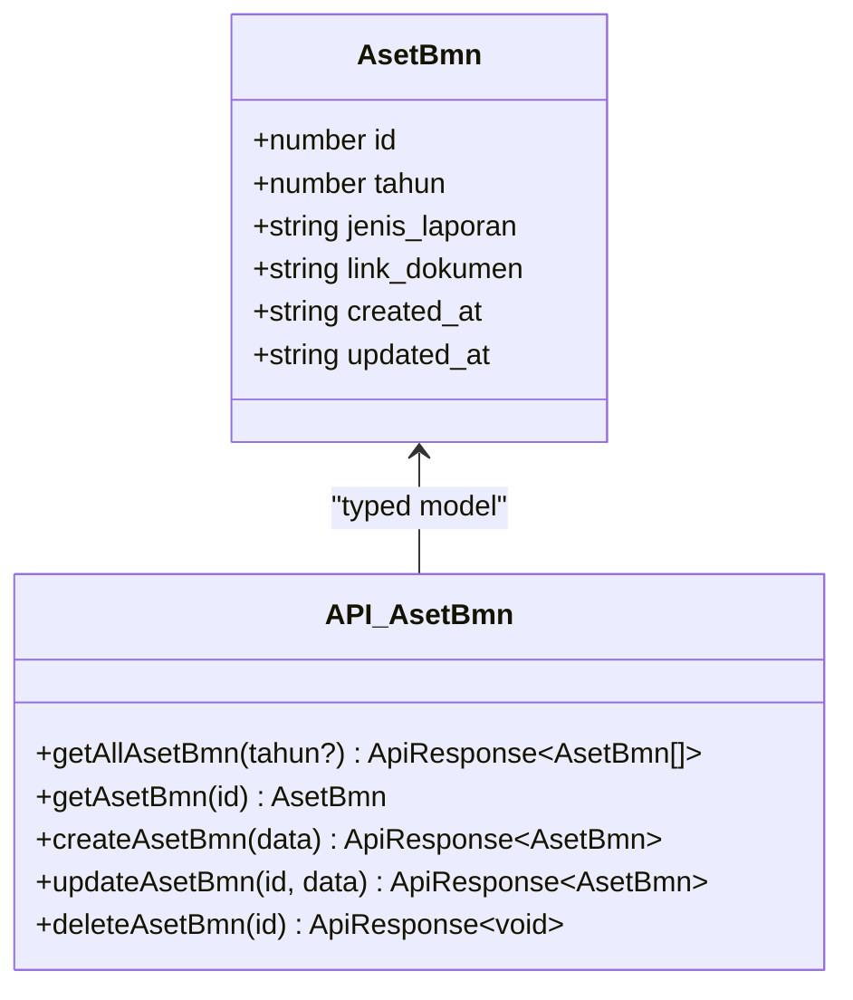
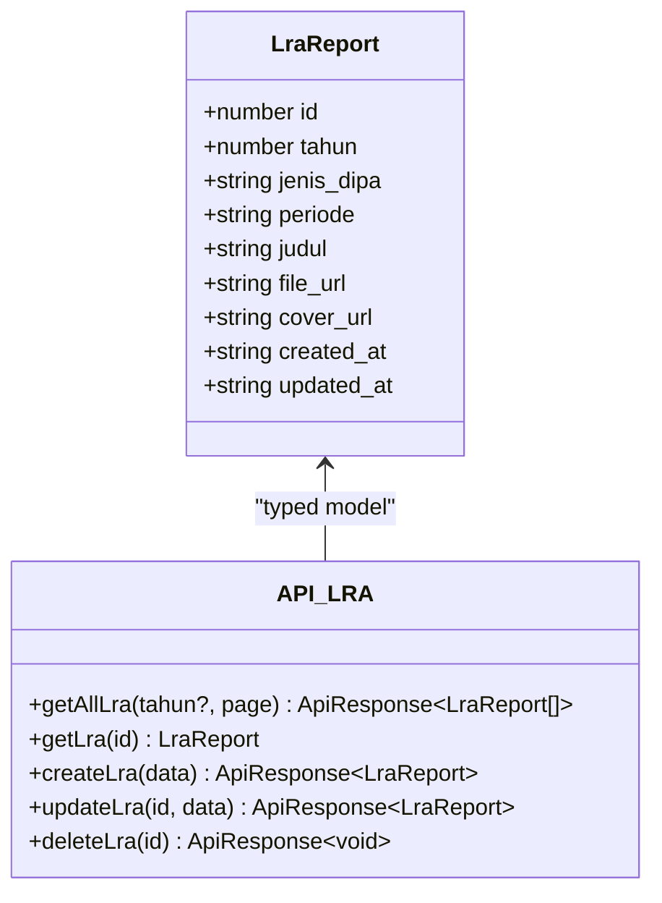
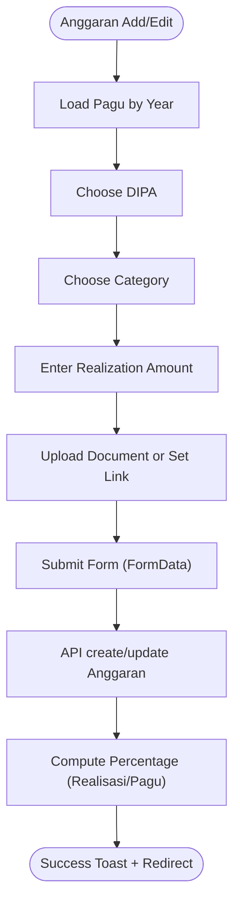
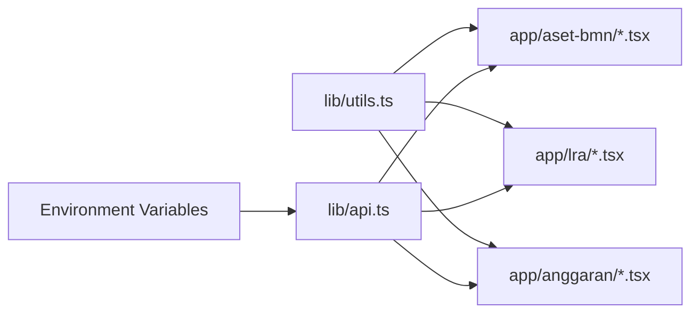

# Asset and Property Management

<cite>
**Referenced Files in This Document**
- [app/aset-bmn/page.tsx](file://app/aset-bmn/page.tsx)
- [app/aset-bmn/tambah/page.tsx](file://app/aset-bmn/tambah/page.tsx)
- [app/aset-bmn/[id]/edit/page.tsx](file://app/aset-bmn/[id]/edit/page.tsx)
- [app/lra/page.tsx](file://app/lra/page.tsx)
- [app/lra/tambah/page.tsx](file://app/lra/tambah/page.tsx)
- [app/lra/[id]/edit/page.tsx](file://app/lra/[id]/edit/page.tsx)
- [app/anggaran/page.tsx](file://app/anggaran/page.tsx)
- [app/anggaran/tambah/page.tsx](file://app/anggaran/tambah/page.tsx)
- [app/anggaran/pagu/page.tsx](file://app/anggaran/pagu/page.tsx)
- [app/anggaran/[id]/edit/page.tsx](file://app/anggaran/[id]/edit/page.tsx)
- [lib/api.ts](file://lib/api.ts)
- [lib/utils.ts](file://lib/utils.ts)
</cite>

## Table of Contents
1. [Introduction](#introduction)
2. [Project Structure](#project-structure)
3. [Core Components](#core-components)
4. [Architecture Overview](#architecture-overview)
5. [Detailed Component Analysis](#detailed-component-analysis)
6. [Dependency Analysis](#dependency-analysis)
7. [Performance Considerations](#performance-considerations)
8. [Troubleshooting Guide](#troubleshooting-guide)
9. [Conclusion](#conclusion)

## Introduction
This document describes the asset and property management module focused on two primary systems:
- Aset & BMN: Government asset and inventory reporting for Barang Milik Negara (BMN) within the court’s administrative domain.
- LRA (Laporan Realisasi Anggaran): Budget execution reporting aligned with DIPA classifications.

It explains the asset tracking workflow from acquisition to disposal, inventory management, reporting mechanisms, and integration points with financial systems. It also documents common patterns for asset data entry, categorization, valuation, classification, maintenance tracking, and audit trail maintenance. Finally, it outlines reporting requirements and dashboard-style implementations for oversight.

## Project Structure
The frontend is a Next.js application with modular pages under app/. The asset and property management features are implemented as follows:
- Aset & BMN: Listing, filtering by year, adding/editing BMN reports, and deleting entries.
- LRA: Listing, pagination, filtering by year, adding/editing LRA reports, and deleting entries.
- Anggaran: Realization tracking with pagu configuration, monthly entries, and document linkage.

**Diagram sources**
- [app/aset-bmn/page.tsx:32-221](file://app/aset-bmn/page.tsx#L32-L221)
- [app/aset-bmn/tambah/page.tsx:19-150](file://app/aset-bmn/tambah/page.tsx#L19-L150)
- [app/aset-bmn/[id]/edit/page.tsx](file://app/aset-bmn/[id]/edit/page.tsx#L19-L181)
- [app/lra/page.tsx:27-320](file://app/lra/page.tsx#L27-L320)
- [app/lra/tambah/page.tsx:17-229](file://app/lra/tambah/page.tsx#L17-L229)
- [app/lra/[id]/edit/page.tsx](file://app/lra/[id]/edit/page.tsx#L18-L301)
- [app/anggaran/page.tsx:31-335](file://app/anggaran/page.tsx#L31-L335)
- [app/anggaran/tambah/page.tsx:39-204](file://app/anggaran/tambah/page.tsx#L39-L204)
- [app/anggaran/pagu/page.tsx:19-131](file://app/anggaran/pagu/page.tsx#L19-L131)
- [app/anggaran/[id]/edit/page.tsx](file://app/anggaran/[id]/edit/page.tsx#L29-L154)
- [lib/api.ts:584-652](file://lib/api.ts#L584-L652)
- [lib/api.ts:1079-1141](file://lib/api.ts#L1079-L1141)
- [lib/api.ts:429-471](file://lib/api.ts#L429-L471)
- [lib/utils.ts:8-25](file://lib/utils.ts#L8-L25)

**Section sources**
- [app/aset-bmn/page.tsx:32-221](file://app/aset-bmn/page.tsx#L32-L221)
- [app/lra/page.tsx:27-320](file://app/lra/page.tsx#L27-L320)
- [app/anggaran/page.tsx:31-335](file://app/anggaran/page.tsx#L31-L335)
- [lib/api.ts:584-652](file://lib/api.ts#L584-L652)
- [lib/api.ts:1079-1141](file://lib/api.ts#L1079-L1141)
- [lib/api.ts:429-471](file://lib/api.ts#L429-L471)
- [lib/utils.ts:8-25](file://lib/utils.ts#L8-L25)

## Core Components
- Aset & BMN (Government Assets)
  - Data model: AsetBmn with fields for year, report type, and optional document link.
  - Operations: List, filter by year, add via file upload, edit with optional replacement upload, delete.
  - UI: Year filter, grouped sections for BMN position, user authority stock, and condition reports.
- LRA (Budget Execution Reports)
  - Data model: LraReport with year, DIPA type, period, title, and optional file and cover URLs.
  - Operations: List with pagination, filter by year, add with PDF upload and optional cover, edit with replace uploads, delete.
- Anggaran (Budget Realization)
  - Data model: RealisasiAnggaran with DIPA, category, month, pagu, realization, remaining, percentage, year, optional document link.
  - Operations: List with pagination and filters (year, DIPA), add with file upload or manual link, edit with optional replacement upload, delete.
  - Pagu configuration: Configure annual pagu per DIPA and category; auto-calculates percentage based on realized amount.

**Section sources**
- [lib/api.ts:595-602](file://lib/api.ts#L595-L602)
- [lib/api.ts:1079-1089](file://lib/api.ts#L1079-L1089)
- [lib/api.ts:356-370](file://lib/api.ts#L356-L370)
- [app/aset-bmn/page.tsx:26-30](file://app/aset-bmn/page.tsx#L26-L30)
- [app/aset-bmn/tambah/page.tsx:23-26](file://app/aset-bmn/tambah/page.tsx#L23-L26)
- [app/lra/page.tsx:28-38](file://app/lra/page.tsx#L28-L38)
- [app/anggaran/page.tsx:32-43](file://app/anggaran/page.tsx#L32-L43)

## Architecture Overview
The system follows a clear separation of concerns:
- UI pages orchestrate state, present forms, and trigger actions.
- API client encapsulates HTTP requests, normalization, and typed responses.
- Utilities provide shared helpers like year options and currency formatting.

**Diagram sources**
- [app/aset-bmn/page.tsx:39-53](file://app/aset-bmn/page.tsx#L39-L53)
- [lib/api.ts:604-630](file://lib/api.ts#L604-L630)
- [lib/api.ts:618-630](file://lib/api.ts#L618-L630)

**Diagram sources**
- [app/lra/page.tsx:40-63](file://app/lra/page.tsx#L40-L63)
- [lib/api.ts:1092-1098](file://lib/api.ts#L1092-L1098)

**Diagram sources**
- [app/anggaran/tambah/page.tsx:71-106](file://app/anggaran/tambah/page.tsx#L71-L106)
- [lib/api.ts:447-453](file://lib/api.ts#L447-L453)

## Detailed Component Analysis

### Aset & BMN Module
- Purpose: Manage BMN-related reports (position in balance sheet, user authority stock, condition) with document attachments.
- Workflow:
  - Filter by year.
  - Grouped sections for three report families.
  - Add: select year and report type, optionally upload document.
  - Edit: update year/report type and optionally replace uploaded document.
  - Delete: confirm and remove record.
- Data model and endpoints:
  - Model: AsetBmn with year, report type, optional document link.
  - Endpoints: getAllAsetBmn, getAsetBmn, createAsetBmn, updateAsetBmn, deleteAsetBmn.

**Diagram sources**
- [lib/api.ts:595-602](file://lib/api.ts#L595-L602)
- [lib/api.ts:604-652](file://lib/api.ts#L604-L652)

**Section sources**
- [app/aset-bmn/page.tsx:32-221](file://app/aset-bmn/page.tsx#L32-L221)
- [app/aset-bmn/tambah/page.tsx:19-150](file://app/aset-bmn/tambah/page.tsx#L19-L150)
- [app/aset-bmn/[id]/edit/page.tsx](file://app/aset-bmn/[id]/edit/page.tsx#L19-L181)
- [lib/api.ts:584-652](file://lib/api.ts#L584-L652)

### LRA (Budget Execution Reports) Module
- Purpose: Track and publish budget execution reports per DIPA and period.
- Workflow:
  - Filter by year, paginate results.
  - Add: choose DIPA type, period, title, upload PDF, optionally cover image.
  - Edit: replace PDF or cover; view existing links.
  - Delete: confirm removal.
- Data model and endpoints:
  - Model: LraReport with year, DIPA type, period, title, optional file and cover URLs.
  - Endpoints: getAllLra, getLra, createLra, updateLra, deleteLra.

**Diagram sources**
- [lib/api.ts:1079-1089](file://lib/api.ts#L1079-L1089)
- [lib/api.ts:1091-1141](file://lib/api.ts#L1091-L1141)

**Section sources**
- [app/lra/page.tsx:27-320](file://app/lra/page.tsx#L27-L320)
- [app/lra/tambah/page.tsx:17-229](file://app/lra/tambah/page.tsx#L17-L229)
- [app/lra/[id]/edit/page.tsx](file://app/lra/[id]/edit/page.tsx#L18-L301)
- [lib/api.ts:1079-1141](file://lib/api.ts#L1079-L1141)

### Anggaran (Budget Realization) Module
- Purpose: Manage monthly budget realization with pagu configuration and optional supporting documents.
- Workflow:
  - List with filters (year, DIPA) and pagination.
  - Pagu configuration: set pagu per DIPA and category per year; auto-refresh pagu on change.
  - Add: select year/month/DIPA/category, enter realization, upload document or set manual link.
  - Edit: update values and optionally replace document; server enforces multipart PUT via POST with _method=PUT.
  - Delete: confirm removal.
- Data model and endpoints:
  - Model: RealisasiAnggaran with pagu, realization, remaining, percentage, optional document link.
  - Endpoints: getAllAnggaran, getAnggaran, createAnggaran, updateAnggaran, deleteAnggaran.
  - Pagu: getAllPagu, updatePagu.

**Diagram sources**
- [app/anggaran/tambah/page.tsx:58-106](file://app/anggaran/tambah/page.tsx#L58-L106)
- [app/anggaran/[id]/edit/page.tsx](file://app/anggaran/[id]/edit/page.tsx#L52-L76)
- [lib/api.ts:447-471](file://lib/api.ts#L447-L471)

**Section sources**
- [app/anggaran/page.tsx:31-335](file://app/anggaran/page.tsx#L31-L335)
- [app/anggaran/tambah/page.tsx:39-204](file://app/anggaran/tambah/page.tsx#L39-L204)
- [app/anggaran/pagu/page.tsx:19-131](file://app/anggaran/pagu/page.tsx#L19-L131)
- [app/anggaran/[id]/edit/page.tsx](file://app/anggaran/[id]/edit/page.tsx#L29-L154)
- [lib/api.ts:429-471](file://lib/api.ts#L429-L471)
- [lib/api.ts:499-523](file://lib/api.ts#L499-L523)

## Dependency Analysis
- UI pages depend on:
  - API client for CRUD operations.
  - Utilities for year options and currency formatting.
- API client depends on:
  - Environment variables for base URL and API key.
  - Normalized response handling for consistent success/error semantics.
- Coupling and cohesion:
  - Strong cohesion within each module’s UI and API functions.
  - Loose coupling via typed interfaces and normalized responses.

**Diagram sources**
- [lib/utils.ts:8-25](file://lib/utils.ts#L8-L25)
- [lib/api.ts:1-4](file://lib/api.ts#L1-L4)
- [app/aset-bmn/page.tsx:5-6](file://app/aset-bmn/page.tsx#L5-L6)
- [app/lra/page.tsx:5-6](file://app/lra/page.tsx#L5-L6)
- [app/anggaran/page.tsx:5-6](file://app/anggaran/page.tsx#L5-L6)

**Section sources**
- [lib/utils.ts:8-25](file://lib/utils.ts#L8-L25)
- [lib/api.ts:1-4](file://lib/api.ts#L1-L4)
- [app/aset-bmn/page.tsx:5-6](file://app/aset-bmn/page.tsx#L5-L6)
- [app/lra/page.tsx:5-6](file://app/lra/page.tsx#L5-L6)
- [app/anggaran/page.tsx:5-6](file://app/anggaran/page.tsx#L5-L6)

## Performance Considerations
- Pagination: LRA and Anggaran lists support pagination to limit payload sizes and improve responsiveness.
- Filtering: Year filters reduce dataset size client-side and server-side.
- File uploads: Prefer smaller formats and sizes; consider server-side processing for heavy conversions.
- Currency formatting: Use client-side formatting for readability; avoid frequent re-renders by memoizing formatted values.
- API normalization: Centralized response handling reduces error handling overhead across modules.

[No sources needed since this section provides general guidance]

## Troubleshooting Guide
Common issues and resolutions:
- API connectivity errors:
  - Verify NEXT_PUBLIC_API_URL and NEXT_PUBLIC_API_KEY environment variables.
  - Confirm backend service availability and CORS settings.
- Upload failures:
  - Ensure file types and sizes match supported formats and limits.
  - For multipart updates, confirm server supports POST with _method=PUT for FormData.
- Validation errors:
  - Required fields: year, report type (BMN), DIPA type, period, PDF upload (LRA), realization amount (Anggaran).
  - Pagu configuration requires numeric values; saving triggers blur handlers.
- Pagination anomalies:
  - Ensure current page is refreshed after delete operations to maintain accurate indices.

**Section sources**
- [lib/api.ts:82-91](file://lib/api.ts#L82-L91)
- [app/aset-bmn/tambah/page.tsx:33-36](file://app/aset-bmn/tambah/page.tsx#L33-L36)
- [app/lra/tambah/page.tsx:39-50](file://app/lra/tambah/page.tsx#L39-L50)
- [app/anggaran/tambah/page.tsx:71-77](file://app/anggaran/tambah/page.tsx#L71-L77)
- [app/anggaran/pagu/page.tsx:39-56](file://app/anggaran/pagu/page.tsx#L39-L56)

## Conclusion
The asset and property management module provides a cohesive set of capabilities for managing BMN reports, budget execution reports (LRA), and monthly budget realizations with pagu configuration. The UI pages integrate tightly with a typed API client and shared utilities, enabling robust filtering, pagination, and document management. The architecture supports audit-ready workflows with explicit CRUD operations and optional document attachments, facilitating compliance and transparency.