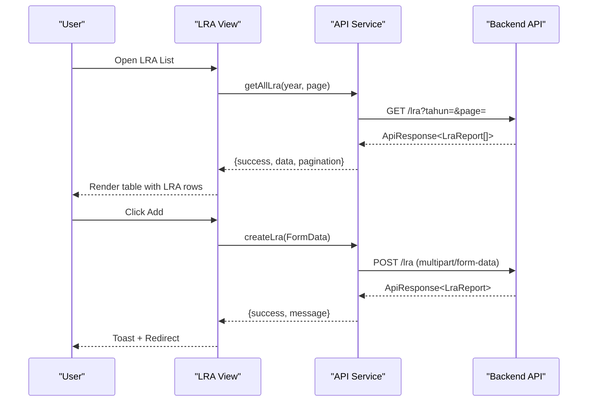
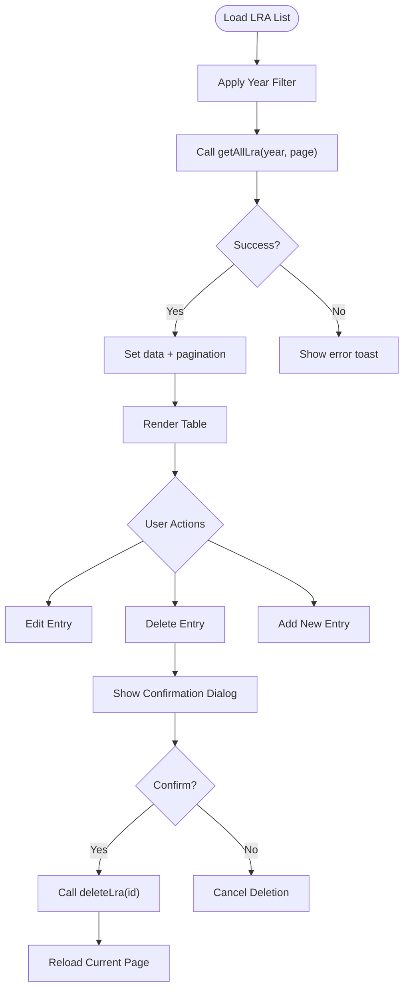
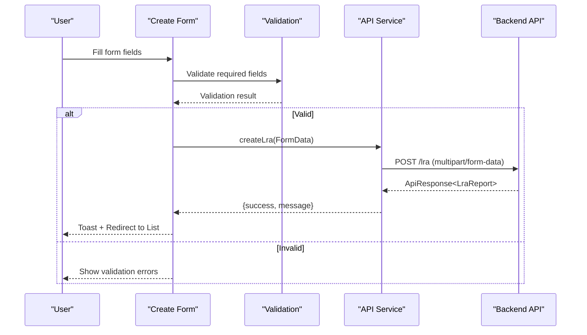
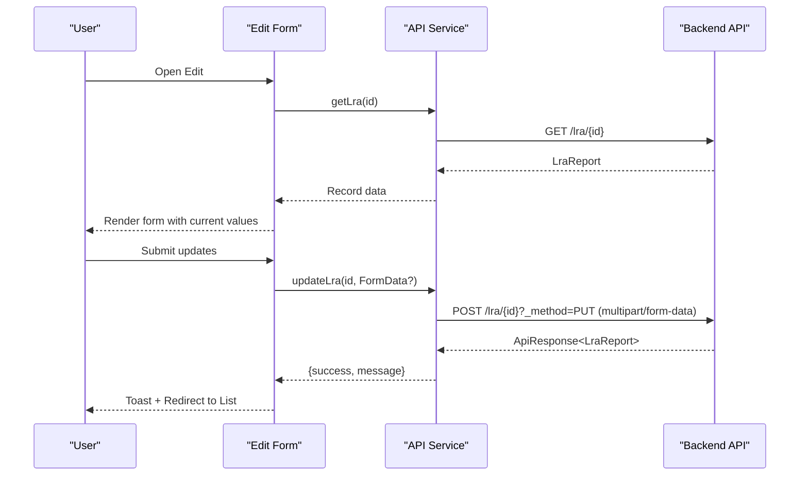
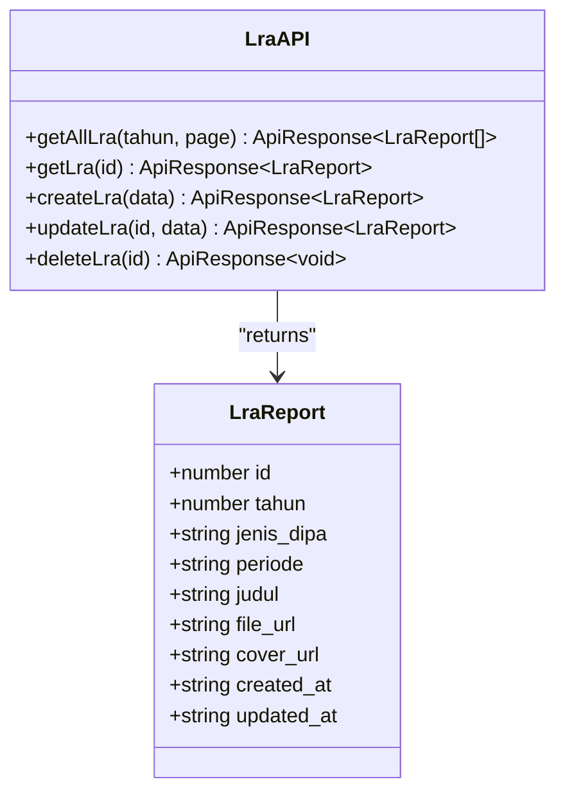
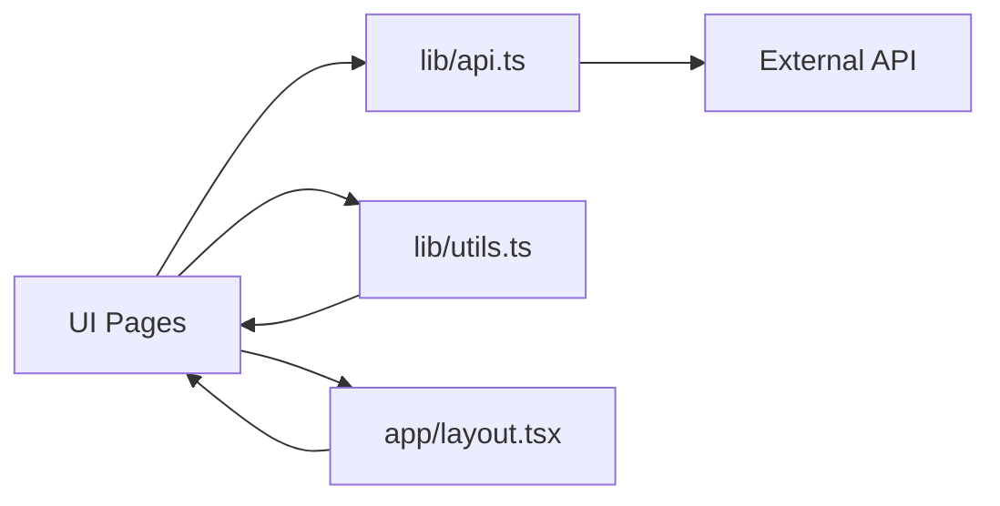

# LRA (Budget Execution Reports)

<cite>
**Referenced Files in This Document**
- [app/lra/page.tsx](file://app/lra/page.tsx)
- [app/lra/tambah/page.tsx](file://app/lra/tambah/page.tsx)
- [app/lra/[id]/edit/page.tsx](file://app/lra/[id]/edit/page.tsx)
- [lib/api.ts](file://lib/api.ts)
- [lib/utils.ts](file://lib/utils.ts)
- [app/layout.tsx](file://app/layout.tsx)
</cite>

## Table of Contents
1. [Introduction](#introduction)
2. [Project Structure](#project-structure)
3. [Core Components](#core-components)
4. [Architecture Overview](#architecture-overview)
5. [Detailed Component Analysis](#detailed-component-analysis)
6. [Dependency Analysis](#dependency-analysis)
7. [Performance Considerations](#performance-considerations)
8. [Troubleshooting Guide](#troubleshooting-guide)
9. [Conclusion](#conclusion)

## Introduction
This document describes the LRA (Laporan Realisasi Anggaran) module responsible for Budget Execution Reports and financial performance tracking. It covers the complete workflow for generating and managing budget execution reports, performance analysis, and financial monitoring. The module enables creation, editing, and deletion of LRA records, manages reporting periods, integrates with financial systems, and maintains audit trails through API interactions.

## Project Structure
The LRA module is organized as a Next.js app with three primary pages:
- List view: displays paginated LRA entries with filtering by year and actions (edit/delete)
- Create view: adds new LRA entries with validations for required fields and file uploads
- Edit view: updates existing LRA entries, supports optional file replacements

```mermaid
graph TB
subgraph "UI Layer"
List["LRA List<br/>app/lra/page.tsx"]
Create["Add LRA<br/>app/lra/tambah/page.tsx"]
Edit["Edit LRA<br/>app/lra/[id]/edit/page.tsx"]
end
subgraph "Services"
API["API Library<br/>lib/api.ts"]
Utils["Utilities<br/>lib/utils.ts"]
end
subgraph "Backend"
Backend["LRA API Endpoint"]
end
List --> API
Create --> API
Edit --> API
API --> Backend
List --> Utils
```

**Diagram sources**
- [app/lra/page.tsx:1-320](file://app/lra/page.tsx#L1-L320)
- [app/lra/tambah/page.tsx:1-229](file://app/lra/tambah/page.tsx#L1-L229)
- [app/lra/[id]/edit/page.tsx:1-301](file://app/lra/[id]/edit/page.tsx#L1-L301)
- [lib/api.ts:1075-1144](file://lib/api.ts#L1075-L1144)
- [lib/utils.ts:1-26](file://lib/utils.ts#L1-L26)

**Section sources**
- [app/lra/page.tsx:1-320](file://app/lra/page.tsx#L1-L320)
- [app/lra/tambah/page.tsx:1-229](file://app/lra/tambah/page.tsx#L1-L229)
- [app/lra/[id]/edit/page.tsx:1-301](file://app/lra/[id]/edit/page.tsx#L1-L301)
- [lib/api.ts:1075-1144](file://lib/api.ts#L1075-L1144)
- [lib/utils.ts:1-26](file://lib/utils.ts#L1-L26)

## Core Components
- LRA Report model: includes year, DIPA type, reporting period, title, and document/cover URLs
- API service: provides CRUD operations for LRA with JSON and multipart/form-data support
- UI forms: create and edit forms with validation and file upload controls
- List view: paginated table with filtering by year, action buttons, and responsive design
- Utilities: year options generator and currency formatting helpers

Key responsibilities:
- Data entry and validation for LRA records
- File upload handling for PDF documents and cover images
- Period selection (semester 1, semester 2, audited, unaudited)
- Year filtering and pagination
- Audit trail via API responses and toast notifications

**Section sources**
- [lib/api.ts:1079-1089](file://lib/api.ts#L1079-L1089)
- [lib/api.ts:1091-1141](file://lib/api.ts#L1091-L1141)
- [app/lra/tambah/page.tsx:22-87](file://app/lra/tambah/page.tsx#L22-L87)
- [app/lra/[id]/edit/page.tsx:27-117](file://app/lra/[id]/edit/page.tsx#L27-L117)
- [app/lra/page.tsx:28-67](file://app/lra/page.tsx#L28-L67)

## Architecture Overview
The LRA module follows a clean separation of concerns:
- UI components manage user interactions and state
- API service abstracts backend communication
- Utilities provide shared helpers
- Layout ensures consistent navigation and notifications



**Diagram sources**
- [app/lra/page.tsx:40-67](file://app/lra/page.tsx#L40-L67)
- [lib/api.ts:1091-1117](file://lib/api.ts#L1091-L1117)
- [app/lra/tambah/page.tsx:36-87](file://app/lra/tambah/page.tsx#L36-L87)

## Detailed Component Analysis

### LRA List View
The list view provides:
- Year filter dropdown with dynamic year options
- Paginated table displaying LRA entries
- Action buttons for edit and delete
- Responsive design with skeleton loaders during loading
- Confirmation dialog for deletions



**Diagram sources**
- [app/lra/page.tsx:40-87](file://app/lra/page.tsx#L40-L87)
- [lib/api.ts:1135-1141](file://lib/api.ts#L1135-L1141)

**Section sources**
- [app/lra/page.tsx:125-318](file://app/lra/page.tsx#L125-L318)
- [lib/utils.ts:8-16](file://lib/utils.ts#L8-L16)

### LRA Create Form
The create form enforces validation rules:
- DIPA type selection is mandatory
- Reporting period selection is mandatory
- PDF file upload is mandatory
- Optional cover image upload



**Diagram sources**
- [app/lra/tambah/page.tsx:36-87](file://app/lra/tambah/page.tsx#L36-L87)
- [lib/api.ts:1109-1117](file://lib/api.ts#L1109-L1117)

**Section sources**
- [app/lra/tambah/page.tsx:17-229](file://app/lra/tambah/page.tsx#L17-L229)

### LRA Edit Form
The edit form supports:
- Loading existing record data
- Optional replacement of PDF and cover image
- Preservation of existing URLs when not replacing files



**Diagram sources**
- [app/lra/[id]/edit/page.tsx:37-65](file://app/lra/[id]/edit/page.tsx#L37-L65)
- [lib/api.ts:1120-1132](file://lib/api.ts#L1120-L1132)

**Section sources**
- [app/lra/[id]/edit/page.tsx:18-301](file://app/lra/[id]/edit/page.tsx#L18-L301)

### API Integration Details
The API service exposes:
- getAllLra: paginated retrieval with optional year filter
- getLra: single record retrieval
- createLra: creates new LRA with multipart/form-data support
- updateLra: updates existing LRA with method override for file uploads
- deleteLra: removes LRA records



**Diagram sources**
- [lib/api.ts:1079-1089](file://lib/api.ts#L1079-L1089)
- [lib/api.ts:1091-1141](file://lib/api.ts#L1091-L1141)

**Section sources**
- [lib/api.ts:1075-1144](file://lib/api.ts#L1075-L1144)

### Data Model and Validation Rules
- Required fields:
  - jenis_dipa: must be selected (DIPA 01 or DIPA 04)
  - periode: must be selected (semester_1, semester_2, audited, unaudited)
  - file_upload: PDF required for creation
- Optional fields:
  - cover_upload: image optional for cover preview
  - judul: free text title
- File constraints:
  - PDF: max size 5MB
  - Cover: JPG, JPEG, PNG, WebP: max size 2MB

Reporting periods:
- semester_1: First semester
- semester_2: Second semester
- audited: Audited period
- unaudited: Unaudited period

**Section sources**
- [app/lra/tambah/page.tsx:39-50](file://app/lra/tambah/page.tsx#L39-L50)
- [app/lra/tambah/page.tsx:175-207](file://app/lra/tambah/page.tsx#L175-L207)
- [app/lra/[id]/edit/page.tsx:75-78](file://app/lra/[id]/edit/page.tsx#L75-L78)
- [app/lra/[id]/edit/page.tsx:213-241](file://app/lra/[id]/edit/page.tsx#L213-L241)

### Performance Considerations
- Client-side pagination: reduces server load by limiting records per page
- Year filtering: narrows dataset early to improve responsiveness
- Skeleton loaders: provide perceived performance during data fetches
- Toast notifications: minimize re-renders by avoiding full-page refreshes
- File uploads: handled via FormData to avoid base64 overhead

[No sources needed since this section provides general guidance]

### Compliance and Audit Trail
- API responses include success flags and messages for auditability
- CRUD operations are logged via backend API responses
- File uploads are stored externally (Google Drive) with URL persistence
- Timestamps (created_at, updated_at) maintained by backend

**Section sources**
- [lib/api.ts:43-80](file://lib/api.ts#L43-L80)
- [lib/api.ts:1085-1088](file://lib/api.ts#L1085-L1088)

## Dependency Analysis
The LRA module depends on:
- UI components: buttons, cards, tables, selects, dialogs, pagination
- Utilities: year options generator
- API service: centralized HTTP client with normalized responses
- Layout: global sidebar and notification system



**Diagram sources**
- [app/lra/page.tsx:5-6](file://app/lra/page.tsx#L5-L6)
- [lib/api.ts:1-4](file://lib/api.ts#L1-L4)
- [lib/utils.ts:1-26](file://lib/utils.ts#L1-L26)
- [app/layout.tsx:3-5](file://app/layout.tsx#L3-L5)

**Section sources**
- [app/lra/page.tsx:1-320](file://app/lra/page.tsx#L1-L320)
- [lib/api.ts:1-1144](file://lib/api.ts#L1-L1144)
- [lib/utils.ts:1-26](file://lib/utils.ts#L1-L26)
- [app/layout.tsx:1-37](file://app/layout.tsx#L1-L37)

## Troubleshooting Guide
Common issues and resolutions:
- API connectivity failures: verify NEXT_PUBLIC_API_URL and NEXT_PUBLIC_API_KEY environment variables
- Validation errors on submission: ensure required fields (DIPA type, period, PDF) are filled
- File upload errors: confirm file formats and size limits (PDF ≤ 5MB, Cover ≤ 2MB)
- Pagination inconsistencies: reload current page after delete operations
- Toast notifications: check global Toaster component in layout

**Section sources**
- [lib/api.ts:1-4](file://lib/api.ts#L1-L4)
- [app/lra/tambah/page.tsx:39-50](file://app/lra/tambah/page.tsx#L39-L50)
- [app/lra/page.tsx:55-61](file://app/lra/page.tsx#L55-L61)

## Conclusion
The LRA module provides a robust foundation for managing Budget Execution Reports with clear validation, responsive UI, and reliable API integration. It supports essential CRUD operations, reporting period management, and compliance through structured data models and audit-ready API responses. Future enhancements could include performance dashboards, automated compliance checks, and advanced analytics for budget execution trends.