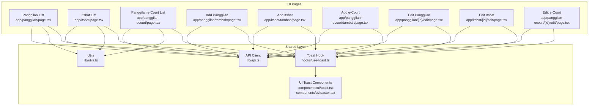
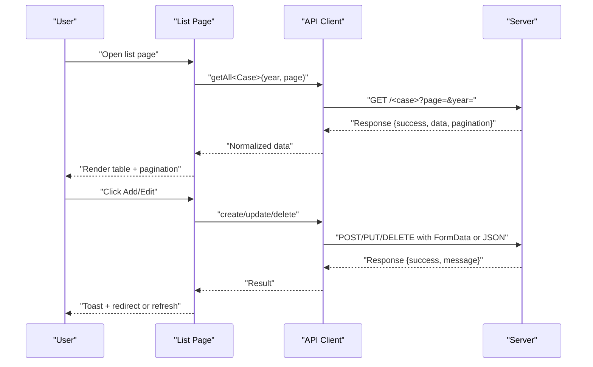
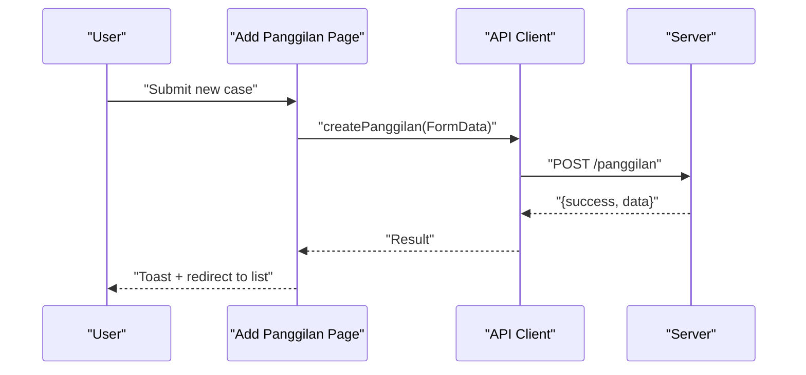
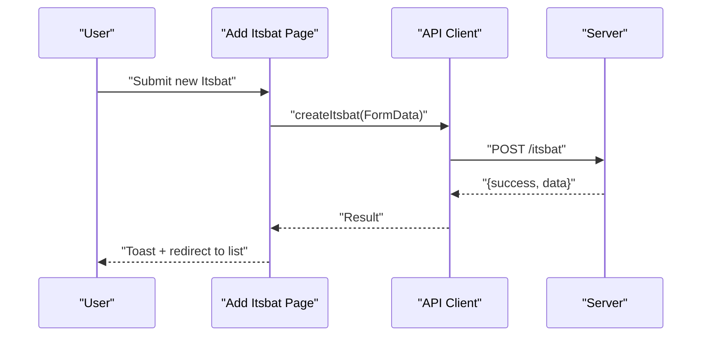
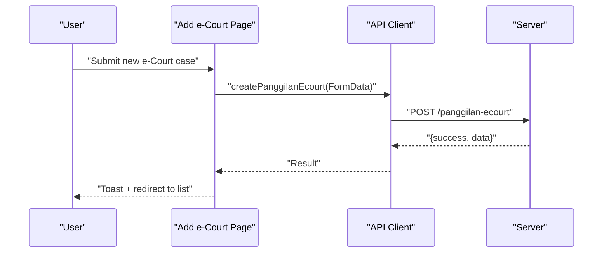
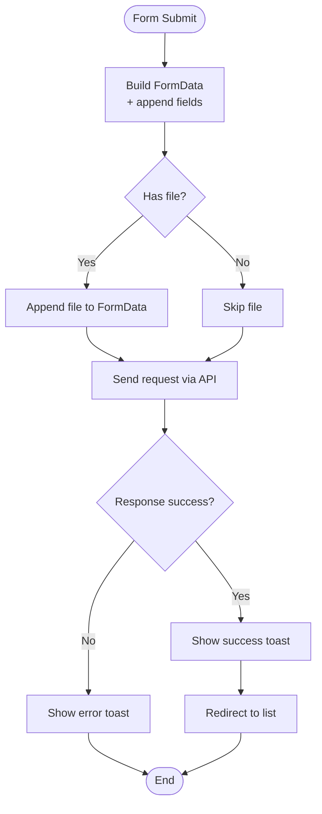
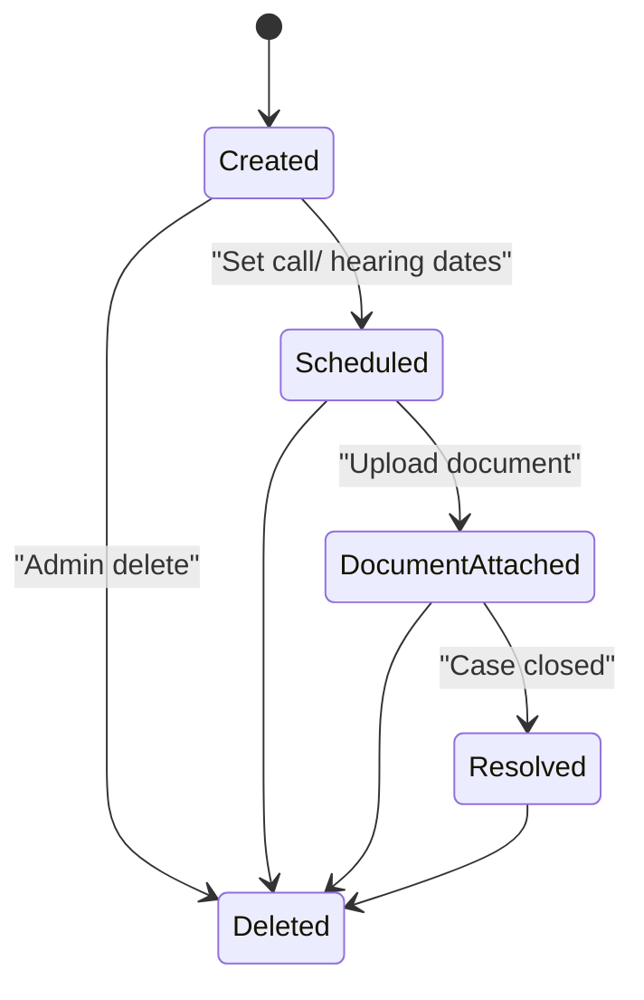
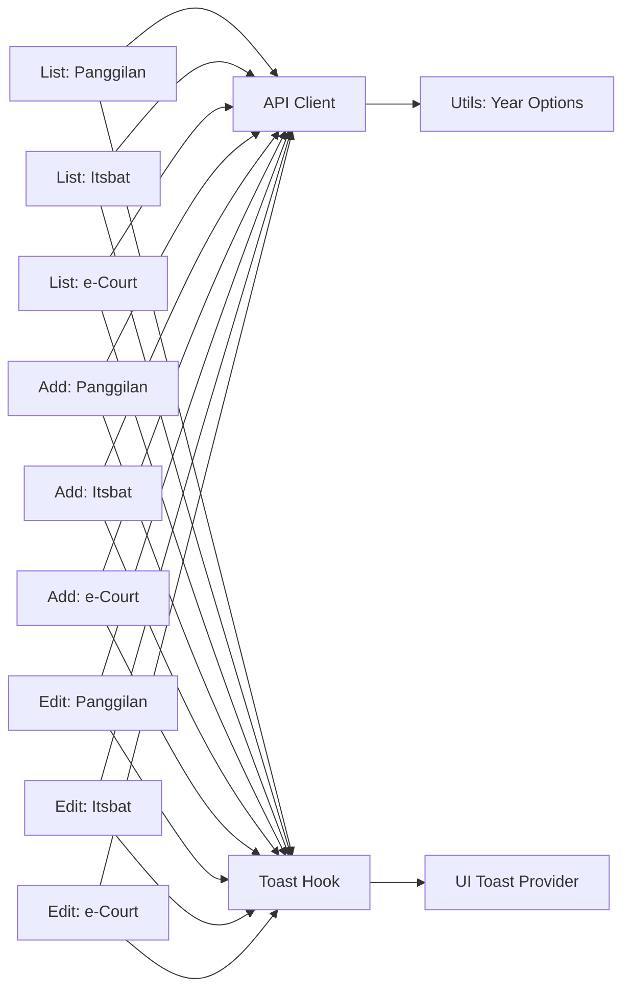

# Case Management

<cite>
**Referenced Files in This Document**
- [app/panggilan/page.tsx](file://app/panggilan/page.tsx)
- [app/itsbat/page.tsx](file://app/itsbat/page.tsx)
- [app/panggilan-ecourt/page.tsx](file://app/panggilan-ecourt/page.tsx)
- [app/panggilan/tambah/page.tsx](file://app/panggilan/tambah/page.tsx)
- [app/itsbat/tambah/page.tsx](file://app/itsbat/tambah/page.tsx)
- [app/panggilan-ecourt/tambah/page.tsx](file://app/panggilan-ecourt/tambah/page.tsx)
- [app/panggilan/[id]/edit/page.tsx](file://app/panggilan/[id]/edit/page.tsx)
- [app/itsbat/[id]/edit/page.tsx](file://app/itsbat/[id]/edit/page.tsx)
- [app/panggilan-ecourt/[id]/edit/page.tsx](file://app/panggilan-ecourt/[id]/edit/page.tsx)
- [lib/api.ts](file://lib/api.ts)
- [lib/utils.ts](file://lib/utils.ts)
- [hooks/use-toast.ts](file://hooks/use-toast.ts)
- [components/ui/toast.tsx](file://components/ui/toast.tsx)
- [components/ui/toaster.tsx](file://components/ui/toaster.tsx)
</cite>

## Table of Contents
1. [Introduction](#introduction)
2. [Project Structure](#project-structure)
3. [Core Components](#core-components)
4. [Architecture Overview](#architecture-overview)
5. [Detailed Component Analysis](#detailed-component-analysis)
6. [Dependency Analysis](#dependency-analysis)
7. [Performance Considerations](#performance-considerations)
8. [Troubleshooting Guide](#troubleshooting-guide)
9. [Conclusion](#conclusion)

## Introduction
This document describes the case management module covering three primary case processing systems:
- Absent Party Cases (Panggilan Ghaib)
- Marriage Certificate Processing (Itsbat Nikah)
- Electronic Court Notifications (Panggilan e-Court)

It explains the shared CRUD operations, form validation patterns, and workflow management across all case types. It also documents the case lifecycle from creation to resolution, including status tracking, scheduling, and document management. Specific requirements for each case type, legal procedures, required documentation, and processing timelines are outlined. Implementation patterns for case assignment, notifications, and automated workflows are included, along with examples of form handling, data validation, and UI patterns used across the module.

## Project Structure
The case management module follows a feature-based organization under the app directory:
- List pages for each case type: Panggilan, Itsbat, and Panggilan e-Court
- Add pages for creating new records
- Edit pages for updating existing records
- Shared utilities and API layer for data access
- Shared UI components and toast notification system

**Diagram sources**
- [app/panggilan/page.tsx](file://app/panggilan/page.tsx)
- [app/itsbat/page.tsx](file://app/itsbat/page.tsx)
- [app/panggilan-ecourt/page.tsx](file://app/panggilan-ecourt/page.tsx)
- [app/panggilan/tambah/page.tsx](file://app/panggilan/tambah/page.tsx)
- [app/itsbat/tambah/page.tsx](file://app/itsbat/tambah/page.tsx)
- [app/panggilan-ecourt/tambah/page.tsx](file://app/panggilan-ecourt/tambah/page.tsx)
- [app/panggilan/[id]/edit/page.tsx](file://app/panggilan/[id]/edit/page.tsx)
- [app/itsbat/[id]/edit/page.tsx](file://app/itsbat/[id]/edit/page.tsx)
- [app/panggilan-ecourt/[id]/edit/page.tsx](file://app/panggilan-ecourt/[id]/edit/page.tsx)
- [lib/api.ts](file://lib/api.ts)
- [lib/utils.ts](file://lib/utils.ts)
- [hooks/use-toast.ts](file://hooks/use-toast.ts)
- [components/ui/toast.tsx](file://components/ui/toast.tsx)
- [components/ui/toaster.tsx](file://components/ui/toaster.tsx)

**Section sources**
- [app/panggilan/page.tsx:1-310](file://app/panggilan/page.tsx#L1-L310)
- [app/itsbat/page.tsx:1-303](file://app/itsbat/page.tsx#L1-L303)
- [app/panggilan-ecourt/page.tsx:1-287](file://app/panggilan-ecourt/page.tsx#L1-L287)
- [lib/api.ts:1-1144](file://lib/api.ts#L1-L1144)
- [lib/utils.ts:1-26](file://lib/utils.ts#L1-L26)
- [hooks/use-toast.ts:1-195](file://hooks/use-toast.ts#L1-L195)
- [components/ui/toast.tsx:1-130](file://components/ui/toast.tsx#L1-L130)
- [components/ui/toaster.tsx:1-36](file://components/ui/toaster.tsx#L1-L36)

## Core Components
- List pages for each case type implement:
  - Year filtering via a select dropdown using year options generated by a utility
  - Pagination with dynamic page links and ellipsis
  - Table rendering of records with actions (edit, delete)
  - Loading skeletons and empty state handling
  - Confirmation dialogs for deletion
- Add/Edit forms share common patterns:
  - Controlled form state with typed field updates
  - Year selection using the same year options utility
  - Date inputs for scheduling fields
  - Optional file upload via FormData for documents
  - Toast-based feedback for success/error states
  - Navigation back to list after successful submit
- API client exposes:
  - Fetch helpers for GET/POST/PUT/DELETE
  - Typed interfaces for each case model
  - Normalized response handling
  - Special handling for file uploads using FormData and server-side method override for PUT/PATCH
- Utilities:
  - Year options generator for select dropdowns
  - Currency formatting helper
- Notification system:
  - Centralized toast hook with reducer-based state
  - UI toast provider and components

**Section sources**
- [app/panggilan/page.tsx:28-310](file://app/panggilan/page.tsx#L28-L310)
- [app/itsbat/page.tsx:27-303](file://app/itsbat/page.tsx#L27-L303)
- [app/panggilan-ecourt/page.tsx:28-287](file://app/panggilan-ecourt/page.tsx#L28-L287)
- [app/panggilan/tambah/page.tsx:18-282](file://app/panggilan/tambah/page.tsx#L18-L282)
- [app/itsbat/tambah/page.tsx:17-231](file://app/itsbat/tambah/page.tsx#L17-L231)
- [app/panggilan-ecourt/tambah/page.tsx:18-297](file://app/panggilan-ecourt/tambah/page.tsx#L18-L297)
- [app/panggilan/[id]/edit/page.tsx:19-339](file://app/panggilan/[id]/edit/page.tsx#L19-L339)
- [app/itsbat/[id]/edit/page.tsx:18-289](file://app/itsbat/[id]/edit/page.tsx#L18-L289)
- [app/panggilan-ecourt/[id]/edit/page.tsx:18-346](file://app/panggilan-ecourt/[id]/edit/page.tsx#L18-L346)
- [lib/api.ts:94-286](file://lib/api.ts#L94-L286)
- [lib/utils.ts:8-16](file://lib/utils.ts#L8-L16)
- [hooks/use-toast.ts:145-195](file://hooks/use-toast.ts#L145-L195)
- [components/ui/toast.tsx:10-130](file://components/ui/toast.tsx#L10-L130)
- [components/ui/toaster.tsx:13-36](file://components/ui/toaster.tsx#L13-L36)

## Architecture Overview
The system uses a layered architecture:
- UI pages orchestrate data fetching, state updates, and navigation
- API client abstracts HTTP requests and normalizes responses
- Shared utilities provide common helpers (years, formatting)
- Shared toast system centralizes user feedback

**Diagram sources**
- [lib/api.ts:94-286](file://lib/api.ts#L94-L286)
- [app/panggilan/page.tsx:41-64](file://app/panggilan/page.tsx#L41-L64)
- [app/itsbat/page.tsx:40-64](file://app/itsbat/page.tsx#L40-L64)
- [app/panggilan-ecourt/page.tsx:41-64](file://app/panggilan-ecourt/page.tsx#L41-L64)
- [hooks/use-toast.ts:145-195](file://hooks/use-toast.ts#L145-L195)

## Detailed Component Analysis

### Panggilan Ghaib (Absent Party Cases)
- Purpose: Manage absent party case notifications and schedules.
- Data model fields include year, case number, name, address, multiple call dates, hearing date, PIP, optional document link, and additional notes.
- Lifecycle:
  - Creation: Add page collects case info, schedule, and optional document upload.
  - Update: Edit page allows modifying schedule, address, and replacing uploaded document.
  - Deletion: Delete confirmed via dialog; API deletes record.
  - Listing: Filter by year, paginate, and display key fields with actions.
- Validation patterns:
  - Required fields enforced via form controls.
  - Date inputs for scheduling.
  - File upload with accepted formats and size constraints handled by the form.
- UI patterns:
  - Year dropdown populated from utility-generated options.
  - Skeleton loaders during initial load.
  - Pagination with ellipsis for large page sets.
  - Toast notifications for success/error states.

**Diagram sources**
- [app/panggilan/tambah/page.tsx:53-98](file://app/panggilan/tambah/page.tsx#L53-L98)
- [lib/api.ts:114-140](file://lib/api.ts#L114-L140)

**Section sources**
- [app/panggilan/page.tsx:28-310](file://app/panggilan/page.tsx#L28-L310)
- [app/panggilan/tambah/page.tsx:18-282](file://app/panggilan/tambah/page.tsx#L18-L282)
- [app/panggilan/[id]/edit/page.tsx:19-339](file://app/panggilan/[id]/edit/page.tsx#L19-L339)
- [lib/api.ts:5-20](file://lib/api.ts#L5-L20)

### Itsbat Nikah (Marriage Certificate Processing)
- Purpose: Track announcements and hearings for marriage dissolution cases.
- Data model fields include year, case number, two applicants’ names, announcement and hearing dates, optional document link, and timestamps.
- Lifecycle:
  - Creation: Add page captures case number, applicants, dates, and optional document.
  - Update: Edit page supports changing dates and replacing document.
  - Deletion: Delete confirmed via dialog; API deletes record.
  - Listing: Filter by year, paginate, and display key fields with actions.
- Validation patterns:
  - Required fields for case number and hearing date.
  - Date inputs for announcement and hearing.
  - File upload with accepted formats and size constraints handled by the form.
- UI patterns:
  - Consistent year dropdown, skeleton loading, pagination, and toast feedback.

**Diagram sources**
- [app/itsbat/tambah/page.tsx:48-89](file://app/itsbat/tambah/page.tsx#L48-L89)
- [lib/api.ts:172-201](file://lib/api.ts#L172-L201)

**Section sources**
- [app/itsbat/page.tsx:27-303](file://app/itsbat/page.tsx#L27-L303)
- [app/itsbat/tambah/page.tsx:17-231](file://app/itsbat/tambah/page.tsx#L17-L231)
- [app/itsbat/[id]/edit/page.tsx:18-289](file://app/itsbat/[id]/edit/page.tsx#L18-L289)
- [lib/api.ts:22-33](file://lib/api.ts#L22-L33)

### Panggilan e-Court (Electronic Court Notifications)
- Purpose: Manage electronic court notification cases with up to three call dates and optional document link.
- Data model fields include year, case number, name, address, up to three call dates, hearing date, PIP, optional document link, and additional notes.
- Lifecycle:
  - Creation: Add page collects case info, schedule, and optional document upload.
  - Update: Edit page allows modifying schedule and replacing uploaded document.
  - Deletion: Delete confirmed via dialog; API deletes record.
  - Listing: Filter by year, paginate, display key fields, and show document badge when available.
- Validation patterns:
  - Required fields enforced via form controls.
  - Date inputs for scheduling.
  - File upload with accepted formats and size constraints handled by the form.
- UI patterns:
  - Badge indicating presence of document link.
  - Consistent year dropdown, skeleton loading, pagination, and toast feedback.

**Diagram sources**
- [app/panggilan-ecourt/tambah/page.tsx:54-100](file://app/panggilan-ecourt/tambah/page.tsx#L54-L100)
- [lib/api.ts:251-277](file://lib/api.ts#L251-L277)

**Section sources**
- [app/panggilan-ecourt/page.tsx:28-287](file://app/panggilan-ecourt/page.tsx#L28-L287)
- [app/panggilan-ecourt/tambah/page.tsx:18-297](file://app/panggilan-ecourt/tambah/page.tsx#L18-L297)
- [app/panggilan-ecourt/[id]/edit/page.tsx:18-346](file://app/panggilan-ecourt/[id]/edit/page.tsx#L18-L346)
- [lib/api.ts:216-232](file://lib/api.ts#L216-L232)

### Common CRUD Patterns Across Case Types
- Data fetching:
  - Year filtering and pagination are supported in list pages.
  - API functions accept optional year and page parameters.
- Form handling:
  - Controlled components with typed state updates.
  - FormData used for file uploads; server-side method override for PUT/PATCH when needed.
- Validation:
  - Required fields enforced in forms.
  - Date inputs for scheduling fields.
- Deletion:
  - Confirmation dialog before delete; API call followed by reload or redirect.
- Notifications:
  - Centralized toast hook provides consistent feedback.

**Diagram sources**
- [app/panggilan/tambah/page.tsx:53-98](file://app/panggilan/tambah/page.tsx#L53-L98)
- [app/itsbat/tambah/page.tsx:48-89](file://app/itsbat/tambah/page.tsx#L48-L89)
- [app/panggilan-ecourt/tambah/page.tsx:54-100](file://app/panggilan-ecourt/tambah/page.tsx#L54-L100)
- [lib/api.ts:114-140](file://lib/api.ts#L114-L140)
- [lib/api.ts:172-201](file://lib/api.ts#L172-L201)
- [lib/api.ts:251-277](file://lib/api.ts#L251-L277)
- [hooks/use-toast.ts:145-195](file://hooks/use-toast.ts#L145-L195)

**Section sources**
- [lib/api.ts:94-286](file://lib/api.ts#L94-L286)
- [hooks/use-toast.ts:145-195](file://hooks/use-toast.ts#L145-L195)

### Case Lifecycle and Workflows
- Creation:
  - Users fill out forms with required fields and optional documents.
  - On submit, FormData is sent to the API; success triggers a redirect to the list page.
- Update:
  - Edit pages prefill data; users can modify fields and optionally replace documents.
  - On submit, FormData is sent to the API; success triggers a redirect to the list page.
- Deletion:
  - Users confirm deletion; on confirmation, the API deletes the record and the list reloads.
- Status Tracking and Scheduling:
  - Schedule fields (call dates, hearing date) are managed via date inputs.
  - Document management is integrated via file upload fields and optional document links.
- Document Management:
  - Forms support uploading PDFs and images; existing document links are shown with view actions.

[No sources needed since this diagram shows conceptual workflow, not actual code structure]

**Section sources**
- [app/panggilan/tambah/page.tsx:53-98](file://app/panggilan/tambah/page.tsx#L53-L98)
- [app/itsbat/tambah/page.tsx:48-89](file://app/itsbat/tambah/page.tsx#L48-L89)
- [app/panggilan-ecourt/tambah/page.tsx:54-100](file://app/panggilan-ecourt/tambah/page.tsx#L54-L100)
- [app/panggilan/[id]/edit/page.tsx:87-132](file://app/panggilan/[id]/edit/page.tsx#L87-L132)
- [app/itsbat/[id]/edit/page.tsx:86-127](file://app/itsbat/[id]/edit/page.tsx#L86-L127)
- [app/panggilan-ecourt/[id]/edit/page.tsx:91-137](file://app/panggilan-ecourt/[id]/edit/page.tsx#L91-L137)

### Legal Procedures, Required Documentation, and Timelines
- General:
  - Case number format varies by case type; ensure compliance with local numbering standards.
  - Required fields differ by case type; forms enforce required fields.
  - Document uploads are optional in most cases but recommended for evidence.
- Specifics by case type:
  - Panggilan Ghaib:
    - Required: case number, name, hearing date.
    - Optional: multiple call dates, address, PIP, document link.
  - Itsbat Nikah:
    - Required: case number, both applicants’ names, hearing date.
    - Optional: announcement date, document link.
  - Panggilan e-Court:
    - Required: case number, name, hearing date.
    - Optional: up to three call dates, address, PIP, document link.

[No sources needed since this section provides general guidance]

## Dependency Analysis
The following diagram shows the dependency relationships among the key components:

**Diagram sources**
- [lib/api.ts:94-286](file://lib/api.ts#L94-L286)
- [lib/utils.ts:8-16](file://lib/utils.ts#L8-L16)
- [hooks/use-toast.ts:145-195](file://hooks/use-toast.ts#L145-L195)
- [components/ui/toaster.tsx:13-36](file://components/ui/toaster.tsx#L13-L36)

**Section sources**
- [lib/api.ts:94-286](file://lib/api.ts#L94-L286)
- [lib/utils.ts:8-16](file://lib/utils.ts#L8-L16)
- [hooks/use-toast.ts:145-195](file://hooks/use-toast.ts#L145-L195)
- [components/ui/toaster.tsx:13-36](file://components/ui/toaster.tsx#L13-L36)

## Performance Considerations
- Pagination:
  - Use year filters and pagination to limit payload sizes on list pages.
- Loading states:
  - Skeleton loaders improve perceived performance while data loads.
- File uploads:
  - Limit file sizes and types to reduce upload time and storage overhead.
- Toast queue:
  - Limit concurrent toasts to avoid UI thrashing.

[No sources needed since this section provides general guidance]

## Troubleshooting Guide
- API connectivity:
  - Ensure NEXT_PUBLIC_API_URL and NEXT_PUBLIC_API_KEY are configured.
  - Verify network connectivity and CORS settings on the backend.
- Form submission errors:
  - Check that required fields are filled and file types match accepted formats.
  - Confirm that FormData is constructed properly for file uploads.
- Toast feedback:
  - Use the centralized toast hook for consistent error/success messages.
- Pagination issues:
  - Verify that current_page, last_page, and total are returned by the API.

**Section sources**
- [lib/api.ts:1-800](file://lib/api.ts#L1-L800)
- [hooks/use-toast.ts:145-195](file://hooks/use-toast.ts#L145-L195)
- [components/ui/toast.tsx:10-130](file://components/ui/toast.tsx#L10-L130)
- [components/ui/toaster.tsx:13-36](file://components/ui/toaster.tsx#L13-L36)

## Conclusion
The case management module provides a consistent, scalable foundation for managing three distinct case types. By leveraging shared UI patterns, a unified API client, and a centralized notification system, the module ensures maintainable and user-friendly workflows across all case types. The documented CRUD patterns, validation approaches, and lifecycle stages enable teams to extend functionality and integrate additional features with minimal friction.