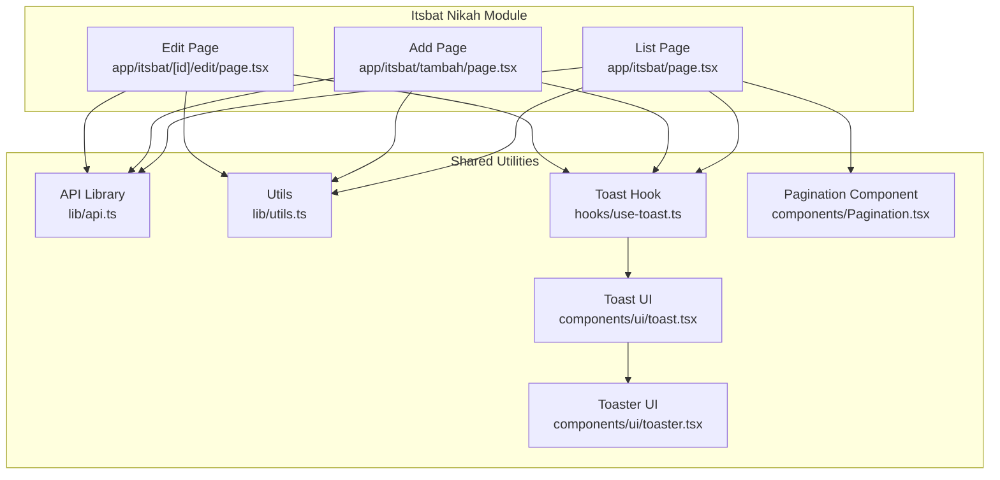
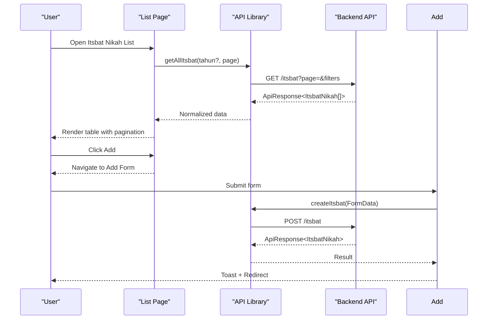
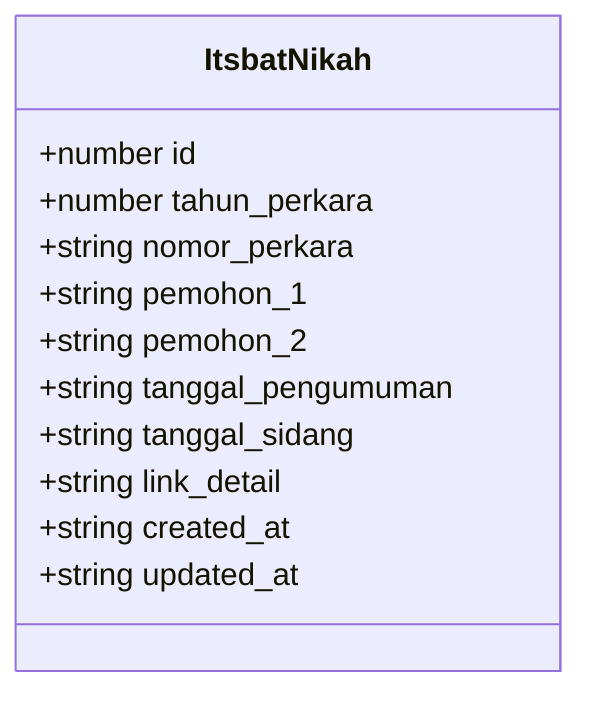
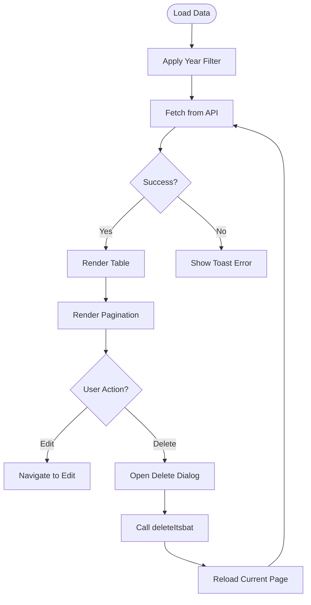
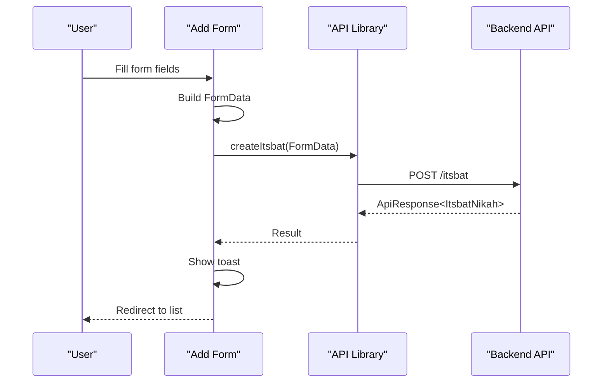
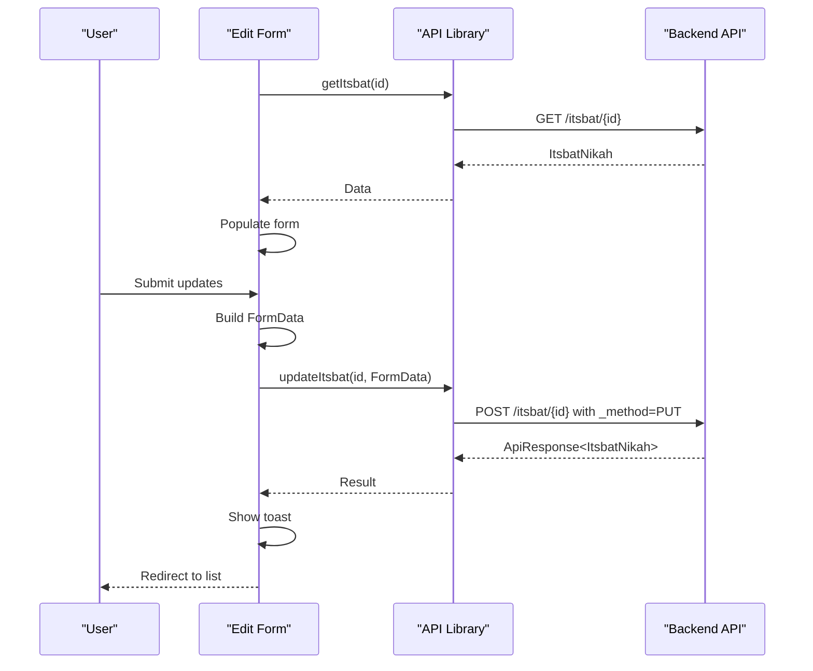
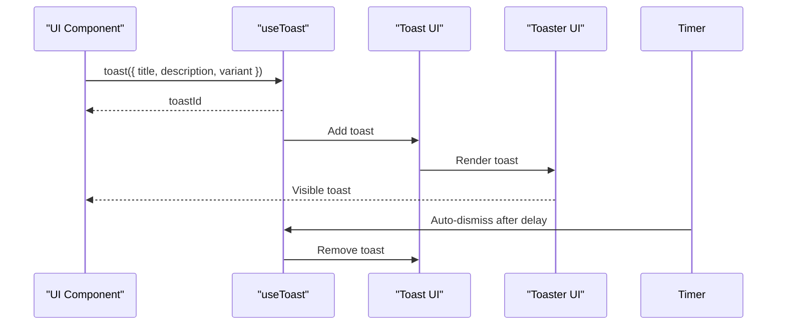
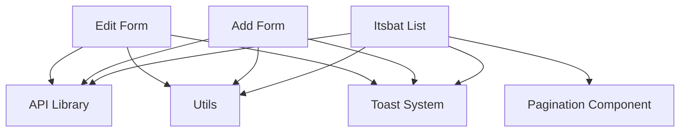

# Itsbat Nikah

<cite>
**Referenced Files in This Document**
- [app/itsbat/page.tsx](file://app/itsbat/page.tsx)
- [app/itsbat/tambah/page.tsx](file://app/itsbat/tambah/page.tsx)
- [app/itsbat/[id]/edit/page.tsx](file://app/itsbat/[id]/edit/page.tsx)
- [lib/api.ts](file://lib/api.ts)
- [lib/utils.ts](file://lib/utils.ts)
- [hooks/use-toast.ts](file://hooks/use-toast.ts)
- [components/ui/toast.tsx](file://components/ui/toast.tsx)
- [components/ui/toaster.tsx](file://components/ui/toaster.tsx)
- [components/Pagination.tsx](file://components/Pagination.tsx)
- [app/page.tsx](file://app/page.tsx)
</cite>

## Table of Contents
1. [Introduction](#introduction)
2. [Project Structure](#project-structure)
3. [Core Components](#core-components)
4. [Architecture Overview](#architecture-overview)
5. [Detailed Component Analysis](#detailed-component-analysis)
6. [Dependency Analysis](#dependency-analysis)
7. [Performance Considerations](#performance-considerations)
8. [Troubleshooting Guide](#troubleshooting-guide)
9. [Conclusion](#conclusion)
10. [Appendices](#appendices)

## Introduction
This document describes the Itsbat Nikah module for managing marriage certificate processing cases. It covers the complete workflow for processing marriage applications and certificate issuance, including the application process, required documentation, scheduling requirements, and integration with civil registration systems. The module provides a user interface for creating, viewing, editing, and deleting marriage case announcements, along with file upload capabilities for supporting documents.

## Project Structure
The Itsbat Nikah module consists of three primary pages:
- List view: displays all marriage case announcements with filtering and pagination
- Add view: creates new marriage case announcements with required fields
- Edit view: updates existing marriage case announcements and replaces uploaded files

**Diagram sources**
- [app/itsbat/page.tsx:1-303](file://app/itsbat/page.tsx#L1-L303)
- [app/itsbat/tambah/page.tsx:1-231](file://app/itsbat/tambah/page.tsx#L1-L231)
- [app/itsbat/[id]/edit/page.tsx:1-289](file://app/itsbat/[id]/edit/page.tsx#L1-L289)
- [lib/api.ts:1-1144](file://lib/api.ts#L1-L1144)
- [lib/utils.ts:1-26](file://lib/utils.ts#L1-L26)
- [hooks/use-toast.ts:1-195](file://hooks/use-toast.ts#L1-L195)
- [components/ui/toast.tsx:1-129](file://components/ui/toast.tsx#L1-L129)
- [components/ui/toaster.tsx:1-35](file://components/ui/toaster.tsx#L1-L35)
- [components/Pagination.tsx:1-153](file://components/Pagination.tsx#L1-L153)

**Section sources**
- [app/itsbat/page.tsx:1-303](file://app/itsbat/page.tsx#L1-L303)
- [app/itsbat/tambah/page.tsx:1-231](file://app/itsbat/tambah/page.tsx#L1-L231)
- [app/itsbat/[id]/edit/page.tsx:1-289](file://app/itsbat/[id]/edit/page.tsx#L1-L289)
- [lib/api.ts:1-1144](file://lib/api.ts#L1-L1144)
- [lib/utils.ts:1-26](file://lib/utils.ts#L1-L26)
- [hooks/use-toast.ts:1-195](file://hooks/use-toast.ts#L1-L195)
- [components/ui/toast.tsx:1-129](file://components/ui/toast.tsx#L1-L129)
- [components/ui/toaster.tsx:1-35](file://components/ui/toaster.tsx#L1-L35)
- [components/Pagination.tsx:1-153](file://components/Pagination.tsx#L1-L153)

## Core Components
- ItsbatNikah interface defines the data model for marriage case announcements, including case year, case number, names of both parties, announcement date, hearing date, and optional file link.
- API functions provide CRUD operations for Itsbat Nikah records, including fetching lists with pagination and filtering by year, retrieving individual records, creating new records with optional file uploads, updating records with file replacement, and deleting records.
- UI components include a list view with filtering and pagination, an add form with required fields, and an edit form with optional file replacement.

**Section sources**
- [lib/api.ts:22-33](file://lib/api.ts#L22-L33)
- [lib/api.ts:155-210](file://lib/api.ts#L155-L210)
- [app/itsbat/page.tsx:27-303](file://app/itsbat/page.tsx#L27-L303)
- [app/itsbat/tambah/page.tsx:17-231](file://app/itsbat/tambah/page.tsx#L17-L231)
- [app/itsbat/[id]/edit/page.tsx:18-289](file://app/itsbat/[id]/edit/page.tsx#L18-L289)

## Architecture Overview
The Itsbat Nikah module follows a client-side React architecture with a shared API abstraction layer. The UI components communicate with the backend via HTTP requests, using a centralized API library that encapsulates request construction, response normalization, and error handling. Notifications are handled through a reusable toast system.

**Diagram sources**
- [app/itsbat/page.tsx:41-68](file://app/itsbat/page.tsx#L41-L68)
- [lib/api.ts:155-181](file://lib/api.ts#L155-L181)
- [app/itsbat/tambah/page.tsx:48-89](file://app/itsbat/tambah/page.tsx#L48-L89)

**Section sources**
- [lib/api.ts:83-91](file://lib/api.ts#L83-L91)
- [lib/api.ts:53-80](file://lib/api.ts#L53-L80)
- [hooks/use-toast.ts:145-172](file://hooks/use-toast.ts#L145-L172)

## Detailed Component Analysis

### Data Model: ItsbatNikah
The ItsbatNikah interface defines the structure for marriage case announcements, including:
- Case identification: year, case number
- Parties: names of both spouses
- Scheduling: announcement date and hearing date
- Document: optional link to uploaded file

**Diagram sources**
- [lib/api.ts:22-33](file://lib/api.ts#L22-L33)

**Section sources**
- [lib/api.ts:22-33](file://lib/api.ts#L22-L33)

### List View: Itsbat List
The list view provides:
- Filtering by year with a dropdown
- Loading skeleton for improved UX
- Pagination controls with ellipsis for large page sets
- Action buttons for edit and delete
- Confirmation dialog for deletion

**Diagram sources**
- [app/itsbat/page.tsx:41-68](file://app/itsbat/page.tsx#L41-L68)
- [app/itsbat/page.tsx:70-89](file://app/itsbat/page.tsx#L70-L89)
- [lib/api.ts:203-210](file://lib/api.ts#L203-L210)

**Section sources**
- [app/itsbat/page.tsx:27-303](file://app/itsbat/page.tsx#L27-L303)
- [lib/utils.ts:8-16](file://lib/utils.ts#L8-L16)
- [components/Pagination.tsx:11-153](file://components/Pagination.tsx#L11-L153)

### Add Form: Create Marriage Case Announcement
The add form collects:
- Case year (dropdown)
- Case number (required)
- Names of both parties (required)
- Announcement date (optional)
- Hearing date (required)
- File upload (optional, PDF/DOC/Image, up to 5MB)

**Diagram sources**
- [app/itsbat/tambah/page.tsx:48-89](file://app/itsbat/tambah/page.tsx#L48-L89)
- [lib/api.ts:172-181](file://lib/api.ts#L172-L181)

**Section sources**
- [app/itsbat/tambah/page.tsx:17-231](file://app/itsbat/tambah/page.tsx#L17-L231)
- [lib/api.ts:172-181](file://lib/api.ts#L172-L181)

### Edit Form: Update Marriage Case Announcement
The edit form allows:
- Updating case year and number
- Updating party names
- Updating dates
- Replacing the uploaded file (optional)
- Viewing current file link

**Diagram sources**
- [app/itsbat/[id]/edit/page.tsx:39-69](file://app/itsbat/[id]/edit/page.tsx#L39-L69)
- [lib/api.ts:183-201](file://lib/api.ts#L183-L201)

**Section sources**
- [app/itsbat/[id]/edit/page.tsx:18-289](file://app/itsbat/[id]/edit/page.tsx#L18-L289)
- [lib/api.ts:183-201](file://lib/api.ts#L183-L201)

### Notification System
The module uses a centralized toast system for user feedback:
- Single toast limit with auto-dismiss
- Destructive variant for errors
- Titles and descriptions for context

**Diagram sources**
- [hooks/use-toast.ts:145-172](file://hooks/use-toast.ts#L145-L172)
- [components/ui/toast.tsx:13-129](file://components/ui/toast.tsx#L13-L129)
- [components/ui/toaster.tsx:13-35](file://components/ui/toaster.tsx#L13-L35)

**Section sources**
- [hooks/use-toast.ts:1-195](file://hooks/use-toast.ts#L1-L195)
- [components/ui/toast.tsx:1-129](file://components/ui/toast.tsx#L1-L129)
- [components/ui/toaster.tsx:1-35](file://components/ui/toaster.tsx#L1-L35)

## Dependency Analysis
The Itsbat Nikah module depends on:
- API library for backend communication
- Utility functions for year options
- Toast system for notifications
- Pagination component for navigation

**Diagram sources**
- [app/itsbat/page.tsx:5-6](file://app/itsbat/page.tsx#L5-L6)
- [app/itsbat/tambah/page.tsx:6-8](file://app/itsbat/tambah/page.tsx#L6-L8)
- [app/itsbat/[id]/edit/page.tsx:6-8](file://app/itsbat/[id]/edit/page.tsx#L6-L8)
- [lib/utils.ts:8-16](file://lib/utils.ts#L8-L16)
- [hooks/use-toast.ts:145-172](file://hooks/use-toast.ts#L145-L172)
- [components/Pagination.tsx:11-153](file://components/Pagination.tsx#L11-L153)

**Section sources**
- [app/itsbat/page.tsx:1-303](file://app/itsbat/page.tsx#L1-L303)
- [app/itsbat/tambah/page.tsx:1-231](file://app/itsbat/tambah/page.tsx#L1-L231)
- [app/itsbat/[id]/edit/page.tsx:1-289](file://app/itsbat/[id]/edit/page.tsx#L1-L289)
- [lib/api.ts:1-1144](file://lib/api.ts#L1-L1144)
- [lib/utils.ts:1-26](file://lib/utils.ts#L1-L26)
- [hooks/use-toast.ts:1-195](file://hooks/use-toast.ts#L1-L195)
- [components/Pagination.tsx:1-153](file://components/Pagination.tsx#L1-L153)

## Performance Considerations
- Pagination: The list view supports pagination to reduce initial load time and improve responsiveness for large datasets.
- Loading states: Skeleton loaders are used during data fetching to provide immediate feedback.
- File uploads: The form supports optional file uploads with size limits to prevent excessive bandwidth usage.
- API caching: Responses are fetched without caching to ensure fresh data, balancing accuracy with performance.

## Troubleshooting Guide
Common issues and resolutions:
- API connectivity errors: Verify environment variables for API URL and key. Check network connectivity and server availability.
- Form submission failures: Review required fields and file constraints. Ensure the file format and size meet requirements.
- Pagination inconsistencies: Confirm that the backend returns correct pagination metadata (current_page, last_page, total).
- Toast notifications not appearing: Ensure the Toaster component is rendered in the application shell.

**Section sources**
- [lib/api.ts:1-4](file://lib/api.ts#L1-L4)
- [app/itsbat/tambah/page.tsx:60-86](file://app/itsbat/tambah/page.tsx#L60-L86)
- [app/itsbat/page.tsx:56-63](file://app/itsbat/page.tsx#L56-L63)
- [components/ui/toaster.tsx:13-35](file://components/ui/toaster.tsx#L13-L35)

## Conclusion
The Itsbat Nikah module provides a comprehensive solution for managing marriage certificate processing cases. It offers a clean, responsive interface for creating, viewing, editing, and deleting case announcements, with integrated file upload support and robust notification feedback. The modular architecture ensures maintainability and scalability for future enhancements.

## Appendices

### Form Fields and Validation Rules
- Case Year: Required, dropdown from current year backward
- Case Number: Required, formatted as case number
- Party Names: Required, full names of both parties
- Announcement Date: Optional, date picker
- Hearing Date: Required, date picker
- File Upload: Optional, PDF/DOC/Image, up to 5MB

**Section sources**
- [app/itsbat/tambah/page.tsx:112-192](file://app/itsbat/tambah/page.tsx#L112-L192)
- [app/itsbat/[id]/edit/page.tsx:158-236](file://app/itsbat/[id]/edit/page.tsx#L158-L236)

### Application Status Tracking
- The module does not define explicit application statuses beyond the presence of announcement and hearing dates.
- Future enhancements could include status enums (e.g., pending, scheduled, completed) mapped to UI indicators.

### Communication Protocols
- File uploads are sent as multipart/form-data to the backend endpoint.
- API requests include an API key header for authentication.
- Responses are normalized to a consistent structure across endpoints.

**Section sources**
- [lib/api.ts:83-91](file://lib/api.ts#L83-L91)
- [lib/api.ts:172-181](file://lib/api.ts#L172-L181)
- [lib/api.ts:183-201](file://lib/api.ts#L183-L201)

### Integration with Civil Registration Systems
- The module exposes a standardized API for external systems to integrate case data.
- Case numbering follows a standard format suitable for civil registration systems.

**Section sources**
- [lib/api.ts:155-210](file://lib/api.ts#L155-L210)

### Reporting Mechanisms
- The list view supports filtering by year, enabling basic reporting by calendar year.
- Pagination metadata (current_page, last_page, total) supports exportable reporting.

**Section sources**
- [app/itsbat/page.tsx:34-52](file://app/itsbat/page.tsx#L34-L52)
- [lib/api.ts:155-163](file://lib/api.ts#L155-L163)

### Common Use Cases
- Adding a new marriage case announcement with required fields and optional file upload
- Editing an existing case to update party names or dates
- Deleting a case after finalization
- Filtering cases by year for annual reporting

**Section sources**
- [app/itsbat/tambah/page.tsx:48-89](file://app/itsbat/tambah/page.tsx#L48-L89)
- [app/itsbat/[id]/edit/page.tsx:86-127](file://app/itsbat/[id]/edit/page.tsx#L86-L127)
- [app/itsbat/page.tsx:70-89](file://app/itsbat/page.tsx#L70-L89)