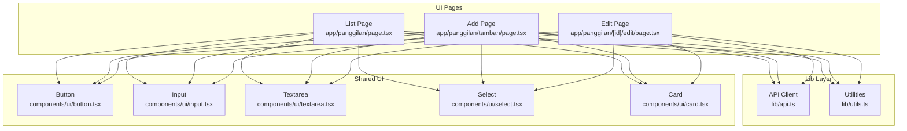
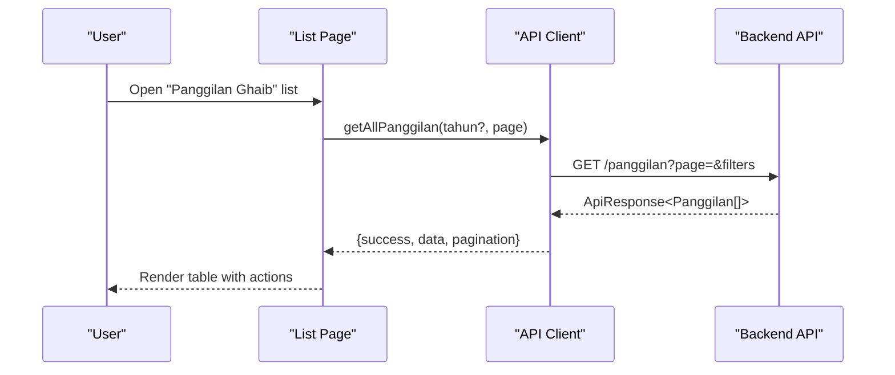
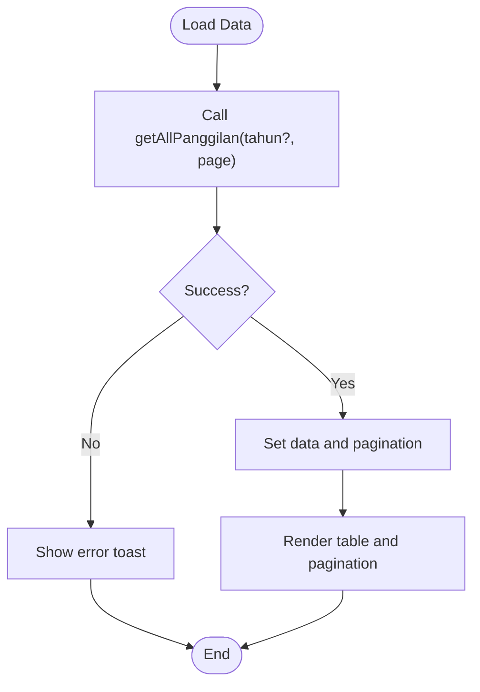
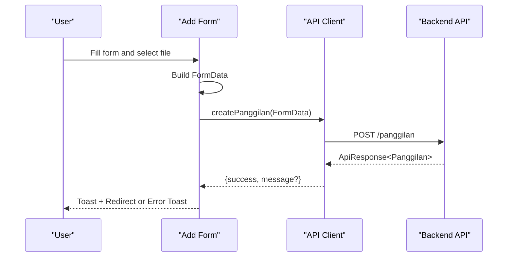
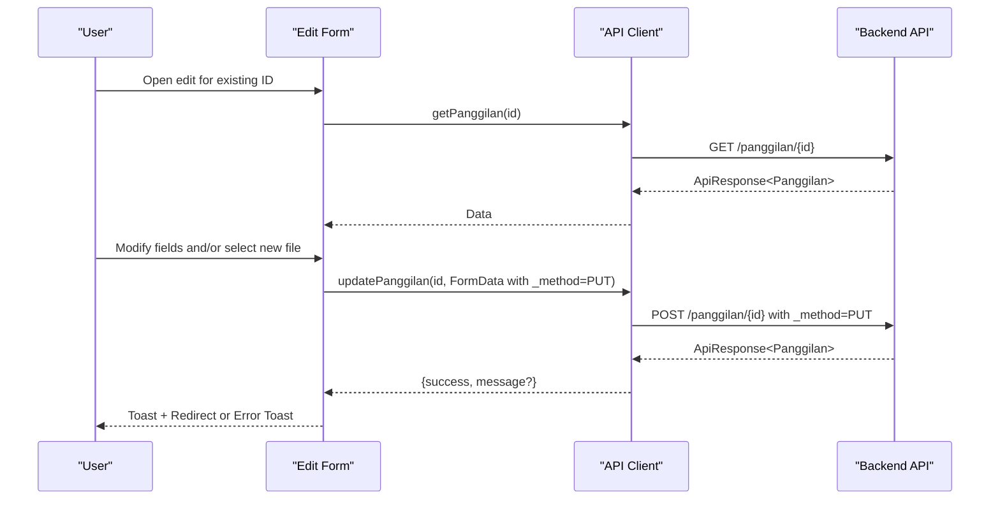
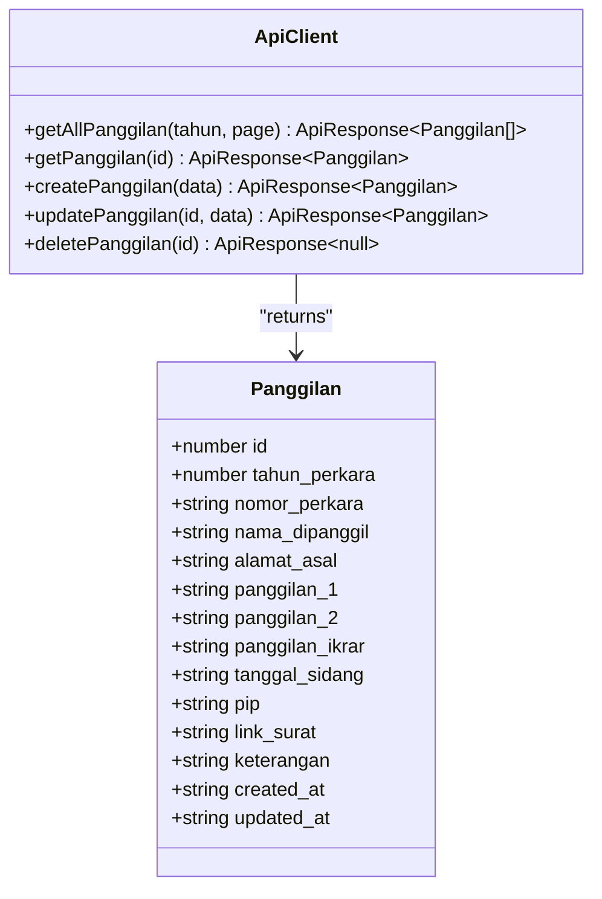
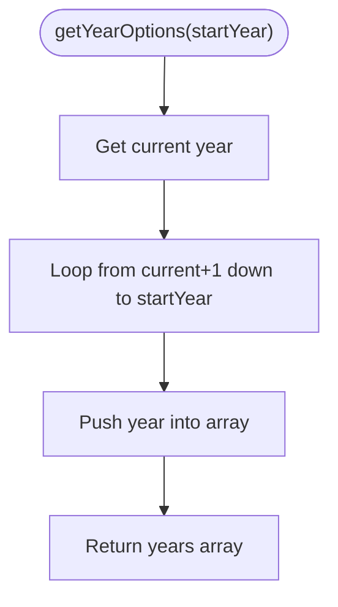
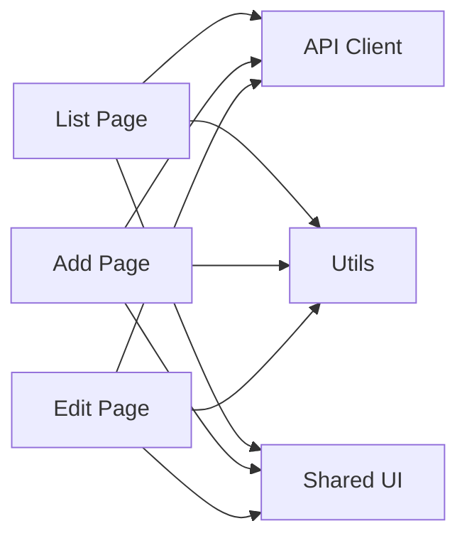

# Panggilan Ghaib

<cite>
**Referenced Files in This Document**
- [app/panggilan/page.tsx](file://app/panggilan/page.tsx)
- [app/panggilan/tambah/page.tsx](file://app/panggilan/tambah/page.tsx)
- [app/panggilan/[id]/edit/page.tsx](file://app/panggilan/[id]/edit/page.tsx)
- [lib/api.ts](file://lib/api.ts)
- [lib/utils.ts](file://lib/utils.ts)
- [components/ui/button.tsx](file://components/ui/button.tsx)
- [components/ui/input.tsx](file://components/ui/input.tsx)
- [components/ui/textarea.tsx](file://components/ui/textarea.tsx)
- [components/ui/select.tsx](file://components/ui/select.tsx)
- [components/ui/card.tsx](file://components/ui/card.tsx)
- [app/panggilan-ecourt/page.tsx](file://app/panggilan-ecourt/page.tsx)
</cite>

## Table of Contents
1. [Introduction](#introduction)
2. [Project Structure](#project-structure)
3. [Core Components](#core-components)
4. [Architecture Overview](#architecture-overview)
5. [Detailed Component Analysis](#detailed-component-analysis)
6. [Dependency Analysis](#dependency-analysis)
7. [Performance Considerations](#performance-considerations)
8. [Troubleshooting Guide](#troubleshooting-guide)
9. [Conclusion](#conclusion)
10. [Appendices](#appendices)

## Introduction
This document describes the Panggilan Ghaib module for managing absent party litigation processes. It covers the end-to-end workflow for creating, viewing, editing, and deleting absent-party cases, including required fields, validation patterns, scheduling requirements, document upload capabilities, and integration with backend APIs. It also outlines case status tracking indicators, communication protocols via uploaded documents, and reporting mechanisms through paginated lists and filters.

## Project Structure
The module consists of three primary Next.js pages under the app/panggilan route:
- List view: displays paginated and filtered absent-party cases
- Add view: creates new absent-party cases with required and optional fields
- Edit view: updates existing absent-party cases and optionally replaces uploaded documents

Supporting infrastructure:
- API client functions for CRUD operations and pagination
- Utility functions for year options and currency formatting
- Shared UI components for forms, tables, selects, cards, and buttons

**Diagram sources**
- [app/panggilan/page.tsx:28-309](file://app/panggilan/page.tsx#L28-L309)
- [app/panggilan/tambah/page.tsx:18-281](file://app/panggilan/tambah/page.tsx#L18-L281)
- [app/panggilan/[id]/edit/page.tsx](file://app/panggilan/[id]/edit/page.tsx#L19-L338)
- [lib/api.ts:97-149](file://lib/api.ts#L97-L149)
- [lib/utils.ts:8-16](file://lib/utils.ts#L8-L16)
- [components/ui/button.tsx:43-57](file://components/ui/button.tsx#L43-L57)
- [components/ui/input.tsx:5-18](file://components/ui/input.tsx#L5-L18)
- [components/ui/textarea.tsx:5-18](file://components/ui/textarea.tsx#L5-L18)
- [components/ui/select.tsx:15-33](file://components/ui/select.tsx#L15-L33)
- [components/ui/card.tsx:5-17](file://components/ui/card.tsx#L5-L17)

**Section sources**
- [app/panggilan/page.tsx:28-309](file://app/panggilan/page.tsx#L28-L309)
- [app/panggilan/tambah/page.tsx:18-281](file://app/panggilan/tambah/page.tsx#L18-L281)
- [app/panggilan/[id]/edit/page.tsx](file://app/panggilan/[id]/edit/page.tsx#L19-L338)
- [lib/api.ts:97-149](file://lib/api.ts#L97-L149)
- [lib/utils.ts:8-16](file://lib/utils.ts#L8-L16)

## Core Components
- Absent Party Case Model: The data model defines fields for case metadata, identity, scheduling, and document links.
- API Functions: Fetch all cases, fetch single case, create, update, delete, with support for FormData for file uploads.
- UI Forms: Year selection, required fields, date pickers, text areas, and file upload controls.
- List View: Filtering by year, pagination, and action buttons for edit/delete.
- Utilities: Year options generator for dynamic year selection.

Key data model fields:
- Metadata: id, created_at, updated_at
- Case Info: tahun_perkara, nomor_perkara
- Identity: nama_dipanggil, alamat_asal
- Scheduling: panggilan_1, panggilan_2, panggilan_ikrar, tanggal_sidang
- Administrative: pip, link_surat, keterangan

Validation and data entry patterns:
- Required fields: tahun_perkara, nomor_perkara, nama_dipanggil
- Optional fields: alamat_asal, scheduling dates, pip, link_surat, keterangan
- File upload: supports PDF, DOC, JPG with size constraints (via server-side validation)

Case status tracking:
- Present in list: case existence and basic details
- Document availability: link_surat indicates presence of uploaded document
- Scheduling visibility: dates shown for each call stage

Communication protocols:
- Uploaded documents serve as official communication artifacts
- link_surat enables external access to the document

Integration points:
- Backend API endpoints for CRUD operations
- Pagination and filtering via query parameters
- API key header injection for secure requests

**Section sources**
- [lib/api.ts:5-20](file://lib/api.ts#L5-L20)
- [lib/api.ts:97-149](file://lib/api.ts#L97-L149)
- [app/panggilan/tambah/page.tsx:23-35](file://app/panggilan/tambah/page.tsx#L23-L35)
- [app/panggilan/page.tsx:182-222](file://app/panggilan/page.tsx#L182-L222)
- [app/panggilan/[id]/edit/page.tsx](file://app/panggilan/[id]/edit/page.tsx#L28-L42)

## Architecture Overview
The module follows a layered architecture:
- UI Layer: Next.js pages with shared UI components
- Domain Layer: Form handlers and state management
- Integration Layer: API client functions with standardized response normalization
- Utilities: Year options and formatting helpers

**Diagram sources**
- [app/panggilan/page.tsx:42-65](file://app/panggilan/page.tsx#L42-L65)
- [lib/api.ts:97-104](file://lib/api.ts#L97-L104)

**Section sources**
- [app/panggilan/page.tsx:42-65](file://app/panggilan/page.tsx#L42-L65)
- [lib/api.ts:97-104](file://lib/api.ts#L97-L104)

## Detailed Component Analysis

### List View: app/panggilan/page.tsx
Responsibilities:
- Load and display absent-party cases with pagination
- Filter by year using a dropdown
- Trigger refresh and navigate to add page
- Provide edit and delete actions per row
- Show loading skeletons and empty state

Key behaviors:
- Loads data via getAllPanggilan with optional year and page parameters
- Formats dates for display
- Renders pagination with ellipsis for large page sets
- Uses toast notifications for errors and success messages

**Diagram sources**
- [app/panggilan/page.tsx:42-65](file://app/panggilan/page.tsx#L42-L65)
- [lib/api.ts:97-104](file://lib/api.ts#L97-L104)

**Section sources**
- [app/panggilan/page.tsx:28-309](file://app/panggilan/page.tsx#L28-L309)

### Add View: app/panggilan/tambah/page.tsx
Responsibilities:
- Capture required and optional fields for a new absent-party case
- Build FormData payload for submission
- Handle file upload for the official notice document
- Submit via createPanggilan and redirect on success

Form fields and patterns:
- Year selection: dynamic options generated by getYearOptions
- Required: tahun_perkara, nomor_perkara, nama_dipanggil
- Optional: alamat_asal, scheduling dates, pip, keterangan
- File upload: PDF, DOC, JPG with accept attributes

Validation rules:
- Required fields enforced by form semantics
- File type constraints via accept attribute
- Submission guarded by loading state

**Diagram sources**
- [app/panggilan/tambah/page.tsx:53-98](file://app/panggilan/tambah/page.tsx#L53-L98)
- [lib/api.ts:115-123](file://lib/api.ts#L115-L123)

**Section sources**
- [app/panggilan/tambah/page.tsx:18-281](file://app/panggilan/tambah/page.tsx#L18-L281)
- [lib/utils.ts:8-16](file://lib/utils.ts#L8-L16)

### Edit View: app/panggilan/[id]/edit/page.tsx
Responsibilities:
- Load existing case data by ID
- Allow updating all fields and replacing the uploaded document
- Handle loading states and skeleton UI during load
- Submit via updatePanggilan with proper method emulation for file uploads

Document replacement protocol:
- If a new file is selected, it is appended to FormData
- Existing link_surat is displayed with a preview link
- Update uses POST with _method=PUT for FormData payloads

**Diagram sources**
- [app/panggilan/[id]/edit/page.tsx](file://app/panggilan/[id]/edit/page.tsx#L44-L70)
- [lib/api.ts:126-139](file://lib/api.ts#L126-L139)

**Section sources**
- [app/panggilan/[id]/edit/page.tsx](file://app/panggilan/[id]/edit/page.tsx#L19-L338)
- [lib/api.ts:126-139](file://lib/api.ts#L126-L139)

### API Client: lib/api.ts
Responsibilities:
- Define the Panggilan interface
- Provide getAllPanggilan, getPanggilan, createPanggilan, updatePanggilan, deletePanggilan
- Normalize responses across different API styles
- Inject X-API-Key header and handle FormData for file uploads

Patterns:
- Year filtering via query parameter
- Pagination via page parameter
- Method emulation for file uploads (POST with _method=PUT)

**Diagram sources**
- [lib/api.ts:5-20](file://lib/api.ts#L5-L20)
- [lib/api.ts:97-149](file://lib/api.ts#L97-L149)

**Section sources**
- [lib/api.ts:5-20](file://lib/api.ts#L5-L20)
- [lib/api.ts:97-149](file://lib/api.ts#L97-L149)

### Utilities: lib/utils.ts
Responsibilities:
- Generate year options for dropdowns
- Format currency (shared utility)

**Diagram sources**
- [lib/utils.ts:8-16](file://lib/utils.ts#L8-L16)

**Section sources**
- [lib/utils.ts:8-16](file://lib/utils.ts#L8-L16)

### Related Module: app/panggilan-ecourt/page.tsx
Context:
- A separate module exists for e-court absent-party listings with similar UI patterns and API integration
- Useful for cross-module understanding and potential consolidation

**Section sources**
- [app/panggilan-ecourt/page.tsx:28-286](file://app/panggilan-ecourt/page.tsx#L28-L286)

## Dependency Analysis
- UI pages depend on:
  - API client for network operations
  - Utilities for year options
  - Shared UI components for consistent UX
- API client depends on:
  - Environment variables for base URL and API key
  - Standardized response normalization
- No circular dependencies observed among pages and lib modules

**Diagram sources**
- [app/panggilan/page.tsx:5-6](file://app/panggilan/page.tsx#L5-L6)
- [app/panggilan/tambah/page.tsx](file://app/panggilan/tambah/page.tsx#L6)
- [app/panggilan/[id]/edit/page.tsx](file://app/panggilan/[id]/edit/page.tsx#L6)
- [lib/api.ts:2-4](file://lib/api.ts#L2-L4)
- [lib/utils.ts:8-16](file://lib/utils.ts#L8-L16)

**Section sources**
- [app/panggilan/page.tsx:5-6](file://app/panggilan/page.tsx#L5-L6)
- [app/panggilan/tambah/page.tsx](file://app/panggilan/tambah/page.tsx#L6)
- [app/panggilan/[id]/edit/page.tsx](file://app/panggilan/[id]/edit/page.tsx#L6)
- [lib/api.ts:2-4](file://lib/api.ts#L2-L4)

## Performance Considerations
- Pagination: Use page and year filters to limit dataset size on the server
- Caching: Requests bypass caching via cache: 'no-store' to ensure fresh data
- File uploads: Keep file sizes reasonable; server enforces limits
- Rendering: Skeleton loaders improve perceived performance during data fetches

## Troubleshooting Guide
Common issues and resolutions:
- API connectivity failures:
  - Verify NEXT_PUBLIC_API_URL and NEXT_PUBLIC_API_KEY environment variables
  - Confirm backend service availability
- Empty or stale data:
  - Use the refresh button to reload current page
  - Ensure year filter is appropriate
- Upload errors:
  - Confirm file type and size constraints
  - Retry after correcting file format
- Update/delete failures:
  - Check toast feedback for specific messages
  - Re-attempt operation after resolving validation errors

**Section sources**
- [app/panggilan/page.tsx:57-63](file://app/panggilan/page.tsx#L57-L63)
- [app/panggilan/tambah/page.tsx:89-95](file://app/panggilan/tambah/page.tsx#L89-L95)
- [app/panggilan/[id]/edit/page.tsx](file://app/panggilan/[id]/edit/page.tsx#L123-L129)

## Conclusion
The Panggilan Ghaib module provides a complete, user-friendly solution for managing absent-party litigation cases. It integrates seamlessly with backend APIs, offers robust form handling with validation, supports document uploads, and presents data through paginated, filterable views. The architecture emphasizes separation of concerns, reusable UI components, and clear data flows, enabling efficient maintenance and future enhancements.

## Appendices

### Data Model Reference
- Required fields: tahun_perkara, nomor_perkara, nama_dipanggil
- Optional fields: alamat_asal, panggilan_1, panggilan_2, panggilan_ikrar, tanggal_sidang, pip, link_surat, keterangan

**Section sources**
- [lib/api.ts:5-20](file://lib/api.ts#L5-L20)
- [app/panggilan/tambah/page.tsx:23-35](file://app/panggilan/tambah/page.tsx#L23-L35)

### Example Workflows

#### Create a New Absent-Party Case
- Navigate to Add page
- Fill required fields and optional details
- Attach official notice document if available
- Submit form; observe success toast and redirection

**Section sources**
- [app/panggilan/tambah/page.tsx:53-98](file://app/panggilan/tambah/page.tsx#L53-L98)

#### Update an Existing Case and Replace Document
- Open Edit page for the case
- Modify fields as needed
- Optionally select a new file to replace the current document
- Submit; confirm success toast and return to list

**Section sources**
- [app/panggilan/[id]/edit/page.tsx](file://app/panggilan/[id]/edit/page.tsx#L87-L132)

#### Filter and Paginate Cases by Year
- Use the year dropdown to filter
- Navigate pages using pagination controls
- Refresh data with the refresh button

**Section sources**
- [app/panggilan/page.tsx:161-174](file://app/panggilan/page.tsx#L161-L174)
- [app/panggilan/page.tsx:252-274](file://app/panggilan/page.tsx#L252-L274)