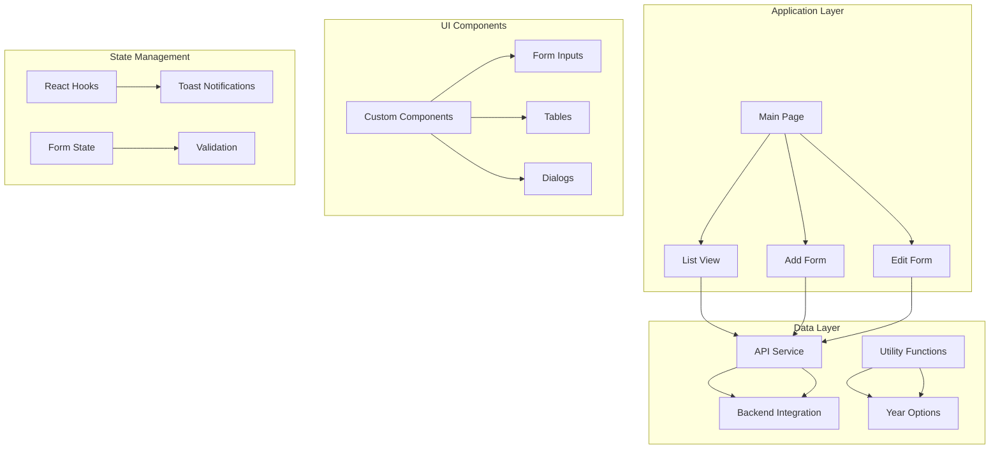
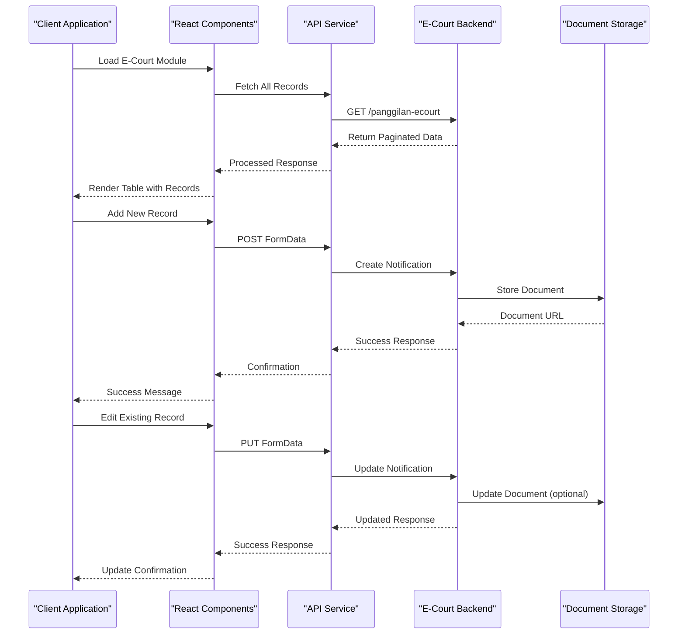
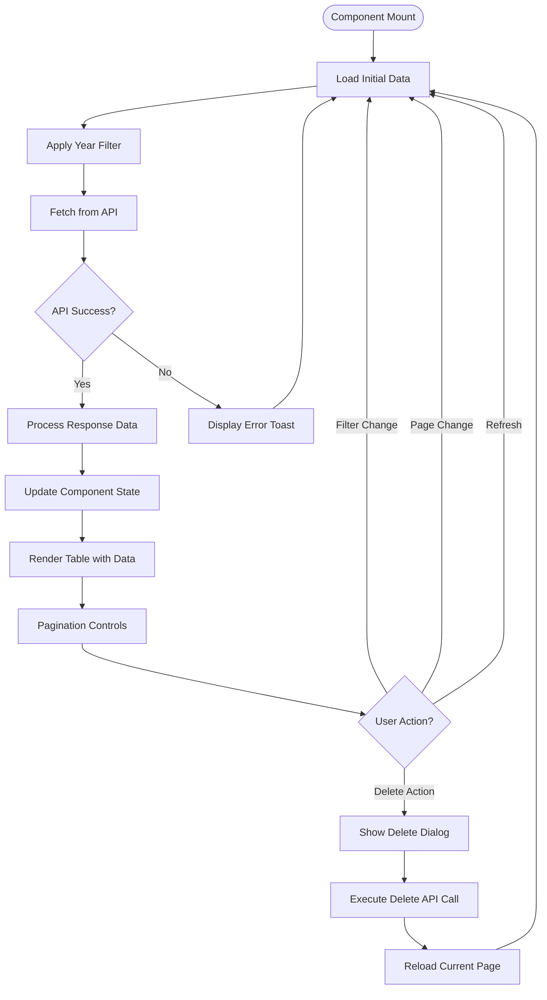
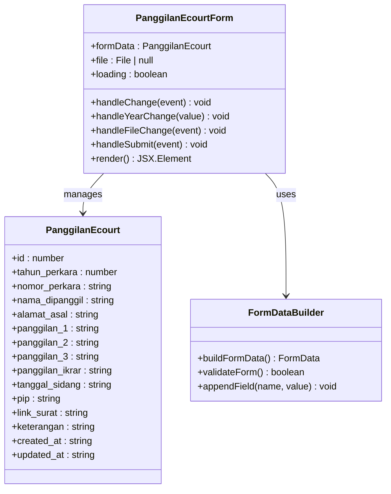
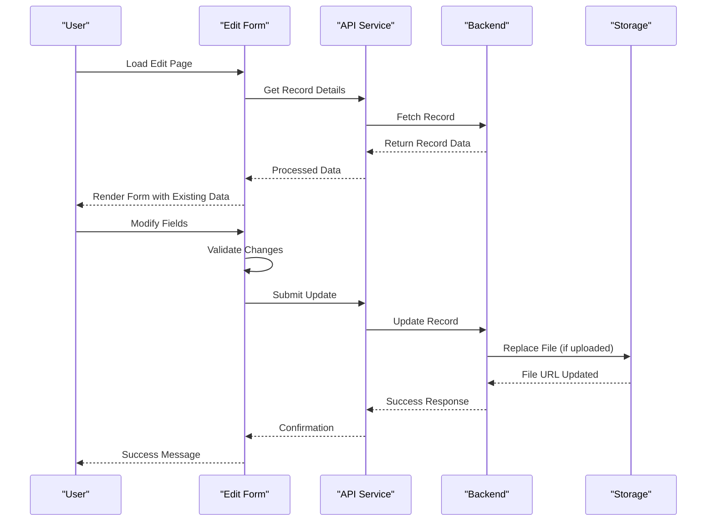
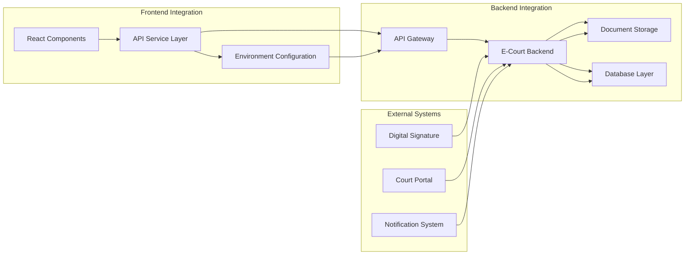
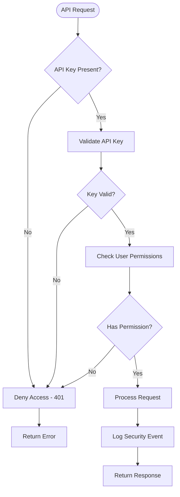
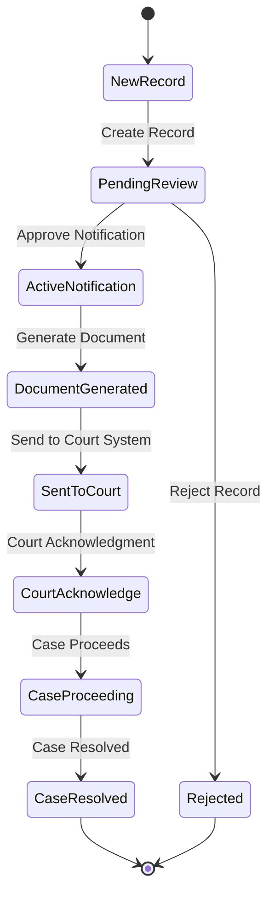
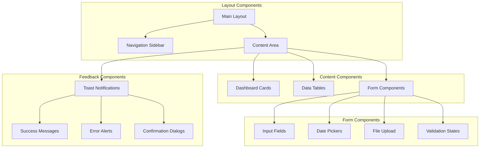
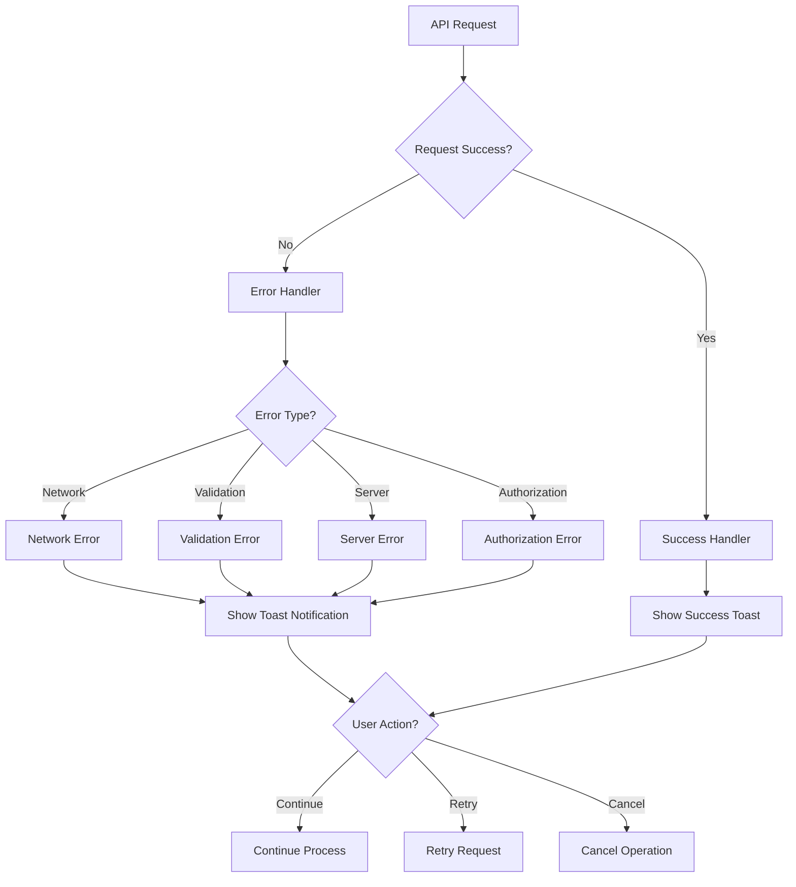

# Panggilan e-Court

<cite>
**Referenced Files in This Document**
- [page.tsx](file://app/panggilan-ecourt/page.tsx)
- [tambah/page.tsx](file://app/panggilan-ecourt/tambah/page.tsx)
- [edit/page.tsx](file://app/panggilan-ecourt/[id]/edit/page.tsx)
- [api.ts](file://lib/api.ts)
- [utils.ts](file://lib/utils.ts)
- [use-toast.ts](file://hooks/use-toast.ts)
- [package.json](file://package.json)
- [components.json](file://components.json)
</cite>

## Table of Contents
1. [Introduction](#introduction)
2. [Project Structure](#project-structure)
3. [Core Components](#core-components)
4. [Architecture Overview](#architecture-overview)
5. [Detailed Component Analysis](#detailed-component-analysis)
6. [Data Model and Validation](#data-model-and-validation)
7. [Integration with e-Court Systems](#integration-with-e-court-systems)
8. [Security Protocols](#security-protocols)
9. [Workflow Management](#workflow-management)
10. [User Interface Implementation](#user-interface-implementation)
11. [Error Handling and Notifications](#error-handling-and-notifications)
12. [Performance Considerations](#performance-considerations)
13. [Troubleshooting Guide](#troubleshooting-guide)
14. [Conclusion](#conclusion)

## Introduction

The Panggilan e-Court module is a comprehensive digital solution for managing electronic court notifications and digital case management within Indonesian judicial systems. This module enables legal practitioners, court administrators, and government officials to efficiently process digital court notifications, manage electronic case workflows, and maintain comprehensive records of court proceedings.

The system integrates seamlessly with e-court infrastructure to provide automated notification processes, digital case tracking, and streamlined workflow management for all court-related communications and documentation.

## Project Structure

The Panggilan e-Court module follows a structured Next.js application architecture with clear separation of concerns:

**Diagram sources**
- [page.tsx:1-287](file://app/panggilan-ecourt/page.tsx#L1-L287)
- [api.ts:212-286](file://lib/api.ts#L212-L286)

**Section sources**
- [page.tsx:1-287](file://app/panggilan-ecourt/page.tsx#L1-L287)
- [api.ts:212-286](file://lib/api.ts#L212-L286)

## Core Components

The module consists of three primary components that handle different aspects of e-court management:

### 1. List Management Component
The main dashboard component that displays all e-court notifications in a paginated table format with filtering capabilities.

### 2. Creation Component
A comprehensive form-based interface for adding new e-court notifications with extensive validation and file upload capabilities.

### 3. Modification Component
An edit interface that allows users to update existing e-court records while maintaining data integrity and optional file replacement.

**Section sources**
- [page.tsx:28-287](file://app/panggilan-ecourt/page.tsx#L28-L287)
- [tambah/page.tsx:18-297](file://app/panggilan-ecourt/tambah/page.tsx#L18-L297)
- [edit/page.tsx:18-346](file://app/panggilan-ecourt/[id]/edit/page.tsx#L18-L346)

## Architecture Overview

The e-court module follows a client-server architecture with clear API boundaries and robust error handling:

**Diagram sources**
- [api.ts:234-286](file://lib/api.ts#L234-L286)
- [tambah/page.tsx:54-100](file://app/panggilan-ecourt/tambah/page.tsx#L54-L100)
- [edit/page.tsx:91-137](file://app/panggilan-ecourt/[id]/edit/page.tsx#L91-L137)

## Detailed Component Analysis

### List Management Component

The main list component provides comprehensive e-court record management with advanced filtering and pagination:

**Diagram sources**
- [page.tsx:41-68](file://app/panggilan-ecourt/page.tsx#L41-L68)
- [page.tsx:70-88](file://app/panggilan-ecourt/page.tsx#L70-L88)

#### Key Features:
- **Dynamic Filtering**: Year-based filtering with automatic refresh
- **Pagination System**: Efficient loading of large datasets
- **Bulk Operations**: Delete confirmation dialogs
- **File Download**: Direct PDF link access
- **Real-time Updates**: Automatic refresh capabilities

**Section sources**
- [page.tsx:28-287](file://app/panggilan-ecourt/page.tsx#L28-L287)

### Creation Component

The add form component provides comprehensive data entry with extensive validation and file upload capabilities:

**Diagram sources**
- [tambah/page.tsx:23-42](file://app/panggilan-ecourt/tambah/page.tsx#L23-L42)
- [api.ts:216-232](file://lib/api.ts#L216-L232)

#### Form Sections:
1. **Case Information**: Year and case number validation
2. **Party Identity**: Complete personal information capture
3. **Court Schedule**: Multiple notification dates and hearing date
4. **Documentation**: File upload with format restrictions
5. **Additional Information**: Notes and remarks field

**Section sources**
- [tambah/page.tsx:18-297](file://app/panggilan-ecourt/tambah/page.tsx#L18-L297)

### Modification Component

The edit component provides comprehensive update capabilities with optional file replacement:

**Diagram sources**
- [edit/page.tsx:45-73](file://app/panggilan-ecourt/[id]/edit/page.tsx#L45-L73)
- [edit/page.tsx:91-137](file://app/panggilan-ecourt/[id]/edit/page.tsx#L91-L137)

**Section sources**
- [edit/page.tsx:18-346](file://app/panggilan-ecourt/[id]/edit/page.tsx#L18-L346)

## Data Model and Validation

The e-court system implements a comprehensive data model designed specifically for digital court notifications:

### Core Data Structure

| Field | Type | Required | Description |
|-------|------|----------|-------------|
| `id` | number | No | Unique identifier for the record |
| `tahun_perkara` | number | Yes | Case year (validated against available years) |
| `nomor_perkara` | string | Yes | Court case number (format validation) |
| `nama_dipanggil` | string | Yes | Defendant's full name |
| `alamat_asal` | string | No | Original address |
| `panggilan_1` | string | No | First notification date |
| `panggilan_2` | string | No | Second notification date |
| `panggilan_3` | string | No | Third notification date |
| `panggilan_ikrar` | string | No | Oath notification date |
| `tanggal_sidang` | string | No | Hearing date |
| `pip` | string | No | Court Information Officer |
| `link_surat` | string | No | Document file URL |
| `keterangan` | string | No | Additional notes |

### Validation Rules

1. **Required Fields**: Year, Case Number, and Defendant Name are mandatory
2. **Date Validation**: All date fields follow Indonesian date format (YYYY-MM-DD)
3. **File Upload**: Supports PDF, DOC, JPG with 5MB size limit
4. **Format Validation**: Case numbers follow standard Indonesian court format
5. **Range Validation**: Year selection limited to available historical range

**Section sources**
- [api.ts:216-232](file://lib/api.ts#L216-L232)
- [tambah/page.tsx:142-151](file://app/panggilan-ecourt/tambah/page.tsx#L142-L151)

## Integration with e-Court Systems

The module integrates with e-court infrastructure through a well-defined API layer:

### API Integration Points

**Diagram sources**
- [api.ts:1-51](file://lib/api.ts#L1-L51)
- [api.ts:234-286](file://lib/api.ts#L234-L286)

### API Endpoints

| Endpoint | Method | Purpose |
|----------|--------|---------|
| `/panggilan-ecourt` | GET | Retrieve paginated list of e-court notifications |
| `/panggilan-ecourt` | POST | Create new e-court notification |
| `/panggilan-ecourt/{id}` | GET | Retrieve specific e-court notification |
| `/panggilan-ecourt/{id}` | PUT | Update existing e-court notification |
| `/panggilan-ecourt/{id}` | DELETE | Remove e-court notification |

### Environment Configuration

The system supports configurable API endpoints and security keys:

- **API_URL**: Base URL for e-court backend services
- **API_KEY**: Authentication key for secure API access
- **Cache Control**: No-cache policy for real-time data updates

**Section sources**
- [api.ts:1-51](file://lib/api.ts#L1-L51)
- [api.ts:234-286](file://lib/api.ts#L234-L286)

## Security Protocols

The e-court module implements comprehensive security measures for protecting sensitive legal information:

### Authentication and Authorization

**Diagram sources**
- [api.ts:82-91](file://lib/api.ts#L82-L91)

### Data Protection Measures

1. **API Key Authentication**: All requests require valid API key
2. **File Upload Security**: Restricted file formats and size limits
3. **Input Validation**: Comprehensive server-side validation
4. **Audit Logging**: Complete request/response logging
5. **Secure Storage**: Encrypted document storage

### Compliance Considerations

- **Data Encryption**: Documents stored with encryption
- **Access Control**: Role-based permissions
- **Audit Trails**: Complete activity tracking
- **Privacy Protection**: Sensitive data handling according to legal requirements

**Section sources**
- [api.ts:82-91](file://lib/api.ts#L82-L91)

## Workflow Management

The e-court module automates the complete workflow for digital court notifications:

### Automated Workflow Triggers

### Notification Automation

1. **Automatic Generation**: PDF documents generated from form data
2. **System Integration**: Direct integration with e-court portal
3. **Status Tracking**: Real-time status updates
4. **Reminders**: Automated follow-up notifications
5. **Archival**: Automatic document archiving

### Digital Case Tracking

- **Progress Monitoring**: Complete case lifecycle tracking
- **Document Management**: Centralized document storage
- **Communication Logs**: Complete communication history
- **Decision Tracking**: Important case decisions and outcomes

## User Interface Implementation

The e-court module provides an intuitive, responsive user interface built with modern React patterns:

### Component Architecture

**Diagram sources**
- [page.tsx:10-26](file://app/panggilan-ecourt/page.tsx#L10-L26)
- [tambah/page.tsx:10-16](file://app/panggilan-ecourt/tambah/page.tsx#L10-L16)

### Responsive Design Features

1. **Mobile-First Approach**: Optimized for mobile and tablet devices
2. **Accessibility**: Full screen reader support and keyboard navigation
3. **Performance**: Lazy loading for large datasets
4. **Consistency**: Unified design system across all components
5. **Internationalization**: Indonesian language support

### User Experience Enhancements

- **Loading States**: Skeleton screens for improved perceived performance
- **Real-time Updates**: Automatic data refresh capabilities
- **Bulk Operations**: Multi-record selection and actions
- **Export Capabilities**: Data export in multiple formats
- **Search Functionality**: Advanced filtering and search options

**Section sources**
- [page.tsx:10-26](file://app/panggilan-ecourt/page.tsx#L10-L26)
- [tambah/page.tsx:10-16](file://app/panggilan-ecourt/tambah/page.tsx#L10-L16)

## Error Handling and Notifications

The e-court module implements comprehensive error handling and user feedback mechanisms:

### Error Management System

**Diagram sources**
- [page.tsx:56-63](file://app/panggilan-ecourt/page.tsx#L56-L63)
- [use-toast.ts:145-172](file://hooks/use-toast.ts#L145-L172)

### Notification System

The module uses a sophisticated toast notification system with the following features:

1. **Success Notifications**: Green confirmation messages
2. **Error Notifications**: Red error alerts with actionable feedback
3. **Warning Notifications**: Yellow caution messages
4. **Info Notifications**: Blue informational messages
5. **Auto-dismiss**: Configurable auto-dismiss timing

### User Feedback Patterns

- **Form Validation**: Real-time field validation with immediate feedback
- **Loading States**: Progress indicators during long-running operations
- **Confirmation Dialogs**: Critical operation confirmation
- **Batch Operations**: Progress tracking for bulk actions
- **Import/Export**: Status updates for data operations

**Section sources**
- [page.tsx:56-63](file://app/panggilan-ecourt/page.tsx#L56-L63)
- [use-toast.ts:145-172](file://hooks/use-toast.ts#L145-L172)

## Performance Considerations

The e-court module is optimized for performance and scalability:

### Frontend Performance

1. **Code Splitting**: Dynamic imports for lazy loading
2. **Component Memoization**: React.memo for expensive components
3. **Virtual Scrolling**: Efficient rendering of large datasets
4. **Image Optimization**: Automatic image compression and lazy loading
5. **State Management**: Efficient state updates with minimal re-renders

### Backend Performance

1. **API Caching**: Strategic caching for frequently accessed data
2. **Database Indexing**: Optimized database queries
3. **File Storage**: CDN integration for document delivery
4. **Connection Pooling**: Efficient database connection management
5. **Background Processing**: Asynchronous operations for heavy tasks

### Scalability Features

- **Horizontal Scaling**: Stateless components for easy scaling
- **Load Balancing**: Distributed architecture support
- **Database Sharding**: Potential for future database partitioning
- **CDN Integration**: Global content delivery network
- **Monitoring**: Comprehensive performance monitoring

## Troubleshooting Guide

Common issues and their solutions for the e-court module:

### API Connectivity Issues

**Problem**: Unable to load e-court data
**Solution**: 
1. Verify API_URL environment variable
2. Check network connectivity
3. Validate API key authentication
4. Review browser console for CORS errors

**Problem**: Form submission fails
**Solution**:
1. Check file size and format restrictions
2. Verify required fields are filled
3. Ensure API endpoint is reachable
4. Review server response for validation errors

### Data Display Issues

**Problem**: Pagination not working correctly
**Solution**:
1. Verify pagination parameters
2. Check API response format
3. Ensure proper state management
4. Review console for JavaScript errors

**Problem**: File downloads fail
**Solution**:
1. Verify file URL format
2. Check file permissions
3. Ensure file exists on storage
4. Review browser security settings

### Performance Issues

**Problem**: Slow page loading
**Solution**:
1. Enable browser caching
2. Optimize images and documents
3. Implement virtual scrolling
4. Review network performance

**Problem**: Form validation delays
**Solution**:
1. Debounce input validation
2. Optimize validation logic
3. Use client-side caching
4. Review component re-rendering

**Section sources**
- [page.tsx:56-63](file://app/panggilan-ecourt/page.tsx#L56-L63)
- [api.ts:82-91](file://lib/api.ts#L82-L91)

## Conclusion

The Panggilan e-Court module represents a comprehensive solution for digital court notification management in Indonesia's e-court ecosystem. The module successfully combines modern React development practices with robust backend integration to provide a seamless experience for legal professionals and court administrators.

Key achievements of the module include:

- **Complete Workflow Automation**: From notification creation to case resolution
- **Robust Data Management**: Comprehensive form validation and data integrity
- **Secure Integration**: Enterprise-grade security with API key authentication
- **User-Friendly Interface**: Intuitive design with responsive capabilities
- **Scalable Architecture**: Built for growth and future enhancements

The module serves as a foundation for broader digital transformation initiatives within the Indonesian judicial system, providing a template for similar e-court integrations and digital case management solutions.

Future enhancements could include advanced document automation, integration with digital signature systems, expanded notification channels, and enhanced analytics capabilities for court performance tracking.