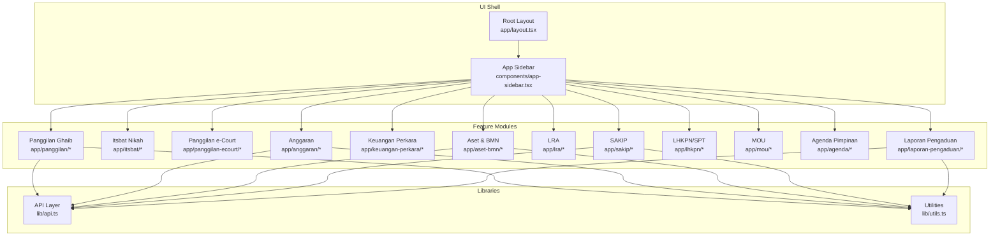
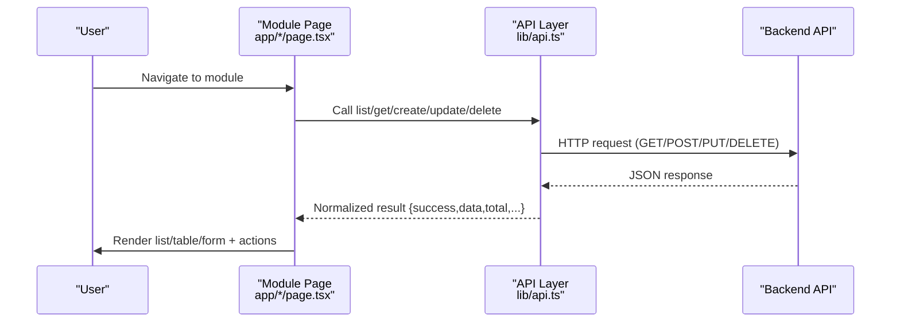
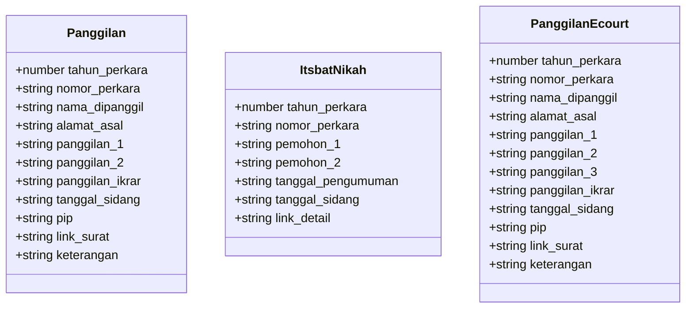
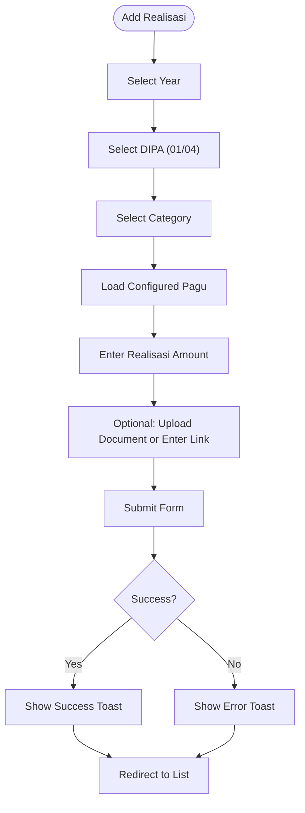
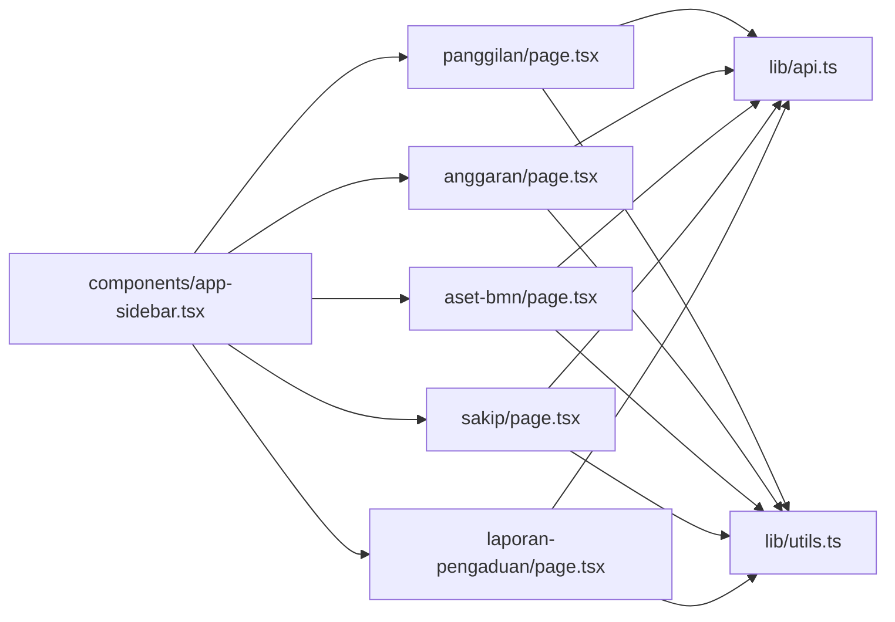

# Feature Modules

<cite>
**Referenced Files in This Document**
- [package.json](file://package.json)
- [layout.tsx](file://app/layout.tsx)
- [app-sidebar.tsx](file://components/app-sidebar.tsx)
- [api.ts](file://lib/api.ts)
- [utils.ts](file://lib/utils.ts)
- [panggilan/page.tsx](file://app/panggilan/page.tsx)
- [anggaran/page.tsx](file://app/anggaran/page.tsx)
- [aset-bmn/page.tsx](file://app/aset-bmn/page.tsx)
- [sakip/page.tsx](file://app/sakip/page.tsx)
- [laporan-pengaduan/page.tsx](file://app/laporan-pengaduan/page.tsx)
- [panggilan/tambah/page.tsx](file://app/panggilan/tambah/page.tsx)
- [anggaran/tambah/page.tsx](file://app/anggaran/tambah/page.tsx)
- [aset-bmn/tambah/page.tsx](file://app/aset-bmn/tambah/page.tsx)
- [sakip/tambah/page.tsx](file://app/sakip/tambah/page.tsx)
</cite>

## Table of Contents
1. [Introduction](#introduction)
2. [Project Structure](#project-structure)
3. [Core Components](#core-components)
4. [Architecture Overview](#architecture-overview)
5. [Detailed Component Analysis](#detailed-component-analysis)
6. [Dependency Analysis](#dependency-analysis)
7. [Performance Considerations](#performance-considerations)
8. [Troubleshooting Guide](#troubleshooting-guide)
9. [Conclusion](#conclusion)

## Introduction
This document describes the feature modules that compose the administrative panel for the court management system. It covers the modular architecture across distinct functional domains:
- Case management: Panggilan Ghaib, Itsbat Nikah, Panggilan e-Court
- Financial administration: Anggaran, Realisasi Anggaran, Keuangan Perkara, Sisa Panjar
- Asset management: Aset & BMN, LRA
- Strategic planning: SAKIP
- Legal documentation: LHKPN/SPT, MOU
- Administrative coordination: Agenda Pimpinan, Laporan Pengaduan

It also documents shared patterns across modules (CRUD, forms, data presentation, pagination, and workflow management), module-specific features, data models, and integration requirements with the backend API.

## Project Structure
The application is a Next.js app organized by feature modules under app/, with a shared UI library under components/ui/ and reusable utilities under lib/. The global layout integrates a sidebar navigation that links to each module.

**Diagram sources**
- [layout.tsx:12-36](file://app/layout.tsx#L12-L36)
- [app-sidebar.tsx:44-135](file://components/app-sidebar.tsx#L44-L135)
- [api.ts:1-1144](file://lib/api.ts#L1-L1144)
- [utils.ts:1-26](file://lib/utils.ts#L1-L26)

**Section sources**
- [layout.tsx:1-37](file://app/layout.tsx#L1-L37)
- [app-sidebar.tsx:1-231](file://components/app-sidebar.tsx#L1-L231)
- [package.json:1-44](file://package.json#L1-L44)

## Core Components
- Global layout and shell: Provides the main layout, sidebar navigation, and toast notifications.
- Sidebar routing: Centralized menu with icons and labels for all modules.
- API abstraction: Strongly typed endpoints for each domain with standardized response normalization.
- Utilities: Year options generation, currency formatting, and shared helpers.

Common patterns across modules:
- List views with filters (year, category), pagination, and action buttons (edit, delete).
- Add/edit forms supporting both JSON and FormData for file uploads.
- Toast-based feedback and confirmation dialogs for destructive actions.
- Responsive tables with skeleton loaders during loading states.

**Section sources**
- [layout.tsx:12-36](file://app/layout.tsx#L12-L36)
- [app-sidebar.tsx:44-135](file://components/app-sidebar.tsx#L44-L135)
- [api.ts:43-80](file://lib/api.ts#L43-L80)
- [utils.ts:8-25](file://lib/utils.ts#L8-L25)

## Architecture Overview
The frontend communicates with a backend API via HTTP requests. Each module’s page interacts with the API layer to fetch, create, update, and delete records. Responses are normalized to a consistent shape, simplifying UI handling.

**Diagram sources**
- [api.ts:53-80](file://lib/api.ts#L53-L80)
- [panggilan/page.tsx:42-65](file://app/panggilan/page.tsx#L42-L65)
- [anggaran/page.tsx:45-71](file://app/anggaran/page.tsx#L45-L71)

## Detailed Component Analysis

### Case Management
Functional domains:
- Panggilan Ghaib: Tracks summons and hearing dates for absent parties.
- Itsbat Nikah: Manages announcement and hearing schedules for marriage cases.
- Panggilan e-Court: Extends summons data for electronic court systems.

Common patterns:
- List view with year filter, pagination, and action buttons.
- Add form with year selector, case number, personal details, schedule fields, optional file upload.
- Edit and delete flows with confirmation dialogs.

Data models (selected):
- Panggilan: case year, case number, name, addresses, multiple summon dates, hearing date, PIP, document link, notes.
- ItsbatNikah: case year, case number, parties, announcement date, hearing date, detail link.
- PanggilanEcourt: extended case fields aligned with e-court requirements.

Integration highlights:
- API endpoints for list, detail, create, update (including FormData for file uploads), delete.
- Normalize response shape for consistent pagination and messages.

**Diagram sources**
- [api.ts:5-20](file://lib/api.ts#L5-L20)
- [api.ts:22-33](file://lib/api.ts#L22-L33)
- [api.ts:216-232](file://lib/api.ts#L216-L232)

**Section sources**
- [panggilan/page.tsx:28-309](file://app/panggilan/page.tsx#L28-L309)
- [panggilan/tambah/page.tsx:18-282](file://app/panggilan/tambah/page.tsx#L18-L282)
- [api.ts:97-149](file://lib/api.ts#L97-L149)
- [api.ts:155-210](file://lib/api.ts#L155-L210)
- [api.ts:234-286](file://lib/api.ts#L234-L286)

### Financial Administration
Functional domains:
- Anggaran: Pagu management (configure budget caps).
- Realisasi Anggaran: Monthly spending reporting with categorized DIPA (DIPA 01/04).
- Keuangan Perkara: Case-related financial tracking.
- Sisa Panjar: Pantry balance tracking.

Common patterns:
- List view with year and DIPA filters, monthly breakdown, currency formatting, and document links.
- Add form with year/month selectors, DIPA and category selection, amount input, optional document upload or manual link.

Data models (selected):
- RealisasiAnggaran: DIPA, category, month, pagu, realized amount, remaining, percentage, year, notes, document link.

Integration highlights:
- Pagu retrieval to prefill configured budgets.
- Support for FormData for document uploads.

**Diagram sources**
- [anggaran/tambah/page.tsx:39-106](file://app/anggaran/tambah/page.tsx#L39-L106)
- [api.ts:429-471](file://lib/api.ts#L429-L471)
- [api.ts:499-523](file://lib/api.ts#L499-L523)

**Section sources**
- [anggaran/page.tsx:31-335](file://app/anggaran/page.tsx#L31-L335)
- [anggaran/tambah/page.tsx:39-204](file://app/anggaran/tambah/page.tsx#L39-L204)
- [api.ts:429-471](file://lib/api.ts#L429-L471)
- [api.ts:477-523](file://lib/api.ts#L477-L523)

### Asset Management
Functional domains:
- Aset & BMN: Inventory and documentation for state assets.
- LRA: Local Revenue Account reporting.

Common patterns:
- List view grouped by report categories with year filter and document links.
- Add form with year and report type selection, optional document upload.

Data models (selected):
- AsetBmn: year, report type enum, optional document link.

Integration highlights:
- Enumerated report types for controlled input.
- Support for FormData for document uploads.

**Section sources**
- [aset-bmn/page.tsx:32-221](file://app/aset-bmn/page.tsx#L32-L221)
- [aset-bmn/tambah/page.tsx:19-150](file://app/aset-bmn/tambah/page.tsx#L19-L150)
- [api.ts:584-652](file://lib/api.ts#L584-L652)

### Strategic Planning
Functional domain:
- SAKIP: Government agency performance accountability documents.

Common patterns:
- List view with year and type filters, search by type or description, pagination, and document links.
- Add form with year and type selection, optional description and document upload.

Data models (selected):
- Sakip: year, document type enum, description, optional document link.

Integration highlights:
- Enumerated document types for controlled input.
- Client-side filtering with debounced search.

**Section sources**
- [sakip/page.tsx:30-350](file://app/sakip/page.tsx#L30-L350)
- [sakip/tambah/page.tsx:18-175](file://app/sakip/tambah/page.tsx#L18-L175)
- [api.ts:658-756](file://lib/api.ts#L658-L756)

### Legal Documentation
Functional domains:
- LHKPN & SPT: Integrity declarations and annual tax reports.
- MOU: Memoranda of Understanding.

Common patterns:
- List view with year/type filters and search.
- Add/edit forms with year/type selection, optional document uploads.

Data models (selected):
- LhkpnReport: NIP, name, position, year, report type, timestamps, document links.

Integration highlights:
- Normalize response shape for heterogeneous API responses.
- Support for FormData for document uploads.

**Section sources**
- [api.ts:340-423](file://lib/api.ts#L340-L423)
- [api.ts:758-800](file://lib/api.ts#L758-L800)

### Administrative Coordination
Functional domains:
- Agenda Pimpinan: Leadership agendas.
- Laporan Pengaduan: Monthly complaint statistics aggregated by theme.

Common patterns:
- Agenda: CRUD with year/month filters and pagination.
- Laporan Pengaduan: Bulk year creation, per-month editing, and deletion.

Data models (selected):
- AgendaPimpinan: date, agenda content.
- LaporanPengaduan: yearly themes with monthly counts, processed count, and remaining.

Integration highlights:
- Agenda uses a dedicated response normalizer.
- Laporan Pengaduan supports bulk creation of yearly rows.

**Section sources**
- [api.ts:35-41](file://lib/api.ts#L35-L41)
- [api.ts:292-334](file://lib/api.ts#L292-L334)
- [api.ts:778-800](file://lib/api.ts#L778-L800)
- [laporan-pengaduan/page.tsx:32-355](file://app/laporan-pengaduan/page.tsx#L32-L355)

## Dependency Analysis
- Module pages depend on the API layer for data operations and on utilities for year options and formatting.
- Sidebar defines the canonical navigation and module grouping.
- Shared UI components (tables, forms, dialogs, pagination) are reused across modules.

**Diagram sources**
- [panggilan/page.tsx:1-310](file://app/panggilan/page.tsx#L1-L310)
- [anggaran/page.tsx:1-335](file://app/anggaran/page.tsx#L1-L335)
- [aset-bmn/page.tsx:1-221](file://app/aset-bmn/page.tsx#L1-L221)
- [sakip/page.tsx:1-350](file://app/sakip/page.tsx#L1-L350)
- [laporan-pengaduan/page.tsx:1-355](file://app/laporan-pengaduan/page.tsx#L1-L355)
- [api.ts:1-1144](file://lib/api.ts#L1-L1144)
- [utils.ts:1-26](file://lib/utils.ts#L1-L26)
- [app-sidebar.tsx:1-231](file://components/app-sidebar.tsx#L1-L231)

**Section sources**
- [api.ts:1-1144](file://lib/api.ts#L1-L1144)
- [utils.ts:1-26](file://lib/utils.ts#L1-L26)
- [app-sidebar.tsx:44-135](file://components/app-sidebar.tsx#L44-L135)

## Performance Considerations
- Prefer server-side pagination and filtering where possible; client-side pagination is acceptable for moderate datasets.
- Use skeleton loaders during data fetches to improve perceived performance.
- Debounce search inputs to avoid excessive API calls.
- Minimize re-renders by structuring state updates efficiently (e.g., batched form state).
- Cache API responses when appropriate and invalidate on write operations.

## Troubleshooting Guide
- API connectivity: Ensure NEXT_PUBLIC_API_URL and NEXT_PUBLIC_API_KEY are configured. Verify network access and CORS on the backend.
- File uploads: Confirm FormData usage for endpoints requiring file uploads and that the backend accepts multipart/form-data.
- Pagination: If pages appear empty, check current_page and last_page values and adjust filters accordingly.
- Toast feedback: Use toasts for success/error messages; inspect console for unhandled exceptions.
- Sidebar navigation: Confirm route paths match sidebar entries.

**Section sources**
- [api.ts:1-4](file://lib/api.ts#L1-L4)
- [panggilan/page.tsx:57-63](file://app/panggilan/page.tsx#L57-L63)
- [anggaran/page.tsx:63-69](file://app/anggaran/page.tsx#L63-L69)
- [laporan-pengaduan/page.tsx:53-57](file://app/laporan-pengaduan/page.tsx#L53-L57)

## Conclusion
The feature modules follow a consistent, modular architecture with shared UI patterns and a unified API layer. Each domain encapsulates its own CRUD flows, filters, and presentation logic while leveraging common utilities and components. The design supports scalability across functional areas and maintains a clean separation between UI and data access.