# Anggaran (Budget Management)

<cite>
**Referenced Files in This Document**
- [page.tsx](file://app/anggaran/page.tsx)
- [tambah/page.tsx](file://app/anggaran/tambah/page.tsx)
- [edit/page.tsx](file://app/anggaran/[id]/edit/page.tsx)
- [pagu/page.tsx](file://app/anggaran/pagu/page.tsx)
- [api.ts](file://lib/api.ts)
- [utils.ts](file://lib/utils.ts)
- [layout.tsx](file://app/layout.tsx)
- [app-sidebar.tsx](file://components/app-sidebar.tsx)
</cite>

## Table of Contents
1. [Introduction](#introduction)
2. [Project Structure](#project-structure)
3. [Core Components](#core-components)
4. [Architecture Overview](#architecture-overview)
5. [Detailed Component Analysis](#detailed-component-analysis)
6. [Budget Management Workflows](#budget-management-workflows)
7. [Pagu Control System](#pagu-control-system)
8. [Data Validation and Entry Patterns](#data-validation-and-entry-patterns)
9. [Integration with Financial Systems](#integration-with-financial-systems)
10. [Reporting and Compliance](#reporting-and-compliance)
11. [Performance Considerations](#performance-considerations)
12. [Troubleshooting Guide](#troubleshooting-guide)
13. [Conclusion](#conclusion)

## Introduction

The Anggaran module is a comprehensive budget management and allocation system designed for judicial institutions to track and manage their annual budgets. This module provides complete lifecycle management for budget creation, approval, execution tracking, and reporting. The system supports two primary budget categories (DIPA 01 and DIPA 04) with dedicated pagu (budget limit) controls to prevent overspending and ensure compliance with financial regulations.

The module integrates seamlessly with the broader administrative panel ecosystem, providing real-time budget tracking, automated calculations, and comprehensive audit trails for all financial transactions.

## Project Structure

The Anggaran module follows a structured Next.js application architecture with clear separation of concerns:

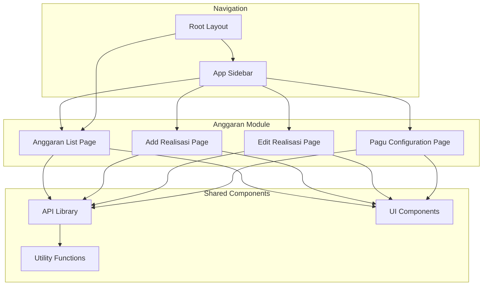

**Diagram sources**
- [page.tsx:1-335](file://app/anggaran/page.tsx#L1-L335)
- [tambah/page.tsx:1-204](file://app/anggaran/tambah/page.tsx#L1-L204)
- [edit/page.tsx:1-154](file://app/anggaran/[id]/edit/page.tsx#L1-L154)
- [pagu/page.tsx:1-131](file://app/anggaran/pagu/page.tsx#L1-L131)

**Section sources**
- [page.tsx:1-335](file://app/anggaran/page.tsx#L1-L335)
- [tambah/page.tsx:1-204](file://app/anggaran/tambah/page.tsx#L1-L204)
- [edit/page.tsx:1-154](file://app/anggaran/[id]/edit/page.tsx#L1-L154)
- [pagu/page.tsx:1-131](file://app/anggaran/pagu/page.tsx#L1-L131)

## Core Components

### Budget Data Models

The Anggaran module operates on two primary data models that define the budget management structure:

**RealisasiAnggaran Model**: Represents monthly budget realization records
- `id`: Unique identifier for each realization record
- `dipa`: Budget category (DIPA 01 or DIPA 04)
- `kategori`: Specific expense category within the budget
- `bulan`: Month of realization (1-12)
- `tahun`: Year of budget cycle
- `realisasi`: Actual amount spent
- `link_dokumen`: Document reference for transparency
- `keterangan`: Additional notes or descriptions

**PaguAnggaran Model**: Defines budget limits and allocations
- `id`: Unique identifier for pagu configuration
- `dipa`: Budget category reference
- `kategori`: Expense category reference
- `jumlah_pagu`: Maximum allowable budget amount
- `tahun`: Year of pagu configuration

### API Integration Layer

The module utilizes a centralized API library that provides standardized communication with the backend financial system:

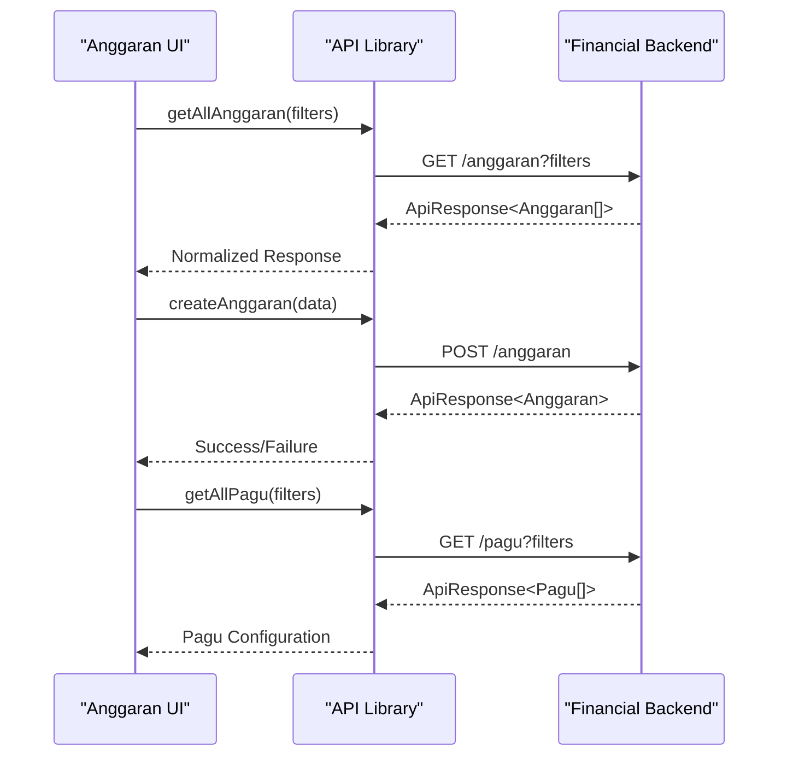

**Diagram sources**
- [api.ts:429-471](file://lib/api.ts#L429-L471)
- [api.ts:499-523](file://lib/api.ts#L499-L523)

**Section sources**
- [api.ts:356-370](file://lib/api.ts#L356-L370)
- [api.ts:477-483](file://lib/api.ts#L477-L483)
- [api.ts:429-523](file://lib/api.ts#L429-L523)

## Architecture Overview

The Anggaran module implements a client-server architecture with clear separation between presentation, business logic, and data persistence layers:

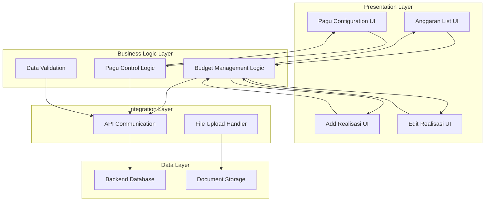

**Diagram sources**
- [page.tsx:31-335](file://app/anggaran/page.tsx#L31-L335)
- [tambah/page.tsx:39-204](file://app/anggaran/tambah/page.tsx#L39-L204)
- [edit/page.tsx:29-154](file://app/anggaran/[id]/edit/page.tsx#L29-L154)
- [pagu/page.tsx:19-131](file://app/anggaran/pagu/page.tsx#L19-L131)

## Detailed Component Analysis

### Anggaran List Component

The main dashboard component provides comprehensive budget tracking and management capabilities:

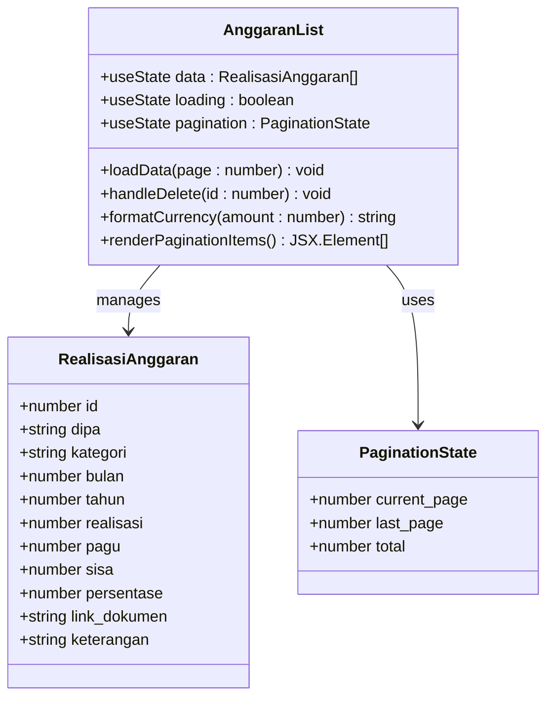

**Diagram sources**
- [page.tsx:31-335](file://app/anggaran/page.tsx#L31-L335)
- [api.ts:356-370](file://lib/api.ts#L356-L370)

Key features include:
- **Multi-filtering**: Filter by DIPA category and year
- **Pagination**: Efficient handling of large datasets
- **Real-time calculations**: Automatic percentage and balance calculations
- **Document integration**: Direct linking to supporting documents
- **Bulk operations**: Delete functionality with confirmation dialogs

**Section sources**
- [page.tsx:31-335](file://app/anggaran/page.tsx#L31-L335)

### Realisasi Anggaran Form

The form component provides comprehensive data entry for budget realizations:

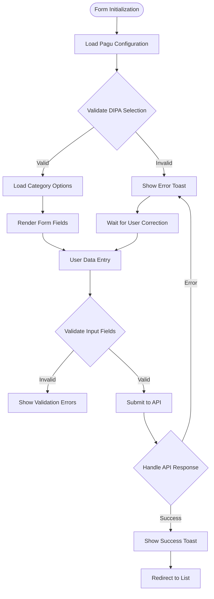

**Diagram sources**
- [tambah/page.tsx:71-106](file://app/anggaran/tambah/page.tsx#L71-L106)

**Section sources**
- [tambah/page.tsx:39-204](file://app/anggaran/tambah/page.tsx#L39-L204)

### Pagu Configuration System

The pagu configuration component enables administrators to set and modify budget limits:

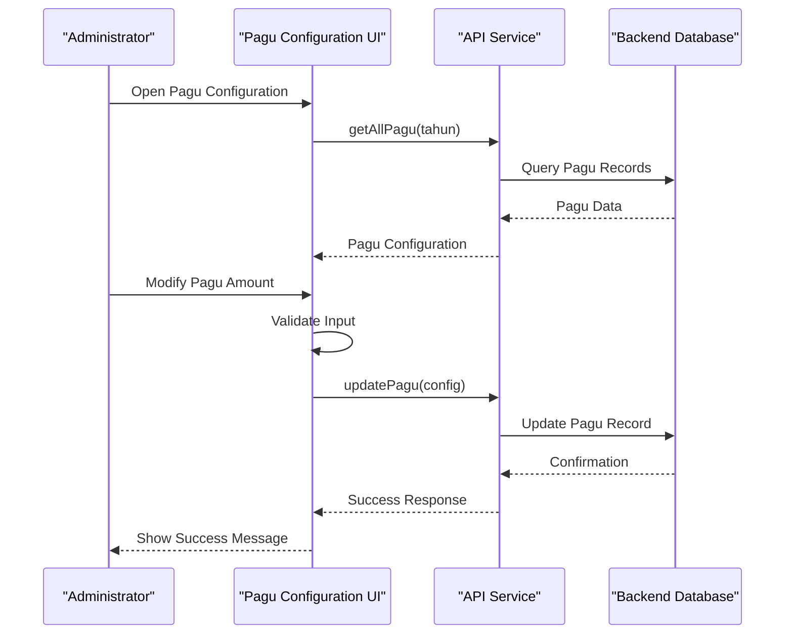

**Diagram sources**
- [pagu/page.tsx:26-56](file://app/anggaran/pagu/page.tsx#L26-L56)
- [api.ts:508-515](file://lib/api.ts#L508-L515)

**Section sources**
- [pagu/page.tsx:19-131](file://app/anggaran/pagu/page.tsx#L19-L131)

## Budget Management Workflows

### Budget Creation Workflow

The budget creation process follows a structured workflow to ensure proper allocation and tracking:

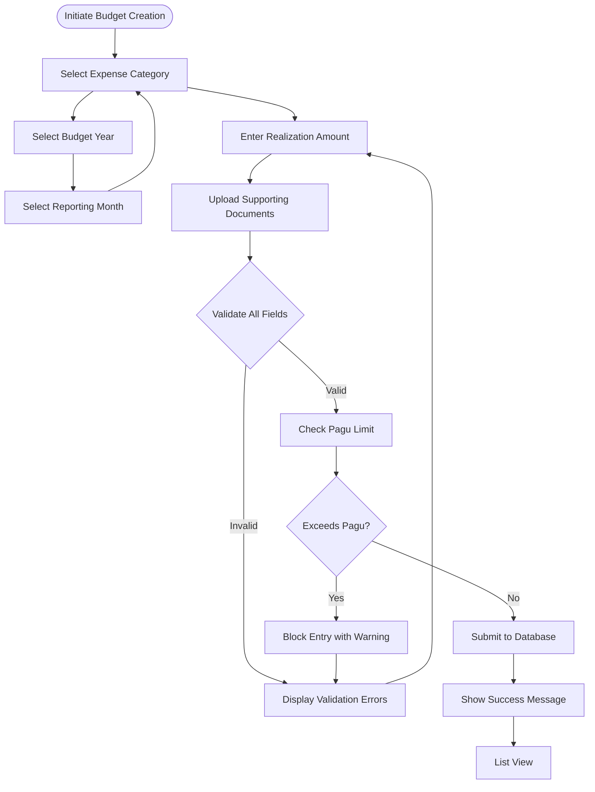

**Diagram sources**
- [tambah/page.tsx:71-106](file://app/anggaran/tambah/page.tsx#L71-L106)
- [api.ts:447-454](file://lib/api.ts#L447-L454)

### Approval and Execution Tracking

The system maintains comprehensive audit trails for all budget modifications:

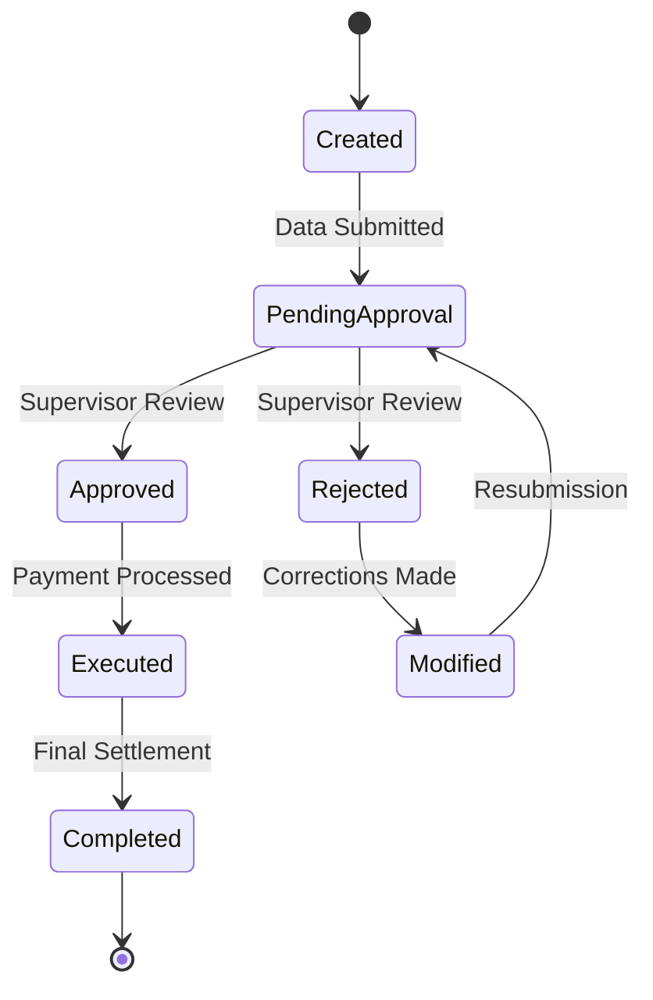

**Section sources**
- [page.tsx:194-270](file://app/anggaran/page.tsx#L194-L270)

## Pagu Control System

### Pagu Enforcement Mechanisms

The pagu control system implements robust budget limit enforcement:

| Control Type | Implementation | Enforcement Level |
|--------------|----------------|-------------------|
| Monthly Limits | Real-time calculation against pagu | Hard Limit |
| Annual Caps | Aggregate monthly totals | Hard Limit |
| Category-Specific | Separate limits per expense category | Hard Limit |
| Cross-Category Monitoring | Inter-category spending analysis | Soft Alert |

### Pagu Calculation Algorithms

The system employs sophisticated algorithms for real-time budget tracking:

**Real-time Pagu Calculation:**
```
CurrentPagu = PaguConfiguration[dipa][kategori][tahun]
MonthlySpent = SUM(RealisasiAnggaran[dipa][kategori][bulan=tahun])
RemainingPagu = CurrentPagu - MonthlySpent
ExceededAmount = MAX(0, MonthlySpent - CurrentPagu)
```

**Multi-Year Planning Algorithm:**
```
YearlyAllocation = PaguConfiguration[dipa][kategori][tahun]
AnnualConsumption = SUM(MonthlySpent[dipa][kategori][1..12])
AverageMonthlyConsumption = AnnualConsumption / 12
ProjectedYearEndBalance = YearlyAllocation - AnnualConsumption
```

**Section sources**
- [tambah/page.tsx:66-69](file://app/anggaran/tambah/page.tsx#L66-L69)
- [api.ts:499-506](file://lib/api.ts#L499-L506)

## Data Validation and Entry Patterns

### Form Field Specifications

| Field | Type | Validation Rules | Required |
|-------|------|------------------|----------|
| Tahun | Number | 2018-present | Yes |
| Bulan | Select | 1-12 range | Yes |
| DIPA | Select | DIPA 01 or DIPA 04 | Yes |
| Kategori | Select | Category based on DIPA | Yes |
| Realisasi | Number | >0, numeric | Yes |
| Link Dokumen | URL | Valid URL format | No |
| Keterangan | Text | Max 500 chars | No |

### Validation Logic Implementation

The validation system implements comprehensive field checking:

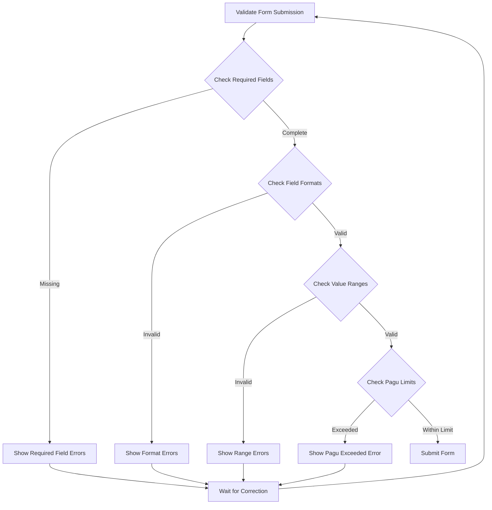

**Diagram sources**
- [tambah/page.tsx:71-106](file://app/anggaran/tambah/page.tsx#L71-L106)

**Section sources**
- [tambah/page.tsx:19-37](file://app/anggaran/tambah/page.tsx#L19-L37)

## Integration with Financial Systems

### API Integration Points

The Anggaran module integrates with multiple backend systems:

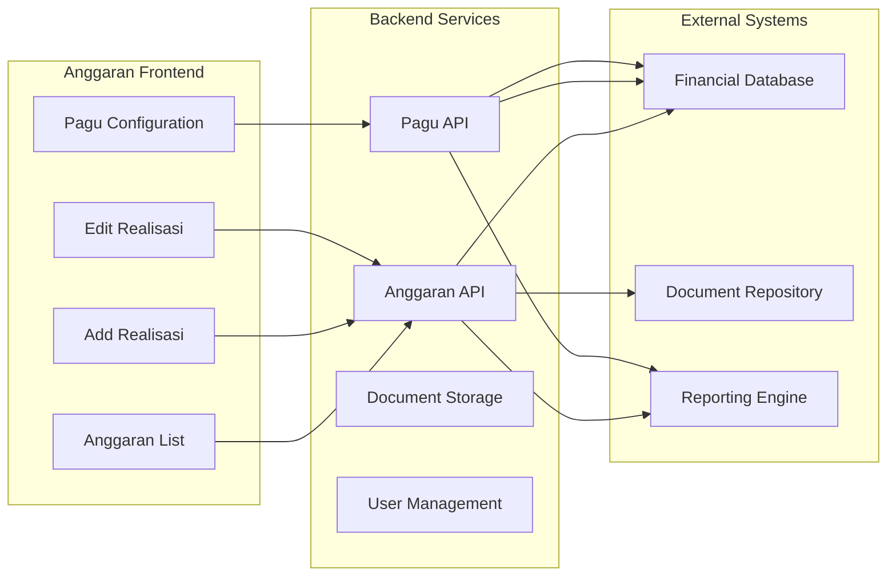

**Diagram sources**
- [api.ts:429-523](file://lib/api.ts#L429-L523)

### Compliance and Audit Trail

The system maintains comprehensive audit trails for all financial transactions:

| Audit Event | Data Captured | Retention Period |
|-------------|---------------|------------------|
| Budget Entry | User, Timestamp, Values, IP | 7 years |
| Modification | Previous/Current Values, Modifier | 7 years |
| Deletion | Deletion Details, Reason | Permanent |
| Pagu Changes | New Limits, Approving Authority | 7 years |

**Section sources**
- [api.ts:429-523](file://lib/api.ts#L429-L523)

## Reporting and Compliance

### Budget Categories and Hierarchies

The system supports two primary budget categories with distinct approval hierarchies:

**DIPA 01 Categories:**
- Belanja Pegawai (Employee Expenses)
- Belanja Barang (Material Purchases)
- Belanja Modal (Capital Expenditures)

**DIPA 04 Categories:**
- POSBAKUM (Court Case Related Expenses)
- Pembebasan Biaya Perkara (Case Cost Release)
- Sidang Di Luar Gedung (Off-site Court Sessions)

### Approval Workflow Hierarchy

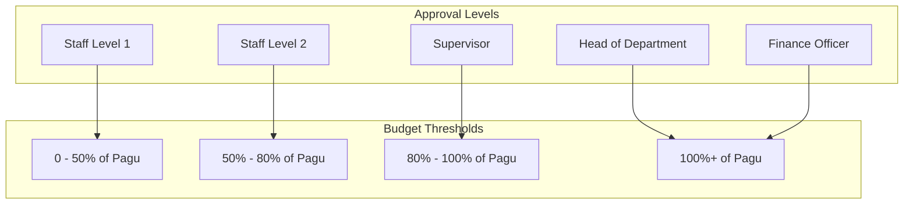

**Section sources**
- [tambah/page.tsx:34-37](file://app/anggaran/tambah/page.tsx#L34-L37)
- [edit/page.tsx:24-27](file://app/anggaran/[id]/edit/page.tsx#L24-L27)

## Performance Considerations

### Data Loading Optimization

The system implements several performance optimization strategies:

**Pagination Strategy:**
- Default page size: 15 records
- Lazy loading for large datasets
- Efficient filtering on client-side
- Debounced search operations

**Memory Management:**
- Component cleanup on unmount
- Efficient state updates
- Minimal re-renders through proper state management

**API Optimization:**
- Request deduplication
- Efficient query parameters
- Proper error handling and retry logic

### Scalability Features

- Horizontal scaling support for multiple budget categories
- Database indexing for frequently queried fields
- CDN integration for document storage
- Caching strategies for configuration data

## Troubleshooting Guide

### Common Issues and Solutions

**Issue: Pagu Limit Not Updating**
- **Cause**: Browser caching or stale data
- **Solution**: Clear browser cache or refresh page
- **Prevention**: Implement automatic data refresh

**Issue: Form Validation Errors**
- **Cause**: Missing required fields or invalid formats
- **Solution**: Check console for specific error messages
- **Prevention**: Implement real-time validation feedback

**Issue: API Connection Failures**
- **Cause**: Network issues or server downtime
- **Solution**: Check API status and retry connection
- **Prevention**: Implement connection retry logic

**Issue: Document Upload Failures**
- **Cause**: File size limits or unsupported formats
- **Solution**: Verify file type and size constraints
- **Prevention**: Implement client-side validation

### Debugging Tools

The system includes comprehensive debugging capabilities:

- **Console Logging**: Detailed API response logging
- **Error Boundaries**: Graceful error handling
- **Network Monitoring**: API request/response tracking
- **State Inspection**: Real-time state visualization

**Section sources**
- [page.tsx:63-70](file://app/anggaran/page.tsx#L63-L70)
- [tambah/page.tsx:102-106](file://app/anggaran/tambah/page.tsx#L102-L106)

## Conclusion

The Anggaran module provides a comprehensive, enterprise-grade budget management solution tailored for judicial institutions. The system successfully balances functionality with usability while maintaining strict compliance with financial regulations.

Key strengths of the implementation include:

- **Robust Pagu Control**: Advanced budget limit enforcement preventing overspending
- **Comprehensive Audit Trail**: Complete transaction history for compliance requirements
- **User-Friendly Interface**: Intuitive forms with real-time validation feedback
- **Scalable Architecture**: Designed to handle growing budget complexity
- **Integration Capabilities**: Seamless connection with existing financial systems

The module's modular design ensures maintainability and extensibility, allowing for future enhancements such as advanced reporting features, multi-level approval workflows, and enhanced analytics capabilities.