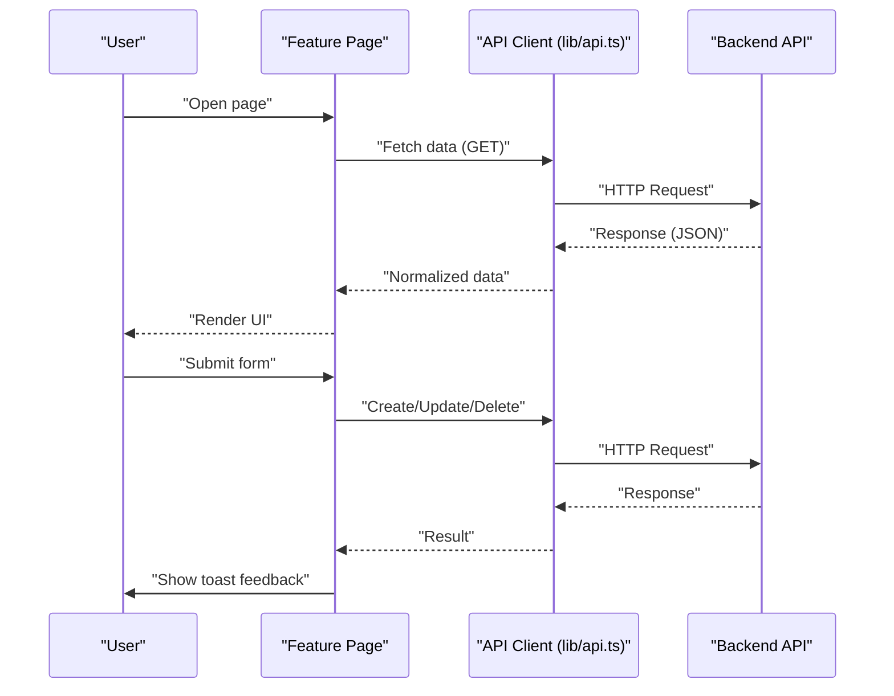
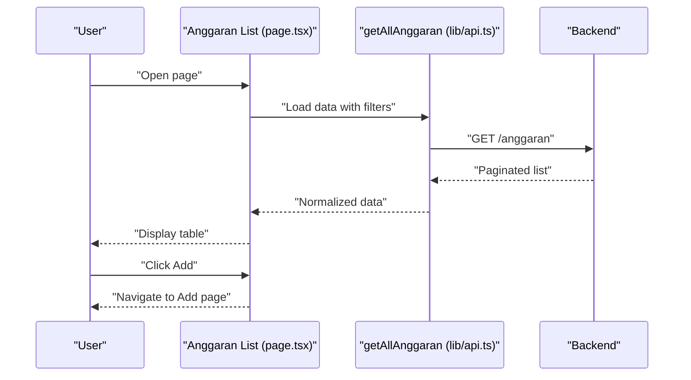
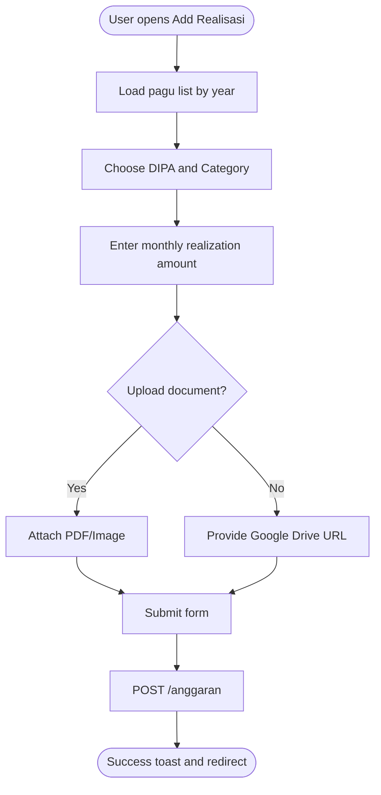
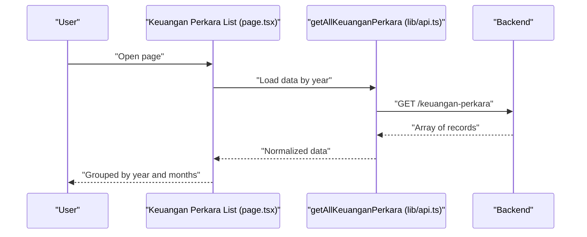
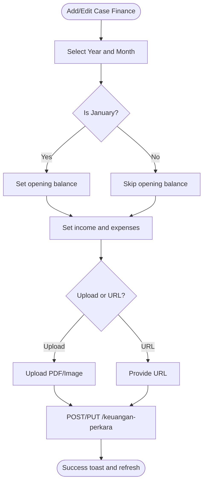
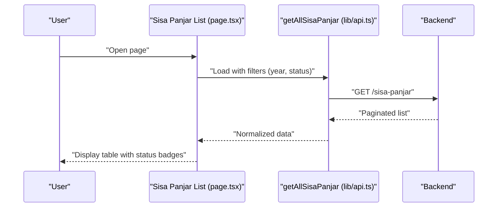
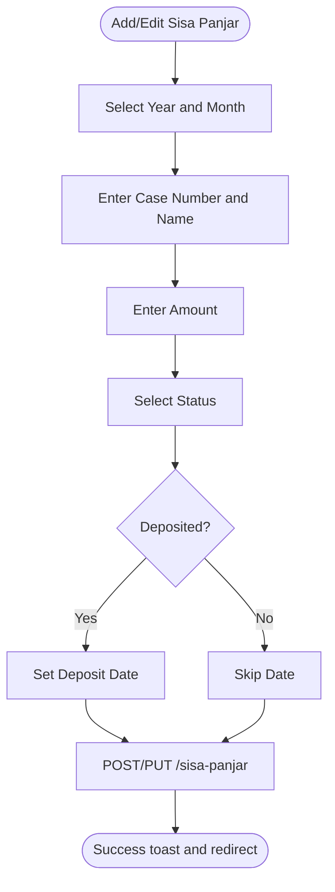
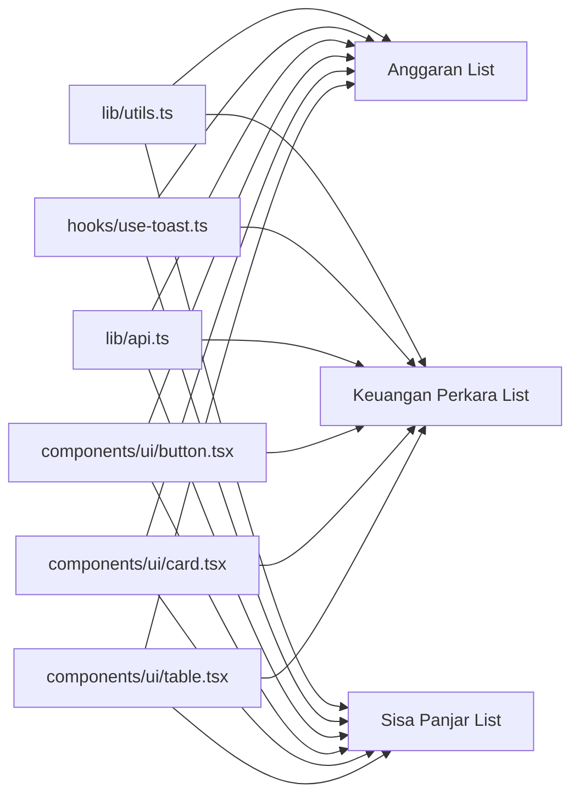
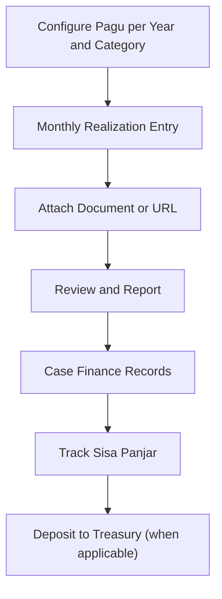

# Financial Administration

<cite>
**Referenced Files in This Document**
- [app/anggaran/page.tsx](file://app/anggaran/page.tsx)
- [app/anggaran/tambah/page.tsx](file://app/anggaran/tambah/page.tsx)
- [app/anggaran/[id]/edit/page.tsx](file://app/anggaran/[id]/edit/page.tsx)
- [app/anggaran/pagu/page.tsx](file://app/anggaran/pagu/page.tsx)
- [app/keuangan-perkara/page.tsx](file://app/keuangan-perkara/page.tsx)
- [app/keuangan-perkara/tambah/page.tsx](file://app/keuangan-perkara/tambah/page.tsx)
- [app/keuangan-perkara/[id]/edit/page.tsx](file://app/keuangan-perkara/[id]/edit/page.tsx)
- [app/sisa-panjar/page.tsx](file://app/sisa-panjar/page.tsx)
- [app/sisa-panjar/tambah/page.tsx](file://app/sisa-panjar/tambah/page.tsx)
- [app/sisa-panjar/[id]/page.tsx](file://app/sisa-panjar/[id]/page.tsx)
- [lib/api.ts](file://lib/api.ts)
- [lib/utils.ts](file://lib/utils.ts)
- [hooks/use-toast.ts](file://hooks/use-toast.ts)
- [components/ui/button.tsx](file://components/ui/button.tsx)
- [components/ui/card.tsx](file://components/ui/card.tsx)
- [components/ui/table.tsx](file://components/ui/table.tsx)
</cite>

## Table of Contents
1. [Introduction](#introduction)
2. [Project Structure](#project-structure)
3. [Core Components](#core-components)
4. [Architecture Overview](#architecture-overview)
5. [Detailed Component Analysis](#detailed-component-analysis)
6. [Dependency Analysis](#dependency-analysis)
7. [Performance Considerations](#performance-considerations)
8. [Troubleshooting Guide](#troubleshooting-guide)
9. [Conclusion](#conclusion)
10. [Appendices](#appendices)

## Introduction
This document describes the financial administration module that encompasses budget management, expenditure tracking, and payment processing. It documents four primary financial modules:
- Anggaran (Budget Management): Configures annual budgets (pagu) and tracks monthly budget execution (realisasi).
- Realisasi Anggaran (Budget Execution): Records monthly expenditures against configured budgets and links supporting documents.
- Keuangan Perkara (Case Finance): Manages income and expense records per case per month, including annual opening balances.
- Sisa Panjar (Advance Payments): Tracks leftover advance payments for cases, including status and cash deposit actions.

The module supports pagu control, monthly reporting, balance tracking, financial data entry, approval workflows, and reporting. It integrates with an external API via typed functions and provides UI patterns for visualization, dashboards, and analytics.

## Project Structure
The financial administration is organized by feature pages under the Next.js app directory, with shared UI components and utilities:
- Feature pages:
  - Anggaran: listing, creation, editing, and pagu configuration
  - Keuangan Perkara: listing, creation, editing
  - Sisa Panjar: listing, creation, editing
- Shared utilities:
  - API client functions for all financial endpoints
  - Formatting helpers for currency and year options
  - Toast notifications for user feedback
- UI primitives:
  - Buttons, cards, tables, selects, dialogs, and pagination

```mermaid
graph TB
subgraph "Pages"
A["Anggaran List<br/>app/anggaran/page.tsx"]
B["Anggaran Add<br/>app/anggaran/tambah/page.tsx"]
C["Anggaran Edit<br/>app/anggaran/[id]/edit/page.tsx"]
D["Pagu Config<br/>app/anggaran/pagu/page.tsx"]
E["Keuangan Perkara List<br/>app/keuangan-perkara/page.tsx"]
F["Keuangan Perkara Add<br/>app/keuangan-perkara/tambah/page.tsx"]
G["Keuangan Perkara Edit<br/>app/keuangan-perkara/[id]/edit/page.tsx"]
H["Sisa Panjar List<br/>app/sisa-panjar/page.tsx"]
I["Sisa Panjar Add<br/>app/sisa-panjar/tambah/page.tsx"]
J["Sisa Panjar Edit<br/>app/sisa-panjar/[id]/page.tsx"]
end
subgraph "Libraries"
K["API Client<br/>lib/api.ts"]
L["Utils<br/>lib/utils.ts"]
M["Toast Hook<br/>hooks/use-toast.ts"]
end
subgraph "UI Components"
U1["Button<br/>components/ui/button.tsx"]
U2["Card<br/>components/ui/card.tsx"]
U3["Table<br/>components/ui/table.tsx"]
end
A --- K
B --- K
C --- K
D --- K
E --- K
F --- K
G --- K
H --- K
I --- K
J --- K
A --- L
B --- L
E --- L
H --- L
A --- M
B --- M
E --- M
H --- M
A --- U1
A --- U2
A --- U3
```

**Diagram sources**
- [app/anggaran/page.tsx:1-335](file://app/anggaran/page.tsx#L1-L335)
- [app/anggaran/tambah/page.tsx:1-204](file://app/anggaran/tambah/page.tsx#L1-L204)
- [app/anggaran/[id]/edit/page.tsx](file://app/anggaran/[id]/edit/page.tsx#L1-L154)
- [app/anggaran/pagu/page.tsx:1-131](file://app/anggaran/pagu/page.tsx#L1-L131)
- [app/keuangan-perkara/page.tsx:1-309](file://app/keuangan-perkara/page.tsx#L1-L309)
- [app/keuangan-perkara/tambah/page.tsx:1-203](file://app/keuangan-perkara/tambah/page.tsx#L1-L203)
- [app/keuangan-perkara/[id]/edit/page.tsx](file://app/keuangan-perkara/[id]/edit/page.tsx#L1-L251)
- [app/sisa-panjar/page.tsx:1-318](file://app/sisa-panjar/page.tsx#L1-L318)
- [app/sisa-panjar/tambah/page.tsx:1-244](file://app/sisa-panjar/tambah/page.tsx#L1-L244)
- [app/sisa-panjar/[id]/page.tsx](file://app/sisa-panjar/[id]/page.tsx#L1-L303)
- [lib/api.ts:429-523](file://lib/api.ts#L429-L523)
- [lib/utils.ts:8-25](file://lib/utils.ts#L8-L25)
- [hooks/use-toast.ts:1-195](file://hooks/use-toast.ts#L1-L195)
- [components/ui/button.tsx:1-58](file://components/ui/button.tsx#L1-L58)
- [components/ui/card.tsx:1-77](file://components/ui/card.tsx#L1-L77)
- [components/ui/table.tsx:1-121](file://components/ui/table.tsx#L1-L121)

**Section sources**
- [app/anggaran/page.tsx:1-335](file://app/anggaran/page.tsx#L1-L335)
- [app/keuangan-perkara/page.tsx:1-309](file://app/keuangan-perkara/page.tsx#L1-L309)
- [app/sisa-panjar/page.tsx:1-318](file://app/sisa-panjar/page.tsx#L1-L318)
- [lib/api.ts:429-523](file://lib/api.ts#L429-L523)
- [lib/utils.ts:8-25](file://lib/utils.ts#L8-L25)
- [hooks/use-toast.ts:1-195](file://hooks/use-toast.ts#L1-L195)
- [components/ui/button.tsx:1-58](file://components/ui/button.tsx#L1-L58)
- [components/ui/card.tsx:1-77](file://components/ui/card.tsx#L1-L77)
- [components/ui/table.tsx:1-121](file://components/ui/table.tsx#L1-L121)

## Core Components
- Budget Management (Anggaran)
  - Pagu configuration per DIPA category per year
  - Monthly budget execution entries with document linkage
- Budget Execution (Realisasi Anggaran)
  - Monthly realizations per DIPA and category
  - Filtering by year and DIPA, pagination support
- Case Finance (Keuangan Perkara)
  - Monthly income and expense records per case
  - Annual opening balance for January
  - Optional document upload or URL
- Advance Payments (Sisa Panjar)
  - Leftover advance payments per case per month
  - Status tracking: pending collection vs deposited to state treasury
  - Optional deposit date capture

Common UI patterns:
- Cards for sections and forms
- Tables with sorting and pagination
- Select filters for year and status
- Dialogs for edits and confirmations
- Toast notifications for feedback

**Section sources**
- [app/anggaran/pagu/page.tsx:1-131](file://app/anggaran/pagu/page.tsx#L1-L131)
- [app/anggaran/tambah/page.tsx:1-204](file://app/anggaran/tambah/page.tsx#L1-L204)
- [app/anggaran/[id]/edit/page.tsx](file://app/anggaran/[id]/edit/page.tsx#L1-L154)
- [app/anggaran/page.tsx:1-335](file://app/anggaran/page.tsx#L1-L335)
- [app/keuangan-perkara/page.tsx:1-309](file://app/keuangan-perkara/page.tsx#L1-L309)
- [app/keuangan-perkara/tambah/page.tsx:1-203](file://app/keuangan-perkara/tambah/page.tsx#L1-L203)
- [app/keuangan-perkara/[id]/edit/page.tsx](file://app/keuangan-perkara/[id]/edit/page.tsx#L1-L251)
- [app/sisa-panjar/page.tsx:1-318](file://app/sisa-panjar/page.tsx#L1-L318)
- [app/sisa-panjar/tambah/page.tsx:1-244](file://app/sisa-panjar/tambah/page.tsx#L1-L244)
- [app/sisa-panjar/[id]/page.tsx](file://app/sisa-panjar/[id]/page.tsx#L1-L303)

## Architecture Overview
The frontend uses a thin client that communicates with a backend API through typed functions exported from a single library. Each financial module page composes UI components and invokes API functions to fetch, create, update, and delete data. Shared utilities provide currency formatting and year options. Toast notifications standardize user feedback.

**Diagram sources**
- [lib/api.ts:429-523](file://lib/api.ts#L429-L523)
- [hooks/use-toast.ts:145-172](file://hooks/use-toast.ts#L145-L172)

**Section sources**
- [lib/api.ts:429-523](file://lib/api.ts#L429-L523)
- [hooks/use-toast.ts:145-172](file://hooks/use-toast.ts#L145-L172)

## Detailed Component Analysis

### Anggaran (Budget Management and Execution)
- Pagu Configuration
  - Year selector, DIPA categories, editable amounts
  - Auto-save on input blur
- Realisasi Anggaran
  - Monthly entries per DIPA and category
  - Filters: year, DIPA, pagination
  - Document upload or URL field
  - Edit and delete actions

**Diagram sources**
- [app/anggaran/page.tsx:45-75](file://app/anggaran/page.tsx#L45-L75)
- [lib/api.ts:429-439](file://lib/api.ts#L429-L439)

**Diagram sources**
- [app/anggaran/tambah/page.tsx:58-106](file://app/anggaran/tambah/page.tsx#L58-L106)
- [lib/api.ts:447-454](file://lib/api.ts#L447-L454)

**Section sources**
- [app/anggaran/pagu/page.tsx:26-56](file://app/anggaran/pagu/page.tsx#L26-L56)
- [app/anggaran/tambah/page.tsx:58-106](file://app/anggaran/tambah/page.tsx#L58-L106)
- [app/anggaran/[id]/edit/page.tsx](file://app/anggaran/[id]/edit/page.tsx#L40-L76)
- [app/anggaran/page.tsx:45-75](file://app/anggaran/page.tsx#L45-L75)
- [lib/api.ts:429-471](file://lib/api.ts#L429-L471)

### Keuangan Perkara (Case Finance)
- Monthly income and expense records
- Annual opening balance for January
- Document upload or URL
- Editable fields with validation

**Diagram sources**
- [app/keuangan-perkara/page.tsx:39-50](file://app/keuangan-perkara/page.tsx#L39-L50)
- [lib/api.ts:873-877](file://lib/api.ts#L873-L877)

**Diagram sources**
- [app/keuangan-perkara/tambah/page.tsx:33-63](file://app/keuangan-perkara/tambah/page.tsx#L33-L63)
- [app/keuangan-perkara/[id]/edit/page.tsx](file://app/keuangan-perkara/[id]/edit/page.tsx#L48-L84)
- [lib/api.ts:908-935](file://lib/api.ts#L908-L935)

**Section sources**
- [app/keuangan-perkara/page.tsx:39-89](file://app/keuangan-perkara/page.tsx#L39-L89)
- [app/keuangan-perkara/tambah/page.tsx:33-63](file://app/keuangan-perkara/tambah/page.tsx#L33-L63)
- [app/keuangan-perkara/[id]/edit/page.tsx](file://app/keuangan-perkara/[id]/edit/page.tsx#L29-L84)
- [lib/api.ts:856-935](file://lib/api.ts#L856-L935)

### Sisa Panjar (Advance Payments)
- Track leftover advances per case per month
- Status: pending collection or deposited to state treasury
- Optional deposit date capture

**Diagram sources**
- [app/sisa-panjar/page.tsx:48-72](file://app/sisa-panjar/page.tsx#L48-L72)
- [lib/api.ts:961-976](file://lib/api.ts#L961-L976)

**Diagram sources**
- [app/sisa-panjar/tambah/page.tsx:64-100](file://app/sisa-panjar/tambah/page.tsx#L64-L100)
- [app/sisa-panjar/[id]/page.tsx](file://app/sisa-panjar/[id]/page.tsx#L100-L136)
- [lib/api.ts:984-1008](file://lib/api.ts#L984-L1008)

**Section sources**
- [app/sisa-panjar/page.tsx:48-96](file://app/sisa-panjar/page.tsx#L48-L96)
- [app/sisa-panjar/tambah/page.tsx:64-100](file://app/sisa-panjar/tambah/page.tsx#L64-L100)
- [app/sisa-panjar/[id]/page.tsx](file://app/sisa-panjar/[id]/page.tsx#L100-L136)
- [lib/api.ts:941-1008](file://lib/api.ts#L941-L1008)

### Common Patterns and Workflows
- Data Entry
  - Forms with controlled inputs and optional file uploads
  - Validation via API responses; errors surfaced through toasts
- Approval Workflows
  - Pages do not implement explicit approval steps; submit actions persist data immediately
- Reporting
  - Monthly lists grouped by year
  - Paginated tables with filters
- Currency and Formatting
  - Indonesian Rupiah formatting for display
  - Numeric inputs sanitized for currency fields

**Section sources**
- [app/anggaran/tambah/page.tsx:71-106](file://app/anggaran/tambah/page.tsx#L71-L106)
- [app/keuangan-perkara/tambah/page.tsx:33-63](file://app/keuangan-perkara/tambah/page.tsx#L33-L63)
- [app/sisa-panjar/tambah/page.tsx:64-100](file://app/sisa-panjar/tambah/page.tsx#L64-L100)
- [lib/utils.ts:18-25](file://lib/utils.ts#L18-L25)
- [hooks/use-toast.ts:145-172](file://hooks/use-toast.ts#L145-L172)

## Dependency Analysis
- UI Dependencies
  - All pages depend on shared UI components (Button, Card, Table)
- Utility Dependencies
  - Year options and currency formatting used across pages
- API Dependencies
  - Each page imports typed API functions for its domain
- Notification Dependencies
  - Toast hook used consistently for feedback

**Diagram sources**
- [lib/utils.ts:8-25](file://lib/utils.ts#L8-L25)
- [hooks/use-toast.ts:145-172](file://hooks/use-toast.ts#L145-L172)
- [lib/api.ts:429-523](file://lib/api.ts#L429-L523)
- [components/ui/button.tsx:1-58](file://components/ui/button.tsx#L1-L58)
- [components/ui/card.tsx:1-77](file://components/ui/card.tsx#L1-L77)
- [components/ui/table.tsx:1-121](file://components/ui/table.tsx#L1-L121)

**Section sources**
- [lib/utils.ts:8-25](file://lib/utils.ts#L8-L25)
- [hooks/use-toast.ts:145-172](file://hooks/use-toast.ts#L145-L172)
- [lib/api.ts:429-523](file://lib/api.ts#L429-L523)
- [components/ui/button.tsx:1-58](file://components/ui/button.tsx#L1-L58)
- [components/ui/card.tsx:1-77](file://components/ui/card.tsx#L1-L77)
- [components/ui/table.tsx:1-121](file://components/ui/table.tsx#L1-L121)

## Performance Considerations
- Pagination reduces initial payload sizes for large datasets
- Year-based filtering limits dataset scope
- Currency formatting uses locale-aware conversion; avoid excessive re-renders by memoizing formatted values
- File uploads are handled via FormData; ensure server-side limits and validation are enforced

## Troubleshooting Guide
- API Connectivity
  - Verify NEXT_PUBLIC_API_URL and NEXT_PUBLIC_API_KEY environment variables
  - Inspect normalized responses and error messages returned by API functions
- Form Submission Failures
  - Check for validation errors returned by the backend
  - Confirm file upload constraints (formats, size)
- UI Feedback
  - Toast notifications provide immediate feedback for success and error states

**Section sources**
- [lib/api.ts:1-91](file://lib/api.ts#L1-L91)
- [hooks/use-toast.ts:145-172](file://hooks/use-toast.ts#L145-L172)

## Conclusion
The financial administration module provides a cohesive set of features for budget management, execution tracking, case finance, and advance payment oversight. It leverages a centralized API client, shared utilities, and reusable UI components to deliver a consistent user experience. The module supports pagu control, monthly reporting, and balance tracking while integrating with external systems through typed API functions.

## Appendices

### Financial Workflow Overview

[No sources needed since this diagram shows conceptual workflow, not actual code structure]

### Examples and Best Practices
- Currency Handling
  - Use localized formatting for Indonesian Rupiah
  - Sanitize numeric inputs for currency fields
- Multi-Year Planning
  - Use year selectors to manage budgets across years
  - Group records by year for reporting clarity
- Audit Trails
  - Maintain document attachments for transparency
  - Keep status fields updated to reflect current state

[No sources needed since this section provides general guidance]