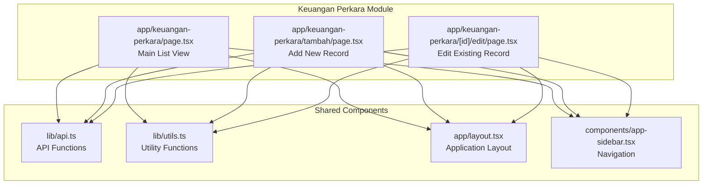
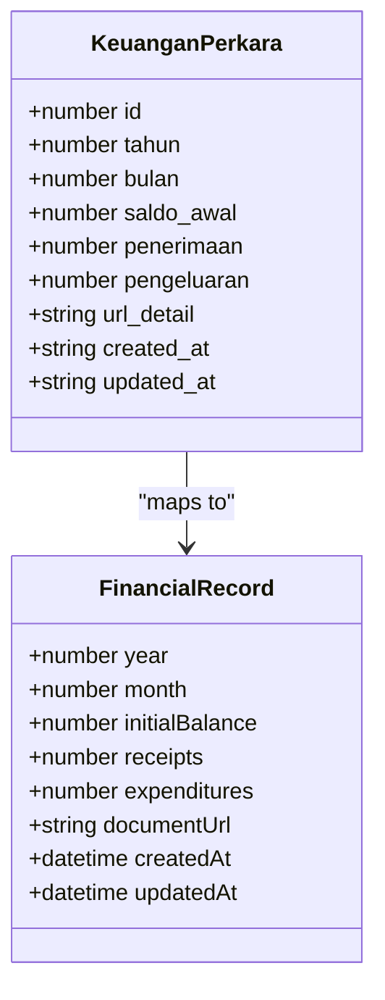
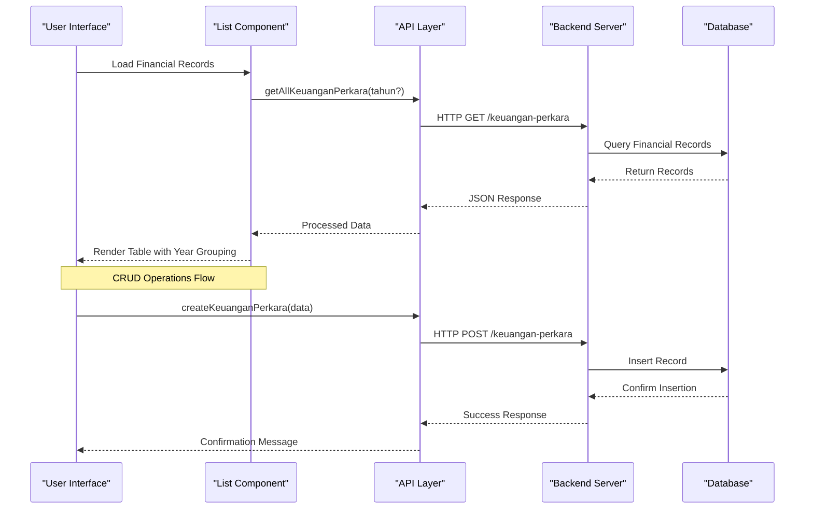
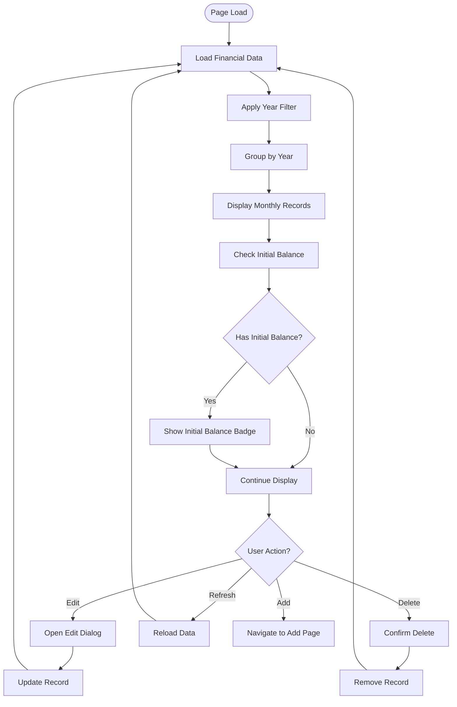
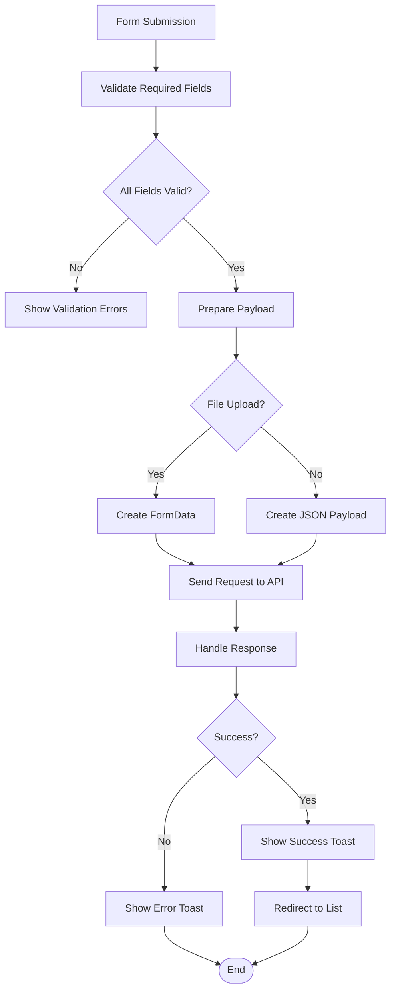
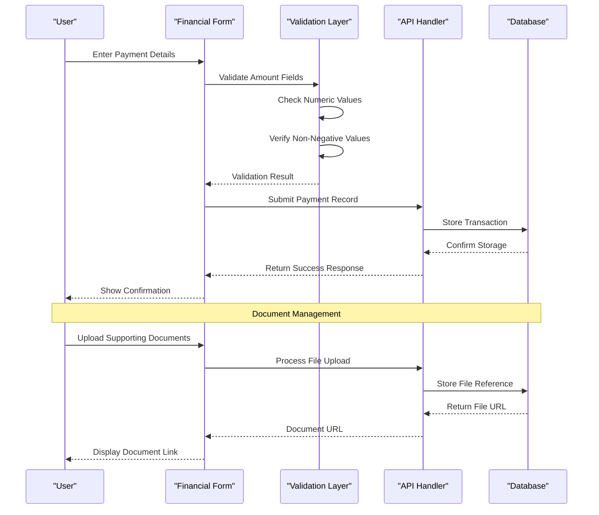
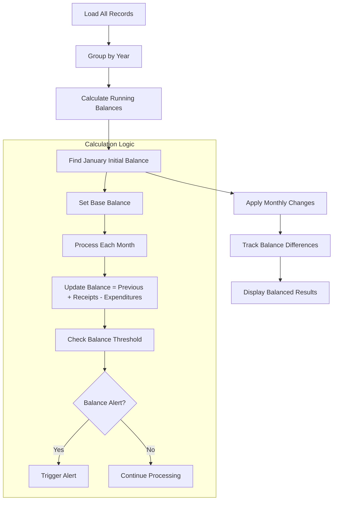
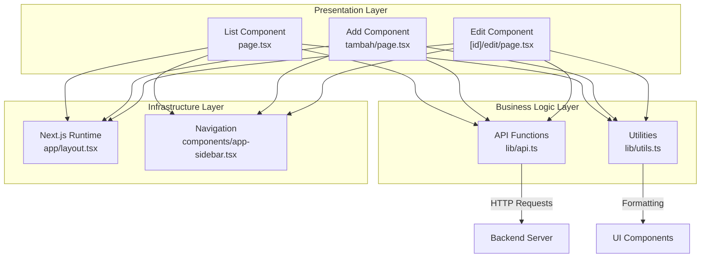

# Keuangan Perkara (Case Finance)

<cite>
**Referenced Files in This Document**
- [page.tsx](file://app/keuangan-perkara/page.tsx)
- [tambah/page.tsx](file://app/keuangan-perkara/tambah/page.tsx)
- [edit/page.tsx](file://app/keuangan-perkara/[id]/edit/page.tsx)
- [api.ts](file://lib/api.ts)
- [utils.ts](file://lib/utils.ts)
- [layout.tsx](file://app/layout.tsx)
- [app-sidebar.tsx](file://components/app-sidebar.tsx)
</cite>

## Table of Contents
1. [Introduction](#introduction)
2. [Project Structure](#project-structure)
3. [Core Components](#core-components)
4. [Architecture Overview](#architecture-overview)
5. [Detailed Component Analysis](#detailed-component-analysis)
6. [Dependency Analysis](#dependency-analysis)
7. [Performance Considerations](#performance-considerations)
8. [Troubleshooting Guide](#troubleshooting-guide)
9. [Conclusion](#conclusion)

## Introduction
The Keuangan Perkara module manages financial records for court cases, focusing on monthly income and expenditure tracking. It provides a complete workflow for case-specific financial management including fee collection, payment processing, and balance management. The system integrates with the broader case management ecosystem while maintaining compliance with financial regulations and audit trail requirements.

This module handles the critical financial oversight of legal proceedings, ensuring transparency and accountability in court case funding, expenses, and revenue collection processes.

## Project Structure
The Keuangan Perkara module follows a Next.js pages router architecture with dedicated components for listing, creation, and editing financial records.

**Diagram sources**
- [page.tsx:1-309](file://app/keuangan-perkara/page.tsx#L1-L309)
- [tambah/page.tsx:1-203](file://app/keuangan-perkara/tambah/page.tsx#L1-L203)
- [edit/page.tsx:1-251](file://app/keuangan-perkara/[id]/edit/page.tsx#L1-L251)
- [api.ts:856-935](file://lib/api.ts#L856-L935)

**Section sources**
- [page.tsx:1-309](file://app/keuangan-perkara/page.tsx#L1-L309)
- [tambah/page.tsx:1-203](file://app/keuangan-perkara/tambah/page.tsx#L1-L203)
- [edit/page.tsx:1-251](file://app/keuangan-perkara/[id]/edit/page.tsx#L1-L251)

## Core Components
The module consists of three primary components that handle different aspects of financial record management:

### Data Model: KeuanganPerkara Interface
The core data structure defines the financial record schema with comprehensive field definitions:

**Diagram sources**
- [api.ts:856-866](file://lib/api.ts#L856-L866)

### Main List Component
The primary interface displays consolidated financial data grouped by year with filtering capabilities and real-time updates.

### Add New Record Component
Handles creation of monthly financial records with validation and file upload capabilities for supporting documentation.

### Edit Record Component
Provides comprehensive editing functionality with conditional field visibility based on month (January shows initial balance field).

**Section sources**
- [api.ts:856-866](file://lib/api.ts#L856-L866)
- [page.tsx:29-309](file://app/keuangan-perkara/page.tsx#L29-L309)
- [tambah/page.tsx:18-203](file://app/keuangan-perkara/tambah/page.tsx#L18-L203)
- [edit/page.tsx:19-251](file://app/keuangan-perkara/[id]/edit/page.tsx#L19-L251)

## Architecture Overview
The Keuangan Perkara module implements a client-side architecture with server-side API integration, following modern React patterns with TypeScript type safety.

**Diagram sources**
- [page.tsx:39-52](file://app/keuangan-perkara/page.tsx#L39-L52)
- [api.ts:908-916](file://lib/api.ts#L908-L916)

The architecture ensures separation of concerns with clear boundaries between presentation, business logic, and data persistence layers.

**Section sources**
- [page.tsx:1-309](file://app/keuangan-perkara/page.tsx#L1-L309)
- [api.ts:856-935](file://lib/api.ts#L856-L935)

## Detailed Component Analysis

### Main List Component Analysis
The primary interface provides comprehensive financial oversight with advanced filtering and interactive editing capabilities.

**Diagram sources**
- [page.tsx:91-115](file://app/keuangan-perkara/page.tsx#L91-L115)

Key features include:
- Year-based filtering with dynamic year options
- Real-time data loading with loading states
- Interactive editing through modal dialogs
- Confirmation dialogs for destructive actions
- Responsive table layout with currency formatting

### Form Validation and Data Entry Patterns
The module implements robust validation patterns for financial data entry:

**Diagram sources**
- [tambah/page.tsx:33-63](file://app/keuangan-perkara/tambah/page.tsx#L33-L63)
- [edit/page.tsx:48-84](file://app/keuangan-perkara/[id]/edit/page.tsx#L48-L84)

Validation rules implemented:
- Required field validation for year and month
- Numeric validation with minimum value checks
- File upload validation with size and format restrictions
- Conditional field visibility based on month selection

### Payment Processing Workflow
The system handles payment recording through a structured workflow:

**Diagram sources**
- [tambah/page.tsx:158-186](file://app/keuangan-perkara/tambah/page.tsx#L158-L186)
- [edit/page.tsx:199-233](file://app/keuangan-perkara/[id]/edit/page.tsx#L199-L233)

### Balance Management System
The module implements a comprehensive balance tracking system with year-based grouping:

**Diagram sources**
- [page.tsx:95-96](file://app/keuangan-perkara/page.tsx#L95-L96)

**Section sources**
- [page.tsx:24-309](file://app/keuangan-perkara/page.tsx#L24-L309)
- [tambah/page.tsx:18-203](file://app/keuangan-perkara/tambah/page.tsx#L18-L203)
- [edit/page.tsx:19-251](file://app/keuangan-perkara/[id]/edit/page.tsx#L19-L251)

## Dependency Analysis
The module demonstrates clean dependency management with clear separation of concerns:

**Diagram sources**
- [page.tsx:1-309](file://app/keuangan-perkara/page.tsx#L1-L309)
- [api.ts:856-935](file://lib/api.ts#L856-L935)
- [utils.ts:1-26](file://lib/utils.ts#L1-L26)

Key dependencies include:
- React hooks for state management and lifecycle
- Next.js navigation for client-side routing
- Tailwind CSS for responsive styling
- Lucide React icons for visual indicators
- TypeScript interfaces for type safety

**Section sources**
- [api.ts:856-935](file://lib/api.ts#L856-L935)
- [utils.ts:1-26](file://lib/utils.ts#L1-L26)
- [layout.tsx:1-37](file://app/layout.tsx#L1-L37)
- [app-sidebar.tsx:1-231](file://components/app-sidebar.tsx#L1-L231)

## Performance Considerations
The module implements several performance optimization strategies:

### Data Loading Optimization
- **Client-side caching**: Uses `cache: 'no-store'` to ensure fresh data on each load
- **Efficient filtering**: Implements client-side filtering for reduced server requests
- **Conditional rendering**: Skeleton loaders during data loading phases

### Memory Management
- **State cleanup**: Proper cleanup of event listeners and timers
- **Component unmounting**: Cleanup of async operations on component unmount
- **Reference optimization**: Efficient re-rendering through proper state updates

### Network Optimization
- **Single API calls**: Consolidates multiple data points in single requests
- **Error handling**: Robust error handling prevents cascading failures
- **Loading states**: Clear user feedback during network operations

## Troubleshooting Guide

### Common Issues and Solutions

#### Data Loading Failures
**Symptoms**: Blank screen or infinite loading states
**Causes**: Network connectivity issues, API downtime, invalid API keys
**Solutions**:
- Verify API endpoint accessibility
- Check network connectivity
- Validate API key configuration
- Implement retry logic for transient failures

#### Form Validation Errors
**Symptoms**: Validation messages appearing immediately after typing
**Causes**: Incorrect input types, missing required fields, invalid numeric values
**Solutions**:
- Ensure proper input types (number vs text)
- Implement proper validation triggers
- Provide clear error messages
- Handle edge cases (empty values, negative numbers)

#### File Upload Issues
**Symptoms**: File upload failures or timeout errors
**Causes**: Large file sizes, unsupported formats, network interruptions
**Solutions**:
- Implement file size validation (max 10MB)
- Support only allowed formats (PDF, JPG, PNG)
- Add progress indicators for large uploads
- Implement resume capability for interrupted uploads

#### Balance Calculation Problems
**Symptoms**: Incorrect balance calculations or missing initial balances
**Causes**: Missing January records, data inconsistencies, calculation errors
**Solutions**:
- Ensure January records contain initial balance values
- Implement data validation for balance continuity
- Add audit trails for balance changes
- Provide balance reconciliation reports

**Section sources**
- [page.tsx:45-48](file://app/keuangan-perkara/page.tsx#L45-L48)
- [tambah/page.tsx:54-61](file://app/keuangan-perkara/tambah/page.tsx#L54-L61)
- [edit/page.tsx:79-82](file://app/keuangan-perkara/[id]/edit/page.tsx#L79-L82)

## Conclusion
The Keuangan Perkara module provides a comprehensive solution for case-specific financial management within the court administration system. It successfully addresses the complete workflow for managing court case finances, fee collection, and payment processing through:

- **Complete Data Management**: Full CRUD operations with proper validation and error handling
- **Financial Tracking**: Comprehensive balance management with year-based grouping
- **Integration Capabilities**: Seamless integration with case management systems
- **Audit Trail**: Complete transaction history and document management
- **User Experience**: Intuitive interface with responsive design and real-time updates

The module demonstrates modern React development practices with TypeScript type safety, proper error handling, and efficient data management. Its architecture supports scalability and maintainability while ensuring compliance with financial regulations and audit requirements.

Future enhancements could include automated balance reconciliation, advanced reporting capabilities, and integration with external financial systems for streamlined payment processing workflows.