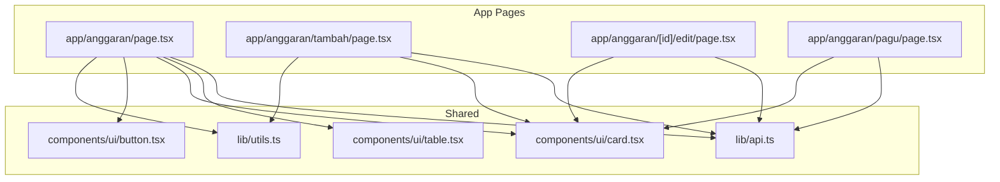
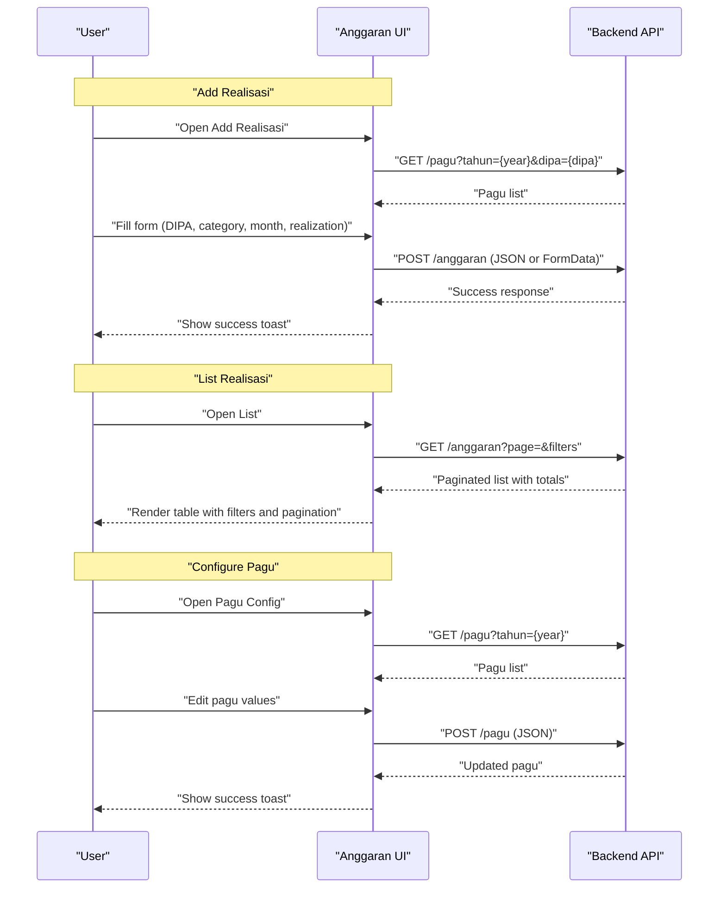
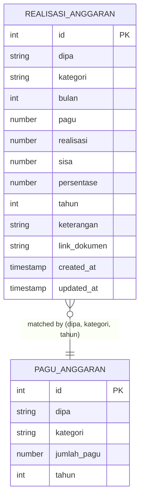
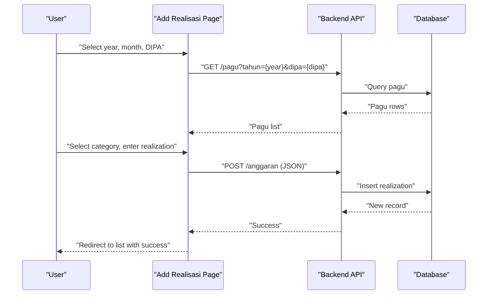
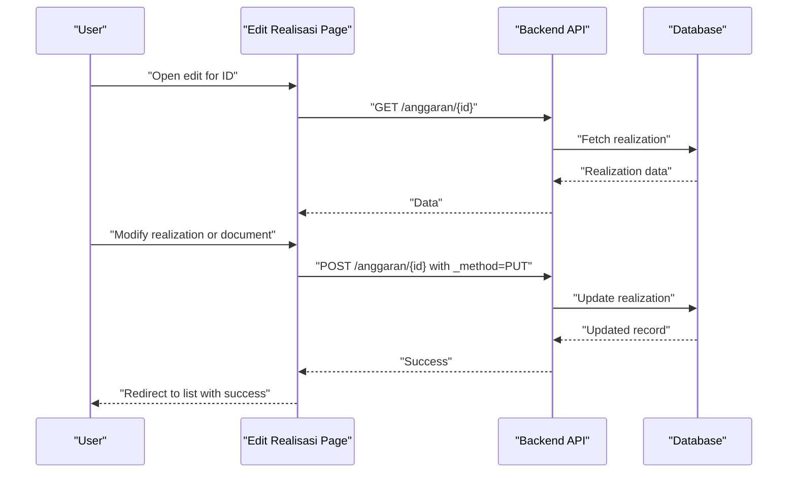
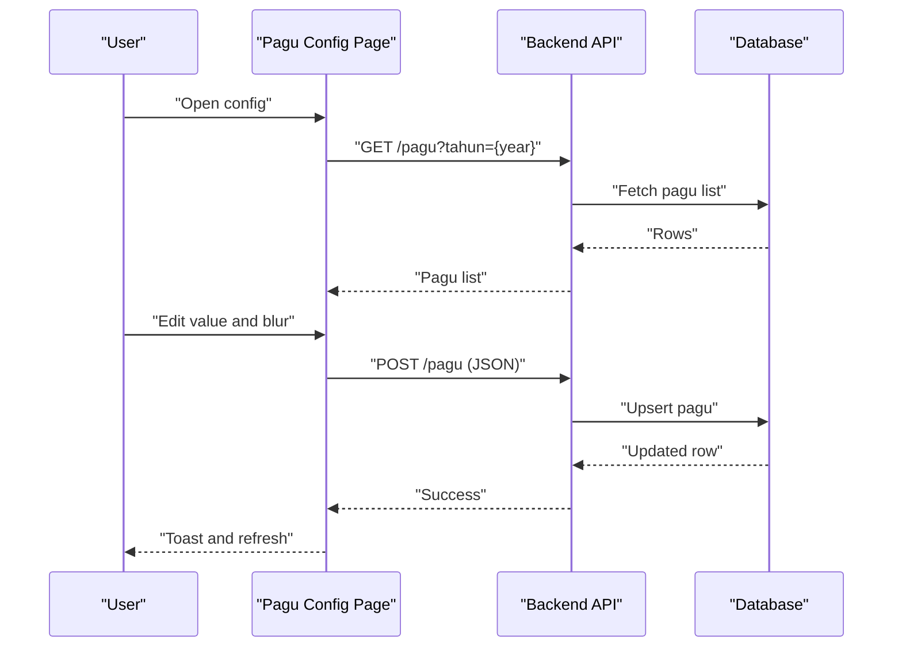
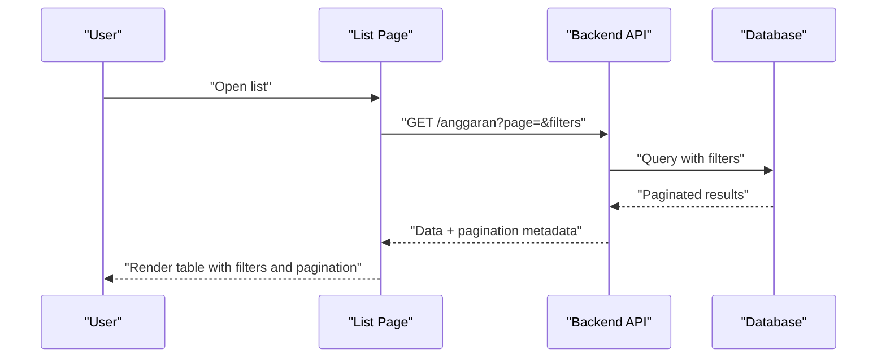
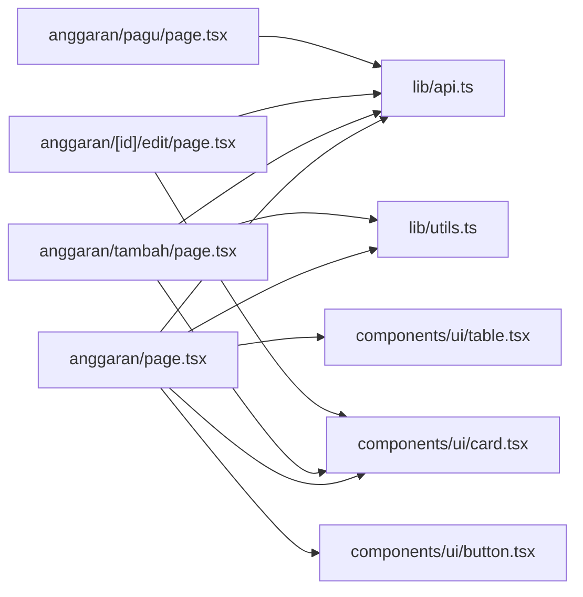

# Realisasi Anggaran (Budget Execution)

<cite>
**Referenced Files in This Document**
- [app/anggaran/page.tsx](file://app/anggaran/page.tsx)
- [app/anggaran/tambah/page.tsx](file://app/anggaran/tambah/page.tsx)
- [app/anggaran/[id]/edit/page.tsx](file://app/anggaran/[id]/edit/page.tsx)
- [app/anggaran/pagu/page.tsx](file://app/anggaran/pagu/page.tsx)
- [lib/api.ts](file://lib/api.ts)
- [lib/utils.ts](file://lib/utils.ts)
- [components/ui/table.tsx](file://components/ui/table.tsx)
- [components/ui/card.tsx](file://components/ui/card.tsx)
- [components/ui/button.tsx](file://components/ui/button.tsx)
</cite>

## Table of Contents
1. [Introduction](#introduction)
2. [Project Structure](#project-structure)
3. [Core Components](#core-components)
4. [Architecture Overview](#architecture-overview)
5. [Detailed Component Analysis](#detailed-component-analysis)
6. [Dependency Analysis](#dependency-analysis)
7. [Performance Considerations](#performance-considerations)
8. [Troubleshooting Guide](#troubleshooting-guide)
9. [Conclusion](#conclusion)
10. [Appendices](#appendices)

## Introduction
This document describes the Realisasi Anggaran (Budget Execution) module, focusing on budget execution and expenditure tracking. It documents the end-to-end workflow for recording and monitoring monthly budget disbursements, categorization of expenditures, pagu (budget ceiling) configuration, and reporting capabilities. It also explains the data model, form fields, validation rules, and UI patterns used for budget execution tracking, along with integration points to the backend API and considerations for compliance and auditability.

## Project Structure
The Realisasi Anggaran module is implemented as a Next.js app with TypeScript and a shared UI component library. The module consists of:
- Listing page for monthly budget execution records
- Form pages for adding and editing monthly realizations
- Pagu configuration page for setting budget ceilings per DIPA category
- Shared API client for backend integration
- Utility helpers for formatting and year options

**Diagram sources**
- [app/anggaran/page.tsx:1-335](file://app/anggaran/page.tsx#L1-L335)
- [app/anggaran/tambah/page.tsx:1-204](file://app/anggaran/tambah/page.tsx#L1-L204)
- [app/anggaran/[id]/edit/page.tsx](file://app/anggaran/[id]/edit/page.tsx#L1-L154)
- [app/anggaran/pagu/page.tsx:1-131](file://app/anggaran/pagu/page.tsx#L1-L131)
- [lib/api.ts:356-471](file://lib/api.ts#L356-L471)
- [lib/utils.ts:1-26](file://lib/utils.ts#L1-L26)
- [components/ui/table.tsx:1-121](file://components/ui/table.tsx#L1-L121)
- [components/ui/card.tsx:1-77](file://components/ui/card.tsx#L1-L77)
- [components/ui/button.tsx:1-58](file://components/ui/button.tsx#L1-L58)

**Section sources**
- [app/anggaran/page.tsx:1-335](file://app/anggaran/page.tsx#L1-L335)
- [app/anggaran/tambah/page.tsx:1-204](file://app/anggaran/tambah/page.tsx#L1-L204)
- [app/anggaran/[id]/edit/page.tsx](file://app/anggaran/[id]/edit/page.tsx#L1-L154)
- [app/anggaran/pagu/page.tsx:1-131](file://app/anggaran/pagu/page.tsx#L1-L131)
- [lib/api.ts:356-471](file://lib/api.ts#L356-L471)
- [lib/utils.ts:1-26](file://lib/utils.ts#L1-L26)
- [components/ui/table.tsx:1-121](file://components/ui/table.tsx#L1-L121)
- [components/ui/card.tsx:1-77](file://components/ui/card.tsx#L1-L77)
- [components/ui/button.tsx:1-58](file://components/ui/button.tsx#L1-L58)

## Core Components
- Realisasi Anggaran data model: Defines the structure of monthly budget execution records, including DIPA, category, month, pagu, realization, remaining balance, percentage, year, optional description, and document link.
- Pagu Anggaran data model: Defines the structure of budget ceilings per DIPA and category.
- API functions:
  - List, retrieve, create, update, and delete Realisasi Anggaran entries
  - List and update Pagu Anggaran entries
- UI components:
  - Table for listing monthly realizations with filters and pagination
  - Cards for forms
  - Buttons and inputs for actions and data entry

Key responsibilities:
- Monthly tracking: Users record monthly realizations per DIPA and category, optionally attaching supporting documents.
- Pagu management: Administrators configure fixed pagu per DIPA category per year.
- Reporting: Monthly summary table displays pagu, realized amount, remaining, and percentage.

**Section sources**
- [lib/api.ts:356-370](file://lib/api.ts#L356-L370)
- [lib/api.ts:429-471](file://lib/api.ts#L429-L471)
- [lib/api.ts:477-483](file://lib/api.ts#L477-L483)
- [lib/api.ts:499-515](file://lib/api.ts#L499-L515)
- [app/anggaran/page.tsx:194-271](file://app/anggaran/page.tsx#L194-L271)
- [app/anggaran/tambah/page.tsx:124-199](file://app/anggaran/tambah/page.tsx#L124-L199)
- [app/anggaran/[id]/edit/page.tsx](file://app/anggaran/[id]/edit/page.tsx#L90-L150)
- [app/anggaran/pagu/page.tsx:19-128](file://app/anggaran/pagu/page.tsx#L19-L128)

## Architecture Overview
The frontend integrates with a backend API via HTTP requests. The API supports filtering and pagination for listings, and CRUD operations for Realisasi Anggaran and Pagu Anggaran. The UI components are built with reusable primitives.

**Diagram sources**
- [app/anggaran/tambah/page.tsx:58-106](file://app/anggaran/tambah/page.tsx#L58-L106)
- [app/anggaran/page.tsx:45-71](file://app/anggaran/page.tsx#L45-L71)
- [app/anggaran/pagu/page.tsx:26-56](file://app/anggaran/pagu/page.tsx#L26-L56)
- [lib/api.ts:429-471](file://lib/api.ts#L429-L471)
- [lib/api.ts:499-515](file://lib/api.ts#L499-L515)

## Detailed Component Analysis

### Data Model: Realisasi Anggaran and Pagu Anggaran
The data model defines the core attributes for budget execution tracking and pagu configuration.

- Realisasi Anggaran fields:
  - Identifier and timestamps
  - DIPA classification (DIPA 01 or DIPA 04)
  - Category (e.g., Belanja Pegawai, Belanja Barang, Belanja Modal; POSBAKUM, Pembebasan Biaya Perkara, Sidang Di Luar Gedung)
  - Month and year
  - Pagu, realized amount, remaining balance, and calculated percentage
  - Optional description and document link
- Pagu Anggaran fields:
  - Fixed budget ceiling per DIPA and category per year

Validation and constraints inferred from UI and API:
- Required fields for creation/edit: DIPA, category, month, year, realization
- Pagu is derived from configured values per DIPA and category
- Percentage is computed as (realisasi / pagu) * 100
- Remaining balance equals pagu minus realisasi

**Diagram sources**
- [lib/api.ts:356-370](file://lib/api.ts#L356-L370)
- [lib/api.ts:477-483](file://lib/api.ts#L477-L483)

**Section sources**
- [lib/api.ts:356-370](file://lib/api.ts#L356-L370)
- [lib/api.ts:477-483](file://lib/api.ts#L477-L483)

### Monthly Realization Recording Workflow
End-to-end flow for recording monthly budget disbursements.

- Data entry pattern:
  - Year and month selection
  - DIPA selection drives category options
  - Category selection enables pagu lookup
  - Realization amount input
  - Optional document upload or manual link
- Validation:
  - Category must be selected before submission
  - Submission disabled when pagu is zero
  - Backend validation errors surfaced via toast messages

**Diagram sources**
- [app/anggaran/tambah/page.tsx:58-106](file://app/anggaran/tambah/page.tsx#L58-L106)
- [lib/api.ts:429-454](file://lib/api.ts#L429-L454)

**Section sources**
- [app/anggaran/tambah/page.tsx:39-106](file://app/anggaran/tambah/page.tsx#L39-L106)
- [lib/api.ts:429-454](file://lib/api.ts#L429-L454)

### Monthly Realization Editing Workflow
Editing existing monthly realizations.

- Data entry pattern:
  - Pre-filled form with current values
  - Optional replacement of document file
  - Save updates realization and optional document link
- Validation:
  - No explicit client-side validation shown; backend errors are handled via toast

**Diagram sources**
- [app/anggaran/[id]/edit/page.tsx](file://app/anggaran/[id]/edit/page.tsx#L40-L76)
- [lib/api.ts:456-463](file://lib/api.ts#L456-L463)

**Section sources**
- [app/anggaran/[id]/edit/page.tsx](file://app/anggaran/[id]/edit/page.tsx#L29-L76)
- [lib/api.ts:456-463](file://lib/api.ts#L456-L463)

### Pagu Configuration Workflow
Managing budget ceilings per DIPA and category.

- Data entry pattern:
  - Year selector
  - Grid of categories per DIPA with editable numeric input
  - Auto-save on blur
- Validation:
  - Numeric input for pagu values
  - Backend validation errors surfaced via toast

**Diagram sources**
- [app/anggaran/pagu/page.tsx:26-56](file://app/anggaran/pagu/page.tsx#L26-L56)
- [lib/api.ts:499-515](file://lib/api.ts#L499-L515)

**Section sources**
- [app/anggaran/pagu/page.tsx:19-128](file://app/anggaran/pagu/page.tsx#L19-L128)
- [lib/api.ts:499-515](file://lib/api.ts#L499-L515)

### Listing and Reporting Workflow
Displaying monthly realizations with filters and pagination.

- Filters:
  - DIPA (all, DIPA 01, DIPA 04)
  - Year (dynamic options)
- Columns:
  - DIPA, month, category, pagu, realized, percentage, document link, actions
- Pagination:
  - Current page, last page, total count
  - Navigation controls with ellipsis for large page ranges

**Diagram sources**
- [app/anggaran/page.tsx:45-71](file://app/anggaran/page.tsx#L45-L71)
- [lib/api.ts:429-439](file://lib/api.ts#L429-L439)
- [lib/utils.ts:8-16](file://lib/utils.ts#L8-L16)

**Section sources**
- [app/anggaran/page.tsx:31-335](file://app/anggaran/page.tsx#L31-L335)
- [lib/api.ts:429-439](file://lib/api.ts#L429-L439)
- [lib/utils.ts:8-16](file://lib/utils.ts#L8-L16)

### Approval Workflows and Compliance
- The frontend does not implement explicit approval steps. Approval logic would typically be enforced by the backend API and reflected in additional status fields or audit trails.
- Audit trail: Each record includes created_at and updated_at timestamps, enabling basic auditability.
- Compliance: The module supports document linkage (upload or external link), aiding transparency and compliance with financial disclosure requirements.

[No sources needed since this section provides general guidance]

### Expenditure Categories and Hierarchies
- DIPA 01 categories: Belanja Pegawai, Belanja Barang, Belanja Modal
- DIPA 04 categories: POSBAKUM, Pembebasan Biaya Perkara, Sidang Di Luar Gedung
- Hierarchies:
  - DIPA → Category → Monthly Realization
  - Pagu is configured per DIPA and Category per Year

**Section sources**
- [app/anggaran/tambah/page.tsx:34-37](file://app/anggaran/tambah/page.tsx#L34-L37)
- [app/anggaran/[id]/edit/page.tsx](file://app/anggaran/[id]/edit/page.tsx#L24-L27)
- [app/anggaran/pagu/page.tsx:14-17](file://app/anggaran/pagu/page.tsx#L14-L17)

### Performance Metrics and Calculations
- Percentage: (realisasi / pagu) * 100
- Remaining: pagu - realisasi
- Monthly reporting template fields:
  - DIPA, category, month, year
  - Pagu, realized, remaining, percentage
  - Document link

**Section sources**
- [lib/api.ts:356-370](file://lib/api.ts#L356-L370)
- [app/anggaran/page.tsx:235-241](file://app/anggaran/page.tsx#L235-L241)

## Dependency Analysis
The module exhibits low coupling and high cohesion:
- UI pages depend on shared API functions and utilities
- API functions encapsulate HTTP concerns and response normalization
- UI components are reused across pages

**Diagram sources**
- [app/anggaran/page.tsx:1-335](file://app/anggaran/page.tsx#L1-L335)
- [app/anggaran/tambah/page.tsx:1-204](file://app/anggaran/tambah/page.tsx#L1-L204)
- [app/anggaran/[id]/edit/page.tsx](file://app/anggaran/[id]/edit/page.tsx#L1-L154)
- [app/anggaran/pagu/page.tsx:1-131](file://app/anggaran/pagu/page.tsx#L1-L131)
- [lib/api.ts:356-471](file://lib/api.ts#L356-L471)
- [lib/utils.ts:1-26](file://lib/utils.ts#L1-L26)
- [components/ui/table.tsx:1-121](file://components/ui/table.tsx#L1-L121)
- [components/ui/card.tsx:1-77](file://components/ui/card.tsx#L1-L77)
- [components/ui/button.tsx:1-58](file://components/ui/button.tsx#L1-L58)

**Section sources**
- [lib/api.ts:356-471](file://lib/api.ts#L356-L471)
- [lib/utils.ts:1-26](file://lib/utils.ts#L1-L26)
- [components/ui/table.tsx:1-121](file://components/ui/table.tsx#L1-L121)
- [components/ui/card.tsx:1-77](file://components/ui/card.tsx#L1-L77)
- [components/ui/button.tsx:1-58](file://components/ui/button.tsx#L1-L58)

## Performance Considerations
- Pagination: The listing endpoint supports pagination and filtering to reduce payload sizes.
- Currency formatting: Formatting is performed client-side; consider server-side formatting for large datasets.
- Network efficiency: API responses include pagination metadata to avoid unnecessary client-side computations.

[No sources needed since this section provides general guidance]

## Troubleshooting Guide
Common issues and resolutions:
- API connectivity failures:
  - Symptoms: Toast indicates failure to load data or save
  - Resolution: Verify NEXT_PUBLIC_API_URL and NEXT_PUBLIC_API_KEY environment variables; retry after confirming backend availability
- Validation errors on save:
  - Symptoms: Toast reports field-specific errors
  - Resolution: Ensure category is selected and realization is a valid number; re-check pagu configuration
- Document upload problems:
  - Symptoms: Save succeeds but document link is missing
  - Resolution: Confirm file type and size limits; try uploading again or use a direct link

**Section sources**
- [app/anggaran/page.tsx:63-69](file://app/anggaran/page.tsx#L63-L69)
- [app/anggaran/tambah/page.tsx:102-105](file://app/anggaran/tambah/page.tsx#L102-L105)
- [app/anggaran/[id]/edit/page.tsx](file://app/anggaran/[id]/edit/page.tsx#L74-L76)

## Conclusion
The Realisasi Anggaran module provides a streamlined solution for monthly budget execution tracking, pagu configuration, and reporting. It leverages a clean data model, reusable UI components, and a robust API integration to support transparency and accountability. Future enhancements could include explicit approval workflows, richer reporting dashboards, and server-side calculations for performance and consistency.

## Appendices

### Form Fields and Validation Rules
- Add/Edit Realisasi:
  - Required: DIPA, category, month, year, realization
  - Optional: description, document file or link
  - Validation: category must be selected; submission disabled when pagu is zero
- Pagu Config:
  - Required: numeric pagu per DIPA and category
  - Validation: auto-save on blur; errors surfaced via toast

**Section sources**
- [app/anggaran/tambah/page.tsx:71-106](file://app/anggaran/tambah/page.tsx#L71-L106)
- [app/anggaran/[id]/edit/page.tsx](file://app/anggaran/[id]/edit/page.tsx#L52-L76)
- [app/anggaran/pagu/page.tsx:39-56](file://app/anggaran/pagu/page.tsx#L39-L56)

### Monthly Reporting Template
- Columns: DIPA, category, month, year, pagu, realized, remaining, percentage, document link
- Filters: DIPA, year
- Pagination: current page, last page, total

**Section sources**
- [app/anggaran/page.tsx:194-307](file://app/anggaran/page.tsx#L194-L307)

### Performance Analysis Implementation Notes
- Percentage and remaining calculations occur client-side; consider moving to server-side for consistency and performance
- Currency formatting uses locale-aware formatting; ensure consistent locale handling across environments

**Section sources**
- [lib/utils.ts:18-25](file://lib/utils.ts#L18-L25)
- [app/anggaran/page.tsx:97-103](file://app/anggaran/page.tsx#L97-L103)