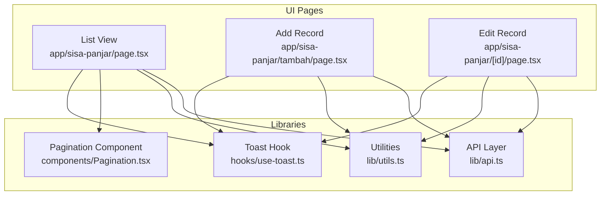
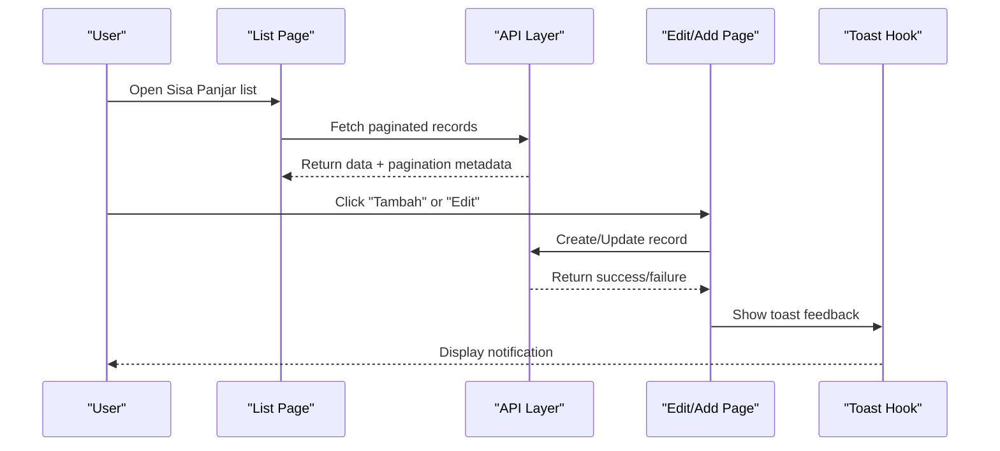
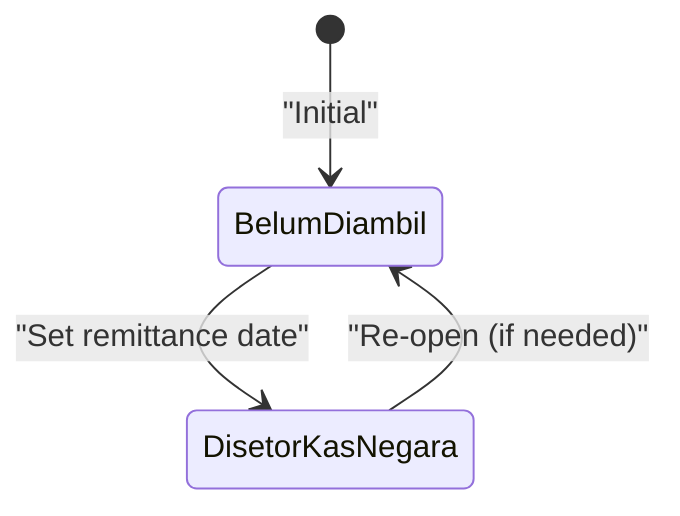
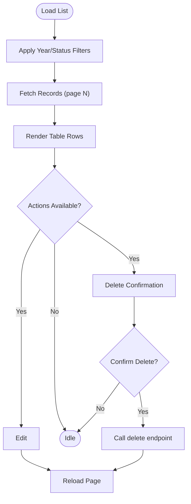
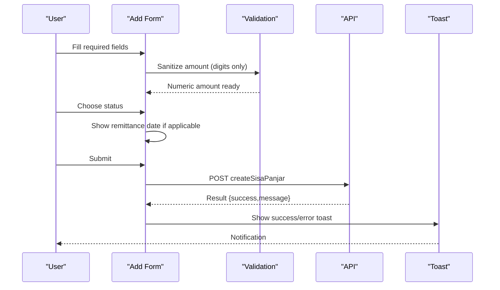
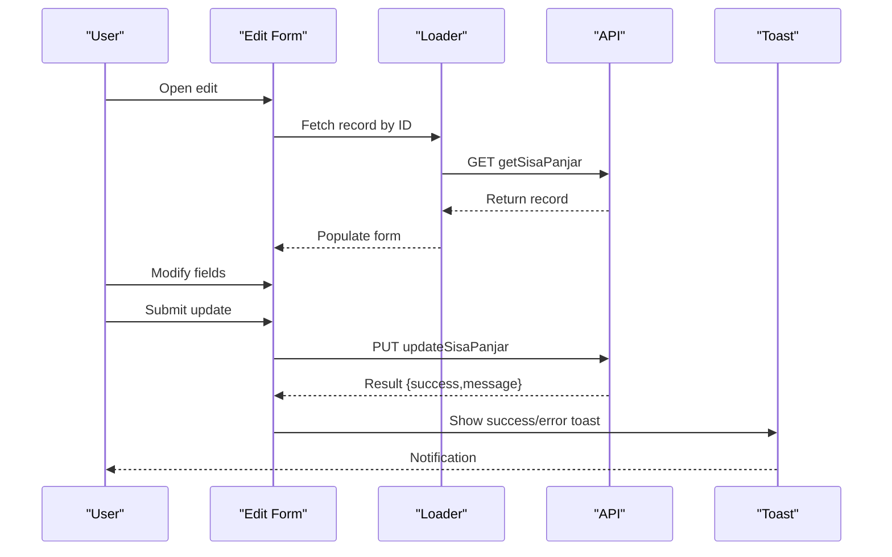
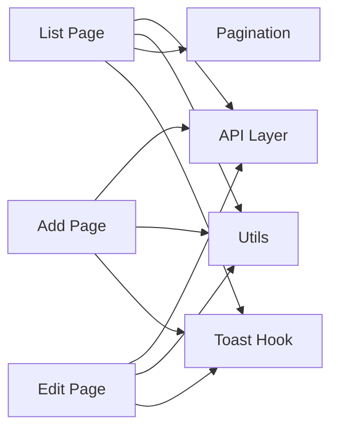

# Sisa Panjar (Advance Payments)

<cite>
**Referenced Files in This Document**
- [page.tsx](file://app/sisa-panjar/page.tsx)
- [page.tsx](file://app/sisa-panjar/tambah/page.tsx)
- [page.tsx](file://app/sisa-panjar/[id]/page.tsx)
- [api.ts](file://lib/api.ts)
- [utils.ts](file://lib/utils.ts)
- [Pagination.tsx](file://components/Pagination.tsx)
- [use-toast.ts](file://hooks/use-toast.ts)
</cite>

## Table of Contents
1. [Introduction](#introduction)
2. [Project Structure](#project-structure)
3. [Core Components](#core-components)
4. [Architecture Overview](#architecture-overview)
5. [Detailed Component Analysis](#detailed-component-analysis)
6. [Dependency Analysis](#dependency-analysis)
7. [Performance Considerations](#performance-considerations)
8. [Troubleshooting Guide](#troubleshooting-guide)
9. [Conclusion](#conclusion)

## Introduction
This document describes the Sisa Panjar module responsible for managing court advance payment records and refund tracking. It covers the complete workflow for recording advance payments, updating refund statuses, and maintaining accurate balance tracking for court cases. The module provides:
- Advance payment registration with validation and formatting
- Refund processing workflows when funds are remitted to the state treasury
- Balance tracking across months and years
- Integration with backend financial systems via API endpoints
- Compliance with payment regulations through structured data entry and audit-ready fields

## Project Structure
The Sisa Panjar module consists of three primary Next.js pages and supporting libraries:
- List view: displays paginated records with filters and actions
- Add record: captures new advance payment entries
- Edit record: updates existing entries and refund status
- API integration: typed endpoints for CRUD operations and status transitions
- Utilities: year options, currency formatting, month name mapping
- UI components: pagination, toast notifications, and form controls

**Diagram sources**
- [page.tsx:1-318](file://app/sisa-panjar/page.tsx#L1-L318)
- [page.tsx:1-244](file://app/sisa-panjar/tambah/page.tsx#L1-L244)
- [page.tsx:1-303](file://app/sisa-panjar/[id]/page.tsx#L1-L303)
- [api.ts:938-1008](file://lib/api.ts#L938-L1008)
- [utils.ts:1-26](file://lib/utils.ts#L1-L26)
- [Pagination.tsx:1-153](file://components/Pagination.tsx#L1-L153)
- [use-toast.ts:1-195](file://hooks/use-toast.ts#L1-L195)

**Section sources**
- [page.tsx:1-318](file://app/sisa-panjar/page.tsx#L1-L318)
- [page.tsx:1-244](file://app/sisa-panjar/tambah/page.tsx#L1-L244)
- [page.tsx:1-303](file://app/sisa-panjar/[id]/page.tsx#L1-L303)
- [api.ts:938-1008](file://lib/api.ts#L938-L1008)
- [utils.ts:1-26](file://lib/utils.ts#L1-L26)
- [Pagination.tsx:1-153](file://components/Pagination.tsx#L1-L153)
- [use-toast.ts:1-195](file://hooks/use-toast.ts#L1-L195)

## Core Components
- Data model: SisaPanjar with fields for year, month, case number, claimant name, amount, status, and optional remittance date
- Status lifecycle: "belum_diambil" (not yet collected) and "disetor_kas_negara" (remitted to state treasury)
- Form validation: required fields enforced at UI level; numeric sanitization for amount field
- Currency display: Indonesian Rupiah formatting for monetary values
- Pagination: server-side pagination with client-side rendering and ellipsis navigation
- Notifications: toast-based feedback for success, errors, and warnings

**Section sources**
- [api.ts:943-954](file://lib/api.ts#L943-L954)
- [api.ts](file://lib/api.ts#L941)
- [page.tsx:17-25](file://app/sisa-panjar/tambah/page.tsx#L17-L25)
- [page.tsx:28-32](file://app/sisa-panjar/page.tsx#L28-L32)
- [utils.ts:18-25](file://lib/utils.ts#L18-L25)
- [Pagination.tsx:11-38](file://components/Pagination.tsx#L11-L38)

## Architecture Overview
The Sisa Panjar module follows a clean separation of concerns:
- UI pages manage state, user interactions, and navigation
- API layer encapsulates HTTP requests and response normalization
- Utilities provide shared helpers for formatting and options
- Toast hook centralizes notification behavior
- Pagination component renders navigable page sets

**Diagram sources**
- [page.tsx:48-76](file://app/sisa-panjar/page.tsx#L48-L76)
- [page.tsx:64-100](file://app/sisa-panjar/tambah/page.tsx#L64-L100)
- [page.tsx:100-136](file://app/sisa-panjar/[id]/page.tsx#L100-L136)
- [api.ts:961-976](file://lib/api.ts#L961-L976)
- [api.ts:984-1000](file://lib/api.ts#L984-L1000)
- [use-toast.ts:145-172](file://hooks/use-toast.ts#L145-L172)

## Detailed Component Analysis

### Data Model and Status Management
The SisaPanjar entity defines the core fields used across all workflows:
- Year and month: grouping and reporting dimensions
- Case number and claimant name: identification and audit fields
- Amount: numeric field with input sanitization
- Status: controlled vocabulary with two states
- Remittance date: optional, populated when status transitions to remitted

Status transitions:
- Initial state: belum_diambil
- Transition: disetor_kas_negara with optional remittance date capture

**Diagram sources**
- [api.ts](file://lib/api.ts#L941)
- [api.ts:943-954](file://lib/api.ts#L943-L954)
- [page.tsx:213-224](file://app/sisa-panjar/tambah/page.tsx#L213-L224)
- [page.tsx:272-283](file://app/sisa-panjar/[id]/page.tsx#L272-L283)

**Section sources**
- [api.ts:943-954](file://lib/api.ts#L943-L954)
- [api.ts](file://lib/api.ts#L941)
- [page.tsx:17-25](file://app/sisa-panjar/tambah/page.tsx#L17-L25)
- [page.tsx:18-26](file://app/sisa-panjar/[id]/page.tsx#L18-L26)

### List View Workflow
The list view provides:
- Filtering by year and status
- Pagination with ellipsis navigation
- Actions: edit and delete
- Currency formatting for amounts
- Status badges for quick recognition

**Diagram sources**
- [page.tsx:48-76](file://app/sisa-panjar/page.tsx#L48-L76)
- [page.tsx:105-139](file://app/sisa-panjar/page.tsx#L105-L139)
- [page.tsx:224-252](file://app/sisa-panjar/page.tsx#L224-L252)
- [api.ts:961-976](file://lib/api.ts#L961-L976)
- [api.ts:1002-1008](file://lib/api.ts#L1002-L1008)

**Section sources**
- [page.tsx:34-103](file://app/sisa-panjar/page.tsx#L34-L103)
- [page.tsx:157-294](file://app/sisa-panjar/page.tsx#L157-L294)
- [page.tsx:296-315](file://app/sisa-panjar/page.tsx#L296-L315)
- [api.ts:961-976](file://lib/api.ts#L961-L976)
- [Pagination.tsx:11-38](file://components/Pagination.tsx#L11-L38)

### Add Record Workflow
The add form enforces required fields and sanitizes numeric input:
- Year and month selection from generated options
- Case number and claimant name inputs
- Amount input restricted to numeric characters
- Status selection with conditional remittance date field
- Submission handled with toast feedback

**Diagram sources**
- [page.tsx:27-100](file://app/sisa-panjar/tambah/page.tsx#L27-L100)
- [page.tsx:120-238](file://app/sisa-panjar/tambah/page.tsx#L120-L238)
- [api.ts:984-991](file://lib/api.ts#L984-L991)
- [use-toast.ts:145-172](file://hooks/use-toast.ts#L145-L172)

**Section sources**
- [page.tsx:27-100](file://app/sisa-panjar/tambah/page.tsx#L27-L100)
- [page.tsx:120-238](file://app/sisa-panjar/tambah/page.tsx#L120-L238)
- [utils.ts:8-16](file://lib/utils.ts#L8-L16)
- [api.ts:984-991](file://lib/api.ts#L984-L991)
- [use-toast.ts:145-172](file://hooks/use-toast.ts#L145-L172)

### Edit Record Workflow
The edit form mirrors the add form with pre-filled data and update submission:
- Load existing record by ID
- Conditional rendering of remittance date based on status
- Update submission with toast feedback

**Diagram sources**
- [page.tsx:28-76](file://app/sisa-panjar/[id]/page.tsx#L28-L76)
- [page.tsx:178-297](file://app/sisa-panjar/[id]/page.tsx#L178-L297)
- [api.ts:978-982](file://lib/api.ts#L978-L982)
- [api.ts:993-999](file://lib/api.ts#L993-L999)
- [use-toast.ts:145-172](file://hooks/use-toast.ts#L145-L172)

**Section sources**
- [page.tsx:28-76](file://app/sisa-panjar/[id]/page.tsx#L28-L76)
- [page.tsx:178-297](file://app/sisa-panjar/[id]/page.tsx#L178-L297)
- [api.ts:978-982](file://lib/api.ts#L978-L982)
- [api.ts:993-999](file://lib/api.ts#L993-L999)
- [use-toast.ts:145-172](file://hooks/use-toast.ts#L145-L172)

### Payment Amount Entry and Validation
- Amount input accepts only digits, converting to integer internally
- Placeholder examples guide users on expected format
- Required field enforcement ensures completeness
- Currency formatting displays amounts in Indonesian Rupiah

**Section sources**
- [page.tsx:42-50](file://app/sisa-panjar/tambah/page.tsx#L42-L50)
- [page.tsx:180-193](file://app/sisa-panjar/tambah/page.tsx#L180-L193)
- [page.tsx:78-86](file://app/sisa-panjar/[id]/page.tsx#L78-L86)
- [page.tsx:240-252](file://app/sisa-panjar/[id]/page.tsx#L240-L252)
- [utils.ts:18-25](file://lib/utils.ts#L18-L25)

### Refund Procedures and Remittance Date Capture
- When status is set to "disetor_kas_negara", the remittance date becomes mandatory
- The form conditionally renders the date input only when this status is selected
- On submit, the remittance date is included only if present and status requires it

**Section sources**
- [page.tsx:60-74](file://app/sisa-panjar/tambah/page.tsx#L60-L74)
- [page.tsx:213-224](file://app/sisa-panjar/tambah/page.tsx#L213-L224)
- [page.tsx:96-110](file://app/sisa-panjar/[id]/page.tsx#L96-L110)
- [page.tsx:272-283](file://app/sisa-panjar/[id]/page.tsx#L272-L283)

### Balance Tracking Implementation
- Outstanding balances are represented by the sum of records with status "belum_diambil"
- Monthly and yearly filtering enables granular tracking
- Pagination supports efficient browsing of large datasets

**Section sources**
- [page.tsx:28-32](file://app/sisa-panjar/page.tsx#L28-L32)
- [api.ts:961-976](file://lib/api.ts#L961-L976)

### Audit Trail Maintenance
- All create/update/delete operations are exposed via typed API endpoints
- Response normalization ensures consistent success/error messaging
- Toast notifications provide immediate feedback for audit events

**Section sources**
- [api.ts:984-1008](file://lib/api.ts#L984-L1008)
- [use-toast.ts:145-172](file://hooks/use-toast.ts#L145-L172)

## Dependency Analysis
The Sisa Panjar module exhibits low coupling and high cohesion:
- UI pages depend on the API layer for data operations
- Utilities are shared across pages for formatting and options
- Pagination and toast components are reusable across the application
- No circular dependencies detected among the focused files

**Diagram sources**
- [page.tsx:3-7](file://app/sisa-panjar/page.tsx#L3-L7)
- [page.tsx:3-8](file://app/sisa-panjar/tambah/page.tsx#L3-L8)
- [page.tsx:3-8](file://app/sisa-panjar/[id]/page.tsx#L3-L8)
- [api.ts:938-1008](file://lib/api.ts#L938-L1008)
- [utils.ts:1-26](file://lib/utils.ts#L1-L26)
- [Pagination.tsx:1-153](file://components/Pagination.tsx#L1-L153)
- [use-toast.ts:1-195](file://hooks/use-toast.ts#L1-L195)

**Section sources**
- [page.tsx:3-7](file://app/sisa-panjar/page.tsx#L3-L7)
- [page.tsx:3-8](file://app/sisa-panjar/tambah/page.tsx#L3-L8)
- [page.tsx:3-8](file://app/sisa-panjar/[id]/page.tsx#L3-L8)
- [api.ts:938-1008](file://lib/api.ts#L938-L1008)
- [utils.ts:1-26](file://lib/utils.ts#L1-L26)
- [Pagination.tsx:1-153](file://components/Pagination.tsx#L1-L153)
- [use-toast.ts:1-195](file://hooks/use-toast.ts#L1-L195)

## Performance Considerations
- Client-side pagination reduces server load for small-to-medium datasets
- Numeric sanitization prevents unnecessary re-renders and invalid submissions
- Toast notifications are limited to one at a time to reduce DOM churn
- Currency formatting uses built-in locale support for efficient rendering

## Troubleshooting Guide
Common issues and resolutions:
- API connectivity failures: Verify NEXT_PUBLIC_API_URL and NEXT_PUBLIC_API_KEY environment variables; check network tab for 4xx/5xx responses
- Form submission errors: Inspect normalized response messages; ensure required fields are filled and amount contains only digits
- Pagination anomalies: Confirm page parameter propagation and last_page metadata alignment
- Toast not appearing: Ensure useToast is initialized and mounted in the application shell

**Section sources**
- [api.ts:1-4](file://lib/api.ts#L1-L4)
- [page.tsx:64-70](file://app/sisa-panjar/page.tsx#L64-L70)
- [page.tsx:89-97](file://app/sisa-panjar/tambah/page.tsx#L89-L97)
- [page.tsx:127-133](file://app/sisa-panjar/[id]/page.tsx#L127-L133)
- [use-toast.ts:145-172](file://hooks/use-toast.ts#L145-L172)

## Conclusion
The Sisa Panjar module provides a robust foundation for managing court advance payments and refunds. Its design emphasizes:
- Clear status lifecycle and conditional UI behavior
- Strong data validation and sanitization
- Efficient pagination and responsive UI patterns
- Consistent audit-ready operations through typed API endpoints

Future enhancements could include:
- Export capabilities for monthly reports
- Bulk operations for status updates
- Advanced filtering and search across multiple fields
- Integration with external treasury systems for automated remittance tracking