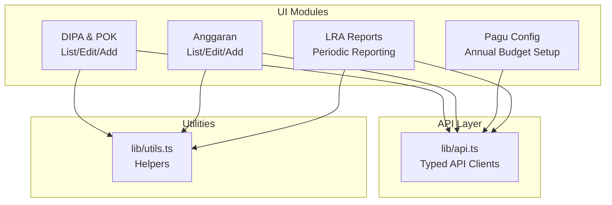
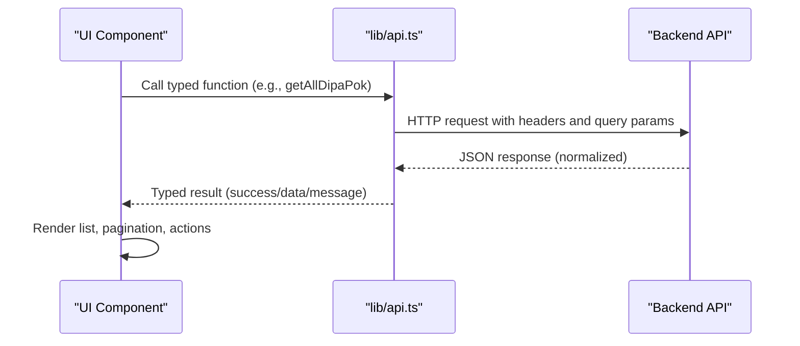
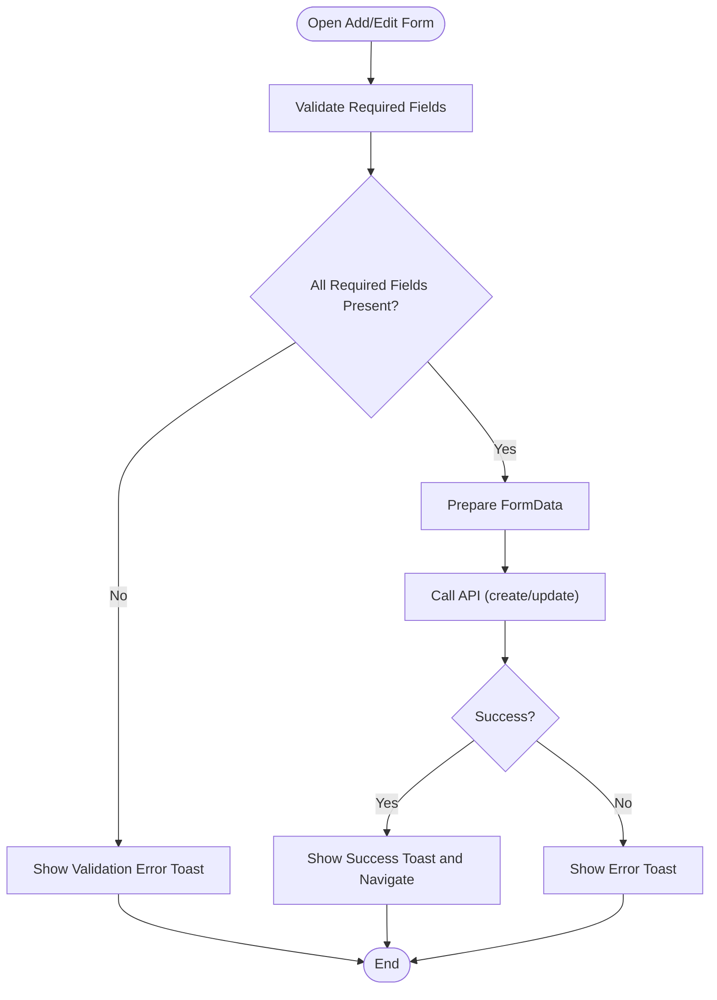
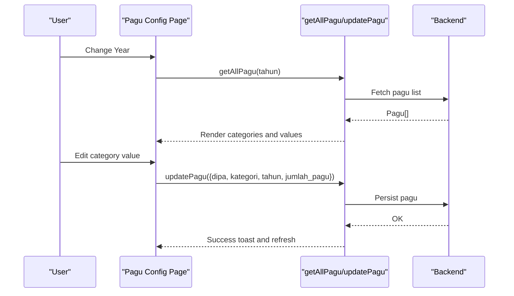
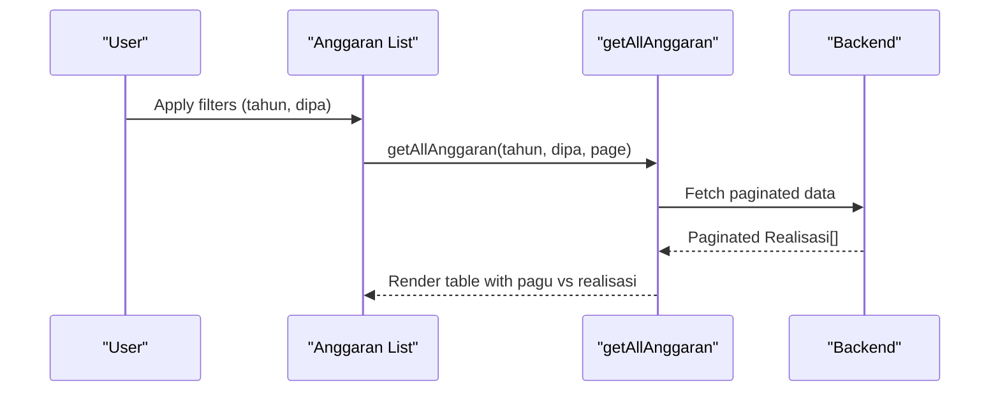
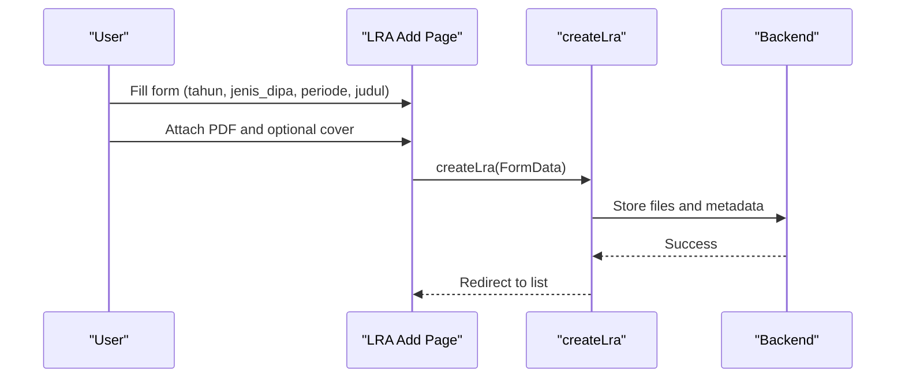
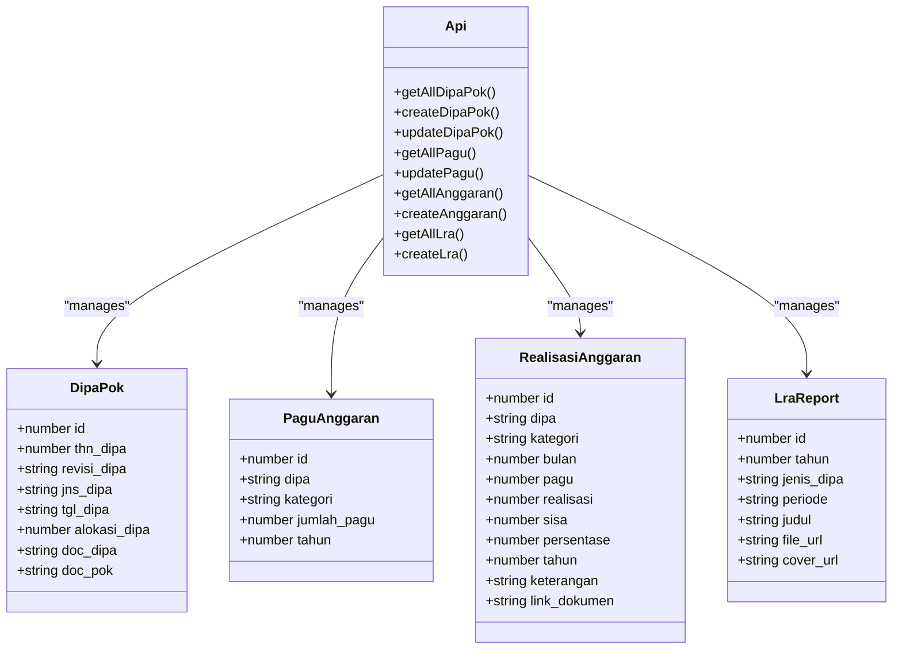

# DIPA & POK Overview

<cite>
**Referenced Files in This Document**
- [app/dipapok/page.tsx](file://app/dipapok/page.tsx)
- [app/dipapok/tambah/page.tsx](file://app/dipapok/tambah/page.tsx)
- [app/dipapok/[id]/edit/page.tsx](file://app/dipapok/[id]/edit/page.tsx)
- [lib/api.ts](file://lib/api.ts)
- [lib/utils.ts](file://lib/utils.ts)
- [app/anggaran/pagu/page.tsx](file://app/anggaran/pagu/page.tsx)
- [app/anggaran/page.tsx](file://app/anggaran/page.tsx)
- [app/anggaran/tambah/page.tsx](file://app/anggaran/tambah/page.tsx)
- [app/lra/page.tsx](file://app/lra/page.tsx)
- [app/lra/tambah/page.tsx](file://app/lra/tambah/page.tsx)
</cite>

## Table of Contents
1. [Introduction](#introduction)
2. [Project Structure](#project-structure)
3. [Core Components](#core-components)
4. [Architecture Overview](#architecture-overview)
5. [Detailed Component Analysis](#detailed-component-analysis)
6. [Dependency Analysis](#dependency-analysis)
7. [Performance Considerations](#performance-considerations)
8. [Troubleshooting Guide](#troubleshooting-guide)
9. [Conclusion](#conclusion)

## Introduction
This document provides a comprehensive overview of the DIPA & POK module within the admin panel, focusing on Budget Framework and Policy Management systems. It explains how budget frameworks are established, policies are documented, and strategic planning outputs are integrated. The guide covers the end-to-end workflow from framework creation and policy development to compliance monitoring and reporting, including form fields, validation rules, data entry patterns, categories, types, timelines, integrations, regulatory compliance, and audit trail maintenance.

## Project Structure
The DIPA & POK module is organized around three primary areas:
- DIPA & POK management: viewing, creating, editing, and deleting DIPA documents and POK documents.
- Budget framework configuration: setting annual budgets (pagu) per DIPA category.
- Strategic reporting: managing LRA (Laporan Realisasi Anggaran) reports aligned with DIPA types and periods.

**Diagram sources**
- [app/dipapok/page.tsx:28-335](file://app/dipapok/page.tsx#L28-L335)
- [app/anggaran/page.tsx:31-335](file://app/anggaran/page.tsx#L31-L335)
- [app/anggaran/pagu/page.tsx:19-131](file://app/anggaran/pagu/page.tsx#L19-L131)
- [app/lra/page.tsx:27-320](file://app/lra/page.tsx#L27-L320)
- [lib/api.ts:473-578](file://lib/api.ts#L473-L578)
- [lib/utils.ts:8-25](file://lib/utils.ts#L8-L25)

**Section sources**
- [app/dipapok/page.tsx:28-335](file://app/dipapok/page.tsx#L28-L335)
- [app/anggaran/page.tsx:31-335](file://app/anggaran/page.tsx#L31-L335)
- [app/anggaran/pagu/page.tsx:19-131](file://app/anggaran/pagu/page.tsx#L19-L131)
- [app/lra/page.tsx:27-320](file://app/lra/page.tsx#L27-L320)
- [lib/api.ts:473-578](file://lib/api.ts#L473-L578)
- [lib/utils.ts:8-25](file://lib/utils.ts#L8-L25)

## Core Components
- DIPA & POK Management
  - List view with filters (year, search), pagination, and actions (edit, delete).
  - Add view with mandatory fields: year, date, type, revision, allocation, and optional PDF attachments.
  - Edit view mirrors add with dynamic revision availability based on year/type and optional file updates.
- Budget Framework (Pagu)
  - Annual budget configuration per DIPA type and category.
  - Categories include “DIPA 01” and “DIPA 04,” with subcategories such as “Belanja Pegawai,” “Belanja Barang,” “Belanja Modal,” “POSBAKUM,” “Pembebasan Biaya Perkara,” and “Sidang Di Luar Gedung.”
- Realization (Anggaran)
  - Monthly realization records linked to DIPA and category, with pagu vs. realization comparison and percentage.
- LRA Reporting
  - Periodic LRA reports (semester_1, semester_2, unaudited, audited) aligned with DIPA types.

**Section sources**
- [app/dipapok/page.tsx:28-335](file://app/dipapok/page.tsx#L28-L335)
- [app/dipapok/tambah/page.tsx:32-238](file://app/dipapok/tambah/page.tsx#L32-L238)
- [app/dipapok/[id]/edit/page.tsx](file://app/dipapok/[id]/edit/page.tsx#L32-L272)
- [app/anggaran/pagu/page.tsx:14-131](file://app/anggaran/pagu/page.tsx#L14-L131)
- [app/anggaran/page.tsx:29-335](file://app/anggaran/page.tsx#L29-L335)
- [app/lra/page.tsx:27-320](file://app/lra/page.tsx#L27-L320)

## Architecture Overview
The frontend components communicate with backend APIs via typed clients. Data flows from UI forms to API endpoints, which enforce validation and persist records. Utilities support year options and currency formatting.

**Diagram sources**
- [lib/api.ts:529-578](file://lib/api.ts#L529-L578)
- [app/dipapok/page.tsx:42-66](file://app/dipapok/page.tsx#L42-L66)

**Section sources**
- [lib/api.ts:43-91](file://lib/api.ts#L43-L91)
- [lib/api.ts:529-578](file://lib/api.ts#L529-L578)
- [app/dipapok/page.tsx:42-66](file://app/dipapok/page.tsx#L42-L66)

## Detailed Component Analysis

### DIPA & POK Management
- Purpose: Manage DIPA and POK documents with metadata and attachments.
- Key fields:
  - Year, Date, Type, Revision, Allocation, Optional PDFs for DIPA and POK.
- Validation rules:
  - Required fields enforced on add/edit.
  - Revision availability dynamically computed based on selected year and type.
  - PDF uploads restricted to PDF format.
- Data entry patterns:
  - Add: Submit FormData with numeric and file fields.
  - Edit: Submit partial updates; optional file replacement.
- Compliance and audit:
  - Created/updated timestamps exposed in model; UI surfaces these for transparency.

**Diagram sources**
- [app/dipapok/tambah/page.tsx:71-102](file://app/dipapok/tambah/page.tsx#L71-L102)
- [app/dipapok/[id]/edit/page.tsx](file://app/dipapok/[id]/edit/page.tsx#L95-L122)

**Section sources**
- [app/dipapok/page.tsx:28-335](file://app/dipapok/page.tsx#L28-L335)
- [app/dipapok/tambah/page.tsx:32-238](file://app/dipapok/tambah/page.tsx#L32-L238)
- [app/dipapok/[id]/edit/page.tsx](file://app/dipapok/[id]/edit/page.tsx#L32-L272)
- [lib/api.ts:529-578](file://lib/api.ts#L529-L578)

### Budget Framework (Pagu) Configuration
- Purpose: Define annual budget ceilings per DIPA and category.
- Categories:
  - DIPA 01: Belanja Pegawai, Belanja Barang, Belanja Modal
  - DIPA 04: POSBAKUM, Pembebasan Biaya Perkara, Sidang Di Luar Gedung
- Workflow:
  - Select year → Load existing pagu → Edit numeric values → Auto-save on blur.
- Integration:
  - Realization entries reference pagu to compute progress and percentages.

**Diagram sources**
- [app/anggaran/pagu/page.tsx:26-56](file://app/anggaran/pagu/page.tsx#L26-L56)
- [lib/api.ts:499-523](file://lib/api.ts#L499-L523)

**Section sources**
- [app/anggaran/pagu/page.tsx:14-131](file://app/anggaran/pagu/page.tsx#L14-L131)
- [lib/api.ts:477-483](file://lib/api.ts#L477-L483)
- [lib/api.ts:499-523](file://lib/api.ts#L499-L523)

### Realization (Anggaran) Management
- Purpose: Track monthly spending against pagu per DIPA and category.
- Key fields: DIPA, Month, Category, Pagu, Realisasi, Percentage, Optional Document Link.
- Filters: Year and DIPA type.
- UI: Currency formatting, percentage badges, pagination, and action buttons.

**Diagram sources**
- [app/anggaran/page.tsx:45-71](file://app/anggaran/page.tsx#L45-L71)
- [lib/api.ts:429-471](file://lib/api.ts#L429-L471)

**Section sources**
- [app/anggaran/page.tsx:29-335](file://app/anggaran/page.tsx#L29-L335)
- [lib/api.ts:356-370](file://lib/api.ts#L356-L370)
- [lib/api.ts:429-471](file://lib/api.ts#L429-L471)

### LRA Reporting (Strategic Planning Outputs)
- Purpose: Publish periodic financial reports aligned with DIPA types and periods.
- Types: DIPA 01, DIPA 04; Periods: semester_1, semester_2, unaudited, audited.
- Workflow: Upload PDF and optional cover image; link stored for public access.

**Diagram sources**
- [app/lra/tambah/page.tsx:36-87](file://app/lra/tambah/page.tsx#L36-L87)
- [lib/api.ts:1091-1141](file://lib/api.ts#L1091-L1141)

**Section sources**
- [app/lra/page.tsx:27-320](file://app/lra/page.tsx#L27-L320)
- [app/lra/tambah/page.tsx:17-229](file://app/lra/tambah/page.tsx#L17-L229)
- [lib/api.ts:1079-1089](file://lib/api.ts#L1079-L1089)
- [lib/api.ts:1091-1141](file://lib/api.ts#L1091-L1141)

## Dependency Analysis
- UI components depend on typed API clients for data fetching and mutations.
- Utilities provide shared helpers (year options, currency formatting).
- Data models define the shape of requests/responses across modules.

**Diagram sources**
- [lib/api.ts:485-497](file://lib/api.ts#L485-L497)
- [lib/api.ts:477-483](file://lib/api.ts#L477-L483)
- [lib/api.ts:356-370](file://lib/api.ts#L356-L370)
- [lib/api.ts:1079-1089](file://lib/api.ts#L1079-L1089)
- [lib/api.ts:529-578](file://lib/api.ts#L529-L578)
- [lib/api.ts:499-523](file://lib/api.ts#L499-L523)
- [lib/api.ts:429-471](file://lib/api.ts#L429-L471)
- [lib/api.ts:1091-1141](file://lib/api.ts#L1091-L1141)

**Section sources**
- [lib/api.ts:485-497](file://lib/api.ts#L485-L497)
- [lib/api.ts:477-483](file://lib/api.ts#L477-L483)
- [lib/api.ts:356-370](file://lib/api.ts#L356-L370)
- [lib/api.ts:1079-1089](file://lib/api.ts#L1079-L1089)

## Performance Considerations
- Pagination: All list views support pagination to reduce payload sizes.
- Caching: API calls disable caching to ensure fresh data.
- Filtering: Year and type filters minimize dataset size server-side.
- File uploads: PDF and cover images are uploaded via FormData; keep file sizes reasonable to avoid timeouts.

[No sources needed since this section provides general guidance]

## Troubleshooting Guide
- API connectivity errors:
  - UI displays a toast prompting to check API connection; reload the page after verifying backend health.
- Validation failures:
  - Add/edit forms validate required fields and show targeted toasts; correct missing fields and retry submission.
- Revision conflicts:
  - When selecting a year/type, revisions are filtered to prevent duplicates; if unavailable, choose another combination.
- File upload issues:
  - Ensure PDF format for documents and appropriate image formats for covers; respect size limits.

**Section sources**
- [app/dipapok/page.tsx:58-64](file://app/dipapok/page.tsx#L58-L64)
- [app/dipapok/tambah/page.tsx:74-77](file://app/dipapok/tambah/page.tsx#L74-L77)
- [app/dipapok/tambah/page.tsx:183-185](file://app/dipapok/tambah/page.tsx#L183-L185)
- [app/lra/tambah/page.tsx:47-50](file://app/lra/tambah/page.tsx#L47-L50)

## Conclusion
The DIPA & POK module integrates tightly with the budget framework and strategic reporting systems. It enables disciplined establishment of budget frameworks, transparent policy documentation, and robust compliance monitoring through pagu configuration, monthly realization tracking, and periodic LRA reporting. The UI enforces validation, supports efficient navigation, and maintains audit-ready metadata, ensuring strong governance and oversight across budget lifecycle stages.