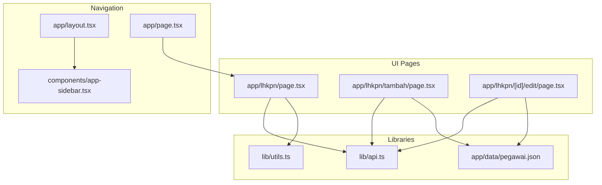
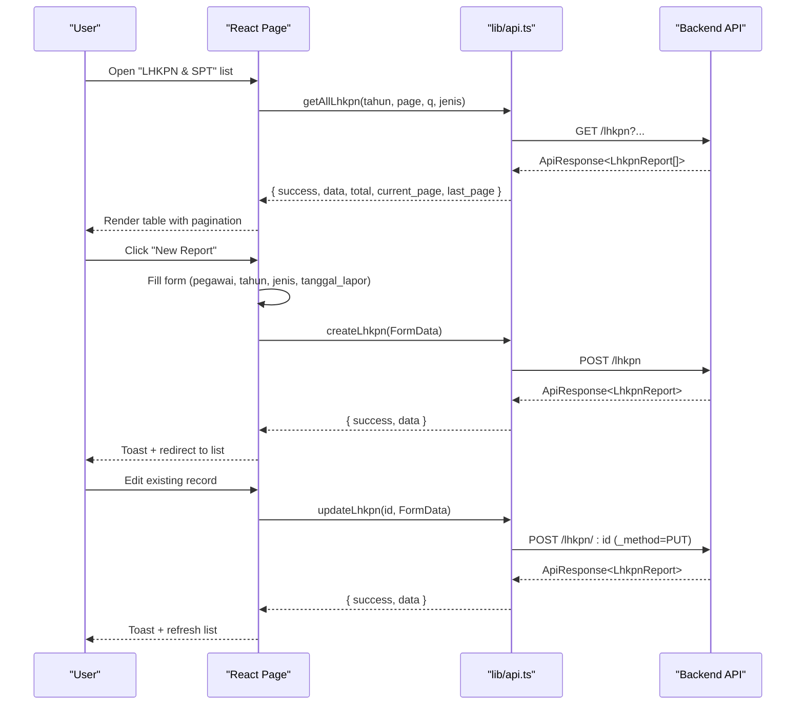
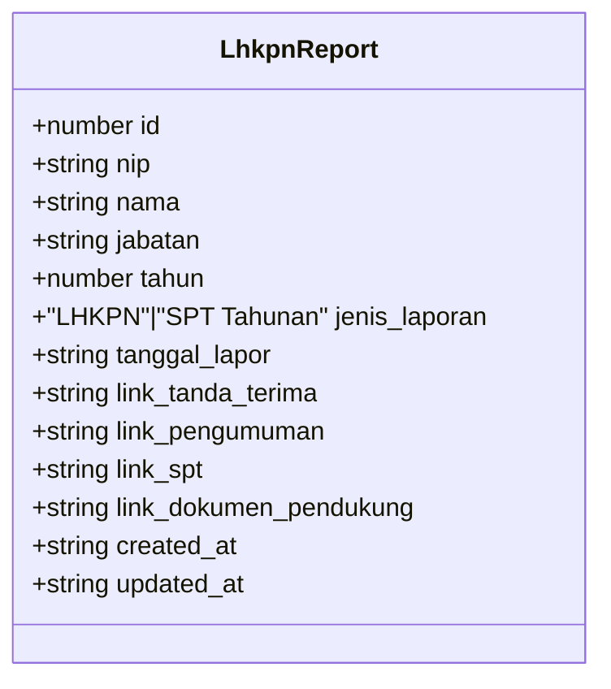
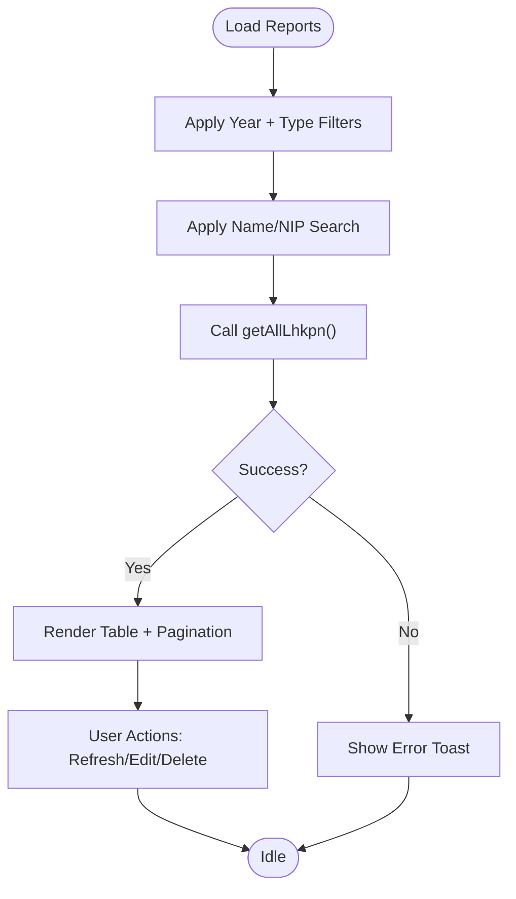
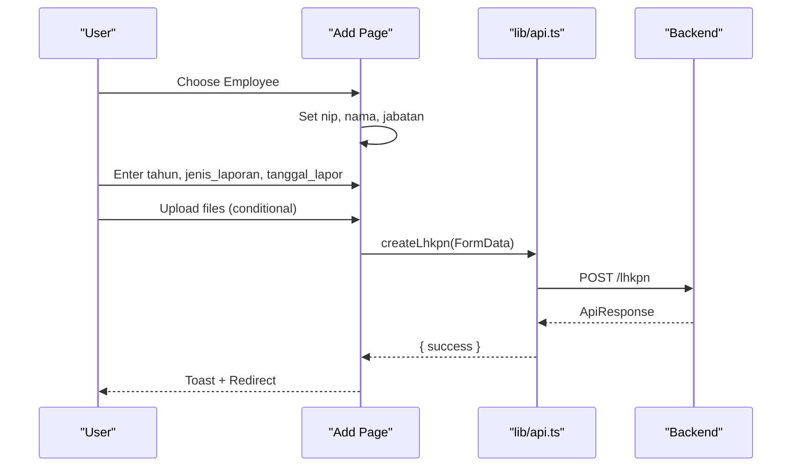
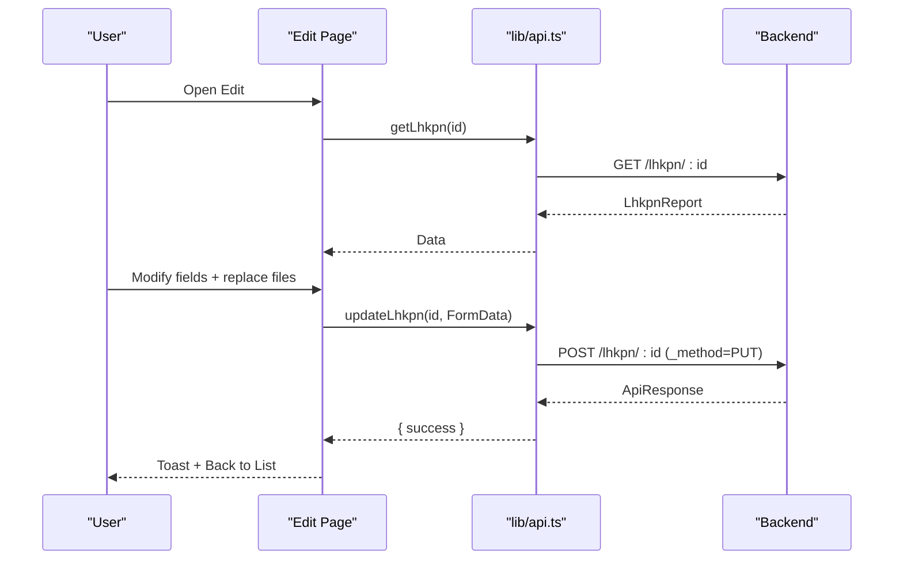
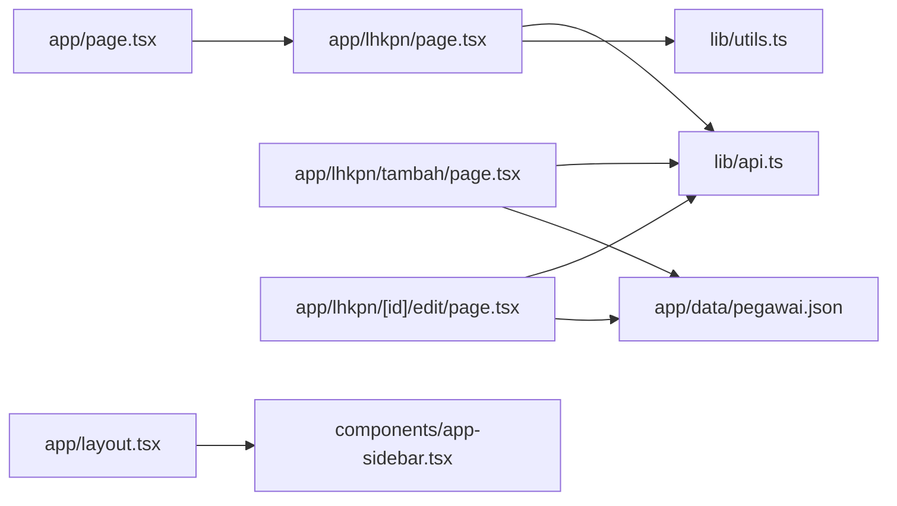

# LHKPN & SPT Overview

<cite>
**Referenced Files in This Document**
- [app/lhkpn/page.tsx](file://app/lhkpn/page.tsx)
- [app/lhkpn/tambah/page.tsx](file://app/lhkpn/tambah/page.tsx)
- [app/lhkpn/[id]/edit/page.tsx](file://app/lhkpn/[id]/edit/page.tsx)
- [lib/api.ts](file://lib/api.ts)
- [lib/utils.ts](file://lib/utils.ts)
- [app/data/pegawai.json](file://app/data/pegawai.json)
- [app/layout.tsx](file://app/layout.tsx)
- [components/app-sidebar.tsx](file://components/app-sidebar.tsx)
- [app/page.tsx](file://app/page.tsx)
</cite>

## Table of Contents
1. [Introduction](#introduction)
2. [Project Structure](#project-structure)
3. [Core Components](#core-components)
4. [Architecture Overview](#architecture-overview)
5. [Detailed Component Analysis](#detailed-component-analysis)
6. [Dependency Analysis](#dependency-analysis)
7. [Performance Considerations](#performance-considerations)
8. [Troubleshooting Guide](#troubleshooting-guide)
9. [Conclusion](#conclusion)

## Introduction
This document describes the LHKPN & SPT module within the admin panel, focusing on the Asset Declaration and Tax Reporting systems. It explains the end-to-end workflow for managing asset declarations, income reporting, and tax compliance processes, including submission, verification, and compliance tracking. It also documents form fields, validation rules, data entry patterns, asset types, declaration categories, compliance deadlines, integration with tax systems, regulatory compliance, and audit trail maintenance.

## Project Structure
The LHKPN & SPT module is implemented as a Next.js application with TypeScript and Tailwind CSS. The frontend consists of three primary pages:
- Listing page: displays reports with filtering, pagination, and actions.
- Creation page: allows adding new LHKPN/SPT reports with file uploads.
- Edit page: enables updating existing reports and replacing uploaded files.

Supporting infrastructure includes:
- API client library for backend integration.
- Utility functions for date options and formatting.
- Static employee dataset for selection.
- Navigation sidebar and layout.

**Diagram sources**
- [app/lhkpn/page.tsx:1-356](file://app/lhkpn/page.tsx#L1-L356)
- [app/lhkpn/tambah/page.tsx:1-159](file://app/lhkpn/tambah/page.tsx#L1-L159)
- [app/lhkpn/[id]/edit/page.tsx:1-151](file://app/lhkpn/[id]/edit/page.tsx#L1-L151)
- [lib/api.ts:336-424](file://lib/api.ts#L336-L424)
- [lib/utils.ts:8-16](file://lib/utils.ts#L8-L16)
- [app/data/pegawai.json:1-292](file://app/data/pegawai.json#L1-L292)
- [app/layout.tsx:12-36](file://app/layout.tsx#L12-L36)
- [components/app-sidebar.tsx:75-80](file://components/app-sidebar.tsx#L75-L80)
- [app/page.tsx:202-230](file://app/page.tsx#L202-L230)

**Section sources**
- [app/lhkpn/page.tsx:140-356](file://app/lhkpn/page.tsx#L140-L356)
- [app/lhkpn/tambah/page.tsx:17-159](file://app/lhkpn/tambah/page.tsx#L17-L159)
- [app/lhkpn/[id]/edit/page.tsx:17-151](file://app/lhkpn/[id]/edit/page.tsx#L17-L151)
- [lib/api.ts:336-424](file://lib/api.ts#L336-L424)
- [lib/utils.ts:8-16](file://lib/utils.ts#L8-L16)
- [app/data/pegawai.json:1-292](file://app/data/pegawai.json#L1-L292)
- [app/layout.tsx:12-36](file://app/layout.tsx#L12-L36)
- [components/app-sidebar.tsx:75-80](file://components/app-sidebar.tsx#L75-L80)
- [app/page.tsx:202-230](file://app/page.tsx#L202-L230)

## Core Components
- LhkpnReport model: Defines the report entity with fields for personal info, year, report type, dates, and document links.
- API functions: getAllLhkpn, getLhkpn, createLhkpn, updateLhkpn, deleteLhkpn encapsulate backend integration.
- UI pages:
  - List page: renders a searchable and filterable table, pagination, and action buttons.
  - Add page: collects report metadata and file attachments, validates selection, and submits via FormData.
  - Edit page: loads existing data, supports file replacement, and updates records.

Key capabilities:
- Filtering by year and report type.
- Search by name or NIP.
- File upload for acknowledgment, announcement, and tax statement documents.
- Toast notifications for success/error feedback.
- Responsive pagination with ellipsis for large result sets.

**Section sources**
- [lib/api.ts:340-354](file://lib/api.ts#L340-L354)
- [lib/api.ts:372-423](file://lib/api.ts#L372-L423)
- [app/lhkpn/page.tsx:30-108](file://app/lhkpn/page.tsx#L30-L108)
- [app/lhkpn/tambah/page.tsx:17-63](file://app/lhkpn/tambah/page.tsx#L17-L63)
- [app/lhkpn/[id]/edit/page.tsx:17-59](file://app/lhkpn/[id]/edit/page.tsx#L17-L59)

## Architecture Overview
The module follows a clean separation of concerns:
- Presentation layer: React pages and shared UI components.
- Domain layer: API client functions and data models.
- Data layer: Backend service accessed via HTTP endpoints.

**Diagram sources**
- [lib/api.ts:372-423](file://lib/api.ts#L372-L423)
- [app/lhkpn/page.tsx:45-70](file://app/lhkpn/page.tsx#L45-L70)
- [app/lhkpn/tambah/page.tsx:41-63](file://app/lhkpn/tambah/page.tsx#L41-L63)
- [app/lhkpn/[id]/edit/page.tsx:40-59](file://app/lhkpn/[id]/edit/page.tsx#L40-L59)

## Detailed Component Analysis

### LHKPN & SPT Data Model
The LhkpnReport interface defines the core attributes for asset and tax reporting:
- Personal identifiers: nip, nama, jabatan
- Reporting metadata: tahun, jenis_laporan, tanggal_lapor
- Document URLs: link_tanda_terima, link_pengumuman, link_spt, link_dokumen_pendukung
- Timestamps: created_at, updated_at

**Diagram sources**
- [lib/api.ts:340-354](file://lib/api.ts#L340-L354)

**Section sources**
- [lib/api.ts:340-354](file://lib/api.ts#L340-L354)

### Listing Page Workflow
Responsibilities:
- Load and display paginated reports.
- Filter by year and report type.
- Search by name or NIP.
- Provide actions: refresh, edit, delete.
- Render document links for acknowledgment, announcement, tax statement, and supporting documents.

**Diagram sources**
- [app/lhkpn/page.tsx:45-108](file://app/lhkpn/page.tsx#L45-L108)
- [lib/api.ts:372-382](file://lib/api.ts#L372-L382)

**Section sources**
- [app/lhkpn/page.tsx:30-108](file://app/lhkpn/page.tsx#L30-L108)
- [lib/api.ts:372-382](file://lib/api.ts#L372-L382)

### Creation Page Workflow
Responsibilities:
- Prepopulate year and default report type.
- Select employee from static dataset.
- Capture report metadata and required dates.
- Attach supporting documents depending on report type.
- Submit via FormData to backend.

**Diagram sources**
- [app/lhkpn/tambah/page.tsx:17-63](file://app/lhkpn/tambah/page.tsx#L17-L63)
- [lib/api.ts:390-398](file://lib/api.ts#L390-L398)
- [app/data/pegawai.json:1-292](file://app/data/pegawai.json#L1-L292)

**Section sources**
- [app/lhkpn/tambah/page.tsx:17-63](file://app/lhkpn/tambah/page.tsx#L17-L63)
- [lib/api.ts:390-398](file://lib/api.ts#L390-L398)
- [app/data/pegawai.json:1-292](file://app/data/pegawai.json#L1-L292)

### Edit Page Workflow
Responsibilities:
- Load existing report data.
- Allow editing metadata and replacing files.
- Persist changes via FormData with method override for file uploads.

**Diagram sources**
- [app/lhkpn/[id]/edit/page.tsx:17-59](file://app/lhkpn/[id]/edit/page.tsx#L17-L59)
- [lib/api.ts:384-415](file://lib/api.ts#L384-L415)

**Section sources**
- [app/lhkpn/[id]/edit/page.tsx:17-59](file://app/lhkpn/[id]/edit/page.tsx#L17-L59)
- [lib/api.ts:384-415](file://lib/api.ts#L384-L415)

### Form Fields, Validation Rules, and Data Entry Patterns
- Required fields:
  - Employee selection (nip, nama, jabatan) sourced from static dataset.
  - Tahun (number).
  - Jenis Laporan (LHKPN or SPT Tahunan).
  - Tanggal Lapor (date).
- Conditional file attachments:
  - LHKPN: acknowledgment, announcement, and tax statement.
  - SPT Tahunan: tax statement.
- Validation:
  - Employee selection is mandatory before submit.
  - Dates must be valid.
  - File uploads are optional but recommended for compliance tracking.

**Section sources**
- [app/lhkpn/tambah/page.tsx:21-25](file://app/lhkpn/tambah/page.tsx#L21-L25)
- [app/lhkpn/tambah/page.tsx:41-63](file://app/lhkpn/tambah/page.tsx#L41-L63)
- [app/lhkpn/[id]/edit/page.tsx:25-26](file://app/lhkpn/[id]/edit/page.tsx#L25-L26)
- [app/lhkpn/[id]/edit/page.tsx:40-59](file://app/lhkpn/[id]/edit/page.tsx#L40-L59)

### Asset Types, Declaration Categories, and Compliance Deadlines
- Declaration categories:
  - LHKPN: for public officials (declaration of assets and income).
  - SPT Tahunan: for civil servants (annual tax statement).
- Asset types:
  - The LHKPN form supports acknowledgment, announcement, and tax statement documents. Specific asset categories are not modeled in the UI; they are managed by the backend system.
- Compliance deadlines:
  - The UI does not enforce deadline logic. Compliance timing is governed by external regulations and is not reflected in the current frontend/backend contract.

**Section sources**
- [app/lhkpn/tambah/page.tsx:98-106](file://app/lhkpn/tambah/page.tsx#L98-L106)
- [app/lhkpn/page.tsx:191-194](file://app/lhkpn/page.tsx#L191-L194)
- [lib/api.ts:340-354](file://lib/api.ts#L340-L354)

### Integration with Tax Systems and Regulatory Compliance
- Document linkage:
  - The model includes a field for tax statement document links, enabling audit trail maintenance.
- Audit trail:
  - Each report stores creation/update timestamps and maintains document URLs for verifiability.
- Legal compliance:
  - The module enforces minimal validation (employee selection, required fields). Detailed compliance checks (e.g., deadline adherence, asset categorization) are handled by the backend and are not exposed in the current UI.

**Section sources**
- [lib/api.ts:340-354](file://lib/api.ts#L340-L354)
- [app/lhkpn/page.tsx:246-268](file://app/lhkpn/page.tsx#L246-L268)

### Compliance Monitoring and Tracking
- Filtering and search:
  - Year and report type filters enable targeted monitoring.
  - Full-text search by name or NIP supports quick retrieval.
- Pagination:
  - Efficient loading of large datasets with pagination controls.
- Document tracking:
  - Dedicated columns for acknowledgment, announcement, tax statement, and supporting documents.

**Section sources**
- [app/lhkpn/page.tsx:175-196](file://app/lhkpn/page.tsx#L175-L196)
- [app/lhkpn/page.tsx:110-137](file://app/lhkpn/page.tsx#L110-L137)
- [app/lhkpn/page.tsx:246-268](file://app/lhkpn/page.tsx#L246-L268)

## Dependency Analysis
The module exhibits low coupling and high cohesion:
- UI pages depend on the API client for all data operations.
- The API client abstracts HTTP details and normalizes responses.
- Utilities provide reusable helpers (year options, formatting).
- Static data is used for employee selection.

**Diagram sources**
- [app/lhkpn/page.tsx:30-108](file://app/lhkpn/page.tsx#L30-L108)
- [app/lhkpn/tambah/page.tsx:17-63](file://app/lhkpn/tambah/page.tsx#L17-L63)
- [app/lhkpn/[id]/edit/page.tsx:17-59](file://app/lhkpn/[id]/edit/page.tsx#L17-L59)
- [lib/api.ts:372-423](file://lib/api.ts#L372-L423)
- [lib/utils.ts:8-16](file://lib/utils.ts#L8-L16)
- [app/data/pegawai.json:1-292](file://app/data/pegawai.json#L1-L292)
- [app/layout.tsx:12-36](file://app/layout.tsx#L12-L36)
- [components/app-sidebar.tsx:75-80](file://components/app-sidebar.tsx#L75-L80)
- [app/page.tsx:202-230](file://app/page.tsx#L202-L230)

**Section sources**
- [lib/api.ts:372-423](file://lib/api.ts#L372-L423)
- [lib/utils.ts:8-16](file://lib/utils.ts#L8-L16)
- [app/data/pegawai.json:1-292](file://app/data/pegawai.json#L1-L292)
- [components/app-sidebar.tsx:75-80](file://components/app-sidebar.tsx#L75-L80)

## Performance Considerations
- Pagination reduces payload sizes and improves responsiveness.
- Debounced search minimizes unnecessary requests.
- File uploads use FormData; ensure backend supports chunked uploads for large files.
- Caching policy uses no-store to avoid stale data in dynamic lists.

[No sources needed since this section provides general guidance]

## Troubleshooting Guide
Common issues and resolutions:
- API connectivity errors:
  - Verify NEXT_PUBLIC_API_URL and NEXT_PUBLIC_API_KEY environment variables.
  - Confirm network access and CORS configuration on the backend.
- Upload failures:
  - Ensure file size limits and allowed MIME types align with backend expectations.
  - Check that method override (_method=PUT) is supported for file updates.
- Search/filter anomalies:
  - Clear filters and retry; confirm year range and report type selections.
- Toast notifications:
  - Review toast messages for actionable error details.

**Section sources**
- [lib/api.ts:1-4](file://lib/api.ts#L1-L4)
- [lib/api.ts:390-415](file://lib/api.ts#L390-L415)
- [app/lhkpn/page.tsx:62-69](file://app/lhkpn/page.tsx#L62-L69)

## Conclusion
The LHKPN & SPT module provides a robust foundation for managing asset declarations and tax reporting. It offers intuitive forms, flexible filtering, and document-centric compliance tracking. While the UI focuses on essential validations and file management, deeper compliance logic resides in the backend. Extending the system to incorporate deadline enforcement, richer asset categorization, and automated compliance checks would further strengthen oversight capabilities.