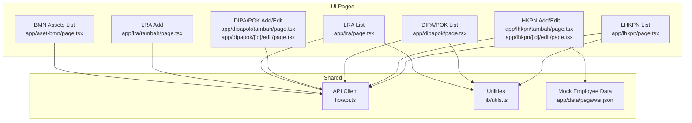
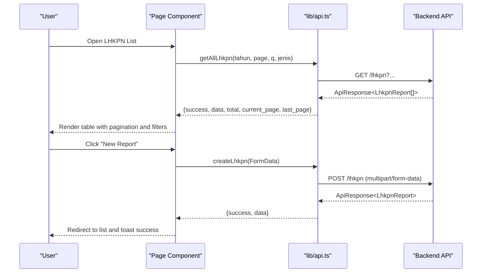
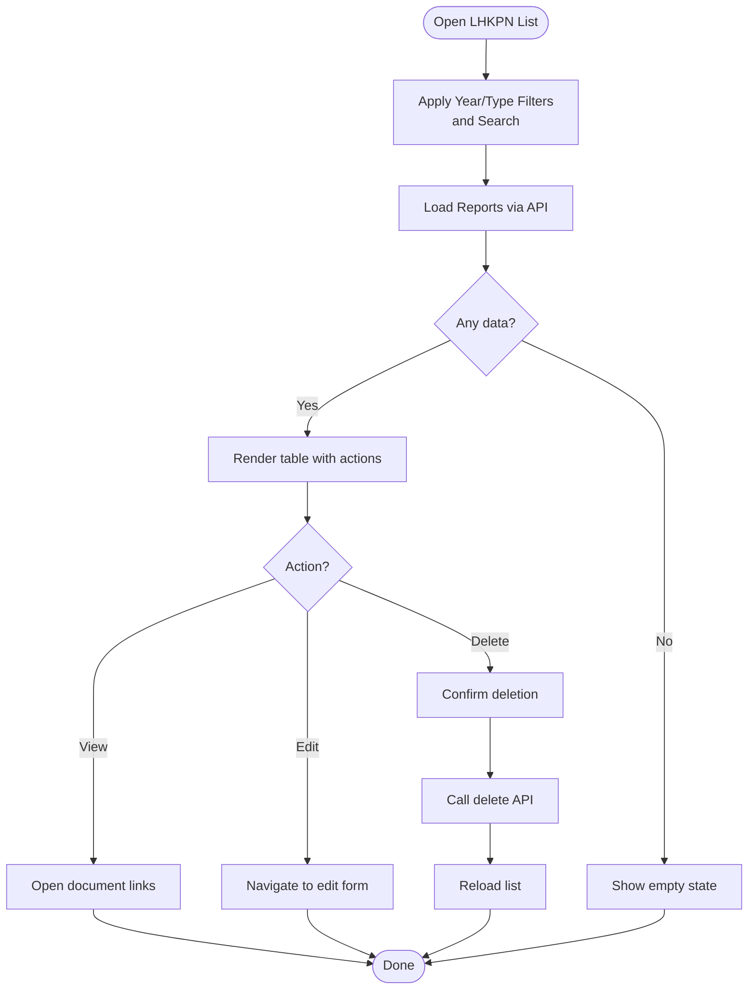
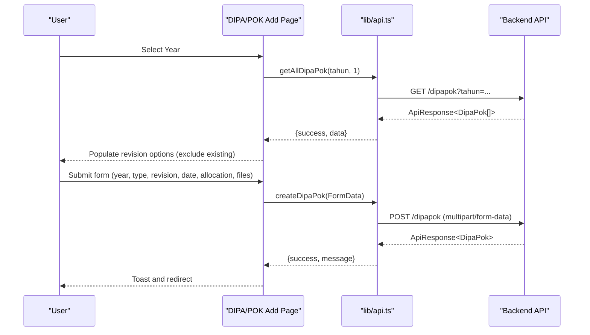
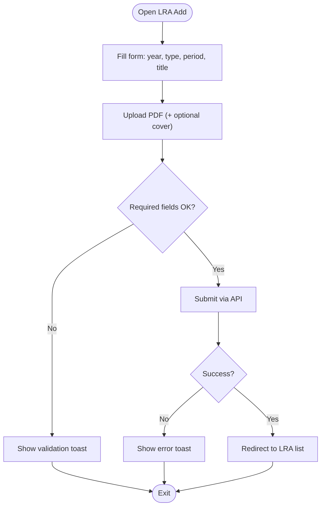
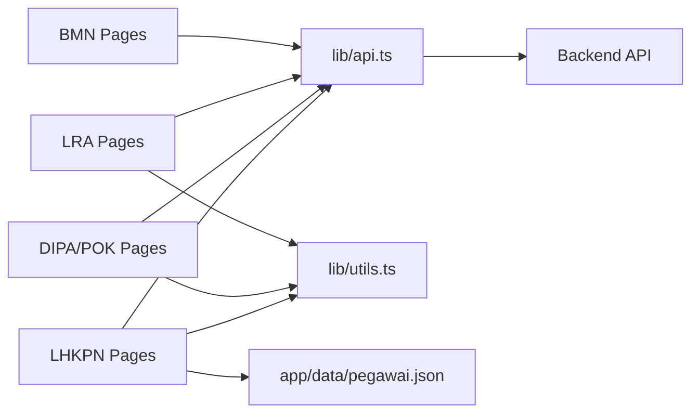

# Legal and Compliance

<cite>
**Referenced Files in This Document**
- [app/lhkpn/page.tsx](file://app/lhkpn/page.tsx)
- [app/lhkpn/tambah/page.tsx](file://app/lhkpn/tambah/page.tsx)
- [app/lhkpn/[id]/edit/page.tsx](file://app/lhkpn/[id]/edit/page.tsx)
- [app/dipapok/page.tsx](file://app/dipapok/page.tsx)
- [app/dipapok/tambah/page.tsx](file://app/dipapok/tambah/page.tsx)
- [app/dipapok/[id]/edit/page.tsx](file://app/dipapok/[id]/edit/page.tsx)
- [app/lra/page.tsx](file://app/lra/page.tsx)
- [app/lra/tambah/page.tsx](file://app/lra/tambah/page.tsx)
- [app/aset-bmn/page.tsx](file://app/aset-bmn/page.tsx)
- [lib/api.ts](file://lib/api.ts)
- [lib/utils.ts](file://lib/utils.ts)
- [app/data/pegawai.json](file://app/data/pegawai.json)
- [app/layout.tsx](file://app/layout.tsx)
- [app/page.tsx](file://app/page.tsx)
</cite>

## Table of Contents
1. [Introduction](#introduction)
2. [Project Structure](#project-structure)
3. [Core Components](#core-components)
4. [Architecture Overview](#architecture-overview)
5. [Detailed Component Analysis](#detailed-component-analysis)
6. [Dependency Analysis](#dependency-analysis)
7. [Performance Considerations](#performance-considerations)
8. [Troubleshooting Guide](#troubleshooting-guide)
9. [Conclusion](#conclusion)
10. [Appendices](#appendices)

## Introduction
This document describes the legal and compliance module focused on two primary areas:
- Asset Declarations, Tax Reporting, and Policy Management Systems (LHKPN & SPT and LRA)
- Budget Framework (DIPA & POK)

It explains the compliance workflow from declaration submission to verification, asset disclosure requirements, tax reporting mechanisms, policy compliance tracking, and the user interface patterns for legal compliance monitoring, regulatory reporting, and audit preparation. It also documents common data entry patterns, verification processes, regulatory compliance systems, legal classifications, compliance deadlines, and integration with legal databases.

## Project Structure
The legal and compliance features are implemented as Next.js pages under the app directory, backed by a shared API client and utility functions. The dashboard provides quick access to legal modules.

**Diagram sources**
- [app/lhkpn/page.tsx:30-356](file://app/lhkpn/page.tsx#L30-L356)
- [app/lhkpn/tambah/page.tsx:17-159](file://app/lhkpn/tambah/page.tsx#L17-L159)
- [app/lhkpn/[id]/edit/page.tsx](file://app/lhkpn/[id]/edit/page.tsx#L17-L151)
- [app/dipapok/page.tsx:28-335](file://app/dipapok/page.tsx#L28-L335)
- [app/dipapok/tambah/page.tsx:32-238](file://app/dipapok/tambah/page.tsx#L32-L238)
- [app/dipapok/[id]/edit/page.tsx](file://app/dipapok/[id]/edit/page.tsx#L32-L272)
- [app/lra/page.tsx:27-320](file://app/lra/page.tsx#L27-L320)
- [app/lra/tambah/page.tsx:17-229](file://app/lra/tambah/page.tsx#L17-L229)
- [app/aset-bmn/page.tsx:32-221](file://app/aset-bmn/page.tsx#L32-L221)
- [lib/api.ts:337-578](file://lib/api.ts#L337-L578)
- [lib/utils.ts:8-25](file://lib/utils.ts#L8-L25)
- [app/data/pegawai.json:1-292](file://app/data/pegawai.json#L1-L292)

**Section sources**
- [app/layout.tsx:12-36](file://app/layout.tsx#L12-L36)
- [app/page.tsx:10-237](file://app/page.tsx#L10-L237)

## Core Components
- LHKPN & SPT (Asset Declarations and Tax Reporting)
  - Submission, editing, and verification of LHKPN (Asset Declaration) and SPT Tahunan (Annual Tax Return) reports for judicial personnel.
  - Supports document uploads for acknowledgment, announcement, tax return, and supporting documents.
- DIPA & POK (Budget Framework)
  - Management of DIPA (Approved Budget Law) and POK (Work Program Documents) with revision controls and allocation tracking.
  - Supports PDF uploads for DIPA and POK documents.
- LRA (Laporan Realisasi Anggaran)
  - Publication and management of budget execution reports (LRA) per period (semester, audited/unaudited).
  - Supports file and cover image uploads.
- Aset & Inventaris BMN
  - Tracking of National Assets reports categorized by position, inventory, and condition.

**Section sources**
- [app/lhkpn/page.tsx:140-356](file://app/lhkpn/page.tsx#L140-L356)
- [app/lhkpn/tambah/page.tsx:17-159](file://app/lhkpn/tambah/page.tsx#L17-L159)
- [app/lhkpn/[id]/edit/page.tsx](file://app/lhkpn/[id]/edit/page.tsx#L17-L151)
- [app/dipapok/page.tsx:144-335](file://app/dipapok/page.tsx#L144-L335)
- [app/dipapok/tambah/page.tsx:32-238](file://app/dipapok/tambah/page.tsx#L32-L238)
- [app/dipapok/[id]/edit/page.tsx](file://app/dipapok/[id]/edit/page.tsx#L32-L272)
- [app/lra/page.tsx:125-320](file://app/lra/page.tsx#L125-L320)
- [app/lra/tambah/page.tsx:17-229](file://app/lra/tambah/page.tsx#L17-L229)
- [app/aset-bmn/page.tsx:32-221](file://app/aset-bmn/page.tsx#L32-L221)

## Architecture Overview
The legal and compliance UI follows a consistent pattern:
- Data fetching via lib/api.ts with normalized responses
- Filtering and pagination handled in page components
- File uploads via FormData for document-heavy workflows
- Mock employee data binding for LHKPN entry

**Diagram sources**
- [app/lhkpn/page.tsx:45-70](file://app/lhkpn/page.tsx#L45-L70)
- [lib/api.ts:372-423](file://lib/api.ts#L372-L423)

**Section sources**
- [lib/api.ts:337-423](file://lib/api.ts#L337-L423)
- [lib/utils.ts:8-25](file://lib/utils.ts#L8-L25)

## Detailed Component Analysis

### LHKPN & SPT (Asset Declarations and Tax Reporting)
- Purpose: Manage annual asset declaration (LHKPN) and tax filing (SPT Tahunan) submissions for judicial employees.
- Key UI features:
  - Filter by year and report type (LHKPN/SPT)
  - Search by name or NIP
  - Document links for acknowledgment, announcement, tax return, and supporting documents
  - Pagination and refresh controls
- Data entry patterns:
  - Employee selection from mock data (app/data/pegawai.json)
  - Conditional document upload fields based on report type
  - Date pickers and numeric inputs for year and amounts
- Verification and compliance:
  - Document URLs enable external verification
  - Badge differentiation between report types
  - Toast notifications for success/error feedback

**Diagram sources**
- [app/lhkpn/page.tsx:156-356](file://app/lhkpn/page.tsx#L156-L356)
- [lib/api.ts:372-423](file://lib/api.ts#L372-L423)

**Section sources**
- [app/lhkpn/page.tsx:30-356](file://app/lhkpn/page.tsx#L30-L356)
- [app/lhkpn/tambah/page.tsx:17-159](file://app/lhkpn/tambah/page.tsx#L17-L159)
- [app/lhkpn/[id]/edit/page.tsx](file://app/lhkpn/[id]/edit/page.tsx#L17-L151)
- [lib/api.ts:337-423](file://lib/api.ts#L337-L423)
- [app/data/pegawai.json:1-292](file://app/data/pegawai.json#L1-L292)

### DIPA & POK (Budget Framework)
- Purpose: Maintain DIPA (approved budget law) and POK (work program documents) with revision control and allocation tracking.
- Key UI features:
  - Filter by year
  - Search by type or revision
  - Revision availability computed from existing entries
  - Document links for DIPA and POK PDFs
  - Currency formatting for allocations
- Data entry patterns:
  - Controlled revision selection based on existing records
  - PDF-only uploads for DIPA and POK
  - Required fields enforced before submit

**Diagram sources**
- [app/dipapok/tambah/page.tsx:49-102](file://app/dipapok/tambah/page.tsx#L49-L102)
- [lib/api.ts:529-578](file://lib/api.ts#L529-L578)

**Section sources**
- [app/dipapok/page.tsx:28-335](file://app/dipapok/page.tsx#L28-L335)
- [app/dipapok/tambah/page.tsx:32-238](file://app/dipapok/tambah/page.tsx#L32-L238)
- [app/dipapok/[id]/edit/page.tsx](file://app/dipapok/[id]/edit/page.tsx#L32-L272)
- [lib/api.ts:485-578](file://lib/api.ts#L485-L578)
- [lib/utils.ts:8-25](file://lib/utils.ts#L8-L25)

### LRA (Laporan Realisasi Anggaran)
- Purpose: Publish and manage budget execution reports per period (semester, audited/unaudited).
- Key UI features:
  - Filter by year
  - Period selection (semester_1, semester_2, audited, unaudited)
  - File and optional cover image uploads
  - Document preview via external links and cover thumbnails

**Diagram sources**
- [app/lra/tambah/page.tsx:36-87](file://app/lra/tambah/page.tsx#L36-L87)
- [lib/api.ts:1091-1141](file://lib/api.ts#L1091-L1141)

**Section sources**
- [app/lra/page.tsx:27-320](file://app/lra/page.tsx#L27-L320)
- [app/lra/tambah/page.tsx:17-229](file://app/lra/tambah/page.tsx#L17-L229)
- [lib/api.ts:1075-1141](file://lib/api.ts#L1075-L1141)

### Aset & Inventaris BMN
- Purpose: Track national assets reports categorized by position, inventory, and condition.
- Key UI features:
  - Filter by year
  - Grouped sections for different report categories
  - Document links for viewing reports
  - Action buttons for edit/delete

**Section sources**
- [app/aset-bmn/page.tsx:32-221](file://app/aset-bmn/page.tsx#L32-L221)
- [lib/api.ts:580-652](file://lib/api.ts#L580-L652)

## Dependency Analysis
- UI pages depend on:
  - lib/api.ts for all backend interactions
  - lib/utils.ts for year options and currency formatting
  - app/data/pegawai.json for LHKPN employee selection
- Coupling and cohesion:
  - Strong cohesion within each module’s pages and API functions
  - Low coupling via shared API client and utilities
- External dependencies:
  - Backend API with normalized responses
  - File upload endpoints for PDFs and images

**Diagram sources**
- [lib/api.ts:337-578](file://lib/api.ts#L337-L578)
- [lib/utils.ts:8-25](file://lib/utils.ts#L8-L25)
- [app/data/pegawai.json:1-292](file://app/data/pegawai.json#L1-L292)

**Section sources**
- [lib/api.ts:337-578](file://lib/api.ts#L337-L578)
- [lib/utils.ts:8-25](file://lib/utils.ts#L8-L25)

## Performance Considerations
- Pagination reduces payload sizes for large datasets.
- Debounced search input minimizes unnecessary API calls.
- File uploads use multipart/form-data; ensure server-side limits and validation are configured.
- Currency and date formatting are handled client-side for responsiveness.

[No sources needed since this section provides general guidance]

## Troubleshooting Guide
- API connectivity errors:
  - UI displays a toast prompting to check API connection.
- Validation errors:
  - LRA requires file upload; LHKPN requires employee selection and mandatory fields.
- File upload issues:
  - Ensure PDF/image constraints (size/type) are met before upload.
- Revision conflicts (DIPA/POK):
  - The system dynamically excludes already-used revisions; re-select a valid option.

**Section sources**
- [app/lra/tambah/page.tsx:36-87](file://app/lra/tambah/page.tsx#L36-L87)
- [app/lhkpn/tambah/page.tsx:41-63](file://app/lhkpn/tambah/page.tsx#L41-L63)
- [app/dipapok/tambah/page.tsx:71-102](file://app/dipapok/tambah/page.tsx#L71-L102)

## Conclusion
The legal and compliance module provides a cohesive, user-friendly system for managing asset declarations, tax reporting, budget framework documentation, and national assets reporting. The UI emphasizes filtering, verification via document links, and robust data entry with validation. Integration with the backend is standardized through a shared API client, ensuring maintainable and scalable compliance workflows.

[No sources needed since this section summarizes without analyzing specific files]

## Appendices

### Compliance Workflows Overview
- LHKPN/SPT Submission
  - Select employee → choose report type → upload required documents → submit
  - Verified via document links and badges
- DIPA/POK Management
  - Choose year → select type → compute available revisions → upload PDFs → submit
  - Allocation tracked and formatted in IDR
- LRA Publication
  - Choose period and type → upload report and optional cover → publish
- Audit Preparation
  - Centralized document links and categorization support audit readiness

[No sources needed since this section provides general guidance]