# Mediasi Module

<cite>
**Referenced Files in This Document**
- [app/mediasi/page.tsx](file://app/mediasi/page.tsx)
- [app/mediasi/banners/tambah/page.tsx](file://app/mediasi/banners/tambah/page.tsx)
- [app/mediasi/sk/tambah/page.tsx](file://app/mediasi/sk/tambah/page.tsx)
- [app/mediasi/banners/[id]/edit/page.tsx](file://app/mediasi/banners/[id]/edit/page.tsx)
- [app/mediasi/sk/[id]/edit/page.tsx](file://app/mediasi/sk/[id]/edit/page.tsx)
- [lib/api.ts](file://lib/api.ts)
- [components/ui/button.tsx](file://components/ui/button.tsx)
- [components/ui/card.tsx](file://components/ui/card.tsx)
- [components/ui/table.tsx](file://components/ui/table.tsx)
- [hooks/use-toast.ts](file://hooks/use-toast.ts)
- [app/layout.tsx](file://app/layout.tsx)
- [app/globals.css](file://app/globals.css)
</cite>

## Table of Contents
1. [Introduction](#introduction)
2. [Project Structure](#project-structure)
3. [Core Components](#core-components)
4. [Architecture Overview](#architecture-overview)
5. [Detailed Component Analysis](#detailed-component-analysis)
6. [API Integration](#api-integration)
7. [UI Components](#ui-components)
8. [State Management](#state-management)
9. [Performance Considerations](#performance-considerations)
10. [Troubleshooting Guide](#troubleshooting-guide)
11. [Conclusion](#conclusion)

## Introduction

The Mediasi Module is a comprehensive administrative interface designed for managing mediation-related content within the court administration system. This module provides functionality for managing two primary areas: Annual Mediation Decrees (SK) and Mediator Banners. The system allows administrators to create, view, edit, and delete mediation-related documents and promotional banners, with support for both judges and non-judge mediators.

The module follows modern React patterns with Next.js App Router, utilizing server-side rendering capabilities and client-side interactivity. It integrates with a backend API through a centralized API service layer and provides a responsive, accessible user interface built with Tailwind CSS and Radix UI components.

## Project Structure

The Mediasi module is organized within the Next.js application structure, following the conventional file-based routing pattern:

```mermaid
graph TB
subgraph "Mediasi Module Structure"
A[app/mediasi/] --> B[Main Page]
A --> C[Banners Section]
A --> D[SK Section]
B --> E[page.tsx]
C --> F[tambah/page.tsx]
C --> G[[id]/edit/page.tsx]
D --> H[tambah/page.tsx]
D --> I[[id]/edit/page.tsx]
J[lib/api.ts] --> K[Mediasi Functions]
L[components/ui/] --> M[Button]
L --> N[Card]
L --> O[Table]
end
```

**Diagram sources**
- [app/mediasi/page.tsx:1-294](file://app/mediasi/page.tsx#L1-L294)
- [lib/api.ts:1147-1233](file://lib/api.ts#L1147-L1233)

**Section sources**
- [app/mediasi/page.tsx:1-294](file://app/mediasi/page.tsx#L1-L294)
- [app/mediasi/banners/tambah/page.tsx:1-112](file://app/mediasi/banners/tambah/page.tsx#L1-L112)
- [app/mediasi/sk/tambah/page.tsx:1-112](file://app/mediasi/sk/tambah/page.tsx#L1-L112)

## Core Components

The Mediasi module consists of several key components that work together to provide a comprehensive administrative interface:

### Main Dashboard Component
The primary dashboard serves as the central hub for managing both SK (Mediation Decrees) and Banner content. It features tabbed navigation allowing users to switch between different management areas seamlessly.

### Form Components
Two specialized form components handle data entry for different content types:
- **SK Form**: Handles annual mediation decree creation with support for both PDF uploads and Google Drive links
- **Banner Form**: Manages promotional banner content with image upload or URL options

### Edit Components
Each content type includes dedicated edit pages that pre-populate forms with existing data, allowing for selective updates without requiring complete re-entry.

### API Integration Layer
A centralized API service provides typed interfaces for all backend communication, handling authentication, error management, and response normalization.

**Section sources**
- [app/mediasi/page.tsx:38-294](file://app/mediasi/page.tsx#L38-L294)
- [app/mediasi/banners/tambah/page.tsx:16-112](file://app/mediasi/banners/tambah/page.tsx#L16-L112)
- [app/mediasi/sk/tambah/page.tsx:15-112](file://app/mediasi/sk/tambah/page.tsx#L15-L112)

## Architecture Overview

The Mediasi module follows a clean architecture pattern with clear separation of concerns:

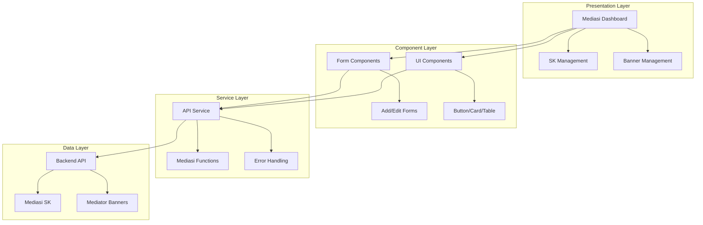

**Diagram sources**
- [lib/api.ts:1147-1233](file://lib/api.ts#L1147-L1233)
- [components/ui/button.tsx:1-58](file://components/ui/button.tsx#L1-L58)
- [components/ui/card.tsx:1-77](file://components/ui/card.tsx#L1-L77)

The architecture emphasizes:
- **Separation of Concerns**: Clear boundaries between presentation, business logic, and data layers
- **Type Safety**: Comprehensive TypeScript interfaces for all data structures
- **Reusability**: Shared UI components and API functions across different contexts
- **Error Resilience**: Centralized error handling and user feedback mechanisms

## Detailed Component Analysis

### Main Dashboard Component

The primary dashboard component orchestrates the entire Mediasi module functionality:

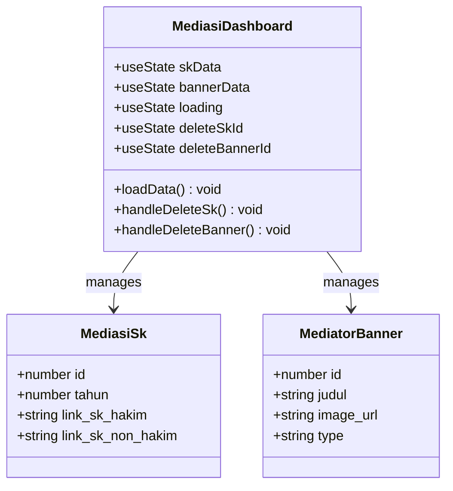

**Diagram sources**
- [app/mediasi/page.tsx:39-44](file://app/mediasi/page.tsx#L39-L44)
- [lib/api.ts:1150-1166](file://lib/api.ts#L1150-L1166)

Key features include:
- **Tabbed Interface**: Separate tabs for SK management and banner management
- **Dual Data Loading**: Concurrent loading of both SK and banner data
- **Modal Confirmation**: Confirmation dialogs for deletion operations
- **Responsive Design**: Grid layout for banners and table layout for SK data

**Section sources**
- [app/mediasi/page.tsx:38-294](file://app/mediasi/page.tsx#L38-L294)

### SK Management Component

The SK management component handles annual mediation decree administration:

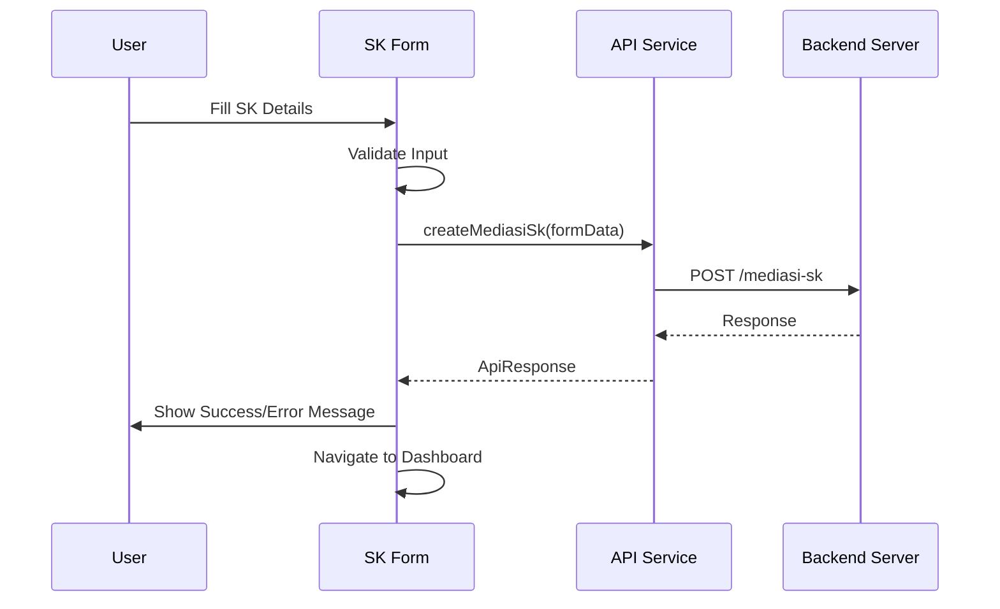

**Diagram sources**
- [app/mediasi/sk/tambah/page.tsx:20-38](file://app/mediasi/sk/tambah/page.tsx#L20-L38)
- [lib/api.ts:1174-1181](file://lib/api.ts#L1174-L1181)

The component supports flexible input methods:
- **PDF Upload**: Direct file upload for SK documents
- **Google Drive Links**: Alternative URL-based document management
- **Year Selection**: Dynamic year selection with current year as default

**Section sources**
- [app/mediasi/sk/tambah/page.tsx:15-112](file://app/mediasi/sk/tambah/page.tsx#L15-L112)

### Banner Management Component

The banner management component handles promotional content for mediators:

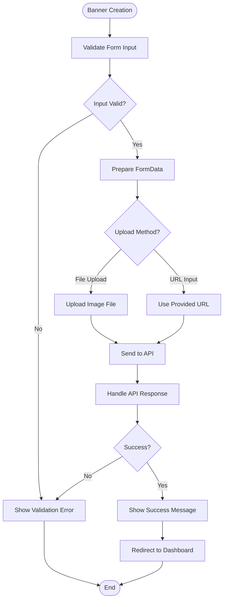

**Diagram sources**
- [app/mediasi/banners/tambah/page.tsx:22-41](file://app/mediasi/banners/tambah/page.tsx#L22-L41)

Key capabilities include:
- **Dual Category Support**: Separate management for judge and non-judge mediators
- **Flexible Image Sources**: Support for both file uploads and external URLs
- **Preview Functionality**: Ability to view current images before editing

**Section sources**
- [app/mediasi/banners/tambah/page.tsx:16-112](file://app/mediasi/banners/tambah/page.tsx#L16-L112)

### Edit Components

Both SK and banner edit components follow similar patterns for updating existing content:

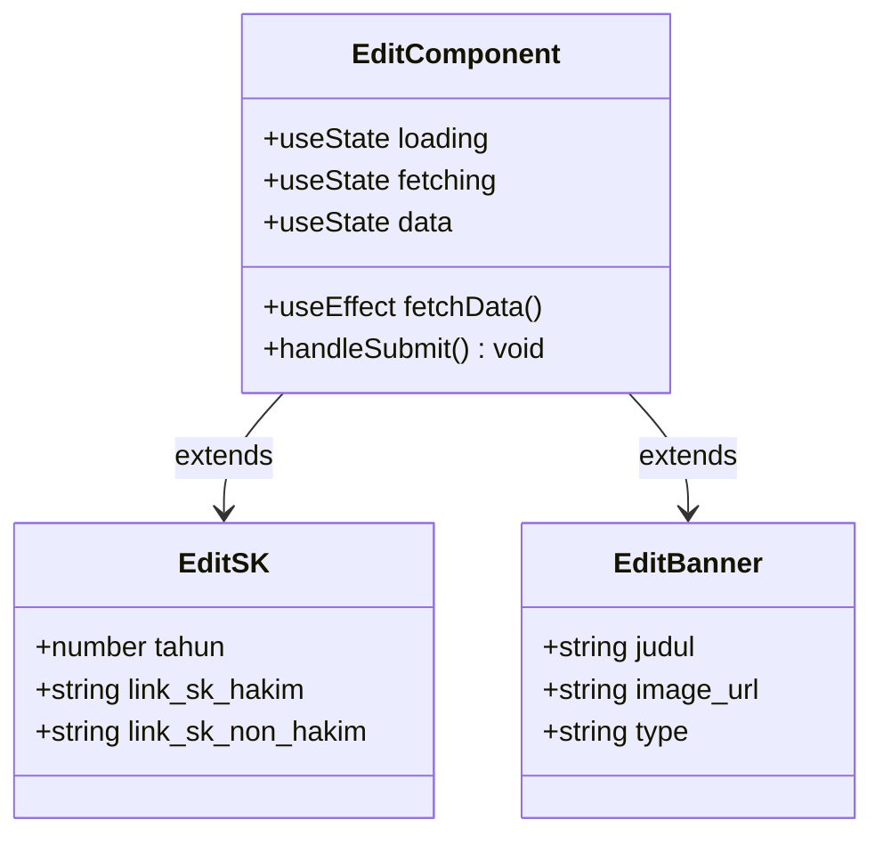

**Diagram sources**
- [app/mediasi/sk/[id]/edit/page.tsx](file://app/mediasi/sk/[id]/edit/page.tsx#L15-L67)
- [app/mediasi/banners/[id]/edit/page.tsx](file://app/mediasi/banners/[id]/edit/page.tsx#L16-L71)

**Section sources**
- [app/mediasi/sk/[id]/edit/page.tsx](file://app/mediasi/sk/[id]/edit/page.tsx#L15-L151)
- [app/mediasi/banners/[id]/edit/page.tsx](file://app/mediasi/banners/[id]/edit/page.tsx#L16-L147)

## API Integration

The Mediasi module relies on a centralized API service that provides typed interfaces for all backend operations:

### API Function Categories

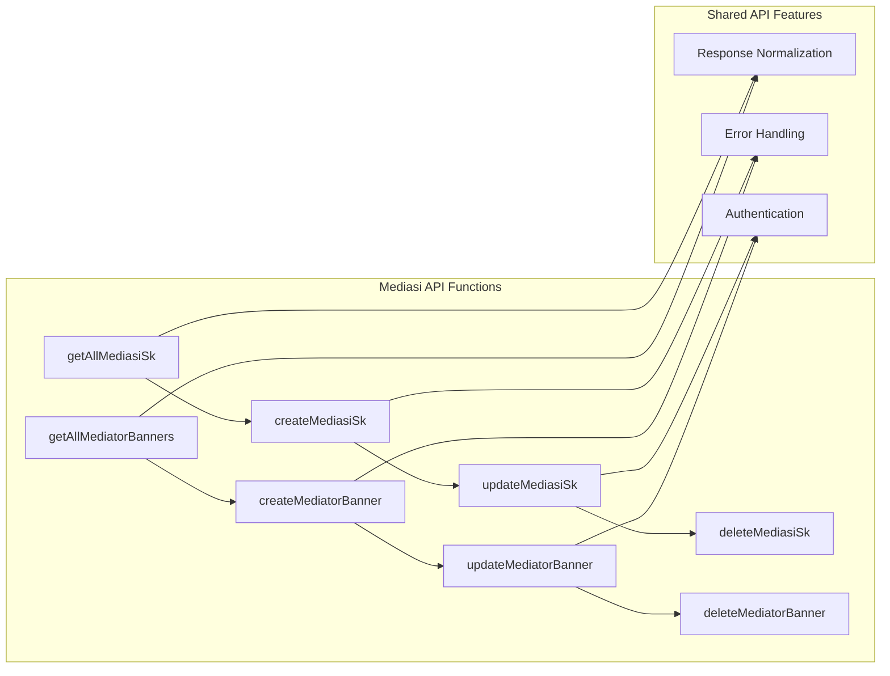

**Diagram sources**
- [lib/api.ts:1168-1233](file://lib/api.ts#L1168-L1233)

### Data Models

The API defines comprehensive TypeScript interfaces for type safety:

| Interface | Properties | Description |
|-----------|------------|-------------|
| `MediasiSk` | `id`, `tahun`, `link_sk_hakim`, `link_sk_non_hakim` | Annual mediation decree records |
| `MediatorBanner` | `id`, `judul`, `image_url`, `type` | Promotional banner content |

### Request/Response Patterns

The API service implements consistent patterns for all operations:
- **FormData Support**: All create/update operations support multipart form data for file uploads
- **Method Override**: Uses POST with `_method=PUT` for file uploads to comply with server requirements
- **Response Normalization**: Consistent response structure across all endpoints
- **Error Handling**: Centralized error processing with user-friendly messages

**Section sources**
- [lib/api.ts:1147-1233](file://lib/api.ts#L1147-L1233)

## UI Components

The Mediasi module leverages a comprehensive set of reusable UI components:

### Button Component
The button component provides consistent styling and behavior across the application:

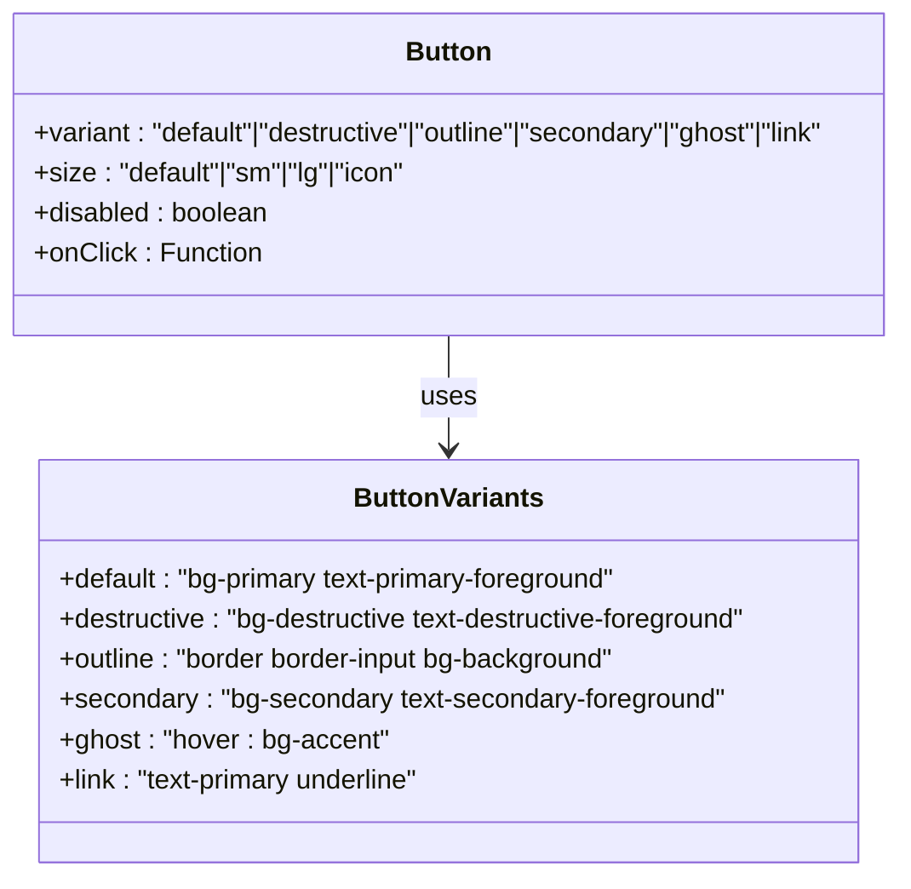

**Diagram sources**
- [components/ui/button.tsx:7-35](file://components/ui/button.tsx#L7-L35)

### Card Component
The card component provides structured content containers with consistent spacing and typography:

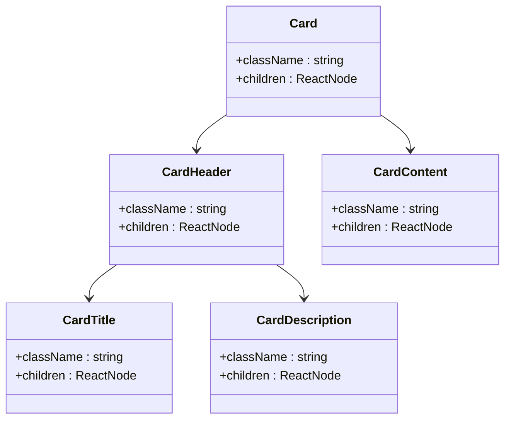

**Diagram sources**
- [components/ui/card.tsx:5-76](file://components/ui/card.tsx#L5-L76)

### Table Component
The table component provides responsive data display with sorting and interaction capabilities:

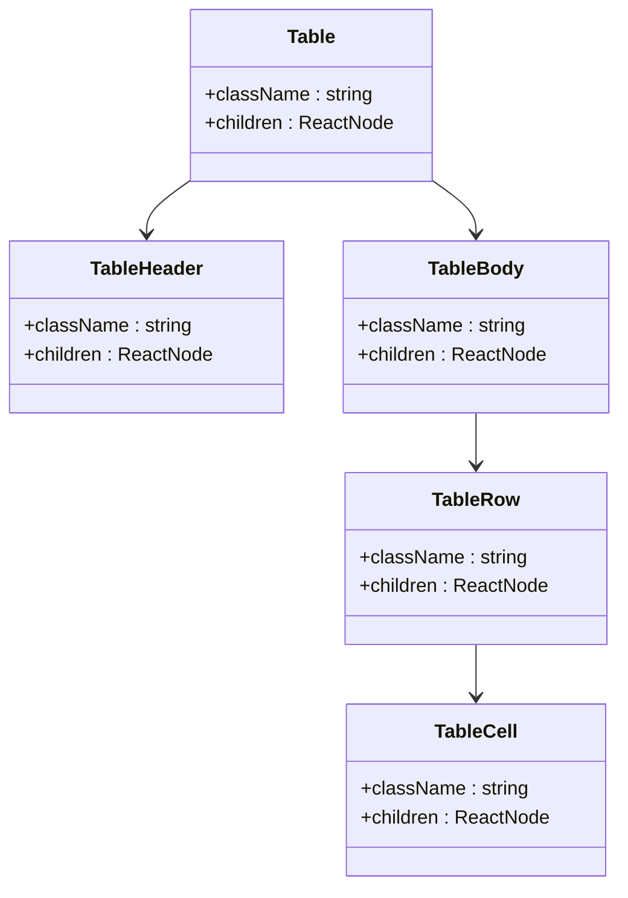

**Diagram sources**
- [components/ui/table.tsx:5-121](file://components/ui/table.tsx#L5-L121)

**Section sources**
- [components/ui/button.tsx:1-58](file://components/ui/button.tsx#L1-L58)
- [components/ui/card.tsx:1-77](file://components/ui/card.tsx#L1-L77)
- [components/ui/table.tsx:1-121](file://components/ui/table.tsx#L1-L121)

## State Management

The Mediasi module employs React's built-in state management patterns:

### Local State Management
Each component maintains its own local state using React hooks:

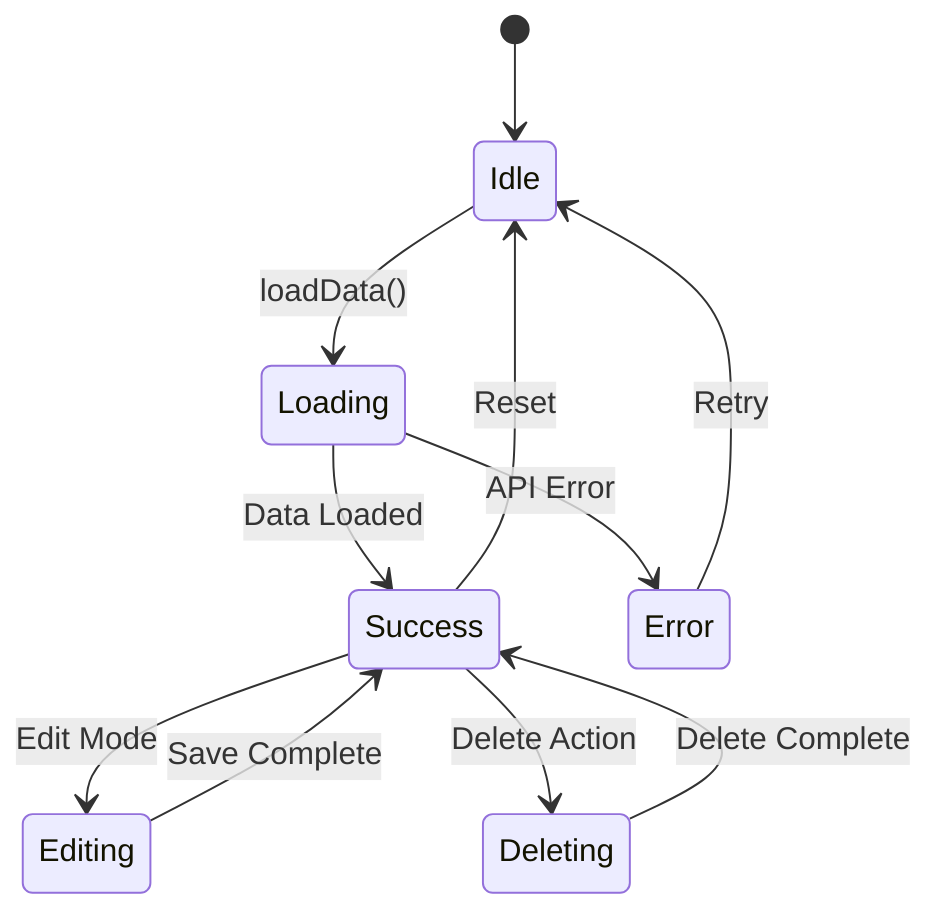

### Global State Management
The application uses a centralized toast notification system for user feedback:

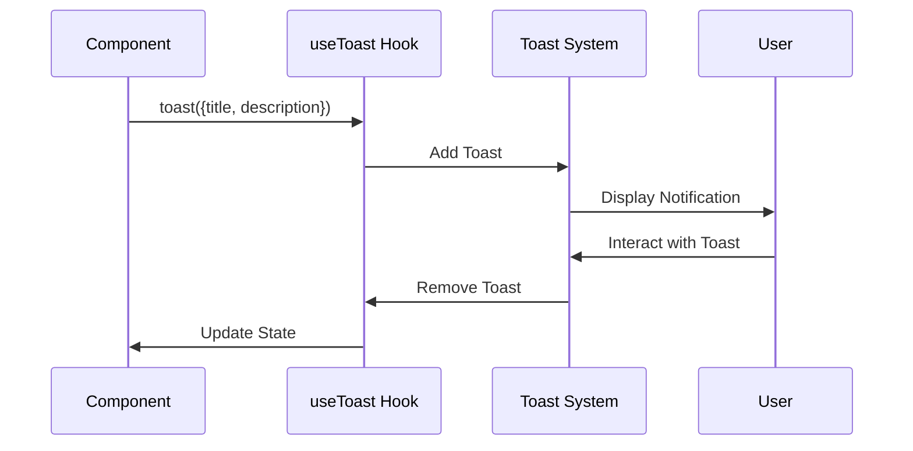

**Diagram sources**
- [hooks/use-toast.ts:145-195](file://hooks/use-toast.ts#L145-L195)

**Section sources**
- [hooks/use-toast.ts:1-195](file://hooks/use-toast.ts#L1-L195)

## Performance Considerations

The Mediasi module implements several performance optimization strategies:

### Lazy Loading
- **Component-Level**: Individual pages are loaded on-demand based on route navigation
- **Image Optimization**: Banner images use responsive loading with hover effects
- **Skeleton Loading**: Skeleton components provide immediate visual feedback during data loading

### Memory Management
- **Cleanup Functions**: Proper cleanup of timers and event listeners in useEffect hooks
- **Conditional Rendering**: Components only render when data is available
- **Optimized Re-renders**: Minimal state updates to reduce unnecessary re-renders

### Network Optimization
- **Concurrent Loading**: SK and banner data load concurrently using Promise.all
- **Cache Control**: No-cache headers prevent stale data issues
- **Error Boundaries**: Graceful handling of network failures

## Troubleshooting Guide

### Common Issues and Solutions

#### API Connection Problems
**Symptoms**: Dashboard fails to load data, error notifications appear
**Causes**: 
- Backend API unavailable
- Incorrect API URL configuration
- Missing API key

**Solutions**:
1. Verify API URL in environment variables
2. Check network connectivity to backend service
3. Confirm API key permissions

#### File Upload Issues
**Symptoms**: Banner creation fails with file upload errors
**Causes**:
- File size limits exceeded
- Unsupported file formats
- Server-side validation failures

**Solutions**:
1. Verify file format (image/*) and size limits
2. Check server configuration for upload limits
3. Review browser console for detailed error messages

#### Form Validation Errors
**Symptoms**: Form submission blocked with validation messages
**Causes**:
- Missing required fields
- Invalid data formats
- Duplicate entries

**Solutions**:
1. Ensure all required fields are completed
2. Verify data formats match field expectations
3. Check for existing duplicate entries

#### Navigation Issues
**Symptoms**: Links not working or routes not found
**Causes**:
- Incorrect file paths
- Missing route configuration
- Build artifacts issues

**Solutions**:
1. Verify file paths match Next.js routing conventions
2. Check for typos in navigation links
3. Clear browser cache and rebuild application

**Section sources**
- [lib/api.ts:1168-1233](file://lib/api.ts#L1168-L1233)
- [hooks/use-toast.ts:1-195](file://hooks/use-toast.ts#L1-L195)

## Conclusion

The Mediasi Module represents a well-architected administrative solution for managing mediation-related content within the court administration system. The module successfully combines modern React patterns with robust backend integration to provide a comprehensive management interface.

Key strengths of the implementation include:
- **Clean Architecture**: Clear separation of concerns with well-defined boundaries
- **Type Safety**: Comprehensive TypeScript integration ensures runtime reliability
- **User Experience**: Responsive design with thoughtful interaction patterns
- **Extensibility**: Modular component structure supports future enhancements
- **Error Handling**: Robust error management with user-friendly feedback

The module effectively addresses the core requirements of managing both annual mediation decrees and promotional banners while maintaining high standards for code quality, performance, and user experience. The implementation provides a solid foundation for future development and maintenance within the broader administrative system.