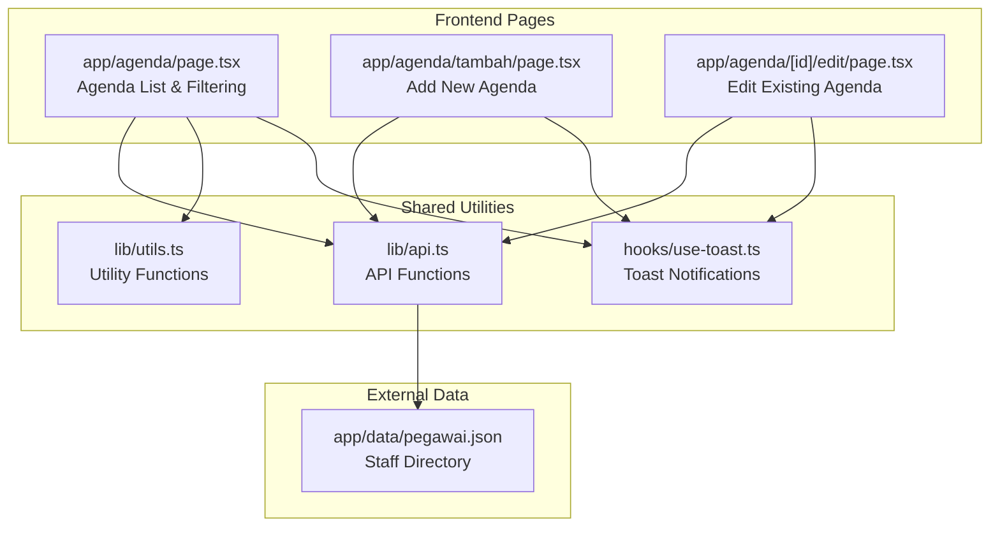
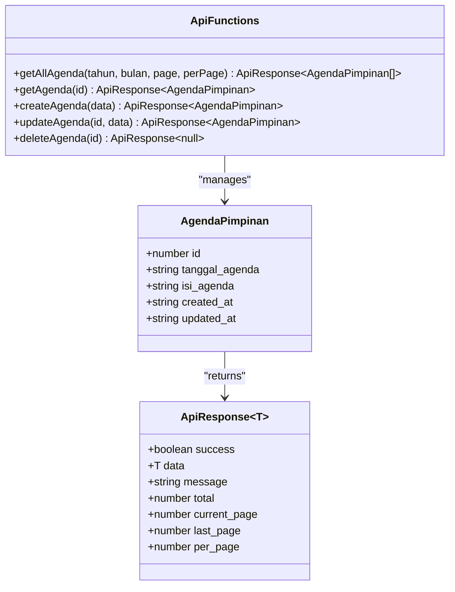
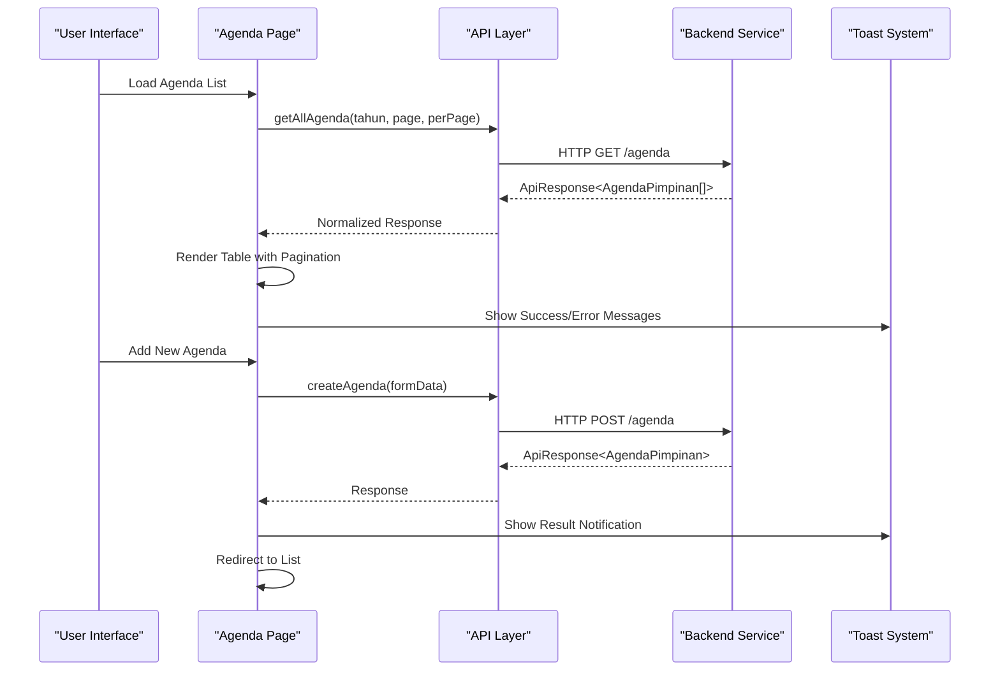
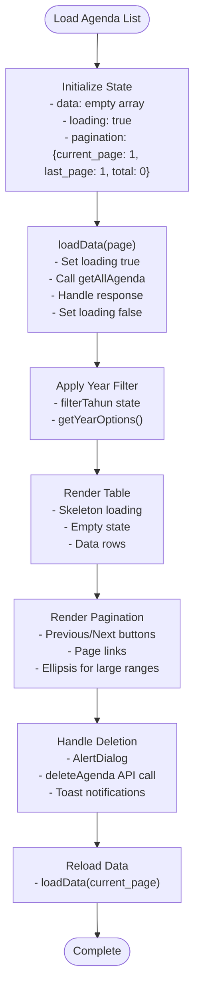
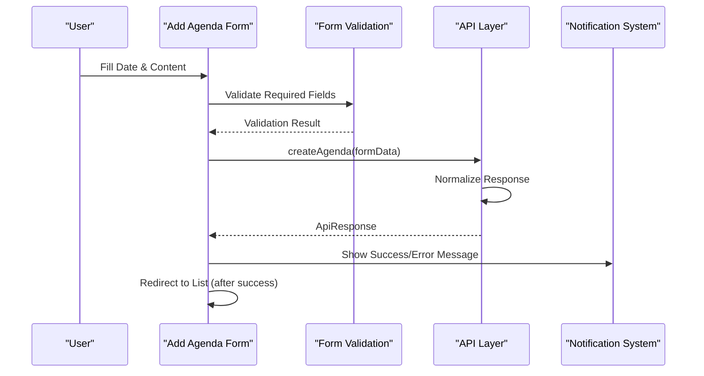
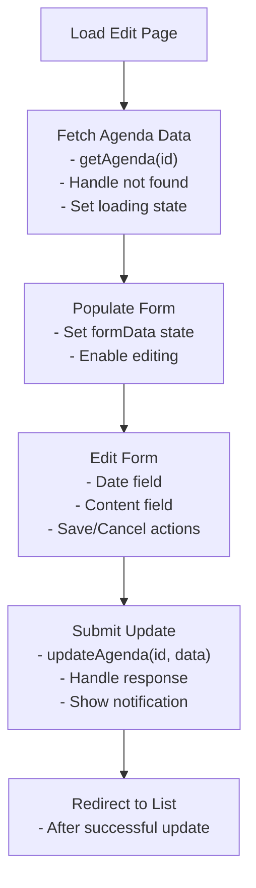
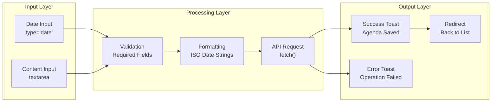
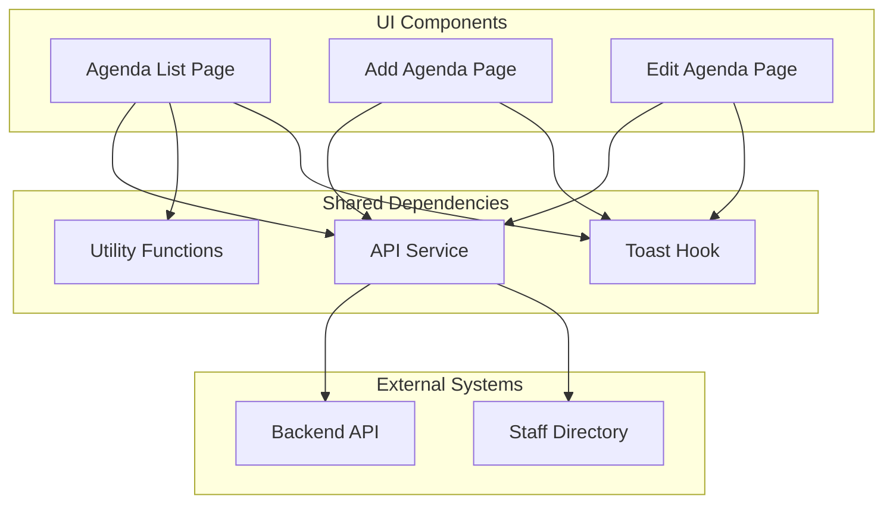

# Agenda Pimpinan (Leadership Agenda)

<cite>
**Referenced Files in This Document**
- [app/agenda/page.tsx](file://app/agenda/page.tsx)
- [app/agenda/tambah/page.tsx](file://app/agenda/tambah/page.tsx)
- [app/agenda/[id]/edit/page.tsx](file://app/agenda/[id]/edit/page.tsx)
- [lib/api.ts](file://lib/api.ts)
- [lib/utils.ts](file://lib/utils.ts)
- [hooks/use-toast.ts](file://hooks/use-toast.ts)
- [app/data/pegawai.json](file://app/data/pegawai.json)
</cite>

## Table of Contents
1. [Introduction](#introduction)
2. [Project Structure](#project-structure)
3. [Core Components](#core-components)
4. [Architecture Overview](#architecture-overview)
5. [Detailed Component Analysis](#detailed-component-analysis)
6. [Dependency Analysis](#dependency-analysis)
7. [Performance Considerations](#performance-considerations)
8. [Troubleshooting Guide](#troubleshooting-guide)
9. [Conclusion](#conclusion)

## Introduction
The Agenda Pimpinan module manages leadership agenda items and meeting coordination within the administrative panel. It provides a streamlined system for scheduling leadership meetings, managing agenda items, coordinating participants, and tracking meeting outcomes. The module focuses on simplicity and clarity, ensuring agenda items are presented in a clean, readable format suitable for public websites while maintaining administrative efficiency.

The system supports:
- Agenda creation with date and content fields
- Year-based filtering and pagination
- Edit/update/delete operations
- Responsive UI with toast notifications
- Integration with backend APIs for data persistence

## Project Structure
The Agenda Pimpinan module follows a Next.js pages router structure with dedicated pages for listing, adding, and editing agendas. The frontend communicates with backend APIs through a centralized API service.

**Diagram sources**
- [app/agenda/page.tsx:1-284](file://app/agenda/page.tsx#L1-L284)
- [app/agenda/tambah/page.tsx:1-118](file://app/agenda/tambah/page.tsx#L1-L118)
- [app/agenda/[id]/edit/page.tsx:1-153](file://app/agenda/[id]/edit/page.tsx#L1-L153)
- [lib/api.ts:35-41](file://lib/api.ts#L35-L41)
- [lib/utils.ts:8-16](file://lib/utils.ts#L8-L16)
- [hooks/use-toast.ts:174-192](file://hooks/use-toast.ts#L174-L192)

**Section sources**
- [app/agenda/page.tsx:133-284](file://app/agenda/page.tsx#L133-L284)
- [app/agenda/tambah/page.tsx:54-118](file://app/agenda/tambah/page.tsx#L54-L118)
- [app/agenda/[id]/edit/page.tsx:91-153](file://app/agenda/[id]/edit/page.tsx#L91-L153)

## Core Components
The module consists of three primary components that handle different aspects of agenda management:

### Agenda Data Model
The system uses a simple yet effective data structure for agenda items:

**Diagram sources**
- [lib/api.ts:35-41](file://lib/api.ts#L35-L41)
- [lib/api.ts:43-51](file://lib/api.ts#L43-L51)
- [lib/api.ts:292-334](file://lib/api.ts#L292-L334)

### Form Validation and Data Entry Patterns
The system implements straightforward validation patterns focused on essential fields:

- **Required Fields**: Both date and agenda content are mandatory
- **Date Format**: ISO date strings stored and displayed in Indonesian locale
- **Content Constraints**: Plain text preferred; HTML formatting discouraged
- **Input Types**: Date picker for dates, multiline textarea for content

**Section sources**
- [app/agenda/tambah/page.tsx:72-96](file://app/agenda/tambah/page.tsx#L72-L96)
- [app/agenda/[id]/edit/page.tsx:108-131](file://app/agenda/[id]/edit/page.tsx#L108-L131)

## Architecture Overview
The Agenda Pimpinan module follows a clean separation of concerns with clear boundaries between presentation, data management, and external integration.

**Diagram sources**
- [app/agenda/page.tsx:62-87](file://app/agenda/page.tsx#L62-L87)
- [lib/api.ts:292-317](file://lib/api.ts#L292-L317)
- [hooks/use-toast.ts:145-172](file://hooks/use-toast.ts#L145-L172)

## Detailed Component Analysis

### Agenda List Component
The main listing component provides comprehensive agenda management capabilities:

**Diagram sources**
- [app/agenda/page.tsx:47-131](file://app/agenda/page.tsx#L47-L131)
- [lib/utils.ts:8-16](file://lib/utils.ts#L8-L16)

Key features of the list component:
- **Year Filtering**: Dropdown with dynamic year options generated from current year backward
- **Pagination**: Configurable per-page limits with intelligent ellipsis rendering
- **Responsive Design**: Mobile-friendly table layout with skeleton loading states
- **Bulk Operations**: Confirmation dialogs for destructive actions

**Section sources**
- [app/agenda/page.tsx:47-284](file://app/agenda/page.tsx#L47-L284)
- [lib/utils.ts:8-16](file://lib/utils.ts#L8-L16)

### Agenda Creation Component
The creation form implements a straightforward data entry pattern optimized for leadership agendas:

**Diagram sources**
- [app/agenda/tambah/page.tsx:16-52](file://app/agenda/tambah/page.tsx#L16-L52)
- [lib/api.ts:310-317](file://lib/api.ts#L310-L317)

Form field specifications:
- **Tanggal Agenda**: Date input with ISO format storage
- **Isi Agenda**: Multiline text area with character limit guidance
- **Validation**: Required field enforcement with native HTML5 validation
- **Feedback**: Real-time toast notifications for user actions

**Section sources**
- [app/agenda/tambah/page.tsx:16-118](file://app/agenda/tambah/page.tsx#L16-L118)

### Agenda Editing Component
The edit component provides a focused interface for updating existing agenda items:

**Diagram sources**
- [app/agenda/[id]/edit/page.tsx:17-52](file://app/agenda/[id]/edit/page.tsx#L17-L52)
- [lib/api.ts:319-326](file://lib/api.ts#L319-L326)

**Section sources**
- [app/agenda/[id]/edit/page.tsx:17-153](file://app/agenda/[id]/edit/page.tsx#L17-L153)

### Data Flow and Processing Logic
The system implements a consistent data flow pattern across all components:

**Diagram sources**
- [app/agenda/tambah/page.tsx:26-52](file://app/agenda/tambah/page.tsx#L26-L52)
- [hooks/use-toast.ts:145-172](file://hooks/use-toast.ts#L145-L172)

## Dependency Analysis
The Agenda Pimpinan module maintains loose coupling through well-defined interfaces and shared utilities.

**Diagram sources**
- [lib/api.ts:292-334](file://lib/api.ts#L292-L334)
- [lib/utils.ts:8-16](file://lib/utils.ts#L8-L16)
- [hooks/use-toast.ts:174-192](file://hooks/use-toast.ts#L174-L192)

Key dependency characteristics:
- **API Abstraction**: Centralized API functions with consistent response normalization
- **Utility Reuse**: Shared utility functions for year generation and formatting
- **Toast Integration**: Consistent notification system across all operations
- **External Data Access**: Staff directory available for potential participant coordination

**Section sources**
- [lib/api.ts:292-334](file://lib/api.ts#L292-L334)
- [lib/utils.ts:8-16](file://lib/utils.ts#L8-L16)
- [hooks/use-toast.ts:174-192](file://hooks/use-toast.ts#L174-L192)

## Performance Considerations
The module implements several performance optimizations:

### Loading States and Skeleton Screens
- **Skeleton Loading**: Table skeleton during initial data load
- **Conditional Rendering**: Empty state handling for zero results
- **Pagination Efficiency**: Server-side pagination reduces client-side processing

### API Response Optimization
- **Cache Control**: No-cache policy ensures fresh data for administrative updates
- **Response Normalization**: Unified response format across different API implementations
- **Selective Loading**: Year-based filtering reduces dataset size

### UI Performance Features
- **Lazy Loading**: Components mount conditionally based on state
- **Minimal Re-renders**: Efficient state management with React hooks
- **Responsive Design**: Optimized layouts for various screen sizes

## Troubleshooting Guide

### Common Issues and Solutions

#### API Connectivity Problems
**Symptoms**: Error notifications when loading or saving agendas
**Causes**: Network connectivity issues, API server downtime
**Solutions**:
- Verify API endpoint configuration in environment variables
- Check network connectivity to backend service
- Review browser console for detailed error messages

#### Data Validation Errors
**Symptoms**: Form submission failures with validation messages
**Causes**: Missing required fields, invalid date formats
**Solutions**:
- Ensure both date and content fields are filled
- Verify date format matches ISO standards
- Check for special characters in content field

#### Pagination Issues
**Symptoms**: Incorrect page counts or navigation problems
**Causes**: API response inconsistencies, pagination parameter errors
**Solutions**:
- Verify API response includes pagination metadata
- Check page parameter handling in API functions
- Ensure consistent per-page limits across components

#### Toast Notification Problems
**Symptoms**: Missing or duplicate notifications
**Causes**: Toast queue management issues, rapid successive calls
**Solutions**:
- Review toast hook implementation
- Check for proper toast dismissal handling
- Verify unique toast ID generation

**Section sources**
- [hooks/use-toast.ts:145-172](file://hooks/use-toast.ts#L145-L172)
- [lib/api.ts:53-80](file://lib/api.ts#L53-L80)

## Conclusion
The Agenda Pimpinan module provides a robust, efficient solution for leadership agenda management within the administrative panel. Its clean architecture, comprehensive validation, and user-friendly interface make it suitable for both administrative efficiency and public presentation.

Key strengths of the implementation:
- **Simplicity**: Minimal data model focused on essential agenda functionality
- **Reliability**: Consistent API integration with proper error handling
- **User Experience**: Responsive design with meaningful feedback mechanisms
- **Extensibility**: Modular structure allowing for future enhancements

The module successfully addresses the core requirements of leadership agenda management while maintaining adherence to administrative protocols and providing a foundation for potential future integrations with calendar systems and participant coordination features.