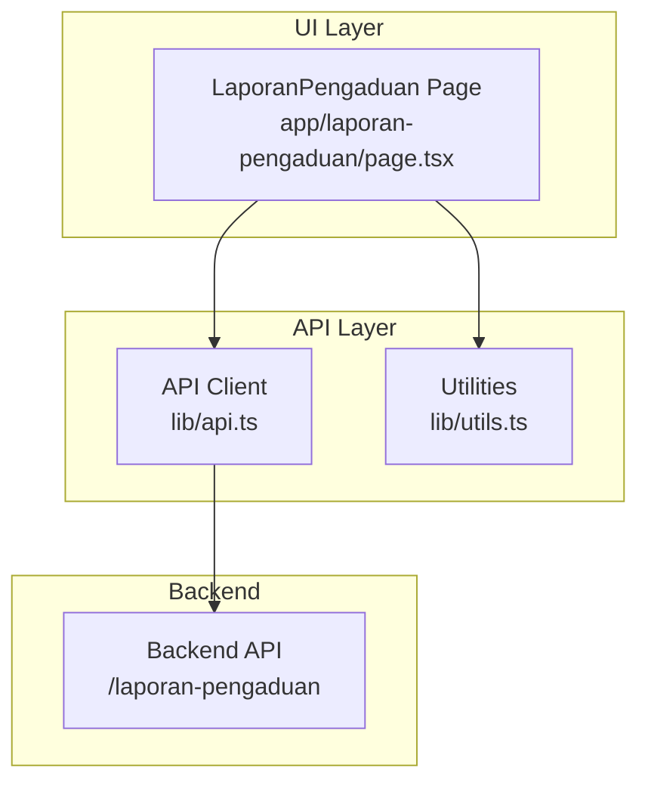
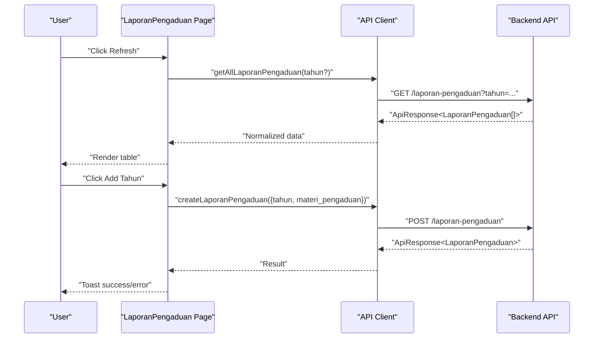
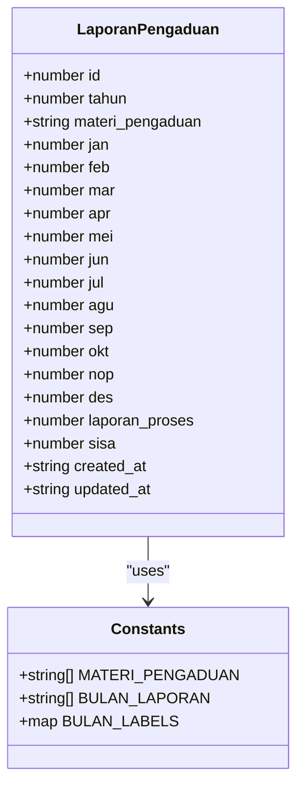
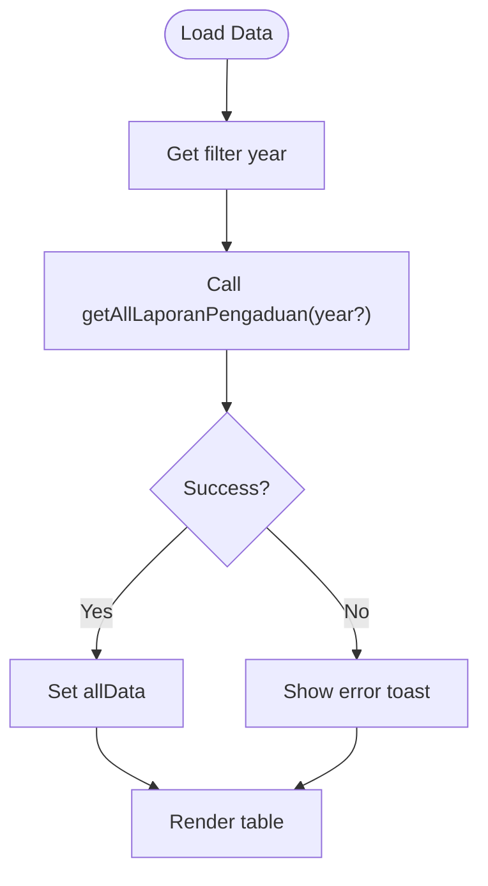
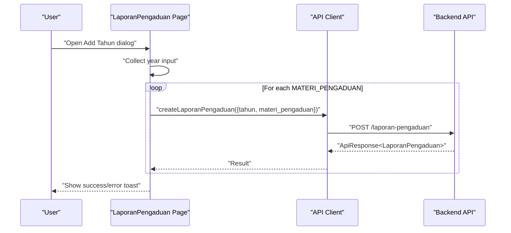
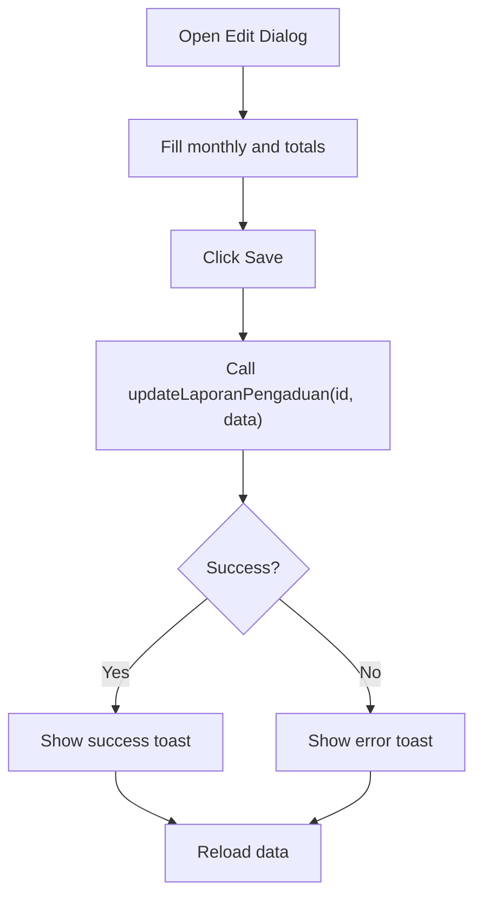
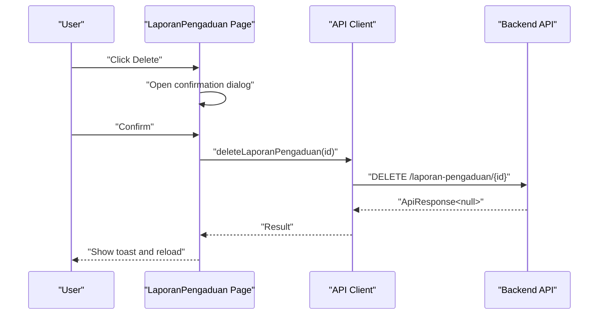
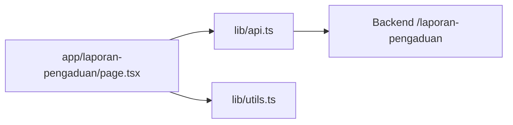

# Laporan Pengaduan (Complaint Reports)

<cite>
**Referenced Files in This Document**
- [page.tsx](file://app/laporan-pengaduan/page.tsx)
- [api.ts](file://lib/api.ts)
- [utils.ts](file://lib/utils.ts)
</cite>

## Table of Contents
1. [Introduction](#introduction)
2. [Project Structure](#project-structure)
3. [Core Components](#core-components)
4. [Architecture Overview](#architecture-overview)
5. [Detailed Component Analysis](#detailed-component-analysis)
6. [Dependency Analysis](#dependency-analysis)
7. [Performance Considerations](#performance-considerations)
8. [Troubleshooting Guide](#troubleshooting-guide)
9. [Conclusion](#conclusion)

## Introduction
This document describes the Laporan Pengaduan (Complaint Reports) module, which provides a centralized system for managing and tracking public complaints received by the institution. The module enables administrators to:
- View aggregated complaint statistics by month and category
- Add new annual datasets for all complaint categories
- Edit monthly counts and outstanding balances
- Delete individual records
- Filter data by year

The module follows a structured workflow from data entry to reporting, with built-in validation and error handling.

## Project Structure
The Laporan Pengaduan module consists of:
- A client-side React page that renders the complaint report table and controls
- An API client library that communicates with the backend service
- Utility functions for year selection and formatting

**Diagram sources**
- [page.tsx:32-354](file://app/laporan-pengaduan/page.tsx#L32-L354)
- [api.ts:788-850](file://lib/api.ts#L788-L850)
- [utils.ts:8-16](file://lib/utils.ts#L8-L16)

**Section sources**
- [page.tsx:1-355](file://app/laporan-pengaduan/page.tsx#L1-L355)
- [api.ts:758-850](file://lib/api.ts#L758-L850)
- [utils.ts:1-26](file://lib/utils.ts#L1-L26)

## Core Components
- Complaint Report Page: Renders the main table, filters, dialogs, and actions.
- API Client: Provides functions to fetch, create, update, and delete complaint reports.
- Year Utilities: Generates selectable year options for filtering and adding new data.

Key responsibilities:
- Data loading and filtering by year
- Bulk creation of complaint records per year
- Inline editing of monthly values and totals
- Deletion with confirmation
- Toast notifications for feedback

**Section sources**
- [page.tsx:32-117](file://app/laporan-pengaduan/page.tsx#L32-L117)
- [api.ts:788-850](file://lib/api.ts#L788-L850)
- [utils.ts:8-16](file://lib/utils.ts#L8-L16)

## Architecture Overview
The module follows a client-server architecture:
- The UI triggers actions (load, add, edit, delete)
- The API client sends requests to the backend endpoint
- The backend returns normalized responses
- The UI updates state and displays results

**Diagram sources**
- [page.tsx:43-100](file://app/laporan-pengaduan/page.tsx#L43-L100)
- [api.ts:788-820](file://lib/api.ts#L788-L820)

## Detailed Component Analysis

### Data Model and Types
The complaint report data model defines the shape of each record and supported complaint categories.

**Diagram sources**
- [api.ts:762-786](file://lib/api.ts#L762-L786)

**Section sources**
- [api.ts:762-786](file://lib/api.ts#L762-L786)

### UI Workflow: Loading and Filtering
The page loads complaint data and allows filtering by year. It supports:
- Loading all data or filtered by a specific year
- Displaying skeleton loaders during fetch
- Showing empty state messages

**Diagram sources**
- [page.tsx:43-58](file://app/laporan-pengaduan/page.tsx#L43-L58)

**Section sources**
- [page.tsx:32-60](file://app/laporan-pengaduan/page.tsx#L32-L60)

### UI Workflow: Adding New Year Records
Administrators can add a new year’s worth of complaint records. The system:
- Prompts for a year
- Iterates through all complaint categories
- Creates one record per category for the selected year
- Provides feedback via toast messages

**Diagram sources**
- [page.tsx:78-100](file://app/laporan-pengaduan/page.tsx#L78-L100)
- [api.ts:800-820](file://lib/api.ts#L800-L820)

**Section sources**
- [page.tsx:78-100](file://app/laporan-pengaduan/page.tsx#L78-L100)
- [api.ts:800-820](file://lib/api.ts#L800-L820)

### UI Workflow: Editing Monthly Values
Users can edit monthly complaint counts and totals:
- Opens an edit dialog with inputs for each month and totals
- Saves changes via update API
- Shows success or error feedback

**Diagram sources**
- [page.tsx:102-117](file://app/laporan-pengaduan/page.tsx#L102-L117)
- [api.ts:822-842](file://lib/api.ts#L822-L842)

**Section sources**
- [page.tsx:254-304](file://app/laporan-pengaduan/page.tsx#L254-L304)
- [page.tsx:102-117](file://app/laporan-pengaduan/page.tsx#L102-L117)
- [api.ts:822-842](file://lib/api.ts#L822-L842)

### UI Workflow: Deleting Records
The module supports deleting individual records with confirmation:
- Opens a confirmation dialog
- Calls delete API on confirmation
- Shows feedback and reloads data

**Diagram sources**
- [page.tsx:62-76](file://app/laporan-pengaduan/page.tsx#L62-L76)
- [api.ts:844-850](file://lib/api.ts#L844-L850)

**Section sources**
- [page.tsx:306-321](file://app/laporan-pengaduan/page.tsx#L306-L321)
- [api.ts:844-850](file://lib/api.ts#L844-L850)

### Form Fields, Validation, and Data Entry Patterns
Form fields and validation rules:
- Monthly fields: integer inputs with minimum 0
- Totals fields: integer inputs with minimum 0
- Year selector: numeric dropdown generated from utilities
- Category selector: predefined list of complaint categories

Data entry patterns:
- Bulk creation per year iterates through all complaint categories
- Inline editing updates only changed fields
- Numeric inputs enforce non-negative values

**Section sources**
- [page.tsx:264-296](file://app/laporan-pengaduan/page.tsx#L264-L296)
- [page.tsx:332-341](file://app/laporan-pengaduan/page.tsx#L332-L341)
- [api.ts:762-770](file://lib/api.ts#L762-L770)

### Complaint Types and Categories
Supported complaint categories:
- Ethics violations by judges
- Abuse of authority
- Civil servant discipline breaches
- Questionable conduct
- Procedural law violations
- Administrative mistakes
- Unsatisfactory public service

These categories are used to seed new yearly datasets and populate the table rows.

**Section sources**
- [api.ts:762-770](file://lib/api.ts#L762-L770)

### Processing Timelines and Resolution Status
Processing indicators:
- Monthly counts per category
- Total under processing
- Outstanding balance

Resolution monitoring:
- Outstanding balance reflects unresolved complaints
- Monthly trends enable tracking resolution progress

Note: The module does not define explicit SLAs or status transitions beyond totals and monthly counts.

**Section sources**
- [page.tsx:182-188](file://app/laporan-pengaduan/page.tsx#L182-L188)
- [page.tsx:207-216](file://app/laporan-pengaduan/page.tsx#L207-L216)

### Integration with Administrative Systems
Integration points:
- Backend endpoint: /laporan-pengaduan
- API client functions: getAllLaporanPengaduan, createLaporanPengaduan, updateLaporanPengaduan, deleteLaporanPengaduan
- Year utilities for dynamic year selection

The API client normalizes responses and handles errors consistently.

**Section sources**
- [api.ts:788-850](file://lib/api.ts#L788-L850)
- [utils.ts:8-16](file://lib/utils.ts#L8-L16)

### Compliance and Audit Trail
Compliance considerations:
- The backend returns normalized responses with success flags and messages
- Error handling surfaces field-specific messages when available
- Created/updated timestamps are included in the data model

Audit trail maintenance:
- The data model includes created_at and updated_at fields
- API responses carry metadata enabling traceability

**Section sources**
- [api.ts:43-80](file://lib/api.ts#L43-L80)
- [api.ts:778-786](file://lib/api.ts#L778-L786)

## Dependency Analysis
The module exhibits low coupling and clear separation of concerns:
- UI depends on API client and utilities
- API client encapsulates backend communication
- Utilities provide reusable helpers

**Diagram sources**
- [page.tsx:1-25](file://app/laporan-pengaduan/page.tsx#L1-L25)
- [api.ts:1-1144](file://lib/api.ts#L1-L1144)
- [utils.ts:1-26](file://lib/utils.ts#L1-L26)

**Section sources**
- [page.tsx:1-25](file://app/laporan-pengaduan/page.tsx#L1-L25)
- [api.ts:1-1144](file://lib/api.ts#L1-L1144)
- [utils.ts:1-26](file://lib/utils.ts#L1-L26)

## Performance Considerations
- Data fetching uses cache-control set to no-store to ensure fresh data on each load
- Bulk creation loops through categories sequentially; consider batching if performance becomes a concern
- UI uses skeleton loaders to improve perceived performance during fetches

## Troubleshooting Guide
Common issues and resolutions:
- Data loading failures: The UI shows an error toast and clears the dataset
- API errors: The API client parses error responses and returns user-friendly messages
- Year selection: Ensure the selected year falls within the generated range from utilities

Operational tips:
- Use the refresh action to reload data after edits
- Confirm deletions before proceeding
- Verify numeric inputs are non-negative

**Section sources**
- [page.tsx:53-56](file://app/laporan-pengaduan/page.tsx#L53-L56)
- [api.ts:806-818](file://lib/api.ts#L806-L818)
- [utils.ts:8-16](file://lib/utils.ts#L8-L16)

## Conclusion
The Laporan Pengaduan module provides a robust, user-friendly interface for managing complaint reports. It supports bulk data entry, inline editing, and year-based filtering while maintaining clear audit trails and consistent error handling. Administrators can track monthly trends and outstanding balances to monitor resolution progress effectively.