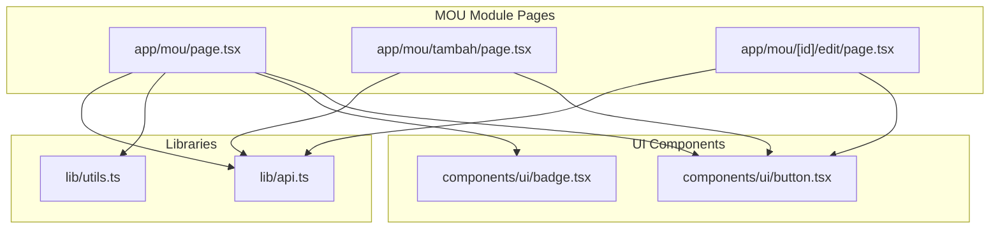
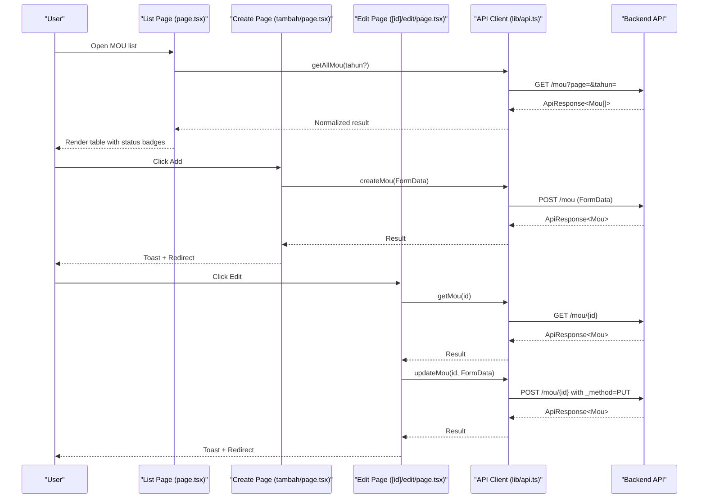
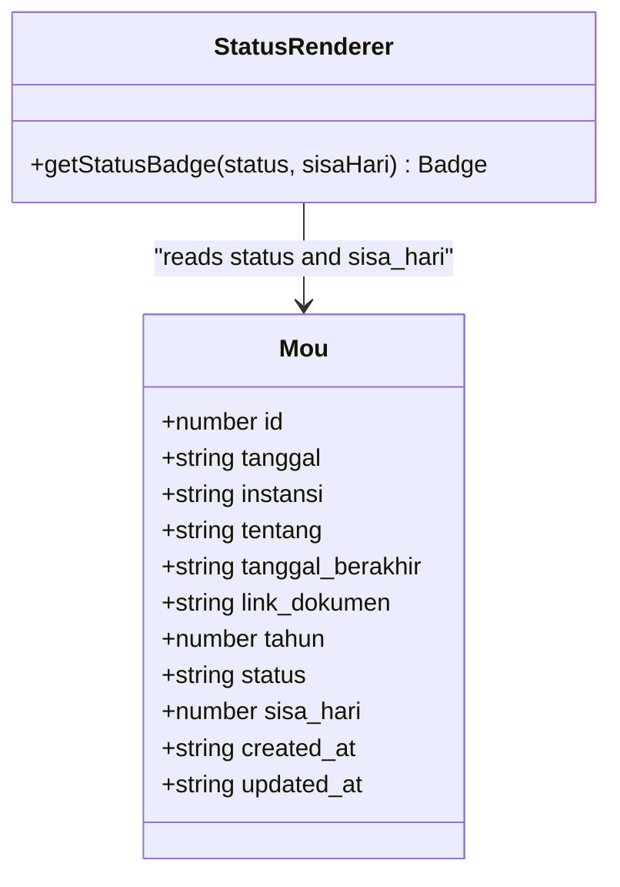
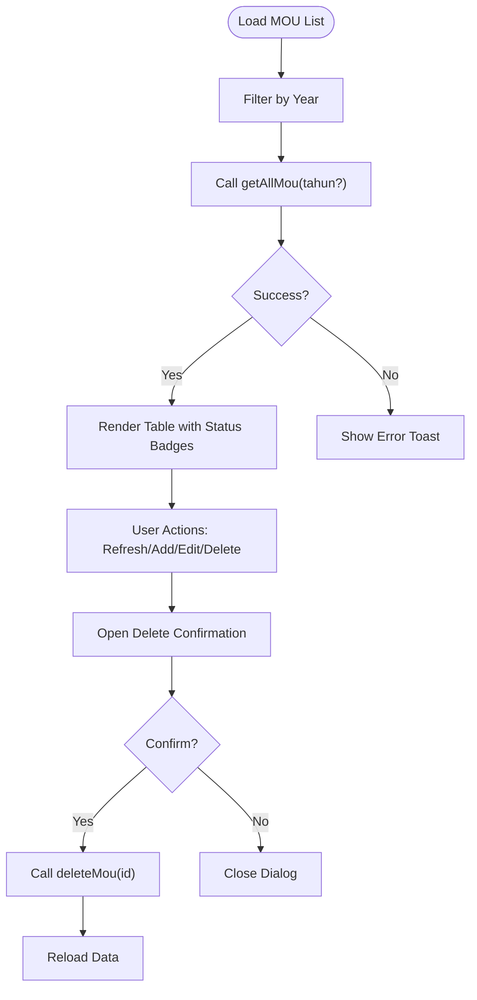
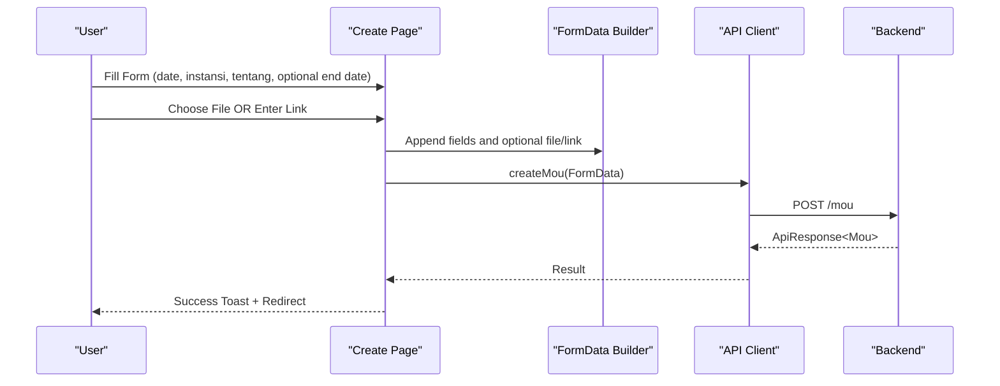
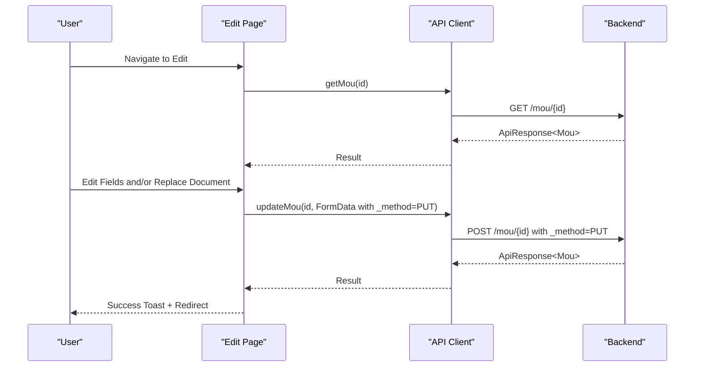
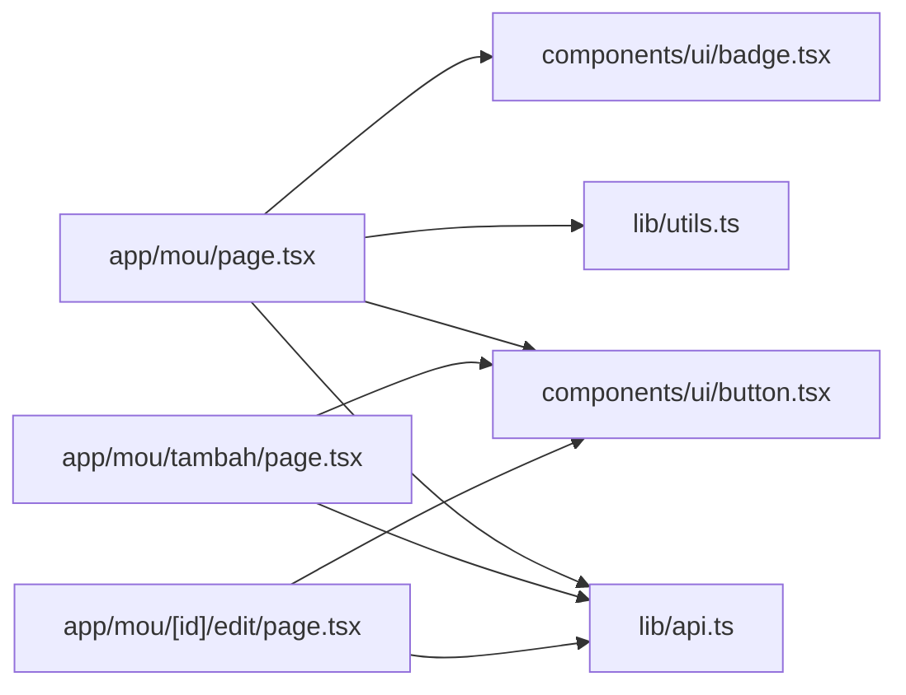

# MOU (Memorandum of Understanding)

<cite>
**Referenced Files in This Document**
- [app/mou/page.tsx](file://app/mou/page.tsx)
- [app/mou/tambah/page.tsx](file://app/mou/tambah/page.tsx)
- [app/mou/[id]/edit/page.tsx](file://app/mou/[id]/edit/page.tsx)
- [lib/api.ts](file://lib/api.ts)
- [lib/utils.ts](file://lib/utils.ts)
- [components/ui/badge.tsx](file://components/ui/badge.tsx)
- [components/ui/button.tsx](file://components/ui/button.tsx)
</cite>

## Table of Contents
1. [Introduction](#introduction)
2. [Project Structure](#project-structure)
3. [Core Components](#core-components)
4. [Architecture Overview](#architecture-overview)
5. [Detailed Component Analysis](#detailed-component-analysis)
6. [Dependency Analysis](#dependency-analysis)
7. [Performance Considerations](#performance-considerations)
8. [Troubleshooting Guide](#troubleshooting-guide)
9. [Conclusion](#conclusion)

## Introduction
This document provides comprehensive coverage of the MOU (Memorandum of Understanding) module within the administrative panel. It explains the end-to-end workflow for creating, tracking, and managing inter-organizational agreements, including form fields, validation rules, data entry patterns, status tracking, and integration with backend APIs. It also outlines compliance monitoring capabilities, expiration date handling, and audit trail considerations derived from the existing UI and API contracts.

## Project Structure
The MOU module is organized around three primary Next.js pages under the `/mou` route:
- List view: displays all MOUs with filtering by year and action controls
- Create view: captures new MOU data and optional document attachment
- Edit view: updates existing MOU records and replaces documents when needed

Supporting infrastructure includes:
- API client functions for CRUD operations and year filtering
- Utility helpers for year options and localization
- UI components for badges, buttons, forms, and dialogs

**Diagram sources**
- [app/mou/page.tsx:1-219](file://app/mou/page.tsx#L1-L219)
- [app/mou/tambah/page.tsx:1-170](file://app/mou/tambah/page.tsx#L1-L170)
- [app/mou/[id]/edit/page.tsx](file://app/mou/[id]/edit/page.tsx#L1-L201)
- [lib/api.ts:1028-1073](file://lib/api.ts#L1028-L1073)
- [lib/utils.ts:8-16](file://lib/utils.ts#L8-L16)
- [components/ui/badge.tsx:1-37](file://components/ui/badge.tsx#L1-L37)
- [components/ui/button.tsx:1-58](file://components/ui/button.tsx#L1-L58)

**Section sources**
- [app/mou/page.tsx:1-219](file://app/mou/page.tsx#L1-L219)
- [app/mou/tambah/page.tsx:1-170](file://app/mou/tambah/page.tsx#L1-L170)
- [app/mou/[id]/edit/page.tsx](file://app/mou/[id]/edit/page.tsx#L1-L201)
- [lib/api.ts:1028-1073](file://lib/api.ts#L1028-L1073)
- [lib/utils.ts:8-16](file://lib/utils.ts#L8-L16)
- [components/ui/badge.tsx:1-37](file://components/ui/badge.tsx#L1-L37)
- [components/ui/button.tsx:1-58](file://components/ui/button.tsx#L1-L58)

## Core Components
- MOU data model: includes identifiers, dates, parties, subject, optional end date, document linkage, computed year, status, remaining days, and timestamps.
- List page: loads MOU entries, filters by year, renders status badges, and provides actions (edit/delete).
- Create page: collects required fields, optional end date, and optional document upload or manual link entry.
- Edit page: preloads existing data, allows updating fields, replacing documents, and viewing current document links.
- API integration: standardized fetch wrappers with JSON or FormData support, normalized response handling, and API key header injection.
- Utilities: year options generator for filtering and date formatting helpers.

Key data fields and validation rules:
- Required fields: date, institution name, subject.
- Optional fields: end date, document file or link.
- Validation patterns: date inputs, file type constraints (.pdf, .jpg, .jpeg, .png), file size limit guidance in UI.

Status and expiration:
- Status is displayed via colored badges with dynamic remaining days for active agreements.
- Expiration is inferred from end date and current date; UI indicates expired state.

**Section sources**
- [lib/api.ts:1014-1026](file://lib/api.ts#L1014-L1026)
- [app/mou/page.tsx:25-39](file://app/mou/page.tsx#L25-L39)
- [app/mou/tambah/page.tsx:76-152](file://app/mou/tambah/page.tsx#L76-L152)
- [app/mou/[id]/edit/page.tsx](file://app/mou/[id]/edit/page.tsx#L98-L182)
- [lib/utils.ts:8-16](file://lib/utils.ts#L8-L16)

## Architecture Overview
The MOU module follows a clean separation of concerns:
- UI pages orchestrate user interactions and state.
- API client encapsulates network requests and normalization.
- UI components provide reusable building blocks for forms, tables, and badges.

**Diagram sources**
- [app/mou/page.tsx:50-61](file://app/mou/page.tsx#L50-L61)
- [app/mou/tambah/page.tsx:28-56](file://app/mou/tambah/page.tsx#L28-L56)
- [app/mou/[id]/edit/page.tsx](file://app/mou/[id]/edit/page.tsx#L25-L68)
- [lib/api.ts:1028-1073](file://lib/api.ts#L1028-L1073)

## Detailed Component Analysis

### MOU Data Model and Status Rendering
The MOU interface defines the shape of agreement records, including optional end date, document link, computed year, status, remaining days, and timestamps. The list page renders status badges with dynamic remaining days for active agreements and marks expired ones distinctly.

**Diagram sources**
- [lib/api.ts:1014-1026](file://lib/api.ts#L1014-L1026)
- [app/mou/page.tsx:25-39](file://app/mou/page.tsx#L25-L39)

**Section sources**
- [lib/api.ts:1014-1026](file://lib/api.ts#L1014-L1026)
- [app/mou/page.tsx:25-39](file://app/mou/page.tsx#L25-L39)

### MOU List View Workflow
The list page:
- Loads MOU data filtered by selected year (or all years).
- Displays a responsive table with date, institution, subject, status, and document link.
- Provides refresh, add, edit, and delete actions.
- Uses a confirm dialog for deletion.

**Diagram sources**
- [app/mou/page.tsx:50-80](file://app/mou/page.tsx#L50-L80)
- [lib/api.ts:1028-1035](file://lib/api.ts#L1028-L1035)

**Section sources**
- [app/mou/page.tsx:41-219](file://app/mou/page.tsx#L41-L219)
- [lib/api.ts:1028-1035](file://lib/api.ts#L1028-L1035)

### MOU Creation Workflow
The create page:
- Initializes form with today’s date and empty fields.
- Requires date, institution, and subject; end date is optional.
- Supports uploading a document file or entering a manual document link (mutually exclusive UX).
- Submits data as FormData to include optional file attachments.

**Diagram sources**
- [app/mou/tambah/page.tsx:28-56](file://app/mou/tambah/page.tsx#L28-L56)
- [lib/api.ts:1043-1051](file://lib/api.ts#L1043-L1051)

**Section sources**
- [app/mou/tambah/page.tsx:14-170](file://app/mou/tambah/page.tsx#L14-L170)
- [lib/api.ts:1043-1051](file://lib/api.ts#L1043-L1051)

### MOU Edit Workflow
The edit page:
- Loads existing record by ID.
- Allows editing required fields and optional end date.
- Supports replacing the document: either upload a new file or keep the current link.
- Submits updates as FormData with method override for file uploads.

**Diagram sources**
- [app/mou/[id]/edit/page.tsx](file://app/mou/[id]/edit/page.tsx#L25-L68)
- [lib/api.ts:1053-1065](file://lib/api.ts#L1053-L1065)

**Section sources**
- [app/mou/[id]/edit/page.tsx](file://app/mou/[id]/edit/page.tsx#L15-L201)
- [lib/api.ts:1053-1065](file://lib/api.ts#L1053-L1065)

### Compliance Monitoring and Audit Trail
- Status badges reflect active/expired states, enabling quick visibility of compliance timelines.
- Document linkage (file upload or external link) supports audit trail maintenance by preserving evidence.
- Timestamp fields in the data model indicate creation/update history for records.
- Year filtering facilitates historical tracking and compliance reporting.

Note: The current implementation does not include explicit renewal workflows or automated expiration reminders. These could be introduced by extending the data model and adding background tasks or scheduled checks in the backend.

**Section sources**
- [lib/api.ts:1014-1026](file://lib/api.ts#L1014-L1026)
- [app/mou/page.tsx:25-39](file://app/mou/page.tsx#L25-L39)
- [app/mou/tambah/page.tsx:125-152](file://app/mou/tambah/page.tsx#L125-L152)
- [app/mou/[id]/edit/page.tsx](file://app/mou/[id]/edit/page.tsx#L147-L182)

## Dependency Analysis
The MOU module exhibits low coupling and clear responsibilities:
- Pages depend on API client functions for data operations.
- List page depends on utility helpers for year options and UI components for badges and buttons.
- Edit and create pages share similar patterns for FormData submission and validation.

**Diagram sources**
- [app/mou/page.tsx:1-219](file://app/mou/page.tsx#L1-L219)
- [app/mou/tambah/page.tsx:1-170](file://app/mou/tambah/page.tsx#L1-L170)
- [app/mou/[id]/edit/page.tsx](file://app/mou/[id]/edit/page.tsx#L1-L201)
- [lib/api.ts:1028-1073](file://lib/api.ts#L1028-L1073)
- [lib/utils.ts:8-16](file://lib/utils.ts#L8-L16)
- [components/ui/badge.tsx:1-37](file://components/ui/badge.tsx#L1-L37)
- [components/ui/button.tsx:1-58](file://components/ui/button.tsx#L1-L58)

**Section sources**
- [app/mou/page.tsx:1-219](file://app/mou/page.tsx#L1-L219)
- [app/mou/tambah/page.tsx:1-170](file://app/mou/tambah/page.tsx#L1-L170)
- [app/mou/[id]/edit/page.tsx](file://app/mou/[id]/edit/page.tsx#L1-L201)
- [lib/api.ts:1028-1073](file://lib/api.ts#L1028-L1073)
- [lib/utils.ts:8-16](file://lib/utils.ts#L8-L16)
- [components/ui/badge.tsx:1-37](file://components/ui/badge.tsx#L1-L37)
- [components/ui/button.tsx:1-58](file://components/ui/button.tsx#L1-L58)

## Performance Considerations
- Network requests are executed without caching; consider adding caching strategies for repeated filters or frequent reloads.
- Large document uploads can impact responsiveness; implement progress indicators and validation for file sizes and types.
- Table rendering performance can be improved by virtualization for large datasets.

## Troubleshooting Guide
Common issues and resolutions:
- API connectivity errors: Verify environment variables for API URL and key; ensure network access to the backend endpoint.
- File upload failures: Confirm file type and size constraints; ensure FormData is constructed correctly with method override for updates.
- Toast notifications: Errors and successes are surfaced via toast messages; check console logs for underlying exceptions.
- Year filter anomalies: Ensure selected year is parsed correctly; default to current year if invalid.

**Section sources**
- [lib/api.ts:1-10](file://lib/api.ts#L1-L10)
- [app/mou/tambah/page.tsx:47-55](file://app/mou/tambah/page.tsx#L47-L55)
- [app/mou/[id]/edit/page.tsx](file://app/mou/[id]/edit/page.tsx#L64-L67)

## Conclusion
The MOU module provides a robust foundation for managing inter-organizational agreements with clear workflows for creation, editing, and tracking. It integrates seamlessly with backend APIs, supports document attachments, and offers status visibility through badges. Future enhancements could include automated expiration monitoring, renewal workflows, and expanded compliance reporting features.