# SAKIP (Strategic Planning)

<cite>
**Referenced Files in This Document**
- [app/sakip/page.tsx](file://app/sakip/page.tsx)
- [app/sakip/tambah/page.tsx](file://app/sakip/tambah/page.tsx)
- [app/sakip/[id]/edit/page.tsx](file://app/sakip/[id]/edit/page.tsx)
- [lib/api.ts](file://lib/api.ts)
- [lib/utils.ts](file://lib/utils.ts)
- [components/app-sidebar.tsx](file://components/app-sidebar.tsx)
- [app/layout.tsx](file://app/layout.tsx)
</cite>

## Table of Contents
1. [Introduction](#introduction)
2. [System Architecture](#system-architecture)
3. [Core Components](#core-components)
4. [Strategic Planning Workflow](#strategic-planning-workflow)
5. [Data Model and Form Fields](#data-model-and-form-fields)
6. [Goal Categories and Performance Indicators](#goal-categories-and-performance-indicators)
7. [Target Setting Methodologies](#target-setting-methodologies)
8. [Performance Tracking Systems](#performance-tracking-systems)
9. [Integration with Organizational Systems](#integration-with-organizational-systems)
10. [Compliance and Audit Trail](#compliance-and-audit-trail)
11. [Validation Rules and Data Entry Patterns](#validation-rules-and-data-entry-patterns)
12. [Performance Considerations](#performance-considerations)
13. [Troubleshooting Guide](#troubleshooting-guide)
14. [Conclusion](#conclusion)

## Introduction

SAKIP (Sistem Akuntabilitas Kinerja Instansi Pemerintahan) is a comprehensive Strategic Planning and Performance Management system designed for Indonesian government institutions. This module provides a centralized platform for managing strategic documents, performance targets, and monitoring mechanisms essential for institutional accountability and performance management.

The SAKIP system serves as a critical component in the government's transparency and accountability framework, enabling organizations to establish strategic goals, define performance targets, and implement robust monitoring systems. The system encompasses various document types including strategic plans, performance indicators, action plans, and progress reports that collectively support institutional strategic alignment and performance excellence.

## System Architecture

The SAKIP module follows a modern Next.js architecture with a clear separation of concerns between presentation, business logic, and data management layers.

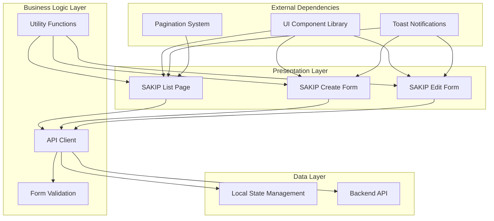

**Diagram sources**
- [app/sakip/page.tsx:1-350](file://app/sakip/page.tsx#L1-L350)
- [app/sakip/tambah/page.tsx:1-175](file://app/sakip/tambah/page.tsx#L1-L175)
- [app/sakip/[id]/edit/page.tsx:1-184](file://app/sakip/[id]/edit/page.tsx#L1-L184)
- [lib/api.ts:654-756](file://lib/api.ts#L654-L756)

The architecture implements a client-server model where the frontend provides user interfaces for data management while the backend handles business logic and data persistence. The system utilizes React hooks for state management and implements comprehensive error handling and user feedback mechanisms.

**Section sources**
- [app/sakip/page.tsx:1-350](file://app/sakip/page.tsx#L1-L350)
- [lib/api.ts:654-756](file://lib/api.ts#L654-L756)

## Core Components

### Main SAKIP List Component

The primary interface for managing SAKIP documents consists of several interconnected components that work together to provide a comprehensive document management solution.

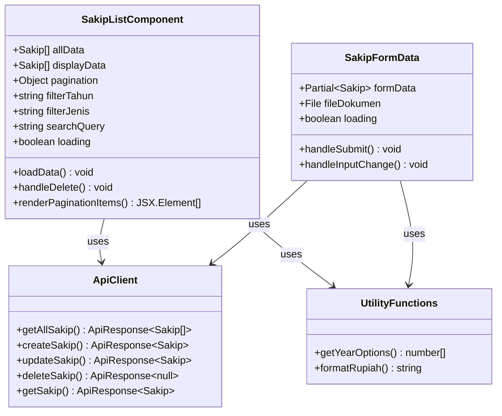

**Diagram sources**
- [app/sakip/page.tsx:30-350](file://app/sakip/page.tsx#L30-L350)
- [app/sakip/tambah/page.tsx:18-175](file://app/sakip/tambah/page.tsx#L18-L175)
- [app/sakip/[id]/edit/page.tsx:18-184](file://app/sakip/[id]/edit/page.tsx#L18-L184)
- [lib/api.ts:654-756](file://lib/api.ts#L654-L756)

### Data Flow Architecture

The system implements a unidirectional data flow pattern that ensures predictable state management and efficient updates.

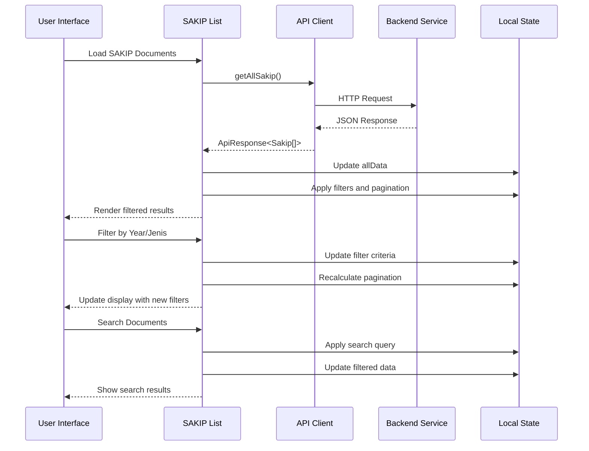

**Diagram sources**
- [app/sakip/page.tsx:46-97](file://app/sakip/page.tsx#L46-L97)
- [lib/api.ts:680-686](file://lib/api.ts#L680-L686)

**Section sources**
- [app/sakip/page.tsx:30-350](file://app/sakip/page.tsx#L30-L350)
- [app/sakip/tambah/page.tsx:18-175](file://app/sakip/tambah/page.tsx#L18-L175)
- [app/sakip/[id]/edit/page.tsx:18-184](file://app/sakip/[id]/edit/page.tsx#L18-L184)

## Strategic Planning Workflow

The SAKIP module implements a comprehensive workflow for establishing and managing strategic planning documents through four distinct phases:

### Phase 1: Strategic Goal Establishment

The strategic goal establishment phase focuses on defining institutional objectives and aligning them with broader organizational missions and vision statements.

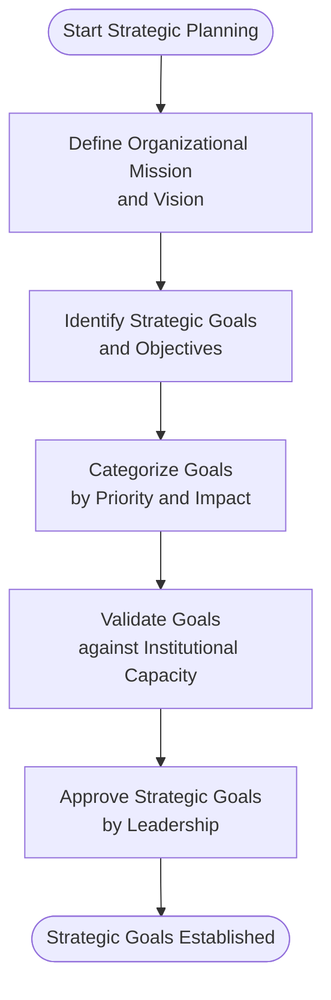

**Diagram sources**
- [lib/api.ts:658-666](file://lib/api.ts#L658-L666)

### Phase 2: Performance Target Definition

Performance target definition involves translating strategic goals into measurable indicators and quantifiable targets.

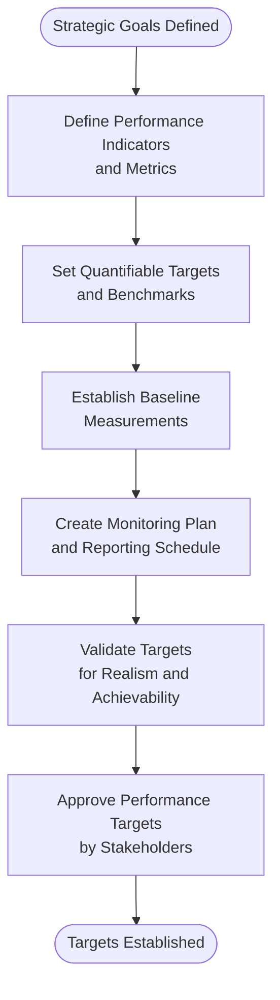

**Diagram sources**
- [lib/api.ts:670-678](file://lib/api.ts#L670-L678)

### Phase 3: Implementation and Action Planning

Implementation focuses on developing actionable plans and resource allocation strategies to achieve established targets.

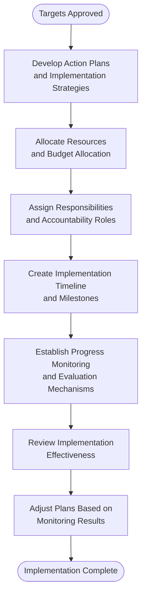

**Diagram sources**
- [app/sakip/tambah/page.tsx:37-64](file://app/sakip/tambah/page.tsx#L37-L64)

### Phase 4: Performance Monitoring and Evaluation

The final phase emphasizes continuous monitoring, evaluation, and improvement of strategic initiatives.

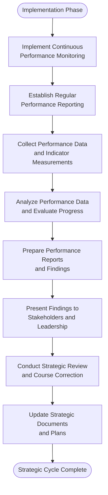

**Diagram sources**
- [app/sakip/page.tsx:46-65](file://app/sakip/page.tsx#L46-L65)

**Section sources**
- [lib/api.ts:658-678](file://lib/api.ts#L658-L678)
- [app/sakip/tambah/page.tsx:37-64](file://app/sakip/tambah/page.tsx#L37-L64)
- [app/sakip/page.tsx:46-65](file://app/sakip/page.tsx#L46-L65)

## Data Model and Form Fields

The SAKIP system implements a structured data model designed to capture comprehensive strategic planning information with robust validation and extensibility capabilities.

### Core Data Model Structure

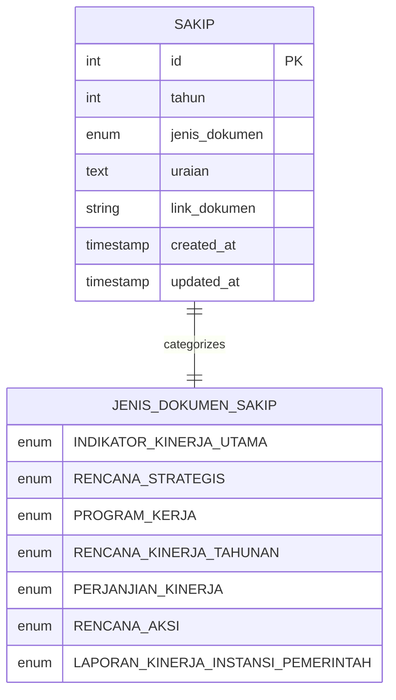

**Diagram sources**
- [lib/api.ts:670-678](file://lib/api.ts#L670-L678)
- [lib/api.ts:658-666](file://lib/api.ts#L658-L666)

### Form Field Specifications

The SAKIP forms implement comprehensive field validation and user experience design to ensure data quality and accessibility.

#### Mandatory Fields

| Field | Type | Validation | Purpose |
|-------|------|------------|---------|
| tahun | Integer | Required, Year Range (2019-current+1) | Document Year |
| jenis_dokumen | Enum | Required, Predefined Options | Document Category |
| uraian | Text Area | Optional, Max Length 500 chars | Document Description |

#### Optional Fields

| Field | Type | Validation | Purpose |
|-------|------|------------|---------|
| link_dokumen | File Upload | Optional, Format Validation | Document Attachment |

#### File Upload Specifications

The system supports multiple document formats with strict validation:

- **Supported Formats**: PDF, DOC, DOCX, JPG, JPEG, PNG
- **Maximum Size**: 20MB
- **Validation**: Automatic format checking and size verification
- **Preview**: File selection confirmation with filename display

**Section sources**
- [lib/api.ts:670-678](file://lib/api.ts#L670-L678)
- [app/sakip/tambah/page.tsx:78-136](file://app/sakip/tambah/page.tsx#L78-L136)
- [app/sakip/[id]/edit/page.tsx:95-168](file://app/sakip/[id]/edit/page.tsx#L95-L168)

## Goal Categories and Performance Indicators

The SAKIP system categorizes strategic documents into seven distinct goal categories, each serving specific strategic planning purposes and aligned with Indonesian government performance management frameworks.

### Document Category Classification

| Category | Code | Description | Strategic Purpose |
|----------|------|-------------|-------------------|
| Indikator Kinerja Utama | IKU | Key Performance Indicators | Primary measurement metrics |
| Rencana Strategis | RS | Strategic Plan | Long-term institutional direction |
| Program Kerja | RK | Work Program | Operational implementation |
| Rencana Kinerja Tahunan | RKT | Annual Performance Plan | Short-term operational targets |
| Perjanjian Kinerja | PK | Performance Agreement | Performance commitment |
| Rencana Aksi | RA | Action Plan | Specific implementation steps |
| Laporan Kinerja Instansi Pemerintahan | LKIP | Government Agency Performance Report | Comprehensive performance reporting |

### Performance Indicator Framework

Each document category supports specific performance indicator types and measurement approaches:

```mermaid
graph LR
subgraph "Performance Indicators"
Quantitative[Quantitative Indicators]
Qualitative[Qualitative Indicators]
Composite[Composite Indicators]
end
subgraph "Measurement Types"
Numerical[Numerical Values]
Percentage[Percentage Ratios]
Rating[Rating Scales]
Status[Status Indicators]
end
subgraph "Time Horizons"
ShortTerm[Short Term (Monthly)]
MediumTerm[Medium Term (Quarterly)]
LongTerm[Long Term (Annual)]
end
Quantitative --> Numerical
Quantitative --> Percentage
Qualitative --> Rating
Qualitative --> Status
Composite --> Numerical
Composite --> Percentage
```

**Diagram sources**
- [lib/api.ts:658-666](file://lib/api.ts#L658-L666)

**Section sources**
- [lib/api.ts:658-666](file://lib/api.ts#L658-L666)

## Target Setting Methodologies

The SAKIP system implements evidence-based target setting methodologies that align with international best practices and Indonesian government performance management standards.

### SMART Target Setting Framework

The system incorporates the SMART criteria for effective target establishment:

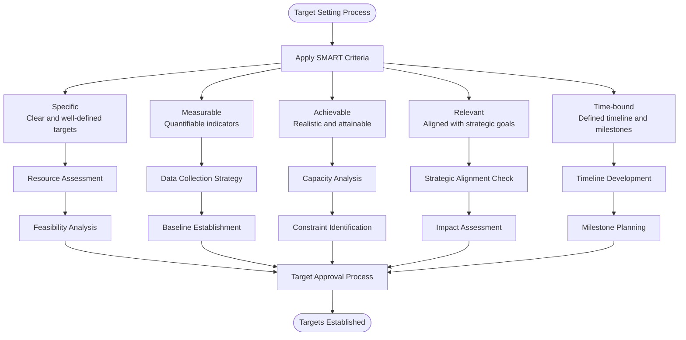

**Diagram sources**
- [app/sakip/tambah/page.tsx:37-64](file://app/sakip/tambah/page.tsx#L37-L64)

### Evidence-Based Target Calculation

The system supports various calculation methodologies for establishing performance targets:

#### Baseline Methodology
- Historical performance data analysis
- Trend identification and projection
- Benchmark establishment against similar institutions
- Adjustment factors for capacity and constraints

#### Growth Rate Methodology
- Compound annual growth rate (CAGR) calculations
- Industry standard benchmarking
- Performance improvement targets
- Progressive target setting

#### Goal-Based Methodology
- Strategic objective alignment
- Resource availability assessment
- Capability gap analysis
- Target decomposition and aggregation

**Section sources**
- [app/sakip/tambah/page.tsx:37-64](file://app/sakip/tambah/page.tsx#L37-L64)

## Performance Tracking Systems

The SAKIP module implements comprehensive performance tracking mechanisms that enable continuous monitoring, evaluation, and improvement of strategic initiatives.

### Monitoring Dashboard Architecture

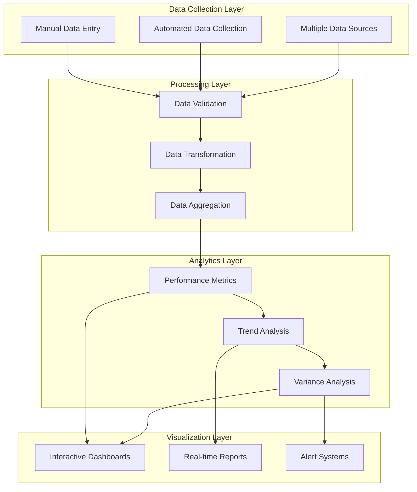

**Diagram sources**
- [app/sakip/page.tsx:46-97](file://app/sakip/page.tsx#L46-L97)

### Performance Measurement Framework

The system implements a multi-dimensional performance measurement approach:

#### Key Performance Areas
- **Financial Performance**: Budget utilization, cost efficiency, revenue generation
- **Operational Performance**: Service delivery, process efficiency, quality metrics
- **Strategic Performance**: Goal achievement, strategic initiative progress, innovation metrics
- **Stakeholder Performance**: Customer satisfaction, community impact, partnership effectiveness

#### Measurement Frequency
- **Daily**: Transaction volumes, service delivery rates
- **Weekly**: Process completion times, quality scores
- **Monthly**: Financial metrics, operational efficiency
- **Quarterly**: Strategic progress, stakeholder feedback
- **Annually**: Comprehensive performance review, goal achievement

### Early Warning Systems

The system incorporates automated alert mechanisms for performance deviations:

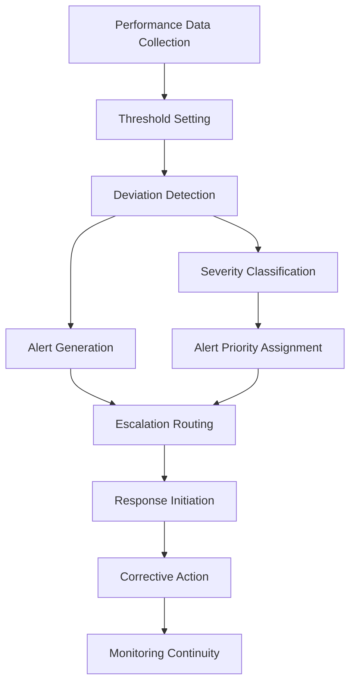

**Diagram sources**
- [app/sakip/page.tsx:99-113](file://app/sakip/page.tsx#L99-L113)

**Section sources**
- [app/sakip/page.tsx:46-97](file://app/sakip/page.tsx#L46-L97)
- [app/sakip/page.tsx:99-113](file://app/sakip/page.tsx#L99-L113)

## Integration with Organizational Systems

The SAKIP module integrates seamlessly with existing organizational systems to provide comprehensive strategic planning and performance management capabilities.

### System Integration Architecture

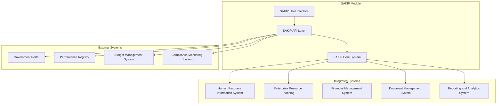

**Diagram sources**
- [lib/api.ts:654-756](file://lib/api.ts#L654-L756)

### Data Exchange Protocols

The system implements standardized data exchange protocols for seamless integration:

#### API Integration Standards
- **RESTful API Design**: Standard HTTP methods and status codes
- **JSON Data Format**: Consistent data serialization and deserialization
- **Authentication**: API key-based security with header validation
- **Error Handling**: Comprehensive error response formatting
- **Rate Limiting**: Controlled API access to prevent system overload

#### Data Synchronization
- **Real-time Synchronization**: Live data updates across integrated systems
- **Batch Processing**: Scheduled data synchronization for large datasets
- **Conflict Resolution**: Automated conflict detection and resolution
- **Audit Trail**: Complete data change tracking and history

### Cross-System Navigation

The SAKIP module provides seamless navigation between integrated systems:

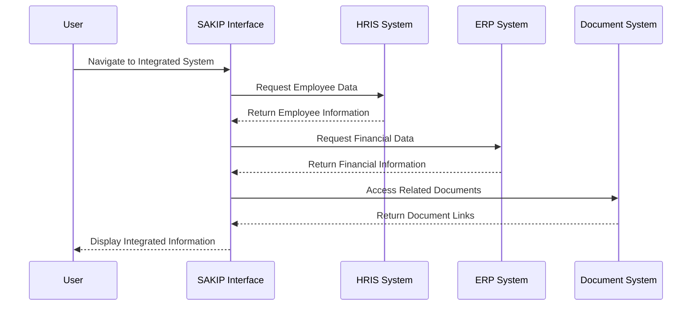

**Diagram sources**
- [components/app-sidebar.tsx:100-104](file://components/app-sidebar.tsx#L100-L104)

**Section sources**
- [lib/api.ts:654-756](file://lib/api.ts#L654-L756)
- [components/app-sidebar.tsx:100-104](file://components/app-sidebar.tsx#L100-L104)

## Compliance and Audit Trail

The SAKIP system implements comprehensive compliance mechanisms and maintains detailed audit trails to ensure regulatory adherence and transparency.

### Regulatory Compliance Framework

The system adheres to Indonesian government regulations governing strategic planning and performance management:

#### Legal Framework Compliance
- **Government Regulation No. 75/2014**: Performance-based budgeting requirements
- **Law No. 33/2004**: Government transparency and accountability provisions
- **Government Regulation No. 57/2014**: Public sector performance management guidelines
- **Ministry of Finance Regulations**: Strategic planning and budgeting procedures

#### Compliance Validation Mechanisms

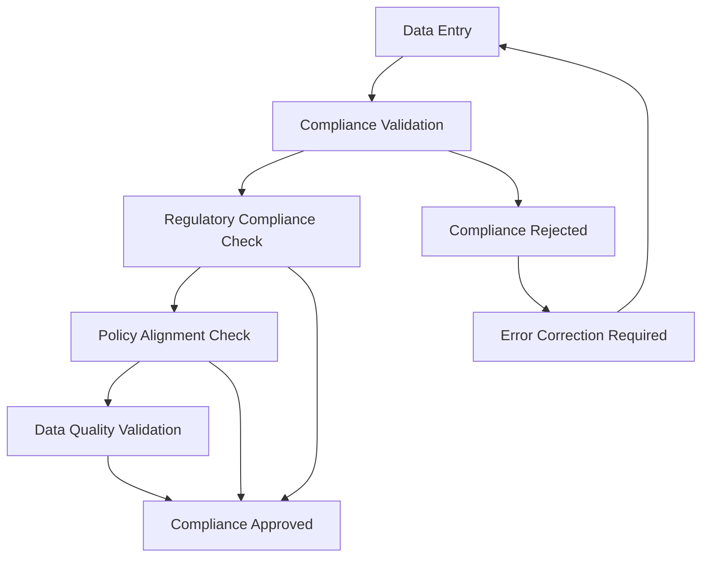

**Diagram sources**
- [lib/api.ts:694-748](file://lib/api.ts#L694-L748)

### Audit Trail Implementation

The system maintains comprehensive audit trails for all data modifications and access activities:

#### Audit Event Types
- **Document Creation**: New SAKIP document creation timestamps and user identification
- **Document Updates**: Modification history with change descriptions and user attribution
- **Document Deletion**: Deletion records with reason codes and approval traces
- **Access Logs**: User access patterns and document viewing history
- **System Events**: API usage statistics and system maintenance activities

#### Audit Data Retention
- **Transaction History**: 5 years retention for financial and performance data
- **Access Logs**: 1 year retention for user access patterns
- **System Logs**: 3 months retention for system events and errors
- **Compliance Reports**: Permanent retention for regulatory compliance

### Quality Assurance Measures

The system implements multiple quality assurance mechanisms:

#### Data Validation Layers
- **Input Validation**: Real-time field validation during data entry
- **Business Rule Validation**: Application of business logic constraints
- **Cross-System Validation**: Consistency checks across integrated systems
- **Statistical Validation**: Anomaly detection and outlier identification

#### Quality Metrics
- **Data Accuracy**: Validation of data completeness and correctness
- **Data Timeliness**: Monitoring of data update frequencies and deadlines
- **System Availability**: Uptime monitoring and service level agreements
- **User Satisfaction**: Feedback collection and performance metrics

**Section sources**
- [lib/api.ts:694-748](file://lib/api.ts#L694-L748)

## Validation Rules and Data Entry Patterns

The SAKIP system implements comprehensive validation rules and standardized data entry patterns to ensure data quality, consistency, and regulatory compliance.

### Form Validation Architecture

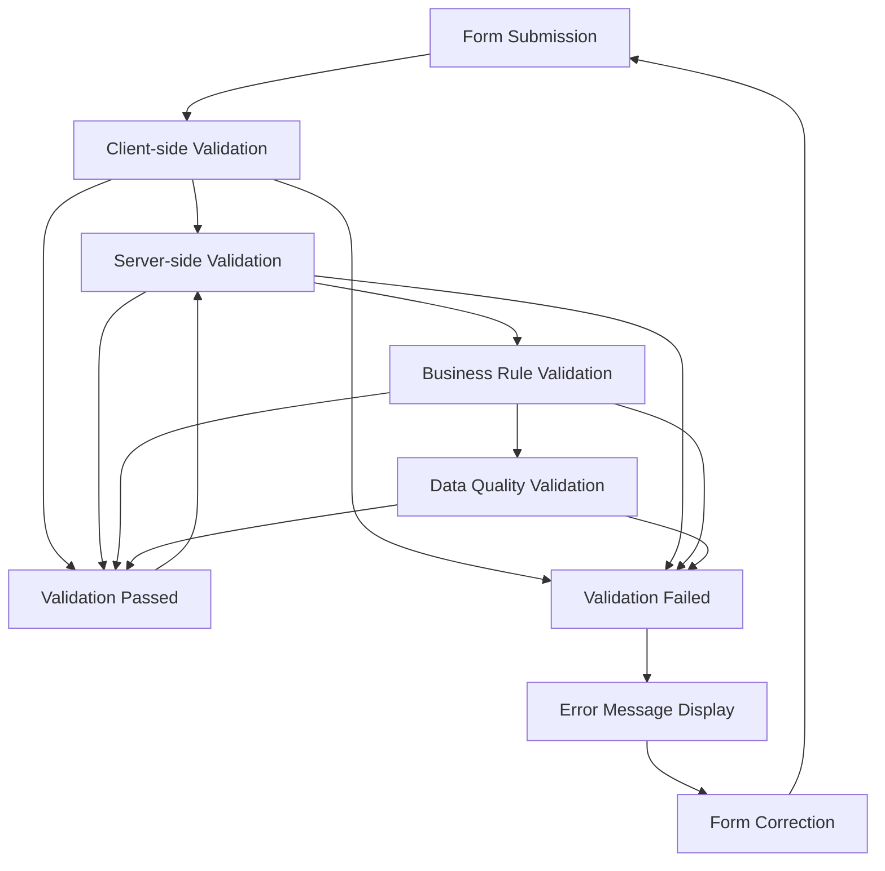

**Diagram sources**
- [app/sakip/tambah/page.tsx:37-64](file://app/sakip/tambah/page.tsx#L37-L64)

### Field-Level Validation Rules

#### Mandatory Field Validation
- **Tahun (Year)**: Required field with validation against generated year options
- **Jenis Dokumen**: Required dropdown selection from predefined categories
- **Uraian**: Optional field with character limit enforcement

#### Data Type Validation
- **Numeric Fields**: Integer validation with range constraints
- **Date Fields**: Date format validation and logical date range checking
- **Text Fields**: Character encoding validation and length limits
- **File Uploads**: MIME type validation and size constraint checking

#### Business Logic Validation
- **Unique Constraints**: Prevention of duplicate document entries
- **Referential Integrity**: Validation of cross-references to related data
- **Logical Consistency**: Validation of relationships between related fields
- **Capacity Limits**: Validation against organizational capacity constraints

### Data Entry Patterns

#### Standardized Entry Forms
The system implements consistent form layouts across all document types:

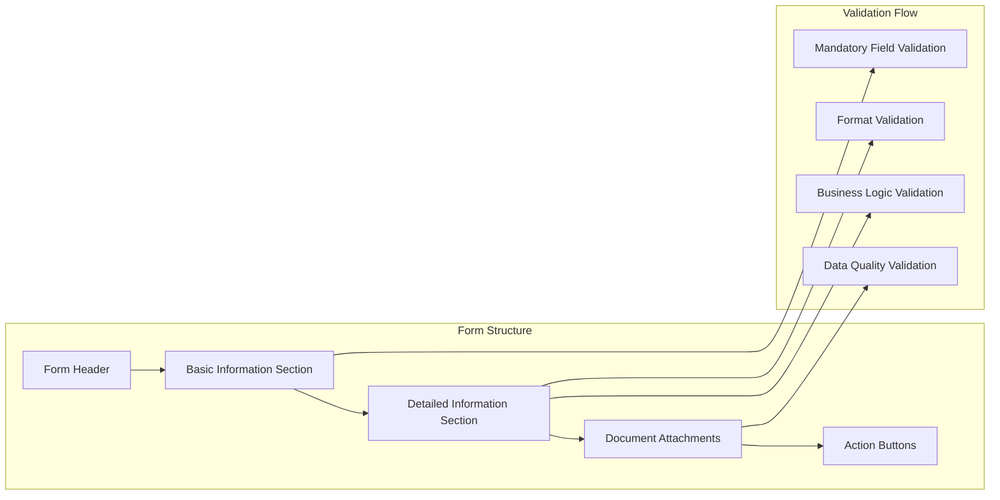

**Diagram sources**
- [app/sakip/tambah/page.tsx:75-145](file://app/sakip/tambah/page.tsx#L75-L145)

#### User Experience Enhancements
- **Auto-save Functionality**: Automatic saving of form progress
- **Real-time Validation**: Immediate feedback on input errors
- **Help Text Integration**: Contextual help and guidance
- **Accessibility Features**: Screen reader support and keyboard navigation
- **Responsive Design**: Mobile-friendly form layouts

### Error Handling and Recovery

The system implements comprehensive error handling mechanisms:

#### Error Classification
- **Input Errors**: Validation failures and format violations
- **System Errors**: API connectivity and server-side errors
- **Business Errors**: Validation rule violations and policy conflicts
- **Network Errors**: Connectivity and timeout issues

#### Error Recovery Strategies
- **Automatic Retry**: Intelligent retry mechanisms for transient failures
- **Graceful Degradation**: Reduced functionality during partial system failures
- **User Guidance**: Clear error messages with suggested actions
- **Audit Logging**: Comprehensive error logging for troubleshooting

**Section sources**
- [app/sakip/tambah/page.tsx:37-64](file://app/sakip/tambah/page.tsx#L37-L64)
- [app/sakip/tambah/page.tsx:75-145](file://app/sakip/tambah/page.tsx#L75-L145)

## Performance Considerations

The SAKIP system implements various performance optimization strategies to ensure responsive user experiences and efficient system operation under varying load conditions.

### Frontend Performance Optimization

#### Component Loading Strategies
- **Lazy Loading**: Dynamic import of heavy components and libraries
- **Code Splitting**: Bundle splitting for improved initial load times
- **Suspense Boundaries**: Graceful loading states for asynchronous operations
- **Memory Management**: Proper cleanup of event listeners and subscriptions

#### State Management Efficiency
- **Selective Re-rendering**: Optimized React component re-rendering
- **State Normalization**: Efficient state structure for large datasets
- **Debounced Operations**: Input debouncing for search and filtering
- **Pagination Implementation**: Client-side pagination for large result sets

### Backend Performance Optimization

#### API Response Optimization
- **Caching Strategies**: Strategic caching for frequently accessed data
- **Response Compression**: Efficient data compression for API responses
- **Connection Pooling**: Optimized database connection management
- **Batch Operations**: Efficient batch processing for bulk operations

#### Scalability Considerations
- **Horizontal Scaling**: Support for multiple concurrent instances
- **Load Balancing**: Distribution of requests across system instances
- **Database Optimization**: Indexing strategies and query optimization
- **Resource Monitoring**: Real-time monitoring of system resource utilization

### Network Performance Optimization

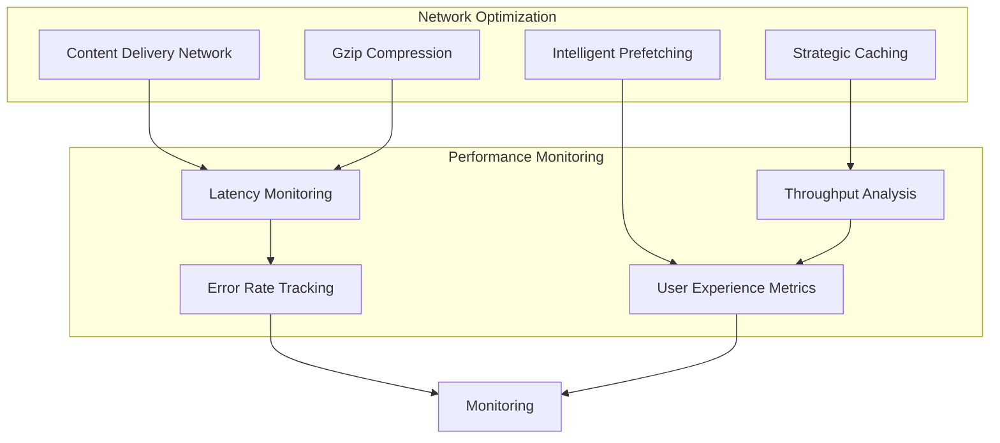

**Diagram sources**
- [app/sakip/page.tsx:28-97](file://app/sakip/page.tsx#L28-L97)

### Performance Metrics and Monitoring

The system implements comprehensive performance monitoring:

#### Key Performance Indicators
- **Page Load Time**: Time from initial request to fully rendered page
- **API Response Time**: Time for backend API calls to complete
- **Database Query Performance**: Execution time for database operations
- **Memory Usage**: System memory consumption patterns
- **CPU Utilization**: Processor usage across system components

#### Monitoring Tools and Techniques
- **Application Performance Monitoring (APM)**: Real-time application performance tracking
- **Error Tracking**: Comprehensive error logging and analysis
- **User Behavior Analytics**: Insights into user interaction patterns
- **System Health Checks**: Automated health monitoring and alerts

**Section sources**
- [app/sakip/page.tsx:28-97](file://app/sakip/page.tsx#L28-L97)

## Troubleshooting Guide

This section provides comprehensive troubleshooting guidance for common issues encountered in the SAKIP system, along with diagnostic procedures and resolution strategies.

### Common Issues and Solutions

#### Data Loading Problems

**Issue**: SAKIP documents fail to load or display empty results
**Symptoms**: Blank table, loading spinner indefinitely, error notifications
**Diagnostic Steps**:
1. Verify API connectivity and endpoint accessibility
2. Check browser developer tools for network errors
3. Validate API key authentication
4. Confirm database connectivity

**Resolution Strategies**:
- Restart API service if connectivity issues detected
- Clear browser cache and cookies
- Verify network firewall settings
- Check API rate limiting and quota limits

#### Form Submission Failures

**Issue**: SAKIP form submissions fail with validation errors
**Symptoms**: Form validation errors, submission timeouts, API error responses
**Diagnostic Steps**:
1. Check browser console for JavaScript errors
2. Verify form field validation rules
3. Test individual field submissions
4. Review server-side validation logs

**Resolution Strategies**:
- Correct invalid field formats and data types
- Remove excessive whitespace and special characters
- Verify required fields are properly filled
- Check file upload restrictions and formats

#### File Upload Issues

**Issue**: Document file uploads fail or are rejected
**Symptoms**: Upload errors, file type warnings, size limit exceeded
**Diagnostic Steps**:
1. Verify file format compatibility
2. Check file size limitations
3. Test upload with different browsers
4. Review server-side upload configurations

**Resolution Strategies**:
- Convert files to supported formats (PDF, DOC, DOCX, JPG, PNG)
- Compress files to meet size requirements (<20MB)
- Try uploading with different browsers or devices
- Contact system administrator for configuration issues

### Advanced Troubleshooting Procedures

#### API Integration Issues

**Issue**: SAKIP API integration problems with external systems
**Diagnostic Approach**:
1. Enable detailed API logging
2. Test API endpoints independently
3. Verify authentication credentials
4. Check CORS configuration
5. Validate data format compatibility

**Resolution Procedures**:
- Update API credentials and keys
- Configure proper CORS headers
- Align data formats with API specifications
- Implement proper error handling and retry logic

#### Performance Degradation

**Issue**: SAKIP system performance significantly degraded
**Diagnostic Methods**:
1. Monitor system resource utilization
2. Analyze database query performance
3. Check network latency and bandwidth
4. Review application logs for bottlenecks

**Optimization Strategies**:
- Implement database indexing improvements
- Optimize API response times
- Add caching mechanisms
- Scale system resources as needed

### Preventive Maintenance Guidelines

#### Regular System Maintenance
- **Database Optimization**: Regular maintenance tasks and index rebuilding
- **Security Updates**: Timely application of security patches and updates
- **Performance Monitoring**: Continuous monitoring of system performance metrics
- **Backup Verification**: Regular testing of backup and restore procedures

#### User Training and Support
- **Training Programs**: Regular training sessions for system users
- **Documentation Updates**: Keeping user guides and documentation current
- **Support Channels**: Establishing clear support channels for user assistance
- **Feedback Collection**: Regular collection and analysis of user feedback

**Section sources**
- [app/sakip/page.tsx:46-65](file://app/sakip/page.tsx#L46-L65)
- [app/sakip/tambah/page.tsx:37-64](file://app/sakip/tambah/page.tsx#L37-L64)

## Conclusion

The SAKIP (Strategic Planning) module represents a comprehensive and robust solution for institutional strategic planning and performance management within Indonesian government organizations. The system successfully integrates advanced technical architecture with practical governance requirements, providing a solid foundation for strategic alignment, target establishment, and performance monitoring.

### Key Strengths

The SAKIP system demonstrates several key strengths that contribute to its effectiveness:

**Comprehensive Coverage**: The system addresses all aspects of strategic planning from goal establishment through performance monitoring, providing a complete lifecycle management solution.

**Regulatory Compliance**: Built-in compliance mechanisms ensure adherence to Indonesian government regulations governing performance management and transparency requirements.

**Scalable Architecture**: Modern Next.js architecture with proper separation of concerns enables easy scaling and maintenance as organizational needs evolve.

**User-Centric Design**: Intuitive interfaces and comprehensive validation systems enhance user experience while maintaining data quality and consistency.

**Integration Capabilities**: Seamless integration with existing organizational systems maximizes value and minimizes disruption to current workflows.

### Strategic Value Proposition

The SAKIP module provides significant strategic value to government institutions:

**Enhanced Transparency**: Comprehensive audit trails and reporting capabilities support transparency and accountability requirements.

**Improved Performance**: Structured performance tracking and monitoring systems enable continuous improvement and strategic course correction.

**Regulatory Alignment**: Built-in compliance mechanisms reduce risk and ensure adherence to evolving regulatory requirements.

**Operational Efficiency**: Streamlined workflows and automated processes improve operational efficiency and reduce administrative burden.

### Future Enhancement Opportunities

While the current implementation provides substantial functionality, several enhancement opportunities exist:

**Advanced Analytics**: Integration of predictive analytics and machine learning capabilities for enhanced performance forecasting and trend analysis.

**Mobile Optimization**: Enhanced mobile responsiveness and offline capabilities for improved accessibility and usability.

**Integration Expansion**: Broader integration with additional government systems and third-party applications.

**Automation Enhancement**: Increased automation of routine tasks and workflows to further improve efficiency.

The SAKIP system stands as a testament to effective technology implementation in public sector governance, providing a solid foundation for institutional excellence and continuous improvement in strategic planning and performance management.