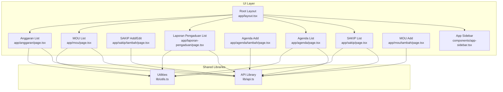
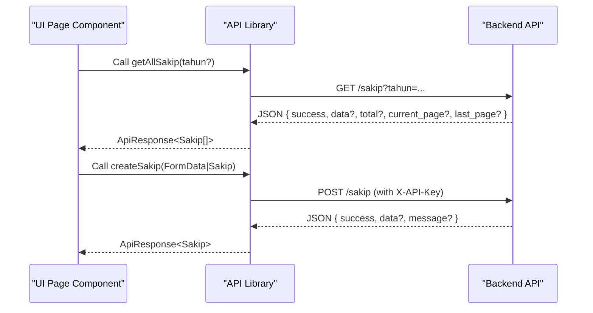
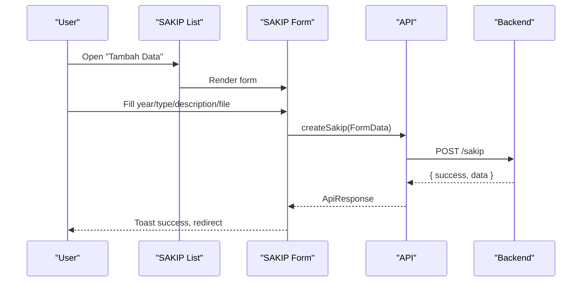
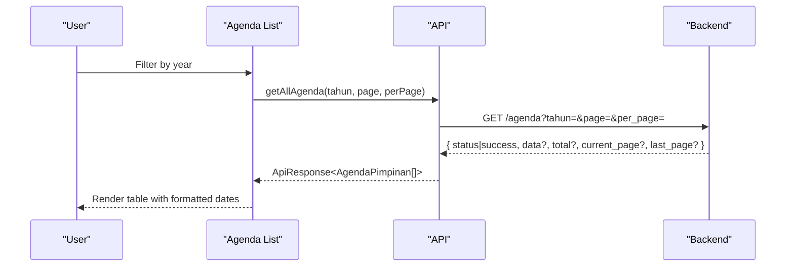
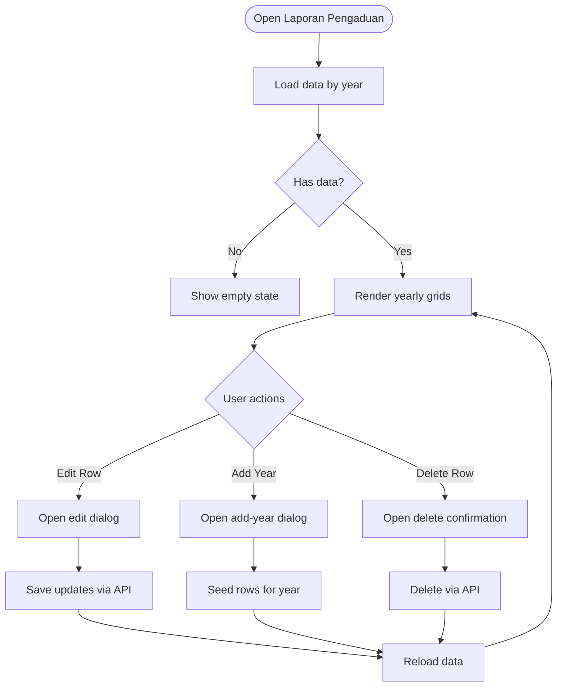
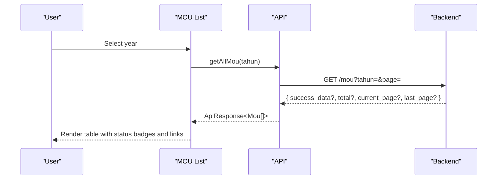
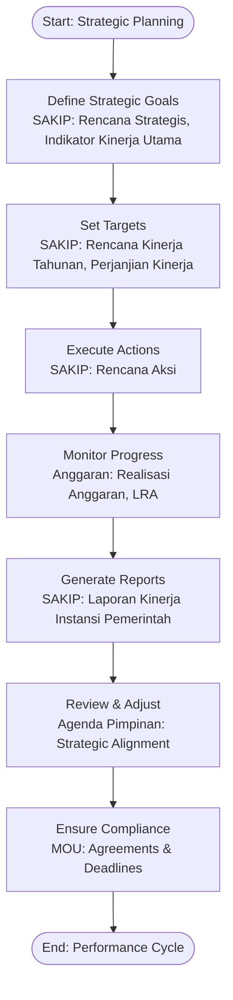
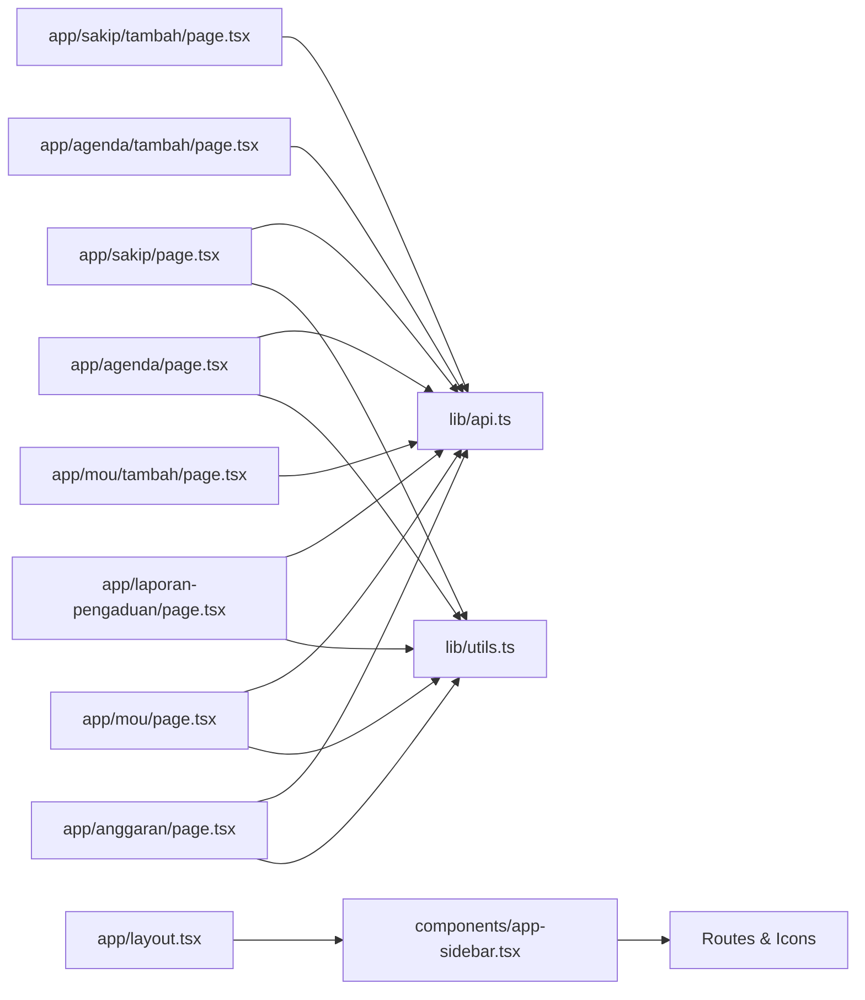
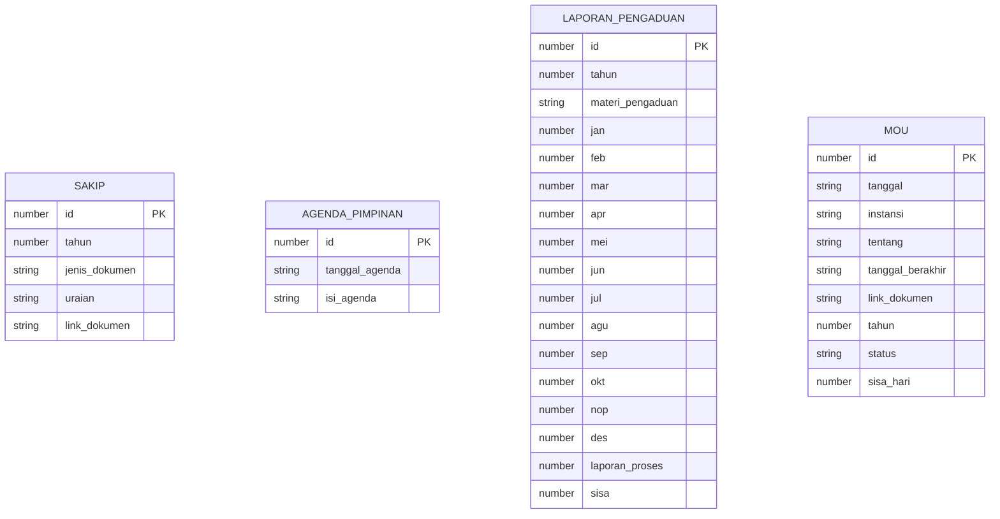

# Strategic and Administrative

<cite>
**Referenced Files in This Document**
- [app/sakip/page.tsx](file://app/sakip/page.tsx)
- [app/sakip/tambah/page.tsx](file://app/sakip/tambah/page.tsx)
- [app/agenda/page.tsx](file://app/agenda/page.tsx)
- [app/agenda/tambah/page.tsx](file://app/agenda/tambah/page.tsx)
- [app/laporan-pengaduan/page.tsx](file://app/laporan-pengaduan/page.tsx)
- [app/mou/page.tsx](file://app/mou/page.tsx)
- [app/mou/tambah/page.tsx](file://app/mou/tambah/page.tsx)
- [lib/api.ts](file://lib/api.ts)
- [lib/utils.ts](file://lib/utils.ts)
- [components/app-sidebar.tsx](file://components/app-sidebar.tsx)
- [app/layout.tsx](file://app/layout.tsx)
- [app/anggaran/page.tsx](file://app/anggaran/page.tsx)
- [app/data/pegawai.json](file://app/data/pegawai.json)
</cite>

## Table of Contents
1. [Introduction](#introduction)
2. [Project Structure](#project-structure)
3. [Core Components](#core-components)
4. [Architecture Overview](#architecture-overview)
5. [Detailed Component Analysis](#detailed-component-analysis)
6. [Dependency Analysis](#dependency-analysis)
7. [Performance Considerations](#performance-considerations)
8. [Troubleshooting Guide](#troubleshooting-guide)
9. [Conclusion](#conclusion)
10. [Appendices](#appendices)

## Introduction
This document describes the strategic and administrative module of the admin panel, focusing on four primary administrative modules:
- SAKIP (Strategic Planning): Organizational planning and performance documentation.
- Agenda Pimpinan (Leadership Agenda): Leadership scheduling and public visibility.
- Laporan Pengaduan (Complaint Reports): Monthly tracking and reconciliation of citizen complaints.
- MOU (Memorandum of Understanding): Contracts and agreements management.

It explains the strategic planning workflow from goal setting to performance tracking, documents common administrative patterns for data entry, approvals, and coordination, and outlines user interface patterns for dashboards, coordination, and compliance tracking. It also provides examples of strategic calculation algorithms, workflow implementations, and performance monitoring systems.

## Project Structure
The application is a Next.js frontend integrating with a backend API via a shared API library. Administrative modules are organized under dedicated pages with consistent UI patterns using shared components and utilities.

**Diagram sources**
- [app/layout.tsx:12-36](file://app/layout.tsx#L12-L36)
- [components/app-sidebar.tsx:137-231](file://components/app-sidebar.tsx#L137-L231)
- [app/sakip/page.tsx:30-350](file://app/sakip/page.tsx#L30-L350)
- [app/sakip/tambah/page.tsx:151-175](file://app/sakip/tambah/page.tsx#L151-L175)
- [app/agenda/page.tsx:47-284](file://app/agenda/page.tsx#L47-L284)
- [app/agenda/tambah/page.tsx:16-118](file://app/agenda/tambah/page.tsx#L16-L118)
- [app/laporan-pengaduan/page.tsx:32-355](file://app/laporan-pengaduan/page.tsx#L32-L355)
- [app/mou/page.tsx:41-219](file://app/mou/page.tsx#L41-L219)
- [app/mou/tambah/page.tsx:14-170](file://app/mou/tambah/page.tsx#L14-L170)
- [app/anggaran/page.tsx:31-335](file://app/anggaran/page.tsx#L31-L335)
- [lib/api.ts:1-1144](file://lib/api.ts#L1-L1144)
- [lib/utils.ts:8-26](file://lib/utils.ts#L8-L26)

**Section sources**
- [app/layout.tsx:12-36](file://app/layout.tsx#L12-L36)
- [components/app-sidebar.tsx:44-135](file://components/app-sidebar.tsx#L44-L135)
- [lib/api.ts:655-757](file://lib/api.ts#L655-L757)
- [lib/api.ts:288-335](file://lib/api.ts#L288-L335)
- [lib/api.ts:758-850](file://lib/api.ts#L758-L850)
- [lib/api.ts:1011-1073](file://lib/api.ts#L1011-L1073)

## Core Components
This section summarizes the four administrative modules and their roles in strategic and administrative workflows.

- SAKIP (Strategic Planning)
  - Purpose: Manage strategic documents aligned with institutional accountability.
  - Key features: Year filtering, document type selection, search, pagination, CRUD actions, and document preview.
  - Data model: Includes year, document type, description, and optional document link.

- Agenda Pimpinan (Leadership Agenda)
  - Purpose: Publish leadership schedules publicly.
  - Key features: Year filtering, pagination, CRUD actions, and formatted date display.
  - Data model: Includes agenda date and content.

- Laporan Pengaduan (Complaint Reports)
  - Purpose: Track monthly complaint volumes and reconcile with outstanding cases.
  - Key features: Year filtering, bulk creation per year, inline editing, and computed summary fields.
  - Data model: Includes year, subject matter, monthly counts, processed count, and remaining balance.

- MOU (Memorandum of Understanding)
  - Purpose: Maintain records of agreements with statuses and deadlines.
  - Key features: Year filtering, status badges, document links, CRUD actions.
  - Data model: Includes institution, subject, dates, optional document link, and status with days remaining.

Common administrative patterns across modules:
- Filtering by year and other attributes.
- Pagination with configurable page sizes.
- CRUD operations with confirmation dialogs.
- Toast notifications for feedback.
- File upload support for documents where applicable.

**Section sources**
- [lib/api.ts:655-757](file://lib/api.ts#L655-L757)
- [lib/api.ts:288-335](file://lib/api.ts#L288-L335)
- [lib/api.ts:758-850](file://lib/api.ts#L758-L850)
- [lib/api.ts:1011-1073](file://lib/api.ts#L1011-L1073)
- [app/sakip/page.tsx:30-350](file://app/sakip/page.tsx#L30-L350)
- [app/agenda/page.tsx:47-284](file://app/agenda/page.tsx#L47-L284)
- [app/laporan-pengaduan/page.tsx:32-355](file://app/laporan-pengaduan/page.tsx#L32-L355)
- [app/mou/page.tsx:41-219](file://app/mou/page.tsx#L41-L219)

## Architecture Overview
The UI components call the API library to fetch and mutate data. The API library encapsulates HTTP requests, normalizes responses, and exposes typed functions for each domain.

**Diagram sources**
- [lib/api.ts:680-756](file://lib/api.ts#L680-L756)
- [app/sakip/page.tsx:46-65](file://app/sakip/page.tsx#L46-L65)
- [app/sakip/tambah/page.tsx:37-64](file://app/sakip/tambah/page.tsx#L37-L64)

**Section sources**
- [lib/api.ts:43-80](file://lib/api.ts#L43-L80)
- [lib/api.ts:82-91](file://lib/api.ts#L82-L91)

## Detailed Component Analysis

### SAKIP (Strategic Planning)
SAKIP manages strategic documents with year and type filters, search, pagination, and CRUD actions. It supports document uploads and external links.

Key UI patterns:
- Year selector, document type selector, and search input.
- Pagination with ellipsis navigation.
- Action buttons for edit and delete with confirmation.
- Document link rendering with external viewer.

Data entry pattern:
- Form collects year, document type, description, and optional file.
- Submission uses FormData for file uploads.

**Diagram sources**
- [app/sakip/tambah/page.tsx:37-64](file://app/sakip/tambah/page.tsx#L37-L64)
- [lib/api.ts:694-719](file://lib/api.ts#L694-L719)

**Section sources**
- [app/sakip/page.tsx:30-350](file://app/sakip/page.tsx#L30-L350)
- [app/sakip/tambah/page.tsx:18-149](file://app/sakip/tambah/page.tsx#L18-L149)
- [lib/api.ts:658-666](file://lib/api.ts#L658-L666)
- [lib/api.ts:670-678](file://lib/api.ts#L670-L678)

### Agenda Pimpinan (Leadership Agenda)
Agenda Pimpinan publishes leadership schedules. It supports year filtering, pagination, and CRUD actions with formatted date display.

Key UI patterns:
- Year selector and refresh action.
- Truncated agenda content with tooltip on hover.
- Pagination with previous/next and numbered links.

**Diagram sources**
- [app/agenda/page.tsx:62-87](file://app/agenda/page.tsx#L62-L87)
- [lib/api.ts:292-302](file://lib/api.ts#L292-L302)

**Section sources**
- [app/agenda/page.tsx:47-284](file://app/agenda/page.tsx#L47-L284)
- [app/agenda/tambah/page.tsx:16-118](file://app/agenda/tambah/page.tsx#L16-L118)
- [lib/api.ts:35-41](file://lib/api.ts#L35-L41)

### Laporan Pengaduan (Complaint Reports)
Laporan Pengaduan tracks monthly complaint counts and reconciles with processed and remaining balances. It supports adding a full year’s worth of rows and inline editing.

Key UI patterns:
- Year selector and “Refresh” action.
- Grid per year with monthly columns and computed summary fields.
- Inline edit dialog with numeric inputs for monthly values and summary fields.
- “Add Year” dialog to seed data for a given year.

**Diagram sources**
- [app/laporan-pengaduan/page.tsx:43-100](file://app/laporan-pengaduan/page.tsx#L43-L100)
- [app/laporan-pengaduan/page.tsx:119-119](file://app/laporan-pengaduan/page.tsx#L119-L119)
- [app/laporan-pengaduan/page.tsx:122-124](file://app/laporan-pengaduan/page.tsx#L122-L124)
- [app/laporan-pengaduan/page.tsx:102-117](file://app/laporan-pengaduan/page.tsx#L102-L117)
- [lib/api.ts:788-850](file://lib/api.ts#L788-L850)

**Section sources**
- [app/laporan-pengaduan/page.tsx:32-355](file://app/laporan-pengaduan/page.tsx#L32-L355)
- [lib/api.ts:762-770](file://lib/api.ts#L762-L770)
- [lib/api.ts:778-786](file://lib/api.ts#L778-L786)

### MOU (Memorandum of Understanding)
MOU manages agreements with status badges indicating active/expired and optional document links.

Key UI patterns:
- Year selector and refresh action.
- Status badges with dynamic suffix for days remaining.
- Document link rendering with external viewer.

**Diagram sources**
- [app/mou/page.tsx:50-63](file://app/mou/page.tsx#L50-L63)
- [lib/api.ts:1028-1035](file://lib/api.ts#L1028-L1035)

**Section sources**
- [app/mou/page.tsx:41-219](file://app/mou/page.tsx#L41-L219)
- [app/mou/tambah/page.tsx:14-170](file://app/mou/tambah/page.tsx#L14-L170)
- [lib/api.ts:1014-1026](file://lib/api.ts#L1014-L1026)

### Strategic Planning Workflow: Goal Setting to Performance Tracking
This workflow aligns with SAKIP and related financial modules to establish targets, monitor progress, and report outcomes.

[No sources needed since this diagram shows conceptual workflow, not actual code structure]

## Dependency Analysis
The UI pages depend on the API library for data access and on shared utilities for year options and formatting. The sidebar integrates with routing to highlight active modules.

**Diagram sources**
- [lib/api.ts:1-1144](file://lib/api.ts#L1-L1144)
- [lib/utils.ts:8-26](file://lib/utils.ts#L8-L26)
- [components/app-sidebar.tsx:44-135](file://components/app-sidebar.tsx#L44-L135)
- [app/layout.tsx:12-36](file://app/layout.tsx#L12-L36)

**Section sources**
- [lib/api.ts:655-757](file://lib/api.ts#L655-L757)
- [lib/api.ts:288-335](file://lib/api.ts#L288-L335)
- [lib/api.ts:758-850](file://lib/api.ts#L758-L850)
- [lib/api.ts:1011-1073](file://lib/api.ts#L1011-L1073)
- [lib/utils.ts:8-26](file://lib/utils.ts#L8-L26)
- [components/app-sidebar.tsx:44-135](file://components/app-sidebar.tsx#L44-L135)

## Performance Considerations
- Pagination: All list views implement pagination to limit payload sizes and improve responsiveness.
- Debounced search: SAKIP applies a debounced filter to reduce unnecessary reloads.
- Year options: Centralized year generation avoids repeated computations.
- File uploads: SAKIP and MOU use FormData to avoid large JSON payloads for binary content.
- Normalized responses: The API library normalizes diverse backend response formats for consistent handling.

[No sources needed since this section provides general guidance]

## Troubleshooting Guide
Common issues and resolutions:
- API connectivity failures: UI displays toast notifications and falls back to empty lists. Verify environment variables for API URL and key.
- File upload errors: Ensure file types and sizes match supported formats and limits.
- Pagination anomalies: Reset filters or refresh to recalculate page boundaries.
- Missing data: Use “Add Year” for Laporan Pengaduan to seed initial rows.

**Section sources**
- [app/sakip/page.tsx:46-65](file://app/sakip/page.tsx#L46-L65)
- [app/agenda/page.tsx:62-87](file://app/agenda/page.tsx#L62-L87)
- [app/laporan-pengaduan/page.tsx:78-100](file://app/laporan-pengaduan/page.tsx#L78-L100)
- [app/mou/page.tsx:50-63](file://app/mou/page.tsx#L50-L63)
- [lib/api.ts:53-80](file://lib/api.ts#L53-L80)

## Conclusion
The strategic and administrative module provides a cohesive set of tools for organizational planning, leadership coordination, and administrative documentation. By standardizing CRUD patterns, filtering, and pagination, the system supports efficient data management and compliance tracking. Integrations with SAKIP, Agenda Pimpinan, Laporan Pengaduan, and MOU enable a complete lifecycle from goal setting to performance reporting and agreement oversight.

[No sources needed since this section summarizes without analyzing specific files]

## Appendices

### UI Patterns and Components
- Shared UI components: Cards, tables, forms, selects, dialogs, and pagination are reused across modules.
- Toast notifications: Consistent feedback for success/error states.
- Sidebar navigation: Active route highlighting and grouped categories.

**Section sources**
- [components/app-sidebar.tsx:137-231](file://components/app-sidebar.tsx#L137-L231)
- [app/layout.tsx:12-36](file://app/layout.tsx#L12-L36)

### Data Models Overview

**Diagram sources**
- [lib/api.ts:670-678](file://lib/api.ts#L670-L678)
- [lib/api.ts:35-41](file://lib/api.ts#L35-L41)
- [lib/api.ts:778-786](file://lib/api.ts#L778-L786)
- [lib/api.ts:1014-1026](file://lib/api.ts#L1014-L1026)

### Examples: Strategic Calculation Algorithms and Performance Monitoring
- Complaint reconciliation algorithm (Laporan Pengaduan):
  - Monthly totals derived from individual month fields.
  - Processed vs. remaining balance tracked separately.
  - Yearly seeding ensures consistent baseline for reporting.

- Performance monitoring (Anggaran):
  - Percentage calculation for budget execution.
  - Currency formatting for transparency.

- Status computation (MOU):
  - Status determined by validity and days remaining.

**Section sources**
- [app/laporan-pengaduan/page.tsx:192-241](file://app/laporan-pengaduan/page.tsx#L192-L241)
- [app/anggaran/page.tsx:97-103](file://app/anggaran/page.tsx#L97-L103)
- [app/mou/page.tsx:26-39](file://app/mou/page.tsx#L26-L39)

### Integration with Organizational Systems
- Strategic alignment: Agenda Pimpinan reflects strategic priorities and public commitments.
- Financial integration: Anggaran complements SAKIP by tracking budget execution against strategic targets.
- Compliance tracking: MOU ensures adherence to agreements and deadlines.

**Section sources**
- [app/agenda/page.tsx:136-148](file://app/agenda/page.tsx#L136-L148)
- [app/anggaran/page.tsx:140-161](file://app/anggaran/page.tsx#L140-L161)
- [app/mou/page.tsx:84-99](file://app/mou/page.tsx#L84-L99)