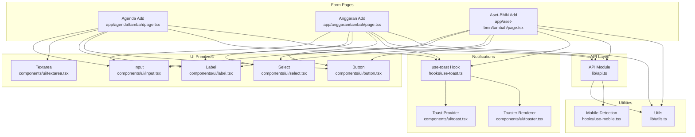
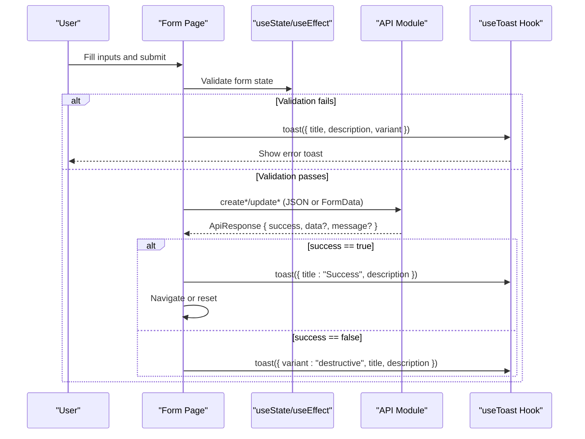
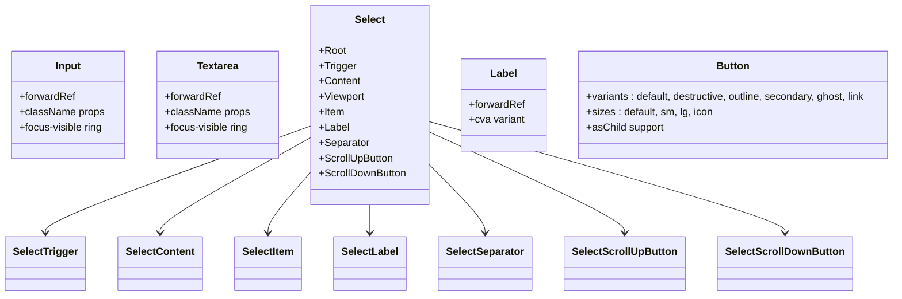
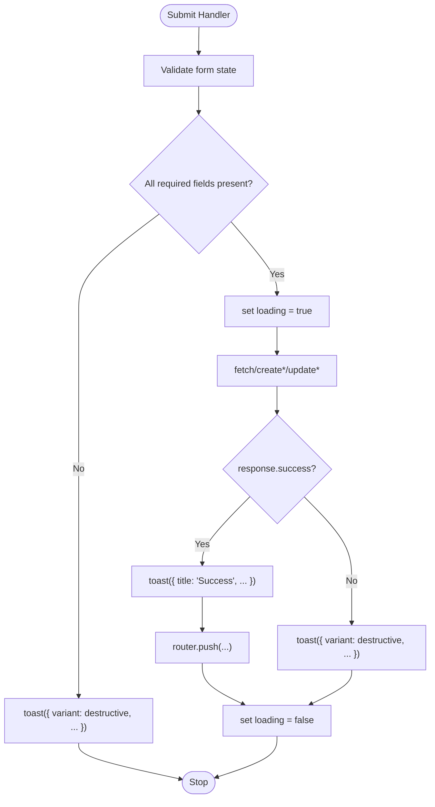
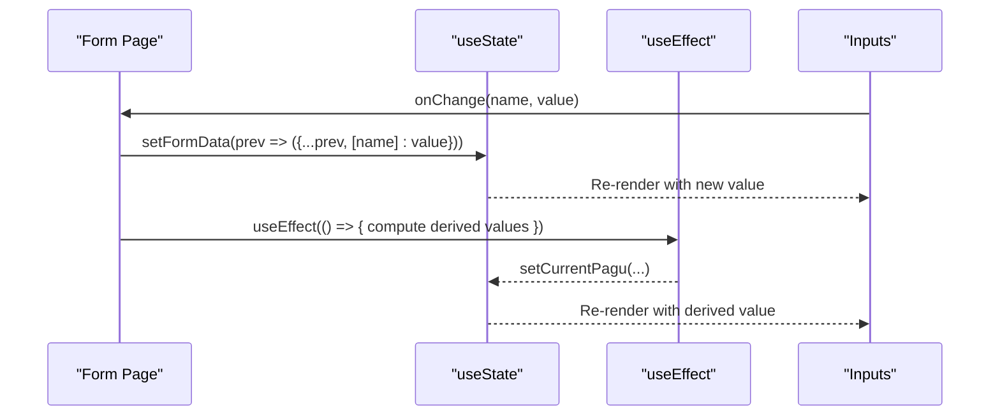
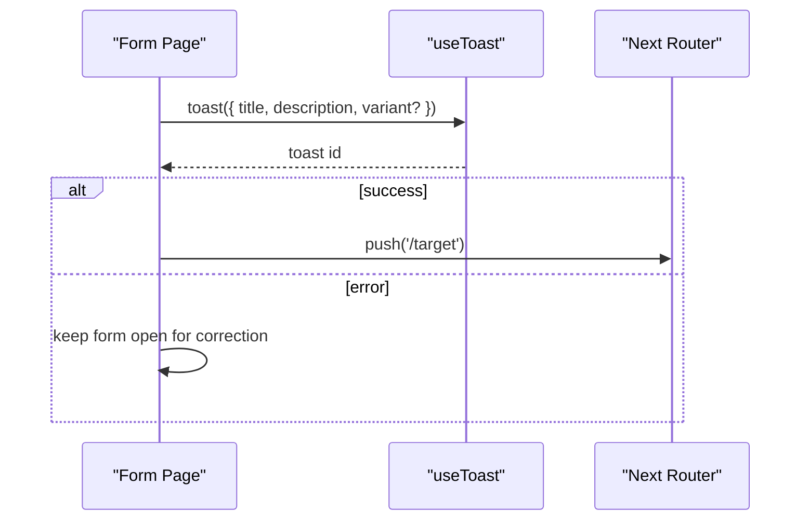
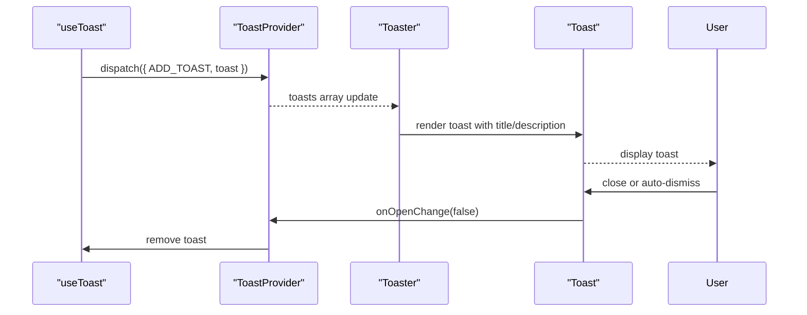
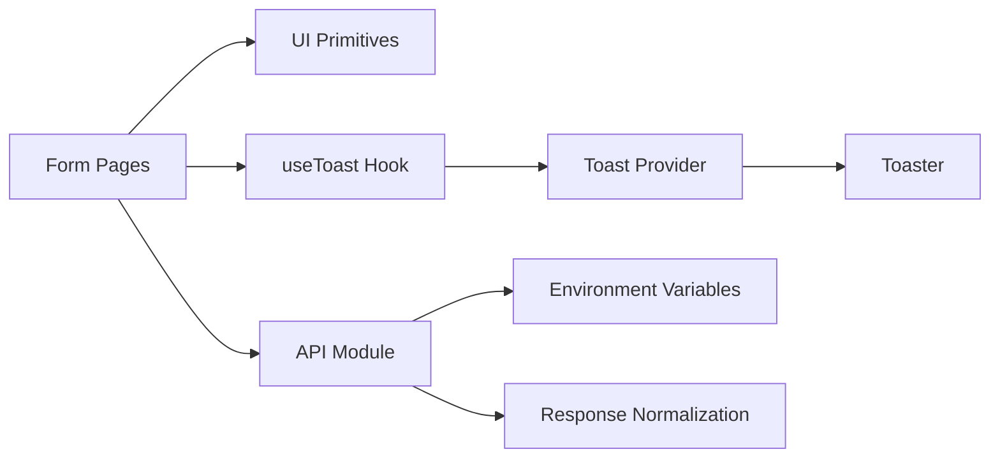

# Forms and Validation

<cite>
**Referenced Files in This Document**
- [input.tsx](file://components/ui/input.tsx)
- [select.tsx](file://components/ui/select.tsx)
- [textarea.tsx](file://components/ui/textarea.tsx)
- [label.tsx](file://components/ui/label.tsx)
- [button.tsx](file://components/ui/button.tsx)
- [toast.tsx](file://components/ui/toast.tsx)
- [toaster.tsx](file://components/ui/toaster.tsx)
- [use-toast.ts](file://hooks/use-toast.ts)
- [utils.ts](file://lib/utils.ts)
- [api.ts](file://lib/api.ts)
- [use-mobile.tsx](file://hooks/use-mobile.tsx)
- [agenda tambah page.tsx](file://app/agenda/tambah/page.tsx)
- [anggaran tambah page.tsx](file://app/anggaran/tambah/page.tsx)
- [aset-bmn tambah page.tsx](file://app/aset-bmn/tambah/page.tsx)
</cite>

## Table of Contents
1. [Introduction](#introduction)
2. [Project Structure](#project-structure)
3. [Core Components](#core-components)
4. [Architecture Overview](#architecture-overview)
5. [Detailed Component Analysis](#detailed-component-analysis)
6. [Dependency Analysis](#dependency-analysis)
7. [Performance Considerations](#performance-considerations)
8. [Troubleshooting Guide](#troubleshooting-guide)
9. [Conclusion](#conclusion)
10. [Appendices](#appendices)

## Introduction
This document explains the form handling and validation patterns used across the admin panel. It covers the form component architecture built on Radix UI primitives, input validation strategies, error handling patterns, form state management, validation rules, and user feedback mechanisms. It also documents integration with the toast notification system for submission feedback, loading states, success/error handling, accessibility features, keyboard navigation, and mobile optimization. Best practices for validation, data sanitization, and user experience are included.

## Project Structure
The admin panel organizes forms around reusable UI primitives and page-specific form pages:
- UI primitives: input, textarea, select, label, button
- Notification system: toast provider, toast renderer, hook
- Utilities: shared helpers for formatting and responsive checks
- API layer: centralized request builders and response normalization
- Page forms: domain-specific forms for creating records with validation and submission feedback

**Diagram sources**
- [input.tsx:1-23](file://components/ui/input.tsx#L1-L23)
- [textarea.tsx:1-23](file://components/ui/textarea.tsx#L1-L23)
- [select.tsx:1-160](file://components/ui/select.tsx#L1-L160)
- [label.tsx:1-27](file://components/ui/label.tsx#L1-L27)
- [button.tsx:1-58](file://components/ui/button.tsx#L1-L58)
- [use-toast.ts:1-195](file://hooks/use-toast.ts#L1-L195)
- [toast.tsx:1-130](file://components/ui/toast.tsx#L1-L130)
- [toaster.tsx:1-36](file://components/ui/toaster.tsx#L1-L36)
- [utils.ts:1-26](file://lib/utils.ts#L1-L26)
- [use-mobile.tsx:1-20](file://hooks/use-mobile.tsx#L1-L20)
- [api.ts:1-800](file://lib/api.ts#L1-L800)
- [agenda tambah page.tsx:1-118](file://app/agenda/tambah/page.tsx#L1-L118)
- [anggaran tambah page.tsx:1-204](file://app/anggaran/tambah/page.tsx#L1-L204)
- [aset-bmn tambah page.tsx:1-150](file://app/aset-bmn/tambah/page.tsx#L1-L150)

**Section sources**
- [input.tsx:1-23](file://components/ui/input.tsx#L1-L23)
- [textarea.tsx:1-23](file://components/ui/textarea.tsx#L1-L23)
- [select.tsx:1-160](file://components/ui/select.tsx#L1-L160)
- [label.tsx:1-27](file://components/ui/label.tsx#L1-L27)
- [button.tsx:1-58](file://components/ui/button.tsx#L1-L58)
- [use-toast.ts:1-195](file://hooks/use-toast.ts#L1-L195)
- [toast.tsx:1-130](file://components/ui/toast.tsx#L1-L130)
- [toaster.tsx:1-36](file://components/ui/toaster.tsx#L1-L36)
- [utils.ts:1-26](file://lib/utils.ts#L1-L26)
- [use-mobile.tsx:1-20](file://hooks/use-mobile.tsx#L1-L20)
- [api.ts:1-800](file://lib/api.ts#L1-L800)
- [agenda tambah page.tsx:1-118](file://app/agenda/tambah/page.tsx#L1-L118)
- [anggaran tambah page.tsx:1-204](file://app/anggaran/tambah/page.tsx#L1-L204)
- [aset-bmn tambah page.tsx:1-150](file://app/aset-bmn/tambah/page.tsx#L1-L150)

## Core Components
- Input: A thin wrapper around the native input element with consistent styling and focus/ring behavior.
- Textarea: A thin wrapper around the native textarea element with consistent styling and focus/ring behavior.
- Select: A composite component built on Radix UI primitives, providing trigger, content, viewport, and item rendering with scroll controls.
- Label: A styled label primitive aligned with form inputs for accessibility and consistent typography.
- Button: A versatile button with variants and sizes, supporting slot semantics for composition.
- Toast System: A lightweight, unobtrusive notification system with imperative API and provider/renderer.
- Utilities: Shared helpers for class merging, year options generation, and Indonesian Rupiah formatting.
- API Layer: Centralized request builders, header management, and response normalization across domains.

Validation patterns observed:
- Client-side guard clauses in forms (e.g., required field checks) with immediate toast feedback.
- Submission via fetch with FormData for file uploads and JSON for structured data.
- API responses normalized to a consistent shape; server-side validation errors surfaced to the client.

**Section sources**
- [input.tsx:1-23](file://components/ui/input.tsx#L1-L23)
- [textarea.tsx:1-23](file://components/ui/textarea.tsx#L1-L23)
- [select.tsx:1-160](file://components/ui/select.tsx#L1-L160)
- [label.tsx:1-27](file://components/ui/label.tsx#L1-L27)
- [button.tsx:1-58](file://components/ui/button.tsx#L1-L58)
- [use-toast.ts:1-195](file://hooks/use-toast.ts#L1-L195)
- [toast.tsx:1-130](file://components/ui/toast.tsx#L1-L130)
- [toaster.tsx:1-36](file://components/ui/toaster.tsx#L1-L36)
- [utils.ts:1-26](file://lib/utils.ts#L1-L26)
- [api.ts:1-800](file://lib/api.ts#L1-L800)

## Architecture Overview
The form architecture follows a layered pattern:
- Presentation: Form pages manage state, collect user input, and orchestrate submission.
- Validation: Client-side checks and server-side validation via API responses.
- Persistence: API module encapsulates requests, headers, and response normalization.
- Feedback: Toast notifications provide immediate, non-blocking feedback.

**Diagram sources**
- [agenda tambah page.tsx:31-52](file://app/agenda/tambah/page.tsx#L31-L52)
- [anggaran tambah page.tsx:71-106](file://app/anggaran/tambah/page.tsx#L71-L106)
- [aset-bmn tambah page.tsx:30-57](file://app/aset-bmn/tambah/page.tsx#L30-L57)
- [api.ts:53-80](file://lib/api.ts#L53-L80)
- [use-toast.ts:145-172](file://hooks/use-toast.ts#L145-L172)

## Detailed Component Analysis

### Form Component Architecture
The forms rely on:
- Primitive inputs (Input, Textarea) for text-based fields.
- Select for categorical choices with grouped options and dynamic population.
- Label for accessible association with inputs.
- Button for actions with loading states and icons.
- Card for layout and content grouping.

**Diagram sources**
- [input.tsx:1-23](file://components/ui/input.tsx#L1-L23)
- [textarea.tsx:1-23](file://components/ui/textarea.tsx#L1-L23)
- [select.tsx:1-160](file://components/ui/select.tsx#L1-L160)
- [label.tsx:1-27](file://components/ui/label.tsx#L1-L27)
- [button.tsx:1-58](file://components/ui/button.tsx#L1-L58)

**Section sources**
- [input.tsx:1-23](file://components/ui/input.tsx#L1-L23)
- [textarea.tsx:1-23](file://components/ui/textarea.tsx#L1-L23)
- [select.tsx:1-160](file://components/ui/select.tsx#L1-L160)
- [label.tsx:1-27](file://components/ui/label.tsx#L1-L27)
- [button.tsx:1-58](file://components/ui/button.tsx#L1-L58)

### Validation Strategies and Error Handling Patterns
Common patterns across forms:
- Required field checks before submission; immediate toast feedback if missing.
- Submission toggles a loading state to prevent duplicate submissions.
- API responses normalized; success flag determines toast outcome.
- For forms with file uploads, FormData is constructed and sent via fetch.

**Diagram sources**
- [agenda tambah page.tsx:31-52](file://app/agenda/tambah/page.tsx#L31-L52)
- [anggaran tambah page.tsx:71-106](file://app/anggaran/tambah/page.tsx#L71-L106)
- [aset-bmn tambah page.tsx:30-57](file://app/aset-bmn/tambah/page.tsx#L30-L57)
- [api.ts:53-80](file://lib/api.ts#L53-L80)

**Section sources**
- [agenda tambah page.tsx:31-52](file://app/agenda/tambah/page.tsx#L31-L52)
- [anggaran tambah page.tsx:71-106](file://app/anggaran/tambah/page.tsx#L71-L106)
- [aset-bmn tambah page.tsx:30-57](file://app/aset-bmn/tambah/page.tsx#L30-L57)
- [api.ts:53-80](file://lib/api.ts#L53-L80)

### Form State Management
- Forms use React’s useState to maintain local state for each field.
- Change handlers update state based on event target name/value.
- Some forms derive dependent values (e.g., pagu amount) from selections.

**Diagram sources**
- [anggaran tambah page.tsx:46-69](file://app/anggaran/tambah/page.tsx#L46-L69)

**Section sources**
- [anggaran tambah page.tsx:46-69](file://app/anggaran/tambah/page.tsx#L46-L69)

### User Feedback Mechanisms
- Immediate validation feedback via toasts for missing required fields.
- Loading indicators on buttons during submission.
- Success and error toasts with descriptive messages.
- Optional delayed redirects after successful saves.

**Diagram sources**
- [agenda tambah page.tsx:41-46](file://app/agenda/tambah/page.tsx#L41-L46)
- [anggaran tambah page.tsx:96-101](file://app/anggaran/tambah/page.tsx#L96-L101)
- [aset-bmn tambah page.tsx:47-52](file://app/aset-bmn/tambah/page.tsx#L47-L52)

**Section sources**
- [agenda tambah page.tsx:41-46](file://app/agenda/tambah/page.tsx#L41-L46)
- [anggaran tambah page.tsx:96-101](file://app/anggaran/tambah/page.tsx#L96-L101)
- [aset-bmn tambah page.tsx:47-52](file://app/aset-bmn/tambah/page.tsx#L47-L52)

### Accessibility and Keyboard Navigation
- Labels are associated with inputs via htmlFor/id to improve screen reader support.
- Inputs expose native focus styles (focus-visible outline and ring) for keyboard navigation.
- Select leverages Radix UI primitives for robust keyboard navigation and ARIA attributes.
- Buttons support slot semantics for flexible composition.

Recommendations:
- Ensure all interactive elements are reachable via keyboard.
- Provide visible focus indicators and clear error labeling.
- Use aria-describedby or aria-invalid for dynamic error messaging.

**Section sources**
- [label.tsx:1-27](file://components/ui/label.tsx#L1-L27)
- [input.tsx:1-23](file://components/ui/input.tsx#L1-L23)
- [select.tsx:1-160](file://components/ui/select.tsx#L1-L160)
- [button.tsx:1-58](file://components/ui/button.tsx#L1-L58)

### Mobile Optimization
- Responsive grid layouts adapt to smaller screens.
- Buttons and inputs maintain touch-friendly sizes.
- Mobile detection hook available for conditional rendering.

Observed patterns:
- Grid layouts stack on small screens.
- Icons accompany buttons to reduce text length on narrow devices.
- File inputs and selects remain usable on mobile browsers.

**Section sources**
- [use-mobile.tsx:1-20](file://hooks/use-mobile.tsx#L1-L20)
- [anggaran tambah page.tsx:114-202](file://app/anggaran/tambah/page.tsx#L114-L202)
- [aset-bmn tambah page.tsx:59-149](file://app/aset-bmn/tambah/page.tsx#L59-L149)

### Examples of Different Input Types and Layouts
- Text inputs: date, number, text.
- Select inputs: static options, dynamic options based on selection.
- Textarea: multi-line input with placeholder guidance.
- File inputs: PDF/image uploads with optional manual link fallback.

Layout patterns:
- Single-column forms with spacing and cards.
- Two-column grids for paired fields (year/month, dipa/category).
- Conditional blocks for derived values (e.g., pagu display).

**Section sources**
- [agenda tambah page.tsx:74-96](file://app/agenda/tambah/page.tsx#L74-L96)
- [anggaran tambah page.tsx:131-188](file://app/anggaran/tambah/page.tsx#L131-L188)
- [aset-bmn tambah page.tsx:81-131](file://app/aset-bmn/tambah/page.tsx#L81-L131)

### Integration with Toast Notification System
- Imperative toast API used to show success and error messages.
- Toast provider renders toasts globally with swipe/close affordances.
- Toaster component maps state to individual toast elements.

**Diagram sources**
- [use-toast.ts:136-172](file://hooks/use-toast.ts#L136-L172)
- [toast.tsx:10-56](file://components/ui/toast.tsx#L10-L56)
- [toaster.tsx:13-35](file://components/ui/toaster.tsx#L13-L35)

**Section sources**
- [use-toast.ts:1-195](file://hooks/use-toast.ts#L1-L195)
- [toast.tsx:1-130](file://components/ui/toast.tsx#L1-L130)
- [toaster.tsx:1-36](file://components/ui/toaster.tsx#L1-L36)

### Validation Rules and Data Sanitization
- Client-side checks enforce required fields and basic presence.
- API module normalizes responses and surfaces server-side validation errors.
- For file uploads, FormData is constructed from state and appended conditionally.
- Currency formatting uses locale-aware formatting for Indonesian Rupiah.

Best practices:
- Validate early and often; provide immediate feedback.
- Sanitize and coerce numeric values (e.g., numbers, percentages).
- Avoid sending undefined/null values to the backend; filter before constructing FormData.
- Use consistent error messaging and avoid exposing internal error details.

**Section sources**
- [anggaran tambah page.tsx:80-84](file://app/anggaran/tambah/page.tsx#L80-L84)
- [api.ts:53-80](file://lib/api.ts#L53-L80)
- [utils.ts:18-25](file://lib/utils.ts#L18-L25)

## Dependency Analysis
Key dependencies and relationships:
- Form pages depend on UI primitives, toast hook, and API module.
- API module depends on environment variables and response normalization.
- Toast system is decoupled from forms via a shared hook and provider.

**Diagram sources**
- [agenda tambah page.tsx:1-118](file://app/agenda/tambah/page.tsx#L1-L118)
- [anggaran tambah page.tsx:1-204](file://app/anggaran/tambah/page.tsx#L1-L204)
- [aset-bmn tambah page.tsx:1-150](file://app/aset-bmn/tambah/page.tsx#L1-L150)
- [api.ts:1-800](file://lib/api.ts#L1-L800)
- [use-toast.ts:1-195](file://hooks/use-toast.ts#L1-L195)
- [toast.tsx:1-130](file://components/ui/toast.tsx#L1-L130)
- [toaster.tsx:1-36](file://components/ui/toaster.tsx#L1-L36)

**Section sources**
- [api.ts:1-800](file://lib/api.ts#L1-L800)
- [use-toast.ts:1-195](file://hooks/use-toast.ts#L1-L195)
- [toast.tsx:1-130](file://components/ui/toast.tsx#L1-L130)
- [toaster.tsx:1-36](file://components/ui/toaster.tsx#L1-L36)

## Performance Considerations
- Minimize re-renders by updating only changed fields in state.
- Debounce expensive computations (e.g., pagu lookups) when appropriate.
- Avoid unnecessary API calls by validating locally first.
- Use controlled inputs to prevent inconsistent state.
- Keep toasts limited to avoid UI thrashing; the toast system enforces a limit.

## Troubleshooting Guide
Common issues and resolutions:
- Missing API key or URL: Ensure environment variables are configured; verify headers are attached to requests.
- FormData vs JSON mismatches: Confirm the API expects multipart/form-data for file uploads and append the proper method override when required.
- Toast not appearing: Verify the Toaster component is rendered and the provider is initialized at the root.
- Duplicate submissions: Disable the submit button while loading and guard with a simple flag.
- Server-side validation errors: Inspect the normalized response for a message or structured errors and surface them via toast.

**Section sources**
- [api.ts:82-91](file://lib/api.ts#L82-L91)
- [use-toast.ts:11-13](file://hooks/use-toast.ts#L11-L13)
- [toast.tsx:1-130](file://components/ui/toast.tsx#L1-L130)
- [toaster.tsx:1-36](file://components/ui/toaster.tsx#L1-L36)

## Conclusion
The admin panel’s forms leverage a consistent set of Radix UI-backed primitives, a unified toast notification system, and a centralized API layer to deliver reliable, accessible, and user-friendly experiences. Client-side validation and immediate feedback, combined with robust error handling and loading states, ensure smooth interactions. Following the documented patterns and best practices will help maintain consistency and scalability across future forms.

## Appendices
- Best practices checklist:
  - Always associate labels with inputs.
  - Provide clear, actionable error messages.
  - Use loading states to prevent duplicate submissions.
  - Sanitize and validate data before sending to the server.
  - Keep accessibility in mind for keyboard and screen reader users.
  - Optimize layouts for mobile-first experiences.