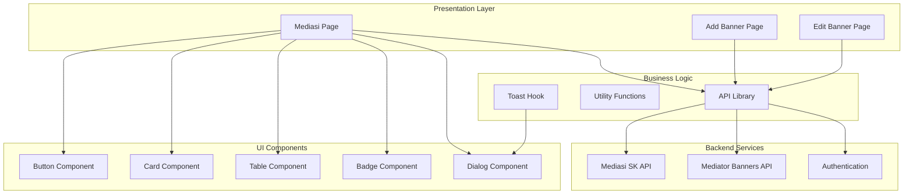
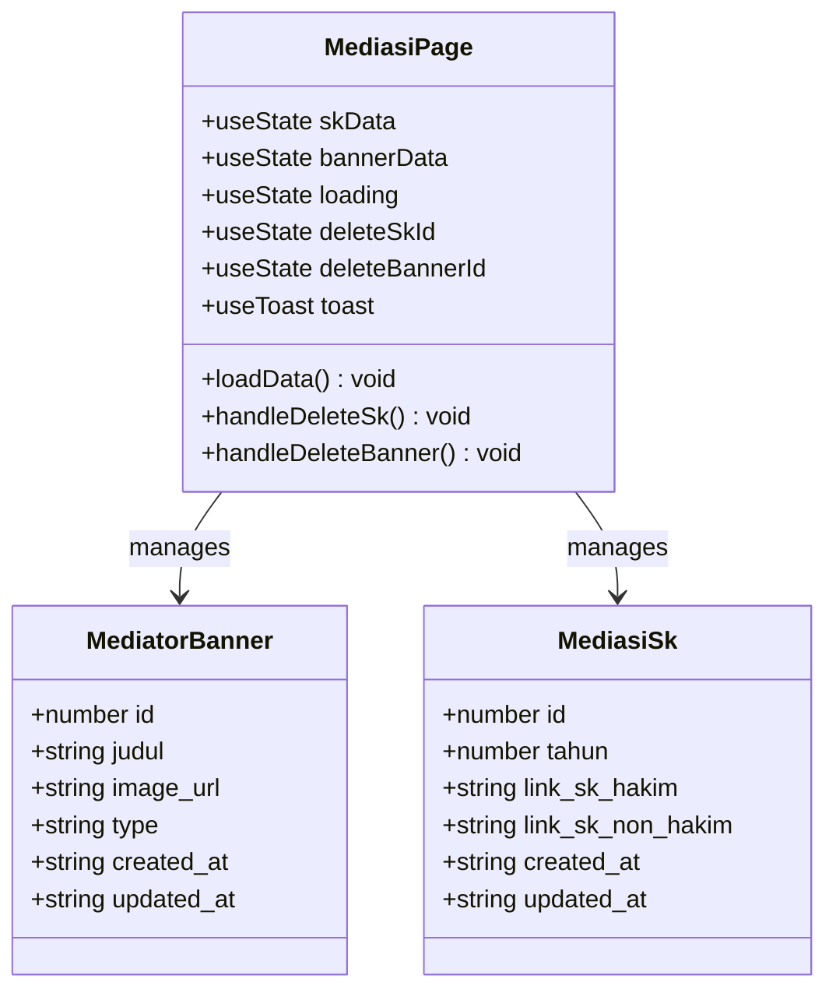
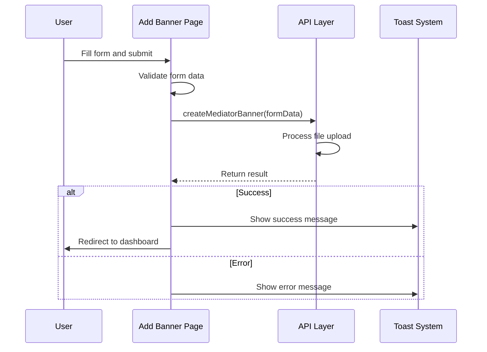
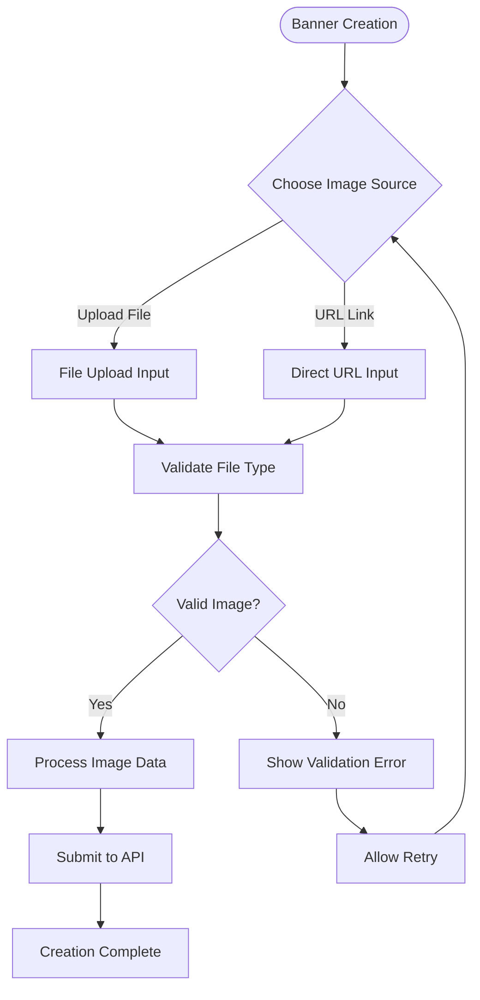
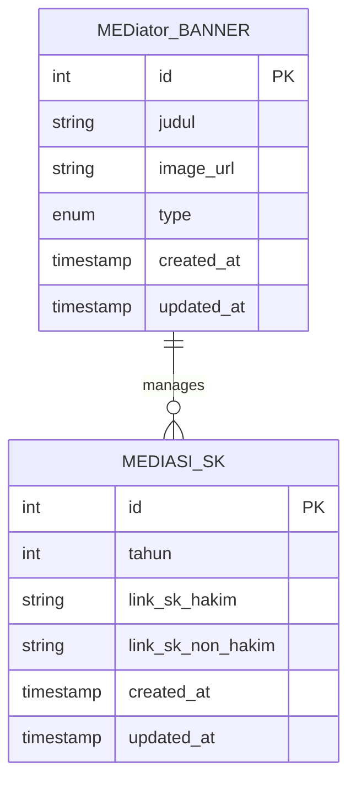
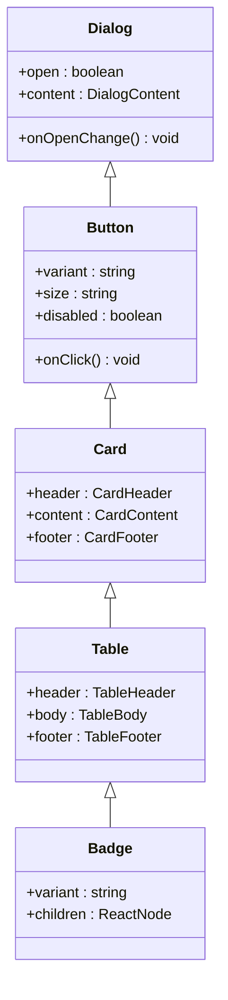
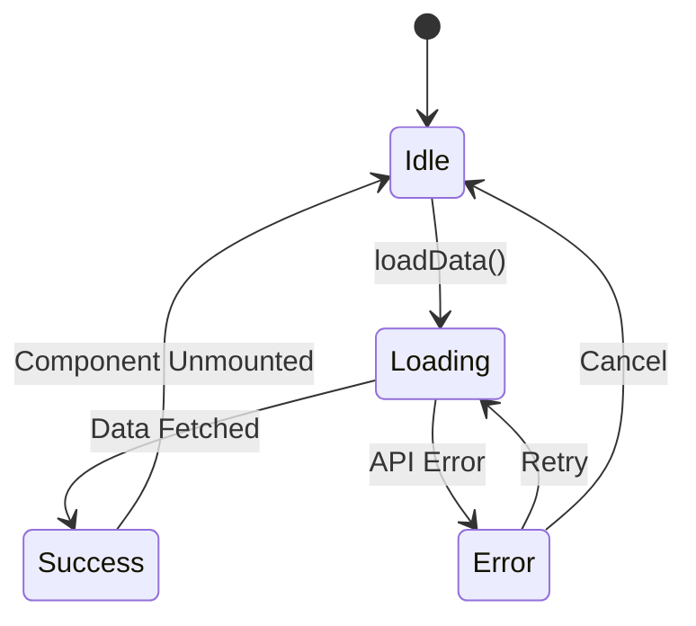
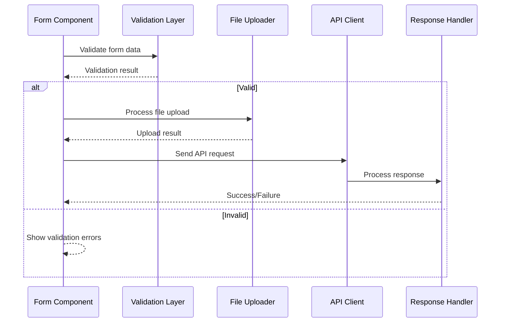
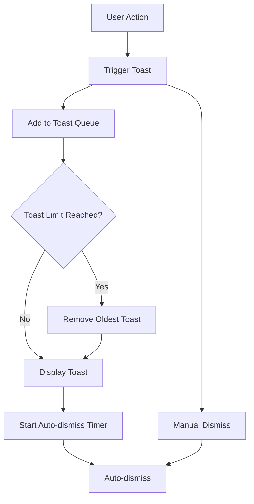

# Mediator Banner Management

<cite>
**Referenced Files in This Document**
- [app/mediasi/page.tsx](file://app/mediasi/page.tsx)
- [app/mediasi/banners/tambah/page.tsx](file://app/mediasi/banners/tambah/page.tsx)
- [app/mediasi/banners/[id]/edit/page.tsx](file://app/mediasi/banners/[id]/edit/page.tsx)
- [lib/api.ts](file://lib/api.ts)
- [components/ui/button.tsx](file://components/ui/button.tsx)
- [components/ui/card.tsx](file://components/ui/card.tsx)
- [components/ui/table.tsx](file://components/ui/table.tsx)
- [components/ui/dialog.tsx](file://components/ui/dialog.tsx)
- [components/ui/badge.tsx](file://components/ui/badge.tsx)
- [hooks/use-toast.ts](file://hooks/use-toast.ts)
- [components/ui/toaster.tsx](file://components/ui/toaster.tsx)
- [components/ui/toast.tsx](file://components/ui/toast.tsx)
- [lib/utils.ts](file://lib/utils.ts)
</cite>

## Table of Contents
1. [Introduction](#introduction)
2. [System Architecture](#system-architecture)
3. [Core Components](#core-components)
4. [Banner Management Features](#banner-management-features)
5. [API Integration](#api-integration)
6. [UI Component System](#ui-component-system)
7. [Data Flow Analysis](#data-flow-analysis)
8. [Error Handling and User Feedback](#error-handling-and-user-feedback)
9. [Performance Considerations](#performance-considerations)
10. [Security Implementation](#security-implementation)
11. [Troubleshooting Guide](#troubleshooting-guide)
12. [Conclusion](#conclusion)

## Introduction

The Mediator Banner Management system is a comprehensive administrative module designed to manage promotional banners for mediators within the judicial system. This system provides a centralized interface for administrators to upload, organize, and maintain banner content that appears prominently on the mediator dashboard. The platform supports two distinct categories of mediators: Hakim (Judicial Officers) and Non-Hakim (Non-Judicial Officers), each requiring tailored visual presentation and management capabilities.

The system integrates seamlessly with the broader admin panel infrastructure, utilizing modern React patterns with Next.js routing, TypeScript type safety, and a robust API layer. It emphasizes user experience through intuitive interfaces, responsive design, and comprehensive feedback mechanisms that guide administrators through banner creation, editing, and deletion processes.

## System Architecture

The Mediator Banner Management system follows a modular architecture pattern that separates concerns between presentation, data management, and backend integration. The system is built using Next.js App Router, which enables efficient server-side rendering and client-side navigation while maintaining optimal performance characteristics.

**Diagram sources**
- [app/mediasi/page.tsx:1-294](file://app/mediasi/page.tsx#L1-L294)
- [lib/api.ts:1147-1233](file://lib/api.ts#L1147-L1233)

The architecture demonstrates clear separation of concerns with dedicated components for each functional area, ensuring maintainability and scalability of the system.

**Section sources**
- [app/mediasi/page.tsx:38-294](file://app/mediasi/page.tsx#L38-L294)
- [lib/api.ts:1147-1233](file://lib/api.ts#L1147-L1233)

## Core Components

### Main Dashboard Component

The primary dashboard serves as the central hub for mediator banner management, providing dual-tab functionality to handle both SK (Standing Order) documents and banner content management. The component utilizes React's useState and useEffect hooks for state management and lifecycle control.

**Diagram sources**
- [app/mediasi/page.tsx:38-294](file://app/mediasi/page.tsx#L38-L294)
- [lib/api.ts:1150-1166](file://lib/api.ts#L1150-L1166)

The dashboard implements a sophisticated loading state management system that displays skeleton loaders during data fetching operations, providing immediate visual feedback to users while maintaining system responsiveness.

**Section sources**
- [app/mediasi/page.tsx:39-69](file://app/mediasi/page.tsx#L39-L69)
- [app/mediasi/page.tsx:100-111](file://app/mediasi/page.tsx#L100-L111)

### Form Management Components

The system includes specialized form components for creating and editing banner content, each designed with specific validation requirements and user interaction patterns.

**Diagram sources**
- [app/mediasi/banners/tambah/page.tsx:22-41](file://app/mediasi/banners/tambah/page.tsx#L22-L41)
- [lib/api.ts:1207-1214](file://lib/api.ts#L1207-L1214)

**Section sources**
- [app/mediasi/banners/tambah/page.tsx:16-41](file://app/mediasi/banners/tambah/page.tsx#L16-L41)
- [app/mediasi/banners/[id]/edit/page.tsx:16-65](file://app/mediasi/banners/[id]/edit/page.tsx#L16-L65)

## Banner Management Features

### Dual Category Support

The system supports two distinct mediator categories through a type-based filtering mechanism that ensures appropriate content delivery and management workflows.

| Category | Type Value | Purpose |
|----------|------------|---------|
| Hakim | 'hakim' | Judicial officers requiring formal documentation |
| Non-Hakim | 'non-hakim' | Administrative personnel with different presentation needs |

### Image Handling Capabilities

The banner management system provides flexible image handling through multiple input methods:

**Diagram sources**
- [app/mediasi/banners/tambah/page.tsx:82-94](file://app/mediasi/banners/tambah/page.tsx#L82-L94)
- [app/mediasi/banners/[id]/edit/page.tsx:112-129](file://app/mediasi/banners/[id]/edit/page.tsx#L112-L129)

The system accepts various image formats and automatically processes uploaded files, ensuring optimal display quality across different screen resolutions and device types.

**Section sources**
- [app/mediasi/banners/tambah/page.tsx:82-94](file://app/mediasi/banners/tambah/page.tsx#L82-L94)
- [app/mediasi/banners/[id]/edit/page.tsx:112-129](file://app/mediasi/banners/[id]/edit/page.tsx#L112-L129)

### Responsive Grid Layout

The banner display utilizes a responsive grid system that adapts to different screen sizes while maintaining visual consistency and usability standards.

| Screen Size | Columns | Card Behavior |
|-------------|---------|---------------|
| Mobile (<768px) | 1 column | Full-width cards |
| Tablet (768-1024px) | 2 columns | Two-column layout |
| Desktop (>1024px) | 3 columns | Three-column layout |

**Section sources**
- [app/mediasi/page.tsx:219-257](file://app/mediasi/page.tsx#L219-L257)

## API Integration

### Data Model Definitions

The system implements comprehensive TypeScript interfaces that define the data structures for both mediator banners and SK documents, ensuring type safety and development productivity.

**Diagram sources**
- [lib/api.ts:1150-1166](file://lib/api.ts#L1150-L1166)

### CRUD Operations

The API layer provides comprehensive CRUD (Create, Read, Update, Delete) operations for both banner and SK management, with standardized response formatting and error handling.

| Operation | Method | Endpoint | Description |
|-----------|--------|----------|-------------|
| Get All Banners | GET | `/mediator-banners` | Retrieve all mediator banners |
| Create Banner | POST | `/mediator-banners` | Add new banner content |
| Update Banner | POST | `/mediator-banners/:id` | Modify existing banner |
| Delete Banner | DELETE | `/mediator-banners/:id` | Remove banner permanently |
| Get All SK | GET | `/mediasi-sk` | Retrieve all SK documents |
| Create SK | POST | `/mediasi-sk` | Add new SK document |
| Update SK | POST | `/mediasi-sk/:id` | Modify existing SK |
| Delete SK | DELETE | `/mediasi-sk/:id` | Remove SK permanently |

**Section sources**
- [lib/api.ts:1201-1233](file://lib/api.ts#L1201-L1233)
- [lib/api.ts:1168-1199](file://lib/api.ts#L1168-L1199)

## UI Component System

### Component Library Architecture

The system leverages a comprehensive UI component library built with Radix UI primitives and Tailwind CSS utilities, providing consistent styling and behavior across all interface elements.

**Diagram sources**
- [components/ui/button.tsx:1-58](file://components/ui/button.tsx#L1-L58)
- [components/ui/card.tsx:1-77](file://components/ui/card.tsx#L1-L77)
- [components/ui/table.tsx:1-121](file://components/ui/table.tsx#L1-L121)
- [components/ui/badge.tsx:1-37](file://components/ui/badge.tsx#L1-L37)
- [components/ui/dialog.tsx:1-123](file://components/ui/dialog.tsx#L1-L123)

### Responsive Design Implementation

The component system implements a mobile-first responsive design approach that ensures optimal user experience across all device types and screen sizes.

**Section sources**
- [components/ui/button.tsx:7-35](file://components/ui/button.tsx#L7-L35)
- [components/ui/card.tsx:5-17](file://components/ui/card.tsx#L5-L17)
- [components/ui/table.tsx:5-17](file://components/ui/table.tsx#L5-L17)

## Data Flow Analysis

### Loading State Management

The system implements sophisticated loading state management that provides immediate visual feedback during data operations while maintaining system responsiveness.

**Diagram sources**
- [app/mediasi/page.tsx:46-65](file://app/mediasi/page.tsx#L46-L65)

### Form Submission Workflow

The form submission process follows a structured workflow that validates user input, processes file uploads, and provides comprehensive error handling.

**Diagram sources**
- [app/mediasi/banners/tambah/page.tsx:22-41](file://app/mediasi/banners/tambah/page.tsx#L22-L41)
- [app/mediasi/banners/[id]/edit/page.tsx:46-65](file://app/mediasi/banners/[id]/edit/page.tsx#L46-L65)

**Section sources**
- [app/mediasi/page.tsx:46-65](file://app/mediasi/page.tsx#L46-L65)
- [app/mediasi/banners/tambah/page.tsx:22-41](file://app/mediasi/banners/tambah/page.tsx#L22-L41)

## Error Handling and User Feedback

### Toast Notification System

The system implements a sophisticated toast notification system that provides contextual feedback for user actions, with automatic dismissal and customizable styling.

**Diagram sources**
- [hooks/use-toast.ts:11-130](file://hooks/use-toast.ts#L11-L130)

### Confirmation Dialog Pattern

The system employs modal confirmation dialogs for destructive operations, providing users with clear warnings and the ability to cancel irreversible actions.

**Section sources**
- [hooks/use-toast.ts:145-172](file://hooks/use-toast.ts#L145-L172)
- [app/mediasi/page.tsx:264-290](file://app/mediasi/page.tsx#L264-L290)

## Performance Considerations

### Optimized Data Fetching

The system implements concurrent data fetching for improved performance, loading both SK and banner data simultaneously to minimize initial page load time.

### Lazy Loading Implementation

Image assets utilize lazy loading techniques to improve perceived performance, with skeleton loaders displayed during image loading phases.

### Memory Management

The component system implements proper cleanup of event listeners and timers to prevent memory leaks during navigation and component unmounting.

## Security Implementation

### API Key Protection

All API requests include a mandatory API key header (`X-API-Key`) that authenticates requests and prevents unauthorized access to administrative endpoints.

### File Upload Security

File upload validation includes MIME type checking, file size limits, and secure storage handling to prevent malicious file uploads and ensure system integrity.

### CSRF Protection

The API layer implements CSRF protection through method override patterns for file uploads, ensuring secure handling of multipart form data submissions.

**Section sources**
- [lib/api.ts:82-91](file://lib/api.ts#L82-L91)
- [lib/api.ts:1207-1214](file://lib/api.ts#L1207-L1214)

## Troubleshooting Guide

### Common Issues and Solutions

**Banner Not Displaying**: Verify image URL accessibility and file format compatibility. Check network connectivity and CORS configuration.

**Upload Failures**: Ensure file size limits are not exceeded and file types are supported. Verify server storage permissions and available disk space.

**API Authentication Errors**: Confirm API key configuration and network connectivity to the backend service.

**Form Validation Errors**: Review required field completion and data format requirements. Check browser compatibility for file input elements.

### Debugging Tools

The system includes comprehensive logging and error reporting mechanisms that capture detailed information about API responses, user actions, and system state for diagnostic purposes.

**Section sources**
- [lib/api.ts:53-80](file://lib/api.ts#L53-L80)
- [hooks/use-toast.ts:174-192](file://hooks/use-toast.ts#L174-L192)

## Conclusion

The Mediator Banner Management system represents a comprehensive solution for administrative content management within the judicial system. Through its modular architecture, robust API integration, and user-centric design, the system provides administrators with powerful tools to manage mediator promotional content effectively.

The implementation demonstrates best practices in modern web development, including TypeScript type safety, React hooks patterns, responsive design principles, and comprehensive error handling. The system's extensible architecture supports future enhancements and maintains compatibility with evolving administrative requirements.

Key strengths of the system include its intuitive user interface, comprehensive validation mechanisms, secure API integration, and responsive design that works across all device types. The modular component architecture ensures maintainability and facilitates future feature additions while preserving system stability and performance.