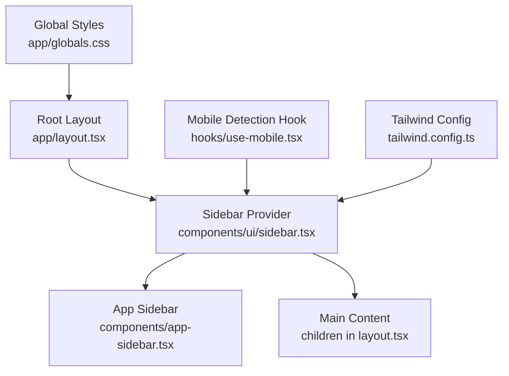
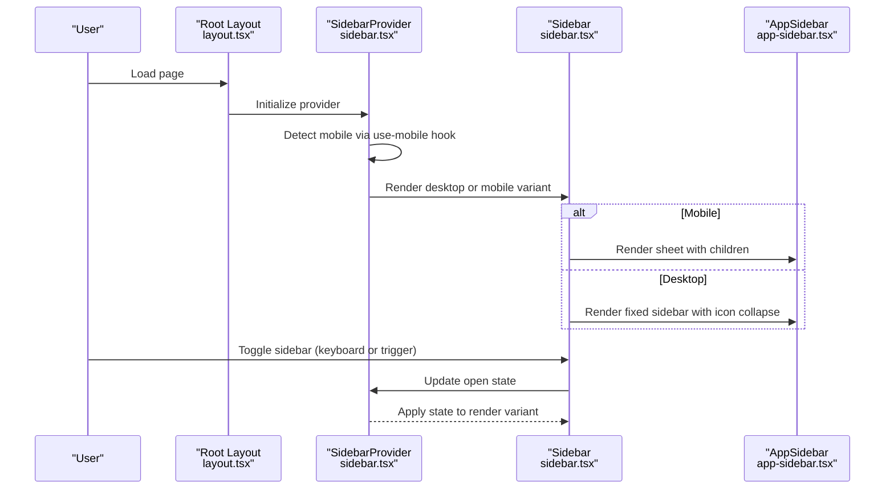
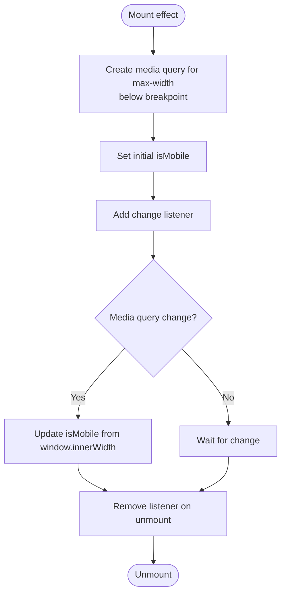
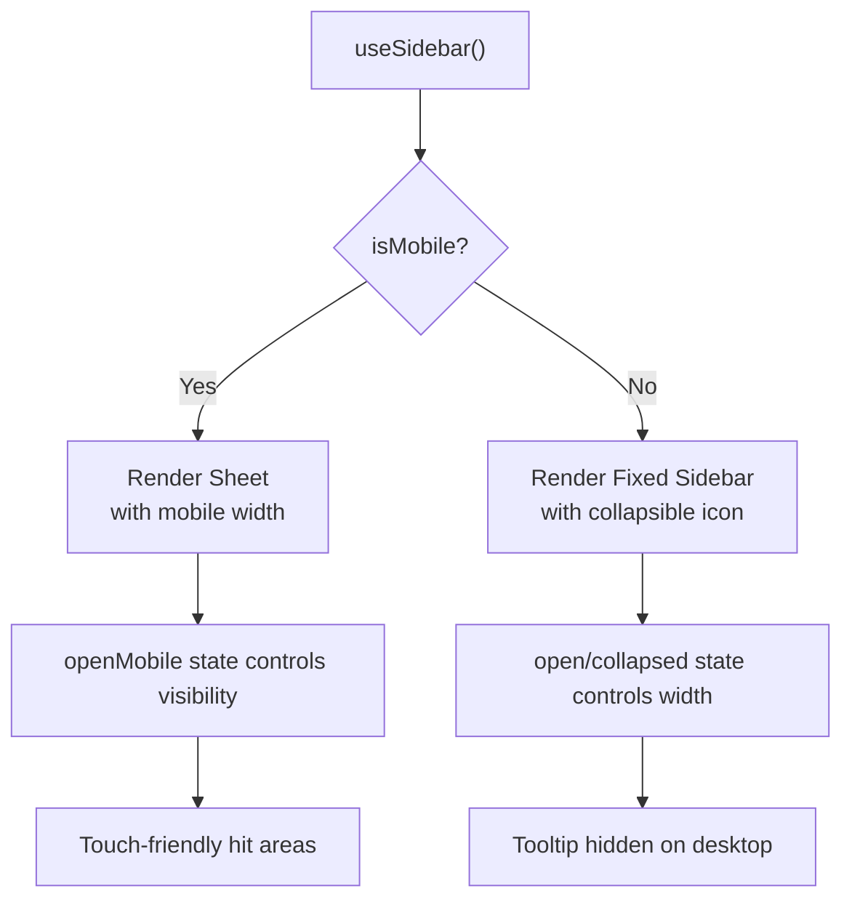
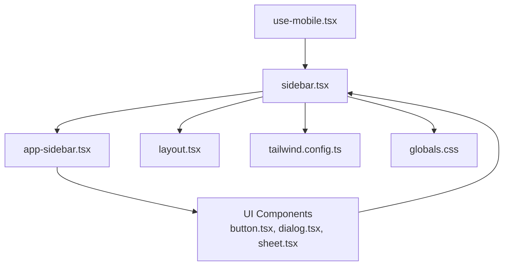

# Mobile Responsiveness

<cite>
**Referenced Files in This Document**
- [use-mobile.tsx](file://hooks/use-mobile.tsx)
- [sidebar.tsx](file://components/ui/sidebar.tsx)
- [app-sidebar.tsx](file://components/app-sidebar.tsx)
- [layout.tsx](file://app/layout.tsx)
- [globals.css](file://app/globals.css)
- [tailwind.config.ts](file://tailwind.config.ts)
- [Pagination.tsx](file://components/Pagination.tsx)
- [page.tsx](file://app/page.tsx)
- [sheet.tsx](file://components/ui/sheet.tsx)
- [dialog.tsx](file://components/ui/dialog.tsx)
- [button.tsx](file://components/ui/button.tsx)
- [globe.tsx](file://components/ui/globe.tsx)
- [package.json](file://package.json)
</cite>

## Table of Contents
1. [Introduction](#introduction)
2. [Project Structure](#project-structure)
3. [Core Components](#core-components)
4. [Architecture Overview](#architecture-overview)
5. [Detailed Component Analysis](#detailed-component-analysis)
6. [Dependency Analysis](#dependency-analysis)
7. [Performance Considerations](#performance-considerations)
8. [Troubleshooting Guide](#troubleshooting-guide)
9. [Conclusion](#conclusion)
10. [Appendices](#appendices)

## Introduction
This document explains how the application implements mobile-first responsive design and adaptive layouts. It covers the mobile detection hook, responsive sidebar behavior across screen sizes, touch interaction patterns, and how these integrate with the overall layout. It also provides guidance on maintaining responsive design across devices and orientations, performance considerations for mobile, and accessibility best practices.

## Project Structure
The application follows a component-driven structure with a dedicated sidebar system and a mobile detection hook. The layout wraps the entire application with a provider that manages sidebar state and responsive behavior. UI primitives are built with Radix UI and styled with Tailwind CSS.

**Diagram sources**
- [layout.tsx:12-36](file://app/layout.tsx#L12-L36)
- [sidebar.tsx:56-163](file://components/ui/sidebar.tsx#L56-L163)
- [app-sidebar.tsx:137-231](file://components/app-sidebar.tsx#L137-L231)
- [use-mobile.tsx:1-20](file://hooks/use-mobile.tsx#L1-L20)
- [tailwind.config.ts:1-106](file://tailwind.config.ts#L1-L106)
- [globals.css:1-102](file://app/globals.css#L1-L102)

**Section sources**
- [layout.tsx:12-36](file://app/layout.tsx#L12-L36)
- [sidebar.tsx:56-163](file://components/ui/sidebar.tsx#L56-L163)
- [app-sidebar.tsx:137-231](file://components/app-sidebar.tsx#L137-L231)
- [use-mobile.tsx:1-20](file://hooks/use-mobile.tsx#L1-L20)
- [tailwind.config.ts:1-106](file://tailwind.config.ts#L1-L106)
- [globals.css:1-102](file://app/globals.css#L1-L102)

## Core Components
- Mobile detection hook: Provides a boolean flag indicating whether the viewport width is below the mobile breakpoint.
- Sidebar system: A provider and set of components that adapt behavior based on device type and sidebar state.
- App sidebar: A themed navigation sidebar that adapts between collapsed icon mode and expanded menu on desktop, and transforms into a mobile drawer on small screens.
- Layout wrapper: Establishes the provider context and renders the trigger and main content area.

Key implementation patterns:
- Mobile-first breakpoint: The hook defines a fixed breakpoint for determining mobile vs. desktop behavior.
- Responsive sidebar variants: Desktop uses a persistent sidebar; mobile uses a slide-in sheet overlay.
- Adaptive menu buttons: Collapsed icon mode hides labels and tooltips; tooltips are hidden on mobile.
- Sticky header with trigger: The header bar includes a sidebar toggle button for quick access.

**Section sources**
- [use-mobile.tsx:3-19](file://hooks/use-mobile.tsx#L3-L19)
- [sidebar.tsx:76-136](file://components/ui/sidebar.tsx#L76-L136)
- [sidebar.tsx:201-223](file://components/ui/sidebar.tsx#L201-L223)
- [sidebar.tsx:225-267](file://components/ui/sidebar.tsx#L225-L267)
- [sidebar.tsx:567-601](file://components/ui/sidebar.tsx#L567-L601)
- [layout.tsx:20-32](file://app/layout.tsx#L20-L32)
- [app-sidebar.tsx:140-189](file://components/app-sidebar.tsx#L140-L189)

## Architecture Overview
The responsive architecture centers on a provider that detects mobile and controls sidebar presentation and behavior. The sidebar switches between:
- Off-canvas desktop layout with collapsible icon mode
- Slide-in sheet overlay on mobile

**Diagram sources**
- [layout.tsx:20-32](file://app/layout.tsx#L20-L32)
- [sidebar.tsx:76-136](file://components/ui/sidebar.tsx#L76-L136)
- [sidebar.tsx:201-223](file://components/ui/sidebar.tsx#L201-L223)
- [sidebar.tsx:225-267](file://components/ui/sidebar.tsx#L225-L267)
- [app-sidebar.tsx:137-231](file://components/app-sidebar.tsx#L137-L231)

## Detailed Component Analysis

### Mobile Detection Hook
The hook determines if the current device is mobile by checking the viewport against a fixed breakpoint. It listens to media query changes and updates state accordingly.

**Diagram sources**
- [use-mobile.tsx:8-16](file://hooks/use-mobile.tsx#L8-L16)

**Section sources**
- [use-mobile.tsx:3-19](file://hooks/use-mobile.tsx#L3-L19)

### Responsive Sidebar Behavior
The sidebar adapts based on device type and state:
- Mobile: Uses a sheet overlay with a smaller width constant for touch-friendly access.
- Desktop: Uses a fixed sidebar with collapsible icon mode and tooltip behavior.

**Diagram sources**
- [sidebar.tsx:76-136](file://components/ui/sidebar.tsx#L76-L136)
- [sidebar.tsx:201-223](file://components/ui/sidebar.tsx#L201-L223)
- [sidebar.tsx:225-267](file://components/ui/sidebar.tsx#L225-L267)
- [sidebar.tsx:567-601](file://components/ui/sidebar.tsx#L567-L601)

**Section sources**
- [sidebar.tsx:201-223](file://components/ui/sidebar.tsx#L201-L223)
- [sidebar.tsx:225-267](file://components/ui/sidebar.tsx#L225-L267)
- [sidebar.tsx:567-601](file://components/ui/sidebar.tsx#L567-L601)

### App Sidebar Navigation
The app sidebar provides themed navigation with:
- Icon and label entries
- Active state highlighting
- Collapsible icon mode on desktop
- User profile dropdown in footer

Responsive behavior:
- On desktop with icon collapse, labels are hidden and tooltips appear on hover.
- On mobile, the sheet overlay displays the full sidebar content.

**Section sources**
- [app-sidebar.tsx:140-189](file://components/app-sidebar.tsx#L140-L189)
- [app-sidebar.tsx:191-227](file://components/app-sidebar.tsx#L191-L227)

### Touch Interaction Patterns
The sidebar and UI components incorporate touch-friendly patterns:
- Increased hit areas for interactive elements on mobile.
- Sheet overlay with close affordance.
- Pointer and touch handlers for interactive elements.

Examples:
- Sidebar menu action and tooltip components increase tap targets on mobile.
- Sheet overlay closes with a visible close button.
- Interactive globe component supports pointer and touch movement.

**Section sources**
- [sidebar.tsx:474-476](file://components/ui/sidebar.tsx#L474-L476)
- [sidebar.tsx:620-622](file://components/ui/sidebar.tsx#L620-L622)
- [sheet.tsx:59-74](file://components/ui/sheet.tsx#L59-L74)
- [globe.tsx:115-125](file://components/ui/globe.tsx#L115-L125)

### Content Reflow Strategies
The application uses responsive utilities to adapt content layout:
- Grid layouts that stack on small screens and expand into multiple columns on larger screens.
- Flexible spacing and typography scaling.
- Container constraints and max widths for readability.

Examples:
- Dashboard cards stack vertically on small screens and form grids on medium and larger screens.
- Pagination controls adjust layout based on screen width.

**Section sources**
- [page.tsx:30-44](file://app/page.tsx#L30-L44)
- [page.tsx:47-137](file://app/page.tsx#L47-L137)
- [page.tsx:140-201](file://app/page.tsx#L140-L201)
- [Pagination.tsx:92-97](file://components/Pagination.tsx#L92-L97)

### Navigation Adaptation
Navigation adapts across breakpoints:
- Desktop: Persistent sidebar with collapsible icon mode and tooltip hints.
- Mobile: Sheet overlay with full sidebar content and a close affordance.
- Header: Sticky header with a sidebar trigger for quick access.

**Section sources**
- [layout.tsx:23-29](file://app/layout.tsx#L23-L29)
- [sidebar.tsx:201-223](file://components/ui/sidebar.tsx#L201-L223)
- [sidebar.tsx:225-267](file://components/ui/sidebar.tsx#L225-L267)

## Dependency Analysis
The responsive system relies on:
- Radix UI primitives for accessible overlays and interactions.
- Tailwind CSS for utility-first responsive styling.
- Motion library for smooth animations and transitions.

**Diagram sources**
- [use-mobile.tsx:1-20](file://hooks/use-mobile.tsx#L1-L20)
- [sidebar.tsx:1-774](file://components/ui/sidebar.tsx#L1-L774)
- [app-sidebar.tsx:1-231](file://components/app-sidebar.tsx#L1-L231)
- [layout.tsx:1-37](file://app/layout.tsx#L1-L37)
- [tailwind.config.ts:1-106](file://tailwind.config.ts#L1-L106)
- [globals.css:1-102](file://app/globals.css#L1-L102)
- [button.tsx:1-58](file://components/ui/button.tsx#L1-L58)
- [dialog.tsx:1-123](file://components/ui/dialog.tsx#L1-L123)
- [sheet.tsx:1-141](file://components/ui/sheet.tsx#L1-L141)

**Section sources**
- [package.json:11-32](file://package.json#L11-L32)
- [sidebar.tsx:1-27](file://components/ui/sidebar.tsx#L1-L27)

## Performance Considerations
- Minimize heavy computations on resize: The mobile detection hook uses a media query listener and window width checks to avoid expensive recalculations.
- Prefer CSS transitions: The sidebar uses CSS variables and transitions for smooth, hardware-accelerated animations.
- Conditional rendering: The sheet overlay is only mounted on mobile, reducing DOM overhead on desktop.
- Touch-friendly hit areas: Larger interactive regions reduce accidental taps and improve usability.
- Lazy loading and minimal repaints: Components use CSS transforms and opacity changes to minimize layout thrashing.

[No sources needed since this section provides general guidance]

## Troubleshooting Guide
Common issues and resolutions:
- Sidebar not toggling on mobile: Ensure the provider is initialized and the hook is used inside the provider context.
- Tooltip not appearing on desktop: Verify the sidebar is in collapsed icon mode and not on mobile.
- Sheet not closing on mobile: Confirm the close button is present and the overlay click-to-close behavior is intact.
- Touch gestures not responding: Check pointer and touch handlers are attached to interactive elements.

**Section sources**
- [sidebar.tsx:76-136](file://components/ui/sidebar.tsx#L76-L136)
- [sidebar.tsx:201-223](file://components/ui/sidebar.tsx#L201-L223)
- [sheet.tsx:59-74](file://components/ui/sheet.tsx#L59-L74)
- [globe.tsx:115-125](file://components/ui/globe.tsx#L115-L125)

## Conclusion
The application implements a robust mobile-first responsive design centered on a provider-driven sidebar system. The mobile detection hook informs responsive behavior, while the sidebar adapts seamlessly between desktop and mobile presentations. Touch-friendly interactions and adaptive layouts ensure a consistent experience across devices and orientations.

[No sources needed since this section summarizes without analyzing specific files]

## Appendices

### Responsive Breakpoints and Adaptive Patterns
- Mobile breakpoint: Defined by the mobile detection hook.
- Desktop variant: Fixed sidebar with collapsible icon mode and tooltip behavior.
- Mobile variant: Sheet overlay with a narrower width for touch-friendly access.
- Content reflow: Grids and utilities adapt layout across breakpoints.

**Section sources**
- [use-mobile.tsx:3-19](file://hooks/use-mobile.tsx#L3-L19)
- [sidebar.tsx:201-223](file://components/ui/sidebar.tsx#L201-L223)
- [sidebar.tsx:225-267](file://components/ui/sidebar.tsx#L225-L267)
- [page.tsx:30-44](file://app/page.tsx#L30-L44)