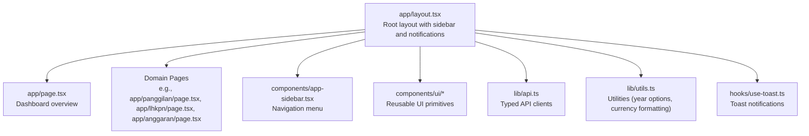
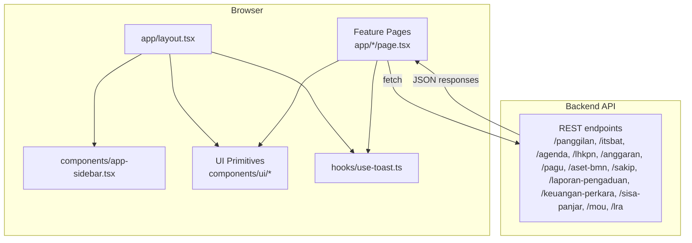
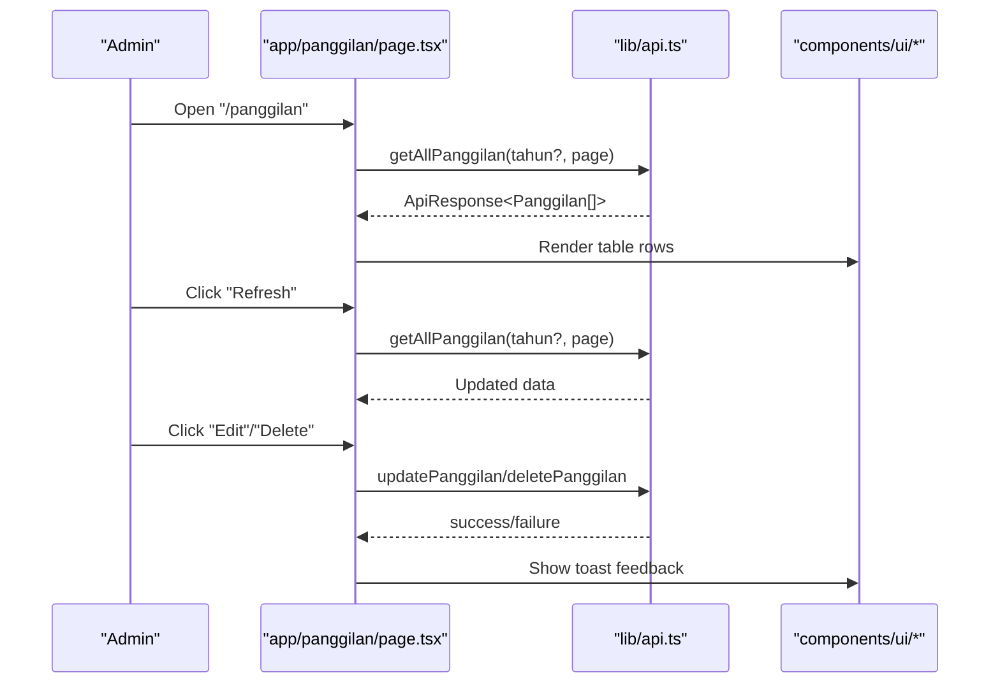
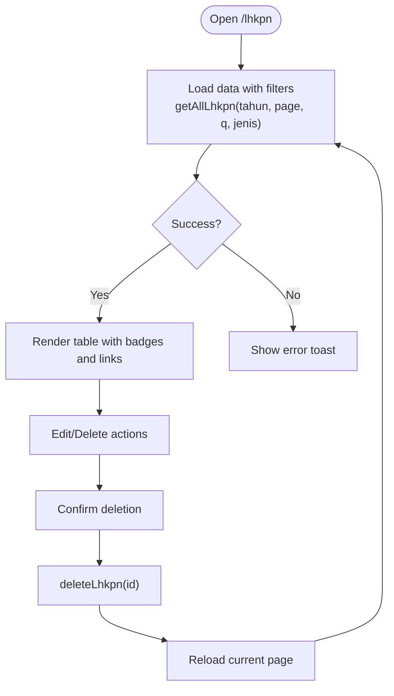
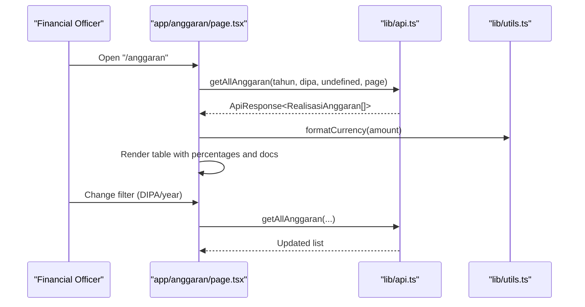
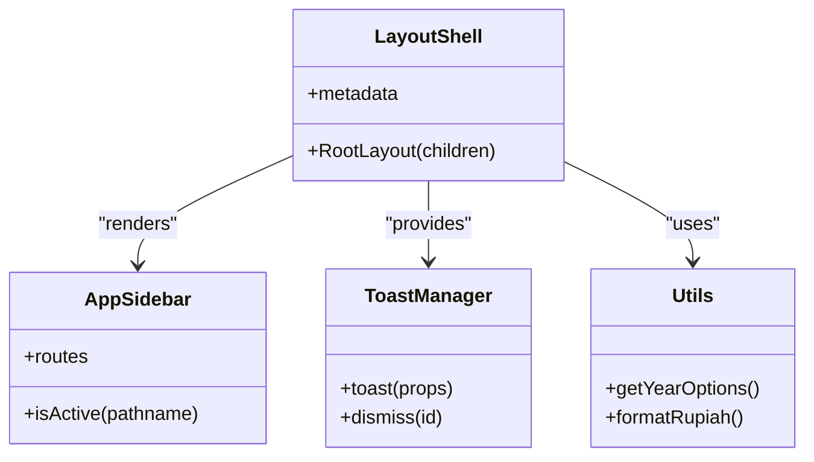
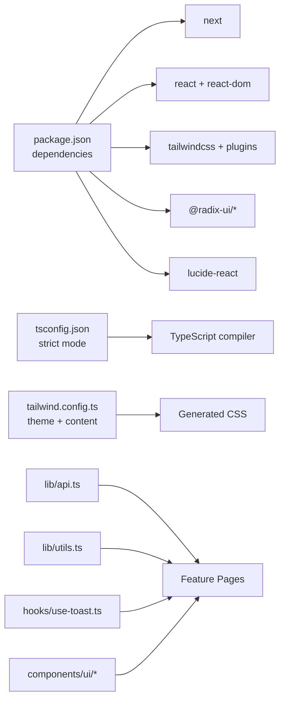

# Project Overview

<cite>
**Referenced Files in This Document**
- [package.json](file://package.json)
- [next.config.js](file://next.config.js)
- [tsconfig.json](file://tsconfig.json)
- [tailwind.config.ts](file://tailwind.config.ts)
- [app/layout.tsx](file://app/layout.tsx)
- [components/app-sidebar.tsx](file://components/app-sidebar.tsx)
- [lib/api.ts](file://lib/api.ts)
- [lib/utils.ts](file://lib/utils.ts)
- [hooks/use-toast.ts](file://hooks/use-toast.ts)
- [components/ui/button.tsx](file://components/ui/button.tsx)
- [components/ui/table.tsx](file://components/ui/table.tsx)
- [components/ui/pagination.tsx](file://components/ui/pagination.tsx)
- [components/Pagination.tsx](file://components/Pagination.tsx)
- [app/page.tsx](file://app/page.tsx)
- [app/panggilan/page.tsx](file://app/panggilan/page.tsx)
- [app/lhkpn/page.tsx](file://app/lhkpn/page.tsx)
- [app/anggaran/page.tsx](file://app/anggaran/page.tsx)
</cite>

## Table of Contents
1. [Introduction](#introduction)
2. [Project Structure](#project-structure)
3. [Core Components](#core-components)
4. [Architecture Overview](#architecture-overview)
5. [Detailed Component Analysis](#detailed-component-analysis)
6. [Dependency Analysis](#dependency-analysis)
7. [Performance Considerations](#performance-considerations)
8. [Troubleshooting Guide](#troubleshooting-guide)
9. [Conclusion](#conclusion)

## Introduction
The Penajam Agama Court Admin Panel is a digital administrative dashboard designed to streamline operations for Agama Court (Islamic Civil Court) staff in Penajam Paser Utara. It centralizes the management of multiple domains essential to court administration, including case-related communications (Panggilan Ghaib and e-Court), procedural documentation (Itsbat Nikah), leadership agendas (Agenda Pimpinan), financial reporting (Realisasi Anggaran and Pagu), asset and budget documents (Aset & BMN, DIPA & POK), integrity reporting (LHKPN & SPT), strategic documents (SAKIP), public complaints (Laporan Pengaduan), litigation finances (Keuangan Perkara), petty cash balances (Sisa Panjar), memoranda of understanding (MOU), and local financial reports (LRA).

Target audience:
- Court administrators responsible for maintaining records and dashboards
- Legal staff who manage procedural timelines and documentation
- Financial officers overseeing budgets, payments, and compliance reporting
- Public service officers handling citizen communications and transparency

Key features and capabilities:
- Unified navigation via a responsive sidebar with domain-specific modules
- CRUD operations for each module with form-driven editing and file upload support
- Filtering, searching, and pagination for large datasets
- Toast notifications for user feedback
- Responsive layouts and accessible UI components

Technology stack overview:
- Frontend framework: Next.js 16 (App Router)
- UI framework: React 19
- Styling: Tailwind CSS with a custom theme
- Types and strictness: TypeScript strict mode
- UI primitives: Radix UI + Lucide icons
- Utilities: clsx, tailwind-merge, motion for animations

## Project Structure
The application follows a feature-based structure under the Next.js App Router, grouping pages by domain (e.g., panggilan, itsbat, anggaran). Shared UI components reside in components/ui, while reusable logic lives in lib and hooks. The global layout wraps all pages with a consistent header, sidebar, and notification system.

**Diagram sources**
- [app/layout.tsx:12-36](file://app/layout.tsx#L12-L36)
- [components/app-sidebar.tsx:137-231](file://components/app-sidebar.tsx#L137-L231)
- [lib/api.ts:1-120](file://lib/api.ts#L1-L120)
- [lib/utils.ts:8-25](file://lib/utils.ts#L8-L25)
- [hooks/use-toast.ts:145-195](file://hooks/use-toast.ts#L145-L195)
- [components/ui/button.tsx:7-58](file://components/ui/button.tsx#L7-L58)
- [components/ui/table.tsx:5-121](file://components/ui/table.tsx#L5-L121)
- [components/ui/pagination.tsx:7-118](file://components/ui/pagination.tsx#L7-L118)

**Section sources**
- [package.json:11-33](file://package.json#L11-L33)
- [next.config.js:2-4](file://next.config.js#L2-L4)
- [tsconfig.json:12-18](file://tsconfig.json#L12-L18)
- [tailwind.config.ts:1-106](file://tailwind.config.ts#L1-L106)
- [app/layout.tsx:1-37](file://app/layout.tsx#L1-L37)
- [components/app-sidebar.tsx:44-135](file://components/app-sidebar.tsx#L44-L135)

## Core Components
- Global layout and shell
  - Root layout sets up the HTML wrapper, sidebar provider, main content area, and toast container.
  - Sticky header with sidebar trigger and branding.
- Navigation sidebar
  - Route definitions for all modules with icons and active-state highlighting.
  - User profile dropdown for account actions.
- UI primitives
  - Button, Table, Pagination, Input, Select, Dialog, Badge, and others built with Radix UI and styled via Tailwind.
- Utilities and hooks
  - Year options generator for filters.
  - Toast manager for user feedback.
  - Currency formatter for financial data.
- API layer
  - Typed endpoints for each domain (Panggilan, Itsbat, Agenda, LHKPN, Anggaran, Pagu, Aset-BMN, SAKIP, Laporan-Pengaduan, Keuangan Perkara, Sisa Panjar, MOU, LRA).
  - Normalized response handling and X-API-Key header injection.

Practical examples (common use cases):
- View and filter Panggilan Ghaib by year, refresh data, and navigate to edit/delete actions.
- Upload and manage LHKPN/SPT documents with year and type filters and search.
- Track monthly budget realizations per DIPA with paginated summaries and document links.
- Manage agenda entries for leadership display and publish updates.

**Section sources**
- [app/layout.tsx:12-36](file://app/layout.tsx#L12-L36)
- [components/app-sidebar.tsx:44-135](file://components/app-sidebar.tsx#L44-L135)
- [components/ui/button.tsx:7-58](file://components/ui/button.tsx#L7-L58)
- [components/ui/table.tsx:5-121](file://components/ui/table.tsx#L5-L121)
- [components/ui/pagination.tsx:7-118](file://components/ui/pagination.tsx#L7-L118)
- [lib/utils.ts:8-25](file://lib/utils.ts#L8-L25)
- [hooks/use-toast.ts:145-195](file://hooks/use-toast.ts#L145-L195)
- [lib/api.ts:97-149](file://lib/api.ts#L97-L149)

## Architecture Overview
The admin panel is a client-side Next.js application that communicates with a backend API. The frontend is organized into:
- Pages: Feature-focused screens under app/<domain>/page.tsx
- Components: Reusable UI primitives under components/ui/*
- Hooks: Client-side state and notifications
- Lib: API clients and shared utilities

**Diagram sources**
- [app/layout.tsx:12-36](file://app/layout.tsx#L12-L36)
- [components/app-sidebar.tsx:137-231](file://components/app-sidebar.tsx#L137-L231)
- [lib/api.ts:97-149](file://lib/api.ts#L97-L149)
- [app/panggilan/page.tsx:42-69](file://app/panggilan/page.tsx#L42-L69)
- [app/lhkpn/page.tsx:45-79](file://app/lhkpn/page.tsx#L45-L79)
- [app/anggaran/page.tsx:45-75](file://app/anggaran/page.tsx#L45-L75)

## Detailed Component Analysis

### Domain: Panggilan Ghaib
Purpose: Manage summons records for absent parties in religious civil cases, including case numbers, names, addresses, summon dates, and hearing dates.

Key behaviors:
- Load paginated data with year filtering
- Refresh data on demand
- Edit and delete entries
- Responsive table with skeleton loaders during loading

**Diagram sources**
- [app/panggilan/page.tsx:28-90](file://app/panggilan/page.tsx#L28-L90)
- [lib/api.ts:97-149](file://lib/api.ts#L97-L149)
- [hooks/use-toast.ts:145-195](file://hooks/use-toast.ts#L145-L195)
- [components/ui/table.tsx:5-121](file://components/ui/table.tsx#L5-L121)
- [components/ui/pagination.tsx:7-118](file://components/ui/pagination.tsx#L7-L118)

**Section sources**
- [app/panggilan/page.tsx:28-310](file://app/panggilan/page.tsx#L28-L310)
- [lib/api.ts:5-20](file://lib/api.ts#L5-L20)
- [lib/utils.ts:8-16](file://lib/utils.ts#L8-L16)

### Domain: LHKPN & SPT Tahunan
Purpose: Track annual assets and tax declarations for employees, including supporting document links.

Key behaviors:
- Filter by year and report type
- Search by name/NIP with debounced input
- Paginated listing with currency formatting
- Open external document links in new tabs

**Diagram sources**
- [app/lhkpn/page.tsx:30-99](file://app/lhkpn/page.tsx#L30-L99)
- [lib/api.ts:372-423](file://lib/api.ts#L372-L423)
- [hooks/use-toast.ts:145-195](file://hooks/use-toast.ts#L145-L195)

**Section sources**
- [app/lhkpn/page.tsx:30-356](file://app/lhkpn/page.tsx#L30-L356)
- [lib/api.ts:340-370](file://lib/api.ts#L340-L370)

### Domain: Realisasi Anggaran
Purpose: Monitor monthly budget realizations per DIPA with pagu, realization, and percentage.

Key behaviors:
- Filter by DIPA and year
- Paginated display with formatted currency
- Document link preview
- Edit/Delete actions

**Diagram sources**
- [app/anggaran/page.tsx:31-95](file://app/anggaran/page.tsx#L31-L95)
- [lib/api.ts:429-471](file://lib/api.ts#L429-L471)
- [lib/utils.ts:18-25](file://lib/utils.ts#L18-L25)

**Section sources**
- [app/anggaran/page.tsx:31-335](file://app/anggaran/page.tsx#L31-L335)
- [lib/api.ts:356-370](file://lib/api.ts#L356-L370)

### Global Layout and Navigation
The layout establishes a consistent shell across all pages:
- Sidebar with domain routes and active highlighting
- Header with sidebar toggle and branding
- Toast container for notifications
- Utility functions for year options and currency formatting

**Diagram sources**
- [app/layout.tsx:7-36](file://app/layout.tsx#L7-L36)
- [components/app-sidebar.tsx:137-231](file://components/app-sidebar.tsx#L137-L231)
- [hooks/use-toast.ts:145-195](file://hooks/use-toast.ts#L145-L195)
- [lib/utils.ts:8-25](file://lib/utils.ts#L8-L25)

**Section sources**
- [app/layout.tsx:12-36](file://app/layout.tsx#L12-L36)
- [components/app-sidebar.tsx:137-231](file://components/app-sidebar.tsx#L137-L231)
- [hooks/use-toast.ts:145-195](file://hooks/use-toast.ts#L145-L195)
- [lib/utils.ts:8-25](file://lib/utils.ts#L8-L25)

## Dependency Analysis
- Runtime dependencies
  - Next.js 16 for SSR/SSG and routing
  - React 19 for component model
  - Tailwind CSS for styling with custom theme and animations
  - Radix UI primitives for accessible components
  - Lucide React for icons
- Build-time dependencies
  - TypeScript for type safety
  - Tailwind plugins for animations and merging classes
- Internal modules
  - lib/api.ts encapsulates all domain endpoints and normalization
  - hooks/use-toast.ts provides centralized toast state management
  - components/ui/* provides composable UI primitives
  - lib/utils.ts offers shared helpers

**Diagram sources**
- [package.json:11-33](file://package.json#L11-L33)
- [tsconfig.json:12-18](file://tsconfig.json#L12-L18)
- [tailwind.config.ts:1-106](file://tailwind.config.ts#L1-L106)
- [lib/api.ts:1-120](file://lib/api.ts#L1-L120)
- [lib/utils.ts:8-25](file://lib/utils.ts#L8-L25)
- [hooks/use-toast.ts:145-195](file://hooks/use-toast.ts#L145-L195)
- [components/ui/button.tsx:7-58](file://components/ui/button.tsx#L7-L58)

**Section sources**
- [package.json:11-33](file://package.json#L11-L33)
- [tsconfig.json:12-18](file://tsconfig.json#L12-L18)
- [tailwind.config.ts:1-106](file://tailwind.config.ts#L1-L106)

## Performance Considerations
- Client-side pagination reduces server load for large lists; ensure appropriate per_page limits and avoid unnecessary re-renders by using stable keys and memoization where needed.
- Debounced search inputs (as seen in LHKPN) prevent excessive API calls during typing.
- Skeleton loaders improve perceived performance while data loads.
- Use of normalized API responses allows flexible handling of varying backend schemas.
- Consider caching strategies for static filters (e.g., year options) to minimize repeated computations.

## Troubleshooting Guide
Common issues and resolutions:
- API connectivity errors
  - Symptom: Toast displays "Failed to load data. Ensure API is connected."
  - Resolution: Verify NEXT_PUBLIC_API_URL and X-API-Key environment variables; check network tab for 4xx/5xx responses.
- File upload failures
  - Symptom: Errors when saving forms with attachments.
  - Resolution: Ensure FormData is used for uploads; confirm backend accepts multipart/form-data and that _method=PUT is appended for updates when needed.
- Pagination inconsistencies
  - Symptom: Incorrect page counts or missing items.
  - Resolution: Confirm current_page, last_page, and total fields are present in API responses; verify pagination controls call the correct page number.
- Toast not dismissing
  - Symptom: Persistent notifications.
  - Resolution: Use dismiss(id) or rely on automatic dismissal; ensure only one toast is shown at a time.

**Section sources**
- [app/panggilan/page.tsx:57-63](file://app/panggilan/page.tsx#L57-L63)
- [app/lhkpn/page.tsx:62-68](file://app/lhkpn/page.tsx#L62-L68)
- [hooks/use-toast.ts:145-195](file://hooks/use-toast.ts#L145-L195)
- [lib/api.ts:186-193](file://lib/api.ts#L186-L193)

## Conclusion
The Penajam Agama Court Admin Panel provides a modular, type-safe, and responsive interface for managing diverse court administrative domains. Its architecture leverages Next.js 16’s App Router, a typed API layer, and a cohesive set of UI primitives to deliver a robust, maintainable solution. By following the patterns demonstrated in the domain pages and adhering to the troubleshooting guidance, teams can confidently extend functionality and onboard new users efficiently.