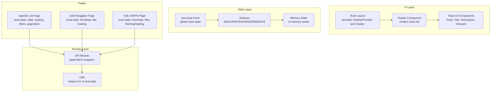
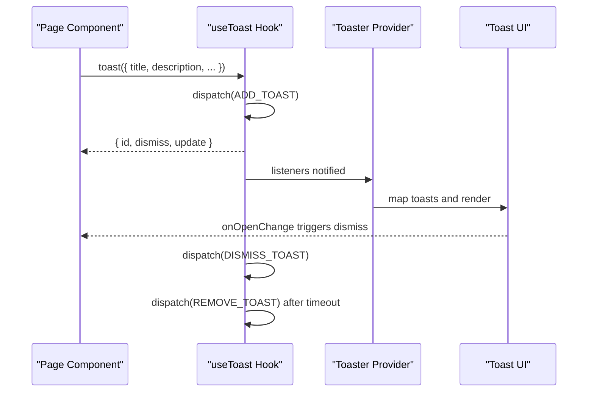
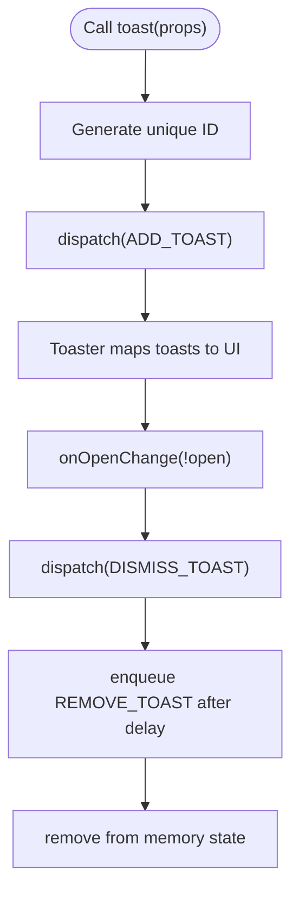
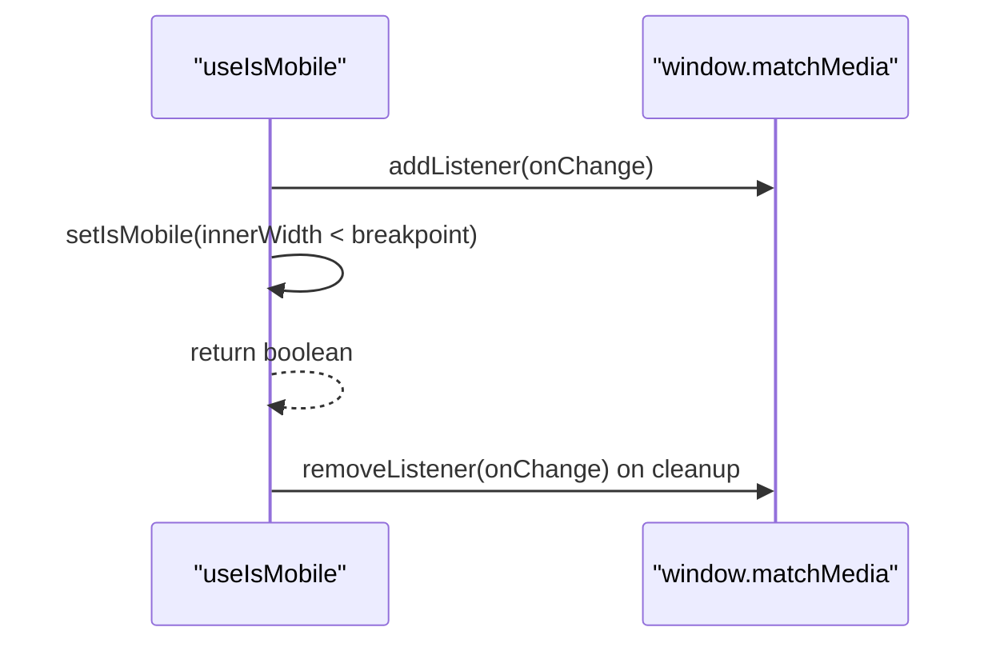
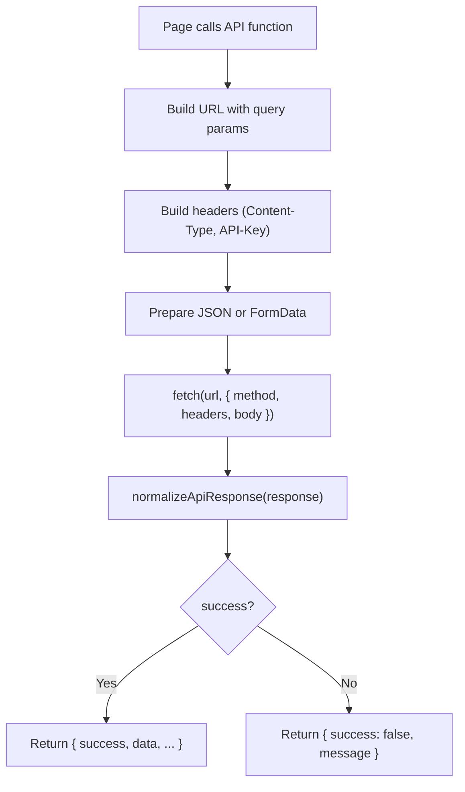
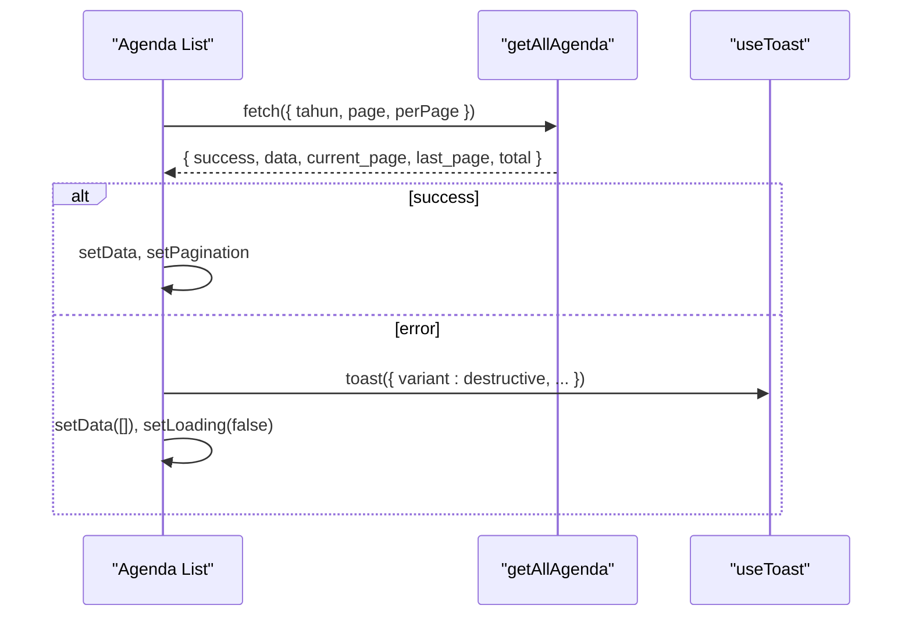
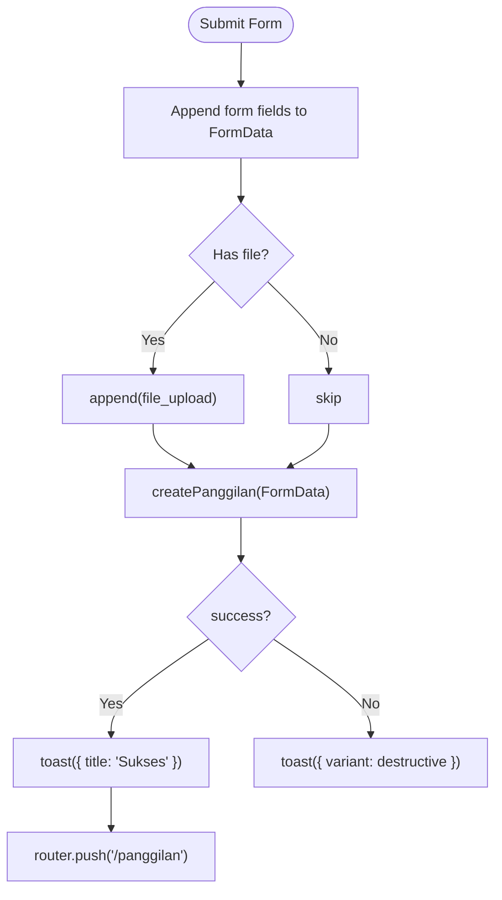
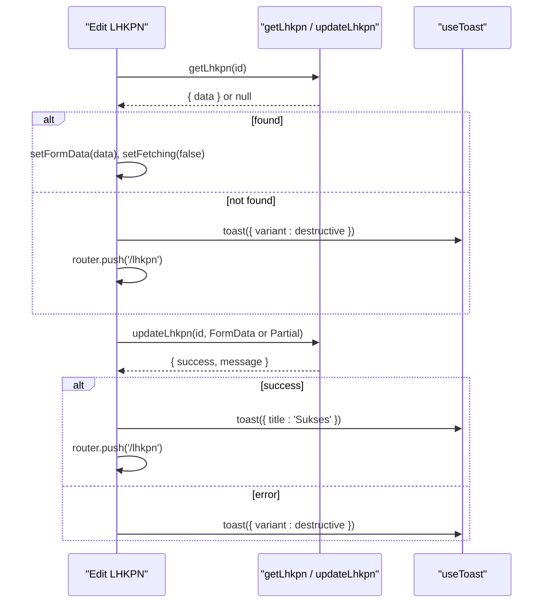
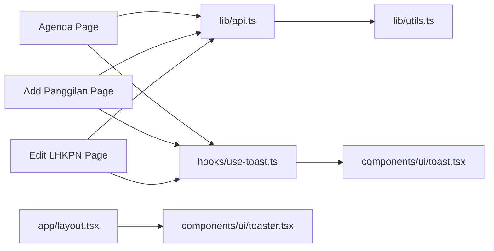

# State Management

<cite>
**Referenced Files in This Document**
- [hooks/use-toast.ts](file://hooks/use-toast.ts)
- [hooks/use-mobile.tsx](file://hooks/use-mobile.tsx)
- [components/ui/toaster.tsx](file://components/ui/toaster.tsx)
- [components/ui/toast.tsx](file://components/ui/toast.tsx)
- [lib/api.ts](file://lib/api.ts)
- [lib/utils.ts](file://lib/utils.ts)
- [app/layout.tsx](file://app/layout.tsx)
- [app/agenda/page.tsx](file://app/agenda/page.tsx)
- [app/panggilan/tambah/page.tsx](file://app/panggilan/tambah/page.tsx)
- [app/lhkpn/[id]/edit/page.tsx](file://app/lhkpn/[id]/edit/page.tsx)
- [components/ui/dialog.tsx](file://components/ui/dialog.tsx)
- [components/ui/pagination.tsx](file://components/ui/pagination.tsx)
- [components/ui/skeleton.tsx](file://components/ui/skeleton.tsx)
</cite>

## Table of Contents
1. [Introduction](#introduction)
2. [Project Structure](#project-structure)
3. [Core Components](#core-components)
4. [Architecture Overview](#architecture-overview)
5. [Detailed Component Analysis](#detailed-component-analysis)
6. [Dependency Analysis](#dependency-analysis)
7. [Performance Considerations](#performance-considerations)
8. [Troubleshooting Guide](#troubleshooting-guide)
9. [Conclusion](#conclusion)

## Introduction
This document explains the state management patterns and implementation in the admin panel. It focuses on a React Hooks-based approach, covering:
- Global state via a custom toast notification system
- Local component state for lists, forms, dialogs, and pagination
- Form state handling with controlled components and FormData
- Side effects and cleanup patterns around API calls and media queries
- Loading and error state handling
- State synchronization across components
- Integration patterns with the API client
- Performance considerations and best practices

## Project Structure
The state management spans three layers:
- Global state: toast notifications managed by a custom hook and provider
- Local state: React state inside pages and components for UI and form data
- API integration: typed functions that encapsulate network requests and normalize responses

**Diagram sources**
- [app/layout.tsx:12-36](file://app/layout.tsx#L12-L36)
- [components/ui/toaster.tsx:13-35](file://components/ui/toaster.tsx#L13-L35)
- [components/ui/toast.tsx:10-25](file://components/ui/toast.tsx#L10-L25)
- [hooks/use-toast.ts:77-130](file://hooks/use-toast.ts#L77-L130)
- [lib/api.ts:97-149](file://lib/api.ts#L97-L149)
- [lib/utils.ts:8-16](file://lib/utils.ts#L8-L16)
- [app/agenda/page.tsx:47-91](file://app/agenda/page.tsx#L47-L91)
- [app/panggilan/tambah/page.tsx:18-98](file://app/panggilan/tambah/page.tsx#L18-L98)
- [app/lhkpn/[id]/edit/page.tsx:17-61](file://app/lhkpn/[id]/edit/page.tsx#L17-L61)

**Section sources**
- [app/layout.tsx:12-36](file://app/layout.tsx#L12-L36)
- [hooks/use-toast.ts:174-192](file://hooks/use-toast.ts#L174-L192)
- [lib/api.ts:53-80](file://lib/api.ts#L53-L80)

## Core Components
- Global toast system
  - A reducer-managed, in-memory store of toasts with listeners
  - A hook that subscribes to state changes and exposes actions to add/update/dismiss/remove toasts
  - A provider component rendering toasts and a viewport
- Mobile detection hook
  - Media query watcher to detect mobile breakpoints and memoize the result
- API client
  - Typed functions for CRUD operations across domain entities
  - Normalized response handling and FormData support
- UI helpers
  - Skeleton loader, pagination controls, and dialog primitives

Key implementation references:
- Toast system: [hooks/use-toast.ts:1-195](file://hooks/use-toast.ts#L1-L195), [components/ui/toaster.tsx:13-35](file://components/ui/toaster.tsx#L13-L35), [components/ui/toast.tsx:10-25](file://components/ui/toast.tsx#L10-L25)
- Mobile detection: [hooks/use-mobile.tsx:1-20](file://hooks/use-mobile.tsx#L1-L20)
- API client: [lib/api.ts:97-149](file://lib/api.ts#L97-L149), [lib/api.ts:53-80](file://lib/api.ts#L53-L80)
- UI helpers: [components/ui/skeleton.tsx:1-16](file://components/ui/skeleton.tsx#L1-L16), [components/ui/pagination.tsx:1-118](file://components/ui/pagination.tsx#L1-L118), [components/ui/dialog.tsx:1-123](file://components/ui/dialog.tsx#L1-L123)

**Section sources**
- [hooks/use-toast.ts:77-130](file://hooks/use-toast.ts#L77-L130)
- [hooks/use-mobile.tsx:5-18](file://hooks/use-mobile.tsx#L5-L18)
- [lib/api.ts:53-80](file://lib/api.ts#L53-L80)
- [components/ui/toaster.tsx:13-35](file://components/ui/toaster.tsx#L13-L35)
- [components/ui/toast.tsx:10-25](file://components/ui/toast.tsx#L10-L25)

## Architecture Overview
The state architecture combines a small, predictable global store with React’s local component state. The toast system is decoupled from domain logic and can be invoked anywhere. Pages orchestrate local state, side effects, and UI feedback.

**Diagram sources**
- [hooks/use-toast.ts:145-172](file://hooks/use-toast.ts#L145-L172)
- [hooks/use-toast.ts:174-192](file://hooks/use-toast.ts#L174-L192)
- [components/ui/toaster.tsx:13-35](file://components/ui/toaster.tsx#L13-L35)
- [components/ui/toast.tsx:10-25](file://components/ui/toast.tsx#L10-L25)

## Detailed Component Analysis

### Toast Notification System
The toast system is a minimal, in-process store with a reducer and a listener pattern. It supports:
- Adding a toast with a generated ID and lifecycle callbacks
- Updating an existing toast
- Dismissing a toast (optionally all toasts)
- Removing a toast after a timeout

**Diagram sources**
- [hooks/use-toast.ts:145-172](file://hooks/use-toast.ts#L145-L172)
- [hooks/use-toast.ts:77-130](file://hooks/use-toast.ts#L77-L130)
- [components/ui/toaster.tsx:13-35](file://components/ui/toaster.tsx#L13-L35)

Implementation highlights:
- In-memory state with a listener registry
- A single toast limit enforced by slicing the array
- A timeout map to schedule removals
- A hook that subscribes to state changes and returns actions

Best practices:
- Keep messages concise and actionable
- Use dismissible toasts for transient feedback
- Avoid flooding the toast queue; consider grouping or debouncing

**Section sources**
- [hooks/use-toast.ts:11-19](file://hooks/use-toast.ts#L11-L19)
- [hooks/use-toast.ts:59-75](file://hooks/use-toast.ts#L59-L75)
- [hooks/use-toast.ts:77-130](file://hooks/use-toast.ts#L77-L130)
- [hooks/use-toast.ts:145-172](file://hooks/use-toast.ts#L145-L172)
- [hooks/use-toast.ts:174-192](file://hooks/use-toast.ts#L174-L192)
- [components/ui/toaster.tsx:13-35](file://components/ui/toaster.tsx#L13-L35)
- [components/ui/toast.tsx:10-25](file://components/ui/toast.tsx#L10-L25)

### Mobile Detection Hook
The mobile detection hook monitors a media query and memoizes the result. It cleans up event listeners on unmount.

**Diagram sources**
- [hooks/use-mobile.tsx:8-16](file://hooks/use-mobile.tsx#L8-L16)

Usage patterns:
- Conditional rendering of responsive layouts
- Adjusting component behavior based on device width

**Section sources**
- [hooks/use-mobile.tsx:5-18](file://hooks/use-mobile.tsx#L5-L18)

### API Client Patterns
The API module centralizes HTTP calls with:
- Typed entity interfaces
- Normalized response handling supporting multiple server shapes
- FormData support for uploads and PATCH emulation
- Consistent header injection with API key

**Diagram sources**
- [lib/api.ts:53-80](file://lib/api.ts#L53-L80)
- [lib/api.ts:83-91](file://lib/api.ts#L83-L91)
- [lib/api.ts:97-149](file://lib/api.ts#L97-L149)

Integration patterns:
- Pages pass local state to API functions and update UI state based on results
- Error handling is centralized in the API module and surfaced via toasts

**Section sources**
- [lib/api.ts:53-80](file://lib/api.ts#L53-L80)
- [lib/api.ts:83-91](file://lib/api.ts#L83-L91)
- [lib/api.ts:97-149](file://lib/api.ts#L97-L149)

### Local State Management in Pages

#### Agenda List Page
- Manages:
  - Domain data (array of items)
  - Loading state
  - Filter state (year)
  - Pagination metadata
  - Deletion confirmation state
- Side effects:
  - Load data on filter change
  - Cleanup via dialog state
- Error handling:
  - Toast on load failure
  - Reset data and loading state

**Diagram sources**
- [app/agenda/page.tsx:62-87](file://app/agenda/page.tsx#L62-L87)
- [lib/api.ts:292-302](file://lib/api.ts#L292-L302)
- [hooks/use-toast.ts:145-172](file://hooks/use-toast.ts#L145-L172)

Patterns:
- Controlled filters and pagination
- Skeleton loaders during loading
- Dialog-driven destructive actions

**Section sources**
- [app/agenda/page.tsx:47-131](file://app/agenda/page.tsx#L47-L131)
- [app/agenda/page.tsx:133-282](file://app/agenda/page.tsx#L133-L282)
- [components/ui/dialog.tsx:1-123](file://components/ui/dialog.tsx#L1-L123)
- [components/ui/pagination.tsx:1-118](file://components/ui/pagination.tsx#L1-L118)
- [components/ui/skeleton.tsx:1-16](file://components/ui/skeleton.tsx#L1-L16)

#### Add Panggilan Page (Form)
- Manages:
  - Form state via controlled inputs
  - File selection state
  - Submission loading state
- Side effects:
  - Submitting FormData to create endpoint
  - Navigation on success
- Error handling:
  - Toast on submission errors

**Diagram sources**
- [app/panggilan/tambah/page.tsx:53-98](file://app/panggilan/tambah/page.tsx#L53-L98)
- [lib/api.ts:115-123](file://lib/api.ts#L115-L123)

**Section sources**
- [app/panggilan/tambah/page.tsx:18-98](file://app/panggilan/tambah/page.tsx#L18-L98)
- [lib/api.ts:115-123](file://lib/api.ts#L115-L123)

#### Edit LHKPN Page (Edit)
- Manages:
  - Fetching initial data and setting form state
  - File attachments per document type
  - Loading and fetching flags
- Side effects:
  - Load data on mount
  - Submit FormData or partial JSON depending on changes
- Error handling:
  - Toast on load/edit failures

**Diagram sources**
- [app/lhkpn/[id]/edit/page.tsx:28-L59](file://app/lhkpn/[id]/edit/page.tsx#L28-L59)
- [lib/api.ts:384-423](file://lib/api.ts#L384-L423)

**Section sources**
- [app/lhkpn/[id]/edit/page.tsx:17-L61](file://app/lhkpn/[id]/edit/page.tsx#L17-L61)
- [lib/api.ts:384-423](file://lib/api.ts#L384-L423)

### State Synchronization Across Components
- The Toaster provider renders a global list of toasts subscribed from the hook. Components do not need to share state directly; they simply call the shared hook.
- Pages coordinate local state and side effects independently, updating UI and triggering toasts as needed.
- Pagination and filters propagate through props and state within a page; dialogs manage ephemeral confirmation state.

**Section sources**
- [components/ui/toaster.tsx:13-35](file://components/ui/toaster.tsx#L13-L35)
- [hooks/use-toast.ts:174-192](file://hooks/use-toast.ts#L174-L192)
- [app/agenda/page.tsx:47-91](file://app/agenda/page.tsx#L47-L91)

### Error State Management
- API functions return a normalized shape with a success flag and optional message. Pages check success and surface user-facing errors via toasts.
- Some endpoints parse validation errors from JSON bodies to present the first field’s message.

**Section sources**
- [lib/api.ts:53-80](file://lib/api.ts#L53-L80)
- [lib/api.ts:704-718](file://lib/api.ts#L704-L718)
- [lib/api.ts:733-747](file://lib/api.ts#L733-L747)

### Loading State Handling
- Pages set loading flags around async operations and render skeletons while data is pending.
- Dialogs and modals are conditionally shown based on local state to avoid blocking the UI.

**Section sources**
- [app/agenda/page.tsx:50-87](file://app/agenda/page.tsx#L50-L87)
- [app/panggilan/tambah/page.tsx:21-98](file://app/panggilan/tambah/page.tsx#L21-L98)
- [app/lhkpn/[id]/edit/page.tsx:23-L59](file://app/lhkpn/[id]/edit/page.tsx#L23-L59)
- [components/ui/skeleton.tsx:1-16](file://components/ui/skeleton.tsx#L1-L16)

### Side Effects and Cleanup
- Toast system:
  - Enqueues timeouts to remove toasts after a delay
  - Maintains a map of timeouts keyed by toast ID
- Mobile detection:
  - Adds a media query listener on mount and removes it on unmount
- Dialogs:
  - Controlled open/close state toggled by user actions

**Section sources**
- [hooks/use-toast.ts:59-75](file://hooks/use-toast.ts#L59-L75)
- [hooks/use-mobile.tsx:8-16](file://hooks/use-mobile.tsx#L8-L16)
- [components/ui/dialog.tsx:1-123](file://components/ui/dialog.tsx#L1-L123)

### Form State Handling
- Controlled components update a single source of truth (useState) for each form field or group.
- FormData is constructed for uploads and appended dynamically before submission.
- Validation feedback is handled by the API’s normalized response and toast messages.

**Section sources**
- [app/panggilan/tambah/page.tsx:38-51](file://app/panggilan/tambah/page.tsx#L38-L51)
- [app/panggilan/tambah/page.tsx:58-74](file://app/panggilan/tambah/page.tsx#L58-L74)
- [app/lhkpn/[id]/edit/page.tsx:44-L50](file://app/lhkpn/[id]/edit/page.tsx#L44-L50)

## Dependency Analysis
- Pages depend on:
  - API client for data operations
  - useToast for user feedback
  - UI primitives for structure and behavior
- use-toast depends on:
  - Radix UI toast primitives
  - A reducer and in-memory state
- API client depends on:
  - Environment variables for base URL and API key
  - Utility helpers for normalization

**Diagram sources**
- [app/agenda/page.tsx:5-7](file://app/agenda/page.tsx#L5-L7)
- [app/panggilan/tambah/page.tsx:6-8](file://app/panggilan/tambah/page.tsx#L6-L8)
- [app/lhkpn/[id]/edit/page.tsx:5-L12](file://app/lhkpn/[id]/edit/page.tsx#L5-L12)
- [lib/api.ts:2-4](file://lib/api.ts#L2-L4)
- [lib/utils.ts:1-6](file://lib/utils.ts#L1-L6)
- [hooks/use-toast.ts:1-4](file://hooks/use-toast.ts#L1-L4)
- [components/ui/toast.tsx:1-8](file://components/ui/toast.tsx#L1-L8)
- [app/layout.tsx:3-5](file://app/layout.tsx#L3-L5)
- [components/ui/toaster.tsx:3-4](file://components/ui/toaster.tsx#L3-L4)

**Section sources**
- [lib/api.ts:2-4](file://lib/api.ts#L2-L4)
- [lib/utils.ts:1-6](file://lib/utils.ts#L1-L6)
- [hooks/use-toast.ts:1-4](file://hooks/use-toast.ts#L1-L4)
- [components/ui/toaster.tsx:3-4](file://components/ui/toaster.tsx#L3-L4)
- [components/ui/toast.tsx:1-8](file://components/ui/toast.tsx#L1-L8)
- [app/layout.tsx:3-5](file://app/layout.tsx#L3-L5)

## Performance Considerations
- Toast queue limit: enforced to prevent unbounded growth
- No persistence: toasts are in-memory; they do not survive navigation or refresh
- Minimal re-renders: useToast returns a stable object with bound methods; subscribe only once per consumer
- Network efficiency: API client normalizes responses and avoids redundant parsing
- UI responsiveness: skeleton loaders reduce perceived latency during data fetches

[No sources needed since this section provides general guidance]

## Troubleshooting Guide
Common issues and remedies:
- Toasts not appearing
  - Ensure the Toaster component is rendered in the root layout
  - Verify the useToast hook is called within a SidebarProvider context
- Toasts not dismissing automatically
  - Confirm that onOpenChange is wired to trigger dismissal
  - Check that timeouts are enqueued and not cleared prematurely
- API calls failing silently
  - Inspect normalized response shapes and error messages
  - Validate API key and base URL environment variables
- Form submissions not uploading files
  - Ensure FormData is used for uploads and keys match backend expectations
  - Verify file append logic and method emulation for PATCH scenarios

**Section sources**
- [app/layout.tsx:31-31](file://app/layout.tsx#L31-L31)
- [hooks/use-toast.ts:161-165](file://hooks/use-toast.ts#L161-L165)
- [lib/api.ts:53-80](file://lib/api.ts#L53-L80)
- [lib/api.ts:83-91](file://lib/api.ts#L83-L91)
- [app/panggilan/tambah/page.tsx:58-74](file://app/panggilan/tambah/page.tsx#L58-L74)

## Conclusion
The admin panel employs a pragmatic, layered state strategy:
- A compact, predictable toast system provides global feedback without cross-component coupling
- Pages own local state and orchestrate side effects, keeping components focused and testable
- The API client encapsulates network concerns and normalizes responses for consistent handling
- UI primitives and helpers standardize loading, dialogs, and pagination

This approach balances simplicity, maintainability, and performance while enabling scalable enhancements as requirements evolve.