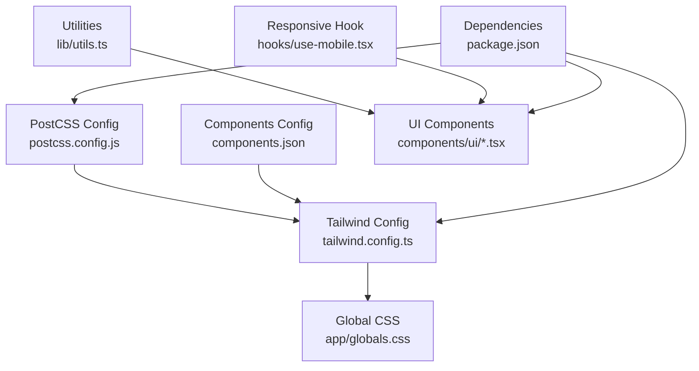
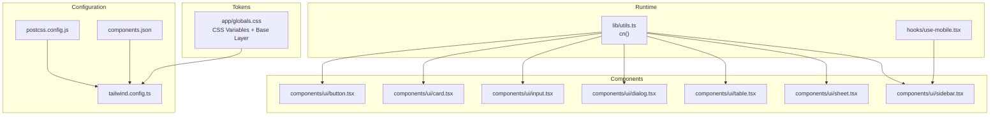
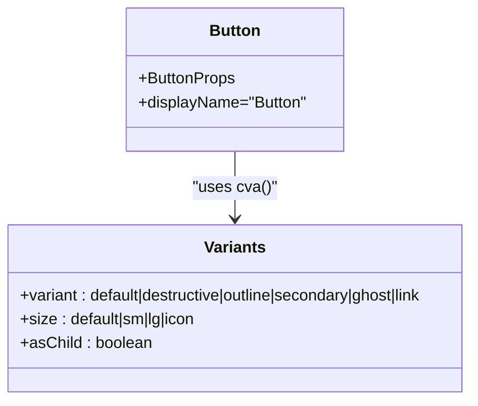
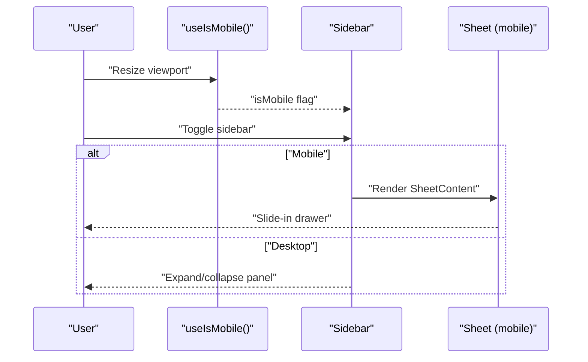
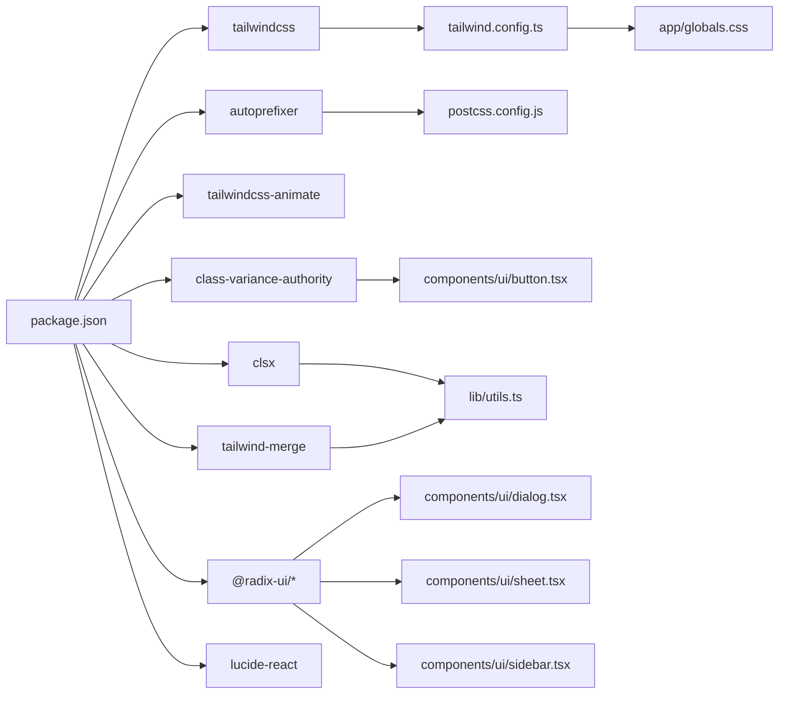

# Styling and Theming

<cite>
**Referenced Files in This Document**
- [tailwind.config.ts](file://tailwind.config.ts)
- [postcss.config.js](file://postcss.config.js)
- [app/globals.css](file://app/globals.css)
- [components.json](file://components.json)
- [package.json](file://package.json)
- [lib/utils.ts](file://lib/utils.ts)
- [hooks/use-mobile.tsx](file://hooks/use-mobile.tsx)
- [components/ui/button.tsx](file://components/ui/button.tsx)
- [components/ui/card.tsx](file://components/ui/card.tsx)
- [components/ui/input.tsx](file://components/ui/input.tsx)
- [components/ui/dialog.tsx](file://components/ui/dialog.tsx)
- [components/ui/table.tsx](file://components/ui/table.tsx)
- [components/ui/sheet.tsx](file://components/ui/sheet.tsx)
- [components/ui/sidebar.tsx](file://components/ui/sidebar.tsx)
</cite>

## Table of Contents
1. [Introduction](#introduction)
2. [Project Structure](#project-structure)
3. [Core Components](#core-components)
4. [Architecture Overview](#architecture-overview)
5. [Detailed Component Analysis](#detailed-component-analysis)
6. [Dependency Analysis](#dependency-analysis)
7. [Performance Considerations](#performance-considerations)
8. [Troubleshooting Guide](#troubleshooting-guide)
9. [Conclusion](#conclusion)
10. [Appendices](#appendices)

## Introduction
This document explains the styling and theming system of the application. It covers the Tailwind CSS configuration, design tokens, dark mode, responsive design patterns, and component styling approaches. It also documents how design tokens are used via CSS variables, how variants are implemented with class-variance-authority, and how utility-first CSS is applied consistently across components. Finally, it provides guidelines for extending the design system and maintaining visual consistency.

## Project Structure
The styling system is organized around:
- Tailwind configuration that defines design tokens and theme extensions
- Global CSS that registers CSS variables and base styles
- PostCSS pipeline enabling Tailwind and autoprefixing
- UI components that apply design tokens and variants
- Utilities for merging classes and shared helpers

**Diagram sources**
- [tailwind.config.ts:1-106](file://tailwind.config.ts#L1-L106)
- [app/globals.css:1-102](file://app/globals.css#L1-L102)
- [postcss.config.js:1-7](file://postcss.config.js#L1-L7)
- [components.json:1-25](file://components.json#L1-L25)
- [lib/utils.ts:1-26](file://lib/utils.ts#L1-L26)
- [hooks/use-mobile.tsx:1-20](file://hooks/use-mobile.tsx#L1-L20)
- [package.json:1-44](file://package.json#L1-L44)

**Section sources**
- [tailwind.config.ts:1-106](file://tailwind.config.ts#L1-L106)
- [app/globals.css:1-102](file://app/globals.css#L1-L102)
- [postcss.config.js:1-7](file://postcss.config.js#L1-L7)
- [components.json:1-25](file://components.json#L1-L25)
- [lib/utils.ts:1-26](file://lib/utils.ts#L1-L26)
- [hooks/use-mobile.tsx:1-20](file://hooks/use-mobile.tsx#L1-L20)
- [package.json:1-44](file://package.json#L1-L44)

## Core Components
- Design tokens via CSS variables in global CSS define semantic color roles and radii
- Tailwind theme maps tokens to utility classes and extends animation/keyframes
- Dark mode is implemented via a class strategy and toggled by applying a selector
- Utility-first approach uses design tokens and responsive modifiers
- Variants are defined per component using class-variance-authority for consistent styling
- Responsive patterns use mobile-first breakpoints and a dedicated hook

**Section sources**
- [app/globals.css:5-88](file://app/globals.css#L5-L88)
- [tailwind.config.ts:12-101](file://tailwind.config.ts#L12-L101)
- [components/ui/button.tsx:7-35](file://components/ui/button.tsx#L7-L35)
- [hooks/use-mobile.tsx:3-18](file://hooks/use-mobile.tsx#L3-L18)

## Architecture Overview
The styling architecture ties together configuration, tokens, and components:

**Diagram sources**
- [tailwind.config.ts:1-106](file://tailwind.config.ts#L1-L106)
- [postcss.config.js:1-7](file://postcss.config.js#L1-L7)
- [components.json:1-25](file://components.json#L1-L25)
- [app/globals.css:1-102](file://app/globals.css#L1-L102)
- [lib/utils.ts:1-6](file://lib/utils.ts#L1-L6)
- [hooks/use-mobile.tsx:1-20](file://hooks/use-mobile.tsx#L1-L20)
- [components/ui/button.tsx:1-58](file://components/ui/button.tsx#L1-L58)
- [components/ui/card.tsx:1-77](file://components/ui/card.tsx#L1-L77)
- [components/ui/input.tsx:1-23](file://components/ui/input.tsx#L1-L23)
- [components/ui/dialog.tsx:1-123](file://components/ui/dialog.tsx#L1-L123)
- [components/ui/table.tsx:1-121](file://components/ui/table.tsx#L1-L121)
- [components/ui/sheet.tsx:1-141](file://components/ui/sheet.tsx#L1-L141)
- [components/ui/sidebar.tsx:1-774](file://components/ui/sidebar.tsx#L1-L774)

## Detailed Component Analysis

### Tailwind Configuration and Theme Extensions
- Dark mode strategy uses a class applied to the root element
- Content paths scan pages, components, app, and src for tree-shaking
- Theme extends:
  - Container centering and padding with a 2xl breakpoint
  - Semantic color roles mapped to CSS variables
  - Border radius tokens bound to CSS variable
  - Accordion animations via keyframes and animation durations
- Plugins include tailwindcss-animate

**Section sources**
- [tailwind.config.ts:3-106](file://tailwind.config.ts#L3-L106)

### Global CSS Tokens and Base Styles
- CSS variables define semantic roles for background, foreground, primary, secondary, muted, accent, destructive, borders, input, ring, chart palette, and sidebar tokens
- Light and dark themes switch variable values under a selector
- Base layer applies border and text colors globally and sets up a theme animation for a “shine” effect
- Responsive typography and input focus states are applied at the base layer

**Section sources**
- [app/globals.css:5-88](file://app/globals.css#L5-L88)
- [app/globals.css:90-102](file://app/globals.css#L90-L102)

### Utility Functions
- cn merges clsx and tailwind-merge to deduplicate and merge conflicting classes safely
- Additional helpers include year options and Indonesian Rupiah formatting

**Section sources**
- [lib/utils.ts:1-6](file://lib/utils.ts#L1-L6)

### Button Component with Variants
- Uses class-variance-authority to define variant and size combinations
- Applies focus ring, transitions, and SVG sizing/shrinking consistently
- Supports asChild pattern via Radix Slot for composition

**Diagram sources**
- [components/ui/button.tsx:7-35](file://components/ui/button.tsx#L7-L35)

**Section sources**
- [components/ui/button.tsx:1-58](file://components/ui/button.tsx#L1-L58)

### Card Component Family
- Card, CardHeader, CardTitle, CardDescription, CardContent, CardFooter compose a consistent card layout
- Uses semantic color tokens for background and text

**Section sources**
- [components/ui/card.tsx:1-77](file://components/ui/card.tsx#L1-L77)

### Input Component
- Inherits border, background, placeholder, and focus ring tokens
- Includes responsive text sizing and focus-visible ring behavior

**Section sources**
- [components/ui/input.tsx:1-23](file://components/ui/input.tsx#L1-L23)

### Dialog Component
- Overlay and content animate in/out with fade and slide transitions
- Uses semantic tokens for background and ring focus

**Section sources**
- [components/ui/dialog.tsx:1-123](file://components/ui/dialog.tsx#L1-L123)

### Table Component
- Wraps the table in a scroll container and applies hover and selected states
- Uses semantic tokens for borders and muted backgrounds

**Section sources**
- [components/ui/table.tsx:1-121](file://components/ui/table.tsx#L1-L121)

### Sheet Component (Drawer/Off-canvas)
- Implements side-specific variants with slide transitions
- Uses semantic tokens for background and focus rings

**Section sources**
- [components/ui/sheet.tsx:1-141](file://components/ui/sheet.tsx#L1-L141)

### Sidebar Component (Responsive Navigation)
- Mobile detection via a media-query-based hook
- Supports offcanvas, icon-collapse, and floating/inset variants
- Uses CSS variables for widths and responsive adjustments
- Integrates with Radix UI dialogs for mobile behavior

**Diagram sources**
- [hooks/use-mobile.tsx:3-18](file://hooks/use-mobile.tsx#L3-L18)
- [components/ui/sidebar.tsx:201-222](file://components/ui/sidebar.tsx#L201-L222)
- [components/ui/sidebar.tsx:225-267](file://components/ui/sidebar.tsx#L225-L267)

**Section sources**
- [hooks/use-mobile.tsx:1-20](file://hooks/use-mobile.tsx#L1-L20)
- [components/ui/sidebar.tsx:1-774](file://components/ui/sidebar.tsx#L1-L774)

## Dependency Analysis
- Tailwind CSS and plugins are configured via Tailwind and PostCSS
- UI components depend on design tokens and utility functions
- Sidebar depends on the mobile hook and Radix UI primitives
- shadcn/ui registry configuration aligns with Tailwind config and CSS variables

**Diagram sources**
- [package.json:11-42](file://package.json#L11-L42)
- [tailwind.config.ts:1-106](file://tailwind.config.ts#L1-L106)
- [postcss.config.js:1-7](file://postcss.config.js#L1-L7)
- [app/globals.css:1-102](file://app/globals.css#L1-L102)
- [lib/utils.ts:1-6](file://lib/utils.ts#L1-L6)
- [components/ui/button.tsx:1-58](file://components/ui/button.tsx#L1-L58)
- [components/ui/dialog.tsx:1-123](file://components/ui/dialog.tsx#L1-L123)
- [components/ui/sheet.tsx:1-141](file://components/ui/sheet.tsx#L1-L141)
- [components/ui/sidebar.tsx:1-774](file://components/ui/sidebar.tsx#L1-L774)

**Section sources**
- [package.json:11-42](file://package.json#L11-L42)
- [tailwind.config.ts:1-106](file://tailwind.config.ts#L1-L106)
- [postcss.config.js:1-7](file://postcss.config.js#L1-L7)
- [app/globals.css:1-102](file://app/globals.css#L1-L102)
- [lib/utils.ts:1-6](file://lib/utils.ts#L1-L6)
- [components/ui/button.tsx:1-58](file://components/ui/button.tsx#L1-L58)
- [components/ui/dialog.tsx:1-123](file://components/ui/dialog.tsx#L1-L123)
- [components/ui/sheet.tsx:1-141](file://components/ui/sheet.tsx#L1-L141)
- [components/ui/sidebar.tsx:1-774](file://components/ui/sidebar.tsx#L1-L774)

## Performance Considerations
- Tree shaking: Tailwind content paths limit scanned files for efficient purging
- CSS variables: Centralized token updates propagate instantly without rebuilding
- Utility-first reduces custom CSS bloat and leverages compiled utilities
- Animations: CSS keyframes and transitions are scoped to components to avoid global overhead
- Merge utilities: Using the merge utility avoids redundant classes and keeps DOM light

[No sources needed since this section provides general guidance]

## Troubleshooting Guide
- Dark mode not applying:
  - Ensure the class strategy is set and the selector is present on the root element
  - Verify CSS variables switch under the dark selector
- Variants not rendering:
  - Confirm variant and size props match cva definitions
  - Ensure cn merges classes correctly and does not drop required tokens
- Responsive behavior:
  - Check the mobile breakpoint and media query logic
  - Validate that sidebar renders Sheet on small screens and fixed layout on larger
- Build errors:
  - Confirm Tailwind and PostCSS versions satisfy Next.js expectations
  - Ensure components.json matches Tailwind config and CSS variables are enabled

**Section sources**
- [tailwind.config.ts:3-106](file://tailwind.config.ts#L3-L106)
- [app/globals.css:42-78](file://app/globals.css#L42-L78)
- [components/ui/button.tsx:7-35](file://components/ui/button.tsx#L7-L35)
- [lib/utils.ts:1-6](file://lib/utils.ts#L1-L6)
- [hooks/use-mobile.tsx:3-18](file://hooks/use-mobile.tsx#L3-L18)
- [components/ui/sidebar.tsx:201-222](file://components/ui/sidebar.tsx#L201-L222)

## Conclusion
The styling and theming system is built on a robust foundation of CSS variables, Tailwind configuration, and utility-first components. Design tokens unify color, typography, and spacing, while class-variance-authority ensures consistent variant styling. Dark mode and responsive patterns are implemented with minimal overhead and maximum flexibility. Following the extension guidelines below will help maintain visual consistency across the application.

[No sources needed since this section summarizes without analyzing specific files]

## Appendices

### Color Palette and Tokens
- Semantic roles: background, foreground, primary, secondary, muted, accent, destructive, popover, card, border, input, ring
- Sidebar-specific roles: background, foreground, primary, primary-foreground, accent, accent-foreground, border, ring
- Chart palette: 5 distinct hues for data visualization
- Radius token: unified border radius controlled via CSS variable

**Section sources**
- [app/globals.css:6-40](file://app/globals.css#L6-L40)
- [app/globals.css:42-75](file://app/globals.css#L42-L75)
- [tailwind.config.ts:21-72](file://tailwind.config.ts#L21-L72)

### Typography and Spacing Scale
- Typography: rely on semantic tokens and default base layer; adjust sizes with responsive modifiers
- Spacing: use Tailwind spacing utilities; radius token controls corner rounding

**Section sources**
- [app/globals.css:81-88](file://app/globals.css#L81-L88)
- [tailwind.config.ts:73-77](file://tailwind.config.ts#L73-L77)

### Responsive Breakpoints and Mobile-First
- Mobile-first design: default styles apply to small screens; use responsive prefixes for larger screens
- Mobile detection hook: media query-driven breakpoint at 768px
- Sidebar adapts to offcanvas drawer on small screens and fixed panel on larger

**Section sources**
- [hooks/use-mobile.tsx:3-18](file://hooks/use-mobile.tsx#L3-L18)
- [components/ui/sidebar.tsx:201-222](file://components/ui/sidebar.tsx#L201-L222)
- [components/ui/sidebar.tsx:225-267](file://components/ui/sidebar.tsx#L225-L267)

### Variant Systems with class-variance-authority
- Define variants and sizes per component
- Use default variants to ensure consistent fallbacks
- Compose with cn to merge additional classes safely

**Section sources**
- [components/ui/button.tsx:7-35](file://components/ui/button.tsx#L7-L35)
- [components/ui/sheet.tsx:33-50](file://components/ui/sheet.tsx#L33-L50)
- [components/ui/sidebar.tsx:524-544](file://components/ui/sidebar.tsx#L524-L544)

### Extending the Design System
- Add new semantic tokens in global CSS variables
- Extend Tailwind theme with new colors, spacing, or animation keyframes
- Create new components with consistent variants and tokens
- Keep utilities centralized in cn and shared helpers

**Section sources**
- [app/globals.css:5-88](file://app/globals.css#L5-L88)
- [tailwind.config.ts:20-100](file://tailwind.config.ts#L20-L100)
- [lib/utils.ts:1-6](file://lib/utils.ts#L1-L6)